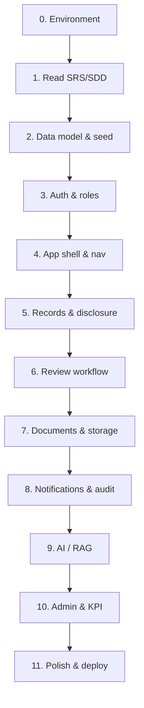

# IRIS — Step-by-Step Development Guide

A practical roadmap for building **IRIS** (Intelligent Research & IP System) at CIT-U: environment setup, documentation workflow, feature order, and quality gates. Use this with the official SRS/SDD and the linked docs below.

---

## Documentation map

Keep these in sync as you build. When behavior changes, update the doc in the same PR.

| Document | Location | Purpose |
|----------|----------|---------|
| **Documentation hub** | `docs/README.md` | Index of all engineering docs |
| **This guide** | `docs/DEVELOPMENT_GUIDE.md` | End-to-end dev process & phases |
| **Software engineering plan** | `docs/SOFTWARE_ENGINEERING_PLAN.md` | Scope, WBS, milestones, open decisions |
| **SDLC process** | `docs/SDLC_PROCESS.md` | Phases, gates, branching, release |
| **Security overview** | `docs/SECURITY.md` | Controls, threat summary, NFR-S |
| **Security risk register** | `docs/SECURITY_RISK_REGISTER.md` | Rated risks and mitigations |
| **Test plan** | `docs/TEST_PLAN.md` | Verification strategy, role matrix, UAT |
| **Traceability matrix** | `docs/TRACEABILITY_MATRIX.md` | FR/NFR → implementation & test status |
| **Changelog** | `CHANGELOG.md` | Release notes |
| **README** | `README.md` | Quick start, env vars, run commands |
| **SRS** | `IRIS Software Engineering_SRS.pdf` | *What* the system must do (FR-*, NFR-*) |
| **SDD** | `IRIS Software Engineering_SDD.pdf` | *How* to implement (UI, APIs, components) |
| **Frontend plan** | `frontend/docs/FRONTEND_IMPLEMENTATION.md` | UI tasks, wireframes, routes, design tokens |
| **Backend env** | `backend/.env.example` | Required secrets & services |
| **API (informal)** | Django URLs + DRF browsable API | `http://localhost:8000/api/` when running |

**Recommended additions as you grow:**

| Document | Suggested path | When to add |
|----------|----------------|-------------|
| API reference | `docs/API.md` or OpenAPI/Swagger | After auth + records APIs stabilize |
| Database seed guide | `docs/DATABASE_SEED.md` | When colleges/courses/roles are seeded |
| Wireframes / Figma | `docs/design/` or external link | Link from frontend plan |
| UAT results | `docs/test-results/` | After each UAT cycle |

---

## High-level build order

Follow this sequence so each layer has something to plug into.



| Phase | Focus | SRS modules | Outcome |
|-------|--------|-------------|---------|
| **0** | Tooling & run locally | — | Everyone can run FE + BE + DB |
| **1** | Requirements traceability | All | FR checklist per sprint |
| **2** | DB, roles, reference data | 3.1 | Login works with real roles |
| **3** | Authentication UI + API | M1, M6 | Register → verify → login → JWT |
| **4** | App shell | M1 | Sidebar, header, RBAC routes |
| **5** | IP disclosure & records | M1, M5 | Submit & list records |
| **6** | Review pipeline | M5 | Approve / decline / return |
| **7** | Files | M1, M2 | Uploads, folder browser |
| **8** | Notifications, audit | M6 | In-app alerts, audit log UI |
| **9** | AI | M2–M4 | Chatbot, summarize, indexing status |
| **10** | Admin & dashboard | M7 | Users, role requests, KPI |
| **11** | NFRs & production | NFR-* | HTTPS, idle logout, mobile, deploy |

---

## Phase 0 — Environment setup (Day 1)

**Goal:** Any developer can run the full stack on Windows/macOS/Linux.

### Step 0.1 — Install prerequisites

- Python **3.11+**
- Node.js **18+**
- PostgreSQL **14+**
- Redis (for Celery)
- Git

Optional: Docker Desktop (use repo `docker-compose.yml` later).

### Step 0.2 — Clone and branch strategy

```bash
git clone <repo-url>
cd IRIS
git checkout -b feature/<your-feature>
```

Suggested branches:

- `main` — stable, deployable
- `develop` — integration (if team uses it)
- `feature/*` — one FR or screen per branch when possible

### Step 0.3 — Database

```sql
CREATE USER iris_user WITH PASSWORD 'iris_password';
CREATE DATABASE iris_db OWNER iris_user;
GRANT ALL PRIVILEGES ON DATABASE iris_db TO iris_user;
```

### Step 0.4 — Backend

```bash
cd backend
python -m venv venv
venv\Scripts\activate          # Windows
pip install -r requirements/development.txt
```

Copy `backend/.env.example` → `backend/.env` and set at least:

- `SECRET_KEY`
- `DEBUG=True`
- DB_* variables
- `FRONTEND_URL=http://localhost:5173`

```bash
python manage.py migrate
python manage.py createsuperuser
# Mark verified (see README.md)
python manage.py runserver
```

Verify: `http://localhost:8000/admin/`

### Step 0.5 — Frontend

```bash
cd frontend
npm install
npm run dev
```

Verify: `http://localhost:5173/login`

> Run commands from **`frontend/`**, not the repo root (`npm run dev` fails at root).

### Step 0.6 — Celery (when testing email)

```bash
cd backend
venv\Scripts\activate
celery -A config worker -l info
```

### Step 0.7 — Smoke checklist

- [ ] Backend `/api/` or admin loads
- [ ] Frontend login page renders
- [ ] Superuser can log in (after `is_verified=True`)
- [ ] No CORS/proxy errors (Vite proxies `/api` → `:8000`)

---

## Phase 1 — Requirements & design (before coding features)

**Goal:** Every task traces to an SRS ID; UI matches wireframes.

### Step 1.1 — Read the SRS section for your module

Example for login:

- **FR-M1-01** — User login & session (email/password, JWT, role dashboard, 3-strike lockout, 15 min)
- **NFR-S2** — 30 min idle session expiry
- **NFR-U3** — Mobile 360px+

### Step 1.2 — Read the matching SDD section

- Module 1: `LoginForm`, `AuthView`, wireframes (default / error / lockout)
- Module 6: JWT lifecycle, `SessionExpiryModal`

### Step 1.3 — Create a short feature note (optional template)

For each feature, add a block in your PR or `docs/features/FR-M1-01-login.md`:

```markdown
## FR-M1-01 Login
- SRS: [quote main flow + alt flows]
- SDD components: LoginForm, AuthView
- API: POST /api/auth/login/
- UI states: default | invalid | locked | session expired
- Test cases: ...
- Done when: ...
```

### Step 1.4 — Traceability table (sprint board)

| FR-ID | Page / API | Status | Owner |
|-------|------------|--------|-------|
| FR-M1-01 | `/login` | Done | — |
| FR-M1-02 | `/records/add` | Todo | — |
| … | … | … | … |

Copy rows from SRS §3.2 functional requirements.

---

## Phase 2 — Backend foundation

**Goal:** Roles, colleges, courses, and permissions match SRS actors.

### Step 2.1 — Seed reference data

Create a data migration or management command for:

- **Roles:** Student, Adviser, KTTO, RDCO, ITSO, IERC (`accounts.Role`)
- **Colleges / departments / courses** (align with `frontend/src/lib/signupData.ts` IDs or load signup from API)
- Classifications, record types (if used in forms)

Document commands in `docs/DATABASE_SEED.md` when added.

### Step 2.2 — Verify permissions

Backend constants: `backend/core/permissions.py`

- `REVIEWER_ROLES`, `STAFF_ROLES` must match frontend `lib/constants.ts`
- Test each role with Django admin or API token

### Step 2.3 — API conventions

- Base path: `/api/`
- Auth header: `Authorization: Bearer <access>`
- Errors: `{ "detail": "..." }` or field errors `{ "email": ["..."] }`
- Pagination: follow `core.pagination` patterns

### Step 2.4 — Document new endpoints

When adding an endpoint, append to `docs/API.md`:

- Method, path, auth, request body, response, error codes

---

## Phase 3 — Authentication (current status: mostly UI done)

**Goal:** Full register → verify → login → protected routes.

| Step | Task | SRS | Status |
|------|------|-----|--------|
| 3.1 | Login UI + wireframe states | FR-M1-01 | Done |
| 3.2 | Signup + email verify UI | Extension | Done |
| 3.3 | Error alert, session banner, lock modal | FR-M1-01, NFR-S2 | Done |
| 3.4 | Signup loads colleges/courses from API | — | Todo |
| 3.5 | Role request approval UI (admin) | README note | Todo |
| 3.6 | Password reset | — | Todo |
| 3.7 | 30 min idle logout in `AppShell` | NFR-S2 | Todo |
| 3.8 | DPA consent modal before disclosure | FR-M6-02 | Todo |

**Dev flow per auth change:**

1. Implement API behavior in `apps/accounts/`
2. Update `frontend/src/api/auth.ts` + types
3. Update page or `components/auth/*`
4. Manual test all wireframe states
5. Update `frontend/docs/FRONTEND_IMPLEMENTATION.md`

---

## Phase 4 — App shell & navigation

**Goal:** Authenticated layout matches Discover wireframe; RBAC hides nav items.

### Step 4.1 — Layout components

- `AppShell`, `Sidebar`, `Header`, `PageHeader`
- Rebrand: IRIS / CIT-U Research Hub, grouped nav (Research / IP Management)

### Step 4.2 — Routing & guards

- `PrivateRoute` — must be logged in
- `RoleRoute` — must have allowed role (`router/index.tsx`)

### Step 4.3 — Discover / dashboard (landing)

See `frontend/docs/FRONTEND_IMPLEMENTATION.md` Phase 2.

1. Build static layout from wireframe
2. Wire hero search to `/ai` or search results
3. Wire spotlight cards to `GET /api/records/`
4. Test at 360px width (NFR-U3)

---

## Phase 5 — Records & IP disclosure

**Goal:** Students submit disclosures; data enters workflow as `draft` → `adviser_review`.

### Step 5.1 — Disclosure form (FR-M1-02)

Fields per SRS:

- Title, Abstract (500 chars + counter), Inventors (tags), Document type, auto date, PDF upload

Files: `AddRecordPage.tsx`, `recordFormSchema.ts`, `documents` API.

### Step 5.2 — List & detail pages

- Published, My Records, Record detail, edit
- `StatusBadge` + `pipeline_status` from API

### Step 5.3 — Backend alignment

- `records.services` updates pipeline on review actions
- Validate file size/type (PDF, 50MB per SRS indexing module)

**Definition of done:**

- [ ] Student can submit full disclosure on mobile width
- [ ] Record appears in “My Records” with correct status
- [ ] PDF stored and linked in documents app

---

## Phase 6 — Review workflow (Module 5)

**Goal:** Hierarchical approval chain (Adviser → KTTO → ITSO → IERC → RDCO per SRS; confirm order with stakeholders).

### Step 6.1 — Reviewer queues

- Pending / Approved / Declined pages (exist — polish UI + API filters)

### Step 6.2 — Evaluation page

- Approve, decline, return for revision (mandatory comment on return)

### Step 6.3 — Notifications

- Trigger in-app notification on status change (`notifications` app)

---

## Phase 7 — Documents & storage

- Per-record uploads (`DocumentsPage`, `FileUploadZone`)
- Folder browser (`storage` app)
- Download permissions per role (FR-M6-03)

---

## Phase 8 — Notifications & audit

- Notifications page + bell badge in header
- Audit log for staff (`FR-M6` / NFR-S5 immutability — UI read-only)

---

## Phase 9 — AI features (Modules 2–4)

**Order:** indexing → notifications → chatbot → summarizer.

1. PDF upload triggers extraction (backend `ai` tasks)
2. Show indexing status in UI (FR-M2-03)
3. RAG chatbot page (FR-M3-01)
4. Summarize on record detail (FR-M4-01)
5. Banner when AI services unavailable (SRS constraint)

Do not block core workflow on AI; non-AI paths must work offline from AI.

---

## Phase 10 — Admin & KPI dashboard (Module 7)

- User list, lock/unlock
- Role request approve/decline
- KPI / pipeline dashboard (when SRS Module 7 is in scope)

---

## Phase 11 — Quality, security & deployment

### Non-functional checklist (from SRS §3.3)

| NFR | Action |
|-----|--------|
| NFR-S2 | 30 min idle logout (frontend timer + token refresh failure) |
| NFR-S3 | HTTPS in production |
| NFR-S4 | Never trust UI-only RBAC — test API with wrong role |
| NFR-S5 | Audit log not deletable from UI |
| NFR-U3 | Test 360px on login, disclosure, chatbot |
| NFR-P* | Load test critical endpoints if required |

### Testing layers

1. **Manual** — wireframe states, role matrix (student cannot hit RDCO APIs)
2. **API** — Postman/httpx or DRF tests for auth and workflow transitions
3. **Frontend** — component tests for forms (optional); E2E for login → submit (Playwright later)

### Pre-deploy

- [ ] `DEBUG=False`, strong `SECRET_KEY`, `ALLOWED_HOSTS`
- [ ] Migrations applied on production DB
- [ ] Celery + Redis running
- [ ] SMTP for verification emails
- [ ] `FRONTEND_URL` points to production domain
- [ ] Build frontend: `npm run build` + Nginx/static per `frontend/nginx.conf`
- [ ] Gunicorn + Nginx per `docker-compose.yml` / Dockerfile

---

## Recommended weekly rhythm (small team)

| Day | Focus |
|-----|--------|
| Mon | Pick 1–2 FR-IDs; read SRS/SDD; update traceability table |
| Tue–Wed | Backend API + tests |
| Thu–Fri | Frontend UI + wireframe review |
| Fri | Demo + update docs (`FRONTEND_IMPLEMENTATION.md`, `API.md`) |

---

## Per-feature workflow (copy for every task)

1. **Pick** FR-ID from SRS  
2. **Read** SRS use case + SDD UI/components  
3. **Design** — sketch or wireframe if missing  
4. **API first** — serializer, view, url, permission class  
5. **Frontend** — types, `api/*.ts`, page, shared components  
6. **Test** — happy path + SRS alternative flows  
7. **Document** — update relevant `.md` in same PR  
8. **Review** — peer checks RBAC and mobile layout  

---

## Quick links in this repo

| Resource | Path |
|----------|------|
| Run instructions | `README.md` |
| Frontend task list | `frontend/docs/FRONTEND_IMPLEMENTATION.md` |
| Auth components | `frontend/src/components/auth/` |
| Router | `frontend/src/router/index.tsx` |
| SRS (source of truth) | `IRIS Software Engineering_SRS.pdf` |
| SDD (design detail) | `IRIS Software Engineering_SDD.pdf` |

---

## Current snapshot (May 2026)

**Completed:** Auth pages (login, signup, email verify), auth modals/alerts, shared `lib/`, basic app routes and many placeholder pages.

**Next recommended steps:**

1. Seed roles + colleges/courses in DB; wire signup to `/api/colleges/` etc.  
2. App shell rebrand + Discover dashboard layout  
3. IP disclosure form (FR-M1-02) end-to-end  
4. Role request admin page  
5. `docs/API.md` + `docs/DATABASE_SEED.md`  

---

*This guide is a living document. Update the “Current snapshot” section when major milestones ship.*
