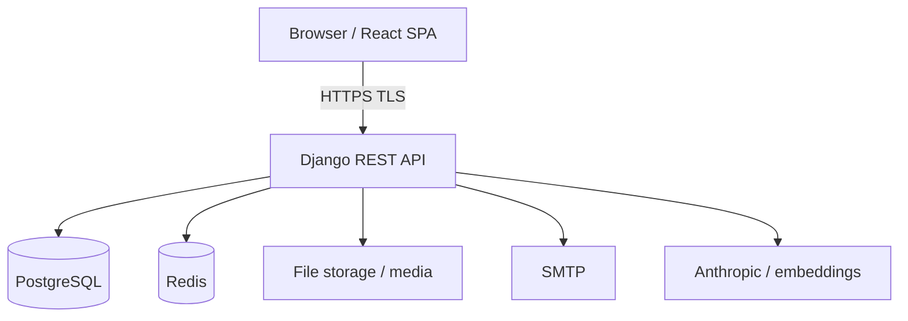

# IRIS — Security Overview

Security architecture and controls for IRIS, mapped to **SRS Module 6** and **non-functional requirements NFR-S1 through NFR-S5**. Operational threats and mitigations are tracked in [SECURITY_RISK_REGISTER.md](SECURITY_RISK_REGISTER.md).

---

## 1. Security objectives

| Objective | SRS reference |
|-----------|---------------|
| Authenticate users securely | FR-M6-01, FR-M1-01 |
| Limit session lifetime and brute force | FR-M1-01, NFR-S2 |
| Enforce role boundaries on every action | FR-M6-03, NFR-S4 |
| Protect data in transit and at rest | NFR-S3, NFR-S1 |
| Maintain tamper-evident audit trail | FR-M6-02, NFR-S5 |
| Privacy consent before sensitive processing | FR-M6-02 |

---

## 2. Threat model (summary)

**Assets:** user credentials, JWTs, IP/research records, PDFs, audit logs, AI prompts/responses, admin actions.

**Trust boundaries:**

**Primary threats:**

- Stolen or forged JWT  
- Credential stuffing / brute force login  
- Horizontal privilege escalation (access another user’s record)  
- Vertical privilege escalation (student approves workflow stage)  
- Unauthorized workflow stage transition (SRS alt flow)  
- XSS stealing tokens from browser storage  
- SQL injection (mitigated by ORM)  
- Leaked secrets in repo or logs  
- Unencrypted transport or disk  
- Audit log tampering or deletion  

Detailed scoring: [SECURITY_RISK_REGISTER.md](SECURITY_RISK_REGISTER.md).

---

## 3. Authentication and session

### 3.1 Mechanism

| Component | Implementation |
|-----------|----------------|
| Protocol | Stateless **JWT** (SimpleJWT): access + refresh |
| Login | Email/password → access token in `Authorization: Bearer` |
| Refresh | Rotating refresh tokens; blacklist after rotation |
| Lockout | **django-axes**: 3 failures → 15 min lock (FR-M1-01) |
| Frontend lockout UX | `authSession.ts`, `AccountLockedModal` |
| Session expiry | NFR-S2: **30 min inactivity** — frontend timer + redirect; align access token TTL with policy |

### 3.2 Configuration (environment)

| Variable | Purpose |
|----------|---------|
| `SECRET_KEY` | Django signing |
| `JWT_ACCESS_TOKEN_LIFETIME_MINUTES` | Access token life (default 60 — align with 30 min idle policy) |
| `JWT_REFRESH_TOKEN_LIFETIME_DAYS` | Refresh life |
| `AXES_FAILURE_LIMIT` | Lockout threshold (default 3) |

### 3.3 Secure practices

- Use **generic** login errors (“Invalid email or password”) — do not reveal if email exists.  
- Log lockout events to **audit** trail (backend).  
- On logout: discard tokens client-side; optional server-side refresh blacklist.  
- **Never** log passwords or full JWTs.

---

## 4. Authorization (RBAC)

### 4.1 Model

- Each user has one **Role** (`Student`, `Adviser`, `KTTO`, `RDCO`, `ITSO`, `TBI`).  
- DRF default: `IsAuthenticated`; views add `IsStudent`, `IsReviewer`, `IsStaff`, etc.  
- Frontend: `PrivateRoute`, `RoleRoute` — **UI only**; must mirror API checks (NFR-S4).

### 4.2 Rules

| Rule | Enforcement |
|------|-------------|
| Role cannot approve wrong pipeline stage | Backend state machine + permission (FR-M5-01 alt) |
| Student cannot access admin APIs | Permission classes |
| Staff cannot export restricted fields | Serializer fields + permissions |
| 403 on bypass attempt | HTTP 403 + audit security warning (SRS) |

### 4.3 Verification

For each new endpoint, document in traceability matrix:

- Allowed roles  
- Test with **forbidden** role → expect 403  
- Test unauthenticated → 401  

---

## 5. Data protection

### 5.1 In transit (NFR-S3)

- **Production:** HTTPS only, TLS 1.2+  
- HSTS and secure cookies if cookie-based auth added later  
- Dev: localhost HTTP acceptable; never use dev CORS settings in prod (`CORS_ALLOW_ALL_ORIGINS` is dev-only)

### 5.2 At rest (NFR-S1)

| Data | Control |
|------|---------|
| PostgreSQL | Disk encryption per IT policy (OS/volume level) |
| Uploaded PDFs | Secured media root; access via authenticated API |
| Secrets | `.env` / secret manager — not in Git |
| Backups | Encrypted, access-restricted |

### 5.3 Privacy (FR-M6-02)

- DPA consent before IP disclosure processing  
- Consent + material actions logged to audit  
- Retention per institutional policy (align with NFR-S5 for audit)

---

## 6. Application security controls

| Control | Status | Notes |
|---------|--------|-------|
| CSRF | Django middleware | Less relevant for JWT API; relevant for admin/session |
| CORS | Restricted origins in prod | `FRONTEND_URL` |
| Rate limiting | DRF throttling | anon 100/day, user 1000/day — tune for prod |
| Input validation | Serializers + Zod on FE | File type/size for PDFs |
| File upload | Validate MIME/size | SRS ~50 MB max |
| Dependency scanning | Recommended | `pip audit`, `npm audit` in CI |
| Security headers | Nginx prod | `X-Content-Type-Options`, `X-Frame-Options`, CSP as feasible |
| Admin surface | `/admin/` | Strong passwords; staff only; separate from student UX |

---

## 7. Audit and logging (NFR-S5)

**Requirements:** retain audit events ≥ **12 months**; logs **immutable** from application UI.

| Event type | Examples |
|------------|----------|
| Authentication | Failed login, lockout, logout |
| Authorization | 403 stage bypass attempt |
| Workflow | Approve, decline, return for revision |
| Privacy | DPA consent granted |
| System | Failed external API (AI, SMTP) |

**Implementation:** `apps/audit/` — append-only from app perspective; no delete in UI; DB backups for retention.

---

## 8. AI-specific security

| Risk | Mitigation |
|------|------------|
| API key exposure | `ANTHROPIC_API_KEY` server-side only |
| Prompt injection via record text | Sanitize/limit context; staff-only features where needed |
| Data sent to third party | Institutional approval; disclose in DPA |
| Unavailable AI | Degrade gracefully; no auth bypass |

---

## 9. Secure development lifecycle (SDL)

Integrate security into [SDLC_PROCESS](SDLC_PROCESS.md):

1. **Requirements** — tag NFR-S* on stories  
2. **Design** — threat note per feature (update risk register)  
3. **Code** — PR security checklist below  
4. **Test** — role matrix + negative tests  
5. **Release** — deployment checklist §10  
6. **Operate** — patch dependencies; review axes/audit logs  

### 9.1 PR security checklist

- [ ] Authorization on all new endpoints  
- [ ] No secrets in code or frontend env  
- [ ] User input validated; files restricted  
- [ ] Errors do not leak stack traces to clients in production  
- [ ] Audit logging for sensitive actions  
- [ ] Traceability / risk register updated if needed  

---

## 10. Deployment security checklist

- [ ] `DEBUG=False`  
- [ ] Strong unique `SECRET_KEY`  
- [ ] `ALLOWED_HOSTS` minimal  
- [ ] HTTPS terminated at Nginx/load balancer  
- [ ] CORS limited to production frontend origin  
- [ ] Database credentials least-privilege  
- [ ] Redis not exposed publicly  
- [ ] Media served with auth check, not public listing  
- [ ] Celery workers same trust zone as API  
- [ ] SMTP credentials in vault  
- [ ] Regular OS and dependency patches  

---

## 11. NFR traceability (security)

| ID | Requirement | Implementation / plan |
|----|-------------|------------------------|
| NFR-S1 | Encryption at rest | IT volume encryption + secured media |
| NFR-S2 | 30 min inactivity logout | FE idle handler + token handling (todo in app shell) |
| NFR-S3 | TLS in transit | HTTPS in production |
| NFR-S4 | Role boundary enforcement | DRF permissions + API tests |
| NFR-S5 | Audit retention 12 mo, immutable UI | `audit` app; ops backup policy |

---

## 12. Incident response (pointer)

| Step | Action |
|------|--------|
| 1 | Identify scope (accounts, records, logs) |
| 2 | Contain (disable account, rotate `SECRET_KEY`/JWT if needed) |
| 3 | Preserve audit logs |
| 4 | Notify CIT-U IT / data protection contact |
| 5 | Post-incident update risk register |

---

## 13. References

- SRS Module 6, §3.3 NFR-S*  
- `backend/config/settings/base.py` — JWT, axes, CORS, throttle  
- `backend/core/permissions.py`  
- [SECURITY_RISK_REGISTER.md](SECURITY_RISK_REGISTER.md)  

---

*Document version 1.0 — May 2026*
