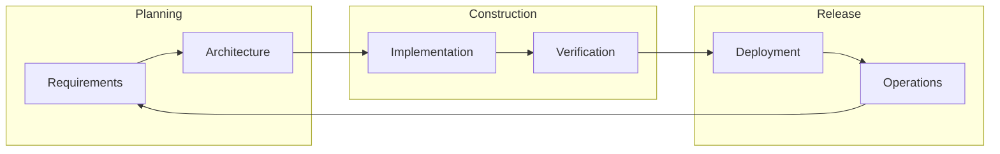

# IRIS — Software Engineering Plan

**Project:** Intelligent Research & IP System (IRIS)  
**Institution:** Cebu Institute of Technology – University (CIT-U)  
**Document version:** 1.0  
**Status:** Living document  
**Related:** SRS v1.0 (17/04/2026), SDD, [SDLC Process](SDLC_PROCESS.md), [Security](SECURITY.md)

---

## 1. Executive summary

IRIS is a web platform for managing research outputs and intellectual property: submission, hierarchical review, document storage, auditability, and AI-assisted discovery. This plan defines **how the team delivers** the system using a structured SDLC, aligned with the SRS, while explicitly managing **incomplete specifications** (notably **Module 5** — hierarchical workflow / RDCO–KTTO routing — and **Module 7** — KPI and role dashboards).

**Engineering goals**

| Goal | Measure |
|------|---------|
| Traceable requirements | Every shipped feature maps to SRS `FR-*` / `NFR-*` |
| Secure by design | Controls in [SECURITY.md](SECURITY.md); risks in [SECURITY_RISK_REGISTER](SECURITY_RISK_REGISTER.md) |
| Testable increments | [TEST_PLAN.md](TEST_PLAN.md) entry/exit per milestone |
| Maintainable codebase | API-first, shared RBAC constants, documented env & deploy |

---

## 2. Scope and boundaries

### 2.1 In scope (SRS modules)

| Module | SRS focus | Engineering priority | Spec stability |
|--------|-----------|----------------------|----------------|
| **M1** | Responsive UI, IP disclosure, login UX | **P0 — active** | Stable enough to implement |
| **M2** | RAG indexing | P2 — after core workflow | Medium |
| **M3** | Conversational chatbot | P2 | Medium |
| **M4** | Summarizer | P2 | Medium |
| **M5** | Hierarchical submission (Adviser → … → RDCO) | P1 — **API-first; UI generic** | **Draft / finalize with stakeholders** |
| **M6** | Security, JWT, DPA, RBAC, audit | **P0 — active** | Stable |
| **M7** | KPI pipeline, RDCO dashboards | P3 — after M5 frozen | **Draft** |

### 2.2 Out of scope (current phase)

- Production hosting contract and hardware procurement (document assumptions only).  
- Full IERC actor in UI until role list is confirmed in SRS.  
- Pixel-perfect KTTO routing / RDCO archiving wireframes (Figures 32–33) until Module 5 is signed off.  
- 1,000-user stress tier (NFR-P1 enterprise phase) until MVP baseline passes.

### 2.3 Assumptions

- PostgreSQL and Redis run on-prem or approved cloud per CIT-U IT policy.  
- Users have institutional email; verification via SMTP.  
- PDF is the primary document type (max ~50 MB per SRS indexing module).  
- Team size: small (2–6 developers); weekly sprints or milestone-based delivery.

### 2.4 Dependencies

| Dependency | Owner | Risk if unavailable |
|------------|-------|---------------------|
| Finalized M5 workflow order | Product / RDCO / KTTO | Rework review UI and state machine |
| Finalized M7 KPI metrics | RDCO | Dashboard scope creep |
| SMTP / email | IT | No verification emails |
| Anthropic / embedding stack | DevOps + dev | AI features degraded (non-blocking) |
| Stakeholder UAT windows | CIT-U | Delayed sign-off |

---

## 3. SDLC model

IRIS uses an **iterative incremental** lifecycle (agile-friendly), mapped to standard phases:

Detailed ceremonies, gates, and artifacts: [SDLC_PROCESS.md](SDLC_PROCESS.md).

---

## 4. Work breakdown structure (WBS)

### Phase 0 — Foundation (current)

| ID | Deliverable | Owner | Status |
|----|-------------|-------|--------|
| 0.1 | Repo structure, README, env templates | Dev | Done |
| 0.2 | Engineering docs (`docs/`) | Dev | In progress |
| 0.3 | Local run: DB + backend + frontend | Dev | In progress |
| 0.4 | Traceability matrix seeded | BA/Dev | Template ready |

### Phase 1 — Authentication & shell (P0)

| ID | Deliverable | SRS | Status |
|----|-------------|-----|--------|
| 1.1 | Login, lockout, session UX | FR-M1-01, NFR-S2 | UI done |
| 1.2 | Register, email verify | Extension + M6 | UI done |
| 1.3 | JWT API + axes lockout | FR-M6-01 | Backend exists |
| 1.4 | App shell, RBAC routes | FR-M6-03, NFR-U3 | Partial |
| 1.5 | Seed roles, colleges, courses | M1 actors | Todo |
| 1.6 | Role request admin | README policy | Todo |

### Phase 2 — Records & disclosure (P0)

| ID | Deliverable | SRS | Status |
|----|-------------|-----|--------|
| 2.1 | IP disclosure form (mobile) | FR-M1-02 | Partial |
| 2.2 | My / published / detail | M1 | Partial |
| 2.3 | Document upload per record | M1/M2 | Partial |
| 2.4 | DPA consent gateway | FR-M6-02 | Todo |

### Phase 3 — Workflow (P1, spec-gated)

| ID | Deliverable | SRS | Gate |
|----|-------------|-----|------|
| 3.1 | Pipeline state machine (backend) | FR-M5-01 | M5 sign-off |
| 3.2 | Generic reviewer queues | FR-M5-01 | Can start early |
| 3.3 | KTTO / RDCO specialized UI | Figures 32–33 | **Blocked on M5** |
| 3.4 | Notifications on transition | M5/M6 | After 3.1 |

### Phase 4 — AI (P2)

| ID | Deliverable | SRS |
|----|-------------|-----|
| 4.1 | PDF indexing pipeline | FR-M2-* |
| 4.2 | Chatbot UI | FR-M3-01 |
| 4.3 | Summarizer | FR-M4-01 |

### Phase 5 — Admin & KPI (P3, spec-gated)

| ID | Deliverable | SRS | Gate |
|----|-------------|-----|------|
| 5.1 | User admin, audit UI | M6, NFR-S5 | Open |
| 5.2 | RDCO KPI / Kanban dashboard | M7 | **Blocked on M7** |

### Phase 6 — Release & operations

| ID | Deliverable |
|----|-------------|
| 6.1 | Production config (HTTPS, secrets) |
| 6.2 | Load test MVP (NFR-P1, 100 users) |
| 6.3 | UAT package + sign-off |
| 6.4 | Runbook & backup restore drill |

---

## 5. Milestones and timeline (indicative)

Dates are **placeholders** — adjust per academic calendar and team capacity.

| Milestone | Target | Exit criteria |
|-----------|--------|---------------|
| **M0 — Engineering baseline** | Week 0–1 | Docs published; local stack runs; traceability started |
| **M1 — Auth complete** | Week 2–4 | FR-M1-01, FR-M6-01 satisfied; role matrix tested |
| **M2 — Disclosure MVP** | Week 5–8 | FR-M1-02 E2E; DPA stub or full per legal |
| **M3 — Workflow alpha** | TBD after M5 SRS | Generic approve/decline; API enforces stages |
| **M4 — AI beta** | TBD | Indexing + chatbot with fallback banner |
| **M5 — UAT** | TBD | Test plan executed; critical risks mitigated |
| **M6 — Production** | TBD | NFR-S3 HTTPS; NFR-S5 audit retention configured |

---

## 6. Roles and responsibilities (RACI summary)

| Activity | Student rep | Dev | QA | Product/RDCO | IT/Security |
|----------|-------------|-----|-----|----------------|-------------|
| SRS clarification | I | C | I | **A/R** | I |
| Architecture / SDD | I | **R** | C | A | C |
| Implementation | I | **R** | C | I | I |
| Code review | I | **R** | C | I | C |
| Security review | I | R | C | I | **A** |
| UAT | C | C | **R** | **A** | I |
| Deploy / ops | I | C | I | I | **A/R** |

*R = Responsible, A = Accountable, C = Consulted, I = Informed*

---

## 7. Architecture summary

| Layer | Technology | Notes |
|-------|------------|-------|
| Client | React 18, Vite, TS, Tailwind | RBAC via `RoleRoute`; tokens in storage |
| API | Django 5, DRF, SimpleJWT | Permissions in `core/permissions.py` |
| Data | PostgreSQL 14+ | Records, users, audit, workflow state |
| Async | Celery + Redis | Email, indexing tasks |
| AI | Anthropic + sentence-transformers | Optional path; degrade gracefully |
| Deploy | Docker Compose / Gunicorn + Nginx | See `docker-compose.yml` |

Security detail: [SECURITY.md](SECURITY.md).

---

## 8. Quality and testing strategy

- **Unit / API:** pytest-django (to be added) for auth, permissions, workflow transitions.  
- **Integration:** DRF + DB for pipeline state changes.  
- **Manual / UAT:** Wireframe states, role matrix per [TEST_PLAN.md](TEST_PLAN.md).  
- **E2E (later):** Playwright for login → submit → review.  
- **Performance:** JMeter 100 VU baseline (NFR-P1) before production.

Quality gates per phase: [SDLC_PROCESS.md](SDLC_PROCESS.md) § Quality gates.

---

## 9. Configuration and environment management

| Environment | Purpose | `DEBUG` | Data |
|-------------|---------|---------|------|
| **Local** | Developer machines | `True` | Seed / disposable DB |
| **Staging** | Integration, UAT | `False` | Anonymized or synthetic |
| **Production** | CIT-U live | `False` | Real data; backups |

Secrets only in `.env` / vault — never committed. See `backend/.env.example`.

---

## 10. Open decisions (spec uncertainty)

Record resolutions here when stakeholders decide.

| ID | Topic | Options | Decision | Date |
|----|-------|---------|----------|------|
| OD-01 | Full review chain order | SRS: Adviser→KTTO→ITSO→IERC→RDCO vs code: shorter pipeline | **Pending** | — |
| OD-02 | IERC role in UI and DB | Include / defer | **Pending** | — |
| OD-03 | KTTO routing fields (Fig. 32) | Minimal approve vs full routing form | **Pending** | — |
| OD-04 | RDCO KPI metrics (M7) | Kanban only vs full analytics | **Pending** | — |
| OD-05 | Digital signature capture | Checkbox + audit vs external signing | **Pending** | — |
| OD-06 | DPA consent legal text | Legal review required | **Pending** | — |

**Engineering rule until closed:** implement **generic** review queues and **API-driven** status labels; avoid role-specific dashboards for RDCO/KTTO.

---

## 11. Documentation deliverables

| Artifact | Location | When updated |
|----------|----------|--------------|
| Engineering plan | This file | Milestone / scope change |
| SDLC process | [SDLC_PROCESS.md](SDLC_PROCESS.md) | Process change |
| Security | [SECURITY.md](SECURITY.md) | New control or NFR |
| Risk register | [SECURITY_RISK_REGISTER.md](SECURITY_RISK_REGISTER.md) | Each sprint review |
| Test plan | [TEST_PLAN.md](TEST_PLAN.md) | Before UAT |
| Traceability | [TRACEABILITY_MATRIX.md](TRACEABILITY_MATRIX.md) | Per FR in PR |
| API reference | `docs/API.md` (future) | New endpoints |
| Changelog | [CHANGELOG.md](../CHANGELOG.md) | Each release |

---

## 12. Risk management (project level)

| Risk | Impact | Mitigation |
|------|--------|------------|
| M5/M7 SRS change | Rework UI and API | Generic workflow UI; OD log; API versioning |
| Scope creep on AI | Delays core IP flow | Phase 4 only; banner when unavailable |
| Small team bus factor | Delivery slip | Docs, traceability, code review |
| Security misconfiguration in prod | Data breach | [SECURITY_RISK_REGISTER](SECURITY_RISK_REGISTER.md), pre-deploy checklist |
| Incomplete email infra | No activation | Manual `is_verified` for dev; SMTP for prod |

Security-specific risks: separate register.

---

## 13. Success criteria (release readiness)

- [ ] All **P0** FRs in traceability matrix marked *Verified*  
- [ ] NFR-S2, S3, S4, S5 addressed per [SECURITY.md](SECURITY.md)  
- [ ] No **Critical** or **High** open items in security risk register without accepted exception  
- [ ] Role boundary tests pass (student cannot approve, etc.)  
- [ ] UAT sign-off from designated CIT-U stakeholders  
- [ ] Runbook: backup, restore, incident contact  

---

## 14. References

- `IRIS Software Engineering_SRS.pdf`  
- `IRIS Software Engineering_SDD.pdf`  
- [DEVELOPMENT_GUIDE.md](DEVELOPMENT_GUIDE.md)  
- [frontend/docs/FRONTEND_IMPLEMENTATION.md](../frontend/docs/FRONTEND_IMPLEMENTATION.md)  

---

*Maintainers: update §5 milestones and §10 open decisions when stakeholders meet.*
