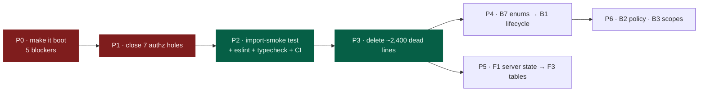

# 00 — Architecture Review Summary

**Date:** 2026-08-31
**Branch reviewed:** `refactor/docker-service` @ `ddcc54c`
**Scope:** full read of `backend/` (7,954 lines of Python), `frontend/src/` (11,128 lines of TS/TSX), both Docker Compose files, all dependency manifests, and the six existing documents in `docs/`.
**Method:** READ → ANALYZE → VALIDATE → DOCUMENT. No application source file was modified.

---

## The one-paragraph version

**IRIS does not currently start.** `backend/apps/records/views.py` uses six names it never imports, one of them (`APIView`) at class-definition scope, so the module raises `NameError` at import time; `config/urls.py` includes it, so the entire URLconf fails and every endpoint is down. Independently, both `docker-compose.yml` and `docker-compose.prod.yml` declare an `ai-gateway` service built from `./ai` — **a directory that does not exist in this repository** — so `docker compose up` fails at build before any container starts. Behind those two blockers sit a working, thoughtfully-designed review workflow, a sound Django app layout, and a frontend with real feature coverage. The architecture is not the problem. The absence of any executable check — zero tests, zero working lint, zero typecheck step, zero CI — is the problem, and it is why both blockers reached the branch.

---

## Verdict on the existing review

`docs/backend_frontend_architecture_review.md` is **substantially correct and worth keeping**. Of its nine claimed defects I confirm seven outright, revise one, and reject one. Of its fifteen architecture candidates (B1–B7, F1–F6, X1–X2) I confirm ten, revise four, and partially reject one.

Its most important blind spot: it was written against branch `feat/rag-service` and **does not know that `ai/` is absent**. It sizes the gateway's RAM budget, maps eleven pipeline phases onto it, and recommends hosting around it. That service has never existed in the repository. Full detail in [01-existing-review-validation.md](01-existing-review-validation.md).

---

## What is actually true about this codebase

| Area | State | Evidence |
|---|---|---|
| Django app boundaries | **Good.** Eight apps split along real domain seams. | `config/settings/base.py:31-40` |
| Review workflow service layer | **Good.** `reviews/services.py` is a genuine state-machine module with guarded transitions. | `reviews/services.py:150-330` |
| Audit model | **Good.** One `AuditEvent` with a JSONB `metadata` column replaced six event tables. | `audit/models.py` |
| Record lifecycle ownership | **Split.** 11 transitions live in the service; 7 more are hand-written in views. | `records/views.py:135-138,230-256` |
| Object-level authorization | **Broken in places.** Several endpoints have no ownership check at all. | `storage/views.py`, `documents/views.py:399-423` |
| AI / RAG layer | **Does not exist.** 8 service classes and 5 models, every one of them `pass`. | `apps/ai/services/*.py` |
| Background jobs | **Cannot run.** No queue routing; no worker consumes the queue tasks publish to. | `config/settings/base.py:158-163` |
| Tests | **Zero files.** Both codebases. | — |
| CI/CD | **None.** No `.github/`. | — |

---

## The blockers, ranked

Nothing in the refactor sections below matters until these five are cleared. Each is verified, not inferred.

| # | Blocker | Effect | Where |
|---|---|---|---|
| **1** | `APIView` and five other names undefined in `records/views.py` | `NameError` at import → **whole API down** | `records/views.py:535-580` |
| **2** | `ai/` directory referenced by both compose files does not exist | `docker compose up` fails at build → **nothing starts** | `docker-compose.yml:104`, `.prod.yml:92` |
| **3** | No Celery task routing; workers listen on queues nothing publishes to | **every background task hangs forever** | `config/settings/base.py`, compose `command:` lines |
| **4** | PDF extraction libraries removed from requirements but still imported | **extraction always fails**, 3 retries, then dead | `documents/tasks.py:80-131` vs `requirements/base.txt` |
| **5** | `apps.ai` installed with **no `migrations/` package** | models never created; any query against them errors | `apps/ai/` |

Full detail and reproduction in [02-backend-architecture.md](02-backend-architecture.md) and [07-deployment-architecture.md](07-deployment-architecture.md).

---

## Security headline

Seven authorization defects, four of them exploitable by any registered student account. These outrank every refactor in this review.

- **Any authenticated user can read any record**, including other people's drafts and in-review submissions — `RecordViewSet.get_queryset()` applies its visibility filter only to `list`, never to `retrieve`.
- **Any authenticated user can download every file attached to any record** — `RecordFileDownloadAllView` has no permission check whatsoever.
- **Any authenticated user can delete any other user's folders and files** — `apps/storage` has no ownership check on any endpoint.
- **ITSO and IERC accounts can change any user's role and lock any account** — migration `0005` sets `is_staff=True` for all four office roles, and `is_django_staff()` is a blanket bypass in `IsAdmin`, `_can_review()` and `_can_submit_clearance()`, which collapses the four-office separation of duties the workflow exists to enforce.

Full analysis in [05-security-architecture.md](05-security-architecture.md).

---

## Answer to the Docker separation question

> *"Are these services actually separate domains, or are we distributing complexity unnecessarily?"*

**Unnecessarily.** Ingestion, embedding, retrieval and generation are four phases of one pipeline over one data model, not four domains. They were split across seven processes before a single line of any of them was written — `apps/ai/services/` contains eight classes whose entire body is `pass`. The stated justification, "100 concurrent RAG users," appears in no requirement document and is not reachable by a university research office of this size; the 15 GB figure it rests on assumes synchronous Gunicorn workers and ignores `gthread`/`gevent`.

The refactor replaced a five-service compose that worked with a ten-service compose that cannot boot. Recommendation: **return to five services for the MVP** — `db`, `redis`, `backend`, `celery`, `frontend` — and re-introduce a separate worker or gateway when a measurement, not a projection, demands it. Full reasoning in [04-ai-rag-architecture.md](04-ai-rag-architecture.md).

---

## Recommended sequence

P0 and P1 are not preamble to the architecture work. They are the architecture work's precondition, and the reason they exist is P2.

---

## Document map

| Document | Covers |
|---|---|
| [01-existing-review-validation.md](01-existing-review-validation.md) | Every prior claim: confirm / reject / revise / already-fixed / investigate |
| [02-backend-architecture.md](02-backend-architecture.md) | Django, DRF, models, services, queries, exceptions, testing |
| [03-frontend-architecture.md](03-frontend-architecture.md) | React, server state, TanStack Query evaluation, forms, tables, a11y |
| [04-ai-rag-architecture.md](04-ai-rag-architecture.md) | RAG pipeline, gateway, service separation verdict |
| [05-security-architecture.md](05-security-architecture.md) | Authn, authz, IDOR, tokens, secrets, CORS/CSRF, audit |
| [06-workflow-architecture.md](06-workflow-architecture.md) | Record lifecycle, clearances, resubmission, notifications |
| [07-deployment-architecture.md](07-deployment-architecture.md) | Docker, service count, hosting, backups, observability |
| [08-framework-evaluation.md](08-framework-evaluation.md) | Keep / change / remove for every major dependency |
| [09-mvp-priorities.md](09-mvp-priorities.md) | Every recommendation, classified and sequenced |
| [10-architecture-decisions-required.md](10-architecture-decisions-required.md) | Open decisions + KEEP / CHANGE / REMOVE / DEFER / INVESTIGATE summary |

---

## Standing caveat

Every file and line reference was read directly from the working tree on this branch. Two classes of claim were **not** executed, because the environment has no installed Python dependencies and no database:

1. Import-time failures are derived from `pyflakes` static analysis plus CPython's package-over-module precedence rule. The undefined names are certain (pyflakes output is reproduced in 02); the precise runtime failure ordering was not observed.
2. Celery queue behaviour is derived from reading `command:` lines against an absent `task_routes` setting. The absence is certain; the hang was not observed.

Both are marked again where they appear.
