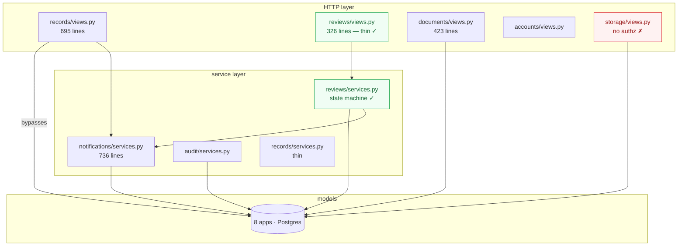

# 02 — Backend Architecture

**Subject:** `backend/` — Django 5.x + DRF, eight apps, 7,954 lines of Python (excluding migrations).

---

## Overall assessment

The backend's **structure is good and its execution is unverified**. App boundaries follow real domain seams, the review workflow has a genuine service layer, and the audit model is a well-judged consolidation. What is missing is any mechanism that would tell you whether the code runs — which is why the module that holds the system's most-used endpoints currently fails to import.



`reviews/` is the shape the rest of the backend should copy. `records/` is the shape it should not.

---

## Point-by-point evaluation

| # | Area | Assessment |
|---|---|---|
| 1 | Django architecture | **Good.** Split settings (`base`/`development`/`production`), custom user model, `config/` package, `core/` for shared concerns. Conventional and correct. |
| 2 | DRF architecture | **Mixed.** ViewSets where appropriate, but `records/urls.py` hand-mounts `DownloadRequestViewSet` actions with explicit `as_view({...})` maps instead of a router — which is how the misplaced-method defect stayed invisible. |
| 3 | App boundaries | **Good.** `accounts / records / reviews / documents / notifications / audit / storage / ai`. Each owns a real concept. Keeping `storage` separate from `documents` is the right call. |
| 4 | Domain boundaries | **Leaky in one direction.** `records/views.py` reaches into `reviews` semantics (pipeline routing) and `notifications` directly, while `reviews/services.py` is the module that owns those rules. |
| 5 | Models | **Good, with dead weight.** Normalised, sensible FKs, soft delete via a custom manager. Ten model classes have zero references (BE-9). |
| 6 | Serializers | **Adequate.** Correct read-only enforcement on sensitive fields (`role`, `is_staff` — verified). Two near-identical request serializers (B4). One latent `AttributeError` (BE-8). |
| 7 | Views | **The weak point.** 695-line `records/views.py` holding spreadsheet generation and import logic. |
| 8 | Services | **Uneven.** `reviews/services.py` excellent; `records/services.py` almost empty; `notifications/services.py` 736 lines of hand-written per-event functions. |
| 9 | Permissions | **Declared well, applied inconsistently.** See [05](05-security-architecture.md). |
| 10 | Query / queryset design | **`select_related`/`prefetch_related` used in the main paths.** Two confirmed N+1s (BE-10). No named scopes (B3). |
| 11 | Lifecycle / state machine | **Half-built.** 11 guarded transitions in the service, 7 unguarded elsewhere (B1). |
| 12 | Workflow transitions | **Logically correct, transactionally unsafe.** See [06](06-workflow-architecture.md). |
| 13 | Notifications | **Works, fails silently.** 12 bare `except: pass`. |
| 14 | Audit logging | **Good model, incomplete coverage.** `AuditEvent` + JSONB metadata is the right shape. `ACCESS` is overloaded to also mean "tags edited". |
| 15 | Document processing | **Cannot run** — libraries absent from requirements (BLOCK-4). |
| 16 | Background jobs | **Cannot run** — no queue routing (BLOCK-3). |
| 17 | Storage | **Local `FileField` + `MEDIA_ROOT`.** `django-storages[s3]` installed but unconfigured. `build_zip` uses `.path`, which will break the moment it is configured. |
| 18 | API contracts | **Hand-mirrored, drifting.** Four endpoints return bare arrays typed as paginated on the client. No OpenAPI schema. |
| 19 | Exception handling | **Declared, unused.** `core/exceptions.py` has five classes; one is used. Nine hand-written 404s and five hand-written 403s restate the others. No custom DRF exception handler. |
| 20 | Testing architecture | **Absent.** Zero test files, zero fixtures, zero factories, no pytest config, no CI. |

---

# Blockers

---

## BLOCK-1 · `records/views.py` fails at import — the entire API is down

**Problem.** Six names are used and never imported. One is used in a `class` statement, so the failure occurs at module import rather than at request time.

**Evidence.** `pyflakes 3.4.0`, run over all backend `.py` files:

```
./apps/records/views.py:535:32: undefined name 'timezone'
./apps/records/views.py:541:21: undefined name 'make_download_token'
./apps/records/views.py:546:39: undefined name 'settings'
./apps/records/views.py:550:26: undefined name 'APIView'
./apps/records/views.py:563:22: undefined name 'verify_download_token'
./apps/records/views.py:579:20: undefined name 'file_response_for_record'
```

The import chain: `config/urls.py:11` → `apps.records.urls` → `apps.records.views:3`. `records/download_tokens.py` and `records/download_service.py` define four of the six missing names and are imported by nothing.

**Current implementation.** `records/views.py:1-30` imports 18 names; none of the six. `class DownloadRedeemView(APIView)` at line 550 evaluates `APIView` during module execution.

**Recommendation.** Add the six imports. Separately, move `DownloadRedeemView`'s four misplaced methods (`get_permissions`, `perform_create`, `approve`, `decline`, lines 588-630) back into `DownloadRequestViewSet`, and delete the `get_permissions` override that reads `self.action` on an `APIView`.

**Alternatives.** None — this is a defect, not a design choice.

**Reasoning.** Nothing else in this review is testable until the URLconf loads.

- **Complexity:** Trivial (one import block, one indentation move)
- **Risk:** Low — but note the endpoints have never executed, so first correct execution may surface further issues
- **Dependencies:** None
- **MVP:** **MVP BLOCKER**
- **Framework impact:** None
- **Testing implications:** A single test that imports `config.urls` prevents this entire class permanently. Write it in the same commit.

> Derived from static analysis; not executed (no dependencies installed in the review environment).

---

## BLOCK-3 · Celery workers consume queues that no task publishes to

**Problem.** Both compose files start workers bound to named queues. Django publishes to none of them.

**Evidence.**

```yaml
celery-default:    command: celery -A config worker -l info -Q default
celery-extraction: command: celery -A config worker -l info -Q extraction --concurrency=2
celery-embedding:  command: celery -A config worker -l info -Q embedding  --concurrency=4
celery-beat:       command: celery -A config beat -l info
```

`grep -rn "task_routes|TASK_ROUTES|beat_schedule|BEAT_SCHEDULE|queue" backend/config/ backend/apps/*/tasks.py` → **no matches**. Every task is a bare `@shared_task`, so it publishes to Celery's built-in default queue, named `celery`. No worker consumes `celery`. `celery-beat` runs with no schedule defined.

**Current implementation.** `config/celery.py` is 8 lines: `Celery("iris")`, `config_from_object`, `autodiscover_tasks`. `settings/base.py:158-163` sets broker, backend and serializers only.

**Recommendation (MVP).** Delete the three specialised workers and the beat container; run one worker with no `-Q` flag. One process, default queue, everything works.

**Recommendation (post-MVP, if load justifies).** Add `CELERY_TASK_ROUTES = {"apps.documents.tasks.*": {"queue": "extraction"}, "apps.ai.tasks.*": {"queue": "embedding"}}` and a `default` route, then reinstate the split workers.

**Alternatives.** Set `CELERY_TASK_DEFAULT_QUEUE = "default"` — makes `celery-default` work but leaves the other two idle, so it fixes the symptom, not the split.

**Reasoning.** Three worker pools for two task modules, one of which cannot import its dependencies and the other of which cannot import its models, is capacity for work that does not exist. See [07](07-deployment-architecture.md).

- **Complexity:** Trivial to collapse; Low to route properly
- **Risk:** Low
- **Dependencies:** None
- **MVP:** **MVP BLOCKER**
- **Framework impact:** Removes 3 containers
- **Testing implications:** Assert `extract_pdf_text.apply()` runs eagerly under `CELERY_TASK_ALWAYS_EAGER` in tests.

> Derived from reading configuration; the hang was not observed.

---

## BLOCK-4 · PDF extraction imports libraries that are not installed

**Problem.** `documents/tasks.py` runs a three-tier extractor chain. None of the three libraries is in any requirements file.

**Evidence.**

| Extractor | Imports | In `requirements/base.txt`? |
|---|---|---|
| `_extract_with_opendataloader` | `unstructured.partition.auto` | **No** |
| `_extract_with_pymupdf` | `fitz` (PyMuPDF) | **No** |
| `_extract_with_tesseract` | `pytesseract`, `PIL`, `fitz` | **No** |

`requirements/base.txt:14-17` records the deliberate removal: *"REMOVE when Docling + pgvector migration is complete: (Removed legacy ML dependencies)"*. The migration to Docling was never made — `documents/tasks.py` never calls `settings.DOCLING_API_URL`, and the top-of-file TODO block still describes the change as pending.

`_run_extraction_chain` catches `ImportError` per extractor and appends to `errors`; with all three failing it raises `RuntimeError`, the task retries three times at 60s, then `PdfExtraction.status = "failed"` permanently.

**Also affected:** `sentence_transformers`, imported at `apps/ai/tasks.py:51` and `apps/ai/views.py`, is likewise absent.

**Recommendation (MVP).** Add `pymupdf` to `requirements/base.txt` and reduce the chain to PyMuPDF alone. It handles text-layer PDFs — which is what a thesis submission is — in ~50 MB of memory with no external service.

**Alternatives.**

| Option | Verdict |
|---|---|
| Add all three back | Rejected — `unstructured[pdf]` and Tesseract pull hundreds of MB for a fallback that a text-layer PDF never reaches |
| Migrate to Docling-serve as the TODO instructs | **POST-MVP.** 4 GB container, more than half the hosting budget, for quality gains only scanned documents need |
| PyMuPDF only | **Recommended** |

**Reasoning.** The SRS specifies OpenDataLoader → PyMuPDF → Tesseract. For an MVP whose corpus is born-digital theses, tier two alone covers the realistic input. Keep the chain's structure so tiers can return.

- **Complexity:** Trivial
- **Risk:** Low — scanned PDFs will extract empty and be marked `failed`, which is honest
- **Dependencies:** None
- **MVP:** **MVP BLOCKER**
- **Framework impact:** +1 dependency (~30 MB); avoids a 4 GB container
- **Testing implications:** One test extracting a committed 2-page fixture PDF.

---

## BLOCK-5 · `apps.ai` is installed with no migrations package

**Problem.** `apps.ai` is in `INSTALLED_APPS` and declares five models. It has no `migrations/` directory, so none of its tables exist.

**Evidence.** `apps/ai/` contains `__init__.py`, `apps.py`, `models/`, `models.py`, `services/`, `tasks.py`, `urls.py`, `views/`, `views.py`. No `migrations/`.

Compounding: `models/` (a package) shadows `models.py` (a module), so the *reachable* models are the five field-less stubs in `models/conversation.py`, `models/metadata.py`, `models/summary.py` — each literally `class X(models.Model): pass`. The real `RecordEmbedding` and `EmbeddingJob` in `models.py` are unreachable, which is why `apps/ai/tasks.py:35`'s `from apps.ai.models import EmbeddingJob, RecordEmbedding` raises `ImportError`.

**Recommendation.** Delete `apps.ai` from `INSTALLED_APPS` and delete the app directory. Nothing routes to it, nothing imports from it successfully, and the RAG work it scaffolds has not started. Re-create it when RAG is actually implemented — see [04](04-ai-rag-architecture.md).

**Alternatives.** Keep the app and generate migrations — this creates five empty tables for models with no fields and no consumers. Rejected.

**Reasoning.** Deletion test: removing `apps.ai` removes 15 files and adds zero complexity anywhere else, because nothing depends on it.

- **Complexity:** Trivial
- **Risk:** Low — verify no migration in another app FKs to it (none does)
- **Dependencies:** None
- **MVP:** **MVP REQUIRED**
- **Framework impact:** Allows dropping `pgvector` and the unused `openai` dependency until RAG starts
- **Testing implications:** `migrate --check` in CI catches this class permanently.

---

# Architecture recommendations

---

## BE-1 · One `RecordLifecycle` module owning every transition *(validates B1 — CONFIRMED)*

**Problem.** `pipeline_status` is assigned in 15 places across three modules. The type-routing rule is written three times. There is no transition table, no `can_transition()` predicate, and no enumeration of legal edges — so "what can happen to this record next?" requires reading three files.

**Evidence.**

| Location | Transitions | Guarded by |
|---|---|---|
| `reviews/services.py` | 11 | `InvalidPipelineTransition` ✓ |
| `records/views.py:137` (`submit`) | 2 | hand-written 400 |
| `records/views.py:208` (`complete`) | 1 | hand-written 400 |
| `records/views.py:254,334` (`destroy`, `import_excel`) | 2 | **nothing** |
| `records/views.py:690` (delete decline) | 1 | re-derives the type rule a third time |
| `records/services.py:33` (`soft_delete_record`) | 1 | none |

The Excel importer sets `pipeline_status="published"` directly, bypassing every review stage.

**Current implementation.** A denormalised `Record.pipeline_status` CharField with 12 choices, mutated by whoever holds a reference.

**Recommendation.** A `records/lifecycle.py` module with a declarative table `(from_status, event, actor_role) → to_status` and one entry point `apply(record, event, actor)` wrapping the write in `transaction.atomic()`. Views name events (`"submit"`, `"approve"`, `"mark_complete"`), never statuses. `reviews/services.py` calls it instead of assigning. The importer calls it with an explicit `legacy_import` event so the bypass becomes a declared edge rather than an accident.

**Alternatives.**

| Option | Verdict |
|---|---|
| `django-fsm` | Rejected — unmaintained upstream, and the table is ~30 rows; a dict does not need a library |
| Leave as is | Rejected — every future workflow change touches three files; SRS M5 is still marked draft |
| Move all transitions into `reviews/services.py` without a table | Partial credit — better than today, but still branches rather than data |

**Reasoning.** Deletion test **passes**: removing the module scatters ~30 rules back across 15 sites. Complexity concentrates.

- **Complexity:** Medium (~150 lines + call-site updates)
- **Risk:** Medium — touches the core write path; do it *after* tests exist
- **Dependencies:** BE-2 (enums) first; X2 (tests) first
- **MVP:** **MVP RECOMMENDED**
- **Framework impact:** None — plain Python
- **Testing implications:** The largest single win. The transition table becomes a parametrised test with no HTTP, no DB fixtures for the pure predicate, and full edge coverage in ~40 lines.

---

## BE-2 · One `TextChoices` enum per concept *(validates B7 — CONFIRMED)*

**Problem.** `{ITSO, IERC, KTTO}` is encoded five times in four modules; pipeline statuses appear as bare literals across eight files; IP types twice; the job-status quartet twice.

**Evidence.**

| Encoding | Location |
|---|---|
| `RecordClearance.OFFICE_CHOICES` | `reviews/models.py:56` |
| `ROLE_TO_OFFICE` | `reviews/services.py:68` |
| `CLEARANCE_OFFICES` | `reviews/services.py:381` |
| `_OFFICE_TO_ROLE` | `notifications/services.py:416` |
| `_OFFICE_LABELS` | `notifications/services.py:264` |

**Recommendation.** `core/enums.py` with `PipelineStatus`, `ClearanceOffice`, `ReviewStage`, `IPType`, `JobStatus` as `models.TextChoices`. Give `ClearanceOffice` a `role_name` property so the role↔office mapping is a member attribute rather than a fourth dict.

**Alternatives.** Python `Enum` — rejected; `TextChoices` integrates with model `choices` and the admin. Plain module constants — rejected; loses the label pairing.

**Reasoning.** Adding a fifth office today requires finding and editing four of five dicts, and missing one fails **silently** because `notifications/services.py` swallows exceptions. Highest effort-to-value ratio in the backend.

- **Complexity:** Low (mechanical)
- **Risk:** Low — no schema change if member values match existing strings exactly
- **Dependencies:** None
- **MVP:** **MVP RECOMMENDED**
- **Framework impact:** None
- **Testing implications:** Typos become `ImportError` at collection time instead of silent no-ops.

---

## BE-3 · Route every access decision through `core.permissions` *(validates B2 — CONFIRMED, priority raised)*

**Problem.** The seam exists and is bypassed. The four-line owner-or-staff check is hand-written five times; five declared permission classes are never referenced; twelve endpoints have no object-level check at all.

**Evidence.** Verbatim at `documents/views.py:226, 302, 336, 378`:

```python
is_staff_user = get_role_name(request.user) in STAFF_ROLES or request.user.is_staff
is_owner = record.owners.filter(user=request.user).exists()
if not (is_owner or is_staff_user):
    return Response({"detail": "Permission denied."}, status=403)
```

Plus a fifth spelling at `reviews/views.py:183-192` reading `request.user.role.name` directly.

**Recommendation.** Use the existing `IsOwnerOrStaff` at all five sites. Delete the five unreferenced classes. For the genuinely richer question — *"may this actor act on this record at this stage?"* — extract `reviews/services.py`'s `_can_review` / `_can_submit_clearance` into a `ReviewPolicy` object that both the view and BE-1's lifecycle module consult.

**Alternatives.** `django-guardian` (per-object ACLs) — rejected; this is role-and-ownership logic, not arbitrary ACLs, and it would add a table and a dependency for rules that fit in 60 lines. `django-rules` — same conclusion.

**Reasoning.** Deletion test passes for the policy object: the stage-authorization rule is consulted from at least three places and is currently duplicated between `reviews/views.py:61-67` and `reviews/services.py:89-93` with independent encodings.

- **Complexity:** Low
- **Risk:** Low — narrows access, so failures are visible (403s), not silent
- **Dependencies:** None
- **MVP:** **MVP REQUIRED** (the missing-check subset is **MVP BLOCKER** — see [05](05-security-architecture.md))
- **Framework impact:** None
- **Testing implications:** Policies test as pure functions. A parametrised `(role, stage, is_owner) → allowed` table is ~30 lines and covers what twelve endpoint tests would.

---

## BE-4 · Named queryset scopes on `Record` *(validates B3 — CONFIRMED, escalated)*

**Problem.** "Which records can this user see?" is answered by copy-paste six times — and one place forgets to answer it at all, which is an active data leak.

**Evidence.**

| Expression | Copies |
|---|---|
| `("published", "approved", "completed")` | 6 |
| `Record.objects.filter(owners__user=…)` | 4 |
| `record.owners.filter(user=request.user).exists()` | 5 |

The leak, `records/views.py:50-58`:

```python
def get_queryset(self):
    if self.action == "list":
        return Record.objects.filter(pipeline_status__in=("published","approved","completed"))...
    return Record.objects.select_related(...)     # every other action: unfiltered
```

with `get_permissions` returning `[IsAuthenticated()]` for `retrieve`. **Any authenticated user can read any record by id.**

**Recommendation.** `RecordQuerySet` with `.publicly_visible()`, `.owned_by(user)`, `.reviewable_by(user)`, `.visible_to(user)` (the union). `RecordViewSet.get_queryset` returns `Record.objects.visible_to(self.request.user)` for **all** actions.

**Alternatives.** Object-level permission on `retrieve` — works, but 404-vs-403 leaks existence and it does not fix the other five copies. A DRF filter backend — indirection for something the ORM expresses directly.

**Reasoning.** Deletion test passes: the visibility rule is consulted from six modules; removing the scope returns it to six independently-drifting copies.

- **Complexity:** Low
- **Risk:** Low
- **Dependencies:** BE-2 (status enum) preferred
- **MVP:** **MVP BLOCKER** (the `retrieve` fix); **MVP RECOMMENDED** (the full scope set)
- **Framework impact:** None
- **Testing implications:** One test per scope with a fixed fixture set replaces per-endpoint visibility assertions.

---

## BE-5 · Extract the spreadsheet modules from `records/views.py` *(validates B5 — CONFIRMED, narrowed)*

**Problem.** `records/views.py` is 695 lines. Two methods are 197 of them and contain no HTTP concern.

**Evidence.**

| Method | Lines | Content |
|---|---|---|
| `download_template` | 115 (`:358-472`) | openpyxl fonts, fills, column widths, a sentinel row; 6 lines of HTTP at the end |
| `import_excel` | 82 (`:274-356`) | 4 model writes per row inside a per-row `except Exception`; force-sets `published` |

Neither is reachable from a test without an HTTP request and an authenticated staff user.

**Recommendation.** `records/importing.py` (`import_rows(rows, actor) -> ImportResult`) and `records/reporting.py` (`build_import_template() -> bytes`). Views become ~8 lines each. Move `tags`' field validation into a serializer instead — and fix its duplicated `VALID_IP_TYPES` via BE-2 rather than a service module.

**Alternatives.** Leave and test through HTTP — possible, but every template-styling assertion then needs a logged-in client. A management command for import — complements this, does not replace it.

**Reasoning.** `records/services.py` already holds `parse_excel_import` (the *parsing* half). The *writing* half was left in the view, so the module boundary already exists and is drawn in the wrong place.

- **Complexity:** Low
- **Risk:** Low — pure code motion
- **Dependencies:** None (but `import_excel` should later route through BE-1)
- **MVP:** **POST-MVP** — except the lifecycle bypass, which BE-1 covers
- **Framework impact:** None
- **Testing implications:** `build_import_template()` tests by opening the bytes with openpyxl. `import_rows` tests with a list of dicts and no HTTP.

---

## BE-6 · Log notification failures instead of discarding them *(validates B6 — REVISED)*

**Problem.** Twelve bare `except Exception: pass` blocks make every notification and audit failure invisible.

**Evidence.** Ten in `notifications/services.py`, one in `audit/services.py:44-46`, one in `core/utils.py:52`. `_get_type` uses `.get()`, so a missing `NotificationType` raises `DoesNotExist` and is swallowed. (All eleven type names *are* currently seeded — verified against the four seed migrations — so this is a latent hazard, not a firing bug.)

**Recommendation, step 1 (do now).** Replace every `except Exception: pass` with `except Exception: logger.exception("notification failed", extra={...})`. Behaviour is identical; failures become observable. ~1 hour.

**Recommendation, step 2 (do now).** Move the four `notify_*` calls in `records/views.py` (lines 144, 258, 668, 695) into the service layer, so dispatch happens at one layer rather than two.

**Recommendation, step 3 (defer).** A domain-event bus with notification and audit as subscribers.

**Alternatives considered for step 3.**

| Option | Verdict |
|---|---|
| Event bus / observer now | **DO NOT IMPLEMENT (MVP).** Deletion test **fails**: removing the bus returns you to eleven direct calls that are already legible. There is one real subscriber. One adapter is a hypothetical seam; two is a real one. |
| Django signals for domain events | Rejected — signals make control flow harder to follow, which is the stated complaint |
| Steps 1+2 only | **Recommended** |

**Reasoning.** The prior review is right that the fan-out is hard to reason about and wrong that an event bus is the MVP-stage answer. Steps 1 and 2 capture the safety and locality benefits at roughly 3 hours; step 3 costs days and buys extensibility nobody has asked for.

- **Complexity:** Trivial (1+2); Medium (3)
- **Risk:** None (1+2)
- **Dependencies:** None
- **MVP:** **MVP REQUIRED** (step 1) · **MVP RECOMMENDED** (step 2) · **POST-MVP** (step 3)
- **Framework impact:** None
- **Testing implications:** Step 1 makes notification failures assertable via `caplog`.

---

## BE-7 · Share the approval guard-and-stamp, not the model *(validates B4 — PARTIALLY REJECTED)*

**Problem.** The pending-check-and-stamp block is repeated five times in `records/views.py` with identical bodies. `DownloadRequestSerializer` and `DeleteRequestSerializer` are near-identical.

**Evidence.** `records/views.py:520-536, 597-613, 615-630, 650-669, 671-694`. `records/serializers.py:132-169` — same `get_requested_by_name` body verbatim.

**Recommendation.** One `stamp_decision(request_obj, actor, decision)` helper and one `ApprovalRequestSerializer` base. **Do not** introduce an abstract `ApprovalRequest` model.

**Alternatives.**

| Option | Verdict |
|---|---|
| Abstract base model + template method (as B4 proposes) | **Rejected.** Deletion test **fails** — removing it returns you to two flat, readable model definitions. It costs an inheritance hop, a cross-app migration graph, and a template method whose two implementations already diverge (declining a delete request restores `previous_pipeline_status`; declining a download request does not). `RoleRequest` cannot join — different app, no `record` FK, approval mutates `User.role`. |
| Helper + serializer base | **Recommended** — captures the actual repetition |
| Leave as is | Tolerable; 40 duplicated lines |

- **Complexity:** Low
- **Risk:** None (helper) vs Medium (model inheritance migration)
- **Dependencies:** None
- **MVP:** **POST-MVP** (helper) · **DO NOT IMPLEMENT** (model base)
- **Framework impact:** None
- **Testing implications:** One helper test replaces five near-identical view tests.

---

## BE-8 · Fix the `.username` fallback

**Problem.** `documents/serializers.py:42` falls back to `obj.uploaded_by.username`; `User` has no `username` field (`USERNAME_FIELD = "email"`).

**Evidence.** `accounts/models.py:57-84`. The correct version is 34 lines below at `:76`.

**Recommendation.** Use `.email`, matching the sibling serializer. **MVP REQUIRED**, Trivial, no risk.

---

## BE-9 · Delete unreachable code

**Problem.** Roughly 2,400 unreachable lines across both codebases; the backend share is ~700.

**Evidence (backend only).**

| What | Where | Why safe |
|---|---|---|
| `apps.ai` entirely | 15 files | Never routed; models shadowed; no migrations; services all `pass` |
| `MyRecordsViewSet` | `records/views.py:474-483` | Not routed; duplicates `RecordViewSet.mine` |
| `build_zip_for_record` | `documents/services.py:54-61` | Zero callers; contains `undefined name 'BytesIO'` |
| 5 permission classes | `core/permissions.py` | `IsStudent`, `IsAdviser`, `IsKTTO`, `IsITSO`, `IsIERC` — zero references |
| 4 exception classes | `core/exceptions.py` | Only `InvalidPipelineTransition` is used |
| `LegacyFolder` | `storage/models.py:62-71` | `managed = False`; docstring says "DO NOT use" |
| Commented-out view | `records/views_dashboard.py:55-82` | 28 lines of comment |
| Unused imports | `records/views.py:12`, `reviews/views.py:12`, `views_dashboard.py:5-6` | pyflakes-confirmed |

**Held back pending confirmation:** `ResearchLink`, `Publication`, `Conference`, `Budget`, `Collaboration` and their five lookup tables have zero code references — but they map to SRS Module 2 fields (publication level, conference level, budget type). Dropping them is a destructive migration. **Confirm against the SRS before removal.** Classified **NEEDS INVESTIGATION**.

- **Complexity:** Low · **Risk:** Low (except the models above) · **MVP:** **MVP RECOMMENDED**
- **Testing implications:** Deleting before refactoring means ~700 fewer backend lines to reason about.

---

## BE-10 · Fix two N+1 queries and one redundant write

**Problem.**

1. `reviews/views.py:206-208, 218-220` — `Review.objects.filter(...)` with no `select_related("record")`, then `[r.record for r in reviews]`. One query per review row. The class's own `get_queryset` *does* use `select_related`; these two actions build their own querysets and skip it.
2. `records/signals.py:6` — `post_save` on `Record` rebuilds the FTS vector on **every** save, including `increment_access` and every `update_fields=["pipeline_status"]`. Two statements where one would do, on the hottest write path.

**Recommendation.** Add `.select_related("record")` to both actions. Narrow the signal to fire only when `title` or `abstract` changed (or move it into BE-1's lifecycle/save path).

- **Complexity:** Trivial · **Risk:** Low · **MVP:** **MVP RECOMMENDED**
- **Testing implications:** `assertNumQueries` makes both regressions permanent-proof.

---

## BE-11 · Wrap workflow transitions in `transaction.atomic()`

**Problem.** No transaction boundary anywhere in `reviews/services.py`. `approve_record` creates a `Review`, then `get_or_create`s two `RecordClearance` rows, then saves the `Record`, then notifies. A failure part-way leaves a review recorded for a transition that did not occur, or clearance rows for a stage the record never entered.

**Evidence.** `grep -rn "atomic" backend/apps/` → one match, `accounts/views.py:23` (registration). None in `reviews/` or `records/`.

**Recommendation.** Wrap each of `approve_record`, `decline_record`, `reject_record`, `submit_clearance`, `resubmit_record` in `transaction.atomic()`. Move the `notify_*` call to `transaction.on_commit(...)` so notifications never fire for rolled-back transitions.

**Alternatives.** `ATOMIC_REQUESTS = True` globally — heavier than needed and it would hold a transaction open across the email path.

- **Complexity:** Low · **Risk:** Low · **Dependencies:** None (naturally absorbed by BE-1)
- **MVP:** **MVP REQUIRED**
- **Testing implications:** Testable by forcing an exception in the notify call and asserting the record's status is unchanged.

---

## BE-12 · A DRF exception handler and the declared exceptions

**Problem.** `core/exceptions.py` declares five `APIException` subclasses. One is used. Nine hand-written 404s and five hand-written 403s restate the other four inline, with inconsistent body shapes — some `{"detail": ...}`, some with extra keys.

**Recommendation.** Use `RecordNotFound` / `NotRecordOwner` at the sites that currently hand-roll them, and register a `EXCEPTION_HANDLER` in `REST_FRAMEWORK` so every error response has one shape. This also feeds X1's OpenAPI schema with consistent error documentation.

- **Complexity:** Low · **Risk:** Low — changes response bodies, so update the frontend's error extraction at the same time (which F1 consolidates anyway)
- **MVP:** **POST-MVP**
- **Testing implications:** One error-shape test instead of per-endpoint assertions.

---

## BE-13 · Testing architecture — start with the seams *(validates X2 — CONFIRMED, escalated)*

**Problem.** Zero tests, zero fixtures, no pytest config, no CI. `requirements/development.txt:4` still reads `# TODO: add pytest-django and factory-boy when writing tests`.

**Evidence for escalation.** Of the five things that stop IRIS running today, an import-smoke test catches **three** and a `docker compose config` check catches a **fourth**. This is not a hypothetical benefit.

**Recommendation — in this order, not broad coverage:**

| Tier | Test | Catches |
|---|---|---|
| 1 | `test_urlconf_imports` — `django.urls.get_resolver().url_patterns` | BLOCK-1, the `apps/ai` shadowing, every future import defect |
| 2 | `migrate --check` in CI | BLOCK-5 and future missing migrations |
| 3 | `docker compose -f docker-compose.yml config` in CI | BLOCK-2 (absent `ai/`) |
| 4 | Table-driven lifecycle tests (after BE-1) | Workflow correctness — the actual domain risk |
| 5 | Table-driven policy tests (after BE-3) | Authorization — including the twelve open endpoints |
| 6 | One authorization regression test per fixed IDOR | Prevents silent re-opening |

**Stack.** `pytest`, `pytest-django`, `factory-boy`. Conventional, well-documented, no lock-in.

**Alternatives.** Django's built-in `TestCase` — works, and avoids a dependency; `pytest-django`'s fixtures and parametrisation are worth the three packages for the table-driven tests in tiers 4-5.

- **Complexity:** Low (tiers 1-3, ~1 day) · Medium (tiers 4-6)
- **Risk:** None
- **Dependencies:** Tiers 4-5 depend on BE-1 and BE-3
- **MVP:** **MVP BLOCKER** (tiers 1-3) · **MVP REQUIRED** (tier 6) · **MVP RECOMMENDED** (tiers 4-5)
- **Framework impact:** +3 dev dependencies
- **Testing implications:** This *is* the testing implication. Tiers 1-3 are worth more than any refactor in this document.
