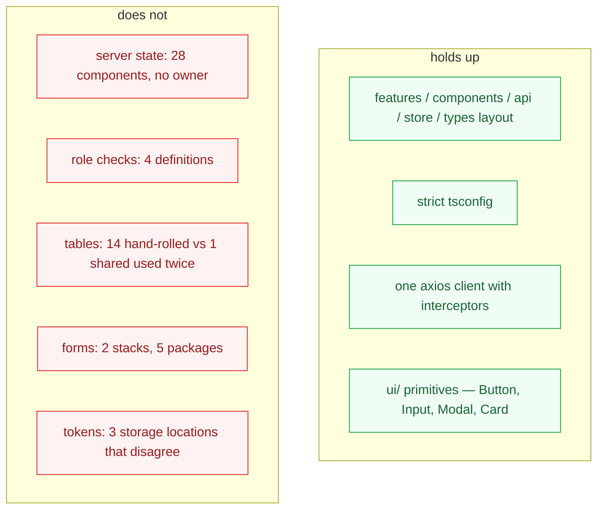

# 03 — Frontend Architecture

**Subject:** `frontend/src/` — React 18 + TypeScript + Vite + Tailwind, 11,128 lines of TS/TSX across 128 files.

---

## Overall assessment

The frontend is **feature-complete and structurally sound at the folder level, and undisciplined at the module level**. `features/` / `components/` / `api/` / `store/` / `types/` is a good layout. Inside it, the same decisions are made repeatedly and differently: four definitions of "is this user staff", two form stacks, fourteen hand-rolled tables against one shared table component used twice, and no module at all that owns "fetch a thing from the server."

TypeScript is configured strictly (`strict`, `noUnusedLocals`, `noUnusedParameters`) — which is why unused *symbols* are clean while roughly a dozen unused *files* survive: the compiler never sees a module nobody imports, and there is no lint step that would.



---

## Point-by-point evaluation

| # | Area | Assessment |
|---|---|---|
| 1 | React architecture | **Adequate.** Function components, hooks, no class components, no legacy patterns. |
| 2 | Feature boundaries | **Good folder-level, leaky module-level.** `features/discover/discoverUtils.ts` duplicates `lib/discoverUtils.ts` with *different badge rules*. |
| 3 | Components | **Mostly small; five oversized.** `DocumentsPage` 793, `SignupPage` 457, `RecordDetailPage` 402, `DiscoverPage` 334, `PublishedRecordsPage` 304. |
| 4 | Hooks | **Thin.** Three hooks total; one (`useDataTable`) has zero importers. |
| 5 | API layer | **Good shape, incomplete use.** Eleven typed modules in `api/`; several call sites bypass them with inline `apiClient.get`. |
| 6 | State management | **Zustand, correctly scoped.** Three small stores. `notifications.store.ts` should not exist (FE-1). |
| 7 | Server state | **No owner.** The single biggest issue. See FE-1. |
| 8 | Authentication state | **Works, with a real defect.** See FE-5. |
| 9 | Authorization UI | **Four non-equivalent definitions.** See FE-2. |
| 10 | Routing | **Good.** `createBrowserRouter`, nested `ProtectedRoute` guards, breadcrumb `handle`s. Two superseded guard modules remain. |
| 11 | Forms | **Two stacks, five packages.** See FE-4. |
| 12 | Validation | **Same rules written twice with different messages.** See FE-4. |
| 13 | Tables | **14 hand-rolled vs 1 shared used twice.** See FE-3. |
| 14 | Shared components | **`ui/` primitives are good** (Button, Input, Modal, Card, Badge, Spinner, Toast) and consistently used. |
| 15 | Error / loading states | **Ad hoc.** The literal string `p-8 text-center text-gray-400 text-[13px]` is the loading state in 10 files while `Spinner` exists; the error-shape cast is copy-pasted across 8 files. |
| 16 | TypeScript architecture | **Strict and mostly honest**, but the API contract is hand-mirrored and already drifting. `PaginatedResponse<T>` declared 4 times; 4 endpoints return bare arrays typed as paginated. |
| 17 | Accessibility | **Minimal.** 52 `aria-*` attributes across 128 files. Tables have no `scope`/`caption`; icon-only buttons (`<i className="fa …" />` inside `Button`) have no accessible name; modals' focus management unverified. |
| 18 | Responsive design | **Tailwind breakpoints used, unevenly.** Wide data tables have no horizontal-scroll container outside `DataTable`. |
| 19 | Testability | **Zero.** No test runner, no ESLint config, no `typecheck` script. Types are only checked as a side effect of `npm run build`. |

---

## FE-1 · Server state has no owner *(validates F1 — CONFIRMED)*

**Problem.** There is no module that owns "fetching a thing from the server." Caching, deduplication, retry, invalidation-after-mutation, loading and error handling are re-decided in every page, mostly by omission.

**Evidence.**

- 35 `.tsx` files use `useEffect`; twelve fetch directly inside one.
- `PendingRecordsPage.tsx:14` — `reviewsApi.pending().then(...).finally(...)` with **no `.catch`**. A network failure leaves `loading=false` and an empty list, rendering "No pending records are waiting for your review." A reviewer sees an empty queue instead of an error. Verified verbatim.
- `PublishedRecordsPage.tsx:69` — `.catch(() => {})`, error discarded.
- `PublishedRecordsPage.tsx:72` — `// eslint-disable-next-line react-hooks/exhaustive-deps` above a `JSON.stringify(filters)` dependency. This is a hand-rolled query key, complete with the suppression needed to make it work. It is the only `eslint-disable` in the codebase, and the lint that would flag it cannot run.
- `notifications.store.ts:26` — `markAllRead: () => set({ unreadCount: 0 })` zeroes the count and leaves `items` untouched; `markRead` filters the array client-side rather than refetching. Store and server diverge on the first interaction. Verified verbatim.
- The error-shape cast `(err as { response?: { data?: { detail?: string } } })?.response?.data?.detail` appears in **8 files**. Axios's own `AxiosError` type is imported nowhere outside `api/client.ts`.

**Current implementation.** `useState` + `useEffect` + `axios`, per component, with no shared conventions.

### Is TanStack Query actually appropriate? — a three-way comparison

The instruction is not to adopt it because it is popular. So:

| | **A · Keep hand-rolled** | **B · One `useApi<T>` hook** | **C · TanStack Query** |
|---|---|---|---|
| Bundle cost | 0 | ~0 (≈40 lines) | **~13 KB gzipped** |
| Dependencies added | 0 | 0 | **1** |
| Fixes missing `.catch` | ✗ per-site discipline | ✓ one error path | ✓ one error path |
| Fixes loading-state duplication | ✗ | ✓ | ✓ |
| Request deduplication | ✗ | ✗ (would need writing) | ✓ |
| Cache + stale-while-revalidate | ✗ | ✗ (would need writing) | ✓ |
| Invalidation after mutation | ✗ manual refetch | ✗ manual refetch | ✓ `invalidateQueries` |
| Retry / backoff | ✗ | ✗ (would need writing) | ✓ |
| Replaces `notifications.store.ts` | ✗ | partially | ✓ deleted outright |
| Lines removed from `features/` | 0 | ~150 | **~300** |
| Learning cost for a student team | 0 | ~0 | **1–2 days** |
| Lock-in | — | none | low — hooks are swappable; server data is untouched |

**Verdict: adopt TanStack Query (option C) — but as MVP RECOMMENDED, not a blocker, and after the P0/P1 work.**

The honest case against option B is the deciding one. A hand-rolled `useApi<T>` fixes the *visible* symptoms — the missing `.catch`, the ten duplicated loading divs — for free. But the three problems it does not fix are precisely the ones this codebase already has and has already worked around badly: `PublishedRecordsPage`'s `JSON.stringify` dependency is a query key, and `notifications.store.ts` is a hand-rolled cache that has already gone out of sync with the server. Writing those two things correctly *is* writing a small, worse TanStack Query. That is the point at which the library's benefit clearly exceeds its complexity.

The case against C is real and worth stating: it is a genuine concept to learn, and a thesis team under deadline may reasonably prefer B. If time is short, **do B and stop** — it captures most of the error-handling win. Do not do neither.

**What not to do:** adopt TanStack Query *and* keep `notifications.store.ts`. That is strictly worse than either option alone — two caches for one resource.

**Recommendation.** Add `@tanstack/react-query`. One typed hook per resource in `api/` (`useRecords(filters)`, `useRecord(id)`, `usePendingReviews()`). Pages consume hooks and own no fetch state. Delete `notifications.store.ts`.

**Reasoning.** Deletion test on the query layer **passes**: remove it and cache, dedup, retry and invalidation return to 28 components that currently omit them.

- **Complexity:** Medium — mechanical per page, but 28 pages
- **Risk:** Low — incremental; pages migrate one at a time, both styles coexist
- **Dependencies:** Fix FE-5 (the refresh interceptor) **first**, or retries will amplify the refresh race
- **MVP:** **MVP RECOMMENDED**
- **Framework impact:** +1 dependency, ~13 KB gz; removes `notifications.store.ts`
- **Testing implications:** Mocking moves to one seam (the query client) instead of per-component axios mocks. This is what makes the frontend testable at all.

---

## FE-2 · One module answers "what may this user do?" *(validates F2 — CONFIRMED)*

**Problem.** Four non-equivalent definitions of "staff", plus a name collision that makes a wrong import silent.

**Evidence.**

| Where | Definition | Differs when… |
|---|---|---|
| `hooks/useRole.ts:21` | role in `STAFF_ROLES` **or** Django staff | the canonical one |
| `store/auth.store.ts:100-102` | exported `useRole`, `useIsStaff`, `useIsReviewer` — **no Django-staff bypass** | a superuser with no role is not staff |
| `components/auth/ProtectedRoute.tsx:24` | private local `isDjangoStaff()` | router and page can disagree |
| `Sidebar.tsx` / `DocumentsPage.tsx` | re-derived inline | drifts on any change |

The collision is the sharpest part: `store/auth.store.ts` exports a hook **named `useRole`** that returns a `string | null`, while `hooks/useRole.ts` exports a `useRole` returning an object of booleans. Importing from the wrong module type-checks in some uses and behaves differently. Both are reachable via `@/`.

Role strings are also compared as literals outside the constants module — `UserListPage` hardcodes the six role names, `router/index.tsx:76` inlines an array identical to `REVIEWER_ROLES`.

**Recommendation.** `hooks/useRole()` is the only way to ask. Delete the three colliding exports from `auth.store.ts`, delete the private helpers in `ProtectedRoute` and `Sidebar`, and move stage-specific predicates (`canReview`, `canEdit`) into the hook so the router and the page cannot disagree. Never compare a role string outside `lib/constants.ts`.

**Alternatives.** A `<Can action="review" record={r}>` component — cleaner at call sites but a bigger change; revisit post-MVP. CASL or similar — rejected, a whole authorization library for six roles.

**Reasoning.** Deletion test passes. **Important scoping note:** this is a **UX-consistency** fix, not a security fix. `ProtectedRoute`'s own docstring is correct — *"client-side RBAC (UX only). Real enforcement is on the Django API."* The server-side holes in [05](05-security-architecture.md) are not mitigated by anything in this section.

- **Complexity:** Low · **Risk:** Low · **Dependencies:** None
- **MVP:** **MVP REQUIRED** (delete the collision) · **MVP RECOMMENDED** (the rest)
- **Framework impact:** None
- **Testing implications:** One hook to test; role logic stops needing a rendered router.

---

## FE-3 · One list module instead of fourteen tables *(validates F3 — CONFIRMED)*

**Problem.** `<table` appears in **14** feature files. `components/shared/DataTable.tsx` — which already wraps `@tanstack/react-table` and includes pagination at lines 96-118 — is imported by **2**. `hooks/useDataTable.ts`, purpose-built for exactly this, has **0** importers.

**Evidence (verified counts).**

| | Count |
|---|---|
| Files containing `<table` | 14 |
| Files importing `shared/DataTable` | 2 |
| Files importing `useDataTable` | 0 |

Two clusters: six near-identical review/record list pages with character-identical `<thead>` blocks, and two admin approval queues (`DownloadRequestsPage` 204 lines, `DeleteRequestsPage` 205 lines) sharing the same `STATUS_STYLES` map, filter tabs and refresh button verbatim.

**Recommendation.** A `RecordListPage` module taking a query hook and a column set, replacing the six list pages; an `ApprovalQueuePage` replacing the two admin queues. Both build on `DataTable`. Wire `useDataTable` in or delete it — a hook with zero importers is a claim nobody checked.

**Alternatives.** Keep `DataTable`, adopt it page-by-page without the higher-level modules — a reasonable smaller step, captures maybe half the win.

**Reasoning.** Pairs naturally with FE-1: once the fetcher is a query hook, the list page becomes a pure function of (hook, columns). Attempting FE-3 *before* FE-1 means the shared component must accept loading/error props that FE-1 then removes.

- **Complexity:** Medium · **Risk:** Low — visual regressions only
- **Dependencies:** **Do FE-1 first**
- **MVP:** **POST-MVP** — this is duplication, not defect
- **Framework impact:** None (`@tanstack/react-table` already installed)
- **Testing implications:** One table module to test; also the right place to fix the accessibility gaps in FE-8 once, for all 14 tables.

---

## FE-4 · One form stack *(validates F4 — CONFIRMED)*

**Problem.** Two validation stacks, five packages, and the same rules written twice with different messages.

**Evidence (verified import counts).**

| Package | Files importing |
|---|---|
| `react-hook-form` | 5 |
| `zod` | 3 |
| `formik` | 2 |
| `yup` | 1 |

Duplicated rules: password minimum 8 in `SignupPage.tsx:54` and `SettingsPage.tsx:27` with different message text; email validity as Yup `.email()` in `LoginForm.tsx` versus a hand-written regex in `SignupPage.tsx:49-50`; password confirmation twice.

**Recommendation.** Standardise on **react-hook-form + Zod** — already the majority, already the only stack with a schema module (`features/records/recordFormSchema.ts`). Migrate `LoginForm` off Formik, give `EvaluationPage` a resolver, replace the hand-rolled validation in `SignupPage` and `SettingsPage`. Move shared rules into `lib/validation.ts`. Remove `formik` and `yup`.

**Alternatives.** Standardise on Formik+Yup — rejected, minority position and Formik is effectively in maintenance mode. Keep both — rejected, two stacks in one bundle for one login form.

- **Complexity:** Low · **Risk:** Low — `SignupPage` is the largest migration
- **Dependencies:** None
- **MVP:** **MVP RECOMMENDED**
- **Framework impact:** **−2 dependencies**
- **Testing implications:** Zod schemas test as pure functions with no rendering.

---

## FE-5 · One module owns the token *(validates F5 — CONFIRMED, extended)*

**Problem.** Auth state lives in three places that disagree, and the refresh path repairs exactly one request.

**Evidence.** `api/client.ts:22-40`:

```ts
const { data } = await axios.post(`${API_BASE}/auth/token/refresh/`, { refresh });
localStorage.setItem("access_token",  data.access);    // read by nothing
localStorage.setItem("refresh_token", data.refresh);   // read by nothing
original.headers!.Authorization = `Bearer ${data.access}`;
return apiClient(original);                            // this one request succeeds
```

`setTokens` is never called, so `useAuthStore.getState().accessToken` — which the *request* interceptor reads at line 12 — still holds the expired token. Every subsequent request 401s and refreshes again.

Two further defects in the same block:

1. **Rotation race.** `SIMPLE_JWT` sets `ROTATE_REFRESH_TOKENS: True` **and** `BLACKLIST_AFTER_ROTATION: True` (`settings/base.py:139-140`). There is no in-flight deduplication, so two concurrent 401s issue two refreshes; the second presents a token the first just blacklisted → hard logout mid-session. This gets *worse* under FE-1, because query retries increase concurrent 401s — which is why FE-5 must land first.
2. **Logout leak.** `clearAuthSession()` (`lib/authStorage.ts:16-20`) removes `localStorage["refresh_token"]` but **not** `localStorage["access_token"]`, which line 29 writes. A valid bearer token survives logout in persistent storage. The function's own comment calls these "legacy keys from older screens" while `client.ts` is actively writing them.

**Recommendation.** `lib/authStorage.ts` is the only module that touches storage; the Zustand store is the only holder of the live access token; the interceptor calls `store.setTokens(access, refresh)` and nothing else. Add a module-level in-flight refresh promise so concurrent 401s await one refresh. Use `authApi.refreshToken` instead of the inline `axios.post`. Remove both `localStorage` writes and clear any legacy keys on boot.

**Alternatives.** Move to httpOnly refresh cookies — genuinely more secure against XSS, but requires CSRF handling and a same-site deployment; **POST-MVP**, and worth an ADR. Keep the access token in memory only (current intent) is a sound choice for the MVP; the bug is that the code does not do it.

**Reasoning.** This is a correctness *and* security defect: a token that outlives logout, plus a session that drops under normal concurrency.

- **Complexity:** Low (~30 lines) · **Risk:** Low
- **Dependencies:** None — and this **blocks** FE-1
- **MVP:** **MVP REQUIRED**
- **Framework impact:** None
- **Testing implications:** The refresh path is currently untestable because it spans three modules; consolidated, it is one function with a mockable axios.

---

## FE-6 · Split the oversized components *(validates F6 — CONFIRMED, deferred)*

**Problem.** `DocumentsPage.tsx` is 793 lines holding three components (`PdfViewer`, `AuthPinModal`, `DocumentsPage`), three separate error states, six role checks, a locally re-declared `SlotWithUploads` that shadows the exported type in `types/documents.ts`, and a third definition of "staff".

**Recommendation.** Extract `PdfViewer` and `AuthPinModal` into `features/documents/components/`, import the shared type, lift the fetch into a query hook from FE-1. Same treatment for `SignupPage` (457 lines).

**Reasoning.** Every claim is true, and none of it is a correctness or security problem. Against twelve open IDOR endpoints and an API that does not boot, splitting a page file is the least valuable item in this review. The prior review rates it "Worth exploring" rather than "Strong"; this review agrees and defers it explicitly.

- **Complexity:** Medium · **Risk:** Low · **Dependencies:** FE-1 first
- **MVP:** **POST-MVP** (`DocumentsPage`) · **OPTIONAL** (the rest)
- **Framework impact:** None
- **Testing implications:** `PdfViewer` becomes independently testable — modest gain.

---

## FE-7 · Make lint, typecheck and tests runnable *(part of X2 — CONFIRMED, escalated)*

**Problem.** `npm run lint` cannot run: ESLint 9 requires flat config and there is no `eslint.config.js`, no `.eslintrc*`, no `eslintConfig` key. There is no `test` script and no `typecheck` script — types are checked only as a side effect of `npm run build`.

**Evidence.** Verified: `ls -a frontend | grep -i eslint` → nothing. `package.json` scripts: `dev`, `build`, `preview`, `lint`.

**Recommendation.**

1. `eslint.config.js` (flat) with `@typescript-eslint` and `eslint-plugin-react-hooks` — both already in devDependencies and currently doing nothing. This alone flags the `exhaustive-deps` suppression and, with `no-unused-vars`, starts surfacing dead modules.
2. `"typecheck": "tsc --noEmit"` as its own script so type errors fail fast and in CI.
3. Vitest + React Testing Library for tests. Start with the seams FE-1, FE-2 and FE-5 create — the query hooks, `useRole`, and the token module — not component snapshots.

**Alternatives.** Biome instead of ESLint — faster and single-config, but the two ESLint plugins are already installed and `react-hooks` has no Biome equivalent of equal maturity. Jest instead of Vitest — rejected; Vitest shares the Vite config and needs no separate transform pipeline.

- **Complexity:** Low (1-2, an afternoon) · Medium (3)
- **Risk:** None
- **Dependencies:** None
- **MVP:** **MVP REQUIRED** (1-2) · **MVP RECOMMENDED** (3)
- **Framework impact:** +2 dev dependencies (`vitest`, `@testing-library/react`)
- **Testing implications:** This is the precondition for any frontend test at all.

---

## FE-8 · Accessibility baseline

**Problem.** 52 `aria-*` attributes across 128 files, concentrated in the `ui/` primitives. The generated markup has specific, fixable gaps.

**Evidence.**

- Icon-only buttons render `<i className="fa fa-chevron-left" />` inside `Button` with no `aria-label` — including `DataTable`'s pagination controls, so every paginated table has two unlabelled buttons.
- Tables use `<th>` without `scope="col"` and have no `<caption>`.
- Loading states are text nodes with no `aria-live` or `role="status"`, so screen readers are not told the content changed.
- Font Awesome `<i>` elements carry no `aria-hidden="true"`, so decorative icons are announced.
- Focus management on `Modal` open/close was not verified in this pass.

**Recommendation.** Fix at the primitive level, not per page: `aria-label` on `Button` when children are icon-only, `aria-hidden` on decorative `<i>`, `role="status"` on the shared loading component, `scope="col"` in `DataTable`'s `<th>`. Because these live in `ui/` and `DataTable`, four small changes cover most of the surface — provided FE-3 lands, which is the argument for doing FE-3 before a broad a11y pass.

**Alternatives.** A full WCAG 2.1 AA audit — appropriate before a real institutional deployment, disproportionate for an MVP.

- **Complexity:** Low · **Risk:** None · **Dependencies:** FE-3 amplifies it
- **MVP:** **MVP RECOMMENDED** (primitives) · **POST-MVP** (full audit)
- **Framework impact:** Optionally `eslint-plugin-jsx-a11y` to enforce it
- **Testing implications:** `jsx-a11y` catches most of this at lint time; `axe-core` in Vitest catches the rest.

---

## FE-9 · Delete unreachable frontend code

**Problem.** Roughly 1,700 unreachable frontend lines, plus three dependencies with zero importers.

**Evidence.**

| What | Lines | Why safe |
|---|---|---|
| `features/ai/RAGChatPage.tsx` + 7 components + `lib/chatStorage.ts` + `types/chat.ts` | ~840 | Not referenced by `router/index.tsx` or any component; `AIHubPage` is what is routed — and it calls no endpoints |
| `features/requests/AccessRequestsPage.tsx`, `features/storage/FolderBrowserPage.tsx` | ~350 | Unrouted |
| `router/PrivateRoute.tsx`, `router/RoleRoute.tsx`, `features/errors/ForbiddenPage.tsx` | ~120 | Superseded by `components/auth/ProtectedRoute.tsx`, the only guard the router uses |
| `components/layout/NotificationBell.tsx`, `components/records/DownloadRequestModal.tsx`, `contexts/DiscoverSearchContext.tsx`, `hooks/useDataTable.ts`, `features/discover/discoverUtils.ts`, `lib/signupData.ts` | ~250 | Zero importers each. `features/discover/discoverUtils.ts` is a **conflicting duplicate** of `lib/discoverUtils.ts` with different badge rules — the dangerous kind of dead code |
| `api/dashboard.ts`, `api/storage.ts` | ~100 | `dashboardApi.stats()` is bypassed by an inline `apiClient.get` in `Sidebar.tsx` |

**Unused dependencies — verified at zero importers:** `@tiptap/react`, `@tiptap/starter-kit`, `recharts`, `react-dropzone`. Together with `formik` and `yup` from FE-4, that is **six** removable packages.

**One decision required, not a deletion:** `/storage` routes to a 13-line `ComingSoonPage` stub while the 204-line `FolderBrowserPage` sits unused. Decide which one ships. See [10](10-architecture-decisions-required.md).

- **Complexity:** Low · **Risk:** Low — confirm each with a grep for importers first
- **MVP:** **MVP RECOMMENDED**
- **Framework impact:** −6 dependencies, materially smaller bundle
- **Testing implications:** Deleting before FE-1 means ~1,700 fewer lines to migrate.

---

## FE-10 · One `PaginatedResponse` and honest list endpoints *(part of X1)*

**Problem.** The API contract is retyped by hand on the client with no mechanism to notice divergence, and it has already diverged.

**Evidence.**

- `PaginatedResponse<T>` declared in four api modules (`records.ts`, `accounts.ts`, `audit.ts`, `notifications.ts`).
- Four backend endpoints return a bare array while the frontend types them as paginated: `records/views.py:262-272` (`mine`), `reviews/views.py:90-92` (`pending`), `:206-208` (`approved`), `:218-220` (`declined`).
- `SignupPage.tsx:12` declares a local `Department` that silently drops `code` and `college_name`.
- `types/documents.ts`'s `SlotWithUploads` is shadowed by a local re-declaration in `DocumentsPage.tsx`.

**Recommendation.** Immediately: one shared `PaginatedResponse<T>` in `types/`, and make those four endpoints paginate (or type them honestly as arrays). Then: add `drf-spectacular` on the backend and generate the client — see [08](08-framework-evaluation.md).

- **Complexity:** Low (immediate) · Medium (codegen)
- **Risk:** Low — **coordinate**: paginating a bare-array endpoint is a breaking change requiring a matching frontend edit
- **MVP:** **MVP REQUIRED** (shared type + honest endpoints) · **POST-MVP** (codegen)
- **Framework impact:** +1 backend dependency for the schema
- **Testing implications:** Contract drift becomes a compile error rather than a runtime `undefined.map`.
