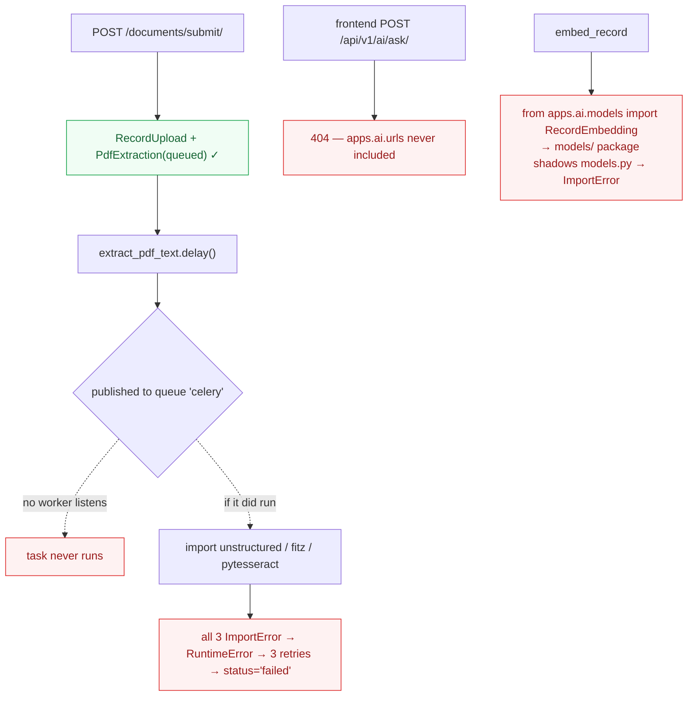

# 04 — AI / RAG Architecture

**Subject:** `backend/apps/ai/`, `backend/apps/documents/tasks.py`, the `ai-gateway` and `docling` services in both compose files, and the two RAG documents in `docs/`.

---

## The finding that governs this entire document

**There is no AI implementation in IRIS, and the service that both Docker Compose files build does not exist.**

This is not a judgement about quality. It is a directory listing.

```
backend/apps/ai/services/
  cohere_reranker.py    →  class CohereReranker:        pass
  llm_generator.py      →  class LLMGenerator:          pass
  pdf_extractor.py      →  class PDFExtractorService:   pass
  rag_pipeline.py       →  class RAGPipelineService:    pass
  summarizer.py         →  class SummarizationService:  pass
  text_chunker.py       →  class TextChunkerService:    pass
  vector_retriever.py   →  class VectorRetriever:       pass
  vector_store.py       →  class VectorStoreService:    pass

backend/apps/ai/models/
  conversation.py       →  class Conversation:    pass  /  class ChatMessage:  pass
  metadata.py           →  class DocumentMetadata: pass /  class DocumentChunk: pass
  summary.py            →  class DocumentSummary: pass
```

Eight service classes and five models. Every body is `pass`. Total: 46 lines including imports and `__all__`.

And:

```
$ ls ./ai
ls: cannot access './ai': No such file or directory
$ git ls-files | grep '^ai/'
(no output)
```

Both `docker-compose.yml:104` and `docker-compose.prod.yml:92` declare:

```yaml
ai-gateway:
  build: { context: ./ai, dockerfile: Dockerfile }
  env_file: [ ./ai/.env ]
```

**Neither compose file can start.** `docker compose up` fails at build resolution before any container runs.

---

## Documentation versus repository

`docs/rag_pipeline_service_map.md` maps eleven pipeline phases to services and source files. Cross-checking each against the working tree:

| Phase | Documented location | Reality |
|---|---|---|
| 1 · PDF upload | `documents/views.py` `SubmitDocumentView` | **Exists.** Works, but has no ownership check |
| 2 · Text extraction | `celery-extraction` → `docling` `/convert` | **Does not happen.** `documents/tasks.py` never calls `DOCLING_API_URL`; it runs a 3-tier chain whose libraries are not installed |
| 3 · Text cleaning | `_clean_text()` | **Exists**, unreachable — phase 2 always raises first |
| 4 · FTS indexing | `records/signals.py` → `update_search_vector` | **Exists and works.** The only fully functional phase besides 1 |
| 5 · Embedding | `celery-embedding` → `ai-gateway` `/internal/embed/` | **Does not happen.** `apps/ai/tasks.py` calls `sentence_transformers` (not installed) and imports models that are shadowed |
| 6 · Query encoding | `ai-gateway/routes/search.py` | **File does not exist** |
| 7 · Vector retrieval | `ai-gateway`, pgvector HNSW, `asyncpg` | **Does not exist.** No pgvector column, no HNSW index, no asyncpg |
| 8 · Reranking | "Not implemented" | Correctly documented as absent |
| 9 · Prompt augmentation | `ai-gateway/routes/ask.py` | **File does not exist** |
| 10 · LLM generation | `ai-gateway/routes/ask.py` | **File does not exist** |
| 11 · Summarization | `ai-gateway/routes/summarize.py` | **File does not exist.** `SummarizeView` returns HTTP 501 |

**Two of eleven phases exist.** The document is written in the present indicative throughout ("What Happens", "Stores To", "Returns") for a system that is nine-elevenths aspirational.

Additional documentation defects:

- Every source link is an absolute `file:///c:/Users/edlav/.antigravity/AntiProjects/IRIS/...` URL — another contributor's local filesystem. These do not resolve for anyone.
- It cites `docs/software-design/M04-RAG-AI-Services.md`, `docs/software-requirements/M03-Semantic-Indexing.md` and `docs/agile_and_scrum_notes.md`. **None exist in the repository.**
- `docker_compose_rag_services.md` specifies the gateway build context as `./ai-gateway`; the compose files use `./ai`. Two different non-existent paths.
- `docker_compose_rag_services.md` specifies `ankane/pgvector:v0.8.0-pg16`; the compose files use `pgvector/pgvector:pg16`.

**This matters beyond tidiness.** A reader — a teammate, an examiner, a future maintainer — cannot distinguish IRIS's built system from its plan by reading `docs/`. That is the single most correctable problem here.

---

## The current "AI" code path, as it actually executes



Four independent failures, any one of which is sufficient:

1. **No queue routing** — `-Q extraction` / `-Q embedding` consume queues nothing publishes to (BLOCK-3).
2. **Extraction libraries absent** from `requirements/base.txt` (BLOCK-4).
3. **`apps/ai/models/` shadows `models.py`**, so `RecordEmbedding` and `EmbeddingJob` are unreachable; `apps/ai/tasks.py:35` raises `ImportError`.
4. **`apps.ai.urls` is never included** in `config/urls.py`, so every frontend `/api/v1/ai/*` call 404s.

Plus a storage contradiction: the compose files use a pgvector image and `requirements/base.txt` lists `pgvector` **twice** (`>=0.3` at line 11, `>=0.2.4` at line 21) — but `pgvector` is not in `INSTALLED_APPS`, `RecordEmbedding.embedding` is a `BinaryField` holding `pickle.dumps()` output, and similarity search is a Python `for` loop calling `pickle.loads` on every row (`apps/ai/views.py`). Unpickling database content is also an unsafe-deserialization pattern — if a row can ever be written by anything but this task, it is arbitrary code execution.

---

## The central question

> **"Are these services actually separate domains, or are we distributing complexity unnecessarily?"**

## Answer: unnecessarily, on four independent grounds.

### 1. They are phases, not domains

A domain boundary earns a process boundary when the two sides have different data, different lifecycles, or different rates of change. Ingestion → chunking → embedding → retrieval → generation share **one data model** (`Record`, `PdfExtraction`, `RecordEmbedding`) and **one lifecycle** (a document is ingested once and queried many times). They are stages of a single pipeline over a single corpus. Splitting them across seven processes puts network boundaries inside one transaction's worth of work.

The **deletion test** applied to the service split:

> *If `ai-gateway`, `docling`, `celery-extraction`, `celery-embedding` and `celery-beat` were collapsed into `backend` + one `celery` worker, would complexity increase or merely move?*

It would **decrease outright**. There is nothing to move — the code those five services would run does not exist. What disappears is five Dockerfiles, five sets of environment wiring, one HTTP hop for embeddings, one HTTP hop for extraction, and a distributed failure surface. This is the clearest failing deletion test in the review.

### 2. The load premise is unsourced

`docker_compose_rag_services.md` justifies the split with "100 Concurrent RAG Users" and this table:

| Metric | Django sync | AI Gateway async |
|---|---|---|
| RAM for 100 concurrent RAG | ~15 GB | ~500 MB |

Three problems:

- **100 concurrent RAG users appears in no requirement document.** IRIS serves one university's research office: RDCO, KTTO, ITSO, IERC, plus advisers and students. 100 *simultaneous* AI conversations is not a plausible steady state, and no NFR in the SRS states it.
- **The 15 GB figure assumes 100 synchronous Gunicorn worker processes.** Gunicorn's `gthread` worker with `--threads 8` serves 100 concurrent I/O-bound requests in ~8 processes, because an OpenAI round-trip is a blocked socket, not CPU work. `gevent` does better still. The comparison is against the worst possible Django configuration, not a reasonable one.
- **Django supports async views.** `config/asgi.py` already exists. An `async def` view calling `httpx.AsyncClient` gets most of the gateway's benefit inside the existing process.

Building for a 100× traffic projection before serving one real user is the definition of premature distribution.

### 3. The split was made before the code existed

Every service in the split is empty. `apps/ai/services/rag_pipeline.py` is `class RAGPipelineService: pass`. The architecture was drawn, containerised and documented across two files and eleven phases before any behaviour was written. The Docker topology is therefore not derived from measurement or even from working code — it is derived from the diagram.

This inverts the ordering that makes distribution safe: build it in-process, measure it, then extract the part that actually hurts.

### 4. The refactor made the system worse

`docker_compose_rag_services.md` opens by describing the *previous* state — five services, `db`/`redis`/`backend`/`celery`/`frontend` — and asserts "This **does not scale**."

The five-service compose ran. The ten-service compose **cannot start**, because two of its services build from a directory that does not exist, and three more consume Celery queues nothing publishes to. Scalability was traded for availability, and the workload driving the trade has not been observed.

---

## AI-1 · Collapse to five services for the MVP

**Problem.** Ten declared services; two cannot build; three consume dead queues; one (`docling`, 4 GB) is called by no code; one (`celery-beat`) has no schedule.

**Evidence.** Per-service audit of `docker-compose.yml`:

| Service | State | Verdict |
|---|---|---|
| `db` | pgvector image; pgvector unused by the app | **Keep** (image is fine and future-proof) |
| `redis` | Working | **Keep** |
| `backend` | Cannot import `records.views` (BLOCK-1) | **Keep**, fix |
| `frontend` | Runs `npm install && vite dev`, ignoring the multi-stage Nginx Dockerfile that exists | **Keep**, fix for prod |
| `celery-default` | `-Q default` — nothing publishes there | **Merge** into one worker |
| `celery-extraction` | `-Q extraction` — nothing publishes there | **Remove** |
| `celery-embedding` | `-Q embedding` — nothing publishes there | **Remove** |
| `celery-beat` | No `CELERY_BEAT_SCHEDULE` defined | **Remove** |
| `docling` | 4 GB limit; **called by no code** | **Remove** |
| `ai-gateway` | **Build context does not exist** | **Remove** |

**Recommendation.** `db`, `redis`, `backend`, `celery` (one worker, default queue), `frontend`. Memory falls from a claimed ~8 GB to roughly **2 GB**.

**Alternatives.**

| Option | Verdict |
|---|---|
| Build the `ai/` gateway now | **Rejected for MVP.** A second language runtime, a second dependency tree, a second deployment unit, and a duplicated auth story — for a feature with no implementation. See AI-2. |
| Keep the split, stub the gateway | Rejected — a stub that returns 501 is `apps/ai` again, one network hop further away |
| Keep Docling, drop the gateway | Rejected for MVP — 4 GB for a fallback path PyMuPDF covers |

**Reasoning.** Deletion test fails decisively for the split. The five removed services run no code.

- **Complexity:** Low — deleting compose blocks
- **Risk:** Low — removes only non-functioning services
- **Dependencies:** BLOCK-3 (queue routing) is resolved by this
- **MVP:** **MVP BLOCKER**
- **Framework impact:** Drops FastAPI, uvicorn, asyncpg and Docling from the future dependency surface
- **Testing implications:** `docker compose config` becomes a meaningful CI check.

---

## AI-2 · Implement RAG inside Django first; extract only on measurement

**Problem.** The intended design puts RAG in a separate FastAPI service. That service does not exist, and the reasons given for it are projections rather than measurements.

**Recommendation.** Implement the pipeline as ordinary Django code:

| Phase | Where | How |
|---|---|---|
| Extraction | `documents/tasks.py`, Celery | PyMuPDF (BLOCK-4) |
| Chunking | `documents/chunking.py` | Pure function — no library needed for fixed-size overlapping chunks |
| Embedding | Celery task | One provider call, stored in a pgvector `VectorField` |
| Retrieval | `records/search.py` | `CosineDistance` ORM annotation — pgvector's Django integration is first-class |
| Generation | `async def` DRF view | `httpx.AsyncClient` under ASGI, which `config/asgi.py` already supports |

Then **measure**. If p95 latency on `/ai/ask/` degrades non-AI endpoints under realistic load, that is the evidence that justifies extraction — and by then the code to extract will exist.

**Alternatives.**

| Option | Verdict |
|---|---|
| FastAPI gateway now | **Rejected for MVP.** Two runtimes, duplicated auth, duplicated DB access, one more deployment unit, for zero implemented behaviour |
| Gunicorn `gthread`/`gevent` if concurrency bites | **Recommended intermediate step.** One config line, most of the async benefit, no new service |
| LangChain / LlamaIndex | **DO NOT IMPLEMENT.** See AI-4 |

**Reasoning.** "One adapter is a hypothetical seam; two is a real one." There is currently *zero*. The gateway's real benefit — protecting fast CRUD from slow LLM round-trips — is achievable with a worker-class change, and can be verified before it is architected around.

- **Complexity:** Medium (the pipeline itself; unavoidable either way)
- **Risk:** Low — additive
- **Dependencies:** AI-1, BLOCK-3, BLOCK-4, BLOCK-5
- **MVP:** **MVP REQUIRED** (FR-M3/M4 are in scope) · **POST-MVP** (extraction into a gateway)
- **Framework impact:** +`pgvector` (properly wired), +`httpx` (already listed); avoids FastAPI/uvicorn/asyncpg
- **Testing implications:** In-process code tests with a mocked provider client. A cross-service HTTP boundary needs a running container to test at all — a real cost the split imposes on a codebase with zero tests.

---

## AI-3 · Use pgvector properly, and stop pickling vectors

**Problem.** The stack advertises pgvector everywhere and uses none of it. Vectors are pickled into a `BinaryField` and searched with a Python loop.

**Evidence.**

- `apps/ai/models.py:26` — `embedding = models.BinaryField()`, with a 20-line TODO describing the intended migration.
- `apps/ai/tasks.py:57` — `"embedding": pickle.dumps(embedding)`.
- `apps/ai/views.py` — loads **every** `RecordEmbedding`, `pickle.loads` each one, computes cosine similarity in NumPy, sorts in Python. O(n) rows into application memory per query.
- `pgvector` is absent from `INSTALLED_APPS` and listed twice in `requirements/base.txt`.

**Recommendation.** `VectorField(dimensions=N)`, an HNSW index in a migration, and retrieval via the ORM's `CosineDistance` annotation with `LIMIT k`. The TODO in `models.py` already specifies this correctly — follow it. Remove `pickle` entirely.

**Alternatives.**

| Option | Verdict |
|---|---|
| **pgvector in the existing Postgres** | **Recommended.** No new service, no new backup target, transactional consistency with `Record`, and the image is already pgvector |
| Qdrant / Weaviate / Milvus | **DO NOT IMPLEMENT.** A second stateful service, a second backup story, a second consistency problem, for a corpus in the thousands of documents. pgvector handles this scale comfortably |
| FAISS in-process | Rejected — no persistence, no concurrency story |
| Keep pickle + NumPy | Rejected — O(n) per query, plus unsafe deserialization |

**Reasoning.** Deletion test on a separate vector DB **fails**: removing it and using pgvector *reduces* total complexity by one service, one backup target and one sync path.

- **Complexity:** Low — the change is well-specified in the existing TODO
- **Risk:** Low — no production embeddings exist to migrate
- **Dependencies:** BLOCK-5 (`apps.ai` migrations) must be resolved first
- **MVP:** **MVP REQUIRED**
- **Framework impact:** `pgvector` correctly wired; deduplicate the requirements entry
- **Testing implications:** Retrieval becomes an ORM query, testable against a test database with fixture vectors.

---

## AI-4 · Do not adopt LangChain

**Problem.** Not currently a dependency. Listed as a candidate in the review brief, and the SRS change history records that a switch from LangChain to n8n was proposed and rejected in May 2026 — so the question is live.

**Recommendation.** **DO NOT IMPLEMENT.** IRIS's pipeline is: embed a query → `ORDER BY embedding <=> q` → format a prompt → one chat-completion call → return text plus record ids. That is roughly 60 lines of explicit Python.

**Alternatives.**

| Option | Verdict |
|---|---|
| Explicit code | **Recommended.** Every step legible and independently testable |
| LangChain | Rejected — large transitive dependency tree, rapid breaking changes, and abstractions (chains, retrievers, memory) whose value appears with multi-step agents, tool use and provider-swapping. IRIS has one chain |
| LlamaIndex | Rejected — same reasoning, RAG-specialised |
| n8n | Already rejected by the team in the SRS change history; agreed — a workflow-automation server is not an application framework |

**Reasoning.** Deletion test: removing LangChain from a five-step pipeline moves complexity *out* of a dependency and into 60 readable lines. That is a gain. The framework earns its place when the graph is complex or the provider must be swappable — neither is true here, and a thin `EmbeddingProvider` / `LLMProvider` protocol gives swappability for ~20 lines. Do not introduce a framework unless its benefit clearly exceeds its complexity; here it does not.

- **Complexity:** N/A (not adopting) · **Risk:** N/A · **MVP:** **DO NOT IMPLEMENT**

---

## AI-5 · Decide the provider, then make the configuration agree with itself

**Problem.** Three configuration sources name three different providers.

**Evidence.**

| Source | Says |
|---|---|
| `settings/base.py:180` | `OPENAI_API_KEY`, comment: "GPT-4.1-mini LLM inference + embedding API" |
| `settings/base.py:179` | `AI_EMBEDDING_MODEL` default **`"TBD"`** |
| `backend/.env.example:31` | **`ANTHROPIC_API_KEY=your-anthropic-key`** |
| `backend/.env.example:32` | `AI_EMBEDDING_MODEL=all-MiniLM-L6-v2` — a local sentence-transformers model, not an API model |
| `requirements/base.txt:10` | `openai>=1.30` |
| `apps/ai/services/cohere_reranker.py` | A third vendor, as an empty class |

A developer copying `.env.example` gets an Anthropic key the settings never read and a local embedding model the (uninstalled) library cannot load.

**Recommendation.** Make one decision, record it as an ADR, and make all three sources agree. Concretely, per the cost analysis in [08](08-framework-evaluation.md): OpenAI `text-embedding-3-small` for embeddings and a small chat model for generation, behind two thin protocols (`EmbeddingProvider`, `LLMProvider`) so the decision is reversible in one module. Replace `AI_EMBEDDING_MODEL="TBD"` with a real default, and fail loudly at startup when the key is missing rather than at first query.

**Alternatives.** Local embeddings via sentence-transformers — zero marginal cost and no data egress (which matters for confidential IP), but ~500 MB of model weights and CPU inference in the worker; a legitimate choice for an on-campus deployment, and worth an explicit decision rather than an accidental one.

- **Complexity:** Low · **Risk:** Low
- **Dependencies:** AI-2
- **MVP:** **MVP REQUIRED**
- **Framework impact:** Drops `sentence_transformers` if API embeddings are chosen; drops `openai` if local ones are
- **Testing implications:** The protocols are the seam — tests inject a fake provider and never call a paid API.

---

## AI-6 · Design the failure, cost and latency envelope before shipping

**Problem.** No design exists for any of the operational properties of an AI feature. The brief asks about failure handling, caching, cost, latency and concurrency; the current answers are all "unspecified."

**Evidence.** No timeout on any provider call (none exist). No rate limiting on `/ai/*` beyond DRF's global `1000/day` user throttle — which is not a spend control. No caching of embeddings or answers. No cost ceiling. No token accounting.

**Recommendation.** Before the first provider call ships:

| Concern | Minimum viable answer |
|---|---|
| **Failure** | Explicit timeout (~30 s); on provider error return HTTP 503 with a clear message, never a fabricated answer. Never swallow — contrast `notifications/services.py` |
| **Caching** | Cache embeddings by content hash — a re-indexed unchanged record must not be re-embedded and re-charged. Redis is already deployed |
| **Cost** | A per-user daily cap on `/ai/ask/` via a DRF `ScopedRateThrottle`, plus token counts written to `AuditEvent.metadata`. A thesis project needs a spend ceiling more than it needs throughput |
| **Latency** | Retrieval is fast; generation is 3–10 s. Stream the response, or show a determinate progress state. Do not block the UI on a synchronous 10 s call |
| **Concurrency** | A semaphore or throttle so a burst cannot exhaust the provider quota for everyone |
| **Citations** | Return record ids and render them as links. The corpus is small and the audience is academic — an ungrounded answer with no source is worse than no answer |

**Reasoning.** These are the properties that determine whether an AI feature is usable or a liability. They are cheap to design now and expensive to retrofit — and one of them (cost) can produce a real bill against a student's card.

- **Complexity:** Low · **Risk:** Low
- **Dependencies:** AI-2, AI-5
- **MVP:** **MVP REQUIRED** (failure, cost, citations) · **MVP RECOMMENDED** (caching, streaming)
- **Framework impact:** Uses Redis and DRF throttling — both already present
- **Testing implications:** Timeout and failure paths test with a fake provider that raises.

---

## AI-7 · Rewrite the two RAG documents as plans, not descriptions

**Problem.** `docs/rag_pipeline_service_map.md` and `docs/docker_compose_rag_services.md` describe an aspirational system in the present tense. Nine of eleven phases do not exist. Source links point at another contributor's local filesystem. Cited requirement documents are absent.

**Recommendation.** Keep both — the *thinking* is valuable and the target architecture may well be right at scale. But:

1. Retitle to make status explicit: *"Target RAG Architecture (not yet implemented)."*
2. Add a status column per phase: implemented / partial / not started. Two of eleven are implemented today.
3. Replace `file:///c:/Users/edlav/...` links with repository-relative paths.
4. Remove or restore the citations to `docs/software-design/`, `docs/software-requirements/` and `docs/agile_and_scrum_notes.md`.
5. Reconcile the contradictions: `./ai` vs `./ai-gateway`, `pgvector/pgvector:pg16` vs `ankane/pgvector`.
6. Fix `docs/README.md`, which links **seven documents that do not exist**.

**Reasoning.** For a thesis this is not cosmetic. An examiner reading `docs/` cannot currently tell what was built from what was planned, and the SDD/SRS are the artefacts being assessed. Documentation that overstates delivery is a credibility risk that costs an afternoon to remove.

- **Complexity:** Low · **Risk:** None · **Dependencies:** None
- **MVP:** **MVP REQUIRED**
- **Framework impact:** None
- **Testing implications:** A CI link-checker over `docs/` prevents recurrence.

---

## Summary

| Question | Answer |
|---|---|
| Is the RAG pipeline implemented? | **No.** 2 of 11 phases; 8 service classes are `pass` |
| Does the AI gateway exist? | **No.** `./ai` is not in the repository; both compose files fail on it |
| Is the Docker service separation justified? | **No.** Phases, not domains; unsourced load premise; split before implementation; the result cannot boot |
| Should there be a separate vector DB? | **No.** pgvector in the existing Postgres |
| Should LangChain be adopted? | **No.** ~60 lines of explicit code |
| What should the MVP do? | Five services; RAG in-process; pgvector properly; one provider decision; cost and failure envelope designed up front |
| When would a gateway be justified? | When measured `/ai/ask/` load demonstrably degrades non-AI endpoints — and the code to extract exists |
