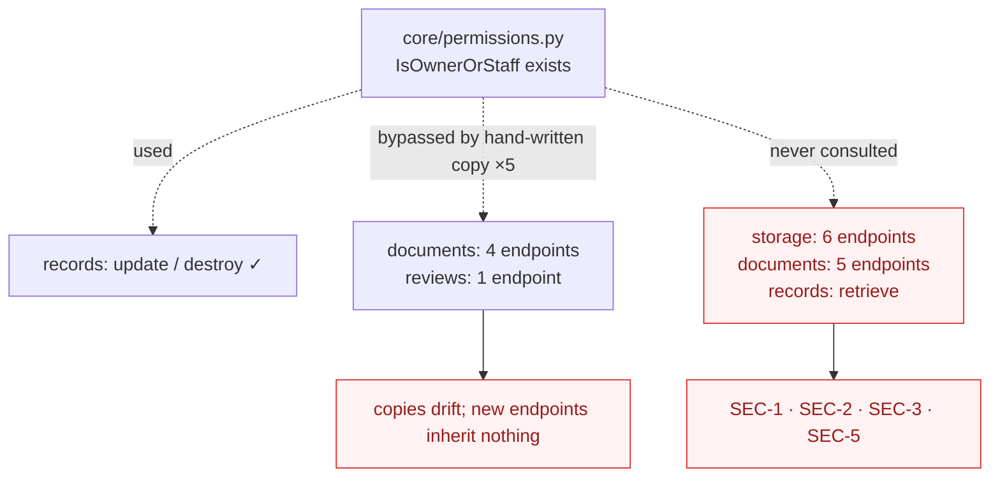

# 05 — Security Architecture

**Priority note.** Per the review brief, security defects outrank cosmetic refactoring. Everything in this document takes precedence over every item in [02](02-backend-architecture.md) and [03](03-frontend-architecture.md) except the five blockers that stop the system running at all.

**Scope.** This is a design and code review, not a penetration test. No exploitation was attempted; the system does not currently run. Every finding below is derived from reading the source and is cited to a file and line.

---

## Summary

| ID | Finding | Severity | Exploitable by | MVP |
|---|---|---|---|---|
| **SEC-1** | Any authenticated user can read any record by id | **Critical** | any student account | BLOCKER |
| **SEC-2** | `RecordFileDownloadAllView` has no permission check at all | **Critical** | any student account | BLOCKER |
| **SEC-3** | `apps/storage` has no ownership check on any endpoint | **Critical** | any student account | BLOCKER |
| **SEC-4** | `is_staff` seeding + blanket staff bypass collapses separation of duties | **High** | ITSO / IERC accounts | BLOCKER |
| **SEC-5** | Five more `documents/` endpoints missing ownership checks | **High** | any student account | BLOCKER |
| **SEC-6** | Record access PIN gates nothing server-side | **High** | any authenticated user | REQUIRED |
| **SEC-7** | Access token persists in `localStorage` after logout | **Medium** | XSS-adjacent | REQUIRED |
| **SEC-8** | `CORS_ALLOW_ALL_ORIGINS` with credentials in development | **Medium** | dev only | REQUIRED |
| **SEC-9** | Unsafe `pickle` deserialization of database content | **Medium** | requires DB write | REQUIRED (moot if AI-3 lands) |
| **SEC-10** | Unguarded `.get()` calls return 500 and leak stack traces when `DEBUG=True` | **Low** | any | RECOMMENDED |
| **SEC-11** | Audit log readable by all four office roles, including failed-login emails | **Low** | staff roles | RECOMMENDED |
| **SEC-12** | Production settings still `TODO`; secrets defaults are permissive | **Medium** | deployment-time | REQUIRED |

**Four of these are exploitable by any user who completes signup and gets a Student role.** They are not theoretical: each is a missing line in a specific view.

---

## What is done well

Credit where due — the foundations are sound, which is what makes the gaps fixable rather than structural.

- **Custom user model with email login**, `AbstractBaseUser` + `PermissionsMixin`. Correct.
- **JWT with rotation and blacklisting** — `ROTATE_REFRESH_TOKENS`, `BLACKLIST_AFTER_ROTATION`, 30-minute access lifetime. A deliberate, correct configuration.
- **`django-axes`** brute-force protection, 3 failures, 10-minute cooloff, locked by user+IP combination. Meets NFR-S6.
- **`UserSerializer` marks `role`, `is_staff`, `is_superuser`, `is_verified`, `is_locked` read-only** (`accounts/serializers.py:17`). This is the check that prevents self-escalation through `PATCH /users/me/`, and it is correct. Verified explicitly.
- **Session management** — `ActiveSessionsView` / `RevokeSessionView` over `OutstandingToken`, with audit events. Genuinely good, and rare in a project this size.
- **Unified audit log** with a JSONB metadata column, and `create_audit_event` designed never to raise.
- **Download tokens** are short-lived signed JWTs with a type claim, bound to `(download_request, record, user)` and re-verified against the database (`records/views.py:566-575`). Well designed.
- **Password validators** configured; DPA/RA-10173 consent captured at signup.

The problem is not the security *design*. It is that object-level authorization was implemented per-endpoint by hand, and roughly a third of the endpoints were missed.

---

## SEC-1 · Any authenticated user can read any record

**Problem.** `RecordViewSet` filters record visibility only for the `list` action. Every other action — including `retrieve` — runs against the unfiltered queryset with bare `IsAuthenticated`.

**Evidence.** `records/views.py:50-58`:

```python
def get_queryset(self):
    if self.action == "list":
        return Record.objects.filter(
            pipeline_status__in=("published", "approved", "completed")
        ).select_related(...)
    return Record.objects.select_related(...)      # ← no visibility filter
```

and `records/views.py:67-72`:

```python
def get_permissions(self):
    if self.action in ("update", "partial_update", "destroy"):
        return [IsAuthenticated(), IsOwnerOrStaff()]
    if self.action == "complete":
        return [IsAuthenticated(), IsRDCO()]
    return [IsAuthenticated()]                      # ← retrieve lands here
```

**Impact.** `GET /api/v1/records/<id>/` returns **any record in the system** to any authenticated account: another student's unsubmitted draft, a thesis under IERC ethics review, a rejected submission with its reviewer comments, an unpublished commercialisable invention. `RecordDetailSerializer` includes the abstract and related detail. Ids are sequential integers, so the corpus enumerates trivially.

For a system whose purpose is managing **confidential pre-publication IP disclosures**, this is the most serious finding in the review.

**Recommendation.** Implement BE-4's `Record.objects.visible_to(user)` scope and return it from `get_queryset()` for **all** actions, so `retrieve` 404s on a record the user may not see. Add `IsOwnerOrStaff` to `retrieve` as defence in depth.

**Alternatives.** Object-level permission alone — works, but returning 403 rather than 404 confirms the record exists, and it leaves the other five copies of the visibility rule in place.

- **Complexity:** Low · **Risk:** Low — narrows access; failures are visible
- **Dependencies:** None (BE-4 is the clean form)
- **MVP:** **MVP BLOCKER**
- **Framework impact:** None
- **Testing implications:** One regression test per role×visibility pair. Write it in the same commit or this reopens.

---

## SEC-2 · `RecordFileDownloadAllView` has no permission check whatsoever

**Problem.** The bulk file download endpoint performs no ownership or staff check. Its siblings all do.

**Evidence.** `documents/views.py:399-423`:

```python
class RecordFileDownloadAllView(APIView):
    permission_classes = [IsAuthenticated]

    def get(self, request):
        record_id = request.query_params.get("record")
        files = RecordFile.objects.filter(record_id=record_id)
        buffer = build_zip(files)
        ...
```

No `is_owner`, no `is_staff_user`, no 403 branch. Routed at `documents/urls.py` as `files/download-all/`.

Contrast `RecordFileDownloadView` 40 lines above, which checks both. The check was written for the single-file endpoint and not carried to the bulk one — the exact failure mode BE-3 predicts when a policy is copy-pasted rather than centralised.

**Impact.** `GET /api/v1/documents/files/download-all/?record=<any id>` returns a ZIP of **every** `RecordFile` on any record, to any authenticated user. This is worse than SEC-1: SEC-1 leaks metadata, this leaks the documents themselves. It also writes a `DOWNLOAD` audit event, so the access is at least recorded.

**Recommendation.** Apply the same owner-or-staff check — ideally via `IsOwnerOrStaff` (BE-3) rather than a sixth hand-written copy.

- **Complexity:** Trivial · **Risk:** None
- **MVP:** **MVP BLOCKER**
- **Testing implications:** One test asserting 403 for a non-owner.

---

## SEC-3 · `apps/storage` has no ownership check on any endpoint

**Problem.** All six storage endpoints are bare `IsAuthenticated` with unfiltered querysets.

**Evidence.** `storage/views.py`:

| View | Line | Queryset | Check |
|---|---|---|---|
| `StorageListView` | 11 | `filter(parent=parent)` — no owner filter | none |
| `StorageFolderListView` | 46 | `filter(parent_id=…)` | none |
| `StorageFolderDetailView` | 60 | **`StorageFolder.objects.all()`** | none |
| `StorageFileListView` | 67 | `filter(folder_id=…)` | none |
| `StorageFileDetailView` | 81 | **`StorageFile.objects.all()`** | none |
| `StorageFileDownloadView` | 88 | `.get(pk=pk)` | none |

`StorageFolderDetailView` is `RetrieveUpdateDestroyAPIView`. `StorageFileDetailView` is `RetrieveDestroyAPIView`.

**Impact.** Any authenticated user can enumerate, rename, download and **delete** any other user's folders and files. `StorageFolder.on_delete=CASCADE` on `parent`, so deleting a root folder destroys the whole subtree. There is no soft delete on these models and no audit event on these paths — the deletion is silent and unrecoverable.

`StorageFile` carries `uploaded_by` and `StorageFolder` carries `created_by`, so the ownership data exists and is simply never consulted.

**Recommendation.** Filter every queryset by `created_by=request.user` / `uploaded_by=request.user`, and add `IsOwnerOrStaff` to the detail views. Decide explicitly whether storage is personal (owner only) or institutional (shared, staff-managed) — the models say personal, the SRS mentions both "Institutional File Storage" (FR-M2-06) and "Personal File Storage". **That decision is required before the fix.** See [10](10-architecture-decisions-required.md).

**Alternatives.** Leave open and treat storage as a shared institutional drive — defensible *only* if it is a deliberate, documented decision, and even then unauthenticated deletion by any student is not.

- **Complexity:** Low · **Risk:** Low
- **Dependencies:** The institutional-vs-personal decision
- **MVP:** **MVP BLOCKER**
- **Testing implications:** Six endpoints, one parametrised non-owner test.

---

## SEC-4 · `is_staff` seeding plus blanket bypass collapses separation of duties

**Problem.** The four review offices exist to check each other. A migration and a helper function together dissolve that.

**Evidence, in three parts.**

**(a)** `accounts/migrations/0005_set_is_staff_for_staff_roles.py` sets `is_staff=True` for **RDCO, KTTO, ITSO and IERC**:

```python
STAFF_ROLE_NAMES = {"RDCO", "KTTO", "ITSO", "IERC"}
User.objects.filter(role__name__in=STAFF_ROLE_NAMES).update(is_staff=True)
```

**(b)** `core/permissions.py:23-25`:

```python
def is_django_staff(user) -> bool:
    return bool(getattr(user, "is_superuser", False) or getattr(user, "is_staff", False))
```

**(c)** `IsAdmin` is documented as "KTTO, RDCO, or any Django staff/superuser" and defined as:

```python
ADMIN_ROLES = {ROLE_KTTO, ROLE_RDCO}
class IsAdmin(BasePermission):
    def has_permission(self, request, view):
        return is_django_staff(request.user) or get_role_name(request.user) in ADMIN_ROLES
```

Because (a) gives ITSO and IERC `is_staff=True`, (b) returns `True` for them, so (c)'s `ADMIN_ROLES` restriction **never applies to anyone**. The set is decorative.

**Impact — privilege escalation.** An ITSO or IERC account, which should only clear its own office's review, gains every `IsAdmin` endpoint:

| Endpoint | Capability |
|---|---|
| `PATCH /users/<id>/role/` | **Assign any role to any user, including RDCO** — self-escalation to full control |
| `PATCH /users/<id>/lock/` | Lock any account, including all RDCO accounts |
| `POST /users/<id>/unlock/` | Unlock any account |
| `GET /users/sessions/` | List every active session with user emails |
| `DELETE /users/sessions/<jti>/` | Revoke any user's session |
| `GET /users/` | Full user directory |
| `PATCH /settings/<key>/` | Modify system settings |

**Impact — workflow bypass.** The same helper appears inside the workflow engine. `reviews/services.py:76-79`:

```python
def _can_review(user, record):
    if is_django_staff(user):
        return True          # ← ITSO and IERC reach this
```

and `_can_submit_clearance` grants staff a pending-clearance fallback and a final `if staff: return True, office`. So an ITSO user can perform **RDCO's final approval** and publish a record that IERC never cleared. The parallel-office model — the core of SRS Module 5 and the reason the system exists — is unenforced.

**Compounding:** `is_staff=True` also grants Django admin login. `admin/` is mounted at `config/urls.py:7` and proxied by nginx at `/admin/`. Four office roles have admin-site access with whatever model permissions they are granted.

**Recommendation.**

1. **Separate the two meanings of "staff."** IRIS office roles are not Django administrators. Either stop setting `is_staff` in migration 0005, or stop treating `is_staff` as an authorization bypass — do not do both.
2. **Delete `is_django_staff` from the workflow path.** `_can_review` and `_can_submit_clearance` should test role against stage, with `is_superuser` only (not `is_staff`) as a break-glass, and only if genuinely needed.
3. **Make `IsAdmin` mean `ADMIN_ROLES` or `is_superuser`.**
4. Write a migration reversing `is_staff` for ITSO and IERC, and gate `admin/` behind superuser.

**Alternatives.** Keep the bypass and rely on the audit log — rejected: audit is detective, not preventive, and `AuditEvent` does not record clearance decisions distinctly.

- **Complexity:** Low · **Risk:** **Medium** — this narrows real access; existing staff accounts may lose capabilities they currently rely on. Coordinate with the team before applying
- **Dependencies:** BE-3 (policy object) is where the fixed rule should live
- **MVP:** **MVP BLOCKER**
- **Framework impact:** None
- **Testing implications:** The single highest-value authorization test in the system: a table of `(role, stage, action) → allowed` covering all six roles and all six stages, asserting ITSO cannot approve at `rdco_review`.

---

## SEC-5 · Five more `documents/` endpoints missing ownership checks

**Problem.** Beyond SEC-2, five further document endpoints omit the check their siblings perform.

**Evidence.**

| Endpoint | Line | Missing |
|---|---|---|
| `SubmitDocumentView` | `views.py:14` | Any user can upload a PDF into **any** record |
| `RecordUploadCreateView` | `views.py:180` | Any user can add a new version to any record; `Record.objects.get(pk=…)` is also unguarded |
| `RecordUploadListView` | `views.py:122` | Enumerate any record's upload history |
| `RecordFileListView` | `views.py:242` | Enumerate any record's attachments |
| `RecordSlotListView` | `views.py:103` | Read any record's slot structure and upload state |

The write cases are the serious ones. `SubmitDocumentView` and `RecordUploadCreateView` let any authenticated user inject a document into another user's submission. Because `resubmit_record` (`reviews/services.py:352-365`) requires *"at least one document uploaded after the last decline"* before a record may re-enter the pipeline, a third party can satisfy another user's resubmission gate — a workflow-integrity problem, not only a confidentiality one.

**Recommendation.** Apply `IsOwnerOrStaff` to all five. Filter the two list endpoints by records visible to the caller (BE-4).

- **Complexity:** Low · **Risk:** Low
- **Dependencies:** BE-3
- **MVP:** **MVP BLOCKER**
- **Testing implications:** Covered by the same parametrised non-owner test as SEC-2.

---

## SEC-6 · The record access PIN gates nothing

**Problem.** `RecordAuthPin` implements a one-time emailed PIN for gated record access (SDD 3.5.2). The mechanism issues and verifies PINs correctly and then **enforces nothing**.

**Evidence.** `reviews/views.py:234-326`.

Issuance (`generate`) has `permission_classes = [IsAuthenticated]` and looks up the record by id with no check that the record is PIN-gated or that the caller has any relationship to it:

```python
record = Record.objects.get(pk=record_id)
# no authorization check
RecordAuthPin.objects.create(record=record, user=request.user, ...)
send_email_async(...)
```

Verification returns a bare confirmation:

```python
auth_pin.is_used = True
auth_pin.save(update_fields=["is_used"])
return Response({"verified": True, "record_id": int(record_id)})
```

Nothing is persisted that any *later* request consults. No session flag, no grant row, no scoped token. No other view queries `RecordAuthPin`: `grep -rn "RecordAuthPin" backend/` returns only the model, its serializer, this view, and its migrations.

**Impact.** The PIN is a client-side gate. The frontend presents the modal and, on `{"verified": true}`, renders the record — but the underlying record and document endpoints never ask whether a PIN was verified. Any client that skips the modal and calls the record endpoint directly gets the same data. Given SEC-1 and SEC-5, that data is already reachable regardless.

Secondary: any authenticated user can cause IRIS to send a PIN email to **their own** address for **any** record id, which is an enumeration oracle (404 vs 201) and an email-sending primitive.

**Recommendation.** Decide what the PIN is for, then implement one side of it:

- **If it is a real access control:** verification must create a server-side grant (a row, or a short-lived scoped token bound to `(user, record)`), and the record/document endpoints must require it. This is the SDD's evident intent.
- **If it is a confirmation-of-intent step:** say so, and stop calling it access control.

Either way, restrict `generate` to records the caller may already see (BE-4).

- **Complexity:** Medium (real grant) · Low (restrict issuance)
- **Risk:** Low
- **Dependencies:** SEC-1, BE-4
- **MVP:** **MVP REQUIRED** — an access control that does not control access is worse than none, because it is relied upon
- **Testing implications:** Test that a record endpoint 403s without a verified grant.

---

## SEC-7 · Access token survives logout in `localStorage`

**Problem.** The refresh interceptor writes tokens to `localStorage`; logout clears only one of them.

**Evidence.** `api/client.ts:29-30` writes `localStorage["access_token"]` and `localStorage["refresh_token"]`. `lib/authStorage.ts:16-20`:

```python
export function clearAuthSession(): void {
  sessionStorage.removeItem(REFRESH_KEY);
  localStorage.removeItem("refresh_token");   // access_token not removed
}
```

**Impact.** A valid bearer token (30-minute lifetime) persists in durable browser storage after logout, on a shared or lab machine, readable by any script on the origin. The application's stated design — refresh token in `sessionStorage`, access token in memory only (`lib/authStorage.ts:1-4`) — is correct; the interceptor silently violates it.

**Recommendation.** Remove both `localStorage` writes (FE-5); have the interceptor call `store.setTokens(...)`. Clear legacy keys on boot so existing users are cleaned up.

- **Complexity:** Trivial · **Risk:** None · **MVP:** **MVP REQUIRED**
- **Testing implications:** Assert `localStorage` is empty after `logout()`.

---

## SEC-8 · `CORS_ALLOW_ALL_ORIGINS` with credentials in development

**Problem.** `config/settings/development.py:11` sets `CORS_ALLOW_ALL_ORIGINS = True` while `base.py:150` sets `CORS_ALLOW_CREDENTIALS = True`.

**Impact.** Any origin may make credentialed cross-origin requests to a developer's running instance. Because IRIS uses bearer tokens rather than cookies, the practical exposure is limited — but the combination is exactly the one that becomes critical if the auth model ever moves to httpOnly cookies (a change FE-5 lists as a post-MVP option), and dev settings have a way of reaching staging.

`base.py` correctly restricts `CORS_ALLOWED_ORIGINS = [FRONTEND_URL]`; production inherits that. The risk is scoped to development.

**Recommendation.** Replace with `CORS_ALLOWED_ORIGINS = ["http://localhost:5173", "http://127.0.0.1:5173"]`. There is no dev workflow here that needs arbitrary origins.

- **Complexity:** Trivial · **Risk:** None · **MVP:** **MVP REQUIRED**

**CSRF note.** DRF with `JWTAuthentication` is not session-authenticated, so `CsrfViewMiddleware` is not load-bearing for the API. It is correctly enabled for the Django admin. No action needed — but this is *because* tokens are sent in a header, which is another reason not to move to cookie auth without also designing CSRF.

---

## SEC-9 · Unsafe deserialization of database content

**Problem.** `apps/ai/views.py` calls `pickle.loads(emb.embedding)` on every `RecordEmbedding` row; `apps/ai/tasks.py:57` writes them with `pickle.dumps`.

**Impact.** `pickle.loads` on untrusted input is arbitrary code execution. The input here is a database column written only by a Celery task, so exploitation requires database write access — meaning this is a defence-in-depth failure rather than a directly exploitable bug. It nonetheless places a code-execution primitive one SQL injection or one compromised backup-restore away from the application.

Both files are currently unreachable (shadowed by the `views/` and `models/` packages), so nothing executes today.

**Recommendation.** Resolved entirely by **AI-3** — a pgvector `VectorField` stores a native vector type and removes `pickle` from the codebase. Do not fix this in place; delete the code (BLOCK-5) and implement AI-3.

- **Complexity:** Low (subsumed by AI-3) · **Risk:** Low
- **MVP:** **MVP REQUIRED** (as part of AI-3 / BLOCK-5)

---

## SEC-10 · Unguarded `.get()` calls produce 500s

**Problem.** Several views fetch by primary key without handling `DoesNotExist`, so a bad id returns HTTP 500 instead of 404.

**Evidence.** `accounts/views.py:146` (`ChangeUserRoleView`), `:196` (`LockUserView`), `:235` (`UnlockUserView`), `:267` (`RoleRequestDetailView`), `documents/views.py:186-187` (`RecordUploadCreateView`).

**Impact.** Low in production (`DEBUG=False` yields a generic 500). In development, Django's debug page renders a full traceback with local variables and settings — and `docker-compose.yml` runs `DJANGO_SETTINGS_MODULE=config.settings.development` with `runserver`, so any deployment that uses the dev compose file exposes tracebacks. Also a minor availability issue: unhandled exceptions in DRF are not throttle-limited differently from 404s.

`RoleRequestDetailView.patch` additionally returns HTTP 200 with an unchanged serializer when `action` is neither `approve` nor `decline` — a silent no-op an operator would read as success.

**Recommendation.** Use `get_object_or_404` or DRF generics. Return 400 for an unrecognised `action`. Ensure the production compose file is the one used for anything internet-facing.

- **Complexity:** Trivial · **Risk:** None · **MVP:** **MVP RECOMMENDED**

---

## SEC-11 · Audit log visibility

**Problem.** `AuditEventListView` uses `IsAdminUser` (Django `is_staff`). Because migration 0005 sets `is_staff=True` for all four office roles, **RDCO, KTTO, ITSO and IERC can all read the entire audit log** — including `FAILED_LOGIN` events, whose `metadata` contains the attempted email address (`accounts/views.py:50`).

**Impact.** Low on its own; it is an internal-staff disclosure, and audit-log access is arguably appropriate for RDCO. It becomes a compounding factor with SEC-4: a role that should not be an administrator can read every login, access and download event for every user.

**Secondary issue — audit coverage gaps.** The `ACCESS` event type is overloaded: `records/views.py:223` records a tag edit as `ACCESS` with `metadata={"action": "tags_updated"}`. There is no event type for a review decision or clearance, so the workflow actions with the highest integrity value — approve, decline, reject, clear — are **not audited at all**. `Review` rows record them, but the audit log does not, so an audit-log reader sees logins and downloads but not who published a record.

**Recommendation.** Narrow audit reads to `ADMIN_ROLES` or superuser once SEC-4 is fixed. Add `REVIEW_DECISION` and `CLEARANCE_DECISION` event types and emit them from `reviews/services.py`. Give tag edits their own type.

- **Complexity:** Low · **Risk:** Low
- **Dependencies:** SEC-4
- **MVP:** **MVP RECOMMENDED** (visibility) · **MVP REQUIRED** (auditing review decisions — this is a thesis-scope compliance requirement)

---

## SEC-12 · Production configuration is unfinished

**Problem.** `config/settings/production.py` is 13 lines, four of which are `TODO`s, and several security-relevant defaults in `base.py` are permissive.

**Evidence.**

| Item | State |
|---|---|
| `ALLOWED_HOSTS` | `# TODO: set ALLOWED_HOSTS to real domain`; `base.py:8` defaults to `"localhost"` |
| S3 / media storage | `# TODO: configure S3 for MEDIA_ROOT via django-storages` — `django-storages[s3]` installed, unconfigured |
| Sentry | `# TODO: configure Sentry DSN` — `sentry-sdk` in `production.txt`, never initialised |
| `SECRET_KEY` | No default (good — fails loudly), but `.env.example` ships `change-me-in-production` |
| DB credentials | `base.py:79-82` defaults to `iris_user` / `iris_password`; both compose files hardcode the same values |
| `DEBUG` | Defaults to `False` (good), but `docker-compose.yml` runs the development settings module |
| Media serving | nginx serves `/media/` directly from a shared volume with **no authorization** — see below |

**The media-volume finding is the important one.** `frontend/nginx.conf:52-56` serves `/media/` as static files from the mounted volume, and `docker-compose.prod.yml` mounts `media_files` into the nginx container read-only. Every uploaded thesis PDF is therefore reachable at `https://host/media/documents/<filename>` **with no authentication at all**, bypassing every permission check in `documents/views.py`. Filenames are derived from the uploaded file name (`upload_to="documents/"`), so they are guessable for any predictably-named document.

This is arguably the most severe issue in this document alongside SEC-1 and SEC-2, and it is a *deployment* defect rather than a code defect — which is why it is easy to miss.

**Recommendation.**

1. **Remove the `/media/` location from `nginx.conf`.** Serve user uploads only through the authenticated Django endpoints that already exist (`RecordUploadDownloadView`, `RecordFileDownloadView`), or via nginx `X-Accel-Redirect` with Django performing the authorization.
2. Set `ALLOWED_HOSTS` explicitly; fail startup if unset in production.
3. Generate real credentials; remove hardcoded passwords from both compose files in favour of `.env`.
4. Initialise Sentry, or remove the dependency.
5. Ensure the production compose file is used for anything internet-facing.

- **Complexity:** Low · **Risk:** Low (removing the media route may break any UI that links `/media/` directly — check before applying)
- **MVP:** **MVP BLOCKER** (the media route) · **MVP REQUIRED** (the rest)
- **Testing implications:** A deployment smoke test asserting `GET /media/<known file>` returns 403/404 rather than the file.

---

## The pattern behind all of this



Twelve endpoints have no object-level check; five more have a hand-written copy of one; one class exists that would cover all seventeen and is used twice. The seam was built and then routed around.

**This is why BE-3 is a security recommendation and not a tidiness one.** Fixing the twelve endpoints individually leaves the eighteenth to be written without a check. Routing every access decision through `core.permissions` — and testing that module as a table — is what stops the next one.

---

## Recommended order

| Order | Action | Why first |
|---|---|---|
| 1 | Remove nginx `/media/` (SEC-12) | Unauthenticated document access; one config block |
| 2 | Fix `retrieve` visibility (SEC-1) | Broadest data exposure; a few lines |
| 3 | Add checks to SEC-2 and SEC-5 endpoints | Same class, same fix, six endpoints |
| 4 | Add ownership filtering to `storage` (SEC-3) | Needs the personal-vs-institutional decision first |
| 5 | Fix the `is_staff` bypass (SEC-4) | Highest blast radius; coordinate with the team, it removes real access |
| 6 | FE-5 token consolidation (SEC-7) | Also fixes the refresh loop |
| 7 | Regression tests for 2–5 | Without these, all of it reopens |
| 8 | SEC-6, SEC-8, SEC-9, SEC-10, SEC-11 | Lower severity, non-blocking |

Items 1–3 are roughly a day's work and remove the four defects any registered student could exploit.
