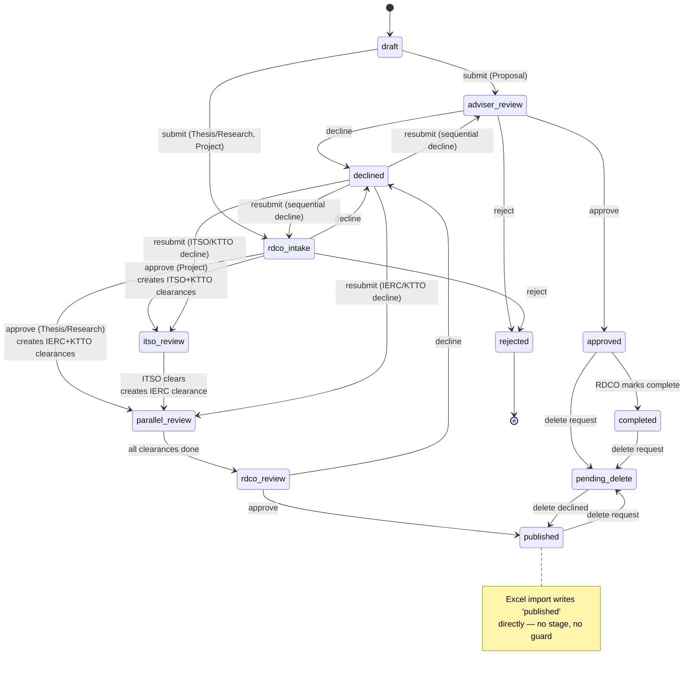

# 06 — Workflow Architecture

**Subject:** the record lifecycle — submission, routing, sequential review, parallel office clearance, resubmission, publication — plus the notification and audit systems that hang off it.

---

## Overall assessment

**This is the best-designed part of IRIS, and the part most at risk from how it is spread out.**

`reviews/services.py` (407 lines) is a genuine domain service: guarded transitions, explicit invariants, a documented routing model, and a "clearance-smart" resubmission rule that is a real piece of domain insight. It is the module the rest of the backend should be measured against.

The risk is that it owns only 11 of the 18 places `pipeline_status` is written. The other seven live in views and one service, guarded by hand-written HTTP 400s or nothing at all — including an Excel importer that writes `published` directly, bypassing every review stage the system exists to enforce.

---

## The workflow as implemented

Reconstructed by reading all 18 assignment sites, because it is written down in one place nowhere.



Three routes, twelve statuses, six review stages, three clearance offices. The design is coherent and matches SRS Module 5.

---

## What is done well

**1 · The clearance model is the right abstraction.** `RecordClearance` — one row per `(record, office)` with `unique_together` — separates "which offices must sign off" from "what stage is the record at." That is what makes genuinely parallel review expressible; a single `pipeline_status` could not represent "IERC cleared, KTTO still pending."

**2 · Clearance-smart resubmission is real domain insight.** `resubmit_record` (`reviews/services.py:340-407`) resets only the *declining* office's clearance and routes back to that office, preserving other offices' completed work. The naive implementation resets everything and makes IERC re-review a document it already cleared. Someone thought about this.

**3 · Transitions are guarded and raise a domain exception.** All eleven service transitions check authority via `_can_review` / `_can_submit_clearance` and raise `InvalidPipelineTransition` rather than returning ad-hoc HTTP. `reviews/views.py:126-161` is a thin, correct delegating view — the model for the rest of the backend.

**4 · The resubmission evidence gate.** Requiring a document uploaded *after* the last decline before allowing resubmission (`reviews/services.py:352-365`) is a nice, cheap integrity check.

**5 · The distinction between `declined` (revisable) and `rejected` (terminal)** is modelled consistently through statuses, review rows and notifications.

---

## WF-1 · Seven transitions live outside the workflow service

**Problem.** The service owns the stage transitions; the views own the edges into and out of them. The system's routing rule is written three times.

**Evidence.**

| Site | Transition | Guard |
|---|---|---|
| `reviews/services.py` ×11 | all stage transitions | `InvalidPipelineTransition` ✓ |
| `records/views.py:76` | `→ draft` (create) | n/a |
| `records/views.py:135-138` | `draft/declined → adviser_review \| rdco_intake` | hand-written 400 |
| `records/views.py:208` | `approved → completed` | hand-written 400 |
| `records/views.py:254` | `published/approved/completed → pending_delete` | none |
| `records/views.py:334` | **`→ published` (Excel import)** | **none** |
| `records/views.py:690-693` | `pending_delete → published \| approved` | none; re-derives the type rule |
| `records/services.py:33` | `→ pending_delete` (soft delete) | none |

The rule *"Proposal goes to adviser_review, everything else to rdco_intake"* appears at `reviews/services.py:150-152`, `records/views.py:135-138`, and again inverted at `records/views.py:690-693` (`"approved" if rt == "Proposal" else "published"`). Three encodings, three places to update when SRS Module 5 — still marked draft — changes.

**Impact.** Beyond maintenance: the Excel importer is an unguarded path to `published`. Any staff user can publish arbitrary records without adviser approval, RDCO intake, IERC ethics clearance, ITSO technical review or KTTO IP review. The docstring calls this intentional — *"Legacy imports bypass the review pipeline — staff is the implicit reviewer"* — which may be a legitimate business rule, but it is currently indistinguishable from an oversight because it is a bare assignment rather than a declared transition.

**Recommendation.** BE-1's `records/lifecycle.py`: one declarative table `(from_status, event, actor_role) → to_status`, one `apply(record, event, actor)` entry point wrapping the write in `transaction.atomic()`. Views name events, never statuses. The importer calls `apply(record, "legacy_import", staff_user)` so the bypass becomes a **declared, auditable, testable edge** rather than an assignment nobody notices.

**Alternatives.**

| Option | Verdict |
|---|---|
| Move the seven into `reviews/services.py` | Better than today, but `records`-owned edges (create, delete, import) do not belong in the `reviews` app — the table does |
| `django-fsm` | Rejected — unmaintained; ~30 rows do not need a library |
| Leave as is | Rejected — SRS M5 is draft, so this *will* change, and it will change in three places |

**Reasoning.** Deletion test **passes**: removing the module scatters ~30 rules back across 18 sites in 4 modules.

- **Complexity:** Medium (~150 lines plus call-site updates)
- **Risk:** Medium — core write path. **Do it after BE-13 tier 1-3 tests exist**
- **Dependencies:** BE-2 (enums) first; BE-13 (tests) first
- **MVP:** **MVP RECOMMENDED**
- **Framework impact:** None
- **Testing implications:** The single largest testability gain in the backend. The table becomes a parametrised test needing no HTTP and no fixtures for the pure predicate — full edge coverage in ~40 lines, versus the current situation where every transition requires an authenticated request.

---

## WF-2 · No transaction wraps a transition

**Problem.** Every workflow transition performs 2–4 writes with no transaction boundary.

**Evidence.** `grep -rn "atomic" backend/apps/` returns exactly one match — `accounts/views.py:23`, in registration. None in `reviews/` or `records/`.

`approve_record` at `rdco_intake` performs, in order: create `Review` → `get_or_create` two `RecordClearance` rows → save `Record.pipeline_status` → `notify_record_reviewed`. A failure between any two leaves the system inconsistent:

- Fail after the `Review`: a review row records an approval that did not advance the record. The reviewer sees their decision recorded; the owner sees the record stuck.
- Fail after one clearance: one office has a pending row, the other does not. `_all_clearances_done` then returns `True` prematurely once the single office clears — **the record advances to `rdco_review` having been cleared by one office instead of two.** This is a correctness failure with a security character: it defeats the parallel-review requirement.

**Recommendation.** Wrap `approve_record`, `decline_record`, `reject_record`, `submit_clearance` and `resubmit_record` in `transaction.atomic()`. Move each `notify_*` call to `transaction.on_commit(...)` so notifications never fire for rolled-back transitions — currently a decline that rolls back still emails the owner.

**Alternatives.** `ATOMIC_REQUESTS = True` globally — simpler, but holds a transaction open across email dispatch and file I/O on every request. Rejected.

- **Complexity:** Low · **Risk:** Low
- **Dependencies:** None; naturally absorbed into WF-1
- **MVP:** **MVP REQUIRED**
- **Framework impact:** None
- **Testing implications:** Testable by forcing an exception in the notify call and asserting `pipeline_status` is unchanged and no `Review` row exists.

---

## WF-3 · Two independent encodings of "who reviews what"

**Problem.** The role→stage mapping is written twice, in two modules, in two different shapes, with no shared source.

**Evidence.**

`reviews/views.py:61-67` — used to build the *pending queue*:

```python
role_to_statuses = {
    "Adviser": ["adviser_review"],
    "RDCO":    ["rdco_intake", "rdco_review"],
    "ITSO":    ["itso_review"],
    "IERC":    ["parallel_review"],
    "KTTO":    ["itso_review", "parallel_review"],
}
```

`reviews/services.py:76-93` — used to *authorize the decision*:

```python
if role_name == "Adviser":
    return status == "adviser_review" and record.adviser_id == user.pk
if role_name == "RDCO":
    return status in ("rdco_intake", "rdco_review")
```

**Impact.** These can disagree, and the disagreement is invisible until a user hits it: a record can appear in a reviewer's pending queue and then be refused when they act on it, or vice versa. The adviser case already differs — the queue filters `records.filter(adviser=request.user)` separately at line 78, while the service checks `record.adviser_id == user.pk` inline. Two places to keep in sync for every future stage change.

**Recommendation.** One `ReviewPolicy` (BE-3) exposing `stages_for(role)` and `can_act(user, record)`, consumed by both the queue and the service. The queue becomes a query derived from the policy rather than a parallel dict.

- **Complexity:** Low · **Risk:** Low
- **Dependencies:** BE-2, BE-3
- **MVP:** **MVP RECOMMENDED**
- **Framework impact:** None
- **Testing implications:** One policy table test replaces queue tests and permission tests that currently cannot both be right.

---

## WF-4 · The staff bypass defeats the workflow's purpose

**Problem.** Both authorization predicates in the workflow engine grant a blanket bypass to anyone with `is_staff=True` — which migration `accounts/0005` grants to all four office roles.

**Evidence.** `reviews/services.py:76-79`:

```python
def _can_review(user, record):
    from core.permissions import is_django_staff
    if is_django_staff(user):
        return True
```

and `_can_submit_clearance` grants staff a pending-clearance fallback plus a final `if staff: return True, office`.

**Impact.** An ITSO account can call `approve_record` at `rdco_review` and publish a record that IERC never cleared. A KTTO account can act as the adviser on a Proposal. The four-office model — the substance of SRS Module 5 and the reason IRIS exists rather than a shared folder — is advisory rather than enforced.

This is **SEC-4** in [05](05-security-architecture.md); it appears here because it is a *workflow* defect as much as an authorization one. Separation of duties is the workflow's product.

**Recommendation.** Remove `is_django_staff` from `_can_review` and `_can_submit_clearance`. If a break-glass path is genuinely needed for operational recovery, gate it on `is_superuser` alone, make it an explicit `force=True` parameter, and emit a distinct audit event when used.

- **Complexity:** Low · **Risk:** **Medium** — narrows access that staff may currently rely on; coordinate before applying
- **Dependencies:** SEC-4 (the `is_staff` seeding decision)
- **MVP:** **MVP BLOCKER**
- **Testing implications:** The highest-value test in the system — `(role, stage, action) → allowed` over six roles and six stages, asserting ITSO cannot approve at `rdco_review`.

---

## WF-5 · Notification dispatch spans two layers and fails silently

**Problem.** Notifications are triggered from both views and services, and every failure is discarded.

**Evidence.**

| Trigger site | Layer |
|---|---|
| `records/views.py:144, 258, 668, 695` | **view** |
| `reviews/services.py:205, 232, 258, 305, 318, 327, 406` | service |

`notifications/services.py` is 736 lines of hand-written per-event functions containing **ten** bare `except Exception: pass`, plus one in `audit/services.py:44` and one in `core/utils.py:52`.

**Verified sub-claim correction.** The prior review implies a missing `NotificationType` is a live bug. It is not: all eleven names passed to `_get_type` are seeded across the four notification migrations — checked name by name. The swallowing is a **latent** hazard, not a firing one. It becomes a live one the moment a twelfth event is added and its seed is forgotten, and nothing will report it.

**Impact.** Notification volume is also high by construction: a three-owner record advancing one stage produces two broadcast rows, three direct rows and two emails. `_notify_roles_of_advance` emails every active user in each target role. There is no digest, no preference, no unsubscribe.

**Recommendation — proportionate, in three steps.**

1. **Now:** replace all twelve `except Exception: pass` with `except Exception: logger.exception(...)`. Zero behaviour change, total observability gain. ~1 hour.
2. **Now:** move the four view-layer `notify_*` calls into the service layer so dispatch happens at one layer.
3. **Later:** revisit a domain-event bus.

**Alternatives for step 3.**

| Option | Verdict |
|---|---|
| Domain-event bus now (as the prior review proposes) | **DO NOT IMPLEMENT for MVP.** Deletion test **fails**: removing the bus returns you to eleven direct calls that are already readable. There is one real subscriber. One adapter is a hypothetical seam; two is a real one |
| Django signals | Rejected — makes control flow harder to trace, which is the stated complaint |
| Steps 1+2 only | **Recommended** |

- **Complexity:** Trivial (1+2) · Medium (3) · **Risk:** None (1+2)
- **MVP:** **MVP REQUIRED** (1) · **MVP RECOMMENDED** (2) · **POST-MVP** (3)
- **Testing implications:** Step 1 makes notification failures assertable via `caplog`. Step 2 means a workflow test can assert notification side effects without going through HTTP.

---

## WF-6 · Review decisions are not audited

**Problem.** The audit log records logins, record views, uploads, downloads, PIN events, role changes and session revocations. It does **not** record review decisions.

**Evidence.** `AuditEvent.EVENT_TYPE_CHOICES` (`audit/models.py:29-44`) has fourteen types. None covers approve, decline, reject or clear. `grep -rn "create_audit_event" backend/apps/reviews/` returns two matches — both `PIN_GENERATED` / `PIN_VERIFIED`, neither a review decision.

**Impact.** For a system whose regulated output is a chain of institutional approvals, the audit trail omits the approvals. `Review` and `RecordClearance` rows record *what* was decided, which is most of the value — but they are domain records, not an audit log: they can be deleted by `resubmit_record` (`reviews/services.py:381` deletes all clearances on a sequential-decline resubmission), they carry no IP or user-agent, and they are not queryable through the audit endpoint an auditor would use.

Separately, `ACCESS` is overloaded — `records/views.py:223` logs a tag edit as `ACCESS` with `metadata={"action": "tags_updated"}`, so "who viewed this record" and "who changed its IP classification" are the same event type.

**Recommendation.** Add `REVIEW_DECISION` and `CLEARANCE_DECISION` event types; emit them from `reviews/services.py` alongside the `Review` row, inside WF-2's transaction. Give tag edits their own `TAG_CHANGE` type. Record the stage, the decision and the resulting status in `metadata`.

- **Complexity:** Low · **Risk:** Low · **Dependencies:** WF-2 preferred
- **MVP:** **MVP REQUIRED** — this is a thesis-scope compliance property, not a nice-to-have
- **Framework impact:** None
- **Testing implications:** Assert one audit event per transition — which also gives WF-1's lifecycle table a natural observable.

---

## WF-7 · Two edge cases worth confirming

Neither is confirmed as a defect; both are places where the model may not say what was intended. Raised as **NEEDS INVESTIGATION**.

**(a) KTTO's resubmission route is inferred, not recorded.** `resubmit_record` (`reviews/services.py:388-395`) routes a KTTO decline back by *inferring* the stage:

```python
else:  # ktto — can review at both itso_review (Project) and parallel_review
    itso_pending = RecordClearance.objects.filter(
        record=record, office="itso", status="pending").exists()
    new_status = "itso_review" if itso_pending else "parallel_review"
```

Because KTTO reviews at both stages, the correct return stage is derived from ITSO's state rather than from where KTTO actually declined. If ITSO cleared *after* KTTO declined, the record returns to `parallel_review` — probably right. If a Thesis/Research record has no ITSO clearance at all, it returns to `parallel_review` — also right. The inference appears sound for both current routes, but it is load-bearing and undocumented. **Recording the declining stage on the `Review` row and routing from that** would remove the inference entirely.

**(b) `_all_clearances_done` treats "declined" as done.** It returns `True` when no clearance has `status="pending"` (`reviews/services.py:140-142`). A `declined` or `rejected` clearance is therefore "not pending" and counts as complete. In the current flow this is unreachable, because a decline immediately sets `pipeline_status` to `declined` and no further clearance can be submitted. But the predicate's name promises something stronger than it delivers, and a future path that allows clearances to continue after one office declines would advance a record to `rdco_review` with a declined office. **Prefer an explicit `.filter(status="cleared").count() == expected` check.**

- **Complexity:** Low · **Risk:** Low · **MVP:** **POST-MVP** (both) — confirm intent first

---

## Summary

| Aspect | Verdict |
|---|---|
| Workflow model (stages, routes, clearances) | **Sound.** Matches SRS M5; the clearance model is the right abstraction |
| Clearance-smart resubmission | **Good.** Real domain insight, keep it |
| Service-layer design | **Good, and the pattern the rest of the backend should copy** |
| Transition ownership | **Split 11 / 7.** Consolidate via WF-1 |
| Transaction safety | **Absent.** WF-2 — MVP REQUIRED |
| Separation of duties | **Unenforced** by the staff bypass. WF-4 — MVP BLOCKER |
| Role→stage mapping | **Duplicated** across two modules. WF-3 |
| Notifications | **Work, fail silently.** WF-5 step 1 — MVP REQUIRED |
| Audit of decisions | **Missing.** WF-6 — MVP REQUIRED |
| Excel import | **Unguarded bypass** to `published`. Make it a declared edge (WF-1) |
