# 09 — MVP Priorities

Every recommendation in this review, classified and sequenced.

**Classifications**

| Class | Meaning |
|---|---|
| **MVP BLOCKER** | The system does not work, or is unsafe to expose, without it |
| **MVP REQUIRED** | Needed for a defensible, honest MVP |
| **MVP RECOMMENDED** | Materially improves the MVP; do it if time allows |
| **POST-MVP** | Right idea, wrong time |
| **OPTIONAL** | Legitimate, low return |
| **DO NOT IMPLEMENT** | Actively argued against |

**Complexity:** Trivial (<1h) · Low (<1d) · Medium (1–3d) · High (>3d)

---

## MVP BLOCKERS

Nothing else matters until these are done. **Estimated total: 4–6 days.**

| ID | Item | Complexity | Risk | Depends on | Benefit |
|---|---|---|---|---|---|
| **BLOCK-1** | Import the six undefined names in `records/views.py`; move the four misplaced methods back into `DownloadRequestViewSet` | Trivial | Low | — | The API starts at all |
| **BLOCK-2 / DEP-1** | Delete the `ai-gateway` and `docling` services; collapse to five services | Low | Low | — | `docker compose up` succeeds |
| **BLOCK-3** | One Celery worker, default queue; delete the three specialised workers and beat | Trivial | Low | DEP-1 | Background jobs execute |
| **BLOCK-4** | Add `pymupdf`; reduce the extraction chain to PyMuPDF | Trivial | Low | — | PDF extraction succeeds |
| **BLOCK-5** | Delete `apps.ai` (app + `INSTALLED_APPS` entry) | Trivial | Low | — | `migrate` is consistent; removes shadowed modules |
| **DEP-2a** | Fix the prod port mapping `80:80` → `80:8080` | Trivial | Low | — | The production frontend is reachable |
| **SEC-12** | **Remove the nginx `/media/` location** | Trivial | Low | — | Closes unauthenticated access to every uploaded document |
| **SEC-1** | Apply visibility filtering to `retrieve`, not only `list` | Low | Low | — | Closes the broadest data leak |
| **SEC-2** | Add a permission check to `RecordFileDownloadAllView` | Trivial | Low | — | Closes bulk document download by any user |
| **SEC-3** | Add ownership filtering to all six `storage` endpoints | Low | Low | *decision D-1* | Stops any user deleting any user's files |
| **SEC-5** | Add ownership checks to five `documents` endpoints | Low | Low | — | Closes upload injection and enumeration |
| **SEC-4 / WF-4** | Remove the `is_staff` blanket bypass from `IsAdmin`, `_can_review`, `_can_submit_clearance`; reverse migration 0005 for ITSO/IERC | Low | **Medium** | *decision D-2* | Restores separation of duties |
| **BE-13** t1-3 | Import-smoke test, `makemigrations --check`, `docker compose config` | Low | None | — | Catches 4 of 5 blockers permanently |
| **DEP-6** | One GitHub Actions workflow running the above | Low | None | BE-13, FE-7 | The control that prevents the next five blockers |

> **SEC-4 carries real coordination risk.** It removes access that ITSO/IERC accounts currently have. Confirm with the team before applying — see decision D-2.

---

## MVP REQUIRED

A defensible MVP. **Estimated total: 5–8 days.**

| ID | Item | Complexity | Risk | Depends on | Benefit |
|---|---|---|---|---|---|
| **AI-2** | Implement RAG in-process: chunking, embedding, retrieval, generation | High | Low | AI-3, AI-5 | FR-M3/M4 are in scope and currently 2/11 done |
| **AI-3** | pgvector `VectorField` + HNSW; delete all `pickle` | Low | Low | BLOCK-5 | Real vector search; removes unsafe deserialization |
| **AI-5** | Pick one provider; make settings, `.env.example` and requirements agree; add provider protocols | Low | Low | — | Config that works when copied |
| **AI-6** | Timeouts, per-user AI rate cap, token accounting, citations | Low | Low | AI-2 | Spend ceiling and honest failure |
| **AI-7** | Rewrite both RAG docs as plans; fix the 7 dead links in `docs/README.md` | Low | None | — | Docs stop overstating delivery — a thesis credibility risk |
| **WF-2 / BE-11** | `transaction.atomic()` on all five transitions; notify via `on_commit` | Low | Low | — | No half-applied transitions |
| **WF-6** | Audit review and clearance decisions | Low | Low | WF-2 | The approval chain is actually auditable |
| **BE-6 / WF-5** s1 | Replace 12 bare `except: pass` with `logger.exception` | Trivial | None | — | Silent failures become observable |
| **BE-3** | Route access decisions through `core.permissions`; delete 5 unused classes | Low | Low | — | Stops the 18th endpoint shipping unchecked |
| **FE-5 / SEC-7** | One token module; interceptor calls `setTokens`; dedupe in-flight refresh; clear `localStorage` | Low | Low | — | Fixes the refresh loop and the post-logout token |
| **FE-7** | `eslint.config.js`, `typecheck` script | Low | None | — | Three installed, inert plugins start working |
| **FE-2** | Delete the colliding `useRole` exports from `auth.store.ts` | Trivial | Low | — | Removes a silent wrong-import hazard |
| **FE-10 / X1** | One shared `PaginatedResponse<T>`; paginate the four bare-array endpoints | Low | **Medium** | coordinate FE+BE | Removes live contract drift |
| **BE-8** | Fix the `.username` fallback | Trivial | None | — | Latent `AttributeError` |
| **SEC-8** | Replace dev `CORS_ALLOW_ALL_ORIGINS` with an explicit list | Trivial | None | — | Removes a credentialed-CORS hazard |
| **DEP-3** | Nightly `pg_dump` + media backup; **rehearse one restore**; real secrets | Low | Low | — | An untested backup is not a backup |
| **DEP-2c,d** | Document the dev-vs-prod compose distinction; move `collectstatic` to CI | Low | Low | DEP-6 | Stops a debug server reaching a deployment |
| **SEC-6** | Restrict PIN issuance to visible records; decide what the PIN enforces | Medium | Low | *decision D-3* | An access control that does not control access is worse than none |

---

## MVP RECOMMENDED

Do if time allows. **Estimated total: 6–10 days.**

| ID | Item | Complexity | Risk | Depends on | Benefit |
|---|---|---|---|---|---|
| **BE-2 / B7** | One `TextChoices` enum per concept | Low | Low | — | Best effort-to-value ratio in the backend |
| **BE-1 / WF-1** | `RecordLifecycle` transition table | Medium | **Medium** | BE-2, BE-13 | The domain becomes one readable table and one test |
| **BE-4 / B3** | Named `Record` queryset scopes | Low | Low | BE-2 | Visibility rules stop drifting across 6 sites |
| **WF-3** | One `ReviewPolicy` for role→stage | Low | Low | BE-3 | Queue and authorization stop disagreeing |
| **FE-1 / F1** | TanStack Query; delete `notifications.store.ts` | Medium | Low | **FE-5 first** | ~300 lines gone; the frontend becomes testable |
| **FE-4 / F4** | Standardise on react-hook-form + Zod; drop `formik`, `yup` | Low | Low | — | One validation rule set; 2 fewer deps |
| **FE-9 / BE-9** | Delete ~2,400 unreachable lines and 4 zero-importer deps | Low | Low | — | Every later refactor operates on less surface |
| **BE-13** t4-6 | Lifecycle, policy, and IDOR regression tests | Medium | None | BE-1, BE-3 | Where the domain risk actually is |
| **FE-7** t3 | Vitest + Testing Library | Low | None | FE-1 | Frontend testable at the query seam |
| **X1** | `drf-spectacular` schema + Swagger UI | Low | Low | — | Kills a defect class; documents the API for the defence |
| **BE-6** s2 | Move view-layer `notify_*` calls into services | Low | Low | — | One dispatch layer |
| **BE-10** | Fix 2 N+1s; narrow the FTS signal | Trivial | Low | — | Fewer queries on the hottest paths |
| **SEC-11** | Narrow audit reads; add `TAG_CHANGE` | Low | Low | SEC-4 | Least privilege on the audit log |
| **SEC-10** | `get_object_or_404`; 400 on unknown `action` | Trivial | None | — | 404s instead of 500s |
| **FE-8** | a11y at the primitive level | Low | None | FE-3 amplifies | 4 changes cover most of the surface |
| **DEP-3** | Logging config, Sentry, healthchecks | Low | Low | — | Something to look at when it breaks |
| **DEP-5** | Deploy on-campus behind a Cloudflare Tunnel | Low | Low | DEP-1 | $0, data stays on campus |

---

## POST-MVP

| ID | Item | Complexity | Why later |
|---|---|---|---|
| **FE-3 / F3** | `RecordListPage` + `ApprovalQueuePage` modules | Medium | Duplication, not defect. Needs FE-1 first or the shared component takes props FE-1 removes |
| **FE-6 / F6** | Split `DocumentsPage` (793) and `SignupPage` (457) | Medium | Readability only |
| **BE-5 / B5** | `records/importing.py`, `records/reporting.py` | Low | Real, but the lifecycle bypass is the part that matters, and BE-1 covers it |
| **BE-7 / B4** | `stamp_decision` helper + serializer base | Low | 40 duplicated lines |
| **BE-12** | DRF exception handler; use declared exceptions | Low | Changes response shapes; coordinate with FE-1 |
| **BE-6** s3 | Domain-event bus | Medium | Revisit only when a **second** real subscriber appears |
| **AI-1** | Extract a RAG gateway | High | Only on measured evidence that AI load degrades CRUD |
| **DEP-4** | Gunicorn `gthread` workers | Trivial | Only once AI endpoints ship |
| **X1** | Generate the TS client from OpenAPI | Medium | A build-pipeline commitment; needs CI first |
| — | Docling-serve | Medium | 4 GB. Only if scanned submissions prove common |
| — | `django-storages` S3 | Low | Only when media outgrows one box — **note `build_zip`'s `.path` breaks the moment it does** |
| — | Squash migration churn | Low | Before first real deployment, not now |
| — | httpOnly refresh cookies | Medium | Needs CSRF design; worth an ADR |

---

## OPTIONAL

| Item | Why marginal |
|---|---|
| Split `RecordDetailPage` (402), `DiscoverPage` (334) | Below the threshold where size hurts |
| Replace `date-fns` with `Intl.DateTimeFormat` | One importer; saves ~20 KB |
| Full WCAG 2.1 AA audit | Appropriate before institutional adoption, disproportionate for an MVP |
| Merge `storage` and `documents` | **Explicitly argued against** — different concepts; merging concentrates complexity |

---

## DO NOT IMPLEMENT

| Item | Why |
|---|---|
| **LangChain / LlamaIndex** | ~60 lines of explicit code. Deletion test: removing it moves complexity out of a dependency into readable code |
| **n8n** | Already rejected by the team (SRS change history, May 2026). Agreed |
| **Qdrant / Weaviate / Milvus / Pinecone** | pgvector in the existing Postgres. A second stateful service adds a backup target and a sync path |
| **AWS ECS / RDS / ElastiCache / ALB** | ~$400/mo for a workload that fits on a $0–10 box. NAT Gateway alone exceeds a VPS |
| **Abstract `ApprovalRequest` base model** | Deletion test **fails** — complexity moves, not concentrates. `RoleRequest` cannot join the hierarchy. Share the guard-and-stamp instead |
| **Domain-event bus (at MVP)** | Deletion test **fails** at current size — one real subscriber. One adapter is a hypothetical seam; two is a real one |
| **`unstructured[pdf]` / Tesseract (at MVP)** | Hundreds of MB for a fallback born-digital theses never reach |
| **FastAPI `ai-gateway` (at MVP)** | A second runtime, second dependency tree, duplicated auth — for a feature with no implementation |

---

## Sequenced plan

```mermaid
gantt
    dateFormat X
    axisFormat %s
    title Suggested sequence (relative days)

    section P0 make it run
    BLOCK-1 imports            :a1, 0, 1
    DEP-1 five services        :a2, 0, 1
    BLOCK-3 one worker         :a3, after a2, 1
    BLOCK-4 pymupdf            :a4, after a1, 1
    BLOCK-5 delete apps.ai     :a5, after a1, 1

    section P1 close the holes
    SEC-12 nginx media         :b1, after a2, 1
    SEC-1 2 5 record+doc authz :b2, after a5, 2
    SEC-3 storage authz        :b3, after b2, 1
    SEC-4 staff bypass         :b4, after b3, 1

    section P2 make it stay fixed
    BE-13 smoke tests          :c1, after b4, 1
    FE-7 eslint typecheck      :c2, after b4, 1
    DEP-6 CI                   :c3, after c1, 1

    section P3 clear the ground
    delete dead code           :d1, after c3, 2

    section P4 architecture
    BE-2 enums                 :e1, after d1, 1
    BE-1 lifecycle             :e2, after e1, 3
    BE-3 BE-4 policy scopes    :e3, after e1, 2
    FE-5 tokens                :f1, after d1, 1
    FE-1 query layer           :f2, after f1, 3
```

**Why this order.**

- **P0 before everything** — nothing is verifiable while the API cannot import and Compose cannot build.
- **P1 before refactoring** — four defects are exploitable by any student account; refactoring on top relocates them.
- **P2 before P3** — deleting 2,400 lines without an import-smoke test is how BLOCK-1 happened.
- **P3 before P4** — refactor 2,400 fewer lines.
- **BE-2 before BE-1** — the lifecycle table wants the enums.
- **FE-5 before FE-1** — query retries amplify the refresh race.

---

## If there is only one week

| Day | Do |
|---|---|
| 1 | BLOCK-1, BLOCK-4, BLOCK-5 — the backend imports and extracts |
| 2 | DEP-1, BLOCK-3, DEP-2a, SEC-12 — it builds, runs, and stops serving documents anonymously |
| 3 | SEC-1, SEC-2, SEC-5 — record and document access is checked |
| 4 | SEC-3, SEC-4 — storage is owned, offices are separated *(confirm D-1 and D-2 first)* |
| 5 | BE-13 t1-3, FE-7, DEP-6 — CI holds the line |

That is a system that runs, does not leak, and cannot silently regress. Everything else is improvement on a working base.

**If there is only one day:** BLOCK-1, DEP-1, SEC-12, SEC-1, SEC-2. Roughly two hours of edits that take IRIS from "does not start and serves every document anonymously" to "starts and enforces record access."
