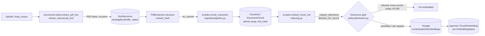
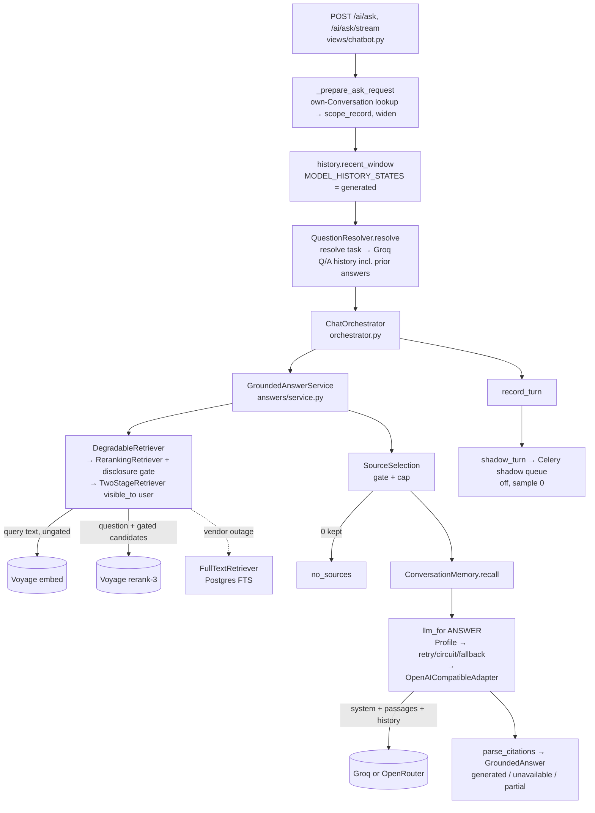
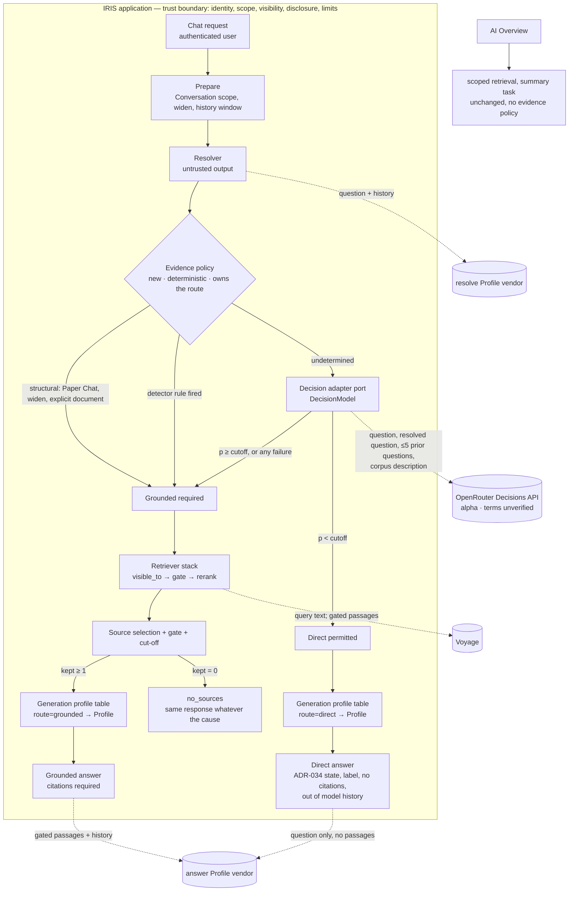

# IRIS AI pipeline — target architecture with Jev and a generative-model router

**Status: proposal for review, 2026-10-08.** An architecture review only. No code, Jira ticket or ADR is changed by it. Written by an AI agent; every decision below is for a human owner (CLAUDE.md §What AI does not decide).

Key: **[V]** verified in the code, tests or run files at `origin/main` `9f06142` · **[A]** assumption · **[R]** recommendation · **[?]** could not be verified.

---

## 1. Executive recommendation

**Keep one application-controlled pipeline. Add one evidence policy that owns the route, with Jev as an optional, gated input to it. Do not build a generative-model router yet: replace the idea with a static generation-profile table.**

1. **Two decisions, two components, no shared authority.**
   - The *evidence policy* answers "must this question be grounded?".
   - The *generation profile table* answers "which approved model writes the reply, given the route already decided?".
   - They share read-only inputs (Inference task, route kind, deployment config). Neither can change the other's output.
2. **Structural and lexical rules run first, and they short-circuit.** Paper Chat, a widened search, an explicit document request or any detector hit routes to retrieval without calling Jev. Jev is consulted only for questions the deterministic layer cannot place. It can move a question toward retrieval, never away from a requirement (ADR-035 §3 union, kept).
3. **Jev is a candidate, not a choice.** Offline it is fast and stable, and at a lowered cutoff it misses fewer searches than the alternatives on the proxy set (§9). But that cutoff was picked on the scored set, the set is arXiv not CIT-U, and the alpha Decisions API's retention terms are unverified. It must not see a real reader question until a person records a data-handling approval.
4. **A "router" choosing among vendors per request conflicts with accepted ADRs.** ADR-036 §Amendment fixes one vendor per Inference task. ADR-008 §Amendment rejects cross-vendor failover. What the product needs today is a deterministic map of (task, route kind) → Profile. A learned router has nothing to optimise against until answer quality is measured.
5. **The direct-answer path is the real new work, not the decision.** It needs the ADR-034 `ungrounded` state, its own prompt, label, history exclusion and evaluation. **ADR-034 is Accepted and unbuilt [V]** (no `ungrounded` state in `apps/ai/answers/citations.py`).
6. **No agent loop.** A future bounded agent is a separate workflow with its own entry point and ADR. Nothing here pre-builds it.

---

## 2. Current state, as built [V]

### 2.1 Ingestion



- Docling runs on-premise (ADR-016 §Security Impact). The image is `docling-serve:latest` plus a prefetched formula model, so it is **unpinned** (`docling/Dockerfile:11`).
- `indexing._require_disclosure` gates every chunk embedding (`apps/ai/indexing.py:198`). The gate refuses all records while `Record` has no embargo field (`policy/records.py:37`, IR-250 To Do).
- Deletion: chunks, embeddings, citations and Turns cascade from `Record` and `Conversation` (`models/chunk.py:37-126`, `models/conversation.py`). Stored `Turn.answer` text has no link to the records it quotes beyond `TurnCitation`, and it survives a record later becoming restricted (§7.5).

### 2.2 Question answering



- Every chat question is retrieved and grounded today. There is no direct-answer path [V].
- The evidence detector (`apps/ai/evidence/detector.py`) and model deciders (`model_decision.py`, `route_label.py`, `jev_noul.py`) are consumed only by the shadow task and `eval_evidence`. Nothing routes on them [V]. `AI_EVIDENCE_DECISION` rejects `on` (ADR-035 §1).
- The AI Overview (`overview.py`) calls `answer_service(..., task=SUMMARY)` directly and never reaches the orchestrator [V]. `/ai/search/` generates nothing.
- Vendor choice is per Inference task with same-vendor fallback only (`inference/profiles.py`, `CompositionRoot.llm_for`). There is no per-request model selection [V].

---

## 3. Target state



What changes from today:
- **New:** the evidence policy (a pure function of question facts and config); the direct-answer path; a generation profile table; Jev behind the existing `DecisionModel` port with a breaker and rate lane.
- **Unchanged:** retrieval, visibility, the disclosure gate, citations, Paper Chat, AI Overview, degraded mode, resolver.
- **Deleted when chosen:** whichever decision mechanism loses the evaluation, i.e. the tool-call decider, the route label or Jev (§6).

---

## 4. Request flows

```mermaid
sequenceDiagram
  autonumber
  participant R as Reader
  participant A as App (prepare + policy)
  participant J as Jev (OpenRouter alpha)
  participant V as Voyage
  participant M as Answer model

  Note over R,M: (a) General question — "what is a median?"
  R->>A: question
  A->>A: resolve (follow-ups only) → detector: no rule fires
  A->>J: noul(question, resolved, prior questions, corpus description)
  J-->>A: p = 0.04
  A->>M: direct prompt, question only
  M-->>R: answer, labelled "not from the repository", no citations

  Note over R,M: (b) Corpus question — "what did the tilapia study find?"
  R->>A: question
  A->>A: detector: document_reference fires → grounded, Jev skipped
  A->>V: embed query; rerank gated candidates
  A->>M: grounded prompt + permitted passages
  M-->>R: cited answer

  Note over R,M: (c) Paper Chat
  R->>A: question in a Record-scoped Conversation
  A->>A: scope_record → grounded; never Jev, never direct
  A->>V: scoped retrieval
  A->>M: grounded prompt
  M-->>R: cited answer, or no_sources

  Note over R,M: (d) Jev timeout / 429 / malformed / unsupported model
  R->>A: question
  A->>J: noul(...)
  J--xA: failure
  A->>A: reason code recorded → grounded (fail to retrieval)
  A->>V: retrieve as (b)

  Note over R,M: (e) Restricted evidence
  R->>A: question whose only relevant records are invisible or gated
  A->>A: route decided from the question alone (before retrieval)
  A->>V: retrieval: visible_to removes invisible; gate removes undisclosable
  A-->>R: kept = 0 → no_sources, identical body to "nothing found"
```

Case (e) is where ADR-034 §2 and ADR-035 §7 collide (§11, decision D3). A question that is grounded-required and comes back empty must give the same response whether the passages were absent, invisible or withheld. That holds today at the response boundary (`test_outcome_indistinguishable_http.py`, IR-460) [V]. It stops holding the moment ADR-034's "zero relevant → ungrounded" branch is built as written, because "withheld → no_sources" and "nothing relevant → ungrounded answer" would differ.

---

## 5. Component contracts

| Component | Inputs | Output | Authority | On failure |
|---|---|---|---|---|
| **Request preparation** (`views/chatbot.py`) | authenticated user; Conversation looked up among the user's own; `widen` | question, scope record or none, history window | **Sole source** of identity, scope and limits | 400/404 as today |
| **Resolver** (`resolution.py`) | question; history window Q/A text | rewritten question, **untrusted** | none; only changes retrieval text | raw question. **[PLAUSIBLE defect]** it catches `LLMUnavailable` but not `CircuitOpen` (`resilience/circuit.py:34` is a separate `RuntimeError`), so an open `resolve` breaker may surface as a 500. No test covers it |
| **Detector** (`evidence/detector.py`) | raw and resolved question; `record_scoped` | verdict with reason codes | may **add** a requirement, never remove one or refuse | n/a (pure) |
| **Evidence policy** *(new)* | structural facts (scope, widen, explicit document request); detector verdict; decision verdict; deployment mode | `GROUNDED_REQUIRED` or `DIRECT_PERMITTED`, plus reason codes | **owns the route**; computed from the question only, never from retrieval or the gate | any doubt → `GROUNDED_REQUIRED` |
| **Decision adapter** (`providers/decisions.py` + `openrouter_decisions.py`, or a Groq decider) | question, resolved question (labelled untrusted), ≤5 prior **reader** questions, versioned corpus description. Never passages, recalled Turns or answers (ADR-035 §8) | a probability or label + latency + model build | **advisory**; can only push toward grounded | timeout, 429, 5xx, auth, malformed, unpinned model → reason code → grounded |
| **Generation profile table** *(new, replaces "router")* | Inference task; route kind (grounded/direct); config | one Profile (vendor, model, same-vendor fallbacks) | chooses **which approved model writes**; cannot change route, scope, sources or citations | Profile's own fallback list; then `unavailable` (ADR-008) |
| **Retriever stack** (`composition.retriever`) | effective question; **user from the request**; scope record | passages + diagnostics | visibility (`visible_to`) and disclosure gate, in application code | vendor outage → FTS, `degraded` |
| **Source selection** (`answers/selection.py`) | retrieved passages | permitted, capped passages (+ cut-off when IR-396 lands) | gate before any prompt | 0 kept → `no_sources` |
| **Grounded answer** (`answers/service.py`) | question, permitted passages, history, recalled Turns | text + citations resolved to passages | citations only to passages it was given | `unavailable` with sources |
| **Direct answer** *(new)* | question and history questions only. No passages, no Record cards | text, state `ungrounded`, no citations | none over the corpus | `unavailable`, **no fallback to grounded output presented as direct** |
| **AI Overview** (`overview.py`) | Record already authorised; scoped retrieval | stored summary | unchanged | `unavailable`, not stored |

Rule for every row: model output is never an argument to `visible_to`, the gate, the Conversation scope, `top_k` or any limit [R]. This is already true in code [V] and should be pinned by a test per new component.

---

## 6. Alternatives

### 6.1 Evidence decision mechanism

Run files under `docs/evaluation/runs/`; proxy set of 113 (83 need the corpus).

| | Detector only | Groq tool call (ADR-035 §2) | Groq route label | Jev Noul |
|---|---|---|---|---|
| Missed of 83 | 57 (`20261008-044833`) | 10–11 alone, 9–10 union (3 clean runs) | 8–10 (4 runs, gpt-oss-20b) | 3 @0.10 · 4 @0.20 · 8–10 @0.30 · 16–17 @0.50 (4 runs) |
| Over-searches | 0 | 7–9 **[scored before the ambiguous-tolerance rule; not comparable]** | 0 of 20 | 5–7 @0.10 · 0–1 @0.20 · 0 @≥0.30 |
| Mean / p95 latency | ~0 | 3.4–3.8 s / 7.3–9.5 s | 2.2–2.8 s / 2.9–3.1 s | 0.89–0.93 s / 1.0–1.2 s |
| Worst failure run | n/a | 53 of 113 fell back (unpooled) | 120b: 22 of 113 (daily token cap, unpooled) | 0 in 4 runs |
| Writes a discarded answer | no | **yes** (retention concern, ADR-035 §11) | no | no |
| Vendor / terms | none | Groq; retention not recorded **[?]** | Groq; same | OpenRouter alpha + TypeSafe; **unverified** |
| Stable misses | n/a | q07 q12 q13 q16 q32 q40 q43 (per IR-480) | 8–10 | 4 @0.20, 15 @0.50 (9 `mechanism`) |

Reading it [R]:
- **The detector alone is not a decider.** It catches 26 of 83 and 1 of 33 `mechanism` questions. It stays a floor, which is its ADR-035 §5 role.
- **The tool call's option value has not been exercised**, and it is the slowest and least reliable mechanism measured. ADR-035 §Alternatives names reverting to the route label "if the pilot shows the latency matters". The pilot report does show it.
- **Route label versus Jev is the real choice.** Jev's apparent edge exists only at a cutoff chosen after seeing the scores, and it adds a vendor with unverified terms. The route label adds no vendor.
- **Not established:** that any mechanism beats another on CIT-U questions. One labeller, 113 arXiv-proxy questions, and thresholds inspected on the scored set.

**Recommendation:** keep `DecisionModel` and the route-label decider as two implementations behind one policy. Run the held-out comparison in §9 and delete the loser. Don't keep three deciders in production.

### 6.2 One router or two

| Option | Gains | Costs |
|---|---|---|
| **One router** (one model picks route and model) | one call | evidence requirement becomes a model opinion. Conflates authority (ADR-035 §5/§6). Untestable separately (ADR-028 reason 4) |
| **Two routers** (Jev for evidence + learned model router) | each specialised | the model router has no quality signal to learn from; cross-vendor choice conflicts with ADR-036/ADR-008; one more vendor seeing questions |
| **Evidence policy + static profile table** [R] | route authority stays deterministic; model choice auditable and reversible by config; no new vendor | no per-question cost or quality optimisation until measured |

OpenRouter's own "Jev Router" (it picks a model and reasoning effort per request) is **rejected** for IRIS. It sends every prompt, passages included, through a router product whose terms are unreviewed, and it hands model choice to a vendor.

### 6.3 Pipeline or bounded agent

| | Application pipeline [R] | Bounded agent (future, separate workflow) |
|---|---|---|
| Who calls retrieval | application code, once | application code executing model-requested tools |
| Citation precision | measured (recall@10 0.885 with rerank on the proxy) | unmeasured; ADR-028 reason 1 (page precision) still has **no instrument** (ADR-035 §Context) |
| Injection surface | passages only in `generate(system, user)` | tool results in a message list |
| Preconditions to start | none | page-precision instrument; real corpus (IR-278, Deferred); answer-quality evaluation; a new ADR superseding ADR-035 §4/§11 |

---

## 7. Security and governance

### 7.1 Data sent to each provider

| Provider / endpoint | Data | Gate today | Retention / training / logging / residency / deletion |
|---|---|---|---|
| **Docling-serve** (self-hosted) | PDF bytes | none needed (on-prem) | in-deployment. Image unpinned `:latest`: **pin a digest**. Confirm no remote model or telemetry calls at runtime **[?]** |
| **Voyage embeddings** | chunk text (index); **query text** (every question) | chunk: disclosure gate. Query: **none** | training opt-out is a dashboard toggle that needs a payment method; it is not retroactive (ADR-015 §Security). Retention, logging and residency **not recorded [?]**. Real paper content was sent 2026-09-20 with opt-out unverified (ADR-015) |
| **Voyage rerank** | question + gated candidate passages | gate before rerank (`reranking.py:83`) | as above |
| **Groq** (`answer`, `resolve`) | question, permitted passages, history Q/A (incl. prior answers), recalled Turns | passages gated; question and history ungated | **no terms recorded in the repo [?]**; nothing is sent on the request to opt out |
| **OpenRouter chat** | same as Groq when a task is placed there | as above | dialect sends `provider.data_collection: "deny"` (`providers/dialects.py:196`); upstream-provider retention **[?]** |
| **OpenRouter Decisions → TypeSafe (Jev)** | question, resolved question, ≤5 prior reader questions, corpus description | proxy-tier guard in `eval_evidence` only | **unverified** (ADR-036 §Amendment 2026-10-08). Alpha endpoint |

Two findings:
- **Question text is ungated everywhere.** The disclosure gate is a record-content gate. A reader pasting an unpublished abstract into a question sends it to Voyage, Groq and, under Jev, OpenRouter/TypeSafe. SECURITY.md §8 says external AI transmission permission is "UNCONFIRMED" and §11 risk 11 is "Decision required". Every new vendor on the question path widens this.
- **Prior answers are re-sent.** The resolver and answer prompts carry earlier `Turn.answer` text. That text was gated when it was generated, but it is not re-gated if the record later becomes restricted.

### 7.2 Trust boundaries

- **[V]** Identity comes from `request.user`. Scope comes from the user's own Conversation (`_conversation_for`). Visibility is applied inside `TwoStageRetriever`. The gate runs before rerank and before the prompt.
- **[R]** The evidence policy must take its scope facts from `ChatQuestion`, never from a decider's output. A test should feed a decider that returns "direct" for a Paper Chat question and assert the route is grounded.
- **[R]** The resolved question stays untrusted wherever it goes: detector input (can only add), decider state (labelled), retrieval text (bounded by `visible_to`).
- **[R]** Typed outputs, probabilities, prompt delimiters and profile tables guarantee none of correctness, calibration or security. They narrow what a failure can do, nothing more.

### 7.3 Side channels

| Channel | Status | Mitigation [R] |
|---|---|---|
| Empty versus withheld response body | equal today (IR-460) [V] | keep it equal when the direct path lands: never branch to direct after retrieval on "why nothing was kept" (decision D3) |
| Timing: gate work, rerank versus FTS, direct versus grounded | **unmitigated** (ADR-035 §7) | accept and record. The route depends only on the question, so direct-versus-grounded timing reveals the question's class, not the corpus |
| Repeated probing at non-zero temperature | unaddressed | per-user throttle exists (`AIQueryThrottle`). Consider an audit event on repeated no_sources |
| Query-embedding cache | not wired on the query path today (`composition.py` docstring) [V]. Its key is `iris:qvec:{space}:{question digest}`, shared across users (`resilience/query_cache.py:41`), so once wired a fast hit would reveal that someone else asked the same question | decide before wiring it: key per user, or accept the leak |
| Logs | completion logs carry no content (`inference/completions.py`); shadow logs ids and codes [V] | keep Jev probability and question text out of logs |

### 7.4 Paper Chat and AI Overview
- Paper Chat: `scope_record` is structural. It always routes grounded, never consults Jev and never goes direct (ADR-034 §4, ADR-035 §5) [R]. A widened question is an explicit request to search the corpus, so it is grounded too [R].
- AI Overview: stays on the `summary` task with scoped retrieval and outside the evidence policy, as it is today [V]. Any change needs its own design.

### 7.5 Deletion
Record deletion cascades chunks, vectors, citations and overviews [V]. It does not reach (a) answer text already stored in other users' Turns, (b) Turn answer vectors, or (c) vendor copies. A restricted-after-the-fact record needs a policy decision (D7).

---

## 8. Migration plan

| Phase | Work | Depends on | ADR implications | Tests and observability | Rollback |
|---|---|---|---|---|---|
| **0 · Governance** (no code) | vendor data-handling review for Voyage, Groq, OpenRouter chat, OpenRouter Decisions; name §9 landscape owner; decide D1–D8 | people | records in ADR-015, ADR-036, SECURITY.md §8 | — | — |
| **1 · Held-out evaluation** | build a labelled held-out set (ideally CIT-U topics); split tuning and evaluation; add answer-quality and claim-support scoring | Phase 0 for any non-public data | ADR-023 / ADR-035 §10 amendment for the split | `eval_evidence` four arms; answer rubric | n/a (offline) |
| **2 · Evidence policy module** | extract structural + detector + decider union into one pure module; skip the decider on structural or detector hits; fix resolver `CircuitOpen` | Phase 1 result picks the decider | ADR-035 amendment: mechanism (§2), skip rule, Jev as a permitted decider if chosen | unit + HTTP tests per §5; route reason codes in shadow rows | setting `off` |
| **3 · Shadow on real traffic** | shadow the chosen decider through the policy | Phase 0 approval **for that vendor**; Phase 2 | ADR-035 §11 gate recorded as met | coverage, latency, fallback and contention (ADR-035 §10) | sample rate 0 |
| **4 · Direct path, dark** | ADR-034 `ungrounded` state, separate prompt, label, history exclusion, wire `mode`; reconcile ADR-034 §2 with ADR-035 §7 | D3 decision; IR-396 cut-off if keeping ADR-034's branch | ADR-034 amendment | `test_outcome_indistinguishable_http` extended to direct; label a11y test | flag off |
| **5 · Profile table** | (task, route) → Profile map; `direct` may use a cheaper same-vendor model | Phase 4 | ADR-036 amendment if a new task is added (avoid: use the `answer` task with a route-specific prompt) | completion logs gain route kind | config |
| **6 · Reader-visible pilot** | `on` for a cohort | gates in §9.3 | ADR-035 §1 amended to accept `on` | §9.3 | flag `off`, instant |

**Out of scope:** an agent loop, model-written queries, adaptive retrieval, web search, the Lens (IR-302–305), learned model routing, cross-vendor failover, Jev's Choice question (conditional on poor calibration, which the proxy curve does not show), and the AI Overview.

**Extension points without building them [R]:**
- Adaptive retrieval would add an evidence *source* behind the `Retriever` port, returning the same `RetrievalResult` with diagnostics. It would be gated by its own ADR.
- Web search would be a separate source with a separate trust class (public data out, untrusted content in). Its own answer state and citation type, never mixed into corpus citations.
- The evidence policy's output is an enum. A future `LANDSCAPE` value would route to the Lens, not to retrieval.

---

## 9. Evaluation plan

### 9.1 Arms, on one comparable set
1. Detector only.
2. Detector + Groq decider: the route label, plus the tool call for continuity.
3. Detector + Jev, every threshold.
4. The generation side, separately: answer correctness, claim support and citation support for grounded answers, quality and label comprehension for direct answers, latency, availability and cost.

### 9.2 Protocol
- **Tune on one set, evaluate on another.** Choose Jev's cutoff (and any prompt) on `proxy_starter.json` or a tuning split, then report once on an untouched held-out set. Report the curve and a confidence interval, not one number.
- Record, per run: model build (e.g. `typesafe/jev-1.13-20260917`), prompt or state digest, generation parameters, question-set SHA, commit, fallbacks by code. This is already in run files [V]. Report runs over 5% fallbacks alone.
- **Report:**
  - missed searches over evidence-required, broken out for institutional, `mechanism` and vocabulary-free questions;
  - over-searches over not-required, with `ambiguous` separate;
  - per-category results;
  - stable versus flaky misses across ≥3 runs;
  - calibration (reliability curve, Brier score);
  - end-to-end latency and cost: decision call + retrieval + answer call. A direct route still costs one answer call.
- **Route accuracy is not answer quality.** A correct "direct" route with a wrong answer is a failure the route metric cannot see.

### 9.3 Where each thing can be measured

| Measure | Offline | Shadow | Reader pilot |
|---|---|---|---|
| Route accuracy | **yes** (only place with ground truth) | no | spot-labelled sample |
| Decider latency, fallbacks, contention | partial | **yes** | yes |
| Direct-answer quality | rubric on curated set | no (shadow never answers) | **yes** |
| Label comprehension (ADR-034 §6) | no | no | **yes** |

**Offline → shadow:**
- (a) data-handling approval recorded for every vendor the shadow path calls;
- (b) held-out missed-search rate at or below a target the owner sets in advance, with zero misses on structural and institutional questions;
- (c) fallbacks ≤5% across ≥3 runs.

**Shadow → production:**
- (a) shadow coverage and fallback within target over a fixed window;
- (b) a reader-visible pilot of the direct path with human-rated answer quality and label comprehension;
- (c) ADR amendments accepted (035 §1 `on`, 034 §2, 035 §9 owner);
- (d) rollback rehearsed.

Shadow route agreement alone is not evidence that direct answers are good.

---

## 10. Effort and risk

Assumptions: one developer familiar with `apps/ai`; dev-days exclude review; labelling is human time.

| Work | Shared / Jev / Router | Estimate | Main risk |
|---|---|---|---|
| Vendor data-handling review (4 endpoints) | shared | external lead time, unknown | may block Jev outright |
| Held-out set + split + answer rubric | shared | 5–8 dev-days + 3–5 labelling days | labeller bias; no CIT-U data (IR-278 Deferred) |
| Evidence policy module + tests + resolver fix | shared | 3–5 | getting the skip rule's edge cases right |
| Direct path (ADR-034 state, prompt, label, history, frontend) | shared | 6–10 | label missed by readers; D3 unresolved |
| Observability (route codes, cost per route) | shared | 2–3 | — |
| ADR amendments drafting (035, 034, 036, 015) | shared | 2–3 + review | governance latency |
| Jev production hardening (breaker key, rate lane, timeout, startup pin check) | Jev | 2–3 | alpha API changes shape |
| Jev threshold protocol + calibration report | Jev | 1–2 | overfitting to tuning set |
| Static profile table | Router | 1–2 | — |
| Learned / multi-vendor router | Router | not recommended; 10+ and an ADR | conflicts with ADR-036/008; no quality signal |

**Top risks overall:** (1) a direct answer to a research question the decider misjudged, bounded by the union and the detector floor, not eliminated; (2) vendor terms never verified, so the decider choice is forced by governance rather than measurement; (3) building ADR-034 as written reopens the withheld-versus-empty channel.

---

## 11. Open decisions for human owners

| # | Decision | Why it blocks |
|---|---|---|
| **D1** | Data-handling approval (retention, training, logging, residency, deletion) for Voyage, Groq, OpenRouter chat and OpenRouter Decisions/TypeSafe, recorded in an ADR | ADR-035 §11; SECURITY.md §8/§11 risk 11. No real reader data reaches a new endpoint before it |
| **D2** | Landscape owner (ADR-035 §9): build the Lens, refuse landscape questions, or approve a narrower policy | required before any production `on` |
| **D3** | Reconcile ADR-034 §2 ("withheld → no_sources, nothing relevant → ungrounded") with ADR-035 §7 ("never a function of why nothing was kept") | the two Accepted ADRs disagree; building either branch as written is a governance choice |
| **D4** | Decider mechanism after the held-out run: route label, Jev, or tool call (ADR-035 §2 currently mandates the tool call) | ADR-035 §2 must be amended for anything but the tool call |
| **D5** | Target missed-search rate and the cost of an over-search, set before the held-out run | otherwise the cutoff is chosen to fit the data |
| **D6** | Whether question text is in scope for the disclosure gate, or needs its own policy | question text is ungated to every vendor today |
| **D7** | What happens to stored answers, answer vectors and history when a record becomes restricted after the fact | not covered by cascade deletion |
| **D8** | Whether the direct path uses the `answer` task with its own prompt (no ADR-036 change) or a new task | ADR-036 closed task set; ADR-035 §2 rejected a fifth task for the decision |

### Documentation contradictions found (record, do not reconcile silently)
- `docs/security/SECURITY.md` §11 lists risks 2 and 3 (record retrieve; six `documents/` endpoints) as Open. CLAUDE.md records both fixed by IR-153.
- `docs/adr/README.md` lists ADR-034 as "not yet built", while Jira shows IR-453 Done. The code agrees with the README: no `ungrounded` state exists.
- `backend/apps/ai/services/` holds only `__pycache__`. That's harmless, but it is the directory CLAUDE.md says is deleted.
- The ADR-036 2026-10-08 amendment (IR-482) was written by an agent. The ticket asked for a *reviewed* amendment; its review is not recorded in the file.
