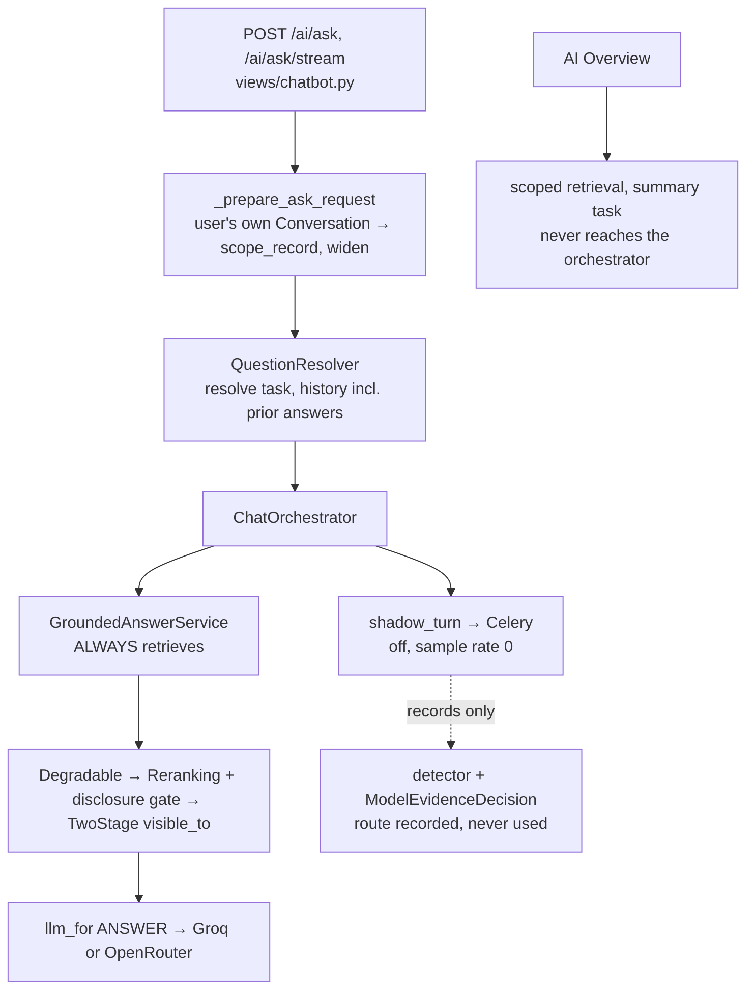
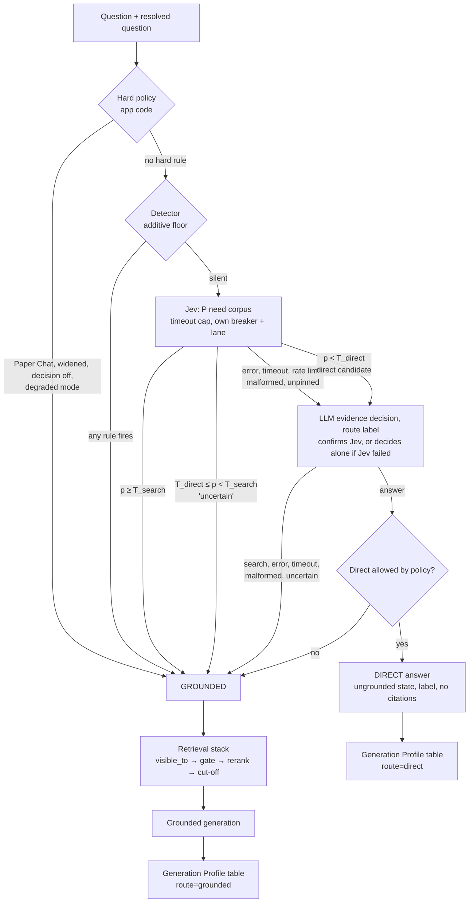

# Jev-first evidence routing with an LLM second opinion — proposal

**Status: proposal for review, 2026-10-08.** Architecture review only. No code, Jira ticket or ADR is changed. Written by an AI agent; every decision here belongs to a named human owner (CLAUDE.md §What AI does not decide). It builds on [11-ai-pipeline-target-architecture.md](11-ai-pipeline-target-architecture.md) and narrows it to the Jev-first question.

Key: **[V]** verified in code, tests, ADRs or run files at `origin/main` `9f06142` · **[A]** assumption · **[R]** recommendation · **[?]** could not be verified.

**Every number from the 113-question proxy set is exploratory.** One labeller, arXiv papers (not CIT-U), and the probability bands below were read off the same questions they describe. None of it is a threshold, a validation or a production claim.

---

## 1. Recommendation

**Do not build "Jev first, LLM fallback on uncertainty". Build "Jev first, LLM *confirmation* on direct candidates only, and retrieve on everything else."**

| Question | Answer |
|---|---|
| Is Jev-first with an LLM fallback preferable? | **Half of it.** Using the LLM when Jev *fails* (owner's instruction) is kept. Using it when Jev is merely *uncertain* is not: that band already belongs to retrieval, and the real misses sit in the confident-"no" region (§4). |
| What replaces it? | Structural rules and the detector run first and short-circuit. Jev next. The LLM runs **only when Jev would permit a direct answer**, and acts as a veto, not a fallback. |
| Can a model override a hard policy requirement? | **Never.** Models can only move a question toward retrieval. |
| If Jev errors, times out, hits a rate limit or returns a malformed reply? | **Ask the LLM to decide alone** (owner's instruction, 2026-10-08). If the LLM says search, fails or is malformed, retrieve. If it says answer, the question goes direct on **one opinion**: see §5.3 for what that costs and decision D4. |
| Keep the keyword detector? | **Yes, narrowed to additive floor.** It caught about 26 of 83 evidence-required questions and 1 of 33 `mechanism` questions [V]. It is not a classifier, but it costs nothing, uses no vendor and still works when every model is down. |
| Generative-model router? | **Separate and deferred.** A fixed (Inference task, route) → Profile table. Not a learned or per-request vendor router. |
| Agent? | No. Application-controlled pipeline. A bounded agent is a separate phase with its own ADR. |

> **Bottom line:** the cheap, safe default is already "retrieve". Spend model calls only on the one decision that carries risk: *letting a question skip the corpus*. Jev proposes it, a second, independent model confirms it, and either one failing sends the question to retrieval.

---

### 1.1 Owner decisions recorded so far (2026-10-10)

Recorded from the owner's instructions in review. None is an ADR, and none has been tested on a held-out set.

| # | Decision | Effect on the design | Still needs |
|---|---|---|---|
| 1 | **Jev error, timeout, 429 or malformed reply → the LLM decides alone.** | Adds a single-opinion direct path (§5.3) | ADR-035 §3 amendment; a stricter bar and a cap (D4) |
| 2 | **Jev uncertain → search.** The LLM is not consulted (the proposal's design was kept over a "send uncertain to the LLM" variant). | Only one single-opinion path exists, the Jev-failure one | Band values chosen on a tuning split (D5) |
| 3 | **A follow-up to a grounded answer has no hard evidence rule.** The deciders see the Resolved question; follow-ups are evaluated as their own category. | Removes a candidate hard rule | Held-out result on the follow-up category |
| 4 | **Paper Chat's scope is an access limit, not an evidence requirement** (owner's reading). If a search runs, it reads only that paper's chunks. | Contradicts ADR-034 §4 and ADR-035 §5 (`scope_record` forces a search) | ADR amendments; a held-out check that dropping it adds no misses |
| 5 | **The resolver stays.** Using the answering model as the resolver is a testable arm (it is only the `resolve` Profile setting). No free-text context goes to the deciders. | Adds one evaluation arm | Held-out result |

## 2. Three decisions, kept apart

| # | Decision | Owner | May a model decide it? |
|---|---|---|---|
| 1 | **Hard policy**: does a known scope or authorization fact require corpus-grounded handling? | application code | **No** |
| 2 | **Evidence decision**: does this question need the corpus? | policy over detector, Jev, LLM | Advisory, one direction only (toward retrieval) |
| 3 | **Generative-model routing**: which approved model writes the reply, after 1 and 2? | static Profile table | No (configuration) |

The LLM in this proposal belongs to decision 2. It receives the question and nothing else, and it can only say "search". It does not choose the answer model.

---

## 3. Current state [V]

- Every chat question retrieves; no direct path exists. `AI_EVIDENCE_DECISION` rejects `on` (`evidence/config.py`, ADR-035 §1).
- Deciders (`model_decision.py`, `route_label.py`, `jev_noul.py`) are reached only by the shadow task and `eval_evidence`. Jev is reached only by `eval_evidence --decision-mode jev-noul`, which refuses non-`proxy` tiers (`management/commands/eval_evidence.py`).
- Provider selection is per Inference task with same-vendor fallback only (`inference/profiles.py`, `CompositionRoot.llm_for`). ADR-036 §Amendment and ADR-008 §Amendment bar cross-vendor failover.
- Shadow already has the isolation this design needs: its own breaker key (`SHADOW_BREAKER_KEY`), its own token lane (`Lane.SHADOW`), skipped when the answer breaker is open (`evidence/shadow.py`).

---

## 4. What the run files say about the fallback design (exploratory)

Four Jev runs (`20261008-110112`, `-110304`, `-110450`, `-110632`), mean probability per question; Groq route label gpt-oss-20b (`20261008-093000`, `-093521`, `-094042`, `-094603`); Groq tool call gpt-oss-120b (`20261008-051409`, `-053345`, `-054102`, `-054438`).

### 4.1 Where the questions sit by Jev probability

| Jev p (mean of 4 runs) | Need the corpus (83) | Do not (20) | Ambiguous (10, search tolerated) |
|---|---|---|---|
| < 0.1 | 3 | 14 | 0 |
| 0.1 – 0.2 | 1 | 6 | 0 |
| 0.2 – 0.3 | 5 | **0** | 0 |
| 0.3 – 0.5 | 8 | **0** | 6 |
| 0.5 – 0.8 | 29 | **0** | 4 |
| ≥ 0.8 | 37 | **0** | 0 |

Reading it:
1. **Every not-required question sat below 0.2.** The middle band (0.2–0.5) held 13 evidence-required and 6 ambiguous questions and no question where a search was an error. Sending the middle band to retrieval cost nothing on this set. A fallback LLM there would resolve questions that retrieval already handles correctly.
2. **The dangerous region is the low band.** Below 0.2 sit 24 questions: 20 truly direct and 4 that needed the corpus. Those 4 are the confident-wrong cases, and an "uncertain" trigger never fires on them.
3. **Noul returns no confidence value** (only a probability; Choice and Score carry `confidence`) [V: OpenRouter Decisions API reference]. "Uncertain" here is a band defined by two cutoffs we choose, not something the vendor reports.
4. **Instability is small:** 4 questions crossed 0.5 across four runs, 1 crossed 0.2; largest spread 0.13 [V].

### 4.2 Would a second model rescue Jev's misses?

Majority route over four runs, for evidence-required questions Jev placed below the cutoff:

| Jev cutoff | Jev misses | Groq label 20b searches (rescues) | Groq tool 120b rescues | Detector rescues | Missed by all |
|---|---|---|---|---|---|
| 0.20 | 4 | 3 | 3 | 0 | 1 |
| 0.30 | 9 | 7 | 5 | 0 | 2 |
| 0.50 | 17 | 13 | 11 | 1 | 4 |

- **A second model helps a lot** (3 of 4, 7 of 9). Their errors overlap only partly.
- **They share failure modes.** q12, q16 and q40 were missed by Jev at 0.5 *and* by the tool call; q02, q12, q16 and q40 *and* by the label model [V]. Mechanism and near-duplicate questions with no repository vocabulary are the shared blind spot. Three or four questions stay missed under every combination here, and no tuning removes them.
- **The detector adds almost nothing on the model-missed set** (1 of 17 at 0.5).

### 4.3 What this implies

The rescue only happens if the second model looks at questions Jev scored *low*. Hence the design in §5: run it on direct candidates (24 of 113 here = 21%, on a set that is 27% not-required; real traffic will differ [A]).

Caveat: these bands were read off the same questions. They show the *shape* of the idea and justify evaluating it. They are not cutoffs.

---

## 5. Proposed sequence

`T_search` and `T_direct` are parameters, not values. This proposal does not pick them (decision D5). With one cutoff (`T_direct = T_search`) the "uncertain" band is empty.

### 5.1 Decision table

| Case | Hard policy | Detector | Jev | LLM | Route |
|---|---|---|---|---|---|
| Paper Chat, widened, decision off, degraded retrieval | requires | – | not called | not called | **GROUNDED** |
| Detector rule fires | – | fires | not called | not called | **GROUNDED** |
| Jev high (p ≥ T_search) | allows | silent | search | not called | **GROUNDED** |
| Jev uncertain (T_direct ≤ p < T_search) | allows | silent | middle | not called | **GROUNDED** |
| Jev low, LLM says search | allows | silent | direct | search | **GROUNDED** (disagreement) |
| Jev low, LLM says answer | allows | silent | direct | answer | **DIRECT** |
| Jev low, LLM fails / times out / malformed | allows | silent | direct | error | **GROUNDED** |
| Jev fails / times out / 429 / malformed, LLM says search | allows | silent | error | search | **GROUNDED** |
| Jev fails / times out / 429 / malformed, LLM says answer | allows | silent | error | answer | **DIRECT, on one opinion** (§5.3, D4) |
| Jev fails and LLM fails / times out / malformed / uncertain | allows | silent | error | error | **GROUNDED** |
| Jev approval flag off | allows | silent | not called | decides alone, if its own approval is on | as the two rows above; GROUNDED if neither provider is approved |
| Any model asks for direct on a hard-policy question | requires | – | ignored | ignored | **GROUNDED** |

Properties enforced in code [R, each needs a test]: (a) the policy function takes no model output as input to a hard rule; (b) `DIRECT` requires every signal that ran to permit it; a failed Jev leaves the LLM as the only signal, so the LLM-alone case is explicit and counted in its own reason code (§5.3); (c) a decider cannot return a value outside {search, answer}; (d) any exception from a decider becomes a reason code and `GROUNDED`, with a non-vendor exception still propagating as a bug (the convention in `model_decision.py`).

Properties that depend on model behaviour and are *not* guaranteed: that a low Jev probability means the corpus is not needed; that the LLM agrees only when it should; that the two models fail independently. §4.2 shows they partly do not.

### 5.3 The cost of letting the LLM decide alone when Jev fails

Jev's failures are the moment its protection disappears. On the proxy set (exploratory, per run):

| Who alone permits direct | Questions answered direct | Of those, needed the corpus |
|---|---|---|
| Jev below 0.2 | 24 | 4 (17%) |
| Groq label, gpt-oss-20b | 28–30 | 8–10 (about 31%) |
| Groq tool call, gpt-oss-120b | 31–34 | 10–11 (about 32%) |
| **Jev below 0.2 and the LLM both agree** | about 20 | about 1 |

- The LLM-alone path is the **weakest** route to a direct answer. On this set about one in three of its direct answers should have searched. The detector rescued none of them.
- It runs exactly when Jev is having trouble. Jev had 0 failures in 113 × 4 calls, but the alpha endpoint has no stated rate limit [?], and one Groq run lost 47% of its calls to provider failures [V].
- **Asymmetry in the specified design:** LLM down → Jev alone is *not* allowed to permit direct, while Jev down → LLM alone *is*. On this set Jev alone is the better single opinion. Either allow both single-opinion paths or neither (D4).
- ADR-035 §3 says "Neither can authorize a direct answer alone." This design contradicts that sentence for the Jev-failure case, so it needs an amendment, and it should be recorded as a deliberate trade of safety for availability of the direct path.

Mitigations if the owner keeps it [R]: (1) a stricter bar on the single-opinion path, such as the LLM answering `answer` on two samples, or the LLM running with the veto prompt tuned for precision; (2) a separate reason code so every LLM-alone direct answer is countable; (3) a monitored rate cap: if LLM-alone direct answers exceed a share of traffic, stop permitting them; (4) the Jev-failure rate tracked, so a long outage does not quietly become LLM-only routing.

### 5.2 Why not run the LLM on every request

ADR-035 §2 calls the LLM on every request (3.4–3.8 s mean for the tool call, 2.2–2.8 s for the label). Here it runs on about a fifth of requests on this set [A: traffic mix unknown], and only on the path that will otherwise skip retrieval.

---

## 6. Alternatives

| Option | Model calls per request | Misses of 83 (exploratory) | Decision latency | New vendor | Main weakness |
|---|---|---|---|---|---|
| A. Detector only | 0 | 57 | ~0 | no | misses nearly all mechanism questions |
| B. Detector + LLM on every request (ADR-035 today) | 1 | 9–11 | 2.2–3.8 s | no | slowest, 47% fallbacks in one run, tool call writes a discarded answer |
| C. LLM-only | 1 | 8–11 | 2.2–3.8 s | no | model opinion owns structural facts |
| D. Detector + Jev | 1 | 4 (@0.2) to 17 (@0.5) | 0.9 s | **yes (TypeSafe via OpenRouter)** | one model's blind spots; vendor terms |
| E. **Jev → LLM fallback on uncertain** (proposed by the brief) | 1 + ~17% | not measured | 0.9 s, 3.4 s on fallback | yes | LLM runs where retrieval is already right; misses confident-wrong |
| **F. Jev → LLM confirmation on direct candidates** (recommended) | 1 + ~21% | measured in part: 1–2 of 4 remain at cutoff 0.2 | 0.9 s grounded, ~3.4 s direct candidate | yes | needs two vendors healthy for any direct answer |
| G. Route label + LLM confirmation, no Jev | 1 + ~share | not measured | 2.2–2.8 s | no | slower; same-vendor failures correlate |

Option G is the **no-new-vendor control** and must be in the held-out run. If it matches F, Jev's value is speed only, and speed must be weighed against an unapproved alpha endpoint.

---

## 7. What each model receives

Minimum context for **both** Jev and the LLM [R, extends ADR-035 §8]:

| Item | Jev | LLM second opinion | Notes |
|---|---|---|---|
| Raw question | yes | yes | length-capped (§7.1) |
| Resolved question | yes, labelled untrusted | yes, labelled untrusted | a resolver reads prior answers, which are retrieval-derived. Ablate: raw only vs raw + resolved |
| Prior **reader** questions (≤5) | yes | yes | user-authored; cap total characters |
| Corpus description | yes, versioned, generic | yes | constant text in `jev_noul.py` [V]; no CIT-U specifics |
| Passages | **never** | **never** | |
| Recalled Turns | **never** | **never** | needs an embedding call |
| Prior assistant answers | **never** | **never** | injection path |
| Conversation / user ids, record ids, tenant | **never** | **never** | |
| Candidate answer text | n/a | **never requested** (route-label mode) | avoids ADR-035 §11's hypothetical-answer retention concern |

### 7.1 Gaps found
- **No length cap on the decision input.** Jev's context is 32k tokens; `MAX_QUESTION_LENGTH` is 2000 characters per question [V `views/chatbot.py`] but prior questions are only capped by count. Add a character cap [R].
- **Questions are ungated to every vendor today.** The disclosure gate covers record content only. A reader pasting an unpublished abstract into a question sends it to Voyage, Groq and, with this design, TypeSafe via OpenRouter (SECURITY.md §8, §11 risk 11). Decision D6.
- **The Decisions request has no data-policy field.** The chat dialect sends `provider.data_collection: "deny"` (`providers/dialects.py:196`). The Decisions adapter deliberately sends only `model`, `state`, `questions` [V]. The API schema has an optional `provider` routing object; whether it honours `data_collection` is **[?]**.

---

## 8. Provider boundaries

| Call | Provider | Sees | Gate today | Approval / terms |
|---|---|---|---|---|
| Extraction | Docling-serve, self-hosted | PDF bytes | none needed | on-prem; image tag `:latest` is unpinned [V `docling/Dockerfile`] |
| Embedding | Voyage `voyage-context-4` | chunk text; **every query** | chunks: disclosure gate; queries: none | training opt-out is a dashboard toggle needing a payment method; not retroactive (ADR-015). Retention, residency **[?]** |
| Rerank | Voyage `rerank-3` | question + gated candidates | gate before rerank | as above |
| **Jev decision** | OpenRouter Decisions → TypeSafe | question, resolved question, ≤5 reader questions, corpus description | **none in production** (eval tier guard only) | TypeSafe privacy policy (updated 2025-11-19, read 2026-10-08): will not train or fine-tune on Input; will not disclose Input except to service providers; retention "as long as reasonably necessary", no period; US-hosted; deletion on request. Not covered: OpenRouter's own retention of Decisions calls, sub-processors, a data-processing agreement. Endpoint alpha. **Not approved** |
| **LLM second opinion** | Groq (or OpenRouter) under the `answer` Profile or its own key | same minimum context | none | **no retention terms recorded in the repo [?]**; ADR-035 §11 requires them before shadowing real questions |
| Answer | Groq or OpenRouter | question, permitted passages, history Q/A | passages gated | as above |

New rule [R]: a decision provider is constructed only when a **per-provider approval setting** is on, and fails closed to `GROUNDED` otherwise. A deployment with no approval records nothing and sends nothing (the ADR-035 SaaS Impact posture).

---

## 9. Contracts

| Component | Input | Output | Authority | Failure |
|---|---|---|---|---|
| Hard policy (new, pure) | `ChatQuestion` facts: scope record, widened, mode, degraded flag | `requires_grounding: bool` + reason | **sole** owner of structural facts | n/a |
| Detector (`evidence/detector.py`) | raw + resolved text, `record_scoped` | verdict + reason codes | may add retrieval; never remove; never refuse | n/a |
| Jev decider (`evidence/jev_noul.py`, `providers/openrouter_decisions.py`) | `build_state(...)` only (`STATE_FIELDS` allowlist) | probability or reason code + model build + latency | advisory; cannot set scope, limits, identity | reason code → `GROUNDED` |
| LLM second opinion (`evidence/route_label.py`) | same minimum context | `search`/`answer` or reason code | advisory; veto only | reason code → `GROUNDED` |
| Evidence policy (new) | the above | `GROUNDED` / `DIRECT` + reason chain | owns the route; computed from the question alone, never from retrieval or the gate (ADR-035 §7) | any doubt → `GROUNDED` |
| Generation Profile table (new, static) | Inference task, route | Profile | picks the writer after the route | Profile's same-vendor fallbacks, then `unavailable` |
| Retriever, selection, gate | user from the request, scope, effective question | permitted passages | unchanged | unchanged |
| Direct answer (new) | question and reader-question history only | text, state `ungrounded` | no corpus claims | `unavailable`; never fall back to a grounded-looking reply |

---

## 10. Direct versus grounded answers [R, from ADR-034]

| Aspect | Grounded | Direct |
|---|---|---|
| Prompt | `GROUNDING_RULES` + numbered sources, unchanged | **separate prompt, no `Sources:` block** (ADR-034 §1) |
| Citations | required, resolved to passages | **none, ever**; markers dropped by the parser |
| Provenance on the wire | `mode`, citations, sources | state `ungrounded`, label "not from the repository"; no probability shown to the reader |
| History | in model history | **excluded** (ADR-034 §5; cost recorded there) |
| Storage | `Turn.state=generated`, answer embedded for memory | `Turn.state=ungrounded`; no answer vector (only `generated` Turns get one, per CLAUDE.md `backfill_turn_vectors`) |
| Route record | reason codes on the Turn | route + reason chain + model builds, **no question text in logs** |
| Degraded mode | FTS, banner | **never direct** (ADR-034 §3) |
| Paper Chat | always | **never** |
| Research / landscape question | `no_sources` if empty | **never direct** (ADR-034 §4; ADR-027 §4 dormant, ADR-035 §9 owner) |

**Unresolved ADR conflict:** ADR-034 §2 makes "all passages withheld by the gate" `no_sources` but "nothing relevant" `ungrounded`; ADR-035 §7 says the route and response never depend on *why* nothing was kept. In this design the route is fixed before retrieval, so a direct answer never follows an empty retrieval. ADR-034's *zero-relevant → ungrounded* branch remains a different, post-retrieval path, and it still contradicts ADR-035 §7. Decision D3. Nothing here depends on building that branch.

---

## 11. Controls against widening access or leaking restricted content

Enforced in code today [V]: user from `request.user`; Conversation looked up among the user's own (`_conversation_for`); `Record.objects.visible_to(user)` inside `TwoStageRetriever`; gate before rerank and before the prompt; the decider modules take strings and hold no record, retriever or database handle; `STATE_FIELDS` is the state allowlist, asserted in `test_eval_evidence_jev_command.py`.

To add [R], each with a test:
1. A production **provider-approval switch**, failing closed to `GROUNDED`.
2. An import-boundary test: `apps/ai/evidence/{jev_noul,route_label,model_decision}.py` and the decision adapters cannot import `Record`, retrieval, `Conversation` or `Turn` models.
3. A policy test: a decider returning `direct` for a Paper Chat, widened or detector-fired question still yields `GROUNDED`.
4. Request-capture tests on both deciders asserting no passage, recalled Turn or prior answer text, as ADR-035 §8 already requires for the tool call.
5. Per-user throttle and a decision-lane token budget (`Lane.SHADOW` exists; a production lane does not).
6. Log rule: reason codes and ids only; never question text or probabilities tied to a user.

---

## 12. Side channels

| Channel | Status | Mitigation |
|---|---|---|
| Route depends on withheld evidence | **No**: route computed from the question alone before retrieval (ADR-035 §7) | keep it that way; test it |
| Response shape, direct versus grounded | reveals the question's class, not corpus contents | acceptable; record it |
| Timing: grounded fast path (~0.9 s Jev) versus direct candidate (~3.4 s with LLM) | reveals "this question looked general", not corpus state | accept and record |
| Probing the decision boundary with paraphrases to force a direct answer | possible | the direct label, the narrow direct path (§10), the detector floor and the LLM veto bound it. Evaluate with adversarial paraphrases |
| Empty versus withheld | equal today (`test_outcome_indistinguishable_http.py`) [V] | extend the test to direct |
| Logs and run files | completion logs hold no content; eval run files hold question ids and probabilities | keep reader questions out of run files |
| Shared query-embedding cache key across users | not wired on the query path [V `composition.py`]; the key is shared (`resilience/query_cache.py:41`) | decide before wiring |

---

## 13. Cost and latency

| Path | Added decision cost vs today | Source |
|---|---|---|
| Today | 0 (always retrieves, no decision) | [V] |
| Structural or detector hit | 0 model calls | [V] detector fired on about 23% of this set |
| Jev says search or uncertain | 1 Jev call: **0.89–0.93 s mean, p95 1.0–1.2 s**; about 460 input tokens (51,992 per 113 calls) | [V] run files |
| Direct candidate | Jev + LLM: 0.9 s + **2.2–2.8 s** (label, 20b) or 3.4–3.8 s (tool, 120b) before generation | [V] run files |
| Jev price | about $0.00002 per call at ~476 tokens | **[?]** OpenRouter's documented sample only; our runs do not store `usage.cost` (the adapter parses it; `ModelDecision` drops it) |
| LLM price in production | **[?]** Groq free tier in dev; OpenRouter paid price not recorded |
| Answer generation latency | **[?]** not measured in any repo artifact |

Net effect, direct path: decision adds roughly 3–4 s before the first token, and saves one retrieval (Voyage embed + rerank) and a shorter prompt. Net effect on the grounded path: about +0.9 s, unless retrieval runs speculatively in parallel with the decision (costs a Voyage call on direct questions; not recommended initially [R]).

---

## 14. Detector: keep, narrow, or replace?

[V] on the proxy set (`20261008-044833`): combined detector 56/113 correct, zero over-fires, 57 misses; `mechanism` 1/33; `cross-paper` 1/10; `near-duplicate` 4/10; `scope_record` fired 0 times because the curated set has no Paper Chat conversations.

[R] Keep the detector **only for explicit, high-value signals** that need no semantic judgement and that a model should not be trusted to apply: scope, institution terms, document references, sourcing demands, aggregate shape. Do not extend the word lists to chase mechanism questions; that is a model's job and a lexicon tuned on the scored set is overfitted.
[?] The rule lexicons may have been shaped by looking at this proxy set; I could not verify their provenance. Held-out evaluation will show it.

---

## 15. Evaluation plan

**Arms, same questions and labels:** (1) structural rules alone; (2) structural + detector; (3) detector + Groq label; (4) detector + existing tool call; (5) detector + Jev alone, full curve; (6) detector + Jev + LLM confirmation (recommended); (7) detector + Jev + LLM fallback-on-uncertain (the brief's variant); (8) Groq label + LLM confirmation, no Jev (control).

**Sets:** a **tuning split** for choosing `T_direct`, `T_search` and prompts; a **held-out split** used once. Independent reviewers label the held-out set. Required categories: institutional and corpus-level; evidence-required without repository vocabulary; mechanism questions that look like general knowledge; explicit sourcing requests; Paper Chat and document-specific; ambiguous (reported apart); follow-ups after grounded and after direct turns; adversarial paraphrases.

**Sizing, illustrative:** observing zero misses in *n* evidence-required questions bounds the true miss rate below about 3/n at 95% confidence (rule of three), so a 2% target needs about 150 evidence-required held-out questions. The target is the owner's decision (D5).

**Report:** missed searches first, by category and by question; over-searches (ambiguous separate); whether the second model rescues Jev's misses and whether they share failures (§4.2 on the held-out set); Jev reliability curve and Brier score; route instability over ≥3 runs; failure, timeout, rate-limit and fallback rates (runs over 5% alone); decision and end-to-end latency and cost; **answer correctness, claim support and citation support separately from route accuracy**; for direct answers, label comprehension.

| Phase | Can establish | Cannot establish |
|---|---|---|
| Offline curated | route accuracy, calibration, shared failure modes, cost, latency | real traffic mix, label comprehension, whether direct answers are good |
| Unlabelled shadow | coverage, latency, fallback and contention on real traffic (ADR-035 §10) | **any accuracy**; the shadow has no ground truth |
| Reader-visible pilot | direct-answer quality (human-rated), label comprehension, complaints, task success | route accuracy at scale unless a sample is labelled |

**Gates.** Offline → shadow: provider approvals recorded for every vendor the shadow path calls; held-out miss rate at or below the owner's target; zero misses on structural and institutional questions; fallbacks ≤5% in ≥3 runs. Shadow → pilot: shadow coverage and fallback within target over a fixed window; ADR amendments accepted; direct-path presentation reviewed; rollback rehearsed.

---

## 16. Phased plan

| Phase | Work | Needs | Rollback |
|---|---|---|---|
| 0 Governance | provider data-handling review (Jev/OpenRouter Decisions, Groq, OpenRouter chat, Voyage); decide D1–D8 | people | n/a |
| 1 Held-out evaluation | build, label and split the set; run arms 1–8; add answer-quality scoring; ablate resolved question | Phase 0 for any non-public data | offline |
| 2 Policy module, dark | pure policy function, two-parameter bands, LLM-confirmation decider, production provider-approval switch, input caps, contract tests | Phase 1 picks the arms to keep | setting `off` |
| 3 Shadow | record the chosen chain on real traffic through the existing claim-and-fence task | provider approvals; Phase 2 | sample rate 0 |
| 4 Direct path, dark | ADR-034 state, prompt, label, history exclusion, frontend; resolve D3 | D3; label design | flag off |
| 5 Pilot | `on` for a cohort | §15 gates; ADR-035 §1 amendment | flag off, instant |

**Dependencies:** ADR-035 §2 (mechanism), §1 (`on`), §9 (landscape owner), §11 (retention) need amendments; ADR-034 §2 needs reconciling with ADR-035 §7; ADR-036 gets a production amendment if Jev is kept (the current one is evaluation-only); ADR-015 for question text; SECURITY.md §8 and §11 risk 11. Existing tickets: IR-250 (embargo field), IR-278 (real corpus, Deferred), IR-396 (relevance cut-off, To Do), IR-402 (measure and set defaults, To Do), IR-302–305 (Lens). No new keys are proposed here.

**Out of scope:** agent loop; model-written queries; adaptive retrieval; web search; the Lens; learned or cross-vendor model routing; Jev's Choice question; the AI Overview.

---

## 17. Effort and risk

Assumptions: one developer who knows `apps/ai`; dev-days exclude review; labelling is separate human time.

| Work | Shared / Jev / LLM-confirm | Dev-days |
|---|---|---|
| Held-out set, split, answer rubric | shared | 5–8 + 3–5 labelling |
| Policy module, tests, resolver `CircuitOpen` fix | shared | 3–5 |
| Provider-approval switch, input caps, import-boundary tests | shared | 2–3 |
| Jev production hardening (breaker key, lane, timeout, cost capture, pin check) | Jev | 3–4 |
| LLM confirmation decider on its own breaker and lane | LLM | 1–2 (route-label decider exists) |
| Direct path (state, prompt, label, history, frontend) | shared | 6–10 |
| Observability (route chain, per-route cost) | shared | 2–3 |
| ADR drafting and reviews | shared | 2–3 + review time |
| **Total engineering** | | **about 24–38** [A], against ADR-035's 16–25 for Phase 0 |

Top risks: (1) vendor terms never verified, so the choice is forced by governance instead of measurement; (2) shared blind spots between the two models, so a confident-wrong "direct" still happens; (3) any model call on the user's question widens what vendors see (D6); (4) the alpha endpoint changes shape.

---

## 18. Open decisions

| # | Decision | Suggested owner |
|---|---|---|
| D1 | Approve or refuse data handling for Jev (OpenRouter Decisions → TypeSafe) and record retention for Groq: ask TypeSafe and OpenRouter for the retention period and a data-processing agreement | project lead / data-protection contact [?] |
| D2 | Landscape owner (ADR-035 §9) | named person, ADR-035 |
| D3 | Reconcile ADR-034 §2 with ADR-035 §7 | ADR owners |
| D4 | **Owner has chosen:** when Jev fails, the LLM decides alone and may permit a direct answer. Still open: the asymmetry (Jev alone may not permit direct when the LLM fails), the stricter bar and monitoring in §5.3, and the ADR-035 §3 amendment | product + security |
| D5 | Target miss rate and cost of an over-search, **before** the held-out run; band parameters chosen only on the tuning split | product owner |
| D6 | Are reader questions subject to the disclosure policy, and may they be sent to a decision vendor | data-protection contact |
| D7 | Stored answers and vectors when a record later becomes restricted | data-protection contact |
| D8 | Direct answers on the `answer` task with their own prompt, or a new task (ADR-036 closed set) | architecture owner |
| D9 | Mechanism for the second opinion: route label (no answer text) instead of ADR-035 §2's tool call | ADR-035 owner |

### Contradictions recorded, not smoothed
- SECURITY.md §11 still lists risks 2 and 3 as Open; CLAUDE.md records both fixed by IR-153.
- docs/adr/README.md says ADR-034 is "not yet built" while Jira shows IR-453 Done; the code agrees with the README (no `ungrounded` state).
- The ADR-036 IR-482 amendment was written by an agent; the ticket asked for a reviewed amendment and no review is recorded in the file.
- Jev's TypeSafe privacy policy promises no training but gives no retention period; the IR-482 amendment still says "retention, training and rate-limit terms are unverified" and should be updated by a person after D1.
