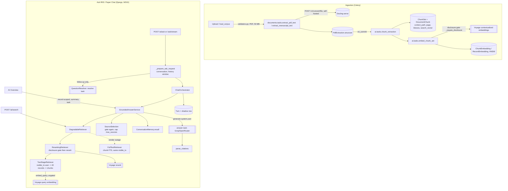
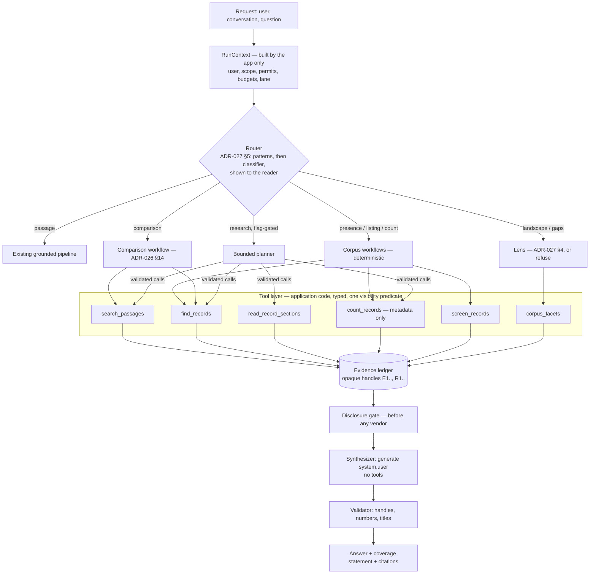
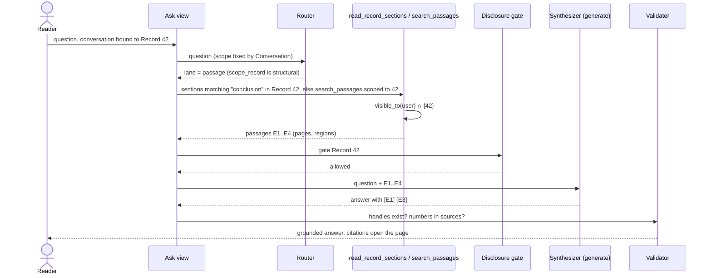
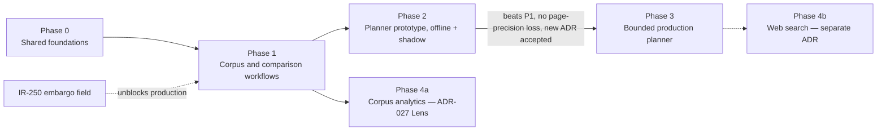

# A bounded research agent for Ask IRIS — diagnosis and proposal

**Status: proposal for review, 2026-10-10.** Architecture exploration only. No code, ADR or Jira issue is changed by this document. Written by an AI agent; every decision here belongs to a named human owner (`CLAUDE.md` §What AI does not decide). It builds on [11](11-ai-pipeline-target-architecture.md) and [12](12-jev-first-evidence-routing-proposal.md) and does not repeat their routing analysis.

**This is a proposal, not approval to implement.** Several recommendations conflict with accepted ADRs (§10). None of them may be built until a person accepts the ADR change that permits it.

Key: **[V]** verified in code, tests, ADRs or files at `origin/main` `5a6ed71` · **[A]** assumption · **[R]** recommendation · **[?]** could not be verified.

---

## 1. Executive recommendation

**Do not build a free-roaming tool-calling agent. Build three missing data operations, run the corpus questions as fixed workflows over them, and add a bounded planner only for open-ended multi-paper questions — after it beats the workflows on a measured evaluation.**

The five example questions need different things, and most of them are not "a model choosing tools":

| Question | What it actually needs | Agent needed? |
|---|---|---|
| "What did this thesis conclude?" | Scoped retrieval, which exists, plus section-aware reading | **No** |
| "Compare the methods in these three papers" | Resolve three titles to records, retrieve per record, synthesize | **No** — ADR-026 §14's decomposition already covers it |
| "Are there papers about X?" / "Which papers…?" | **Record-level** search and per-record verification. Neither exists | **No** — a fixed workflow |
| "How many distinct papers are about X?" | Application-computed counts over authorized, deduplicated records | **No** — a model must not do this |
| "What themes or gaps appear across the papers?" | A defined taxonomy and full-corpus coverage. Neither exists | **No** — and not answerable honestly today |
| "Which approaches to X disagree, and why?" (open-ended) | Several searches whose next step depends on what came back | **Yes** — this is where a planner earns its cost |

### Options

| | A. Extend the pipeline with workflows | B. Bounded planner over typed tools | C. Free agent loop (reference-repo style) |
|---|---|---|---|
| Who decides what to fetch | Application code, per task type | Model proposes, application validates and executes | Model |
| Corpus counts and lists | Computed in SQL, exact where claimed | Same workflows, called as tools | Model-assembled — **unsafe** |
| Injection exposure | Passages reach only the narrow `generate(system, user)` call | Planner never reads passage text (§4.5) | Tool results in the acting model's context |
| Measurable per technique (ADR-023) | Yes | Yes, if the planner is one switch | Poorly |
| Benefit | Cheap, deterministic, testable now | Handles questions no fixed workflow anticipates | Fastest to demo |
| Cost | More code paths; misses unusual question shapes | +3–6 model calls, +10–30 s, new ADR, new failure modes | Everything ADR-028 warned about |

**Recommended: A now, B later and only for the research lane, C never.**

**Main trade-offs.** Option A gives up flexibility on unusual questions in exchange for answers whose completeness the code can state. Option B buys that flexibility back at roughly 3–10× the model cost and latency of one grounded answer [A, from ADR-028's cited comparison], and its reliability rests partly on model behaviour that tests cannot guarantee (§6.3).

**Two blockers stand in front of all of it** [V]:

1. **The disclosure gate refuses every record in production** (`apps/ai/retrieval/reranking.py:38`, `apps/ai/policy/disclosure.py:117` — `EmbargoUnknown` refuses) until IR-250 (*Record embargo field*) lands. Any step that sends record text to a vendor — reranking, screening, synthesis — therefore does nothing outside development.
2. **No real corpus exists.** Every number available is from the 40-paper arXiv proxy corpus (`docs/evaluation/README.md`). Nothing here may be reported as a finding about CIT-U research.

> **Bottom line:** the gap is not orchestration. IRIS can find passages; it cannot yet find, verify or count *papers*. Build those operations as application code, give each a stated completeness guarantee, and only then let a model choose among them.

---

## 2. Current state, verified

### 2.1 Diagram



### 2.2 Ingestion [V]

| Step                  | Where                                                                                              | Notes                                                                                                                                                                                                                                                          |
| --------------------- | -------------------------------------------------------------------------------------------------- | -------------------------------------------------------------------------------------------------------------------------------------------------------------------------------------------------------------------------------------------------------------- |
| Upload validation     | `apps/documents/validators.py:10`                                                                  | PDF type and a 50 MB cap                                                                                                                                                                                                                                       |
| Structured extraction | `apps/documents/tasks.py:35` (`_build_extractor`), `:103`, `:133`                                  | Docling-serve over HTTP, self-hosted. **No fallback extractor** (ADR-016 divergence)                                                                                                                                                                           |
| OCR / enrichment      | `apps/ai/extraction/docling_client.py:49`                                                          | `do_ocr` defaults **off**; formula, code and picture enrichment are settings. A scanned thesis without OCR yields no text [V]                                                                                                                                  |
| Chunking              | `apps/ai/ingestion/pipeline.py:151` (`ingest_extraction`), queued by `apps/documents/tasks.py:181` | Section trail in `context_path`, page, regions. Token unit is real `voyage-context-4` tokens                                                                                                                                                                   |
| Embedding             | `apps/ai/indexing.py:301` (`embed_active_chunk_set`), `:198` (`_require_disclosure`)               | Gate enforced before any chunk is sent. Record-level vector via `embed_record_summary` (`:212`)                                                                                                                                                                |
| Re-processing         | `apps/ai/repositories.py`                                                                          | New chunk set swapped atomically; only chunks with changed `text_hash` re-embed; removed chunks tombstoned (`deleted_at`)                                                                                                                                      |
| Deletion              | `apps/records/services.py:39`                                                                      | **Soft delete** (`is_deleted=True`). `RecordManager.get_queryset` excludes it, so `visible_to` hides its chunks and vectors; they are not removed. Proposal 11 §7.5 says deletion "cascades" — true only of a hard delete, and I found no hard-delete path [?] |

### 2.3 Query path [V]

| Concern | Where | Behaviour |
|---|---|---|
| Request preparation | `apps/ai/views/chatbot.py:145` | 2,000-char question cap, conversation looked up inside the user's own (`:92`), history by token budget (`apps/ai/history.py`) |
| Question resolution | `chatbot.py:169-171`, `composition.py:205` | Follow-ups rewritten by the `resolve` task; failure falls back to the raw question |
| Retrieval stack | `apps/ai/composition.py:326-369` | Degradation ⊃ reranking ⊃ two-stage (or keyword fusion, off by default) |
| Visibility | `apps/ai/retrieval/two_stage.py:88`, `degraded.py` `FullTextRetriever` | `Record.objects.visible_to(user)` **before** scoring, on both paths |
| Scope | `two_stage.py:94`, `chatbot.py:177-180` | Paper Chat narrows to one Record, from the Conversation; `widen` is a request flag |
| Reranking + gate | `apps/ai/retrieval/reranking.py:83`, `:165` | Gate before the reranker, recall 100, trim to limit |
| Selection | `apps/ai/answers/selection.py` (`SourceSelection.select`) | Gate applied again, capped at `max_sources` (default 5 per request, ceiling 20) |
| Generation | `apps/ai/answers/service.py:209` / `:246` | Narrow `generate(system, user)`; `no_sources` / `unavailable` / `partial` states; reasoning on its own channel |
| Citations | `apps/ai/answers/citations.py:268` | **Syntactic only**: a marker must point inside the supplied list. Nothing checks that the cited passage supports the sentence |
| History and memory | `citations.py:192`, `apps/ai/memory.py:61` | Prior Q/A pairs and recalled Turns go **into the same prompt** as passages, verbatim |
| Degraded mode | `apps/ai/retrieval/degraded.py` (`DegradableRetriever`) | Falls back to chunk FTS on circuit-open, rate limit, network or timeout only |

### 2.4 Providers and orchestration [V]

- **Model access** is by named Inference task only: `CompositionRoot.llm_for(task)` (`composition.py:166`), closed set `answer`, `resolve`, `summary`, `describe_figure`.
- **Tool calling exists but executes nothing.** `ToolCallingLLM` (`apps/ai/providers/tool_calling.py`) is "one request, one completion"; the only tool is the no-argument `search_corpus` route signal (`apps/ai/evidence/model_decision.py`), never executed (ADR-035 §4).
- **Resilience:** 2 interactive retry attempts (`apps/ai/resilience/llm.py:101`), breaker opens after 5 failures for 30 s (`resilience/circuit.py:46-47`), token lanes `QUERY` / `INGESTION` / `SHADOW` (`resilience/rate_limit.py:28`).
- **Timeouts:** Voyage 60 s (`config/settings/base.py:683`). The LLM client is built with **no explicit timeout** (`providers/openai_compatible.py:193`); only `complete_with_tools` accepts one (`:311-334`). The SDK default applies to answers [?: default not pinned in the repo].
- **Throttle:** `ai_query` 60/hour per user (`config/settings/base.py:178`).
- **Deployment:** the backend still runs WSGI (`CLAUDE.md`, ADR-017 unimplemented). A streamed answer holds a worker for its whole duration.

### 2.5 Entry points [V]

| Entry point | Path | Uses |
|---|---|---|
| Ask IRIS | `POST /ai/ask/`, `/ai/ask/stream/` | Orchestrator → answer service, unscoped |
| Paper Chat | same endpoints, Conversation bound to a Record | Same, scoped; `widen` unscopes |
| AI Overview | `GET /ai/records/<id>/overview/`, `apps/ai/overview.py:67` | Scoped answer on the `summary` task, stored once per record, **bypasses the orchestrator** |
| Semantic search | `POST /ai/search/` (`chatbot.py:403`) | Retriever only, no model |
| Similar records | `GET /records/<id>/similar/`, `apps/ai/similarity.py` | Record-vector similarity |
| Discover catalogue | `RecordViewSet`, `apps/records/views.py:73-75` | DRF `SearchFilter` (`icontains` on title, abstract, author) + metadata filters (`records/filters.py`) |

### 2.6 What the data model can and cannot support [V]

| Needed for | Exists | Gap |
|---|---|---|
| Record-level semantic search | `RecordEmbedding` (one vector per record, HNSW) | No endpoint or tool exposes it except `similar/` |
| Record-level keyword search | `Record.search_vector` (weighted, GIN) is **maintained but read by nothing** since IR-285; Discover uses `icontains` | A ranked catalogue search |
| Structured facets | `Classification`, `PSCEDClassification`, `RecordType`, `year_accomplished`, `year_completed`, `is_ip`, `ip_type`, authors | Both taxonomies are flat lookup tables (ADR-027 §1 correction); classification fields are nullable |
| Versions | `RecordVersion` — numbered snapshots **of one Record** (`records/models.py:279`) | None: versions never become separate records |
| Duplicates | Nothing. `load_corpus` is idempotent by title within a category only. No DOI field on `Record` | Duplicate detection |
| Tenancy | **No tenant column.** Isolation is one instance per institution (ADR-035 §5) | Cross-tenant tests are deployment tests, not app tests |
| Section reading | `DocumentChunk.context_path` | Headings are free text; "Conclusion" has no canonical label |

---

## 3. Target architecture

### 3.1 Shape



### 3.2 Principles, each enforced in code rather than in a prompt

1. **Identity, scope, visibility, disclosure and budgets come from `RunContext`, which the application builds from the request.** No tool argument can set or widen them.
2. **The model that can act never reads documents; the model that reads documents cannot act.** The planner sees metadata; the synthesizer sees passages and has no tools (§4.5).
3. **Counts, lists and facts about the corpus are computed by application code.** A model may describe them and may never extend them (ADR-027 §4, §9).
4. **Every result carries a completeness label** — `exhaustive`, `screened`, `matches_found` or `sample` — and the label decides the wording, not the model.
5. **The existing pipeline is the fallback for every failure.** A planner that errors, loops or runs out of budget hands over to today's grounded path, which is unchanged.

### 3.3 Sequences

**A simple paper question** — "What did this thesis conclude?" in Paper Chat. No planner: scope is structural and the question is single-paper.



**A multi-paper comparison** — "Compare the methods of papers A, B and C."

```mermaid
sequenceDiagram
  actor R as Reader
  participant V as Ask view
  participant RT as Router
  participant FR as find_records
  participant SP as search_passages
  participant G as Gate
  participant S as Synthesizer
  R->>V: compare methods of A, B, C
  V->>RT: classify
  RT-->>V: lane = comparison, sub-questions shown to reader (ADR-026 §14)
  loop each named paper
    V->>FR: title text
    FR-->>V: best visible match R1 / R2 / R3 (or "not found")
  end
  V-->>R: "Comparing: R1, R2, R3" (overridable)
  par per record
    V->>SP: "methodology", records=[R1]
    V->>SP: "methodology", records=[R2]
    V->>SP: "methodology", records=[R3]
  end
  SP-->>V: ≥ 1 passage per record guaranteed, merged by rank
  V->>G: gate R1..R3
  V->>S: question + per-record passages
  S-->>R: comparison table, every cell cited; "B: no methods passage found" if one is missing
```

**A corpus-wide presence or count question** — "How many papers are about aquaponics?"

```mermaid
sequenceDiagram
  actor R as Reader
  participant V as Ask view
  participant RT as Router
  participant FR as find_records
  participant SC as screen_records
  participant DB as SQL over visible_to(user)
  participant S as Synthesizer
  R->>V: how many papers are about aquaponics?
  V->>RT: classify
  RT-->>V: lane = count, criterion = topical (shown to reader)
  V->>DB: T = COUNT visible records
  alt T ≤ screening ceiling
    V->>SC: screen all T records (gated title + abstract + best passage)
  else
    V->>FR: candidates, top K
    V->>SC: screen K
  end
  SC-->>V: include / exclude / unassessed per record, with deciding quote
  V->>DB: COUNT DISTINCT record_id where include; flag possible duplicates
  DB-->>V: N, M screened, U unassessed, label = screened | matches_found
  V->>S: computed rows only (no general knowledge)
  S-->>V: prose describing the rows
  V-->>R: "7 papers matched, out of 112 screened on title and abstract. 2 may be the same work." + application-rendered list
```

**Insufficient or conflicting evidence** — research lane with the planner (phase 3).

```mermaid
sequenceDiagram
  actor R as Reader
  participant P as Planner (metadata only)
  participant TR as Tool registry
  participant L as Ledger
  participant S as Synthesizer
  participant VAL as Validator
  R->>P: "do studies on X agree on Y?"
  P->>TR: find_records("X")
  TR-->>P: R1..R5 titles, coverage = matches_found
  P->>TR: search_passages("Y", records=[R1..R5])
  TR-->>L: E1..E6
  TR-->>P: 6 passages from 3 records, 2 records empty
  P->>TR: search_passages("Y", records=[R1..R5])
  TR-->>P: duplicate (counted against budget)
  P->>TR: search_passages("Y result", records=[R4,R5])
  TR-->>P: empty
  Note over P,TR: budget: 4 of 6 calls; planner proposes finish
  P->>S: finish
  L->>S: E1..E6 (gated)
  S-->>VAL: "R1 and R3 report Y increases [E1][E4]; R2 reports no effect [E2]. R4 and R5 contain nothing on Y."
  VAL-->>R: answer + coverage note "3 of 5 candidate papers discuss Y; candidates, not every paper on X"
```

If the ledger were empty the outcome is `no_sources`, never an ungrounded answer (ADR-034 §4). If the planner had failed at any step, the reader would get today's pipeline answer instead.

---

## 4. Component and tool contracts

### 4.1 `RunContext` and run state

```python
@dataclass(frozen=True)
class RunContext:            # built by the view; never by a model
    user: User
    conversation_id: int | None
    scope_record_id: int | None      # Paper Chat; the model cannot unset it
    permits: Callable[[Record], bool]  # the disclosure gate in force
    lane: Lane                       # from the router
    budget: Budget

@dataclass(frozen=True)
class Budget:
    max_tool_calls: int = 6
    max_calls_per_tool: int = 3
    max_planner_turns: int = 4
    wall_clock_s: float = 45.0
    per_call_timeout_s: float = 10.0
    max_prompt_tokens: int = 60_000      # across every model call in the run
    max_ledger_passages: int = 24
    max_ledger_records: int = 12
```

Run state (`AgentRun`, persisted for audit — a new model and migration): run id, user id, conversation id, lane, router decision, budget and spend, ordered steps (`tool`, validated arguments, argument digest, status, result metadata, latency, tokens), the ledger's handle → pointer map, and the outcome. **No passage text, no answer text and no reasoning** in the run row; the Turn already holds the answer. Private to its owner, like a Conversation (ADR-026 §11).

Numbers above are starting points [A], to be set from the evaluation in §8.

### 4.2 Tool registry

A closed set declared in code. Each entry is a name, a JSON Schema, an argument validator, an executor `(ctx, args) -> ToolResult`, and a cost class. A model-supplied tool name outside the set is a malformed call (§6.2).

```python
@dataclass(frozen=True)
class ToolResult:
    planner_view: dict        # metadata only: handles, titles, section paths, counts, coverage
    evidence: tuple[EvidenceItem, ...]   # into the ledger; text never reaches the planner
    coverage: Coverage        # exhaustive | screened | matches_found | sample, plus counts
    status: Literal["ok", "empty", "degraded", "failed", "duplicate", "rejected"]
```

### 4.3 Tools

| Tool | Inputs a model may set | Fixed by `RunContext` | Output | Completeness | Failure |
|---|---|---|---|---|---|
| **`search_passages`** | `query` (≤ 300 chars), optional `records: [R-handles]` from the run's candidate set, `k` ≤ 10 | user, scope, gate, recall limits | Passage handles with record handle, section path, page | `sample` — top-k only, always | Vendor outage → FTS, `degraded`; other errors `failed` |
| **`find_records`** | `topic` (≤ 300 chars), filters from an enum (`classification`, `psced`, `record_type`, `year_from/to`) | user, scope | Record handles with title, year, area, type and *why matched* (vector / keyword / passage hit) | `matches_found`, ranked; never complete | as above |
| **`read_record_sections`** | one `R`-handle from the candidate set, `sections` from that record's own heading list, or `pages` | per-call token cap (e.g. 3,000) | Passage handles in reading order | Exhaustive for the sections named, within the cap; truncation is reported | Unknown handle → `rejected` |
| **`count_records`** | metadata filters only | user | One integer per group, plus `unclassified` | **`exhaustive`** over records the user can see, for metadata criteria | — |
| **`screen_records`** | inclusion criterion as text (≤ 300 chars); applied to a candidate set the **workflow** supplies | gate, batch size, `screen` task | Per record: `include` / `exclude` / `unassessed`, with the deciding quote | `screened` (see §5) | Vendor failure → records `unassessed`, never `exclude` |
| **`corpus_facets`** | dimension from an enum | user, ADR-027 floors | Area counts over time, unclassified count, sample size | `exhaustive` over visible records; refuses below the floor (ADR-027 §1d) | — |

What is **not** recommended:

- **`get_record(record_id)` with a raw id.** Models see only per-run handles, so they cannot probe ids. A handle exists only if a tool in this run returned it, and every tool already applied `visible_to`.
- **`count_matching_records(query)` as a free tool.** A topical count is a workflow (find → screen → dedupe → count), not one call, and its completeness depends on which records were screened. Exposing it as one tool would hide that.
- **Web search** inside this registry. It is a separately governed capability (§9, phase 4).

**Implementation notes** [R]:
- `search_passages` with a record subset needs the retriever to accept a set of records. Today `TwoStageRetriever` takes one (`two_stage.py:94`). Add a set-valued scope at construction in the composition root, intersected with `visible_to` — never instead of it.
- `find_records` should fuse three signals by rank position (as ADR-033 §1 does for passages): `RecordEmbedding` similarity, `Record.search_vector` FTS (currently unused), and records holding passages that clear the relevance cut-off. All three filtered by `visible_to` first.
- The gate applies to anything sent to a vendor, including titles and abstracts in a planner or screening prompt. A record the user can see but the gate refuses may still appear in a list the *application* renders; it may not appear in a model prompt.

### 4.4 Evidence ledger and provenance

```python
@dataclass(frozen=True)
class EvidenceItem:
    handle: str                 # "E7" for a passage, "R3" for a record — per run, opaque
    kind: Literal["passage", "record", "aggregate"]
    record_id: int              # server-side only
    chunk_id: int | None        # server-side only
    chunk_set_hash: str | None  # which extraction the passage came from
    page: int | None
    regions: tuple[Region, ...]
    context_path: tuple[str, ...]
    produced_by: str            # step id
    disclosable: bool           # gate result when collected
```

- **Stable source ID** for storage is `(record_id, chunk_id, chunk_set_hash)`. It matches ADR-026 §10 (a stored citation keeps a pointer, never the text), and `conversations.turns_for_reader` already re-resolves pointers against visibility and live chunks on replay.
- **Handles are per run.** The model cites `[E7]`; the application maps it back. A handle the run never issued fails validation.
- **De-duplication** by `chunk_id`; adjacent chunks joined per ADR-033 §4 when that setting is on.

### 4.5 Who sees what

| Call | Sees | Does not see | Port |
|---|---|---|---|
| Router (classifier) | question, resolved question, prior **reader** questions | passages, prior answers | `generate` |
| **Planner** | question, resolved question, tool `planner_view`s: handles, titles (≤ 200 chars), section paths, counts, coverage | passage text, abstracts, prior answers, recalled Turns | `ToolCallingLLM` with a message list |
| Screener | one criterion + a batch of gated title/abstract/best-passage triples | other users' data, tools | `generate`, structured output |
| **Synthesizer** | question, ledger passages (gated), computed rows, conversation history per ADR-026 §13 | tools | `generate(system, user)` — unchanged |

This is the dual-model pattern: an instruction hidden in a document can reach the synthesizer and the screener, neither of which can call anything. It can reach the planner only through a title or section heading, each length-capped. That residual path is real and is listed in §7.3.

**Delimiters are not the boundary.** The boundary is that the planner's input omits passage text — asserted on the request actually sent, as IR-465 does for the evidence decision.

### 4.6 Final answer and citation validation

The synthesizer is today's `GroundedAnswerService` prompt path with the ledger in place of a single retrieval. After generation, a validator (application code) checks:

1. Every marker resolves to a ledger handle (exists today as `parse_citations`).
2. **Every number** in the answer that is not a citation marker appears in a computed row or a cited passage. Otherwise the answer is flagged and the number removed or the answer withheld [R — policy is an owner decision].
3. **Every record title** named in the answer matches a ledger record.
4. For corpus answers, the completeness wording matches the result's `Coverage` label (e.g. "found" vs "there are").
5. **Claim support** (does the cited passage entail the sentence) is measured offline first with a validated judge (§8.3). It is not a runtime gate until it has been validated against human labels.

Checks 1–4 are deterministic. Check 5 is not, and is not presented as a guarantee.

### 4.7 Conversation history

- Prior answers are **context, not evidence**. They may inform the synthesizer (ADR-026 §13) and are never cited.
- The planner and router see prior reader questions only (the ADR-035 §8 rule, extended).
- Prior answers are not re-gated today if a record later becomes restricted (proposal 11 §7.1). An agent multiplies this by carrying more of them. Open decision D6.

---

## 5. Corpus-wide questions

### 5.1 Five tasks

| Task | Operation | How candidates are verified | Versions, duplicates, types | Result label | What the answer must say when coverage is incomplete |
|---|---|---|---|---|---|
| **Presence** — "Are there papers about X?" | `find_records(X)` → screen the top *K* | `screen_records` against a written criterion; deciding quote kept | Count `record_id`s, never chunks. Versions are inside one record. Possible duplicates flagged (§5.3) | `matches_found`, or `screened` if every visible record was screened | "Yes — here are 3 papers that match" is allowed. **"No" is only "none found among the K examined"**, unless exhaustive screening ran |
| **Listing** — "Which papers are about X?" | Same as presence, then the **application renders the list** from database rows | Same | Same; record type shown per row | as above | "These are the matches found, not necessarily every paper on X." The model may group or describe the list and may not add to it (ADR-027 §9) |
| **Counting** — "How many distinct papers…?" | **Metadata criterion** → `count_records` (SQL `COUNT(DISTINCT id)` over `visible_to`). **Topical criterion** → find → screen → dedupe → count | Metadata: none needed. Topical: screening | Distinct by `record_id`; possible duplicates reported, not silently merged; filter by `record_type` when asked | Metadata: `exhaustive`. Topical: `screened` or `matches_found` | Metadata: "Exactly N of the records you can see are filed under X." Topical: "N papers matched, out of M screened; K records were not assessed" — never "there are N" |
| **Cross-paper synthesis** | Comparison workflow: resolve named papers or take listed matches → per-record `search_passages` → synthesizer | Per-record retrieval guarantees each paper ≥ 1 passage (ADR-026 §14) | One record = one paper | `sample` | "Based on these N papers" — never "the literature shows" |
| **Trends and gaps** | `corpus_facets` per ADR-027 (named Areas, temporal comparison first, unclassified share, floor) | None — computed | Areas from the taxonomy only | `exhaustive` over the visible taxonomy, or **refuse** | Below the floor or above the unclassified share: refuse with the reason. Themes outside the taxonomy: **not supported** (§5.4) |

### 5.2 When a count may be called exact

Only when **all** of these hold:

1. The criterion is a database predicate (classification, PSCED, record type, year, IP flag), **or** every record the user can see was screened against the criterion (exhaustive screening, §5.3).
2. The count runs in application code over `Record.objects.visible_to(user)` with `COUNT(DISTINCT id)`.
3. No record in the set was `unassessed`.

Even then the wording is "of the records you can see", because ADR-027 §3 makes every count relative to the asker: a student and an office user correctly get different numbers. A topical count that passes all three is still only as good as the screening judge, so it is labelled `screened` ("matched on title-and-abstract screening"), not "exact".

**Never** from top-*k* retrieval, and **never** from chunks.

### 5.3 Screening, deduplication and the disclosure gate

- **Exhaustive screening is affordable at this corpus size** [A]. At a few hundred visible records, title + abstract is roughly 300 tokens each, so one topical count screens around 100k tokens in batches of about 20. A ceiling (`AI_SCREEN_MAX_RECORDS`) switches to "screen the top *K* candidates" above it, and the label drops to `matches_found`.
- **Abstract-only screening misses papers whose topic is only in the body.** Adding the record's best passage for the topic (from `search_passages` scoped to that record) narrows this and costs more. The label says which was used.
- **Possible duplicates**: same normalized title, or record-vector cosine above a threshold (the machinery in `apps/ai/similarity.py`). Reported as "2 of these may be the same work", never merged automatically.
- **Gated records cannot be screened by a vendor model.** Today that is every record (IR-250). Options: (a) keyword-only screening for gated records, labelled as such; (b) report them as `unassessed`. Either one tells the reader that some records they can open were not analysed by the AI, which may reveal IP or embargo status. Open decision D3 — and it interacts with ADR-035 §7's rule that a response never depends on *why* nothing was kept.

### 5.4 Themes and research gaps

Not supportable today, and the agent must refuse rather than improvise. A defensible version needs:

1. **A defined taxonomy.** ADR-027's named Areas cover discipline-level questions. Finer themes need either PSCED hierarchy (ADR-027 §1a, blocked on whether stored names carry codes) or a faculty-curated theme list.
2. **Coverage.** Every visible record assigned to themes in an offline batch, stored, versioned and dated (ADR-027 §7's snapshot) — not assigned at question time from the passages that happened to be retrieved.
3. **Evaluation.** Human-sampled precision of theme assignment, and ADR-027 §8's faculty judgement before anything is reported as a gap.

Until then the only honest offer is scoped: "Across these 6 papers I retrieved, the recurring methods are…", labelled `sample`.

---

## 6. Agent control and reliability

### 6.1 Bounds (phase 2 onward)

| Control | Mechanism | Guaranteed by |
|---|---|---|
| Tool calls, per-tool calls, planner turns | Counters in run state; exceeding one ends planning | Code |
| Wall clock | Deadline on the run; each vendor call gets `min(per_call_timeout, time left)` | Code — requires adding a timeout to `generate`/`stream`, which today have none |
| Tokens / cost | Counted from vendor usage; checked before each call; spent from the `QUERY` lane | Code |
| Context size | Planner view is metadata only; ledger caps on passages and records | Code |
| Query validation | Length caps; enum filters; handles must exist in this run; scope injected, never accepted | Code |
| Repeated calls | Normalized `(tool, args)` digest; a repeat returns the cached result marked `duplicate` and counts against the budget | Code |
| Retries | Existing resilience stack (2 attempts, breaker). No retry loop inside the planner | Code |
| Stop | Planner emits `finish`, or any budget is reached | Code decides; the model only proposes `finish` |

### 6.2 Outcomes

| Situation | Behaviour |
|---|---|
| Empty result | `empty` in the planner view; planner may try once more within budget |
| Irrelevant results | Relevance cut-off (ADR-033 §3) drops them before the ledger; the planner sees counts, not text |
| Conflicting evidence | The synthesizer presents both, each cited. Not detectable deterministically; measured in §8 |
| Withheld by the gate | Identical to empty for routing and wording (ADR-035 §7). Diagnostics only |
| Degraded (Voyage down) | FTS fallback, `degraded` carried into the answer as today. Screening still needs the LLM; without it records are `unassessed` |
| Tool or provider failure | Step `failed`; one failure ends planning and hands the ledger to the synthesizer |
| Malformed tool call (unknown tool, bad JSON, invalid handle) | One corrective message; a second malformed call ends planning |
| Budget exhausted | Synthesize from the ledger with a coverage note ("I stopped after 6 searches") |
| Empty ledger at the end | `no_sources`, as today. **Never** the ungrounded state for a research question (ADR-034 §4) |
| Planner itself unavailable | Run the existing pipeline. The reader gets today's answer |

"Insufficient evidence" is expressed as a coverage note on a grounded answer, not as a new answer state, because ADR-035 §11 rules out a new state. If the owners want a state, that is part of the new ADR.

### 6.3 What code guarantees, and what still depends on the model

| Guaranteed by code | Depends on the model |
|---|---|
| No record outside `visible_to(user)` reaches any tool output, count or list | Choosing useful queries and tools |
| No record content reaches a vendor without passing the gate | Stopping at the right time (within the bound) |
| Scope, identity, budgets cannot be changed by a model | Synthesis quality and faithfulness |
| Counts and lists come from SQL, not prose | Not being steered by injected titles or headings |
| Every citation resolves to a real ledger item | Whether a cited passage actually supports its sentence |
| Completeness wording matches the computed label | Screening judgements |

Tool calling does not make the system reliable. It makes the model's choices *visible and bounded*; their quality is still a measurement.

---

## 7. Security and provider data flow

### 7.1 What goes where

| Provider | Data | Gate today [V] | Change under this proposal |
|---|---|---|---|
| **Docling-serve** (self-hosted) | PDF bytes | Not needed — on-prem | None. Pin the image digest and confirm no outbound calls (proposal 11 §7.1) [?] |
| **Voyage embeddings** | chunk text (index); **question text** (every query) | chunk: gated. question: **ungated** | **More** question-shaped text: each `search_passages` / `find_records` call embeds a model-written query. Planner queries are derived from the question, so the disclosure character is the same, but volume rises and the text is no longer the reader's own words |
| **Voyage rerank** | question + gated passages | gated before rerank | One rerank per search call |
| **`answer` / `resolve` model** (Groq / OpenRouter) | question, gated passages, history | passages gated; question and history ungated | Unchanged for the synthesizer |
| **New `plan` task** | question, titles and section paths of gated records, counts | must be gated: titles of gated records only | New. Needs an ADR-036 amendment (closed task set) and a vendor-terms check (ADR-035 §11's retention gate) |
| **New `screen` task** | criterion, gated titles/abstracts/best passages | gated | New. Highest volume: up to the whole visible corpus per topical count |
| **Web search** (future) | a search query | — | Separate ADR. The query leaves for a search vendor; results are untrusted and never cited as corpus evidence |

### 7.2 Authorization tests that must exist before phase 2

- A draft owned by another user never appears in any tool output, count, facet, list or citation.
- An office user and a student get different counts for the same question, and the student's never exceeds what `visible_to` returns.
- A planner tool call naming a handle the run never issued is rejected; a raw database id is rejected.
- In Paper Chat, a planner that requests another record's passages gets nothing outside the scope record.
- The gate runs before every vendor call on every tool path, including screening and planning (request capture, as `test_ask_http.py` does).
- `test_one_retrieval_stack.py` and `test_outcome_indistinguishable_http.py` keep passing; tool paths are added to them rather than given their own predicate.

### 7.3 Residual risks, recorded

- **Injection via titles and section headings** reaches the planner. Capped length and no passage text narrow it; they do not close it. Worst case is a wasted or misdirected search inside the user's own visible set — the planner cannot widen scope.
- **Timing** reveals gate work (ADR-035 §7). An agent adds more steps, so more timing signal.
- **Counts are inference channels** (ADR-027 §3). Per-user counts are safe by construction; any cross-user or cached aggregate is not.
- **Question text is ungated everywhere** (proposal 11 §7.1). Each new vendor or call on the question path widens it.
- **Deletion** does not reach answer text in other users' Turns or vendor copies.

---

## 8. Evaluation

### 8.1 Question set

Extend the proxy set (`docs/evaluation/proxy_starter.json`, 113 questions; kinds today: `mechanism` 33, and 10 each of `exact-term`, `near-duplicate`, `cross-paper`, `general-knowledge`, `off-corpus-research`, `ambiguous`, two follow-up kinds) [V]. Suggested additions, about 15 each:

| Kind | Ground truth |
|---|---|
| single-paper (section-specific: conclusions, limitations) | Record + page + quote (ADR-023 label shape) |
| comparison (2–4 named papers) | Per-paper labels |
| presence / listing | **The full set of relevant records**, labelled by hand |
| count-metadata | SQL over the fixture corpus |
| count-topical | Exhaustive human relevance labels: on 40 proxy papers × ~15 topics, about 600 judgements — feasible |
| landscape / gap | Expected refusal or Lens rows |
| ambiguous / unanswerable | Expected clarification or `no_sources` |
| conflicting evidence | Pairs of passages that disagree, seeded into fixtures |
| restricted / cross-user | A second user and private drafts in the fixture corpus |
| prompt injection | Fixture chunks and titles carrying instructions |
| failure injection | Scripted 429s, timeouts, malformed tool calls, budget exhaustion |

### 8.2 Metrics

| Metric | Applies to |
|---|---|
| recall@10 and final-set recall (existing two measures) | all retrieval |
| **Record-level precision and recall** | presence, listing, count-topical |
| **Count error** (exact match rate, absolute error), and **completeness-label correctness** | counts |
| **Cited-page precision**: fraction of citations whose page matches a labelled page for that claim | all answers. **This is the instrument ADR-028 reason 1 and ADR-035 §Context say does not exist** |
| Claim support (judge, validated) | answers |
| Tool-call efficiency: calls per question, duplicate rate, budget-hit rate | agent |
| Refusal and clarification correctness | ambiguous, landscape, unanswerable |
| Latency p50/p95 and cost per task kind | all |
| Security: zero leaks across §7.2 tests; injection success rate | all |

**LLM judges are not ground truth.** Before any judge score is reported, compare it with human labels on at least ~50 items per metric and report agreement (e.g. Cohen's kappa) [R]. RAGAS-style scores in the reference repo (§11) are used with no such check.

### 8.3 Three tiers, and what each can establish

| Tier | Establishes | Cannot establish |
|---|---|---|
| **Offline** (eval command, fixtures, proxy corpus) | Accuracy, completeness, security properties, per-technique deltas | Behaviour on CIT-U papers or real questions |
| **Shadow** (Celery, after the reader's answer, nothing shown) | Latency, cost, failure and budget-hit rates on real traffic | Accuracy — no labels. Hypothetical answers are discarded, per ADR-035 §10 |
| **Reader-visible** (flag, staff first, then a percentage) | Reader feedback, real-world failure modes | Ground truth — feedback is not a label |

---

## 9. Phased migration plan



| Phase | Delivers | Exit gate |
|---|---|---|
| **0 — Foundations** (no reader change) | Evidence ledger and handles; set-scoped retriever; `find_records`; `read_record_sections`; `count_records`; validator checks 1–4; `AgentRun` audit model; extended question set and labels; cited-page precision metric | Security tests in §7.2 pass for every tool; harness reports the new metrics on the proxy corpus |
| **1 — Workflows** (behind settings, off) | ADR-027 §5 router (patterns, classifier, visible and overridable); presence / listing / count workflows with `screen_records`; comparison workflow (ADR-026 §14) | Record-level recall and count accuracy measured; listing never adds a record; IR-250 landed before any default changes |
| **2 — Planner prototype** (offline and shadow only) | `plan` task; tool registry; planner with metadata view and budgets; shadow runner | On the research-lane questions, the planner beats phase-1 workflows on answer support **and** shows no cited-page-precision loss — ADR-028's third revisit condition, finally measured |
| **3 — Bounded production planner** | Research lane only, `off | shadow | on`, staff opt-in first; progress events; coverage notes | New ADR accepted; ASGI or worker offload in place (below); monitoring thresholds met in shadow |
| **4a — Corpus analytics** | Lens per ADR-027: facets, temporal comparison, unclassified share, dated snapshots; optional theme taxonomy | ADR-027 §8 both tiers; named landscape owner (ADR-035 §9) |
| **4b — Web search** | A separate, labelled source, never mixed into corpus citations | Its own ADR, vendor terms, and query-egress review |

**Deployment prerequisite for phase 3.** A planner run is 10–45 s. Under WSGI with a small worker pool, a handful of concurrent research questions would stall the backend. Either ADR-017's ASGI deployment, or running the planner in a Celery worker with progress over the existing stream, must land first [R].

### Tests, gates, monitoring and rollback

- **Tests per phase:** unit tests per tool against fakes; HTTP-boundary tests through `use_composition_root` (as `test_ask_http.py` does); request-capture assertions for what each model call receives; snapshot that the flag-off answer request is unchanged (as `test_shadow_off_snapshot.py` does).
- **Gates:** each technique ships off and is switched on only by a harness run, one change at a time (ADR-033 §5).
- **Monitoring:** per lane — budget-hit rate, malformed-call rate, fallback-to-pipeline rate, validator failures (unknown handle, unsupported number), p95 latency, cost per question, any rejected-handle event (a possible probing signal).
- **Rollback:** setting to `off` restores today's pipeline, which no phase modifies. Thresholds for automatic rollback — e.g. fallback rate > 20 % or any validator-detected leak — are owner decisions [R].

---

## 10. ADRs that need review

**Accepted decisions stand until a person changes them.** This table lists conflicts; it decides none of them.

| ADR | Conflict with this proposal | Proposed change (not accepted) |
|---|---|---|
| **ADR-035** §4, §11 | §4: a tool call is never executed, no loop. §11 excludes adaptive retrieval, model-written queries, any agent loop, a new answer state and web search | A new ADR for the research lane superseding §4/§11 for that lane only. Phase 0–1 need **no** change: they add no model-chosen tools |
| **ADR-028** (superseded, reasoning kept) | Revisit condition 3 — a measured comparison on a real corpus including page precision — is unmet | Phase 2's gate *is* that measurement. The new ADR should cite it, not argue around it |
| **ADR-027** §3, §4, §5, §9 | Compatible in direction. Gaps: it defines counts over Areas only, not **topical** counts; §5's router is unbuilt (IR-302–305) | Amend to define topical counts as screened counts with completeness labels (§5.2), and the screening criterion's visibility to the reader |
| **ADR-026** §2, §3, §13, §14 | §14's decomposition overlaps the comparison workflow (consistent). §3 defers multi-query, which a planner effectively does. §13's history predicate needs a planner consumer | Amend §13 per-consumer (as ADR-035 §8 began); record that planner multi-search is subject to §3's evidence discipline |
| **ADR-034** §4 | No conflict, but a hard constraint: research questions never go ungrounded | Restate in the new ADR as a test-backed invariant of every lane |
| **ADR-033** §3, §4 | Ledger must pass through the same cut-off and selection | None — reuse `SourceSelection` |
| **ADR-036** §Amendment | Closed Inference task set | Add `plan` and `screen` (or reuse `answer`), each with a Profile and the retention check |
| **ADR-015** | More query-embedding calls; screening sends abstracts | No change to the gate. Record the added query egress; resolve the still-open training-opt-out item first |
| **ADR-023** | Harness measures passages only | Amend to add record-level P/R, count accuracy and cited-page precision |
| **ADR-017** | Not implemented; planner latency needs it | Prerequisite for phase 3 (or a worker-offload alternative in the new ADR) |
| **ADR-019 / ADR-026 §10–§11** | Run audit rows are new persisted state | Same privacy and retention as a Conversation |

---

## 11. Reference repositories — findings

Both repositories are read at their local `HEAD`: `Controllable-RAG-Agent` `929b25f`, `GenAI_Agents` `6746e4b`. Cells are 0-indexed.

| Pattern | Where, verified | What it does | Reuse in IRIS? |
|---|---|---|---|
| Plan-and-execute state | `Controllable-RAG-Agent/functions_for_pipeline.py:561` (`PlanExecute`) | Plan list, past steps, aggregated context string | **Idea yes, shape no.** IRIS's ledger replaces the free-text `aggregated_context` with typed items and handles |
| Task handler choosing a tool | `functions_for_pipeline.py:675`, `:803` | Model returns `{query, curr_context, tool}`; invalid tool raises `ValueError` | **Partly.** Typed output is right; letting the model also supply `curr_context` (the evidence it will answer from) is not — the ledger must come from tools |
| Three retrieval granularities | `functions_for_pipeline.py:384-425` | Chunks, chapter summaries, quotes as separate stores | **Yes, in spirit.** IRIS's equivalent is passages, record vectors and sections (`search_passages`, `find_records`, `read_record_sections`) |
| Question anonymization before planning | `functions_for_pipeline.py:713`, `:984`, `:1008` | Replaces names with variables so the planner does not lean on prior knowledge | **Interesting, not now.** Shares a goal with the planner's metadata-only view; costs two extra model calls |
| Grounding check with regenerate loop | `functions_for_pipeline.py:512-553` | Judge says "hallucination" → regenerate | **No.** Loop is bounded only by the graph's recursion limit, and regenerating until a judge agrees is not verification |
| Loop bound | `simulate_agent.py:144` (25), `:232` (45); notebook cell 101 | `GraphRecursionError` → "The answer wasn't found in the data." | **The bound, yes. The message, no** — it conflates budget exhaustion with absence of evidence, exactly what §6.2 keeps apart |
| Context assembly | `functions_for_pipeline.py:49-84` | Concatenates retrieved text into one string, no source ids | **No.** Loses provenance; IRIS citations need handles |
| Evaluation | notebook cell 116 | RAGAS `answer_correctness`, `faithfulness`, `context_recall` with gpt-4o as judge | **Metrics yes, uncalibrated judge no** (§8.2) |
| Systematic-review graph | `GenAI_Agents/all_agents_tutorials/systematic_review_of_scientific_articles.ipynb` cell 40 | planner → researcher → search → decide → download → analyze → fan-out section writers → critique → revise | **The stages, yes** (search, screen, extract, synthesize). **Not the automation**: see below |
| Search tool | same notebook, cell 11 (`AcademicPaperSearchTool`) | Semantic Scholar; `while True` retry with a bare `except` | **No.** Unbounded retry |
| Study selection | cell 14 (`decision_prompt`) | Model picks "a maximum of 3" URLs, no inclusion criteria | **No.** IRIS needs a written criterion, every candidate screened, and decisions recorded — the screening step in §5.3 |
| Download from model output | cell 28 (`article_download`) | `ast.literal_eval` of model text, then `requests.get` on each URL | **Never.** Model-chosen URLs fetched server-side is an SSRF and injection path |
| Reference list | cell 14 (`references_prompt`) | Model writes the APA reference list from analyses | **Never.** Fabricated references; IRIS references come from database rows |
| Revision bound | cell 22 (`max_revision = 2`), cell 37 (`exists_action`) | Hard cap on critique/revise rounds | **Yes** — a counter in state, checked in code |
| Rate-limit retry | cell 34 (`_make_api_call`) | tenacity, exponential backoff, 5 attempts on `RateLimitError` | Already covered by IRIS's resilience stack |
| Research-or-answer decision, judge cap | `scientific_paper_agent_langgraph.ipynb` cells 19, 21 | Structured `requires_research` decision; judge loop capped at 2 | Decision: IRIS already has a stronger one (ADR-035). Cap: yes |
| Paper download tool | same notebook, cell 17 (`download_paper`) | Model-supplied URL, `cert_reqs='CERT_NONE'`, browser-impersonating headers | **Never** |
| Trace-based evaluation | `trace_based_agent_evaluation.ipynb` cells 5, 9, 15 | Frozen expected tool sequence, arguments, evidence and latency per case; deterministic scoring; quality gate on pass rate, tool accuracy and p95 | **Yes.** The best fit of anything reviewed — it matches ADR-023's style. Use for phase 2's planner evaluation |

**What neither repository has** [V, by search of the files above]: authorization or per-user visibility, a disclosure control, stable source ids or citation validation, deduplication, exact or completeness-labelled counts, or corpus-wide coverage. Those are the parts IRIS has to design itself.

---

## 12. Ticket candidates

**Not created in Jira.** Labels below are placeholders (`C-n`), not issue keys. Existing keys are named with their titles.

| # | Candidate | Depends on | Kind |
|---|---|---|---|
| C-1 | ADR: bounded research lane (supersedes ADR-035 §4/§11 for that lane only) | — | ADR |
| C-2 | ADR-027 amendment: topical counts and completeness labels | — | ADR |
| C-3 | Evidence ledger, per-run handles, stored pointers | — | Shared |
| C-4 | Set-scoped retriever in the composition root | — | Shared |
| C-5 | `find_records`: record vector + `Record.search_vector` + passage hits, fused by rank | C-4 | Shared |
| C-6 | `read_record_sections` | C-3 | Shared |
| C-7 | `count_records` and `corpus_facets` (metadata only) | — | Shared / analytics |
| C-8 | Answer validator: handles, numbers, titles, completeness wording | C-3 | Shared |
| C-9 | `AgentRun` audit model and migration | C-3 | Shared |
| C-10 | Question-set extension and exhaustive topic labels on the proxy corpus | — | Evaluation |
| C-11 | Cited-page precision metric in `eval_retrieval` | C-10 | Evaluation |
| C-12 | Router per ADR-027 §5 | IR-302–305 (*Lens and routing*, unbuilt) | Workflow |
| C-13 | `screen_records` + `screen` Inference task | C-5, ADR-036 amendment, IR-250 (*Record embargo field*) for production | Workflow |
| C-14 | Presence / listing / count workflows | C-5, C-7, C-12, C-13, C-2 | Workflow |
| C-15 | Comparison workflow (ADR-026 §14) | C-4, C-12 | Workflow |
| C-16 | Explicit timeouts on `generate` / `stream` | — | Shared (worth doing regardless) |
| C-17 | Tool registry, `RunContext`, validators | C-3, C-5, C-6 | Agent |
| C-18 | Planner loop (metadata view, budgets, de-dup, stop) | C-17, C-1 | Agent |
| C-19 | Planner shadow runner and metrics | C-18 | Agent |
| C-20 | ASGI (ADR-017) or worker offload for long runs | — | Deployment |
| C-21 | Lens: temporal comparison, unclassified share, snapshots | C-7, named landscape owner | Analytics |

---

## 13. Effort and risk

Person-days for one developer familiar with the codebase, ±50 % [A]. Excludes review time and the IR-250 and IR-278 (*real corpus*) work, which are prerequisites owned elsewhere.

| Group | Items | Estimate |
|---|---|---|
| **Shared** (useful with or without an agent) | C-3 to C-11, C-16 | 25–35 days |
| **Corpus workflows** | C-12 to C-15 | 20–30 days |
| **Agent-specific** | C-17 to C-20 | 15–25 days |
| **Corpus analytics** | C-21 (+ theme taxonomy if wanted) | 10–15 days (+10–20) |
| **ADRs** | C-1, C-2 and the amendments in §10 | 4–6 days + review |

| Risk | Likelihood | Impact | Mitigation |
|---|---|---|---|
| IR-250 not landed: every vendor step refused in production | High today | Nothing ships to readers | Build and measure under the development bypass; do not change defaults before IR-250 |
| No real corpus: results only on arXiv proxy | High | Thesis claims limited | State it on every number (ADR-023) |
| Planner does not beat the workflows | Medium | Phase 3 not justified | Phase 3 is gated on exactly this; workflows still ship |
| Tool-calling reliability of the configured model | Medium | Malformed calls, wasted budget | Sequential calls only; malformed → fallback; measure rate in shadow |
| Injection through titles or headings | Low–medium | Misdirected search inside the user's own scope | Metadata-only planner, length caps, injection fixtures |
| Screening cost on large visible sets | Medium for staff users | Cost spikes | Screening ceiling, token lane, label drops to `matches_found` |
| WSGI saturation | High if phase 3 ships without C-20 | Backend stalls | C-20 is a hard prerequisite |
| Count or list over-claims completeness | Medium | Credibility of the thesis | Label decided by code; validator check 4; tests |

---

## 14. Open decisions for human owners

| # | Decision |
|---|---|
| D1 | Adopt workflows-first (A) with a later gated planner (B), or stop at A |
| D2 | Who owns the landscape and gap capability (ADR-035 §9 requires a named person) |
| D3 | How records the reader can see but the gate refuses are treated in screening and counts — keyword-only, `unassessed`, or omitted — given what each reveals |
| D4 | Whether an unsupported number in an answer is removed, flagged or blocks the answer |
| D5 | New Inference tasks (`plan`, `screen`) or reuse of `answer`, and their vendors |
| D6 | Whether prior answers are re-gated when a cited record becomes restricted |
| D7 | Budget defaults and automatic-rollback thresholds |
| D8 | ASGI (ADR-017) versus worker offload for long runs |

### Documentation contradictions found (recorded, not reconciled)

1. `CLAUDE.md` says the `resolve` Inference task "has a Profile but no caller yet". `apps/ai/composition.py:239` calls it (IR-383).
2. `CLAUDE.md` says `Record.search_vector` "is maintained and **works**". It is maintained (`apps/records/signals.py`), but no query reads it since IR-285; Discover searches with `icontains` (`apps/records/views.py:75`).
3. `apps/records/filters.py:10-16` says `get_queryset()` "only filters on `list`" and `retrieve` returns any record. IR-153 fixed that; the comment is stale.
4. Proposal 11 §7.5 says record deletion "cascades chunks, vectors, citations and overviews". Deletion found in code is a soft delete (`apps/records/services.py:39`), which hides rather than removes them.
