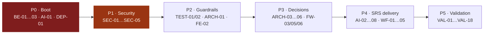

# 00 — Task Index

**Source:** `docs/architecture-review/` (11 documents), validated against `docs/SRS.md`, `docs/SDD.md`, the working tree on `refactor/docker-service` @ `26dad1d`, and the **live Jira backlog** (`citiris.atlassian.net`, project **IR**, 51 issues).

**Method:** every architecture recommendation was filtered before becoming a task. Recommendations that were already implemented, already ticketed, superseded by the SRS, or not actionable without a decision were *not* copied into the backlog.

---

## The filter, applied

| Outcome | Count |
|---|---|
| Recommendations reviewed across 11 review documents | 71 |
| **Genuinely actionable → became tasks** | **58** |
| Already implemented (no task) | 6 |
| Duplicated by existing Jira (→ link/rewrite, not new) | 9 |
| Superseded by the SRS (→ rewrite existing Jira) | 5 |
| Deferred (documented, deliberately not ticketed now) | 12 |
| Requires an architecture decision first | 8 |
| Removed as wrong on re-check | 3 |

---

## The most important finding of this pass

**The Jira backlog contradicts the SRS on the AI stack — and my own architecture review under-claimed this.**

`IR-9`, `IR-15` and `IR-35` specify **Qdrant**, **LangChain** and **Cohere reranking**. The current SRS specifies none of them.

| Technology | SRS mentions | Where |
|---|---|---|
| **pgvector** | **13** in SRS, 5 in SDD | §456: *"eliminating the need for a separate vector database service."* §624: *"There is no separate vector database service or additional network port."* Interface Table §462-478 names `pgvector 0.5+`, `VectorField`, HNSW, and the `<=>` operator |
| Qdrant | 2 | A change-history line and one backup-storage table row. **Not in any FR, NFR or interface spec** |
| LangChain | 1 | A change-history line only, recording that a proposed switch to n8n was rejected |
| Cohere | **0** in SRS, 1 in SDD | Not a requirement anywhere |

So the review's recommendation — pgvector, no Qdrant, no LangChain, no reranker — is **not this review's opinion overriding the team's**; it is what the team's own governing document already says. Those tickets are therefore a **REWRITE**, and the authority cited is the SRS, not this review.

---

## Corrections to my own architecture review

Reading the SRS properly forced four corrections. They are recorded here rather than buried, because tasks were built on them.

| # | What `docs/architecture-review/` says | Correction |
|---|---|---|
| 1 | *"'100 concurrent RAG users' appears in no requirement document"* (04) | **Overstated.** `NFR-P1` does mandate **100 simultaneous authenticated sessions**, validated by a JMeter test. What is unsourced is the extrapolation to 100 *concurrent RAG queries* — a much heavier and different claim. The critique of the extrapolation stands; the claim that the number was invented does not. |
| 2 | *"Defer Docling; PyMuPDF only"* (04, 08) | **Wrong as a target state.** Docling-serve is SRS-specified: FR-M3-01, service table §402, interface Table 18 §481-489. SRS §361 names PyMuPDF and pytesseract as the *fallback* when Docling is unavailable. PyMuPDF-only is a legitimate **interim unblock**, not the destination. Split into `AI-01` (interim) and `AI-02` (SRS target). |
| 3 | *"Delete `apps.ai` entirely"* (02, BLOCK-5) | **Too broad.** The *shadowed* `apps/ai/views.py` and `models.py` implement **FR-M8-03** (embedding index administration: `EmbedAllView`, `EmbeddingJobListView`, `EmbeddingJob`) and FR-M4-01/02. The correct action is to delete the **stub packages** `models/` and `views/` that shadow them, then wire the real modules. Revised into `BE-04`. |
| 4 | The `ai-gateway` service was criticised as premature | **Understated — it contradicts the SRS.** The SRS service table (§393-405) lists nginx, web, celery-worker, celery-worker-rag, celery-beat, docling, db, redis. **No FastAPI gateway.** The single "internal AI gateway" phrase (SRS:1380) denotes a *code-level abstraction* for calling the external AI service, not a network service. The compose file materialised a code abstraction into a container. |

**Two new conflicts surfaced that the review did not cover at all.** Both became tasks:

- **`NFR-P3` requires a 3-second p95 chatbot response.** A synchronous, non-streaming LLM round-trip is 3–10 s. The requirement is probably unachievable as designed → `FW-05`, `VAL-12`, and an architecture decision.
- **`NFR-S2` requires session expiry after 30 minutes of inactivity.** With a 7-day rotating refresh token and silent client-side refresh, inactivity never expires a session → `SEC-08`.

---

## Task groups

| # | Group | Document | Tasks | Blockers |
|---|---|---|---|---|
| 1 | Architecture foundation | [01](01-architecture-tasks.md) | 6 | 1 |
| 2 | Backend | [02](02-backend-tasks.md) | 9 | 2 |
| 3 | Frontend | [03](03-frontend-tasks.md) | 8 | 0 |
| 4 | AI / RAG | [04](04-ai-rag-tasks.md) | 8 | 1 |
| 5 | Security | [05](05-security-tasks.md) | 9 | 5 |
| 6 | Workflow | [06](06-workflow-tasks.md) | 5 | 0 |
| 7 | Deployment | [07](07-deployment-tasks.md) | 6 | 2 |
| 8 | Testing | [08](08-testing-tasks.md) | 5 | 2 |
| 9 | Framework evaluation | [09](09-framework-tasks.md) | 6 | 0 |
| 10 | MVP validation | [10](10-mvp-validation-tasks.md) | 18 | 0 |
| 11 | Documentation | [11](11-documentation-tasks.md) | 6 | 0 |
| — | **Jira actions + full matrix** | [12](12-jira-ready-tasks.md) | — | — |

**Total: 86 task specifications** — 58 implementation, 18 validation, 6 framework decisions, 4 documentation-only.

---

## What was NOT turned into a task, and why

### Already implemented — no task created

| Recommendation / Jira | Evidence it already exists |
|---|---|
| Custom DRF permission classes — **IR-7** | All eleven exist in `core/permissions.py`. Only *application to views* is missing → folded into `SEC-03`, not a new build task |
| Reusable React data table — **IR-39** | `components/shared/DataTable.tsx` (124 lines) wraps `@tanstack/react-table` and includes pagination at `:96-118`. Only sorting and adoption are missing → `FE-05` |
| Unified audit log — **IR-24** | `apps/audit/models.py::AuditEvent` + JSONB metadata, 14 event types. Only immutability and review-decision coverage are missing → `SEC-07`, `WF-03` |
| PDF text cleaning — part of **IR-13** | `documents/tasks.py::_clean_text()` is written and correct |
| Workflow state machine core — part of **IR-41** | `reviews/services.py` has 11 guarded transitions plus `RecordClearance`. Only consolidating the other 7 is needed → `WF-01` |
| JWT rotation, blacklist, session revocation | `settings/base.py` `SIMPLE_JWT`; `ActiveSessionsView` / `RevokeSessionView`. Correct as built |

### Deferred — documented, deliberately not ticketed

Recorded in `docs/architecture-review/` and **not** placed in the backlog: domain-event bus; abstract `ApprovalRequest` model (argued against); approval stamp helper; DRF exception handler; OpenAPI client codegen; `django-storages` S3; Gunicorn `gthread` (until AI ships); migration squashing; httpOnly refresh cookies; full WCAG 2.1 AA audit; `date-fns` removal; merging `storage` with `documents` (argued against).

### Removed — wrong on re-check

| Claim | Why removed |
|---|---|
| *"`documents/services/pdf_extractor.py` is dead code"* (prior review, defect 3) | No such file or directory exists on this branch |
| *"The five `pass` models were migrated into empty tables"* (prior review, removals) | `apps/ai/` has **no `migrations/` package**; nothing was ever migrated |
| *"Delete `apps.ai`"* (this review, BLOCK-5) | Would delete the FR-M8-03 implementation. Narrowed to the stub packages only |

---

## Existing Jira: required actions

Full per-issue rewrite text in [12-jira-ready-tasks.md](12-jira-ready-tasks.md).

| Action | Count | Issues |
|---|---|---|
| **REWRITE EXISTING JIRA TASK** | 8 | IR-4, IR-7, IR-9, IR-12, IR-15, IR-35, IR-39, IR-41 |
| **REMOVE/DEFER EXISTING JIRA TASK** | 4 | IR-18, IR-25, IR-48, IR-49 |
| **ARCHITECTURE DECISION REQUIRED** | 8 | ARCH-03…ARCH-06, FW-03, FW-05, FW-06, NFR-P3 conflict |
| **Status is demonstrably wrong** | 5 | IR-2, IR-3, IR-4, IR-7, IR-12 |
| **Close as delivered by this work** | 2 | IR-50, IR-51 |
| **No Jira coverage whatsoever** | — | All 5 boot blockers · every security defect · all testing · all CI/CD · all deployment hardening · all MVP validation |

> **The most consequential backlog gap:** Jira holds 51 issues and **not one** covers testing, CI/CD, or any of the five defects that stop IRIS running. That is why `TEST-01`, `TEST-02` and `ARCH-01` are rated Critical.

---

## Priority sequence

**P0 + P1 ≈ 5 working days**, and they take IRIS from *"does not start and serves every uploaded document anonymously"* to *"starts and enforces access."* Everything downstream depends on that.

---

## How to read a task

Every task carries the full requested template: Objective · Problem · Current State (real file references) · Proposed State · Scope · Out of Scope · Technical Approach · Dependencies · Risks · Security Impact · Performance Impact · Deployment Impact · Framework Impact · MVP Classification · Acceptance Criteria · Definition of Done · Complexity · Suggested Jira Type · Suggested Priority · Suggested Labels.

**Traceability:** tasks cite SRS `FR-` / `NFR-` identifiers where one governs, and the originating `docs/architecture-review/` finding ID (e.g. `SEC-1`, `BE-4`, `AI-3`).

**Complexity scale:** XS (<1 h) · S (<1 d) · M (1–3 d) · L (3–5 d) · XL (>5 d).
