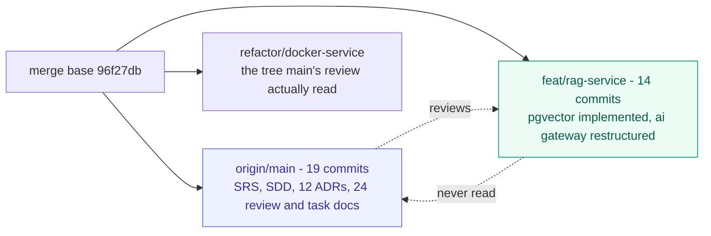

# Architecture Documentation Reconciliation — `main` vs `feat/rag-service`

**Date:** 2026-09-02
**Branches compared:** `origin/main` (19 commits ahead of merge base) · `feat/rag-service` (14 ahead)
**Merge base:** `96f27db`
**Verdict in one line:** both document sets are internally sound, they describe **different repository states**, and `main`'s ADRs are newer and governing — which means several proposals on this branch are already superseded.

---

## Table of contents

1. [The headline](#1-the-headline)
2. [Three repository states, not two](#2-three-repository-states-not-two)
3. [Provenance and chronology](#3-provenance-and-chronology)
4. [Where the two agree](#4-where-the-two-agree)
5. [Where they genuinely conflict](#5-where-they-genuinely-conflict)
6. [Where `main`'s review is stale about this branch](#6-where-mains-review-is-stale-about-this-branch)
7. [The contradiction this branch shipped](#7-the-contradiction-this-branch-shipped)
8. [What governs, and what to do](#8-what-governs-and-what-to-do)

---

## 1 · The headline

The two branches carry **completely disjoint documentation**. Of roughly 45 documents across both, exactly one filename appears on both sides — `docs/README.md` — and its contents differ entirely.

| | `origin/main` | `feat/rag-service` |
|---|---|---|
| Requirements authority | `docs/SRS.md`, `docs/SDD.md` | `docs/software-requirements/M01-M08`, `docs/software-design/M01-M08` |
| Decisions | `docs/adr/001`–`012` | *(none)* |
| Architecture review | `docs/architecture-review/00`–`10` (11 docs, ~3,600 lines) | `docs/backend_frontend_architecture_review.md`, `architecture_review_and_aws_roadmap.md` |
| RAG design | ADR-006, ADR-007, ADR-008, `04-ai-rag-architecture.md` | `rag_third_party_services_architecture.md`, `chunker_architecture.md`, `rag_pipeline_service_map.md` |
| Task breakdown | `docs/architecture-tasks/00`–`12` (13 docs) | *(none)* |
| Process | `docs/engineering/{SDLC,DEVELOPMENT,WORK_ITEM_LIFECYCLE}.md` | `docs/{SDLC_PROCESS,DEVELOPMENT_GUIDE,TEST_PLAN,SECURITY,…}.md` |

This is not a merge conflict waiting to happen. It is **two parallel documentation systems**, each with its own requirements authority, each claiming to describe the same product.

And they are not symmetric. `main` holds the ADRs, and `main`'s `docs/architecture-review/00-review-summary.md` is explicitly **a review of this branch's `backend_frontend_architecture_review.md`** — it confirms seven of that document's nine defects and ten of its fifteen candidates. So `main` has read this branch's work. **This branch has never read `main`'s.**

---

## 2 · Three repository states, not two

The reviews make factual claims about the same paths and reach opposite conclusions. Both are right, because there are three trees.

| Path | `main` | `refactor/docker-service` | `feat/rag-service` |
|---|---|---|---|
| `ai/main.py` | ✅ | ❌ | ✅ |
| `backend/apps/ai/migrations/0001_initial.py` | ❌ | ❌ | **✅** |
| `backend/apps/ai/models/embedding.py` | ❌ | ❌ | **✅** |
| `backend/apps/ai/models.py` | ✅ | ✅ | ❌ |
| `backend/apps/documents/services/pdf_extractor.py` | ❌ | ❌ | **✅** |
| `backend/apps/documents/services/__init__.py` | ❌ | ❌ | ❌ |
| `docs/adr/` | ✅ | ❌ | ❌ |
| `docs/SRS.md` | ✅ | ❌ | ❌ |



The asymmetry is worth stating plainly: **`main` holds the decisions, `feat/rag-service` holds the implementation.** `feat/rag-service` is the only branch where pgvector is actually implemented — `models/embedding.py` declares a real `VectorField(dimensions=...)` with an `HnswIndex` on `vector_cosine_ops`, and migrations `0001`/`0002` create it. `main` and `refactor/docker-service` still carry the old `models.py` with `BinaryField` and pickle.

---

## 3 · Provenance and chronology

The dates decide most of the disagreements.

| Date | Artefact | Branch |
|---|---|---|
| 2026-08-31 | `backend_frontend_architecture_review.md`, `rag_third_party_services_architecture.md`, `chunker_architecture.md` | `feat/rag-service` |
| 2026-08-31 | `architecture-review/00`–`10`, reviewing `refactor/docker-service @ ddcc54c` | `main` |
| **2026-09-01** | **ADR-001 through ADR-011 accepted** | `main` |
| **2026-09-02** | **ADR-012 accepted** | `main` |

Two consequences:

**The ADRs are newer than every document on this branch.** ADR-006, ADR-007, ADR-008 and ADR-012 postdate the RAG and chunker documents by one to two days. They were written with knowledge of this branch's proposals; the reverse is not true.

**`main`'s own review documents are stale relative to `main`'s own tree.** `04-ai-rag-architecture.md` states, as a directory listing, that `ai/` does not exist:

> ```
> $ ls ./ai
> ls: cannot access './ai': No such file or directory
> ```

That was true of `refactor/docker-service @ ddcc54c`, the tree it read. It is **not** true of `main` today — `ai/main.py` is present there. ADR-012 (2026-09-02) is the correction: it audits the gateway that now exists and rules on it. So within `main`, the ADRs supersede the review documents where they disagree, which is exactly what CLAUDE.md's source-of-truth hierarchy prescribes.

---

## 4 · Where the two agree

More than the conflict section might suggest. These are settled and need no further debate.

| Question | Both sides |
|---|---|
| **Vector store** | pgvector inside the existing PostgreSQL. `main` ADR-007 rejects Qdrant/Pinecone/Weaviate/FAISS; this branch's `rag_third_party_services_architecture.md` §2 independently reaches "stay on pgvector" and rejects Pinecone on the same hybrid-search-and-sync grounds. |
| **Degradation** | AI failure falls back to Postgres FTS, never a fabricated answer. `main` ADR-008; this branch's prerequisite P6. Same mechanism, same reasoning. |
| **Retrieval must respect record visibility** | `main` ADR-006 calls this *"the single most important detail in the RAG work"*; this branch's P7 `DisclosurePolicy` and the two-stage access filter in `chunker_architecture.md` §8. |
| **Docker service count** | Both say cut it. `main`'s summary: *"return to five services for the MVP."* This branch's answer on the same question, reached independently: 10 → 5–6. |
| **No orchestration framework** | `main` ADR-006 rejects LangChain on a deletion test; this branch's services document excludes LangChain and LlamaIndex as *"frameworks, not services."* Same argument, same conclusion. |
| **Tests are the real blocker** | `main` escalates X2 to MVP BLOCKER; this branch's X2 says the same. |
| **`pickle` must go** | ADR-007. Already done on this branch — `models/embedding.py` uses `VectorField`. |

`main`'s validation document confirms seven of this branch's nine defects outright and ten of fifteen candidates, raising the priority on B2 and escalating B3 to a security defect. **The backend/frontend review holds up.** The disagreements below are narrower than the volume of text implies.

---

## 5 · Where they genuinely conflict

Four real conflicts. In each, `main`'s ADR is the newer artefact.

### 5.1 · Chunking — ADR-006 excludes it; this branch designed 827 lines of it

**ADR-006** (Accepted 2026-09-01) is explicit:

> **Excluded from the MVP:** full-text chunking (embed title and abstract only) · conversational memory and history · summarization · reranking · agents · multiple LLM providers · any AI microservice.
>
> **Full-text chunking in the MVP.** Rejected for now. Chunking plus per-chunk embedding roughly doubles the RAG cost in both dev-days and API spend. Abstracts are dense, human-written summaries — for a corpus this size they retrieve well. **Deferred, not abandoned.**

`chunker_architecture.md` on this branch opens by treating abstract-only embedding as the defect to be fixed:

> *"All retrieval today runs over title-plus-abstract strings… Docling extraction works, embedding works, and there is nothing in between."*

**These are the same observation with opposite verdicts.** ADR-006 knows retrieval is abstract-only and calls it an acceptable MVP bound inside a 3-dev-day timebox. The chunker document calls it the missing link and specifies a design scaled to a thousand concurrent users.

**ADR-006 wins on process** — it is the newer, ratified decision, and RAG is explicitly not the thesis contribution. But the chunker document is not wasted: ADR-006 says *"deferred, not abandoned,"* and the design is what "un-defer" looks like. It should be **reclassified as Phase 2**, not deleted.

One substantive note for whoever revisits ADR-006: its rationale — *"abstracts are dense, human-written summaries, for a corpus this size they retrieve well"* — is an untested prior, and ADR-011's evaluation framework is the instrument that could test it. If a methodology question fails against abstract-only retrieval in the pilot, that is the trigger to reopen.

### 5.2 · Reranking — ADR-006 rejects it; this branch recommends Voyage rerank

ADR-006 rejects Cohere reranking on two grounds: zero SRS mentions, and *"a third vendor and a second external call for marginal gain on a corpus of hundreds of documents."*

This branch's services document calls reranking *"the highest quality-per-peso purchase in this entire document,"* and the decision recorded two turns ago moved it to Voyage for vendor consolidation.

The disagreement is partly about corpus size. ADR-006 says hundreds of documents; the chunker document assumes ~3,000 documents at ~40 chunks each. **At abstract-only granularity ADR-006 is right** — reranking 100 abstracts adds little. At chunk granularity the calculus changes, which means this conflict is downstream of 5.1 and resolves with it.

### 5.3 · The `ai/` gateway — ADR-012 rejects the service; this branch just restructured it

**ADR-012** (Accepted 2026-09-02 — the newest artefact in either branch):

> **The AI provider abstraction is adopted. The separate service is not.**
>
> 1. `ai-gateway` is **not** deployed as a container. The five-service topology of ADR-010 stands.
> 2. The **ports-and-adapters design is kept** and ported into Django as `apps/ai/providers/`.

Commit `63b240b` on this branch — pushed today — restructured `ai/` into exactly that ports-and-adapters shape: `domain/ports.py`, `infrastructure/{openai,local}_adapter.py`, `api/`.

**This is less of a conflict than it looks.** ADR-012 explicitly adopts the design and rejects only the deployment:

> *"The adapters port over nearly unchanged."*

So `63b240b` produced the right artefact in the wrong location. The work transfers: `ai/domain/ports.py` becomes `apps/ai/providers/ports.py`, the two adapters move alongside, and `ai/infrastructure/dependencies.py` becomes the Django-side factory. What does not transfer is the FastAPI routing layer and the container.

ADR-012's reasoning is worth taking seriously rather than re-arguing. It rejects the gateway because the code as built has **no authentication**, permissive CORS, and `asyncpg` implying a second data path around Django's permission layer — *"a second place for the ADR-009 defects to recur,"* immediately after twelve dev-days spent fixing those defects the first time. Every one of those observations is verifiable in this branch's tree.

### 5.4 · Third-party AI vendors — ADR-007 rejects them on data governance

ADR-007 rejects Pinecone partly because *"research abstracts would leave campus — which conflicts with the unresolved data-governance question and with SRS §456's on-premise requirement."*

That objection is not specific to vector stores. It applies with equal force to **Voyage embeddings, Voyage rerank, Groq and OpenRouter** — every vendor this branch's services document recommends. The document does address it, in prerequisite P7 (`DisclosurePolicy`), and concludes the policy should gate outbound calls. But it treats the governance question as *solvable by a module*, where ADR-007 treats it as *unresolved and blocking*.

**This one needs a human decision, not a document.** It is the same question in both places: may pre-publication IP disclosures leave campus for a commercial API, and who signs off? Until that is answered, the entire third-party services document is contingent.

---

## 6 · Where `main`'s review is stale about this branch

Stated in fairness, and because two of its rejections would otherwise wrongly close real defects.

**`main` rejects the `documents/services/` finding.** Its validation document says:

> *"The claim that `documents/` has a `services/` directory without `__init__.py`… is **false on this branch**."*

Correct for `refactor/docker-service`. **Wrong for `feat/rag-service`**, where `backend/apps/documents/services/pdf_extractor.py` exists, `backend/apps/documents/services.py` also exists, and `services/__init__.py` does not — on any branch. The shadowing hazard is real here. The defect should be reopened against this branch.

**`main` rejects the `apps/ai` migrations claim.** Its validation document says *"There is no `apps/ai/migrations/` package; nothing was migrated."* True of `refactor/docker-service` and of `main`. **False of `feat/rag-service`**, which has `migrations/0001_initial.py` and `0002_embeddingjob_recordembedding.py`. This matters beyond bookkeeping: ADR-007 lists *"`RecordEmbedding.embedding` becomes a `VectorField` with an HNSW index created in a migration"* as ~1.5 dev-days of MVP-required work. **That work is already done on this branch.** ADR-007's status line should say so.

**`main`'s blocker 2** — *"`ai/` directory referenced by both compose files does not exist"* — is resolved on both `main` and this branch. ADR-012 supersedes it.

**`main`'s blocker 5** — *"`apps.ai` installed with no `migrations/` package"* — is resolved on this branch only.

---

## 7 · The contradiction this branch shipped

Commit `6a76d27` added `CLAUDE.md` to `feat/rag-service`. That file is written from `main`'s world, and it directly forbids what the same branch's architecture documents propose:

| `CLAUDE.md` says | This branch contains |
|---|---|
| *"**Do not build on `ai/`**"* | `chunker_architecture.md`, built throughout on the `ai/` gateway; commit `63b240b` restructuring it |
| *"**pgvector** — **Not yet implemented.** ADR-007 selects it; the service classes are `pass` bodies"* | `models/embedding.py` with a real `VectorField` + `HnswIndex`, plus migrations |
| *"**Docling** — **Not implemented.** SRS-specified, deferred by ADR-006"* | `docker-compose.yml` running a 4 GB `docling` service |
| *"Baseline branch: **`refactor/docker-service`.** Not `main`. All work starts here"* | 14 commits of work on `feat/rag-service` |
| Source-of-truth hierarchy naming `docs/SRS.md`, `docs/SDD.md`, `docs/adr/`, `docs/engineering/` | **None of those paths exist on this branch** |

`CLAUDE.md` describes `refactor/docker-service` as reviewed by `main`, and cites ADRs that are not present here. Committing it alongside `chunker_architecture.md` put a file that says *"do not build on `ai/`"* next to 827 lines of design that builds on `ai/`.

That was my error, and it is the cheapest thing in this document to fix. The file is either wrong for this branch or the branch is wrong for the file, and both readings point at the same root cause: **this branch has no access to the decisions that govern it.**

---

## 8 · What governs, and what to do

### The hierarchy is not in dispute

`CLAUDE.md` — now present on this branch — states it: **SRS → SDD → ADR → engineering → code → Jira**, and *"when these conflict, the higher one wins and the lower one is corrected."*

Every document on `feat/rag-service` sits at level 5 or below. `main` holds levels 1 through 4. **`main`'s ADRs govern.** That is not a judgement about which analysis is better; it is the hierarchy this branch's own committed instructions specify.

### Six actions

| # | Action | Why |
|---|---|---|
| **1** | **Merge `main` into `feat/rag-service`**, or rebase onto it | This branch is working without the SRS, SDD, or any ADR. Nothing else on this list is safe until it can see them. |
| **2** | Reclassify `chunker_architecture.md` and `rag_third_party_services_architecture.md` as **Phase 2 / deferred**, with a header pointing at ADR-006 | ADR-006 defers chunking and reranking. The designs stay; their status changes from "proposed" to "what un-deferring looks like." |
| **3** | Port `ai/domain/ports.py` and the two adapters to `apps/ai/providers/`, per ADR-012 §2 | The design is adopted; only the container is rejected. `63b240b` did the right refactor in the wrong place. |
| **4** | Update ADR-007's status: the pgvector migration it schedules as ~1.5 MVP dev-days **exists on this branch** | Prevents the work being done twice, and closes `main`'s blocker 5. |
| **5** | Reopen the `documents/services/` shadowing defect against this branch | `main` rejected it correctly for a different tree. It is live here. |
| **6** | Escalate the data-governance question to a human decision | ADR-007 calls it unresolved; the entire third-party vendor recommendation is contingent on it. Not a documentation problem. |

### The one that matters

**Action 1.** Everything else is a consequence of it.

Two capable analyses ran in parallel for two days against the same product, reached compatible conclusions on the questions they shared, and conflicted on four — every conflict traceable to one side not being able to read the other's tree. The chunker document is 827 lines of design against a constraint ADR-006 had already settled the day before it would have mattered.

That cost is not a documentation-hygiene problem. It is the predictable result of **two requirements authorities on two branches**, and it will recur on the next question unless the branches are joined.

---

*Every claim about file existence was verified with `git cat-file -e` against `origin/main`, `refactor/docker-service`, and `feat/rag-service` on 2026-09-02. Document dates are as stated in each document's own header. Line counts are `git show <ref>:<path> | wc -l`.*
