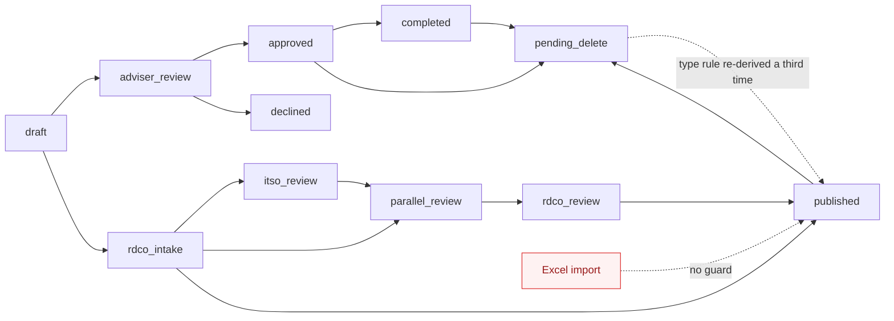
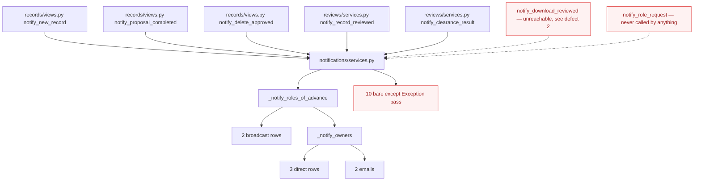
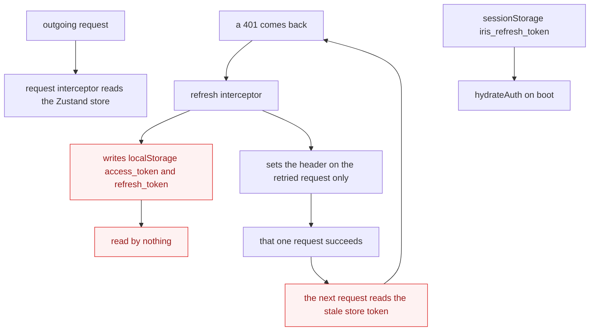
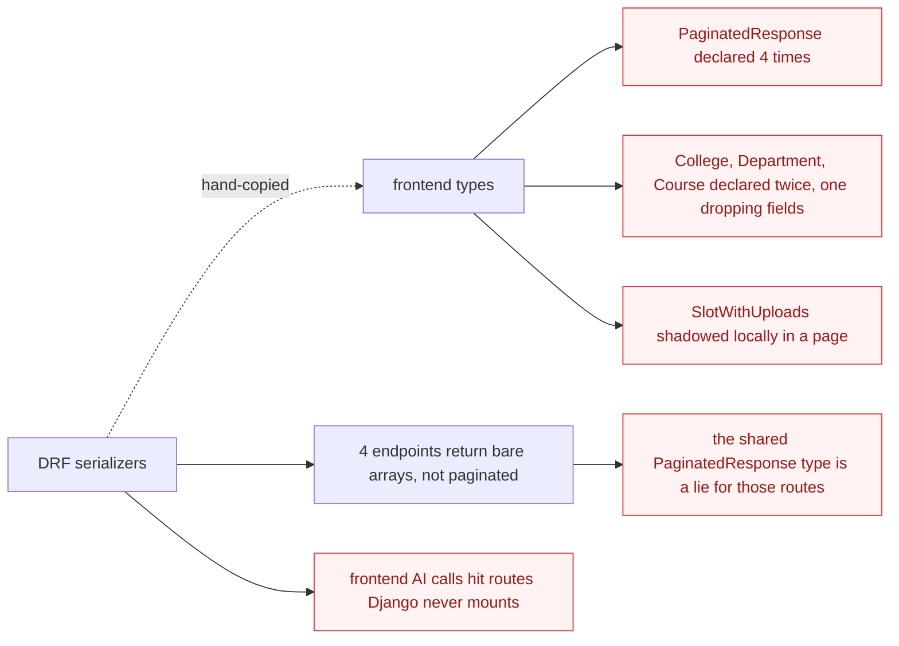
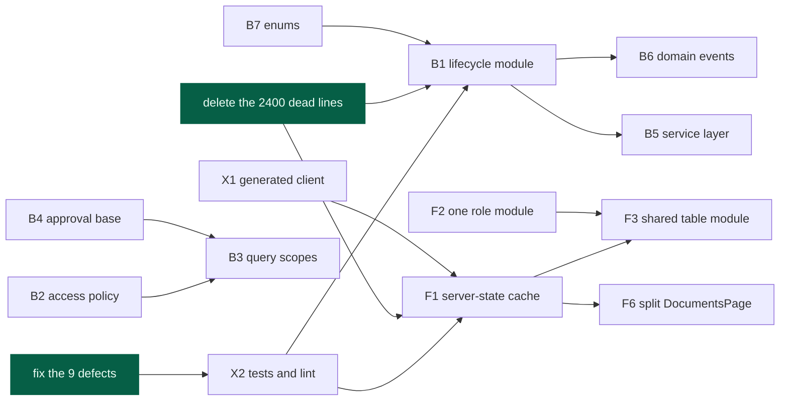

# Backend & Frontend Architecture Review

**Date:** 2026-08-31
**Scope:** `backend/` (6,371 lines of non-migration Python) and `frontend/src/` (11,181 lines across 128 files)
**Companion document:** [Architecture Review & AWS Roadmap](architecture_review_and_aws_roadmap.md) — covers the `ai/` gateway, the RAG pipeline, and the production AWS path. This document covers everything else, and revises the hosting recommendation for capstone scale.

Churn over the last 80 commits: `frontend/src` accounts for 281 file-touches, all backend apps combined roughly 200. `features/records`, `features/auth` and `components/layout` are the hot spots, so the frontend candidates are weighted accordingly.

**Vocabulary.** This review uses the deep-module vocabulary throughout: *module*, *interface*, *implementation*, *depth*, *deep*, *shallow*, *seam*, *adapter*, *leverage*, *locality*. A candidate passes the **deletion test** when removing the thing concentrates complexity rather than relocating it.

---

## Table of contents

1. [Defects — nine things that are actually broken](#1-defects--nine-things-that-are-actually-broken)
2. [Backend candidates (B1–B7)](#2-backend-candidates)
3. [Frontend candidates (F1–F6)](#3-frontend-candidates)
4. [Cross-cutting candidates (X1–X2)](#4-cross-cutting-candidates)
5. [Removals](#5-removals)
6. [Hosting alternatives](#6-hosting--cheaper-than-the-aws-plan)
7. [Sequencing](#7-sequencing)
8. [Top recommendation](#8-top-recommendation)

---

## 1. Defects — nine things that are actually broken

These are not design opinions. They are defects confirmed by reading the code, and they exist because there is no test, no working lint, and no typecheck step to catch them. Fix these before refactoring — a refactor on top of them will just relocate them.

### 1. Five undefined names in `records/views.py` — guaranteed `NameError`

`timezone` (:536), `make_download_token` (:542), `settings` (:547), `verify_download_token` (:564) and `file_response_for_record` (:580) are used but never imported. `records/download_tokens.py` and `records/download_service.py` define them and are imported by nothing.

### 2. `approve` and `decline` are indented into the wrong class

`records/views.py:589-630` — `get_permissions`, `perform_create`, `approve` and `decline` sit inside `DownloadRedeemView` instead of `DownloadRequestViewSet`. This breaks three endpoints the frontend actively calls (`frontend/src/api/records.ts:53,55,69`) and makes `notify_download_request` / `notify_download_reviewed` unreachable. `get_permissions` referencing `self.action` also breaks `GET /api/v1/records/download/`, which `APIView` cannot serve.

### 3. `apps/ai/views/` package shadows `apps/ai/views.py`

The 54-line `views.py` is unreachable, and it imports `from .serializers import ...` — a module that does not exist. The same shape appears in `documents/`: `services/` has no `__init__.py`, so `services.py` wins and `services/pdf_extractor.py` is dead (and imports `opendataloader_pdf`, which is not in `requirements/base.txt`).

### 4. `apps.ai` is installed but never routed — every AI call from the frontend 404s

`config/urls.py` has no `include("apps.ai.urls")`. The frontend posts to `/api/v1/ai/ask/` on the Django origin; the gateway serves `/api/v1/ai/ask` on port 8001, with a different request body (`{question, history}` vs `request.query`) and a different response shape (`{answer, citations, message}` vs `{query, answer, sources}`). `VITE_AI_API_BASE_URL`, the variable that would point at the gateway, is read by nothing in `src/`.

### 5. `storage/views.py` has no ownership check on any endpoint

Every folder and file endpoint is bare `IsAuthenticated`. Any authenticated user can delete any other user's folder (`storage/views.py:59-63`). `core.permissions.IsOwnerOrStaff` already exists and is not used here.

### 6. The token refresh interceptor writes to storage nothing reads

`api/client.ts:29-30` writes the refreshed token to `localStorage`, but the app reads the access token from the Zustand store and persists the refresh token to `sessionStorage["iris_refresh_token"]`. The interceptor never calls `setTokens`, so the retried request succeeds and every request after it still sends the stale token. `authStorage.ts:18` calls these "legacy keys from older screens" while `client.ts` is actively writing them.

### 7. `npm run lint` cannot run

ESLint 9 is installed and requires flat config; there is no `eslint.config.js`, no `.eslintrc*`, and no `eslintConfig` key. There is also no `test` script and no `typecheck` script — types are only checked as a side effect of `build`.

### 8. `get_uploaded_by_name` falls back to a field that does not exist

`documents/serializers.py:40-43` falls back to `obj.uploaded_by.username`, but the user model sets `USERNAME_FIELD = "email"` and has no `username` field. The near-identical serializer 36 lines below gets it right.

### 9. `build_zip` uses `f.file.path`

`core/utils.py:21` — this raises under any non-filesystem storage backend, and `django-storages[s3]` is already in `requirements/base.txt`. It will break the moment media moves off local disk.

> Two claims above rest on CPython import precedence and DRF's late handler lookup rather than on an executed run. The shadowing and the missing handlers are certain; the exact failure timing was not executed.

---

## 2. Backend candidates

### B1 · The record lifecycle is the core domain concept and it has no module

**Strength:** Strong · **Category:** in-process · **Pattern:** State pattern, explicit transition table

**Files:** `records/models.py:61-77` · `reviews/services.py:55-72,183-201` · `records/views.py:77,84-91,116-141,242-256,334,689-694` · `records/services.py:33`

**Problem.** Twelve places assign `pipeline_status`. The rule "a Proposal goes to `adviser_review`, everything else to `rdco_intake`" is written three separate times (`reviews/services.py:151-153`, `records/views.py:130-138`, `records/views.py:692-693`). There is no transition table, no `can_transition()` predicate, and no single enumeration of legal edges — so a reviewer cannot answer "what can happen to this record next?" without reading three files.

The split is uneven, which makes it worse: `reviews/services.py` holds 11 guarded transitions that raise `InvalidPipelineTransition`, while 7 more sites elsewhere are guarded only by hand-written HTTP 400s, or not at all. The Excel importer jumps straight to `published`, bypassing the entire review pipeline.

**The transition graph as it exists today** — reconstructed by reading twelve assignment sites, because it is written down nowhere:



**Solution.** One `RecordLifecycle` module owning a declarative transition table — `(from_status, event, role) → to_status` — with every write routed through `apply(record, event, actor)`. Views stop knowing status strings entirely; they name events. The Excel importer becomes a caller like any other.

**Wins**

- Locality: the whole lifecycle becomes one readable table
- The interface is the test surface — transitions become a table-driven test, no HTTP needed
- Leverage: one guard, every caller, including future ones
- Deletion test passes: removing it concentrates complexity, it does not move it

> **ADR worth writing.** SRS Modules 5 and 7 are marked draft, so the transition table will change — which is exactly why it should be data in one place rather than branches in twelve.

---

### B2 · Access rules are copy-pasted, and the module that owns them is bypassed

**Strength:** Strong · **Category:** security · **Pattern:** Policy object, Strategy

**Files:** `core/permissions.py` · `documents/views.py:220-379` · `reviews/views.py:58,143,183-192` · `reviews/services.py:87,113` · `storage/views.py`

**Problem.** The seam exists and is not used.

| Declared in `core/permissions.py` | Status |
|---|---|
| `IsAdmin`, `IsStaff`, `IsRDCO`, `IsReviewer` | used properly |
| `IsOwnerOrStaff` | exists, but bypassed by hand-written copies five times |
| `IsStudent`, `IsAdviser`, `IsKTTO`, `IsITSO`, `IsIERC` | never referenced anywhere |

The bypass, repeated verbatim at `documents/views.py:226`, `:302`, `:336`, `:378`:

```python
is_owner = record.owners.filter(user=request.user).exists()
is_staff_user = get_role_name(request.user) in STAFF_ROLES or request.user.is_staff
if not (is_owner or is_staff_user):
    return Response({"detail": "Permission denied."}, status=status.HTTP_403_FORBIDDEN)
```

…plus a fifth, differently-spelled variant at `reviews/views.py:183-192` that reads `request.user.role.name` directly instead of calling `get_role_name()`.

`core/exceptions.py` tells the same story: five exceptions declared, one used. `NotRecordOwner` is re-implemented as five hand-written 403s; `RecordNotFound` as nine hand-written 404s. The role-name lookup `user.role.name if user.role else ""` is re-implemented four more times. Meanwhile `storage/views.py` has no ownership check at all — defect 5 above.

**Solution.** Route every access decision through `core.permissions`; delete the five never-referenced classes. Where a check is genuinely richer than a DRF permission class — "may this actor review this record at this stage" — express it as a small Policy object that both the view and the lifecycle module consult.

**Wins**

- Locality: an access-control audit becomes reading one module
- Leverage: one policy, every endpoint, including the ones with none today
- The interface is the test surface — policies test without HTTP

---

### B3 · "Which records can this user see?" is answered by copy-paste, six times

**Strength:** Strong · **Pattern:** Repository via custom QuerySet, Specification

**Files:** `records/views.py:54,84,267,483` · `records/views_dashboard.py:18-47` · `documents/views.py:227,303,337,379` · `reviews/views.py:184`

**Problem.**

| Expression | Copies |
|---|---|
| `("published", "approved", "completed")` | **6** |
| `Record.objects.filter(owners__user=…)` | **4** |
| `record.owners.filter(user=request.user).exists()` | **5** |
| `if dr.status != "pending": return 400 …` + the same 4-line review stamp | **5** |

The dashboard carries a *seventh*, different list for "in pipeline" (`views_dashboard.py:21`). Add a status and you must find all of them; miss one and the bug is a silent visibility leak, not a crash.

**Solution.** A custom `QuerySet` on `Record` exposing named scopes — `Record.objects.visible_to(user)`, `.owned_by(user)`, `.in_pipeline()` — plus a small `ApprovalRequest` helper for the pending-guard-and-stamp block that repeats five times in one file.

**Wins**

- Locality: visibility rules concentrate in one module
- Leverage: one scope, every view, dashboard and export
- Reads as domain language at the call site

---

### B4 · Three request-and-approve flows modelled three times

**Strength:** Strong · **Pattern:** Abstract base model, Template Method

**Files:** `records/models.py:227-252` · `records/serializers.py:132-169` · `accounts/models.py:113-117` · `documents/models.py:52-68` · `reviews/models.py:4-40`

**Problem.** `DownloadRequest` and `DeleteRequest` share six identical fields (`record`, `requested_by`, `status`, `reviewed_by`, `reviewed_at`, `created_at`); `DeleteRequest` adds only `reason` and `previous_pipeline_status`. `RoleRequest` declares the same pending/approved/declined triple a third time.

`DownloadRequestSerializer` and `DeleteRequestSerializer` are byte-for-byte identical apart from the model and one field, down to the same `get_requested_by_name` body.

Two competing modelling strategies also exist for "someone set a status with a comment": `Review.STATUS_CHOICES` is a hardcoded triple, while `UploadReview.status` is an FK to a lookup table.

**Solution.** One abstract `ApprovalRequest` base carrying the shared fields and the `approve()` / `decline()` template method, with subclasses supplying only what differs. Pick one strategy for status — enum or lookup table — and apply it everywhere.

**Wins**

- Interface shrinks; the shared behaviour moves into one implementation
- Locality: approval semantics live in one module
- Roughly 120 lines of models, serializers and views deleted

---

### B5 · Views are where the business logic went

**Strength:** Strong · **Pattern:** Service layer, Facade

**Files:** `records/views.py:274-356,358-472,160-228` · `documents/views.py:152-184` · `accounts/views.py:144-186` · `reviews/views.py:234-286`

**Problem.** Cross-section of `records/views.py` (696 lines):

| Method | Lines | What it actually is |
|---|---|---|
| `download_template` | 115 | openpyxl header styling, colours, column widths — six lines of HTTP at the end |
| `import_excel` | 82 | four model writes per row inside a per-row `except Exception`; force-sets `published` |
| `tags` | 68 | hand-rolled field whitelists that restate `Record.IP_TYPE_CHOICES` |
| `submit` | 54 | a state transition guarded by a hand-written 400 |

None of this is reachable from a test without going through HTTP. Other instances: `UploadReviewCreateView.post` (`documents/views.py:152-184`) does a two-model write with status mirroring and no service function; `ChangeUserRoleView.patch` (`accounts/views.py:144-186`) composes an email inline despite `accounts/services.py:42-65` already doing exactly that; `RecordAuthPinViewSet.generate` (`reviews/views.py:234-286`) puts PIN issuance in a view while every other transition lives in `reviews/services.py`.

The good pattern already exists in this codebase — `reviews/views.py:126-161` is thin and delegates correctly.

**Solution.** Extend the existing pattern: a `records/importing.py` module and a `records/reporting.py` module, with validation moved into serializers where DRF already wants it.

**Wins**

- The interface is the test surface — import and export test without a request
- Locality: spreadsheet knowledge stops being spread through a view file
- Excel import stops being a back door around the lifecycle

---

### B6 · Notifications fan out from everywhere, and every failure is swallowed

**Strength:** Worth exploring · **Pattern:** Domain events, Observer

**Files:** `notifications/services.py` (736 lines) · `records/views.py:144,258,668,695` · `reviews/services.py:205-406` · `audit/services.py:44-46`

**Problem.**



Notification calls are scattered between views and services with no single dispatcher, so nothing can answer "what happens when a record is approved?" without a grep. A three-owner record advancing one stage produces 2 broadcast rows, 3 direct rows and 2 emails.

Ten bare `except Exception: pass` blocks in `notifications/services.py`, plus one in `create_audit_event` and one in `core/utils.py`, mean a missing `NotificationType` row fails invisibly — and `_get_type` uses `.get()`, so a typo in a type name is undetectable. Separately, the same account-unlock produces the same `ACCOUNT_UNLOCKED` audit event from two different endpoints (`accounts/views.py:203` and `:249`), and `"ACCESS"` is overloaded to mean tag edits (`records/views.py:223`).

**Solution.** The lifecycle module from B1 emits domain events; notification and audit subscribe. One place decides that approving a record notifies owners once. Keep the swallowing at the subscriber, but log it instead of discarding it.

**Wins**

- Locality: the answer to "what happens on approval" is one list
- Adding a channel stops meaning editing every call site
- Silent failures become observable without changing behaviour

---

### B7 · The same three-element set is spelled five different ways

**Strength:** Strong · **Pattern:** Enum as single source of truth

**Files:** `reviews/models.py:56-60` · `reviews/services.py:68-72,381` · `notifications/services.py:264-268,416`

**Problem.** Five encodings of `{ITSO, IERC, KTTO}`:

| Encoding | Location |
|---|---|
| `RecordClearance.OFFICE_CHOICES` | `reviews/models.py:56` |
| `ROLE_TO_OFFICE` | `reviews/services.py:68` |
| `CLEARANCE_OFFICES` | `reviews/services.py:381` |
| `_OFFICE_TO_ROLE` | `notifications/services.py:416` |
| `_OFFICE_LABELS` | `notifications/services.py:264` |

Add a fourth clearance office and four of these five must be found and edited. Missing one produces silence, not an error — every notification path swallows exceptions.

This is the general pattern, not an isolated case:

- Pipeline statuses appear as literals across eight files
- IP types are declared twice (`Record.IP_TYPE_CHOICES` and `VALID_IP_TYPES` at `records/views.py:180`)
- The queued/running/done/failed triple is declared identically on `PdfExtraction` and `EmbeddingJob`
- "Who reviews what" is encoded twice, independently, in `reviews/views.py:61-67` and `reviews/services.py:89-93`

**Solution.** One `TextChoices` enum per concept, carrying its label and its role mapping as members. Cheapest candidate here by effort, and it removes a class of bug that fails silently.

**Wins**

- Leverage: one enum, every consumer
- Adding an office becomes a one-line change
- Typos become import errors instead of silent no-ops

---

## 3. Frontend candidates

### F1 · Server state is hand-rolled in 28 components

**Strength:** Strong · **Pattern:** Server-state cache, Repository hook

**Files:** 28 feature components · `store/notifications.store.ts` · `features/records/PublishedRecordsPage.tsx:65-72`

**Problem.** There is no module that owns "fetching a thing from the server." Caching, deduplication, retry, invalidation-after-mutation and error handling are re-decided in every page, mostly by omission. TanStack Query is not installed — only `@tanstack/react-table` is.

The bugs this shape produces:

- `PendingRecordsPage.tsx:13` — no `.catch`; a network failure shows an empty list forever
- `PublishedRecordsPage.tsx:69` — `.catch(() => {})`, error discarded
- `PublishedRecordsPage.tsx:71` — `JSON.stringify(filters)` as a dependency plus an `eslint-disable`: a hand-rolled query key
- `notifications.store.ts:25` — `markAllRead` zeroes the count but leaves `items`, so store and server diverge; `markRead` filters the array client-side rather than refetching
- The same loading markup (`p-8 text-center text-gray-400 text-[13px]`) appears in **10 files**, while a `Spinner` component exists and is used in 5
- The same error-shape cast `(err as { response?: { data?: { detail?: string } } })?.response?.data?.detail` is copy-pasted **12 times**; Axios's own `AxiosError` type is never used outside `api/client.ts`

**Solution.** Adopt a server-state cache — TanStack Query is the natural fit — and expose one typed hook per resource in `api/`. Pages consume `useRecords(filters)` and stop owning state at all. `notifications.store.ts` is then deleted rather than fixed.

**Wins**

- Locality: fetch semantics concentrate in one module per resource
- Leverage: one hook, every page that shows that resource
- Roughly 300 lines of hand-rolled state disappear
- The interface is the test surface — hooks mock at one seam

> This is the largest single win in the frontend and the hottest area by churn. It is also the one that most reduces the cost of every other frontend change.

---

### F2 · "Is this user staff?" has four non-equivalent answers

**Strength:** Strong · **Category:** security · **Pattern:** Single source of truth, Policy object

**Files:** `hooks/useRole.ts:11-22` · `store/auth.store.ts:100-102` · `components/auth/ProtectedRoute.tsx:13-26` · `components/layout/Sidebar.tsx:86-98` · `features/documents/DocumentsPage.tsx:291`

**Problem.**

| Where | Definition of staff | Result differs when… |
|---|---|---|
| `hooks/useRole.ts:21` | role in `STAFF_ROLES`, or Django staff | the canonical one |
| `Sidebar.tsx:88-91` | re-derived inline, despite calling `useRole()` at line 80 | drifts the moment either changes |
| `DocumentsPage.tsx:291` | `is_staff \|\| is_superuser` only | a KTTO or RDCO user is *not* staff here |
| `ProtectedRoute.tsx:24` | private local `isDjangoStaff()` | router and page disagree |
| `auth.store.ts:100-102` | dead export, name-collides with the real hook | an import from the wrong module is silent |

And the role strings themselves: `lib/constants.ts` defines `ROLES` and `ALL_ROLES`, then `UserListPage.tsx:196` hardcodes `["Student","Adviser","KTTO","RDCO","ITSO","IERC"]` anyway, `router/index.tsx:76` inlines an array identical to `REVIEWER_ROLES`, `RecordDetailPage.tsx:27-31` compares five literals inside `canReview()`, and `SignupPage.tsx` declares its own `type Role` plus eight literal comparisons.

The sharpest example: `ApprovedProposalsPage.tsx:17` defines `isRDCO = user?.role_name === "RDCO"` with no Django-staff bypass — deliberately or not, it behaves differently from the identically-named check in `Sidebar.tsx:86`.

**Solution.** `useRole()` is the only way to ask. Delete the dead store exports and the private helpers in `ProtectedRoute` and `Sidebar`. Move stage-specific rules like `canReview()` into it so the router and the page cannot disagree. Never compare a role string outside that module.

**Wins**

- Locality: one module answers every access question
- Leverage: role changes propagate everywhere at once
- Removes a name collision that makes wrong imports silent

---

### F3 · Thirteen hand-rolled tables, one shared table module used twice

**Strength:** Strong · **Pattern:** Composition over copy, Headless component

**Files:** `components/shared/DataTable.tsx` (124 lines) · `hooks/useDataTable.ts` (30 lines, **0 importers**) · 13 feature pages

**Problem.** `<table className="w-full text-[13px]">` appears in **13** feature files. `DataTable` — which already includes pagination at lines 105-118 — is used by **2** (`UserListPage`, `AuditLogPage`). `useDataTable`, a purpose-built pagination/search/ordering hook, has zero importers. `PublishedRecordsPage.tsx:285-294` hand-rolls the prev/page/next controls `DataTable` already provides.

Two clusters:

- **Group A — six near-identical list pages.** `PendingRecordsPage`, `ApprovedRecordsPage` and `DeclinedRecordsPage` have character-identical `<thead>` blocks and an identical row link; `MyRecordsPage`, `ApprovedProposalsPage` and `AccessRequestsPage` follow the same shape. `ApprovedRecordsPage.tsx:2` still carries a "TODO: implement" comment for work that is done.
- **Group B — two admin queues.** `DownloadRequestsPage` (204 lines) and `DeleteRequestsPage` (205 lines) share the same `STATUS_STYLES` map verbatim, the same load shape, the same filter tabs and the same refresh button. They diverge by about 40 lines.

**Solution.** One `RecordListPage` module taking a fetcher and a column set, replacing group A outright; one `ApprovalQueuePage` replacing group B. Both build on `DataTable`. Pairs naturally with F1 — the fetcher becomes a query hook.

**Wins**

- Roughly 500 lines of duplicated markup deleted
- Leverage: a table fix lands in 13 pages at once
- Locality: pagination and empty states stop being per-page decisions

---

### F4 · Four form-validation stacks ship in the same bundle

**Strength:** Strong · **Pattern:** One way to do it, Schema as single source

**Files:** `components/auth/LoginForm.tsx` · `features/records/recordFormSchema.ts` · `features/review/EvaluationPage.tsx` · `features/auth/SignupPage.tsx:40-79` · `features/settings/SettingsPage.tsx:22-32`

**Problem.**

| Stack | Used by | Verdict |
|---|---|---|
| Formik + Yup | `LoginForm` only | remove |
| **react-hook-form + Zod** | Add / Edit record, `recordFormSchema.ts` | **keep** |
| react-hook-form, no resolver | `EvaluationPage` | migrate |
| hand-rolled | `SignupPage`, `SettingsPage` | migrate |

All five libraries are shipped: `formik`, `yup`, `react-hook-form`, `@hookform/resolvers`, `zod`.

The same rules, written twice, differently:

- Password minimum 8 — `SignupPage.tsx:54` and `SettingsPage.tsx:27`, with different message text
- Email validity — Yup `.email()` in `LoginForm.tsx:15` vs a hand-written regex in `SignupPage.tsx:49-50`
- Password confirmation — `SignupPage.tsx:57-58` and `SettingsPage.tsx:22-25`
- The input class string is duplicated verbatim between `LoginForm.tsx:20` and `SignupPage.tsx:37`

**Solution.** Standardise on react-hook-form + Zod, already the pattern in the records feature and the only one with a schema module. Move shared rules into one `lib/validation.ts`. Remove `formik` and `yup` from `package.json`.

**Wins**

- Two dependencies leave the bundle
- Leverage: one password rule, every form
- Locality: validation lives beside the type it validates

---

### F5 · The auth token lives in three places and they disagree

**Strength:** Strong · **Category:** security · **Pattern:** Facade over storage

**Files:** `api/client.ts:11-43` · `store/auth.store.ts:29-30` · `lib/authStorage.ts:5-18`

**Problem.**



Three storage mechanisms hold overlapping auth state — the Zustand store in memory, `sessionStorage` for the refresh token, and `localStorage` keys written by the interceptor and read by nobody. The refresh path never calls `setTokens`, so it repairs exactly one request. `localStorage["access_token"]` is never cleaned up on logout and persists indefinitely.

The refresh call also uses raw `axios.post` with an inline URL, duplicating `authApi.refreshToken`.

**Solution.** One `authStorage` module is the only thing that touches storage; the store is the only thing that holds the live token; the interceptor calls `setTokens` and nothing else. One deliberate decision about session versus local persistence, written down once.

**Wins**

- Fixes a real logout-loop-after-refresh defect
- Locality: one module owns token persistence
- Stops leaving a stale access token in browser storage

---

### F6 · `DocumentsPage` is 793 lines, three components and three error states

**Strength:** Worth exploring · **Pattern:** Extract module, Container and presentation

**Files:** `features/documents/DocumentsPage.tsx:27,81,246,271-285` · `features/auth/SignupPage.tsx` (457 lines)

**Problem.** One file holds three components — `PdfViewer` (line 27), `AuthPinModal` (line 81) and `DocumentsPage` (line 246) — carries three separate error states (`errorMsg` at 85, `resubmitError` at 260, plus the load path), and performs six role checks. It also re-declares `SlotWithUploads` locally at line 65, shadowing the identical type already exported from `types/documents.ts:34`, and defines a third meaning of "staff" at line 291.

`SignupPage.tsx` at 457 lines has the same shape, with its own `type Role` and its own hand-rolled validation.

Files over 300 lines, for reference: `DocumentsPage` 793, `SignupPage` 457, `RecordDetailPage` 402, `DiscoverPage` 334, `PublishedRecordsPage` 304.

**Solution.** Extract `PdfViewer` and `AuthPinModal` into their own modules, import the shared type instead of shadowing it, and lift the fetch into a query hook from F1. The page keeps layout and nothing else.

**Wins**

- `PdfViewer` becomes reusable and independently testable
- Locality: one error path instead of three
- Interface shrinks; the page stops knowing about PIN mechanics

---

## 4. Cross-cutting candidates

### X1 · The contract between the two codebases is retyped by hand and already drifting

**Strength:** Strong · **Pattern:** Contract-first, Generated client

**Files:** `frontend/src/types/*.ts` · `frontend/src/api/*.ts` · `backend/apps/*/serializers.py`

**Problem.**



Every serializer shape is retyped by hand on the other side, with no mechanism to notice divergence — and it has already happened:

- `PaginatedResponse<T>` is declared in four api modules (`records.ts:8-13`, `accounts.ts:7`, `audit.ts:4`, `notifications.ts:4`)
- The local `Department` in `SignupPage.tsx:12` silently drops the `code` and `college_name` fields the api version has
- Four backend endpoints hand-build `Response(Serializer(qs, many=True).data)` and return a bare array while the frontend types that resource as paginated (`records/views.py:262-272`, `reviews/views.py:90-92,206-208,218-220`)
- The download-redeem route reads a query parameter (`records/views.py:559`) while the frontend sends a path segment (`api/records.ts:73`)

**Solution.** Generate the client. `drf-spectacular` emits an OpenAPI schema from the serializers you already have; a generator turns it into typed api modules. Drift becomes a build failure instead of a runtime 404. Short of that, at minimum: one shared `PaginatedResponse`, and make every list endpoint paginate.

**Wins**

- Leverage: one schema, every frontend call site
- Contract drift becomes a compile error
- Kills a whole class of the defects listed in section 1

---

### X2 · Nothing is tested, lint cannot run, and that is why the defects survived

**Strength:** Strong · **Pattern:** Test the seam, not the unit

**Files:** backend — zero test files across all 8 apps · frontend — zero test files, no ESLint config, no typecheck script

**Problem.**

| Metric | Count |
|---|---|
| Test files across both codebases | **0** |
| Working lint configs | **0** — ESLint 9 with no flat config |
| Confirmed defects reaching the working tree | **9** |

`requirements/development.txt:4` still reads `# TODO: add pytest-django and factory-boy when writing tests`. `tsconfig.json` is strict with `noUnusedLocals`, which is why unused *symbols* are clean while a dozen unused *files* survive — the compiler never sees a module nobody imports.

Five undefined names and a block of methods indented into the wrong class would each have been caught by importing the module once.

**Solution.** Not broad coverage — the seams. A smoke test that imports every urlconf catches defects 1, 2 and 3 immediately. Then table-driven tests for the lifecycle module (B1) and the policy module (B2), which is where the domain risk actually is. On the frontend, an `eslint.config.js` and a `typecheck` script cost an afternoon and start paying immediately.

**Wins**

- The interface is the test surface — deep modules from B1 and B2 test cheaply
- Import-smoke tests catch the entire defect class found here
- Makes every other candidate in this document safe to attempt

---

## 5. Removals

Everything below passes the deletion test: removing it concentrates the codebase rather than relocating complexity. Roughly **2,400 lines** in total, none of which is reachable.

| What | Where | Why it is safe |
|---|---|---|
| The dead AI chat UI, ~840 lines | `features/ai/RAGChatPage.tsx` + `features/ai/components/` (7 files) + `lib/chatStorage.ts` + `types/chat.ts` | Not referenced by the router or any component. `AIHubPage` is what is actually routed, and it calls no endpoints at all. |
| Unrouted feature pages, ~350 lines | `features/requests/AccessRequestsPage.tsx` · `features/storage/FolderBrowserPage.tsx` | `/storage` routes to a 13-line ComingSoon stub while the 204-line implementation sits unused. Decide which one lives. |
| Superseded router guards, ~120 lines | `router/PrivateRoute.tsx` · `router/RoleRoute.tsx` · `features/errors/ForbiddenPage.tsx` | All replaced by `ProtectedRoute`. `ForbiddenPage` is transitively dead. Two page comments still claim `RoleRoute` gates them. |
| Other dead frontend modules | `components/layout/NotificationBell.tsx` · `components/records/DownloadRequestModal.tsx` · `contexts/DiscoverSearchContext.tsx` · `hooks/useDataTable.ts` · `features/discover/discoverUtils.ts` · `lib/signupData.ts` | Zero importers each. `features/discover/discoverUtils.ts` is a conflicting duplicate of `lib/discoverUtils.ts` with different badge rules. `signupData.ts` is an empty file. |
| Dead API surface | `api/dashboard.ts` (whole module) · `api/storage.ts` · 5 of 6 `aiApi` members · 6 `accountsApi` · 3 `documentsApi` · 2 `recordsApi` · `authApi.updateMe` | `dashboardApi.stats()` is bypassed by an inline `apiClient.get` in `Sidebar.tsx:103` — fix that call rather than keeping both. |
| The orphaned Django AI app | `apps/ai/views/` · `apps/ai/views.py` · `apps/ai/services/` (8 files, all `pass`) · `apps/ai/models/conversation.py`, `metadata.py`, `summary.py` | Never routed. The five `pass` models were migrated into real empty tables. Real RAG logic belongs in the `ai/` gateway. |
| Duplicate PDF extraction, ~190 lines | `documents/services/pdf_extractor.py` · `documents/tasks.py:68-170` | The same three-tier extraction chain written twice. `tasks.py:1-27` is a 27-line docstring instructing exactly this deletion. The `services/` copy is unreachable and imports a package not in requirements. |
| Unused domain models | `records/models.py:170-222` — `ResearchLink`, `Publication`, `Conference`, `Budget`, `Collaboration` + 5 lookup tables · `storage/models.py:62-71` `LegacyFolder` | None appear in any serializer, view or service. `LegacyFolder`'s own docstring says "DO NOT use in new code." |
| Unused core declarations | `core/permissions.py` — `IsStudent`, `IsAdviser`, `IsKTTO`, `IsITSO`, `IsIERC` · `core/exceptions.py` — 4 of 5 | Zero references, while their intent is re-implemented as ad-hoc 4xx literals across the apps. |
| Dead code inside live files | `records/views_dashboard.py:55-82` · `records/views.py:475-483` `MyRecordsViewSet` · `documents/services.py:54-61` · unused imports at `records/views.py:13` and `reviews/views.py:12` | A 28-line commented-out view, a duplicate unreachable implementation of an endpoint that already exists elsewhere, and a wrapper nobody calls. |
| Two dependencies | `formik` · `yup` | One form each, superseded by react-hook-form + Zod (see F4). |
| Migration churn | `reviews` 0002 + 0003 · `records` `pipeline_status` `AlterField` ×4 · `notifications` seeds across 3 migrations | Low priority — squash before the first real deployment, not now. `expires_at` is added, removed, then re-added in `0005`. |

> **One deliberate non-removal.** `apps/storage` and `apps/documents` should **not** be merged. A personal file browser and per-record attachments are genuinely different concepts; merging them would concentrate complexity rather than reduce it. Their real problem is the missing permission check, not duplication — though the three near-identical `FileResponse` handlers across them are worth collapsing into one download module.

---

## 6. Hosting — cheaper than the AWS plan

### What the stack actually needs

| Service | Memory | Note |
|---|---|---|
| `docling` | **4 GB** | cap set in `docker-compose.yml` — more than half the total |
| `ai-gateway` | 1 GB | cap set in compose |
| `postgres` + `redis` | ~1.2 GB | |
| `backend` + 4 celery workers | ~2 GB | |
| `frontend` | negligible | once built as static files |

**The whole stack fits on one 8 GB machine.** Docling is over half the footprint on its own — and the extraction chain is already implemented twice, once with PyMuPDF. Dropping the Docling container for a capstone deployment takes the requirement to roughly **2–3 GB**, which changes what you can host on for free.

### Options

| Option | Shape | Rough monthly | Trade-off |
|---|---|---|---|
| **Oracle Cloud Always Free** | One Ampere ARM instance, up to 4 cores and 24 GB, running the same `docker compose` you already have | **$0** | Genuinely free indefinitely, and comfortably larger than the stack needs. Capacity for the free ARM shape is often unavailable in a given region, and every image must be ARM64 — check Docling and pgvector have ARM builds before committing. |
| **On-prem + Cloudflare Tunnel** | A lab PC or mini-PC on campus, exposed by `cloudflared` — no static IP, no port forwarding, no firewall exception | **$0 recurring** | Best fit for a university capstone: the data never leaves campus, which also answers the IP-confidentiality question. You own uptime, backups and power. The tunnel means no IT ticket for inbound ports. |
| Budget VPS | Hetzner, Contabo or similar — 8 GB shared-vCPU box, Docker Compose, Caddy for TLS | ~$6–15 | The pragmatic default. Predictable, boring, one machine to reason about. Hetzner is the usual price leader; Contabo is cheaper per GB but slower disks. |
| Managed free tiers, stitched | Neon or Supabase for Postgres (both ship pgvector), Upstash for Redis, Fly.io or Render for containers, Cloudflare Pages or Netlify for the SPA | $0–20 | No server to patch, and the SPA gets a CDN for free. But four vendors, four dashboards, and free tiers that sleep on idle — a cold start in front of a panel is a bad demo. Celery workers are the awkward part; most free tiers assume a web process. |
| Student credits | GitHub Student Developer Pack bundles DigitalOcean and other credits; Azure for Students and AWS Educate grant credit without a card | $0 until credit runs out | Fine for the defence window, dangerous as a plan — the bill arrives after the credit does. Use it to buy a comfortable VPS for a year, not to build habits around managed services you cannot afford later. |
| The AWS plan | ECS Fargate, RDS, ElastiCache, ALB, NAT Gateway — see the [AWS roadmap](architecture_review_and_aws_roadmap.md) | ~$350–450 | Right for a production university deployment with an ops owner, wrong for a capstone. The NAT Gateway and ALB alone cost more per month than a VPS that runs the entire stack. Keep that document as the "if this gets adopted" path. |

> All figures are order-of-magnitude and change frequently — verify current pricing before committing. Free-tier terms in particular change without notice.

### Recommendation

**Run it on one box with Docker Compose, and put the box on campus.** Cloudflare Tunnel gives a public HTTPS URL with no network paperwork, the research data stays on university hardware, and the recurring cost is zero. Keep a budget VPS as the fallback if campus networking or power turns out unreliable — the deployment artefact is identical either way, which is the point.

Three changes make any of these options materially cheaper:

1. **Build the frontend.** Compose currently runs `node:20-alpine` with `npm install && vite dev`, ignoring the multi-stage Nginx `frontend/Dockerfile` that already exists. A built SPA is static files — free to serve anywhere.
2. **Reconsider Docling.** It is over half the memory budget, and a working PyMuPDF path already exists in the codebase. Keep Docling if extraction quality on scanned theses demands it; otherwise it is the single biggest lever on hosting cost.
3. **Collapse the four Celery workers to one.** Separate queues for default, extraction and embedding make sense under real load. At capstone scale it is four idle processes holding RAM.

---

## 7. Sequencing



The two green nodes need nothing else first and unblock everything. Deleting dead code before refactoring means you refactor 2,400 fewer lines.

---

## 8. Top recommendation

**Fix the nine defects and delete the dead code first — then B1, the record lifecycle module.**

The defects are not a preamble to the architecture work; they are evidence for it. Five undefined names and a block of methods indented into the wrong class survived because nothing imports these modules in anger — no test, no working lint, no typecheck step. Deleting the 2,400 unreachable lines before any refactor means every candidate operates on less surface.

Then **B1**. The record lifecycle *is* the domain — submission, review, clearance, publication — and right now it is twelve assignment statements across three modules with the same routing rule written three times. Every other backend candidate gets easier once it exists: B6's events have somewhere to fire from, B5's importer stops being a back door, B2's policy has a stage to reason about.

On the frontend the equivalent is **F1**, which is both the hottest area by churn and the one that makes every subsequent page change cheaper.

On hosting: **one box, Docker Compose, on campus, behind a Cloudflare Tunnel.** Zero recurring cost, the research data stays on university hardware, and the deployment artefact is the same one a VPS would take if you need to move.

---

*Generated from a full read of `backend/apps/` and `frontend/src/`. Every file and line reference was verified against the working tree on 2026-08-31 (branch `feat/rag-service`). Line numbers will drift as the code changes.*
