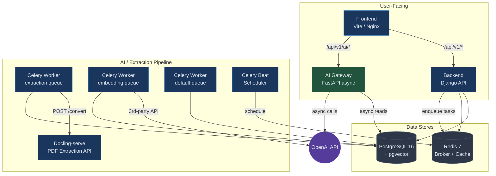
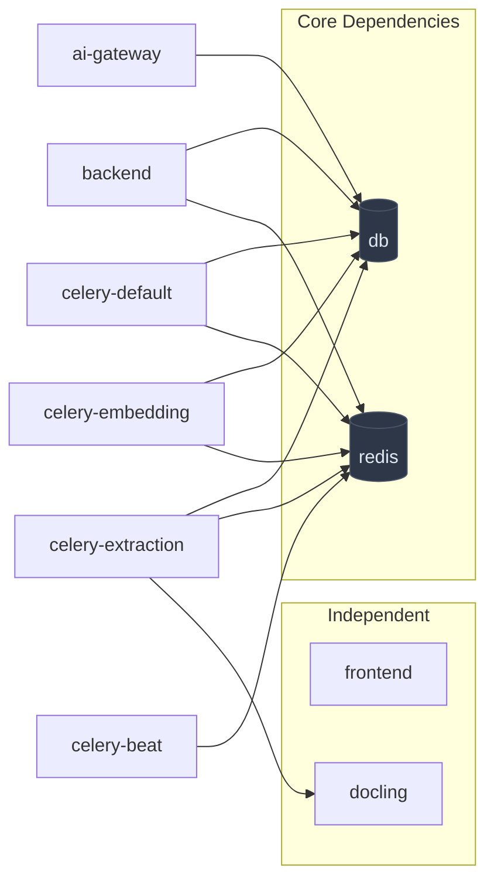

# Docker Compose Service Map — IRIS RAG & Extraction Pipeline

---

## Current State

Your existing [docker-compose.yml](file:///c:/Users/edlav/.antigravity/AntiProjects/IRIS/docker-compose.yml) has **5 services**: `db`, `redis`, `backend`, `celery`, `frontend`. The RAG/extraction concerns are currently baked into the monolithic `celery` worker — extraction tasks, embedding tasks, and general app tasks all share a single queue and a single worker pool.

This **does not scale** because:
- A heavy PDF extraction (via Docling OCR) blocks embedding tasks and vice versa
- You can't scale extraction workers independently of embedding workers
- Docling-serve (the planned extraction backend per [tasks.py TODO](file:///c:/Users/edlav/.antigravity/AntiProjects/IRIS/backend/apps/documents/tasks.py#L4-L27)) is not yet a Docker service
- pgvector is not enabled on the PostgreSQL container
- All AI query phases (embedding, retrieval, LLM calls) run synchronously inside Django, tying up Gunicorn workers for 3–10 seconds per request — at 100 concurrent RAG users, this would require ~15 GB of RAM in synchronous workers

---

## Target Architecture (100 Concurrent RAG Users)

Based on your [SRS M03](file:///c:/Users/edlav/.antigravity/AntiProjects/IRIS/docs/software-requirements/M03-Semantic-Indexing.md), [SRS M04](file:///c:/Users/edlav/.antigravity/AntiProjects/IRIS/docs/software-requirements/M04-RAG-AI-Services.md), [SDD M03](file:///c:/Users/edlav/.antigravity/AntiProjects/IRIS/docs/software-design/M03-Semantic-Indexing.md), [SDD M04](file:///c:/Users/edlav/.antigravity/AntiProjects/IRIS/docs/software-design/M04-RAG-AI-Services.md), the [past RAG architecture study](file:///C:/Users/edlav/.gemini/antigravity-ide/brain/08c01ca1-41bb-4991-adbc-d40a7660dd6e/rag_architecture.md), and the [Docling-Studio compose](file:///c:/Users/edlav/.antigravity/AntiProjects/Docling-Studio/docker-compose.yml):



---

## Complete Service Map

### 10 Services (Development)

| # | Service | Image / Build | Port | Depends On | Purpose | Scalable? |
|---|---------|--------------|------|------------|---------|-----------|
| 1 | **db** | `ankane/pgvector:v0.8.0-pg16` | `5432` | — | PostgreSQL with pgvector extension for embeddings | Single (primary DB) |
| 2 | **redis** | `redis:7-alpine` | `6379` | — | Celery broker + result backend + KPI cache | Single |
| 3 | **backend** | Build `./backend` | `8000` | db ✅, redis ✅ | Django REST API — non-AI business logic (Phases 1, 4) | Horizontal (Gunicorn workers) |
| 4 | **ai-gateway** | Build `./ai-gateway` | `8001` | db ✅ | FastAPI async service — all RAG query phases (Phases 6–11) | Horizontal (uvicorn workers) |
| 5 | **docling** | `quay.io/docling/docling-serve` | `5001` | — | On-prem PDF text extraction API (OCR + layout) | Horizontal (replicas) |
| 6 | **celery-default** | Build `./backend` | — | db ✅, redis ✅ | General tasks (email, notifications) | Horizontal (replicas) |
| 7 | **celery-extraction** | Build `./backend` | — | db ✅, redis ✅, docling ✅ | PDF extraction tasks only (FR-M3-01, Phases 2–3) | Horizontal (replicas) |
| 8 | **celery-embedding** | Build `./backend` | — | db ✅, redis ✅ | Embedding generation tasks only (FR-M3-03, Phase 5) | Horizontal (replicas) |
| 9 | **celery-beat** | Build `./backend` | — | redis ✅ | Scheduler for nightly `embed_all_records` | **Singleton only** |
| 10 | **frontend** | `node:20-alpine` | `5173` | — | Vite dev server | Single |

### Why Separate Celery Queues?

| Queue | Worker Service | Tasks | Why Isolated |
|-------|---------------|-------|-------------|
| `default` | `celery-default` | Email, notifications, misc | Lightweight — shouldn't be starved by AI workloads |
| `extraction` | `celery-extraction` | `extract_pdf_text` | CPU/IO-heavy (Docling HTTP calls, file reads). 60s retry countdown. Can scale to match upload volume. |
| `embedding` | `celery-embedding` | `embed_record`, `embed_all_records` | Depends on 3rd-party API rate limits. Separate pool lets you throttle without blocking extraction. |

### Why a Dedicated AI Gateway?

At 100 concurrent RAG users, each `/ai/ask/` request ties up a worker for 3–10 seconds (OpenAI latency). The async FastAPI gateway handles this efficiently:

| Metric | Django backend (sync) | AI Gateway (FastAPI async) |
|--------|-----------------------|---------------------------|
| RAM for 100 concurrent RAG | ~15 GB (100 sync workers) | ~500 MB (4 async workers) |
| Non-AI API impact | Degraded under AI load | Completely isolated |
| LLM streaming (SSE) | Difficult | Native |
| OpenAI rate limiting | Per-worker, uncoordinated | Centralized semaphore |

---

## Development Compose

```yaml
# docker-compose.yml — IRIS Development (with RAG + Extraction + AI Gateway)
version: "3.9"

services:
  # ──────────────────────── Data Stores ────────────────────────
  db:
    image: ankane/pgvector:v0.8.0-pg16    # PostgreSQL 16 + pgvector
    restart: unless-stopped
    environment:
      POSTGRES_DB: iris_db
      POSTGRES_USER: iris_user
      POSTGRES_PASSWORD: iris_password
    volumes:
      - postgres_data:/var/lib/postgresql/data
    ports:
      - "5432:5432"
    healthcheck:
      test: ["CMD-SHELL", "pg_isready -U iris_user -d iris_db"]
      interval: 5s
      timeout: 5s
      retries: 5

  redis:
    image: redis:7-alpine
    restart: unless-stopped
    ports:
      - "6379:6379"
    healthcheck:
      test: ["CMD", "redis-cli", "ping"]
      interval: 5s
      timeout: 5s
      retries: 5

  # ──────────────────────── AI / Extraction ────────────────────
  docling:
    image: quay.io/docling/docling-serve:latest
    restart: unless-stopped
    ports:
      - "5001:5001"
    environment:
      - DOCLING_SERVE_CONCURRENCY=4
    healthcheck:
      test: ["CMD-SHELL", "curl -sf http://localhost:5001/health || exit 1"]
      interval: 15s
      timeout: 10s
      retries: 10
      start_period: 60s      # model loading takes time
    deploy:
      resources:
        limits:
          memory: 4g          # Docling uses ~2-3GB for OCR models

  # ──────────────────────── Django API ─────────────────────────
  backend:
    build:
      context: ./backend
      dockerfile: Dockerfile
      args:
        REQUIREMENT_FILE: development.txt
    restart: unless-stopped
    command: python manage.py runserver 0.0.0.0:8000
    volumes:
      - ./backend:/app
      - media_files:/app/media
    ports:
      - "8000:8000"
    env_file:
      - ./backend/.env
    environment:
      - DJANGO_SETTINGS_MODULE=config.settings.development
      - DB_HOST=db
      - REDIS_URL=redis://redis:6379/0
      - CELERY_BROKER_URL=redis://redis:6379/0
      - CELERY_RESULT_BACKEND=redis://redis:6379/0
      - DOCLING_API_URL=http://docling:5001
    depends_on:
      db:
        condition: service_healthy
      redis:
        condition: service_healthy

  # ──────────────────────── AI Gateway ─────────────────────────
  ai-gateway:
    build:
      context: ./ai-gateway
      dockerfile: Dockerfile
    restart: unless-stopped
    ports:
      - "8001:8001"
    environment:
      - DATABASE_URL=postgresql+asyncpg://iris_user:iris_password@db:5432/iris_db
      - OPENAI_API_KEY=${OPENAI_API_KEY}
      - JWT_SECRET_KEY=${SECRET_KEY}
      - AI_EMBEDDING_MODEL=${AI_EMBEDDING_MODEL:-text-embedding-3-small}
      - UVICORN_WORKERS=4
      - MAX_CONCURRENT_LLM=80
    depends_on:
      db:
        condition: service_healthy
    healthcheck:
      test: ["CMD-SHELL", "curl -sf http://localhost:8001/health || exit 1"]
      interval: 10s
      timeout: 5s
      retries: 5
    deploy:
      resources:
        limits:
          memory: 1g

  # ──────────────────────── Celery Workers ─────────────────────

  # Default queue: email, notifications, misc
  celery-default:
    build:
      context: ./backend
      dockerfile: Dockerfile
      args:
        REQUIREMENT_FILE: development.txt
    restart: unless-stopped
    command: celery -A config worker -l info -Q default -n default@%h
    volumes:
      - ./backend:/app
      - media_files:/app/media
    env_file:
      - ./backend/.env
    environment:
      - DJANGO_SETTINGS_MODULE=config.settings.development
      - DB_HOST=db
      - REDIS_URL=redis://redis:6379/0
      - CELERY_BROKER_URL=redis://redis:6379/0
      - CELERY_RESULT_BACKEND=redis://redis:6379/0
    depends_on:
      db:
        condition: service_healthy
      redis:
        condition: service_healthy

  # Extraction queue: PDF text extraction via Docling
  celery-extraction:
    build:
      context: ./backend
      dockerfile: Dockerfile
      args:
        REQUIREMENT_FILE: development.txt
    restart: unless-stopped
    command: celery -A config worker -l info -Q extraction -n extraction@%h --concurrency=2
    volumes:
      - ./backend:/app
      - media_files:/app/media
    env_file:
      - ./backend/.env
    environment:
      - DJANGO_SETTINGS_MODULE=config.settings.development
      - DB_HOST=db
      - REDIS_URL=redis://redis:6379/0
      - CELERY_BROKER_URL=redis://redis:6379/0
      - CELERY_RESULT_BACKEND=redis://redis:6379/0
      - DOCLING_API_URL=http://docling:5001
    depends_on:
      db:
        condition: service_healthy
      redis:
        condition: service_healthy
      docling:
        condition: service_healthy

  # Embedding queue: vector embedding generation
  celery-embedding:
    build:
      context: ./backend
      dockerfile: Dockerfile
      args:
        REQUIREMENT_FILE: development.txt
    restart: unless-stopped
    command: celery -A config worker -l info -Q embedding -n embedding@%h --concurrency=4
    volumes:
      - ./backend:/app
      - media_files:/app/media
    env_file:
      - ./backend/.env
    environment:
      - DJANGO_SETTINGS_MODULE=config.settings.development
      - DB_HOST=db
      - REDIS_URL=redis://redis:6379/0
      - CELERY_BROKER_URL=redis://redis:6379/0
      - CELERY_RESULT_BACKEND=redis://redis:6379/0
    depends_on:
      db:
        condition: service_healthy
      redis:
        condition: service_healthy

  # Celery Beat: nightly scheduler (MUST be singleton — never scale > 1)
  celery-beat:
    build:
      context: ./backend
      dockerfile: Dockerfile
      args:
        REQUIREMENT_FILE: development.txt
    restart: unless-stopped
    command: celery -A config beat -l info --schedule=/tmp/celerybeat-schedule
    volumes:
      - ./backend:/app
    env_file:
      - ./backend/.env
    environment:
      - DJANGO_SETTINGS_MODULE=config.settings.development
      - CELERY_BROKER_URL=redis://redis:6379/0
    depends_on:
      redis:
        condition: service_healthy

  # ──────────────────────── Frontend ───────────────────────────
  frontend:
    image: node:20-alpine
    working_dir: /app
    restart: unless-stopped
    ports:
      - "5173:5173"
    volumes:
      - ./frontend:/app
      - /app/node_modules
    command: sh -c "npm install && npm run dev -- --host"
    environment:
      - VITE_API_BASE_URL=http://localhost:8000/api/v1
      - VITE_AI_API_BASE_URL=http://localhost:8001/api/v1

volumes:
  postgres_data:
  media_files:
```

---

## Required Backend Changes

### 1. Celery Queue Routing ([settings/base.py](file:///c:/Users/edlav/.antigravity/AntiProjects/IRIS/backend/config/settings/base.py))

```python
# settings/base.py — add after existing Celery config
CELERY_TASK_ROUTES = {
    # FR-M3-01: PDF extraction → dedicated extraction workers
    "apps.documents.tasks.extract_pdf_text": {"queue": "extraction"},
    # FR-M3-03: Embedding generation → dedicated embedding workers
    "apps.ai.tasks.embed_record": {"queue": "embedding"},
    "apps.ai.tasks.embed_all_records": {"queue": "embedding"},
}

CELERY_TASK_DEFAULT_QUEUE = "default"

# Celery Beat schedule — nightly batch embedding
CELERY_BEAT_SCHEDULE = {
    "embed-all-nightly": {
        "task": "apps.ai.tasks.embed_all_records",
        "schedule": crontab(hour=2, minute=0),  # 2:00 AM daily
    },
}
```

### 2. pgvector PostgreSQL Image

Replace `postgres:16-alpine` with `ankane/pgvector:v0.8.0-pg16`. Then in Django:

```python
# settings/base.py — add to INSTALLED_APPS
THIRD_PARTY_APPS = [
    ...
    "pgvector",       # enables VectorField migration
]
```

### 3. AI Gateway (New Service)

A new `./ai-gateway/` directory containing a lightweight FastAPI app that:
- Validates JWTs using the same `SECRET_KEY` as Django (no auth duplication)
- Connects to PostgreSQL via `asyncpg` for read-only pgvector queries
- Calls OpenAI APIs asynchronously via `httpx.AsyncClient`
- Implements a centralized semaphore to cap concurrent OpenAI calls
- Serves endpoints: `/ai/search/`, `/ai/ask/`, `/ai/summarize/<pk>/`

### 4. Frontend Routing

The frontend routes AI calls to the AI gateway:

```
/api/v1/ai/*  →  ai-gateway:8001    (Phases 6–11)
/api/v1/*     →  backend:8000       (everything else)
```

---

## Scalability Patterns

### Horizontal Scaling (docker compose --scale)

```bash
# Scale extraction workers when upload volume spikes
docker compose up --scale celery-extraction=3

# Scale embedding workers for batch embed-all jobs
docker compose up --scale celery-embedding=4

# Scale AI gateway for more concurrent RAG users
docker compose up --scale ai-gateway=2
```

> [!WARNING]
> **Never scale `celery-beat` beyond 1 replica.** Multiple beat instances will trigger every scheduled task multiple times.

### Production Compose Additions

For production, add to `docker-compose.prod.yml`:

| Concern | Pattern |
|---------|---------|
| **Flower** | Celery monitoring UI (`mher/flower`) for queue depth visibility |
| **Resource limits** | CPU/memory caps on each worker (extraction is memory-heavy) |
| **No exposed ports** | Docling, Redis, DB internal-only; Nginx reverse proxy on port 80 |
| **Log rotation** | `json-file` driver with `max-size` / `max-file` on all services |
| **Replicas** | `deploy.replicas: N` for extraction/embedding workers |
| **Nginx routing** | `/api/v1/ai/*` → `ai-gateway`, everything else → `backend` |

---

## Dependency Graph



---

## Comparison: Current vs Target

| Aspect | Current (5 services) | Target (10 services) |
|--------|---------------------|----------------------|
| PDF extraction | Embedded in single Celery worker | Dedicated `celery-extraction` + `docling` service |
| Embedding | Same worker as extraction | Dedicated `celery-embedding` with own concurrency |
| AI queries | Sync Django views (blocks workers) | Async `ai-gateway` (FastAPI, 100 concurrent on 4 workers) |
| Vector storage | BinaryField (pickle) | pgvector `VectorField` on `ankane/pgvector` image |
| Queue isolation | Single `default` queue | 3 queues: `default`, `extraction`, `embedding` |
| Scheduled tasks | No scheduler | `celery-beat` for nightly batch embedding |
| Scale extraction | Must scale entire worker | `--scale celery-extraction=N` |
| Scale embedding | Must scale entire worker | `--scale celery-embedding=N` |
| Scale AI queries | Must add Gunicorn workers (~150MB each) | `--scale ai-gateway=N` (~125MB each, async) |
| RAM for 100 concurrent RAG | ~15 GB (sync workers) | ~500 MB (async AI gateway) |
| LLM streaming | Difficult in Django | Native SSE in FastAPI |
