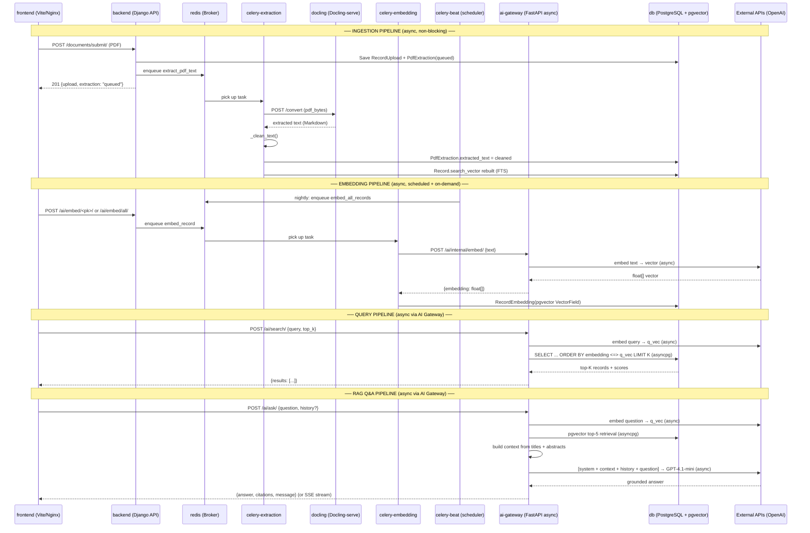

# RAG Pipeline → Docker Service Map

Every phase of the IRIS RAG pipeline, mapped to the exact Docker service, source file, and external dependency that executes it.

---

## Pipeline Overview



---

## Phase-by-Phase Mapping

### Phase 1 — PDF Upload & Storage

| Aspect | Detail |
|--------|--------|
| **Docker Service** | `backend` |
| **Source** | [SubmitDocumentView](file:///c:/Users/edlav/.antigravity/AntiProjects/IRIS/backend/apps/documents) (documents/views.py) |
| **What Happens** | Validates PDF format + ≤50MB size, saves file to storage, creates `RecordUpload` + `PdfExtraction(status="queued")`, enqueues Celery task |
| **Stores To** | `db` — tables `documents_recordupload`, `documents_pdfextraction` |
| **Blocking?** | No — returns HTTP 201 immediately |

---

### Phase 2 — Text Extraction

| Aspect | Detail |
|--------|--------|
| **Docker Service** | `celery-extraction` → `docling` |
| **Celery Queue** | `extraction` |
| **Source** | [extract_pdf_text](file:///c:/Users/edlav/.antigravity/AntiProjects/IRIS/backend/apps/documents/tasks.py#L177-L216) (documents/tasks.py) |
| **What Happens** | Worker reads PDF bytes from storage, POSTs to Docling-serve `/convert` endpoint. Docling handles text-layer PDFs, complex layouts (tables, multi-column), and scanned/image PDFs via its own OCR pipeline. Returns Markdown. |
| **External Call** | `POST http://docling:5001/convert` (internal Docker network) |
| **Retry** | 3 retries, 60s countdown |
| **Stores To** | `db` — `PdfExtraction.extracted_text`, `status = "done"` |

> [!NOTE]
> Currently this phase uses the [3-tier extraction chain](file:///c:/Users/edlav/.antigravity/AntiProjects/IRIS/backend/apps/documents/tasks.py#L138-L170) (OpenDataLoader → PyMuPDF → Tesseract). The [TODO at the top of tasks.py](file:///c:/Users/edlav/.antigravity/AntiProjects/IRIS/backend/apps/documents/tasks.py#L4-L27) documents the migration to Docling-serve.

---

### Phase 3 — Text Cleaning

| Aspect | Detail |
|--------|--------|
| **Docker Service** | `celery-extraction` (same task, same worker) |
| **Source** | [_clean_text()](file:///c:/Users/edlav/.antigravity/AntiProjects/IRIS/backend/apps/documents/tasks.py#L38-L61) (documents/tasks.py) |
| **What Happens** | (1) Drop lines < 3 chars, (2) drop pure-digit lines (page numbers), (3) strip non-printable/control chars, (4) collapse whitespace |
| **Stores To** | Cleaned text is written to `PdfExtraction.extracted_text` in `db` |

---

### Phase 4 — Full-Text Search (FTS) Indexing

| Aspect | Detail |
|--------|--------|
| **Docker Service** | `backend` (triggered by Django signal) |
| **Source** | [on_record_saved](file:///c:/Users/edlav/.antigravity/AntiProjects/IRIS/backend/apps/records) (records/signals.py) → [update_search_vector](file:///c:/Users/edlav/.antigravity/AntiProjects/IRIS/backend/apps/records) (records/services.py) |
| **What Happens** | `post_save` signal fires on `Record` model. Rebuilds `SearchVector(title, weight="A") + SearchVector(abstract, weight="B")`. PostgreSQL GIN index auto-updates. |
| **Stores To** | `db` — `records_record.search_vector` column (GIN-indexed) |

> [!NOTE]
> FTS indexing runs synchronously inside the Django ORM save cycle — **not** on a Celery worker. It's fast because it's a single SQL UPDATE per record.

---

### Phase 5 — Embedding Generation (Vector Encoding)

| Aspect | Detail |
|--------|--------|
| **Docker Service** | `celery-embedding` |
| **Celery Queue** | `embedding` |
| **Source** | [embed_record](file:///c:/Users/edlav/.antigravity/AntiProjects/IRIS/backend/apps/ai/tasks.py#L6) (ai/tasks.py) |
| **What Happens** | Builds input text as `f"{record.title}. {record.abstract}"`, POSTs to internal AI Gateway, receives float vector |
| **External Call** | `POST http://ai-gateway:8001/api/v1/ai/internal/embed/` (AI Gateway handles the external OpenAI call) |
| **Retry** | 3 retries, 60s countdown |
| **Stores To** | `db` — `ai_recordembedding.embedding` (pgvector `VectorField`) |
| **Scheduled By** | `celery-beat` nightly at 2:00 AM via `embed_all_records`, or on-demand via `POST /ai/embed/all/` |

---

### Phase 6 — Query Encoding

| Aspect | Detail |
|--------|--------|
| **Docker Service** | **`ai-gateway`** (async, non-blocking) |
| **Source** | `ai-gateway/routes/search.py` or `ai-gateway/routes/ask.py` |
| **What Happens** | User's query/question is sent to the **same** 3rd-party embedding API used in Phase 5, producing a query vector |
| **External Call** | OpenAI embedding API via `httpx.AsyncClient` (same model as indexing — critical for cosine similarity accuracy) |
| **Blocking?** | No — async `await`, does not tie up a worker thread |

---

### Phase 7 — Data Retrieval (Vector Search)

| Aspect | Detail |
|--------|--------|
| **Docker Service** | **`ai-gateway`** → `db` |
| **Source** | `ai-gateway/routes/search.py` / `ai-gateway/routes/ask.py` |
| **What Happens** | pgvector cosine distance query via `asyncpg`: `SELECT ... ORDER BY embedding <=> q_vec LIMIT K` |
| **K values** | Semantic Search: top-10 (configurable). AI Q&A: top-5 (hardcoded). |
| **Index** | HNSW index on `ai_recordembedding.embedding` for sub-second ANN search |
| **Returns** | Record IDs, titles, abstracts, similarity scores |

---

### Phase 8 — Reranking

| Aspect | Detail |
|--------|--------|
| **Docker Service** | **Not implemented** — would execute in `ai-gateway` if added |
| **Documented In** | [Agile notes](file:///c:/Users/edlav/.antigravity/AntiProjects/IRIS/docs/agile_and_scrum_notes.md#L199) mention "Integrate Cohere reranking to extract the top 5 most relevant chunks" |
| **SDD Status** | The [SDD M04](file:///c:/Users/edlav/.antigravity/AntiProjects/IRIS/docs/software-design/M04-RAG-AI-Services.md) does **not** include a reranking step — the top-K from pgvector are used directly |
| **If Added** | Would be an async call in `ai-gateway` between retrieval (Phase 7) and prompt construction (Phase 9). External call to Cohere Rerank API via `httpx.AsyncClient`. |

> [!WARNING]
> Reranking was mentioned in the agile sprint notes (Story 3.1) but was **not carried forward** into the formal SRS/SDD. If you want reranking, it would slot in between Phase 7 and Phase 9 inside the AI gateway.

---

### Phase 9 — Prompt Augmentation (Context Construction)

| Aspect | Detail |
|--------|--------|
| **Docker Service** | **`ai-gateway`** (in-memory, no IO) |
| **Source** | `ai-gateway/routes/ask.py` |
| **What Happens** | Builds context string from top-5 records' titles + abstracts. Constructs final prompt: `[system prompt] + [context block] + [optional conversation history] + [current question]` |
| **No external calls** | Pure string construction in Python |

---

### Phase 10 — LLM Response Generation

| Aspect | Detail |
|--------|--------|
| **Docker Service** | **`ai-gateway`** (async, non-blocking) |
| **Source** | `ai-gateway/routes/ask.py` |
| **What Happens** | Sends augmented prompt to GPT-4.1-mini via `openai.AsyncOpenAI`. LLM generates grounded answer citing retrieved records. Concurrent calls capped by semaphore (`MAX_CONCURRENT_LLM=80`). |
| **External Call** | OpenAI Chat Completions API (GPT-4.1-mini) via async client |
| **Returns** | `{answer: str, citations: [record_id, ...], message: null}` |
| **Streaming** | Can return Server-Sent Events (SSE) for real-time token streaming — native in FastAPI |

---

### Phase 11 — Document Summarization (separate flow)

| Aspect | Detail |
|--------|--------|
| **Docker Service** | **`ai-gateway`** (async, non-blocking) |
| **Source** | `ai-gateway/routes/summarize.py` |
| **What Happens** | Reads `PdfExtraction.extracted_text` via `asyncpg`, builds structured prompt ("Objectives, Methodology, Findings, Conclusion"), sends to GPT-4.1-mini async |
| **External Call** | OpenAI Chat Completions API |
| **Stores To** | **Nothing** — generated on demand, never persisted |

---

## Summary Matrix

| # | Pipeline Phase | Docker Service | Queue | External Dependency | Sync/Async |
|---|---------------|----------------|-------|-------------------|------------|
| 1 | PDF Upload | `backend` | — | — | Sync (HTTP) |
| 2 | Text Extraction | `celery-extraction` | `extraction` | `docling` (internal) | Async (Celery) |
| 3 | Text Cleaning | `celery-extraction` | `extraction` | — | Async (Celery) |
| 4 | FTS Indexing | `backend` | — | — | Sync (signal) |
| 5 | Embedding Gen | `celery-embedding` | `embedding` | `ai-gateway` (internal) | Async (Celery) |
| 6 | Query Encoding | **`ai-gateway`** | — | OpenAI Embedding API | **Async (asyncio)** |
| 7 | Vector Retrieval | **`ai-gateway`** → `db` | — | — | **Async (asyncpg)** |
| 8 | Reranking | ⚠️ Not implemented | — | Cohere (if added) | — |
| 9 | Prompt Augmentation | **`ai-gateway`** | — | — | **Async (in-memory)** |
| 10 | LLM Response | **`ai-gateway`** | — | OpenAI GPT-4.1-mini | **Async (asyncio)** |
| 11 | Summarization | **`ai-gateway`** | — | OpenAI GPT-4.1-mini | **Async (asyncio)** |

---

## Visual Flow by Service

```mermaid
graph TD
    User([User Request]) --> NonAI[non-AI routes]
    User --> AIroutes[/ai/* routes]
    
    NonAI --> BE[backend]
    BE -->|enqueue| RD[redis]
    
    RD --> CX[celery-extraction]
    RD --> CE[celery-embedding]
    
    CB[celery-beat] -->|cron| RD
    
    CX -->|internal| DK[docling]
    CE -->|internal| AI[ai-gateway]
    
    AIroutes --> AI
    
    AI -->|async| EXT[OpenAI API]
    AI -->|async| DB[(db / pgvector)]
    BE -->|sync| DB
```

> [!IMPORTANT]
> **The `ai-gateway` handles 6 of 11 phases entirely asynchronously.** With 4 uvicorn workers, it can serve ~100 concurrent RAG users in ~500 MB of RAM. The `backend` Django service is now free to handle fast CRUD requests (10–50ms) without being blocked by slow OpenAI round-trips (3–10s).
