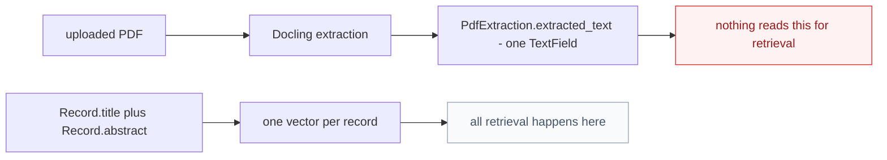
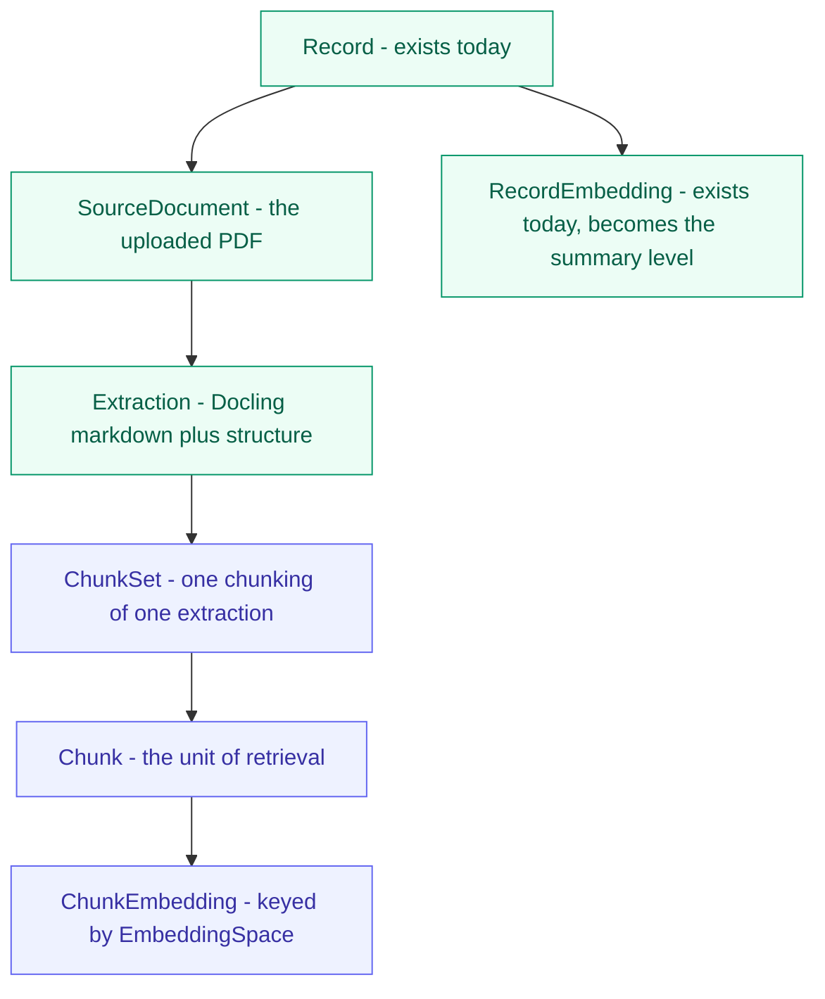
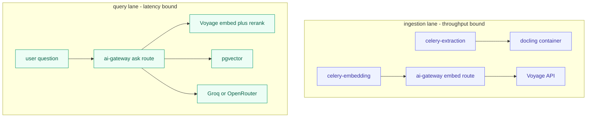
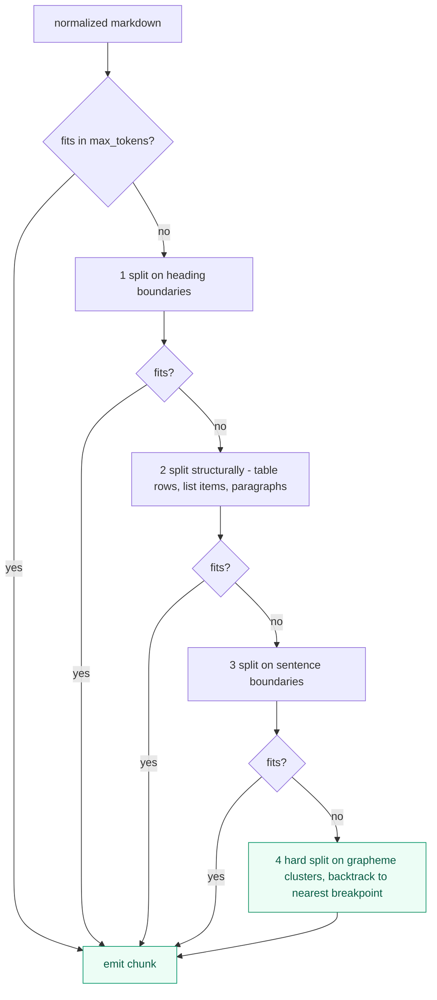
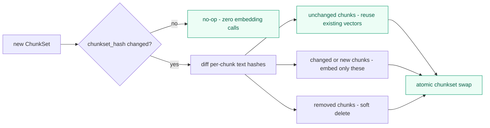
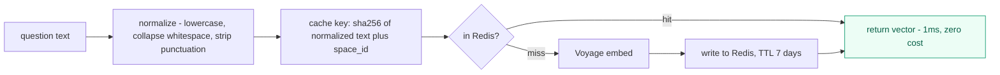
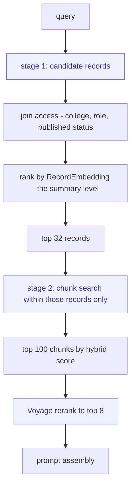
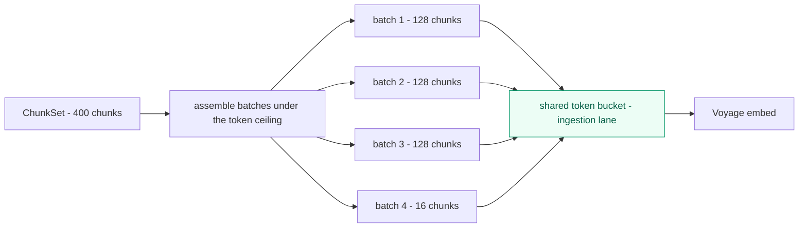

# Chunker Architecture

**Status:** design document — not yet implemented
**Scope:** `ai/domain/` · `ai/services/` · `ai/infrastructure/` · `backend/apps/documents/` · `backend/apps/ai/`
**Date:** 2026-08-31 · branch `feat/rag-service`
**Decisions locked:** Voyage for both embedding and reranking · pgvector as the store · chunk as a first-class entity
**Companions:** [RAG Third-Party Services](rag_third_party_services_architecture.md) · [RAG Pipeline Service Map](rag_pipeline_service_map.md)
**Prior art reviewed:** `Docling-Studio/document-parser` · `teammind/packages/ai`

---

## Table of contents

1. [The finding that motivates this document](#1-the-finding-that-motivates-this-document)
2. [What we borrowed, and from where](#2-what-we-borrowed-and-from-where)
3. [The domain model](#3-the-domain-model)
4. [The ingestion pipeline](#4-the-ingestion-pipeline)
5. [Inside the chunker](#5-inside-the-chunker)
6. [Idempotency and re-chunking](#6-idempotency-and-re-chunking)
7. [Design patterns catalogue](#7-design-patterns-catalogue)
8. [Scaling to a thousand concurrent users](#8-scaling-to-a-thousand-concurrent-users)
9. [The data model](#9-the-data-model)
10. [Voyage integration](#10-voyage-integration)
11. [Testing strategy](#11-testing-strategy)
12. [Rollout](#12-rollout)
13. [Open questions](#13-open-questions)

---

## 1 · The finding that motivates this document

Before designing a chunker it is worth stating plainly what IRIS does today, because it is not what the pipeline documentation implies.

**The extracted PDF text is never chunked, never embedded, and never retrieved.**

Three facts, each verified against the working tree:

| Fact | Evidence |
|---|---|
| PDF text lands in one `TextField` per upload and stops there | [`backend/apps/documents/models.py:86`](../backend/apps/documents/models.py#L86) — `extracted_text = models.TextField(blank=True)` |
| The only embedding in the system is over the abstract | [`backend/apps/ai/tasks.py:19`](../backend/apps/ai/tasks.py#L19) — `text = f"{record.title}. {record.abstract}"` |
| The chunker is a stub | [`backend/apps/ai/services/text_chunker.py`](../backend/apps/ai/services/text_chunker.py) — `class TextChunkerService: pass` |

So the "RAG pipeline" currently retrieves over **title-plus-abstract strings**, one vector per record. A user asking "what methodology did the 2024 aquaculture theses use?" is searching a corpus in which no methodology section has ever been indexed. The answer will be fluent and it will be built from abstracts.



This reframes the chunker from "a component we should add" to **the missing link between the two halves of a pipeline that already exist.** Docling extraction works. Embedding works. There is nothing in between.

It also means the design is unconstrained by legacy: there is no chunk table to migrate, no chunk API to keep compatible, no chunk sizes baked into anything. That is a rare and valuable position to design from.

---

## 2 · What we borrowed, and from where

Both reference codebases solved this problem well, in different directions. Neither is copied wholesale; each contributed specific ideas.

### From `Docling-Studio/document-parser`

A ports-and-adapters Python service with an unusually disciplined domain layer.

| Idea | Where it lives there | Why we take it |
|---|---|---|
| **`DocumentChunker` as a port over serialized Docling JSON** | [`domain/ports.py:77`](../../Docling-Studio/document-parser/domain/ports.py) — `async def chunk(document_json: str, options: ChunkingOptions) -> list[ChunkResult]` | A two-argument interface over a substantial implementation. Textbook **deep module**. |
| **Chunking runs off the thread pool** | `infra/local_chunker.py:106` — `await asyncio.to_thread(_chunk_sync, ...)` | Chunking is CPU-bound. Doing it inline in an async handler blocks the event loop for every other request. |
| **`chunkset_hash` — content-addressed staleness** | `domain/hashing.py` | The single best idea in either repo. See [section 6](#6-idempotency-and-re-chunking). |
| **Explicit lifecycle state machine** | `domain/lifecycle.py` — a `_TRANSITIONS` table, `is_allowed_transition`, `assert_transition` | Makes "can I re-chunk an ingested document?" a data question, not a scattered `if`. |
| **Chunks are editable, with an audit log** | `services/chunk_service.py` — `split_chunk`, `merge_chunks`, one `ChunkEdit` row per mutation | IRIS may not need chunk editing at v1, but the shape — mutations are atomic and audited — matches the university's audit requirements. |
| **Pure domain modules** | `hashing.py` docstring: *"This module is pure: in / out. No I/O. No randomness. No dates."* | The practice worth copying, more than any single module. |

### From `teammind/packages/ai`

A TypeScript RAG stack over Supabase/pgvector, tuned for a live multi-tenant product.

| Idea | Where it lives there | Why we take it |
|---|---|---|
| **Context-path prefixing** | `embeddings/gfm-context-path-chunker.ts:626` — every chunk is emitted as `Doc Title > Section > Subsection\n\n<content>` | The highest quality-per-effort idea in this document. See [section 5](#5-inside-the-chunker). |
| **Structure-aware splitting** | `handleTable` repeats the header row on every table fragment; `handleList` splits on item boundaries; `handleHeading` flushes the buffer | Generic character splitters destroy tables. Theses are full of tables. |
| **A cascade down to a hard split** | `splitLargeNode` walks graphemes and backtracks to the nearest `. `, `? `, `! `, `, `, `; `, ` ` | Guarantees the token ceiling is never exceeded, without cutting mid-grapheme. |
| **Two-level retrieval** | `match_documents_hierarchical` — stage 1 filters candidate documents by access and summary embedding, stage 2 scores chunks within them | IRIS is already halfway there: `RecordEmbedding` *is* the summary level. |
| **Access filtering in stage 1, as a MATERIALIZED CTE** | Same function — joins `document_user_access` before any scoring happens | Never pay to rank rows the user cannot see. |
| **A shared token-bucket rate limiter** | `embeddings/jina-embeddings.ts` — `SharedRateLimiter` with TPM and RPM budgets | Vendor rate limits are a global resource, not a per-call concern. |
| **Batch assembly under a token ceiling** | `chunkWithinTokenLimit(input, title, maxTokensPerBatch, overlap)` | Turns 120,000 single-item calls into a few thousand batched ones. |
| **`PARALLEL SAFE` + `statement_timeout`** | On the search function itself | A runaway similarity query cannot hold a connection for minutes. |

### What we deliberately do not take

- **Docling-Studio's chunk-editing UI and `ChunkPush` snapshot model.** IRIS has no human-in-the-loop chunk curation workflow and adding one now would be building for a requirement nobody has stated. The `ChunkEdit` audit shape is worth remembering if that changes.
- **teammind's `pgroonga` full-text engine.** IRIS already has a working Postgres FTS `search_vector` on `Record` ([`records/models.py:141`](../backend/apps/records/models.py#L141)), GIN-indexed and weighted title-A / abstract-B. Swapping the FTS engine is a separate decision with its own migration, and the existing one is adequate.
- **teammind's HyDE second embedding.** `match_documents_hierarchical` takes both a `query_embedding` and a `hyde_embedding`. That doubles query-time embedding cost for a technique whose benefit is corpus-specific. Revisit once the eval set exists.

---

## 3 · The domain model

Four concepts. Three of them do not exist in IRIS today.



### `Chunk` — the unit of retrieval

The central decision of this document: **the chunk, not the record, is what retrieval returns.** Everything else follows from that.

```python
@dataclass(frozen=True)
class Chunk:
    """One retrievable unit of a document. Immutable."""
    text: str                      # context path + content, exactly as embedded
    content: str                   # the content alone, without the path prefix
    context_path: tuple[str, ...]  # ("Thesis Title", "3 Methodology", "3.2 Sampling")
    sequence: int                  # dense ascending within the chunkset
    token_count: int
    source_page: int | None
    element_kinds: frozenset[str]  # {"text"} | {"table"} | {"heading", "text"}
```

Three properties are load-bearing:

- **Frozen.** A chunk is a value, not an entity with a lifecycle. Re-chunking produces a new `ChunkSet`; it does not mutate chunks. This eliminates an entire category of "was this embedded before or after the edit?" bugs.
- **`text` is stored, not derived.** It is the exact string handed to the embedding model. If the context-path format changes later, old chunks keep the string their vector was computed from. Deriving `text` from `content + context_path` at read time would silently invalidate every stored vector the day someone changes the separator.
- **`sequence` is dense and ascending**, so neighbour expansion — "give me the chunk before and after this hit" — is an index lookup rather than a similarity search.

### `ChunkSet` — one chunking of one extraction

```python
@dataclass(frozen=True)
class ChunkSet:
    chunks: tuple[Chunk, ...]
    strategy_id: str          # "structural-markdown-v1"
    options: ChunkingOptions
    content_hash: str         # deterministic over the chunks — see section 6
```

A `ChunkSet` exists so that "the chunks of this document" is a single value you can hash, compare, and replace atomically. Without it, re-chunking is a partial-update problem: delete some rows, insert others, and hope nothing queries mid-flight.

### `ChunkingOptions` — the strategy's parameters as data

```python
@dataclass(frozen=True)
class ChunkingOptions:
    strategy: str = "structural-markdown"   # or "hierarchical", "fixed-window"
    max_tokens: int = 512
    min_tokens: int = 64          # below this, merge with a neighbour
    overlap_tokens: int = 0       # structural chunking rarely needs overlap
    context_path_max_tokens: int = 48
    merge_short_siblings: bool = True
    repeat_table_header: bool = True
```

Borrowed directly from Docling-Studio's `ChunkingOptions`, extended with the two knobs teammind's chunker exposed (`maxWordsHeader` becomes `context_path_max_tokens`) and a `min_tokens` floor, which neither had and which matters: a corpus full of 12-token chunks retrieves badly and costs the same per call.

### What `EmbeddingSpace` becomes

From the [third-party services document](rag_third_party_services_architecture.md), `EmbeddingSpace` is `(model_id, dimensions, metric, state)`. With chunks, it gains a second job: **a chunkset and an embedding space together identify a vector.** Re-chunking invalidates vectors even when the model has not changed, and changing the model invalidates them even when the chunks have not.

```
ChunkEmbedding  is keyed by  (chunk_id, space_id)
```

That composite key is the whole invariant. Neither half alone is sufficient.

---

## 4 · The ingestion pipeline

Six stages, three of which exist today.


| Stage | Owner | Input | Output | Status |
|---|---|---|---|---|
| 1 · Upload | `backend/apps/documents` | file | `RecordUpload` | works |
| 2 · Extract | `celery-extraction` → `docling` | PDF bytes | markdown + structure | works |
| 3 · Normalize | `Normalizer` (pure) | raw markdown | cleaned markdown | **missing** |
| 4 · Chunk | `Chunker` port | cleaned markdown | `ChunkSet` | **missing** |
| 5 · Embed | `EmbeddingProvider` port | `ChunkSet` | vectors | partial — record-level only |
| 6 · Index | `ChunkRepository` | vectors | pgvector rows | **missing** |

### Stage 3 is not optional

Docling output from a Philippine university thesis carries artefacts that will otherwise be embedded as if they were content: running headers repeated on every page, page numbers stranded on their own line, hyphenated line-break splits (`method-\nology`), figure captions detached from figures, and reference lists that are pure citation noise.

`Normalizer` is a **pure function** — markdown in, markdown out, no I/O — and therefore trivially testable with a table of before/after fixtures. It runs before chunking so that chunk boundaries are computed over clean text.

One judgement call worth surfacing: **drop the references section from the embedded text.** A thesis bibliography is 10–20% of the token count and retrieves terribly — every chunk looks like every other chunk. Keep it in `extracted_text` for full-text search; exclude it from chunking. This is a policy, so it belongs in `ChunkingOptions`, not hardcoded.

### Where each stage runs



The two lanes share Postgres and share a Voyage rate-limit budget, and nothing else. **Keeping them from starving each other is the central scalability concern** — see [section 8](#8-scaling-to-a-thousand-concurrent-users).

---

## 5 · Inside the chunker

### The port

```python
class Chunker(Protocol):
    """Turns a normalized document into a ChunkSet.

    Pure with respect to I/O: no network, no database, no clock.
    Deterministic: the same document and options always produce the
    same ChunkSet, including its content_hash.
    """
    def chunk(self, document: NormalizedDocument, options: ChunkingOptions) -> ChunkSet: ...
```

Two arguments, one return value, over an implementation of several hundred lines. That ratio is what makes it a **deep module**.

Note it is **synchronous and pure.** Docling-Studio's port is `async` because its adapter deserializes JSON and may call a remote chunker. Ours does neither: the document arrives already extracted, and chunking is CPU work. Making it `async` would advertise an I/O seam that does not exist. The caller wraps it in `asyncio.to_thread` — which is precisely what Docling-Studio's `LocalChunker` does anyway at [`local_chunker.py:106`](../../Docling-Studio/document-parser/infra/local_chunker.py).

**A pure, synchronous, deterministic interface means the entire chunker is testable with a string and an assertion.** No fixtures, no database, no event loop, no mocks.

### The context path — the single highest-value idea here

teammind prefixes every chunk with its heading trail before embedding:

```
Optimization of Tilapia Feed Conversion > 3 Methodology > 3.2 Sampling Procedure

Samples were collected weekly from twelve ponds across three barangays...
```

The reason this matters is specific and easy to underestimate. Consider the chunk without its prefix:

> *"Samples were collected weekly from twelve ponds across three barangays."*

Embedded alone, this is about sampling. It is not about tilapia, not about feed conversion, not about methodology, and not about the 2024 aquaculture thesis it came from — because none of those words appear in it. A student asking *"how did the tilapia studies collect their data?"* will not retrieve it.

With the prefix, the vector carries the document's identity and the section's role. **The retrieval improvement is large and the cost is a few tokens per chunk.** In a thesis corpus, where hundreds of documents share near-identical section headings ("3.2 Sampling Procedure" appears in every one), the *document title* in the path is what disambiguates them.

Three rules, all learned from teammind's implementation:

1. **Truncate long paths from the middle.** `formatHeaderPath` keeps the first element and the last two, joining with `...`, when the path exceeds the budget. The document title and the immediate section matter; the intermediate hierarchy rarely does.
2. **Store the prefixed string as `text`.** It is what was embedded. Recomputing it later is how vectors and text silently diverge.
3. **Display `content`, not `text`.** The citation shown to the user should not repeat the heading trail — the UI already has the record title.

### The splitting cascade

Four strategies in descending order of structural awareness. Each one only handles what the previous could not.



Stage 4 exists so the token ceiling is a **guarantee, not a hope.** teammind's `splitLargeNode` walks grapheme clusters — not characters — and backtracks to the nearest `. `, `? `, `! `, `, `, `; `, or ` `. Grapheme-awareness matters more than it looks: Filipino and Cebuano text in these theses carries combining diacritics, and splitting a character mid-cluster produces mojibake in a citation a reviewer will read.

Two structural rules carry over verbatim from teammind's `handleTable` and `handleList`:

- **A table split across chunks repeats its header row in each fragment.** A row of numbers without column names is unretrievable and, worse, unreadable when cited.
- **Lists split on item boundaries, never mid-item.** Half a numbered procedure step is worse than useless in an answer.

### Merging short chunks

Neither reference implementation does this, and both corpora suffer for it. A thesis produces many 15-token chunks — a heading followed by one sentence, a figure caption, a single table row. Each costs a full embedding call and each retrieves noisily.

`min_tokens` with `merge_short_siblings` folds a chunk below the floor into its next sibling **within the same heading section**. Never across a heading boundary: that would merge two unrelated topics into one vector, which is exactly the failure the context path is trying to prevent.

### The chunker is a Strategy behind a Registry

```python
CHUNKER_REGISTRY: dict[str, type[Chunker]] = {}

def register_chunker(strategy_id: str):
    def decorator(cls):
        CHUNKER_REGISTRY[strategy_id] = cls
        return cls
    return decorator

def build_chunker(options: ChunkingOptions) -> Chunker:
    try:
        return CHUNKER_REGISTRY[options.strategy]()
    except KeyError:
        raise UnknownChunkingStrategy(options.strategy, known=sorted(CHUNKER_REGISTRY))
```

Compare to Docling-Studio's `_build_chunker`, which is an `if/else` returning `HierarchicalChunker` or `HybridChunker` — fine for two strategies, and the thing that grows badly at five. Compare also to IRIS's own [`dependencies.py:14`](../ai/infrastructure/dependencies.py#L14), where an unrecognized provider name silently falls through to the mock adapter. **An unknown strategy id must raise.**

`strategy_id` is stored on the `ChunkSet`, so every chunk in the database records how it was produced. When a strategy changes, that column tells you exactly which chunksets need rebuilding.

---

## 6 · Idempotency and re-chunking

Re-chunking will happen — a normalizer fix, a strategy change, a `max_tokens` adjustment, a re-extraction. The question is what it costs, and the answer must not be "re-embed everything."

### Content-addressed chunksets

Docling-Studio's `chunkset_hash` is the mechanism, and its docstring makes the argument better than a paraphrase would:

> *Why a hash and not, say, an `updated_at`? Idempotent re-pipelines on identical input bump `updated_at` without semantic change. A content hash is the only signal that survives that.*

```python
_SEPARATOR = b"\x1f"   # Unicode Information Separator One

def chunkset_hash(chunks: Iterable[Chunk]) -> str:
    """Deterministic SHA-256 over a chunkset.

    Hashed:   text, sequence, context_path
    Excluded: token_count (unstable across tokenizer versions)
              source_page, element_kinds (display metadata)

    The exclusion list is pinned. Changing it re-flips every stored
    chunkset once — a deliberate release event, not a silent migration.
    """
    h = hashlib.sha256()
    for c in chunks:
        h.update(_SEPARATOR)
        h.update(json.dumps(
            {"t": c.text, "s": c.sequence, "p": list(c.context_path)},
            ensure_ascii=False, separators=(",", ":"),
        ).encode())
    return h.hexdigest()
```

The separator byte prevents a collision where two adjacent chunks concatenate to the same digest as one chunk containing the joined text. `token_count` is excluded because it changes when a tokenizer is upgraded, which would flip every document to stale for no semantic reason.

### Per-chunk hashes make re-chunking incremental

Extend the idea one level down. Each chunk carries `sha256(text)`. On re-chunk:



A typo fix in one paragraph re-embeds one chunk, not four hundred. On a free tier with a finite token allowance, that is the difference between an experiment you can run repeatedly and one you can run once.

### The lifecycle state machine

Docling-Studio's `domain/lifecycle.py` is worth adopting nearly verbatim — a transition table plus two pure functions, no state logic scattered through services:

```
Uploaded → Extracted → Chunked → Indexed → (Stale | Chunked) → Indexed
                                     ↓
                                  Failed  (reachable from any state)
```

`Stale` is set only by hash comparison — never by a user action. Self-loops are permitted where the pipeline needs them: `Extracted → Extracted` for an idempotent re-extract, `Indexed → Indexed` for a re-push.

This matters for a specific IRIS question that will otherwise be answered inconsistently in three places: **can a record be re-chunked after it has been approved and published?** Yes — chunking is an index concern, not a record-state concern — but that answer belongs in one transition table, not scattered across views.

### Idempotency keys on jobs

Every chunk-and-embed job is keyed on `(record_id, extraction_hash, strategy_id, space_id)`. A duplicate delivery from Celery finds the key already completed and returns. Without this, a retry storm during a Voyage timeout spends the token budget several times over on identical work.

---

## 7 · Design patterns catalogue

### Structural

| Pattern | Where | What it buys |
|---|---|---|
| **Ports & Adapters** | `Chunker`, `Normalizer`, `EmbeddingProvider`, `Reranker`, `ChunkRepository` in `ai/domain/ports.py` | The domain imports no vendor SDK, ever. |
| **Value Object** | `Chunk`, `ChunkSet`, `ChunkingOptions`, `ContextPath` — all `frozen=True` | Immutability removes "was this embedded before or after the edit?" as a possible bug. |
| **Repository** | `ChunkRepository` with `PgVectorChunkRepository` and `InMemoryChunkRepository` | The in-memory one makes retrieval testable without Postgres. Two implementations are what make the seam real rather than hypothetical. |
| **Facade** | `IngestionService.ingest(record_id)` hiding normalize → chunk → embed → index | One method, four stages. A deep module. |
| **Aggregate** | `ChunkSet` as the consistency boundary for its chunks | Chunks are never inserted or deleted individually; a chunkset is swapped atomically. |

### Behavioural

| Pattern | Where | What it buys |
|---|---|---|
| **Strategy** | `Chunker` implementations selected by `options.strategy` | Comparing `structural-markdown` against `fixed-window` on the eval set is a config change. |
| **Registry** | `CHUNKER_REGISTRY` keyed by `strategy_id`, raising on unknown | Open/closed. A new strategy is a registration, not an edit to a growing `if/else`. |
| **Chain of Responsibility** | The four-stage splitting cascade | Each splitter handles only what the previous could not. Testable in isolation. |
| **Decorator** | `ContextPathChunker` wrapping any `Chunker` to prefix heading trails | The context path is orthogonal to the splitting strategy. Written once, applies to all four. |
| **Template Method** | `BaseStructuralChunker` owning the walk; subclasses override `handle_table`, `handle_list`, `handle_heading` | teammind's `processNode` dispatch, made extensible. |
| **Builder / Accumulator** | The buffer-plus-flush loop (`add_to_buffer`, `finalize_chunks`) | teammind's core loop. Keeps the token accounting in one place instead of at every call site. |
| **State Machine** | `domain/lifecycle.py` transition table | "Can I re-chunk this?" is a table lookup. |
| **Specification** | `AccessFilter` compiling a user's permissions to a SQL predicate | Access filtering happens in stage 1 of retrieval, inside the same query. |

### Resilience and scale

| Pattern | Where | What it buys |
|---|---|---|
| **Bulkhead** | Separate Celery queues and separate Voyage token budgets for ingestion vs query | A bulk backfill cannot starve interactive question-answering. **The most important pattern in this document at 1,000 users.** |
| **Token bucket** | A shared rate limiter over the Voyage budget, per lane | teammind's `SharedRateLimiter`, corrected — see the note in [section 8](#8-scaling-to-a-thousand-concurrent-users). |
| **Circuit Breaker** | Around the Voyage adapter | Vendor outage degrades retrieval to Postgres FTS instead of hanging every request. |
| **Idempotency key** | `(record_id, extraction_hash, strategy_id, space_id)` | A retry storm costs nothing. |
| **Content-addressed cache** | `chunkset_hash` and per-chunk `sha256(text)` | Re-chunking is incremental. |
| **Cache-aside** | Redis on query embeddings, keyed by normalized question text | The single biggest query-lane cost and latency saving. |
| **Backpressure** | Bounded queues; producers block rather than buffering unboundedly | A 3,000-document backfill does not exhaust memory or the rate limit in the first thirty seconds. |
| **Null Object** | `NoOpReranker`, `NoOpNormalizer` | Optional stages need no `if x is not None` at the call site. |

---

## 8 · Scaling to a thousand concurrent users

First, a distinction that changes every number below.

**A thousand concurrent users is not a thousand concurrent RAG queries.** In a research repository, users browse, read, filter, and download; asking the AI is a small fraction of sessions, and each question occupies the system for a few seconds. A thousand simultaneously-active users realistically produces **20–60 in-flight AI queries** at peak, with browse traffic dominating request count.

That distinction matters because the two lanes scale completely differently, and conflating them leads to over-engineering the wrong one.

### The chunker is not on the hot path

Chunking runs at ingestion. Its scaling requirement is **throughput** — documents per hour during a backfill or a submission deadline — not latency under concurrency. A thousand users do not chunk anything.

What the chunker must *not* do is interfere with the query lane. Three concrete obligations:

1. **Never block the event loop.** Chunking is CPU-bound. In the gateway it runs via `asyncio.to_thread`; in Celery it runs in a worker process with `--concurrency` matched to available cores, not to queue depth.
2. **Never exhaust the shared Voyage budget.** The ingestion lane gets a hard token-per-minute allocation strictly below the account limit; the query lane gets the remainder plus priority.
3. **Never hold a database connection while waiting on the network.** Embed first, then open a transaction to write. The naive ordering — open transaction, call Voyage, write, commit — holds a pooled connection for the entire vendor round trip, and that is how a backfill takes the site down.

### The query lane, stage by stage

At 50 concurrent queries, here is where the time and the risk actually sit:

| Stage | Typical latency | Scales by | Failure mode at load |
|---|---|---|---|
| Query embedding (Voyage) | 50–150 ms | vendor RPM | **rate limit** — mitigate with cache |
| pgvector ANN over 120k chunks | 5–20 ms | index in RAM | fine; degrades if index spills to disk |
| Access filter join | 1–5 ms | index quality | fine with the right composite index |
| Rerank top-100 (Voyage) | 100–300 ms | vendor RPM | **rate limit and cost** |
| LLM generation | 1–5 s | vendor concurrency | **the actual bottleneck** |
| **Connection acquisition** | 0 ms or forever | pool size | **the thing that breaks first** |

Two of those deserve elaboration, because they are the ones that will actually bite.

### Connection pooling is the first wall

This is the failure that arrives before any AI-specific limit. Django opens a connection per worker thread; the gateway opens its own asyncpg pool; Celery workers open more. Postgres defaults to `max_connections = 100`. Multiply out the workers at a thousand users and the arithmetic stops working long before pgvector does.

**Put PgBouncer in transaction mode in front of Postgres.** It is one container, it costs nothing, and it turns hundreds of application-side connections into a few dozen real ones. Two caveats that matter for this pipeline specifically: transaction mode does not support session-level prepared statements, so asyncpg needs `statement_cache_size=0`; and `SET LOCAL` works while session-level `SET` does not, which affects how `ef_search` is tuned per query.

### Query-embedding cache

Every question requires one Voyage embedding call before anything else happens. In a university repository the same questions recur constantly — the same assignment sends forty students looking for the same thing in the same week.



The key must include `space_id`. A cached vector from a retired embedding space is exactly the cross-space comparison bug from the [third-party services document](rag_third_party_services_architecture.md), preserved in Redis and surviving a redeploy.

Rerank results cache the same way, keyed on the question plus the candidate id set.

### pgvector at scale

At 120,000 chunks with 1024-dimension float32 vectors, the raw vector data is roughly **500 MB**, and the HNSW index adds to that. It fits comfortably in RAM on the 8 GB box.

Growth changes that. At a million chunks — a decade of submissions, or a corpus shared across institutions — you are at ~4 GB of vectors plus index, and the index no longer comfortably coexists with everything else. Three levers, in the order to reach for them:

1. **Matryoshka truncation.** Voyage's embedding models support truncating to fewer dimensions with modest quality loss. Dropping 1024 → 512 halves storage and memory outright. Measure the recall cost on the eval set before committing.
2. **int8 quantization.** Roughly a 4× reduction against float32. pgvector supports `halfvec` natively; verify what your version offers before designing around it.
3. **Partition by college or year.** Most IRIS queries are already scoped — a student searching their own college. A partitioned index searches a fraction of the corpus.

Tuning knobs worth knowing now: `ef_search` trades recall against latency at query time (raise it for the eval harness, lower it under load); `m` and `ef_construction` are set at index build time and match teammind's `m = 16, ef_construction = 64`, which is also what IRIS's existing [`RecordEmbedding`](../backend/apps/ai/models/embedding.py#L14) uses.

### Two-stage retrieval, borrowed from teammind

`match_documents_hierarchical` does something IRIS is already positioned to copy: **filter to candidate documents first, then score chunks within them.**



Three reasons this is the right shape for IRIS specifically:

- **`RecordEmbedding` already exists** and is already an abstract-level summary vector. The work is to *keep* it and add the chunk level beneath, not to replace it.
- **Access filtering happens before any scoring**, in a `MATERIALIZED` CTE, exactly as teammind does it. You never pay a vendor to rank documents the user cannot see — and IRIS's permission model, with colleges, departments, roles, and publication status, makes that filter selective enough to be a genuine speedup.
- **Stage 2 searches a fraction of the corpus.** Thirty-two records is roughly 1,300 chunks instead of 120,000.

Two details to copy verbatim from that function: `PARALLEL SAFE`, and `SET statement_timeout TO '30s'`. A runaway similarity query that holds a pooled connection for minutes is precisely how one bad question becomes an outage.

### A correction on the shared rate limiter

teammind's `SharedRateLimiter` is the right idea with an implementation detail that does not survive horizontal scaling. It is a **process-local singleton** holding counters in memory:

```typescript
private static instance: SharedRateLimiter;
private tokensUsed = 0;
private requestCount = 0;
```

With one process this is correct. With four gateway replicas each enforcing its own budget, the account sees 4× the intended rate and gets throttled by the vendor anyway. Its wait strategy also sleeps for the remainder of the window and then resets the counters unconditionally, which under concurrency lets a burst through immediately after the reset.

**For IRIS, put the token bucket in Redis** — a shared counter with atomic decrement, one bucket per lane, so the limit holds regardless of replica count. The pattern is right; the storage location is what needs to change when you scale past one process.

### The honest bottom line

| Concurrent AI queries | What you need |
|---|---|
| **10–20** | The design as described. One box. Nothing special. |
| **50–100** | PgBouncer, the query-embedding cache, Redis-backed rate limiting, two gateway replicas. |
| **200+** | A read replica for retrieval, an LLM provider with real concurrency headroom, and a measured decision on Matryoshka truncation. |

For a thousand *active users* on a single-university research repository, the middle row is the target. **The LLM vendor's concurrency limit will bind before pgvector does, and the connection pool will bind before either.** Neither of those is a chunker problem — which is the point: a well-shaped chunker stays out of the way.

---

## 9 · The data model

```sql
-- One chunking of one extraction. The aggregate root.
CREATE TABLE chunk_sets (
    id               bigserial PRIMARY KEY,
    record_id        bigint NOT NULL REFERENCES records_record(id) ON DELETE CASCADE,
    extraction_hash  text NOT NULL,      -- ties this set to the extraction it came from
    strategy_id      text NOT NULL,      -- "structural-markdown-v1"
    options          jsonb NOT NULL,     -- the ChunkingOptions used
    content_hash     text NOT NULL,      -- chunkset_hash over the chunks
    is_active        boolean NOT NULL DEFAULT false,
    created_at       timestamptz NOT NULL DEFAULT now(),
    UNIQUE (record_id, extraction_hash, strategy_id, content_hash)
);

-- Exactly one active chunkset per record. Enforced by the database,
-- not by application code that can be bypassed.
CREATE UNIQUE INDEX idx_chunk_sets_one_active
    ON chunk_sets (record_id) WHERE is_active;

CREATE TABLE document_chunks (
    id            bigserial PRIMARY KEY,
    chunk_set_id  bigint NOT NULL REFERENCES chunk_sets(id) ON DELETE CASCADE,
    record_id     bigint NOT NULL REFERENCES records_record(id) ON DELETE CASCADE,
    sequence      int NOT NULL,
    max_sequence  int NOT NULL,          -- teammind's max_chunk_index: enables "chunk 3 of 47"
    text          text NOT NULL,         -- exactly what was embedded, context path included
    content       text NOT NULL,         -- content alone, for display
    context_path  text[] NOT NULL DEFAULT '{}',
    text_hash     text NOT NULL,         -- sha256(text) for incremental re-chunking
    token_count   int NOT NULL,
    source_page   int,
    element_kinds text[] NOT NULL DEFAULT '{}',
    created_at    timestamptz NOT NULL DEFAULT now(),
    UNIQUE (chunk_set_id, sequence)
);

-- Vectors are keyed by (chunk, space). Neither half alone is sufficient.
CREATE TABLE chunk_embeddings (
    chunk_id   bigint NOT NULL REFERENCES document_chunks(id) ON DELETE CASCADE,
    space_id   bigint NOT NULL REFERENCES embedding_spaces(id) ON DELETE CASCADE,
    embedding  vector(1024) NOT NULL,
    created_at timestamptz NOT NULL DEFAULT now(),
    PRIMARY KEY (chunk_id, space_id)
);

CREATE INDEX idx_chunk_embeddings_hnsw ON chunk_embeddings
    USING hnsw (embedding vector_cosine_ops) WITH (m = 16, ef_construction = 64);

-- Stage 2 of retrieval filters by record_id from stage 1's candidates.
CREATE INDEX idx_document_chunks_record_seq ON document_chunks (record_id, sequence);
CREATE INDEX idx_document_chunks_set ON document_chunks (chunk_set_id);
CREATE INDEX idx_document_chunks_hash ON document_chunks (text_hash);
```

Four design notes:

**`is_active` with a partial unique index.** The database enforces "one active chunkset per record," so a re-chunk is: insert the new set, flip `is_active` inside one transaction. Retrieval never sees a partial state and never sees two. Application-level invariants get bypassed; this one cannot be.

**`max_sequence` denormalized onto every chunk.** Taken from teammind's `max_chunk_index`. It lets the UI render "chunk 12 of 47" and lets the retriever decide whether it has enough of a document to be worth fetching the whole thing — teammind's `useFullDocumentWhenMajority`. Denormalizing is correct here because chunksets are immutable once written.

**`text` and `content` both stored.** Deliberate duplication. `text` is what the vector was computed from and must never change; `content` is what a citation displays. Deriving one from the other at read time is how vectors and text silently diverge.

**`text_hash` indexed.** Makes incremental re-chunking a join instead of a scan.

---

## 10 · Voyage integration

**Decision: Voyage for embedding and reranking both.** One vendor, one API key, one rate-limit budget, one adapter family, one set of failure modes to learn. At IRIS's scale the marginal quality difference against a mixed best-of-breed stack does not repay the second integration.

### What the adapters look like

```python
class VoyageEmbedder(EmbeddingProvider):
    """Voyage embeddings. Batched, input-type aware, rate-limited by decorator."""

    async def embed_documents(self, texts: list[str]) -> list[Vector]: ...
    async def embed_query(self, text: str) -> Vector: ...


class VoyageReranker(Reranker):
    async def rerank(self, query: str, candidates: list[Chunk], top_k: int) -> list[Scored]: ...
```

Note `embed_documents` and `embed_query` are **separate methods, not a flag.** Voyage models are asymmetric — documents and queries are embedded with different input types, and mixing them degrades retrieval measurably. A boolean parameter makes it possible to pass the wrong one; two methods make it impossible. The same reasoning applies to Cohere's `search_document` / `search_query`.

This is not a violation of the [one-space-one-model invariant](rag_third_party_services_architecture.md#the-invariant-one-space-one-model-both-sides): the two input types are two modes of the *same* model, trained together for exactly this pairing. Using them is required.

### Configuration

```python
class VoyageSettings(BaseSettings):
    VOYAGE_API_KEY: str
    VOYAGE_EMBED_MODEL: str = "voyage-3.5-lite"
    VOYAGE_EMBED_DIMENSIONS: int = 1024
    VOYAGE_RERANK_MODEL: str = "rerank-2.5-lite"
    VOYAGE_MAX_BATCH_SIZE: int = 128
    VOYAGE_TPM_INGESTION: int = 200_000   # bulkhead: ingestion lane budget
    VOYAGE_TPM_QUERY: int = 100_000       # bulkhead: query lane budget, priority
```

> Verify model names, dimension options, and rate limits against Voyage's current documentation before implementing. Model generations turn over quickly and the values above are illustrative defaults, not verified constants. What is stable is the *shape*: model id, dimensions, and per-lane budgets all belong in configuration, and dimensions must agree with the `EmbeddingSpace` record.

### Batching



Batch assembly respects **both** limits — item count and total tokens — because a batch of 128 long chunks can exceed the per-request token ceiling even when the item count is legal. teammind's `chunkWithinTokenLimit` gets this right; the `overlap` parameter it carries is not needed here, since document chunks are already contextually independent.

A 120,000-chunk backfill becomes roughly **1,000 batched calls** instead of 120,000 single-item ones. That is the difference between a multi-day rate-limit fight and an afternoon.

### Where reranking sits

Reranking is a step strictly between recall and prompt assembly. It cannot be a route and it cannot be a Django service — it lives **inside** `Retriever`, behind a `Reranker` port with `NoOpReranker` as the default.

It is also the one vendor call that composes freely with any embedding space: **a reranker reads text, not vectors.** Changing embedding provider does not invalidate reranking, and adding reranking requires no re-indexing whatsoever.

Widen recall to feed it. Retrieving the top 8 and reranking 8 does nothing; retrieve 100, rerank to 8. Recall is cheap in Postgres and precision is what the reranker sells.

---

## 11 · Testing strategy

The chunker is pure, synchronous, and deterministic, which makes it one of the most testable modules in IRIS — and worth exploiting, given that **zero test files currently exist under `backend/apps/`.**

### Unit — the chunker

Because `chunk()` is pure, every test is a string and an assertion. No fixtures, no database, no event loop, no mocks.

| Property | Test |
|---|---|
| Token ceiling is a guarantee | For any input, `max(c.token_count for c in result) <= options.max_tokens`. Property-based, with generated markdown. |
| Determinism | `chunk(doc, opts) == chunk(doc, opts)`, and `chunkset_hash` matches across runs and processes. |
| No content loss | Concatenating every `content` in sequence order reproduces the normalized input, modulo whitespace. |
| Table headers repeat | A 40-row table split across chunks: every fragment contains the header row. |
| Lists split on item boundaries | No chunk begins mid-item. |
| Context path is present and bounded | Every chunk's `text` starts with its path; the path never exceeds `context_path_max_tokens`. |
| Grapheme safety | Input with combining diacritics never splits mid-cluster. |
| Short chunks merge | No chunk below `min_tokens` unless it is the last in its heading section. |

The "no content loss" property is the one that catches the most real bugs. Both reference implementations have `try/except` blocks that `return context` on error — teammind's `processNode` logs and returns the unchanged context, silently dropping a node. **That is a content-loss bug that no example-based test will find.** IRIS's chunker should raise instead, and this property test is what proves it does.

### Contract — the ports

**One contract test suite per port, run against every adapter.** This is what makes a seam real rather than hypothetical.

- `Chunker`: run the same suite against every registered strategy. All must satisfy the token ceiling, determinism, and no-content-loss.
- `ChunkRepository`: the same suite against `InMemoryChunkRepository` and `PgVectorChunkRepository`. If they diverge, one of them is wrong.
- `EmbeddingProvider`: against `VoyageEmbedder` and a deterministic `FakeEmbedder`. The fake is a real implementation — hash the text into a stable vector — not a `MagicMock`, so tests break when the *contract* changes rather than when the call sequence changes.

### Integration — the pipeline

Fixture PDFs through the whole path: a text-layer thesis, a scanned thesis, one heavy with tables, one with a long bibliography, one in mixed English and Cebuano. Assert chunk counts are in a sane range, no chunk is empty, and every chunk maps back to a page.

### Retrieval evaluation — the real test surface

Fifty labelled questions, as specified in the [third-party services document](rag_third_party_services_architecture.md#p9--without-a-retrieval-eval-set-every-vendor-choice-is-a-guess). For the chunker specifically, it answers the questions no unit test can:

- Does the context path improve recall@10? *(Expected: yes, substantially.)*
- What is the best `max_tokens` for this corpus? *(256, 512, 1024 — measure, don't guess.)*
- Does `structural-markdown` beat `fixed-window`? *(If not, delete the complexity.)*
- Does reranking beat widening recall?

**That last question is why the eval set precedes the chunker in priority.** Without it, every knob in `ChunkingOptions` is set by taste.

---

## 12 · Rollout

### Phase 0 — Prerequisites

Both are already on the critical path from the third-party services document, and both are blockers here.

- The fifty-question eval set with labelled relevant records. Longest lead time; needs people, not code.
- `EmbeddingSpace` as an entity. `chunk_embeddings` is keyed by it from day one — retrofitting it later is the destructive migration the whole design exists to avoid.

Also: the gateway does not currently boot ([`ai/api/schemas.py:1`](../ai/api/schemas.py#L1) imports Django; [`ai/api/chat.py:5-6`](../ai/api/chat.py#L5-L6) imports from an empty `ai/services/`). Nothing here is testable end to end until that is fixed.

### Phase 1 — The chunker, standalone

Pure domain work with no infrastructure and no vendor. Fully testable on its own.

`Chunk`, `ChunkSet`, `ChunkingOptions` value objects · the `Chunker` port and registry · `StructuralMarkdownChunker` with the four-stage cascade · `ContextPathChunker` decorator · `Normalizer` · `chunkset_hash` · the lifecycle transition table · the full unit and property test suite.

**Exit criterion:** feed it a real thesis and inspect the chunks by hand. This step is not optional — reading fifty chunks from an actual submission will teach you more about `max_tokens` than any amount of design.

### Phase 2 — Persistence and indexing

The migration in [section 9](#9-the-data-model) · `ChunkRepository` with both implementations · the atomic chunkset swap · incremental re-chunk via hash diff · idempotency keys on jobs.

**Exit criterion:** the contract suite passes identically against both repository implementations. Re-running ingestion on an unchanged document performs zero writes and zero embedding calls.

### Phase 3 — Voyage and the query path

`VoyageEmbedder` with batching and per-lane token buckets · `VoyageReranker` · two-stage retrieval with access filtering in stage 1 · the query-embedding cache · the decorator stack for timeout, retry, rate limiting, and circuit breaking.

**Exit criterion:** the eval set runs end to end and reports recall@10 with and without the context path, and with and without reranking. Two numbers that justify the whole design, or don't.

### Phase 4 — Production hardening

PgBouncer in transaction mode · Redis-backed shared rate limiting across replicas · `statement_timeout` on retrieval queries · degraded mode falling back to Postgres FTS when Voyage is unreachable · load test at 50 concurrent queries.

---

## 13 · Open questions

Genuinely undecided — each needs either a measurement or a decision that is not mine to make.

**What is the right `max_tokens` for theses?** 512 is the default in both reference implementations and a reasonable prior. Research documents have long, self-contained methodology paragraphs that may favour 1024. Measure on the eval set.

**Should chunks span section boundaries at all?** Strict structural chunking never merges across a heading. That produces some very short chunks and preserves topical purity. `merge_short_siblings` relaxes it within a section. Whether to relax it further is an empirical question.

**Do we chunk the whole thesis, or only substantive sections?** A thesis contains an acknowledgements page, a table of contents, and a bibliography. Chunking all of it costs tokens and adds noise; excluding sections requires reliable section detection, which Docling's structure output may or may not provide for these specific documents. **Inspect real Docling output before deciding.**

**Does `voyage-context-3` (or the current contextualized-embedding generation) replace the context-path prefix?** Voyage has offered models that embed a chunk together with its surrounding document context — addressing the same problem the prefix solves, but inside the model. If available on your account, it is worth a row in the eval table. Do not adopt it unmeasured: the prefix is transparent, debuggable, and free.

**Is there a chunk-level access-control case?** Currently permissions are per-record. If an embargoed thesis ever needs "the abstract is public, the methodology is not," chunks need their own visibility field. Not a v1 requirement, but the `DisclosurePolicy` from the third-party services document is where it would live.

---

*Every IRIS file and line reference was verified against the working tree on 2026-08-31 (branch `feat/rag-service`). References to `Docling-Studio` and `teammind` were read from the sibling repositories at `C:\Users\edlav\.antigravity\AntiProjects\` on the same date. Line numbers drift as code changes. Voyage model names, dimensions, and rate limits are illustrative and must be verified against current vendor documentation.*
