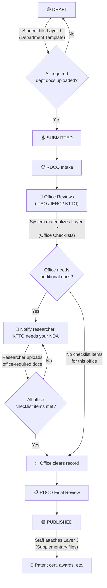

# Revised Document Requirements Architecture

## The Problem with the Current Design

The current system has **three disconnected storage concepts** that don't cleanly map to how documents actually flow in a real institution:

| Current Concept | Model | What It Does | Gap |
|---|---|---|---|
| **Upload Slots** | `UploadSlot` → `RecordType` | Defines required docs per record type (e.g., Thesis needs "Manuscript", "Approval Sheet") | **One-size-fits-all.** A "Thesis" in Computer Studies needs SRS, SDD, Source Code — but a "Thesis" in Fine Arts needs Portfolio, Exhibition Catalogue. The same RecordType can't have different requirements per department. |
| **Institutional Storage** | `RecordFile` | Ad-hoc file attachments on a record (no slot, no versioning) | **Unstructured dump.** When KTTO needs a signed NDA or IERC needs an Ethics Clearance, these are formal requirements — not loose attachments. But the current system treats them as miscellaneous files. |
| **Personal Storage** | (frontend-only shared folder) | Shared file manager unrelated to records | Fine as-is — this is a utility feature. |

### The Core Insight

Documents attached to a record aren't just "files." They fall into **two distinct categories** driven by **who requires them** and **when they become relevant**:

1. **Academic Requirements** — Required by the **department/college** based on what type of research it is. These are needed **at submission time** (draft → submitted).
2. **Office Requirements** — Required by **reviewing offices** (KTTO, IERC, RDCO, ITSO) as the record progresses through the pipeline. These are **NOT needed at submission** — they become relevant only when the record reaches a specific review stage.

---

## Proposed Architecture: Three-Layer Document Model

### Layer 1: Department Document Templates

> **Who defines them:** College Admin / Department Admin  
> **When are they enforced:** At submission time (draft → under review)  
> **Key change:** Requirements are scoped to `RecordType` + `Department`, not just `RecordType`

Currently, `UploadSlot` is tied only to `RecordType`. The proposal:

```
DepartmentTemplate
├── department     → FK to Department (e.g., "College of Computer Studies")
├── record_type    → FK to RecordType (e.g., "Thesis")
├── name           → CharField (e.g., "Software Requirements Specification")
├── is_required    → Boolean
├── sort_order     → Integer (display ordering)
```

**Examples:**

| Department | Record Type | Required Documents |
|---|---|---|
| College of Computer Studies | Thesis | Manuscript, SRS, SDD, Source Code, SPP, User Manual |
| College of Computer Studies | Proposal | Concept Paper, Literature Review |
| College of Fine Arts | Thesis | Manuscript, Portfolio, Exhibition Documentation |
| College of Engineering | Thesis | Manuscript, Design Drawings, Lab Results |

**How it connects to the existing `UploadSlot`:**  
`UploadSlot` evolves into `DepartmentTemplate`. The `record_type` FK stays, but a new `department` FK is added. If a department has no custom template for a record type, the system falls back to a **default/global template** (where `department = NULL`), preserving backward compatibility.

**Enforcement rule:** When a student submits a draft, the system checks: "For this record's `record_type` + the submitting user's `department`, which `DepartmentTemplate` slots are `is_required=True`?" All required slots must have at least one upload before submission is allowed.

---

### Layer 2: Office Checklists (Stage-Gated Requirements)

> **Who defines them:** Office Admins (KTTO, IERC, RDCO, ITSO)  
> **When are they enforced:** Only when the record **reaches that office's review stage**  
> **Key change:** Requirements are tied to a pipeline stage, not the initial submission

This is the missing concept. Currently, when KTTO needs a signed NDA or IERC needs Ethics Clearance, there is no formal mechanism — staff either ask via email or use the unstructured `RecordFile`. The proposal:

```
OfficeChecklist
├── office         → CharField choices (ktto, ierc, rdco, itso)
├── record_type    → FK to RecordType (nullable — some apply to all types)
├── name           → CharField (e.g., "Non-Disclosure Agreement")
├── is_required    → Boolean
├── sort_order     → Integer
```

**Examples:**

| Office | Record Type | Required Documents |
|---|---|---|
| KTTO | All | Non-Disclosure Agreement, IP Assignment Form |
| KTTO | Thesis (if `for_commercialization=True`) | Technology Assessment Report, Market Analysis |
| IERC | All | Ethics Review Application, Informed Consent Form |
| RDCO | All | Final Certification Form |
| ITSO | Project | IT Infrastructure Compliance Certificate |

**How it connects to `RecordClearance`:**  
When a `RecordClearance` row is created (e.g., `office=ktto, status=pending`), the system also materializes the relevant `OfficeChecklist` items for that record. The reviewing office sees a checklist of documents they need from the researcher, alongside the research documents themselves.

**Enforcement rule:** An office **cannot mark its clearance as "cleared"** until all `is_required=True` checklist items for that office have been uploaded. This replaces the ad-hoc "ask via email" workflow with a formal, trackable process.

**When does the researcher upload these?** The system notifies the researcher when their record enters a stage that has pending checklist items. The researcher uploads them via the record's document page. They do NOT need to upload an NDA at draft time — only when the record reaches KTTO review.

---

### Layer 3: Supplementary Attachments (Unchanged)

> **Who uses them:** Staff, Record Owners  
> **When:** Anytime, for anything  
> **Key change:** None — this stays as `RecordFile`

This is the current "Institutional File Storage" concept, but now it has a **much clearer purpose**: it's for files that don't fit into either Layer 1 or Layer 2. Post-publication attachments like patent certificates, award letters, conference presentation videos — things that no template or checklist anticipated.

---

## How It All Connects: The Full Document Lifecycle



### The Key Improvement: Stage-Awareness

| Stage | What documents are relevant | Current system | Proposed system |
|---|---|---|---|
| **Draft** | Only academic documents (SRS, Manuscript, etc.) | ✅ Upload Slots work here | ✅ Department Templates (same idea, dept-scoped) |
| **Under Review** | Office-specific requirements (NDA, Ethics Form) | ❌ No mechanism — staff asks via email | ✅ Office Checklists (auto-materialized) |
| **Published** | Post-hoc attachments (patents, awards) | ⚠️ RecordFile exists but purpose unclear | ✅ Supplementary Attachments (clear purpose) |

---

## Impact on Existing Models

### Models That Evolve

| Current Model | Change | Notes |
|---|---|---|
| `UploadSlot` | Add `department` FK (nullable) | Null = global/default template. Becomes `DepartmentTemplate` conceptually. |
| `RecordUpload` | Add nullable FK to `OfficeChecklist` | If the upload fulfills a checklist item, link it. If it's a department template upload, the existing `slot` FK stays. |
| `RecordFile` | No change | Keeps its role as unstructured supplementary storage. |

### New Models

| Model | Purpose |
|---|---|
| `OfficeChecklist` | Defines what documents each office requires |
| `RecordChecklistItem` | Materialized instance: "Record #42 needs NDA for KTTO" — tracks upload status per record per checklist item |

### Models That Don't Change

| Model | Why |
|---|---|
| `RecordClearance` | Still tracks office clearance status. Now it just also checks that checklist items are fulfilled before allowing "cleared." |
| `Review` | Still tracks individual review actions. |
| `PdfExtraction` | Still extracts text from PDFs regardless of which layer they belong to. |
| `RecordFile` | Still serves as ad-hoc supplementary storage (Layer 3). |

---

## Resolved Design Decisions

| # | Question | Decision | Rationale |
|---|---|---|---|
| 1 | Department Model | **Use existing hierarchy** | The codebase already has `College → Department → Course → StudentProfile`. Department Templates will FK to `Department`. |
| 2 | Office Checklist Conditionality | **Fully customizable rule engine** | Conditions based on `record_type`, IP flags (`is_ip`, `for_commercialization`), `department`, etc. Rules are configured by office admins via the Admin Portal. |
| 3 | Office Document Versioning | **OFF — one-shot uploads** | Office checklist documents (NDA, Ethics Clearance) are single uploads with no version stacking. If a replacement is needed, the previous upload is deleted and a new one is uploaded. |
| 4 | Personal Storage | **Unchanged** | Personal Storage remains in scope as a utility feature. No changes needed. |
| 5 | Who Uploads Office Docs | **Both** | Researchers upload via their record's document page (self-service). Staff can also upload on behalf of the researcher. |

---

## Rule Engine Specification for Office Checklists

When a `RecordClearance` row is created for an office, the system materializes the relevant `OfficeChecklist` items into `RecordChecklistItem` rows. The rule engine determines **which** checklist items apply based on configurable conditions.

### Rule Model

```
OfficeChecklistRule
├── checklist_item  → FK to OfficeChecklist
├── field           → CharField (the record/profile field to evaluate)
├── operator        → CharField choices (is, is_not, contains, does_not_contain)
├── value           → CharField (the comparison value)
```

### Supported Fields for Conditions

| Field | Source | Example Values |
|---|---|---|
| `record_type` | `Record.record_type` | `thesis`, `proposal`, `project` |
| `department` | `StudentProfile.department` | `College of Computer Studies`, `College of Engineering` |
| `is_ip` | `Record.is_ip` | `Yes`, `No` |
| `for_commercialization` | `Record.for_commercialization` | `Yes`, `No` |
| `community_extension` | `Record.community_extension` | `Yes`, `No` |
| `ip_type` | `Record.ip_type` | `patent`, `copyright`, `trade_secret`, `utility_model` |

### Evaluation Logic

1. When a `RecordClearance` is created (e.g., `office=ktto, status=pending`):
2. System fetches all `OfficeChecklist` items for that office.
3. For each checklist item, system evaluates all attached `OfficeChecklistRule` rows against the current record.
4. **AND logic**: All rules on a checklist item must pass for the item to be materialized.
5. **No rules**: A checklist item with zero rules always materializes (unconditional requirement).
6. Matching items are created as `RecordChecklistItem` rows with `status=pending`.

### Examples

| Office | Checklist Item | Rule | Effect |
|---|---|---|---|
| KTTO | Non-Disclosure Agreement | *(none — unconditional)* | Always required for KTTO review |
| KTTO | Technology Assessment Report | `for_commercialization is Yes` | Only required if the record is flagged for commercialization |
| KTTO | Market Analysis | `for_commercialization is Yes` AND `record_type is thesis` | Only for commercialized theses |
| IERC | Ethics Review Application | *(none — unconditional)* | Always required for IERC review |
| ITSO | IT Infrastructure Compliance | `record_type is project` | Only for projects |

---

## Office Checklist Upload Model

Since office checklist documents are **one-shot uploads** (no version stacking), a dedicated upload model is used:

```
OfficeChecklistUpload
├── checklist_item  → FK to RecordChecklistItem (one-to-one)
├── file            → FileField (on-premise storage)
├── uploaded_by     → FK to User
├── uploaded_at     → DateTimeField (auto)
├── filename        → CharField (original filename)
```

### Upload Permissions

- **Researcher (Record Owner):** Can upload documents to fulfill checklist items on their own record.
- **Staff (Office Reviewer):** Can upload documents on behalf of the researcher for any record under their office's review.

### Replacement Flow

If a document needs to be corrected:
1. The uploader (or staff) deletes the existing `OfficeChecklistUpload`.
2. The `RecordChecklistItem.status` reverts to `pending`.
3. A new file is uploaded, creating a new `OfficeChecklistUpload` row.

---

## Existing Department Hierarchy (Already in Codebase)

The following models already exist and will be leveraged by Layer 1 (Department Templates):

```
College
├── name            → CharField
├── abbreviation    → CharField

Department
├── college         → FK to College
├── name            → CharField

Course
├── department      → FK to Department
├── name            → CharField

StudentProfile
├── user            → OneToOne to User
├── course          → FK to Course  (→ Department → College)
```

**Template Resolution Path:** When a student submits a record, the system resolves the department via `request.user → StudentProfile → Course → Department` and queries `DepartmentTemplate` with `record_type + department`.
