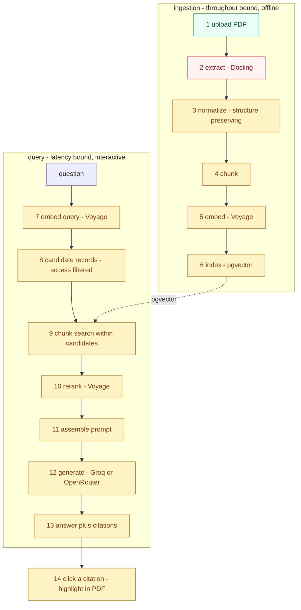
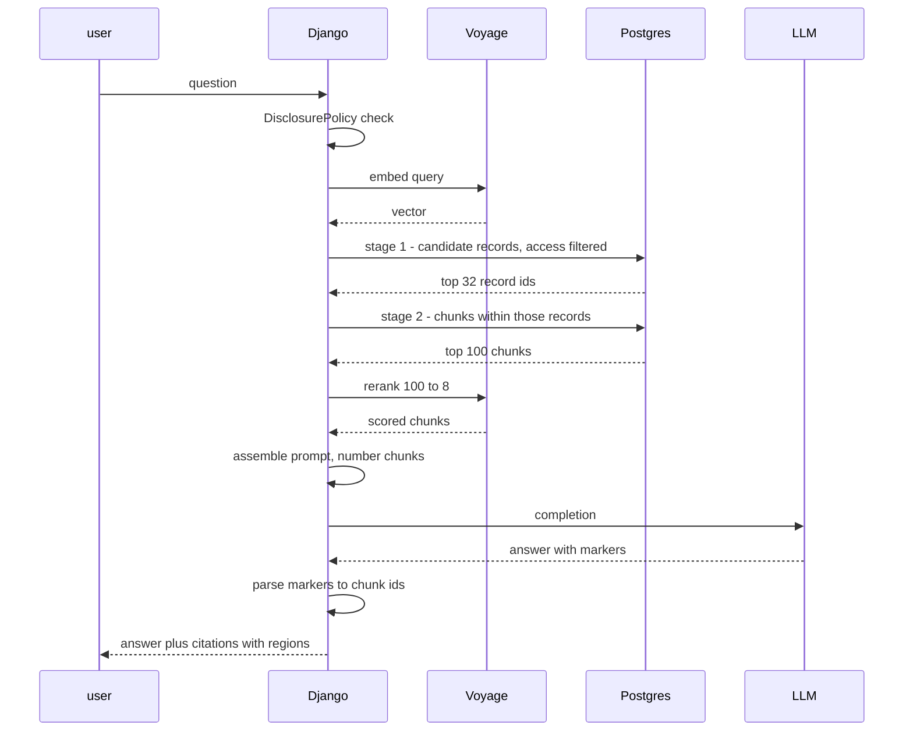
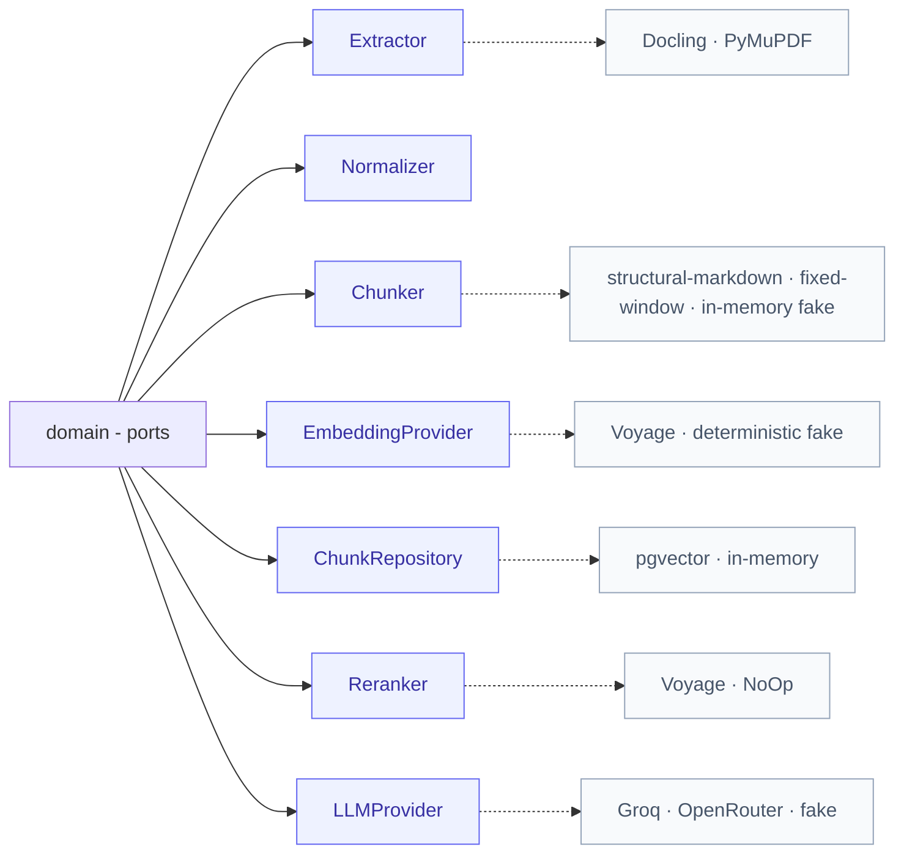
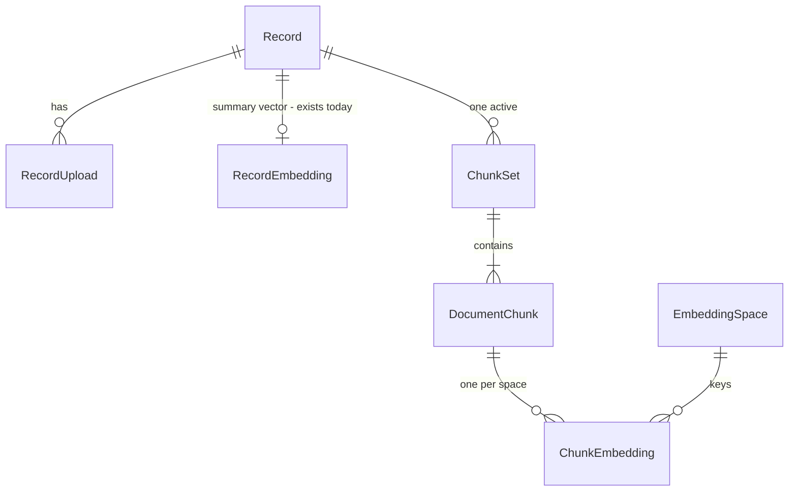

# RAG Architecture

**Purpose.** The end-to-end view of retrieval-augmented generation in IRIS — every stage from an uploaded PDF to a grounded, clickable answer.
**Owns.** The pipeline shape, the seams between its parts, the honest status of each, and the order things get built.
**Does not own.** Chunking internals ([`chunker_architecture.md`](chunker_architecture.md)) · vendor selection and prerequisites ([`rag_third_party_services_architecture.md`](rag_third_party_services_architecture.md)) · the decisions themselves ([`adr/`](adr/README.md)).
**Authority.** Authoritative for the pipeline as a whole. Where it conflicts with an ADR, the ADR wins and this document is corrected.
**Update when.** A stage is added, removed, or changes owner; a seam moves; a status changes.

**Date:** 2026-09-02 · branch `feat/rag-service`
**Governed by:** [ADR-013](adr/013-chunk-level-rag-pipeline.md) · [ADR-014](adr/014-ai-gateway-as-a-service.md) · [ADR-015](adr/015-voyage-embedding-and-reranking.md) · [ADR-007](adr/007-pgvector-vector-store.md) · [ADR-008](adr/008-ai-degradation-to-fts.md)

---

## Table of contents

1. [The one-paragraph version](#1-the-one-paragraph-version)
2. [The system in one diagram](#2-the-system-in-one-diagram)
3. [What actually runs today](#3-what-actually-runs-today)
4. [The ingestion path](#4-the-ingestion-path)
5. [The query path](#5-the-query-path)
6. [The seams](#6-the-seams)
7. [The data model](#7-the-data-model)
8. [Failure and degradation](#8-failure-and-degradation)
9. [Security and governance](#9-security-and-governance)
10. [Scale](#10-scale)
11. [Rollout](#11-rollout)
12. [What gets cut first](#12-what-gets-cut-first)
13. [Decision index](#13-decision-index)

---

## 1 · The one-paragraph version

IRIS holds research records and IP disclosures. RAG lets a user ask a question in natural language and receive an answer built **only** from records they are permitted to see, with every claim traceable to a passage in a source PDF. The pipeline is: extract the PDF, clean it, cut it into chunks, embed each chunk, store the vectors in Postgres, and at query time retrieve → rerank → answer with citations. **The thesis contribution is the workflow, not this** ([ADR-003](adr/003-clearance-aware-resubmission.md)) — RAG is a supporting capability with a 7-dev-day budget and a pre-committed fallback to full-text search.

Two things are true at once and both matter: **the design is settled**, and **almost none of it runs yet.**

---

## 2 · The system in one diagram

Green runs. Amber is designed and unbuilt. **Red is built and broken.**

---

## 3 · What actually runs today

Verified against the working tree on 2026-09-02. This table is the reason the rest of the document is ordered the way it is.

| Stage | Status | Evidence |
|---|---|---|
| 1 · Upload | **works** | `apps/documents` — but no ownership check on six endpoints |
| 2 · Extract | **broken** | `documents/tasks.py` imports `unstructured`, `fitz`, `pytesseract` — **none are in `requirements/base.txt`**. Extraction raises, retries three times, dies |
| 3 · Normalize | missing | no code |
| 4 · Chunk | missing | `apps/ai/services/text_chunker.py` is `class TextChunkerService: pass` |
| 5 · Embed | **partial, wrong unit** | `apps/ai/tasks.py:19` embeds `f"{record.title}. {record.abstract}"` — abstracts only, never document text |
| 6 · Index | **schema ready** | `apps/ai/models/embedding.py` has a real `VectorField` + HNSW `vector_cosine_ops`, migrations `0001`/`0002` exist |
| 7–13 · Query path | missing | no retrieval code anywhere; `ai/services/` holds only `__init__.py` |
| 14 · Citation highlight | missing | requires §11 of the chunker document |
| **AI gateway** | **cannot start** | `ai/api/chat.py` imports `ai.services.chat_service`, which does not exist |
| **Full-text search** | **works** | `Record.search_vector`, GIN-indexed, weighted title-A/abstract-B. The only functioning retrieval in the system |

### Four defects that block everything downstream

| # | Defect | Consequence |
|---|---|---|
| 1 | Extraction libraries absent from requirements | No document text is ever produced. Stages 3–6 have no input |
| 2 | Migration `0002` hardcodes `dimensions=1536`; the model reads `settings.AI_EMBEDDING_DIMENSIONS` | They can disagree silently. ADR-015 selects 1024, so **this migration must be revised before any corpus is indexed** |
| 3 | No `CELERY_TASK_ROUTES` anywhere in `backend/config/` | Every task publishes to the default `celery` queue. `docker-compose.yml` runs 10 services including workers on `-Q extraction` and `-Q embedding` that **consume nothing** |
| 4 | `ai/services/chat_service.py` does not exist | The gateway fails at import. [ADR-014](adr/014-ai-gateway-as-a-service.md) makes fixing this precondition 5 |

**Defect 1 is the true starting point.** Everything in this document is downstream of having document text.

---

## 4 · The ingestion path

Detail in [`chunker_architecture.md`](chunker_architecture.md). What matters at this level is who owns each stage and what crosses each seam.

| Stage | Owner | In → Out | Notes |
|---|---|---|---|
| 1 · Upload | Django `apps/documents` | file → `RecordUpload` | Needs the ownership check it lacks |
| 2 · Extract | `celery` → Docling | PDF bytes → `DoclingDocument` | Structure and `prov` must survive — see below |
| 3 · Normalize | `Normalizer`, pure | `DoclingDocument` → `DoclingDocument` | Drops running headers, page numbers, references |
| 4 · Chunk | `Chunker` port, pure | `DoclingDocument` → `ChunkSet` | Structure-aware cascade, context-path prefix |
| 5 · Embed | `EmbeddingProvider` port | `ChunkSet` → vectors | Batched, rate-limited, ingestion-lane budget |
| 6 · Index | `ChunkRepository` | vectors → pgvector rows | Atomic chunkset swap |

### The one decision that shapes the rest

**Stages 3 and 4 operate on the structured document, not on markdown.**

Docling attaches `prov` — page number and bounding box — to every element. Flattening to a markdown string discards it, and nothing recovers it afterwards: matching chunk text back against the PDF fails on ligatures, hyphenation and multi-column order.

Preserving structure costs a slightly more awkward `Normalizer` and buys clickable citations. That trade is the subject of [chunker §11](chunker_architecture.md#11-citation-provenance).

### Idempotency

Re-chunking is routine, not exceptional — a normalizer fix, a `max_tokens` change, a re-extraction. Two mechanisms keep the bill proportional:

- **`chunkset_hash`** — content-addressed, so an idempotent re-run of the pipeline produces an identical hash and does nothing. A timestamp cannot distinguish "changed" from "ran again".
- **Per-chunk `text_hash`** — re-embed only what changed. A typo fix costs one embedding call, not four hundred.

**Re-running ingestion on an unchanged document must perform zero writes and zero embedding calls.** That is a testable exit criterion, not an aspiration.

---

## 5 · The query path

### Two-stage retrieval

Borrowed from `teammind`'s `match_documents_hierarchical`. **Filter to candidate records first, then search chunks only inside them.**

Three reasons it fits IRIS specifically:

- **`RecordEmbedding` already exists** and is already an abstract-level summary vector. It is *kept* as the record-level stage rather than replaced.
- **Access filtering happens before any scoring**, in a `MATERIALIZED` CTE. You never pay a vendor to rank a record the user cannot open — and with colleges, roles and publication status, the filter is selective enough to be a genuine speedup.
- **Stage 2 searches a fraction of the corpus.** Thirty-two records is roughly 1,300 chunks instead of 120,000.

Two details to copy verbatim: `PARALLEL SAFE`, and `SET statement_timeout TO '30s'`. One runaway similarity query holding a pooled connection is how a single bad question becomes an outage.

### Where visibility is enforced

**Once, in Django, in stage 1.** One `visible_to(user)` predicate, shared with the record endpoints.

This is why [ADR-014](adr/014-ai-gateway-as-a-service.md) forbids the gateway from touching the database. The gateway receives already-filtered chunks as request payload. It holds no user model, makes no authorization decision, and has nothing to get wrong — which is exactly what makes deploying a second runtime defensible.

### Reranking

A step strictly between recall and prompt assembly. It cannot be a route and cannot be a Django service — it lives **inside** the retriever, behind a `Reranker` port with `NoOpReranker` as the default.

It is the one vendor call that composes freely with any embedding space, because **a reranker reads text, not vectors.** Adding it requires no re-indexing; changing embedding provider does not invalidate it.

Widen recall to feed it: retrieve 100, rerank to 8. Recall is cheap in Postgres; precision is what the reranker sells.

---

## 6 · The seams

Every external dependency sits behind a port. The domain imports no vendor SDK.

**Every port has at least two real implementations, and one of them needs no network.** That is not symmetry for its own sake — it is what makes the seam real rather than hypothetical, and it is what lets the whole pipeline be tested without a vendor key or a database.

The fakes are **real implementations**, not mocks. `FakeEmbedder` hashes text into a stable vector; `InMemoryChunkRepository` actually stores and ranks. Tests then break when the *contract* changes rather than when a call sequence changes.

**One contract test suite per port, run against every adapter.** If `InMemoryChunkRepository` and `PgVectorChunkRepository` disagree, one of them is wrong.

---

## 7 · The data model

Full DDL in [chunker §9](chunker_architecture.md#9-the-data-model). The shape:

Three invariants carry the design:

**Exactly one active chunkset per record**, enforced by a partial unique index rather than by application code. Re-chunking inserts the new set and flips one boolean in a transaction; retrieval never sees a partial state.

**A vector is keyed by `(chunk_id, space_id)`.** Neither half alone is sufficient. Re-chunking invalidates vectors even when the model is unchanged; changing the model invalidates them even when the chunks are unchanged.

**Within one `EmbeddingSpace`, the same model embeds documents and queries.** Mixing two models does not error — it returns rows, ranked plausibly, and wrong. This is the single most dangerous silent failure in the system, and it is why `EmbeddingSpace` is a row rather than a settings constant.

---

## 8 · Failure and degradation

[ADR-008](adr/008-ai-degradation-to-fts.md) governs. **AI failure degrades to PostgreSQL full-text search; it never takes down the product.**

| Failure | Behaviour |
|---|---|
| Embedding provider unavailable | Fall back to FTS. Banner: semantic search unavailable. Indexing queues for retry |
| LLM unavailable | Retrieval still returns records; the answer is an explicit "AI unavailable" state. **Never a fabricated answer** |
| Reranker unavailable | Return the recall ordering. Degraded quality, not degraded function |
| pgvector retrieval fails | Fall back to FTS |
| Celery or Redis down | Uploads still succeed; extraction and embedding queue. **The entire workflow is unaffected** |
| Rate limit or credit exhausted | As provider-unavailable, with a distinct operator-facing log |

No second AI implementation is built. FTS *is* the fallback, and it already works — which is the strongest argument for treating RAG as additive rather than load-bearing.

The core workflow — submission, routing, clearance, resubmission, publication, audit — **has no AI dependency at all.**

---

## 9 · Security and governance

Two items block deployment; neither is closed by engineering alone. A third — external transmission — was a blocker in an earlier revision of this document and is not any longer: see below.

### Retrieval is an access-control surface

An unfiltered vector query returns content regardless of visibility. Chunk-level retrieval multiplies the blast radius by roughly forty: a query that forgets its filter now leaks fragments of unpublished methodology rather than published abstracts.

**One `visible_to(user)` predicate, applied in stage 1, shared with the record endpoints.** Chunks inherit their record's visibility; there is no chunk-level permission model, and adding one would require reopening [ADR-009](adr/009-authorization-model.md).

### `/media/` is public — IR-59

`frontend/nginx.conf:52-55` serves the media volume directly. **Every uploaded PDF is readable by anyone who guesses a filename.** Uploads use `upload_to="documents/"`, so filenames derive from the uploaded name and are guessable.

This blocks the citation viewer specifically, which makes the browser fetch PDFs directly. Building on that route would ship a critical defect inside a user-facing feature.

### External transmission — not gated on governance sign-off

[ADR-015](adr/015-voyage-embedding-and-reranking.md) was revised 2026-09-04 to drop the written-sign-off precondition it originally carried. Phase 3 (Voyage embedding and the query path) is **not blocked by KTTO/IERC review.** Under [ADR-013](adr/013-chunk-level-rag-pipeline.md) the text leaving the deployment is still methodology, findings and instruments from unpublished theses and pre-filing IP disclosures, so the following stay required as product-level controls, independent of any outside approval process:

1. A `DisclosurePolicy` module gating every outbound call on IP status, embargo and consent — refusals are not sent to Voyage and are not AI-processed at all; there is no local model
2. Vendor no-training terms confirmed in writing
3. `VOYAGE_API_KEY` as a required production secret, per CLAUDE.md

FTS is the fallback for both a `DisclosurePolicy` refusal and a Voyage outage — one mechanism, per [ADR-008](adr/008-ai-degradation-to-fts.md), which already rejected a local model on cost and complexity grounds. **Search works either way.**

---

## 10 · Scale

A thousand concurrent *users* is not a thousand concurrent *queries*. In a research repository people browse, read and download; asking the AI is a fraction of sessions. A thousand active users realistically produces **20–60 in-flight queries**.

| Concurrent AI queries | What is needed |
|---|---|
| 10–20 | The design as written. One box |
| 50–100 | PgBouncer, query-embedding cache, Redis-backed rate limiting, two gateway replicas |
| 200+ | Read replica for retrieval, an LLM provider with real concurrency headroom, a measured decision on dimension truncation |

**The binding constraints, in the order they bite:** the Postgres connection pool, then the vendor rate limit, then LLM concurrency. pgvector over 120k chunks is 5–20 ms and is not close to being the problem.

The chunker is not on the hot path at all — it runs at ingestion. Its only obligation is not to starve the query lane: separate Celery queues, separate vendor token budgets, and **never hold a database connection while waiting on the network.** Embed first, then open a transaction to write.

---

## 11 · Rollout

Ordered by dependency, not by appeal.

| Phase | Contents | Exit criterion |
|---|---|---|
| **0 · Unblock** | Extraction libraries into requirements · revise migration `0002` to 1024 · `CELERY_TASK_ROUTES` · create `ai/services/` modules so the gateway imports | A PDF upload produces document text, and `docker compose config` validates |
| **0b · Prerequisites** | The 50-question eval set · `EmbeddingSpace` as an entity | An eval harness runs and reports a number |
| **1 · Chunker** | Value objects · `Chunker` port and registry · structural cascade · context path · `Normalizer` · `chunkset_hash` · lifecycle table · full property tests | **Feed it a real thesis and read fifty chunks by hand** |
| **2 · Persistence** | The migration · `ChunkRepository` ×2 · atomic swap · incremental re-chunk · idempotency keys | Contract suite passes identically against both repositories; re-running ingestion on an unchanged document does nothing |
| **3 · Retrieval** | Voyage adapters, batched · two-stage retrieval with access filter · reranker · query-embedding cache · resilience decorators | Eval set reports recall@10 with and without the context path, and with and without reranking |
| **4 · Citations** | Structure-preserving normalize · region plumbing · **IR-59** · PDF.js viewer with highlight layer · citation markers | Click a citation, the correct passage highlights |
| **5 · Hardening** | PgBouncer · Redis rate limiting · `statement_timeout` · degraded mode demonstrated · load test at 50 concurrent | The degraded path is demonstrated deliberately, not discovered |

**Phase 0 is not preamble.** Four defects currently make every later phase untestable.

**Phase 1's exit criterion is deliberately manual.** Reading fifty chunks from a real submission will teach more about `max_tokens` than any amount of design.

### Budget

[ADR-013](adr/013-chunk-level-rag-pipeline.md) allocates **7 dev-days, ending Week 7**, with a pre-committed fallback: if grounded generation is not working, ship abstract-level semantic search and reclassify chunking as Phase 2.

Phase 4 alone is ~5.5–6.5 days and **roughly doubles that**. It needs its own ADR or an amendment to 013 — it is a scope decision, not a detail.

---

## 12 · What gets cut first

Stated now, so it is a decision rather than a panic in Week 7. Cut in this order:

1. **Citation highlighting** (phase 4) — degrades to record-level citations with a link to the PDF. Regions are stored either way, so this is reversible later at no cost.
2. **Reranking** — degrades to the recall ordering. One config flip.
3. **Chunking itself** — degrades to `RecordEmbedding`, the abstract-level path, which the schema still supports. This is ADR-013's own pre-committed fallback.
4. **Grounded generation** — degrades to semantic search with no LLM call.
5. **Semantic search** — degrades to `Record.search_vector`, which already works.

**Each step down is a config change, not a rewrite.** That property is the point of the seams in §6, and it is the strongest defence of the design's cost: the elaborate part is what makes the retreat cheap.

The floor is full-text search over records, and it works today.

---

## 13 · Decision index

| Decision | Where | Status |
|---|---|---|
| Chunk-level retrieval, reranking in scope | [ADR-013](adr/013-chunk-level-rag-pipeline.md) | Accepted, supersedes ADR-006 |
| Gateway deployed as a sixth service, five preconditions | [ADR-014](adr/014-ai-gateway-as-a-service.md) | Accepted, supersedes ADR-012 |
| Voyage for embedding and reranking, always | [ADR-015](adr/015-voyage-embedding-and-reranking.md) | Accepted — not gated on governance sign-off |
| pgvector as the store | [ADR-007](adr/007-pgvector-vector-store.md) | Accepted; implemented on this branch |
| Degrade to FTS | [ADR-008](adr/008-ai-degradation-to-fts.md) | Accepted |
| Visibility model | [ADR-009](adr/009-authorization-model.md) | Accepted |
| Structure-preserving normalization, PDF.js over page images | [chunker §11](chunker_architecture.md#11-citation-provenance) | **Needs an ADR** |

### Open, and genuinely undecided

- **`max_tokens` for theses.** 512 is an inherited prior, not a measurement. Measure on the eval set.
- **Does Docling's `prov` survive scanned submissions?** One hour of work to find out, and it gates phase 4.
- **SRS contradictions.** The service table lists no FastAPI gateway; Docling is SRS-specified but deferred. Both need amendments.

---

*Every file, line and status claim was verified against the working tree on 2026-09-02, branch `feat/rag-service`. Line numbers drift. Vendor model names, dimensions and rate limits are illustrative and must be checked against current documentation before implementation.*
