# RAG Third-Party Services — Architecture, Cost, and a Free-Tier-First Rollout

**Status:** living design document
**Scope:** `ai/` (FastAPI gateway) · `backend/apps/ai/` · `backend/apps/records/`
**Date:** 2026-08-31 · branch `feat/rag-service`
**Supersedes:** the AI-vendor sections of [Architecture Review & AWS Roadmap](architecture_review_and_aws_roadmap.md) for capstone-scale deployment
**Companions:** [RAG Pipeline Service Map](rag_pipeline_service_map.md) — the 11-phase pipeline this document plugs vendors into · [Chunker Architecture](chunker_architecture.md) — how documents become the units these vendors embed

---

## Table of contents

1. [What this answers](#1-what-this-answers)
2. [The recommended stack](#2-the-recommended-stack)
3. [Corrections to the shortlist](#3-corrections-to-the-shortlist)
4. [Free tiers, stage by stage](#4-free-tiers-stage-by-stage)
5. [What it actually costs at IRIS scale](#5-what-it-actually-costs-at-iris-scale)
6. [Current state — what the code can and cannot do today](#6-current-state--what-the-code-can-and-cannot-do-today)
7. [The target architecture](#7-the-target-architecture)
8. [Design patterns catalogue](#8-design-patterns-catalogue)
9. [The nine prerequisites](#9-the-nine-prerequisites)
10. [Free-tier rollout plan](#10-free-tier-rollout-plan)
11. [Programming practices this design assumes](#11-programming-practices-this-design-assumes)
12. [Decisions worth recording as ADRs](#12-decisions-worth-recording-as-adrs)
13. [Verification](#13-verification)

---

## 1 · What this answers

Three questions, in order of how much they change the code:

1. **Which combination of hosted services is best for the architecture** — meaning: which ones can be adopted and abandoned without a rewrite.
2. **Which is most cost-effective** at IRIS's actual scale (one university, thousands of documents, not millions).
3. **What has to be true in the code first** before any of them is a reversible decision rather than a one-way door.

The short version of (3): **five seams should exist; two exist today and both are shallow.** Everything in section 9 is about making the vendor choice cheap to reverse, because at this scale the vendors are cheap and the lock-in is not.

> **A note on prices.** Every figure below is an order-of-magnitude planning number, checked at the time of writing. Free-tier limits in particular change often and without notice. Verify at signup before you commit to a plan; treat this document as a shape, not a quote.

---

## 2 · The recommended stack

| Stage | Pick | Why this one | Free-tier viable? |
|---|---|---|---|
| **Vector store** | **pgvector** — stay put | The vectors, the Postgres FTS `search_vector`, and the row-level permissions are all in one database. Hybrid retrieval stays one SQL query. Any hosted store turns it into two systems plus an application-side merge plus a sync problem on every edit and delete. | Free forever — it is already running |
| **Embedding** | **Voyage** — one provider, both sides | Its free token allowance covers a full IRIS backfill at zero cost. **The same model must embed the documents and the queries** — see the invariant below. Same vendor as reranking, so one key and one budget cover both. Evaluate Cohere only as a complete second space, on a corpus subset. | Yes — a full backfill fits the allowance |
| **Reranking** | **Voyage rerank** | **Decided 2026-08-31: Voyage for embedding and reranking both** — one vendor, one key, one rate-limit budget, one adapter family. Cohere Rerank is the marginally stronger model, but at IRIS scale the quality difference does not repay a second integration. Reranking is priced per search, so cost scales with queries and not corpus, and it typically beats any embedding upgrade. | Yes — covered by the same Voyage allowance |
| **Inference** | **Groq** for development, **OpenRouter** for production flexibility | Both speak the OpenAI wire protocol, so **they need no new adapter at all** — see the collapse below. Groq's free tier is fast and generous. OpenRouter's `:free` model lane costs nothing and its paid lane is pass-through pricing across dozens of models behind one key. | Yes, both |
| **Extraction** | **Docling** — stay self-hosted | Already a separate service with a clean HTTP seam, and theses and IP filings are exactly the layout-heavy PDFs it targets. | Free — self-hosted |
| **Local lane** | **Ollama** | Not a cost decision. It is the destination for records that a `DisclosurePolicy` refuses to send outside the university — see prerequisite 7. | Free — self-hosted |

### The architectural headline: adapters key on protocol, not vendor

This is the single most cost-effective decision in the document, and it costs nothing to make.

OpenAI, Groq, OpenRouter, Together, Fireworks, DeepInfra, vLLM, and Ollama all expose **the same chat-completions wire format**. They differ in a base URL, an API key, and a model string. Writing one adapter per vendor means five near-identical files that drift; writing one adapter per *protocol* means switching from Groq to OpenRouter is a `.env` change with zero new code.

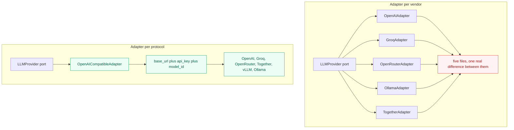

The full adapter inventory this implies is small:

| Port | Adapters actually needed | Covers |
|---|---|---|
| `LLMProvider` | `OpenAICompatibleAdapter` | OpenAI · Groq · OpenRouter · Together · Fireworks · vLLM · Ollama |
| `EmbeddingProvider` | `OpenAICompatibleEmbedder` · `CohereEmbedder` · `VoyageEmbedder` | Cohere and Voyage have their own wire formats and their own input-type semantics — they earn separate adapters |
| `Reranker` | `CohereReranker` · `VoyageReranker` · `NoOpReranker` | Pinecone Inference reranking is a fourth if you want a free lane |
| `VectorIndex` | `PgVectorIndex` · `InMemoryIndex` | the in-memory one exists so retrieval is testable without Postgres |
| `Extractor` | `DoclingExtractor` · `PyMuPdfExtractor` | PyMuPDF is the low-memory fallback already present in the codebase |

**Eleven adapters, covering roughly twenty vendors.** That ratio is the whole point of a ports-and-adapters design, and the current code does not get it because it branches on vendor name.

### The invariant: one space, one model, both sides

Cosine similarity is only meaningful **inside a single model's vector space.** The model that embeds a document and the model that embeds the query must be the same model — same vendor, same model id, same version. Mixing them does not raise an error; it returns rows, ranked plausibly, and wrong. That is the failure mode described in [section 6](#6-current-state--what-the-code-can-and-cannot-do-today) and prerequisite P2.

So `EmbeddingSpace` is not "a provider you can query across." It is a closed world:

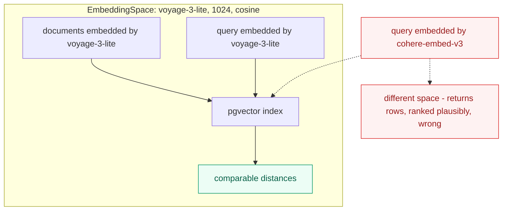

Two consequences follow, and they are the ones that decide the rollout:

**Comparing two embedding providers means embedding the corpus twice.** There is no cheaper version of that experiment. An A/B is two complete spaces, each self-consistent, each with its own backfill — which is what P1's `shadow` state exists to hold. At IRIS scale that is roughly $1–5 per provider, or free on a subset.

**Reranking is the exception, and this is why it is the best-value purchase here.** A reranker takes the *query text* and the *candidate document text* and scores the pair directly. It never touches a vector. So Cohere Rerank on top of Voyage embeddings is not a mix — it is two independent stages, and it needs no re-embedding of anything. Any reranker composes with any embedding space, freely.

The same holds for the FTS lane: fusing pgvector results with Postgres `search_vector` results by reciprocal rank is combining two *rankings*, not two vector spaces. That is legitimate and cheap.

> **Asymmetric input types are not two providers.** Cohere's `search_document` vs `search_query` flags are two modes of *one* model, trained together for exactly this pairing. Using them is required, not a violation of the invariant.

---

## 3 · Corrections to the shortlist

The shortlist as given has three category errors worth fixing before they turn into procurement decisions. None of these is a criticism of the shortlist — the vendors genuinely blur their own category lines in their marketing.

| Claim in the shortlist | Reality | What to do instead |
|---|---|---|
| **Voyage** as a vector store | Voyage sells embedding and reranking models. It does not host your vectors and has no index to query. | Use Voyage as an `EmbeddingProvider` and a `Reranker`. Storage stays pgvector. |
| **Cohere** as a vector store | Same — Cohere sells embed, rerank, and chat models. (Cohere Compass is an indexing product but is not the mature, GA-and-boring thing you want under a capstone.) | Use Cohere as an `EmbeddingProvider` and a `Reranker`. |
| **Pinecone** as an inference provider | Pinecone Inference serves **embedding and reranking** models — not chat LLMs. There is no Pinecone model that will write your grounded answer. | Pinecone is a candidate for `EmbeddingProvider` and `Reranker`. For chat inference, that is Groq and OpenRouter. |

And one correction of emphasis rather than fact:

- **Elasticsearch** does support dense vectors, sparse retrieval via ELSER, and reranking. It is a genuinely capable engine. It is also a second stateful system to run, back up, secure, and keep in sync with Postgres, and it wants more RAM than the rest of the IRIS stack combined. At three thousand documents it buys you nothing that a GIN index and an HNSW index in the database you already run do not. **Revisit only if the corpus grows two orders of magnitude,** or if someone needs cross-cluster federated search across institutions.

---

## 4 · Free tiers, stage by stage

Ordered by how much of a real evaluation each free tier can actually carry.

### Embedding

| Vendor | Free tier shape | Can it embed the whole corpus? | Notes |
|---|---|---|---|
| **Voyage** | A large one-time free token allowance, bigger on the `-lite` models | **Yes** — a full IRIS backfill fits inside it | The only free tier on this list that covers a corpus-scale job. Start here. |
| **Cohere** | Trial API key: free, heavily rate-limited per minute and per month, non-production use only | **No** — the monthly call cap is nowhere near 120k chunks | Excellent for query-side evaluation. Batch endpoint helps but the cap is the cap. |
| **Pinecone Inference** | Included in the Starter plan's monthly unit budget | Partly | Pulls you toward Pinecone as a store, which section 2 argues against. Fine as a free comparison point. |
| **OpenAI** | No free tier | No | Cheap enough that it barely matters — see section 5. |
| **Ollama / local** | Free, self-hosted | Yes, but slowly on CPU | The zero-cost, zero-disclosure-risk baseline. Quality is materially below the hosted models. |

**Start with Voyage alone.** It is the only free tier that can embed the whole corpus, and per the invariant above it must then also embed every query — one provider, both sides.

**If you want to compare Cohere, budget for a second full backfill.** The trial cap cannot cover 120k chunks, so there are two honest options:

- **Evaluate on a subset.** Take the records your fifty eval questions are labelled against, plus a few hundred distractors — call it 300–500 records, roughly 12k–20k chunks. Embed *that* with both providers and compare recall-at-10. Noisier than a full-corpus comparison, but directionally valid and free.
- **Or just pay the ~$5.** A full Cohere backfill of 48M tokens costs about five dollars. If a trial cap is the only thing standing between you and a clean answer, it is not a real obstacle — see [section 5](#5-what-it-actually-costs-at-iris-scale).

Either way this needs `EmbeddingSpace` (prerequisite 1), because both comparisons require holding two complete, self-consistent spaces at once.

### Reranking

Reranking is where free tiers go furthest, because **rerank cost scales with queries, not with corpus.** A fifty-question evaluation set is fifty rerank calls. Every trial key on this list covers that comfortably.

| Vendor | Free tier shape | Verdict |
|---|---|---|
| **Cohere Rerank** | Trial key, rate-limited, non-production | **Evaluate first.** Widely the strongest reranker available as a simple API call. |
| **Voyage rerank** | Covered by the same free token allowance as embeddings | Strong second, and priced per token rather than per search, which is cheaper if you rerank a small candidate set. |
| **Pinecone Inference rerank** | Included in the Starter budget, hosts several open rerank models | The free production lane if you never want a bill. Does not require using Pinecone as your store. |

### Inference

| Vendor | Free tier shape | Verdict |
|---|---|---|
| **Groq** | Free developer tier with generous rate limits on open-weight models | **Develop against this.** Latency is its selling point and it is genuinely fast. |
| **OpenRouter** | A lane of `:free` models with rate limits; paid lane is pass-through pricing plus a small credit fee | **Deploy against this.** One key, dozens of models, and switching model is a string change. |
| **Ollama** | Free, self-hosted | The mandatory lane for restricted records regardless of what else you pick. |

### Vector store

| Option | Free tier shape | Verdict |
|---|---|---|
| **pgvector** | Free — it is an extension in the database you already run | **The recommendation.** Also free on Neon and Supabase free tiers if you ever move Postgres off-box. |
| **Pinecone** | Starter plan: free, one project, a couple of GB of storage, a monthly read/write unit budget | Comfortably fits 120k vectors. The cost is architectural, not financial — see prerequisite 3. |
| **Elasticsearch** | Time-limited cloud trial; self-hosted basic tier is free but is yours to operate | Free in licence, expensive in RAM and operator attention. |

---

## 5 · What it actually costs at IRIS scale

Assumptions, stated so you can recompute when they change:

- **3,000 records**, roughly **40 chunks each** → about **120,000 chunks**
- **~400 tokens per chunk** → about **48 million tokens** for a full corpus re-index
- **~2,000 queries per month** at a busy-semester peak
- Each query: one query embedding (~20 tokens) + one rerank over the top 100 + one LLM call (~4,000 tokens in, ~400 out)

### A full re-index

| Provider | Approx. rate | Cost of embedding the entire corpus |
|---|---|---|
| Voyage `-lite` | ~$0.02 / M tokens | **~$1** — and the free allowance likely covers it outright |
| OpenAI `text-embedding-3-small` | ~$0.02 / M tokens | ~$1 |
| Cohere `embed` | ~$0.10 / M tokens | ~$5 |
| Local (Ollama) | — | $0, plus several hours of CPU |

**This is the most important number in the document.** Re-indexing the entire IRIS corpus with a different embedding model costs somewhere between nothing and five dollars.

That reframes the whole "provider lock-in" conversation. The expense of switching embedding providers is **not the tokens.** It is that `RecordEmbedding.record` is a `OneToOneField` over a column whose dimension is fixed at 1536 in the migration — so you cannot hold the old vectors and the new vectors at the same time, which means no shadow index, no A/B comparison, and no rollback. The money is trivial; the downtime and the irreversibility are not. Fix the schema (prerequisite 1) and switching providers becomes an experiment you can run on a Tuesday.

### Monthly running cost

| Line item | Basis | Monthly |
|---|---|---|
| Query embeddings | 2,000 × ~20 tokens — a rounding error | **~$0** |
| Reranking, Cohere | ~$2 per 1,000 searches | **~$4** |
| Inference, Groq on an open-weight 70B | ~$0.6–0.8 / M tokens, ~8.8M tokens | **~$6** |
| Inference, OpenRouter `:free` lane | — | **$0** |
| Vector store, pgvector | already running | **$0** |
| Extraction, Docling | already running | **$0** |
| **Total, hosted lane** | | **~$10 / month** |
| **Total, free-tier lane** | Voyage allowance + Pinecone rerank + OpenRouter free models | **$0** |

For context, the AWS architecture in the [AWS roadmap](architecture_review_and_aws_roadmap.md) estimated **$350–450/month** in infrastructure before a single token was spent. The hosted-AI stack recommended here runs on the same on-campus box as everything else and costs about the price of a sandwich per month.

**The cost question is settled.** At this scale, the vendors are not the expensive part of the system, so choose on quality and reversibility rather than on price — and free tiers are enough to establish quality before you spend anything at all.

---

## 6 · Current state — what the code can and cannot do today

Every line reference below was verified against the working tree on 2026-08-31.

### The gateway does not currently start

Three independent import failures, any one of which is fatal:

| File | Line | Problem |
|---|---|---|
| [ai/api/schemas.py](../ai/api/schemas.py#L1) | 1, 5 | Imports `django.db.models` — Django is not in [ai/requirements.txt](../ai/requirements.txt), and `django.db.models.enums.StrEnum` does not exist |
| [ai/api/schemas.py](../ai/api/schemas.py) | — | Does not define `AskRequest`, `AskResponse`, `EmbedRequest`, or `EmbedResponse`, all of which [ai/api/chat.py:2](../ai/api/chat.py#L2) imports |
| [ai/api/chat.py](../ai/api/chat.py#L5-L6) | 5-6 | Imports `ChatService` and `EmbeddingService` from `ai/services/`, which contains only `__init__.py` |

Anything in this document that touches the gateway is downstream of fixing these.

### The seams that exist are shallow

| Seam | Where | Why it is shallow |
|---|---|---|
| `LLMProvider` | [ai/domain/ports.py:9](../ai/domain/ports.py#L9) | `generate_response(prompt, context) -> str`. No token counts, so no cost comparison. No latency or finish reason, so no SLO. No streaming. And the system prompt is written **inside** [openai_adapter.py:13](../ai/infrastructure/openai_adapter.py#L13), so switching vendors silently changes the prompt too. |
| `EmbeddingProvider` | [ai/domain/ports.py:20](../ai/domain/ports.py#L20) | `generate_embedding(text) -> List[float]`. One item per call. A 120,000-chunk backfill is 120,000 HTTP round trips. |
| `VectorIndex` | — | Does not exist. `ai/infrastructure/persistence/` is empty; nothing in `ai/` queries Postgres yet. |
| `Reranker` | — | Does not exist. [backend/apps/ai/services/cohere_reranker.py](../backend/apps/ai/services/cohere_reranker.py) is literally `class CohereReranker: pass`, stranded in the Django app, which is on the write path and never sees a query. |
| `Extractor` | — | Does not exist as a port; Docling is called directly. |

### The provider factory branches on vendor name

```python
# ai/infrastructure/dependencies.py:11-18
_llm_provider = None                                   # module-global singleton

def get_llm_provider() -> LLMProvider:
    global _llm_provider
    if _llm_provider is None:
        if settings.LLM_PROVIDER == "openai":
            _llm_provider = OpenAILLMProvider()
        else:                                          # anything else silently becomes local
            _llm_provider = LocalLLMProvider()
    return _llm_provider
```

Three problems in eleven lines: adding Groq means editing this function (violating open/closed); a typo in `LLM_PROVIDER` silently falls through to the local adapter instead of failing; and the module-global singleton cannot be replaced in a test, which is the whole reason to have injected it in the first place.

### The local adapter is not an implementation

[ai/infrastructure/local_adapter.py:26](../ai/infrastructure/local_adapter.py#L26) returns `f"Mock response from LocalLLMProvider for prompt: {prompt}"` with the real Ollama call commented out directly above it. [Line 36](../ai/infrastructure/local_adapter.py#L36) returns `[0.0] * 1536` — a hardcoded zero vector, at a hardcoded dimension.

This matters more than it looks. **One adapter is a hypothetical seam; two are a real one.** Right now there is one real adapter and one placeholder, so nothing has ever proven the port is the right shape. The first genuine second implementation — Groq via the OpenAI-compatible adapter, or a working Ollama call — is what validates the whole design.

### Two provider switches, one vector column

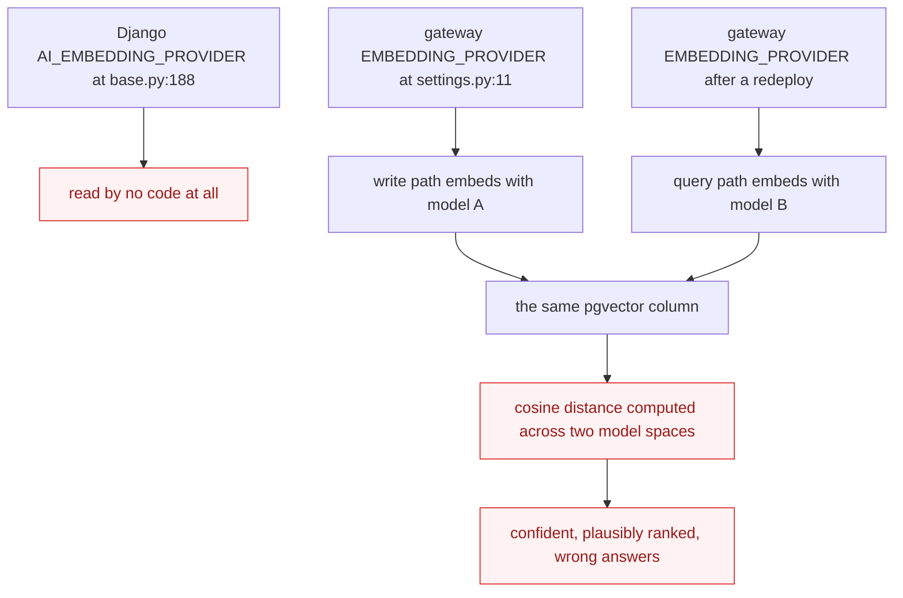

`AI_EMBEDDING_PROVIDER` is declared at [base.py:188](../backend/config/settings/base.py#L188) and read by nothing. The gateway carries its own `EMBEDDING_PROVIDER` at [settings.py:11](../ai/infrastructure/settings.py#L11). Two services, two switches, one shared vector column — and a mismatch is not an error condition. It returns rows, ranked plausibly. This is the failure mode that free-tier experimentation makes *more* likely, not less, because you will be switching providers often.

---

## 7 · The target architecture

### Module map

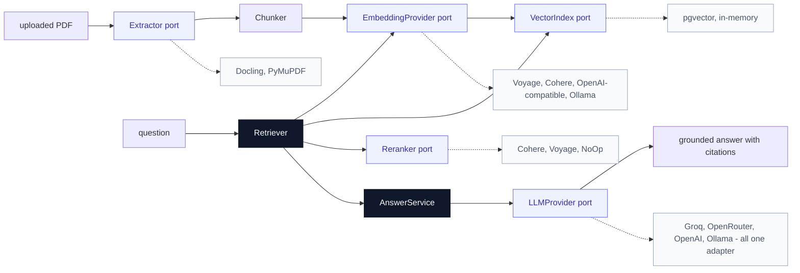

`Retriever` and `AnswerService` are the two **deep modules** here — small interfaces, substantial implementations. `Retriever.retrieve(question, access) -> list[RetrievedChunk]` hides recall, access filtering, reranking, and deduplication behind one call. `AnswerService.answer(question, user) -> Answer` hides retrieval, prompt assembly, the LLM call, and citation extraction.

Everything else in the diagram is a thin port whose job is to make one vendor look like every other vendor.

### The retrieval pipeline

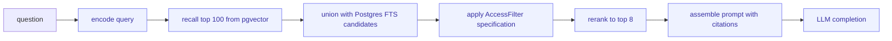

Two things about this ordering are load-bearing:

- **Access filtering happens before reranking, not after.** Filtering after would mean paying a vendor to rank documents the user is not allowed to see, and could return fewer than eight results with no way to top up.
- **Reranking sits strictly between recall and prompt assembly.** It is not a route and it cannot be a Django service — it has to live inside whatever owns retrieval. That is why the Cohere stub has been stranded in the Django app since it was written: there is no module that owns that span.

### Cutting over an embedding provider without downtime

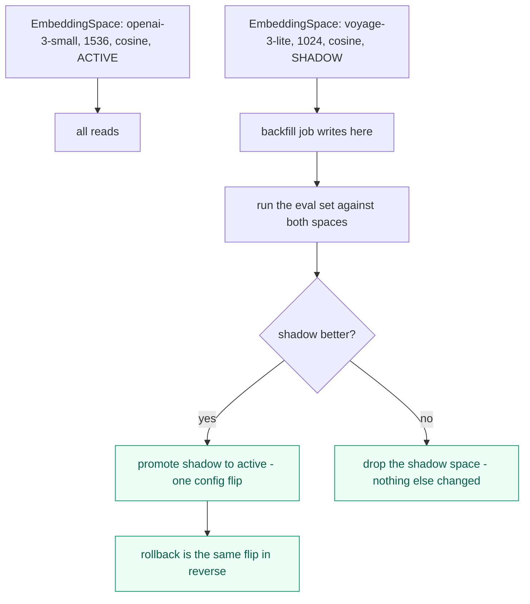

This is what makes free-tier experimentation safe. Without it, trying Voyage means destroying your OpenAI vectors first and hoping.

---

## 8 · Design patterns catalogue

Named patterns, where each one goes, and what it buys. The point of naming them is not ceremony — it is that each one is a well-understood shape a reviewer can check against.

### Structural

| Pattern | Where it goes | What it buys |
|---|---|---|
| **Ports & Adapters (Hexagonal)** | `ai/domain/ports.py` defines interfaces; `ai/infrastructure/*` implements them | Already the house style. Keep it. The domain never imports a vendor SDK. |
| **Adapter** | One per *wire protocol*, not per vendor | `OpenAICompatibleAdapter` covers six vendors. See section 2. |
| **Anti-Corruption Layer** | Inside each adapter: map vendor errors, retry semantics, and response shapes to domain types | A Cohere `TooManyRequestsError` and a Groq 429 become the same `RateLimited` at the seam. Vendor quirks never reach the domain. |
| **Facade** | `Retriever`, `AnswerService` | Deep modules. One method hides a five-stage pipeline. |
| **Repository** | `VectorIndex` port with `PgVectorIndex` and `InMemoryIndex` | Retrieval becomes testable without a database. Two implementations are what make the seam real. |
| **Value Object** | `EmbeddingSpace`, `Chunk`, `RetrievedChunk`, `Completion`, `CompletionResult`, `Usage` | Immutable, comparable, self-validating. `CompletionResult` carrying `usage` is what makes cost comparison possible at all. |

### Behavioural

| Pattern | Where it goes | What it buys |
|---|---|---|
| **Strategy** | Provider selection driven by config | Swapping Groq for OpenRouter is a `.env` edit. This is the pattern the current `if/else` factory is a broken version of. |
| **Abstract Factory + Registry** | Replace [dependencies.py:11-27](../ai/infrastructure/dependencies.py#L11-L27): adapters register themselves under a name; the factory looks the name up and **raises on an unknown key** | Open/closed — a new vendor is a new registration, not an edit to a growing `if/else`. And a typo in `LLM_PROVIDER` fails loudly instead of silently falling back to the mock adapter. |
| **Null Object** | `NoOpReranker` implementing `Reranker` by returning its input unchanged | Reranking is optional without a single `if reranker is not None:` anywhere in the pipeline. |
| **Decorator** | `Retrying`, `Timeout`, `RateLimited`, `Budgeted`, `Traced` — each wrapping any provider and implementing the same port | **The highest-leverage pattern here.** Write retry logic once and it applies to every vendor on every port, instead of six adapters each getting it slightly wrong. |
| **Chain / Pipeline** | The retrieval stages in section 7 | Each stage is independently testable. Inserting reranking is inserting a link, not editing a method. |
| **Template Method** | `BatchingEmbeddingProvider` base class owning chunk-to-batch-size, concurrency, and backoff; subclasses implement only `_embed_batch` | Batching is written once. A new embedding vendor gets correct throttling for free. |
| **Specification** | `AccessFilter` — the user's permissions as an object that compiles to a SQL `WHERE` clause | Permissions get pushed into the same query as the vector search rather than filtering in Python afterwards. |

### Resilience and operations

| Pattern | Where it goes | What it buys |
|---|---|---|
| **Result / typed errors** | Ports return or raise a closed set: `Ok`, `RateLimited`, `Transient`, `Permanent` | A 400 stops consuming retry budget. Today [tasks.py](../backend/apps/ai/tasks.py) retries *everything* on a 60-second countdown, including failures that will never succeed. |
| **Circuit Breaker** | A decorator around each vendor adapter | A vendor outage trips the breaker and the system degrades to Postgres FTS instead of hanging on every request. |
| **Bulkhead** | Separate concurrency budgets for the indexing lane and the query lane | A bulk backfill cannot starve interactive question-answering of rate-limit headroom. |
| **Feature Toggle / Shadow Mode** | `EmbeddingSpace` with `active` and `shadow` states | A/B a new provider on live traffic with no user impact and a one-flip rollback. |
| **Idempotency key** | Embedding jobs keyed on `(record_id, space_id, content_hash)` | Re-running a backfill is safe and does not pay twice. On a free tier, double-spending your allowance ends the experiment. |
| **Dependency Injection** | FastAPI `Depends`, already in use at [chat.py:13](../ai/api/chat.py#L13) | Correct in the routes. Undermined by the module-global singletons behind it. |

### The decorator stack, concretely

```mermaid
flowchart LR
  CALL["Retriever calls the port"] --> TR["Traced - emits span and usage"]
  TR --> BU["Budgeted - refuses past the monthly cap"]
  BU --> CB["CircuitBreaker - short-circuits during an outage"]
  CB --> RL["RateLimited - token bucket per vendor"]
  RL --> RT["Retrying - backoff on Transient only"]
  RT --> TO["Timeout"]
  TO --> AD["CohereEmbedder - transport and mapping only"]
  AD --> V["vendor API"]
  classDef deco fill:#eef2ff,stroke:#6366f1,color:#3730a3;
  classDef core fill:#0f172a,stroke:#0f172a,color:#f8fafc;
  class TR,BU,CB,RL,RT,TO deco
  class AD core
```

Every one of those six decorators is written exactly once and composes over **every** provider on **every** port. The adapter at the bottom is left with only transport and error mapping — which is exactly the amount of work adding a new vendor should cost.

`Budgeted` deserves a specific mention given the free-tier goal: a decorator that tracks token spend against a configured monthly cap and refuses calls past it is the difference between "we exhausted the free allowance during a runaway backfill" and "the backfill stopped cleanly at 90% of the allowance and told us."

---

## 9 · The nine prerequisites

These are ordered by dependency, not by importance. Strength badges follow the review convention: **Strong** means the friction is real and confirmed in the code; **Worth exploring** means the case is good but the trade-off is genuine.

### P1 · `EmbeddingSpace` must be a concept, not a schema constant — **Strong**

**Files:** [backend/apps/ai/models/embedding.py:6-8](../backend/apps/ai/models/embedding.py#L6-L8) · [migrations/0002_embeddingjob_recordembedding.py:37](../backend/apps/ai/migrations/0002_embeddingjob_recordembedding.py#L37) · [base.py:190](../backend/config/settings/base.py#L190)

**Problem.** The thing that varies between providers — dimension, model identity, distance metric — is expressed in the schema rather than in data.

```python
record     = models.OneToOneField("records.Record", ...)   # one vector per record, structurally
embedding  = VectorField(dimensions=settings.AI_EMBEDDING_DIMENSIONS)
model_name = models.CharField(max_length=100)              # stored, never read
```

Three consequences. The `OneToOneField` makes "two embeddings for one record" *unrepresentable*, so there is no shadow index and no A/B. The migration hardcodes `dimensions=1536` while the model reads a setting — they can silently disagree. And `vector_cosine_ops` is fixed in the HNSW index at [line 19](../backend/apps/ai/models/embedding.py#L19).

Every embedding vendor in section 2 is a different dimension: Cohere and Voyage are 1024, OpenAI `3-large` is 3072.

**Solution.** Make `EmbeddingSpace` a first-class entity — `model_id`, `dimensions`, `metric`, `state` in `{active, shadow, retired}` — and key vectors by it, `ForeignKey` not `OneToOne`. Vectors of different dimensions live in per-space tables or a `vector` column per space.

**Wins.** Locality: dimension, metric, and model identity live in one place. Leverage: one concept makes every embedding vendor a reversible experiment. `model_name` stops being decoration and becomes a filter. And a rollback is a config flip rather than a migration.

> **This is the prerequisite that makes free-tier evaluation possible at all.** Comparing Voyage against Cohere requires holding both sets of vectors simultaneously. Today that is structurally forbidden.

---

### P2 · One provider switch, read by both paths — **Strong**

**Files:** [base.py:188-190](../backend/config/settings/base.py#L188-L190) · [ai/infrastructure/settings.py:10-11](../ai/infrastructure/settings.py#L10-L11)

**Problem.** Two services, two independent provider switches, one shared vector column — and the Django one is read by no code at all. A mismatch between the write path and the read path is silent: cosine distance across two model spaces still returns rows, ranked plausibly. See the diagram in section 6.

**Solution.** The active `EmbeddingSpace` is the single source of truth, read by both write and read paths, with a **startup assertion** that the configured space matches what the stored vectors were written with. Delete `AI_EMBEDDING_PROVIDER` from Django settings.

**Pattern:** fail-fast configuration validation. **Wins.** A mismatch becomes a boot failure rather than a slow quality regression nobody attributes to the right cause. Deletion test: removing the unread setting concentrates configuration in one place rather than moving it.

---

### P3 · Build the `VectorIndex` port — and then do not use it for Pinecone — **Worth exploring**

**Files:** `ai/infrastructure/persistence/` (empty) · [records/models.py:141,147](../backend/apps/records/models.py#L141) · [records/services.py:12-14](../backend/apps/records/services.py#L12-L14)

**Problem.** Nothing in `ai/` queries Postgres yet, so the vector store is not a seam — it is about to be inline SQL in a route handler. That makes any hosted store a rewrite rather than an adapter swap.

But the reverse is equally true. Records carry a GIN-indexed FTS `search_vector`, weighted title-A and abstract-B, and access control lives in Postgres rows:

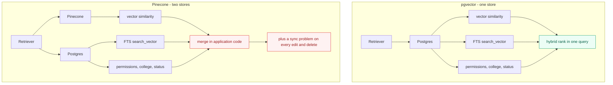

**Solution.** Build the `VectorIndex` module with a **pgvector implementation and an in-memory one**. Two implementations make the seam real, and the in-memory one makes retrieval testable without a database. Treat a hosted store as a decision to revisit only if the corpus grows two orders of magnitude.

**Pattern:** Repository, with a test double that is a real implementation rather than a mock.

**On Pinecone's free tier specifically:** it would comfortably hold 120k vectors at no cost. The cost is architectural — the merge, the sync, and the loss of "filter by permission inside the same query." That is a bad trade at this scale even at a price of zero.

---

### P4 · Cohere Rerank is the best value here, and it has nowhere to sit — **Strong**

**Files:** [backend/apps/ai/services/cohere_reranker.py](../backend/apps/ai/services/cohere_reranker.py) (stub, unused) · `ai/services/` (empty)

**Problem.** The stub is `class CohereReranker: pass`, sitting in the Django app — which is on the *write* path and never sees a query. Reranking is a query-time step strictly between vector recall and prompt assembly. No module owns that span, so the stub has been stranded since the day it was written.

**Solution.** `Retriever` (P3) is the prerequisite. Reranking becomes a `Reranker` port used inside it, with `NoOpReranker` as the default (Null Object) and the recall width raised from 8 to ~100 to give the reranker something to work with. Delete the Django stub.

**Wins.** Typically a larger quality gain than any embedding upgrade. Priced per search, so cost scales with queries rather than corpus — about $4/month at IRIS volume, and free during evaluation. Keep the port internal to `Retriever` until a second reranker is real.

---

### P5 · You cannot compare inference vendors through a port that returns `str` — **Strong**

**Files:** [ai/domain/ports.py:9](../ai/domain/ports.py#L9) · [ai/infrastructure/openai_adapter.py:11-26](../ai/infrastructure/openai_adapter.py#L11-L26)

**Before:**
```python
async def generate_response(self, prompt: str, context: str = "") -> str
```

No token counts, so no cost comparison. No latency or finish reason, so no SLO. No streaming, so a hosted model's first-token advantage is invisible to the UI. And the system prompt is written inside the adapter at [line 13](../ai/infrastructure/openai_adapter.py#L13), so switching vendors silently changes the prompt — which quietly invalidates any comparison you were trying to run.

**After:**
```python
async def complete(self, request: Completion) -> CompletionResult
    # CompletionResult carries: text, usage, latency_ms, finish_reason, model_id
```

**Solution.** Widen the result, narrow the responsibility. Prompt assembly moves up into `AnswerService`; adapters carry transport and error mapping only.

**Patterns:** Value Object (`Completion`, `CompletionResult`, `Usage`); Template Method for the shared OpenAI-compatible transport.

**Wins.** Cost per answer becomes measurable per vendor — which is the only way "is Groq cheaper than OpenRouter for us" becomes a question with an answer. Leverage: one prompt definition, N adapters. Streaming becomes expressible without changing every caller.

---

### P6 · Third-party means the network fails, and there is no failure contract — **Strong**

**Files:** [backend/apps/ai/tasks.py:25](../backend/apps/ai/tasks.py#L25) · both adapters

**Problem.** The only timeout in the entire pipeline is `timeout=60.0` on one `httpx.post` at [tasks.py:25](../backend/apps/ai/tasks.py#L25). The retry policy is a blanket `self.retry(countdown=60)` that re-runs the whole task on **any** exception — including a 400 that will never succeed. The gateway adapters set no timeouts at all.

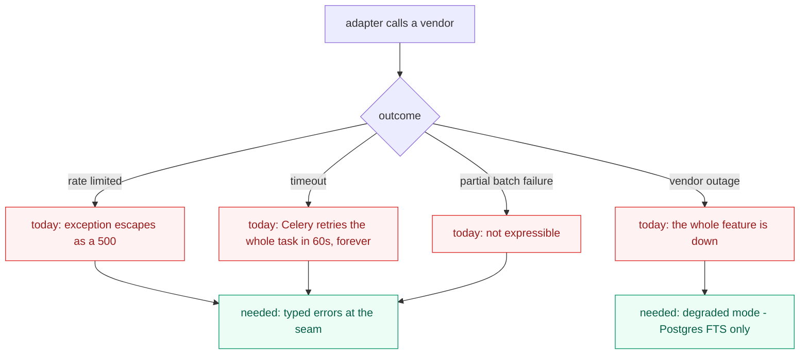

**Every vendor on the shortlist rate-limits, and free tiers rate-limit hardest.** This prerequisite is not optional if the plan is to run on free tiers.

**Solution.** A typed error vocabulary at the ports — `RateLimited`, `Transient`, `Permanent` — with timeouts, backoff, and circuit breaking implemented **once** as decorators (section 8), and a documented degraded mode where retrieval falls back to the existing Postgres FTS when a vendor is unreachable.

**Wins.** Permanent failures stop consuming retry budget. Locality: vendor quirks stay inside their adapter. Search degrades instead of disappearing.

---

### P7 · Sending unpublished IP to a vendor is a policy decision with no place to be made — **Strong**

**Files:** [backend/apps/records/models.py](../backend/apps/records/models.py) · [backend/core/permissions.py](../backend/core/permissions.py) · every adapter

**Problem.** IRIS holds pre-publication research and IP disclosures for a university technology transfer office. Every hosted service in this document means that text crosses an organisational boundary. There is no module that can express *"this record may not leave our infrastructure."* Vendor no-training terms are a contract, not an enforcement mechanism.

**Solution.** A `DisclosurePolicy` module consulted at every outbound seam:

```
DisclosurePolicy.allows(record, destination) -> bool
    considers: IP status · embargo date · destination residency · author consent
```

Records it refuses route to the local Ollama lane. Everything else may use a vendor.

**Pattern:** Specification, evaluated at the boundary; combined with Strategy for destination routing.

**Wins.** This is the concrete reason the model-agnostic design earns its keep — not vendor pricing, but the ability to **route by sensitivity**. It also makes a KTTO or IERC review of the AI feature answerable, which the SRS security section will eventually require.

> Also worth confirming the vendor terms you intend to rely on. Several vendors offer no-training tiers, but that is typically an explicit account setting rather than the default, and free tiers are frequently *excluded* from those terms. **Check this before putting any real abstract through a free tier.**

---

### P8 · Rate limits and spend have no home, and indexing is where they bite — **Worth exploring**

**Files:** [ai/domain/ports.py:20](../ai/domain/ports.py#L20) · [backend/apps/ai/tasks.py](../backend/apps/ai/tasks.py)

**Problem.** `generate_embedding(text)` takes one string.

| Quantity | Value |
|---|---|
| Documents | 3,000 |
| Chunks each | ~40 |
| **Single-item HTTP calls, one Celery task at a time** | **120,000** |

Batching, concurrency limits, backoff, and spend tracking end up spread across whichever caller happens to loop — and the backfill that follows any provider switch is the worst case for all four. On a free tier it is also the fastest way to exhaust an allowance by accident.

**Solution.** A batched embedding port that owns chunk-to-batch-size, concurrency, and backoff (Template Method), with a token counter reported per job and a `Budgeted` decorator enforcing a cap.

**Wins.** Backfill time drops by more than an order of magnitude. Spend per re-index becomes a number you know *before* you commit. The interface shrinks while the implementation absorbs the throttling — the definition of deepening a module.

---

### P9 · Without a retrieval eval set, every vendor choice is a guess — **Strong**

**Files:** no test files exist anywhere under `backend/apps/` · `ai/tests/`

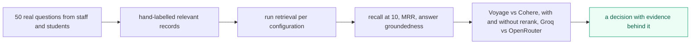

**Problem.** There are no tests anywhere in the backend apps and no eval harness. Every claim in section 2 — including the ones in this document — is a prior, not a measurement on your corpus. Research abstracts in a Philippine university repository are a specific domain, and vendor leaderboards are not.

**Solution.** Fifty labelled questions and a script reporting recall-at-10 per configuration. That is roughly a day of work and it converts the entire vendor question from taste into arithmetic. Langfuse self-hosted or Phoenix can host the traces, but **the labelled set is the part that matters.**

**Wins.** The eval set becomes the test surface for the whole retrieval path. A provider swap that regresses quality gets caught before users see it. And "is rerank worth the spend" becomes a measurable question rather than an argument.

---

### Dependency order

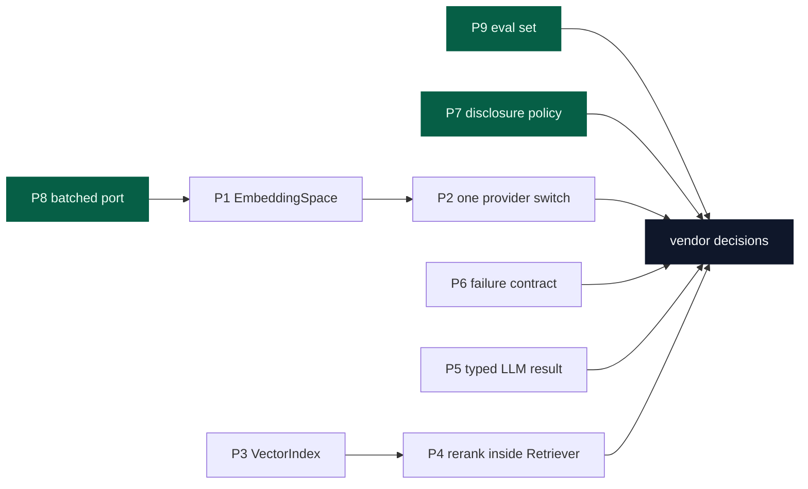

Green nodes need nothing else first. **P7 and P9 can start today**, without touching the gateway that does not currently boot.

---

## 10 · Free-tier rollout plan

Four phases. Nothing is paid for until phase 3, and phase 3 is optional.

### Phase 0 — Make it boot, and decide the policy · *no vendor accounts needed*

| Task | Prereq | Why now |
|---|---|---|
| Fix the three import failures in `ai/api/schemas.py` and `ai/api/chat.py` | — | Nothing else can be tested until the gateway starts |
| Write the fifty-question eval set with hand-labelled relevant records | P9 | The longest-lead item and it needs humans, not code. Start it first. |
| Write `DisclosurePolicy` and decide which record states may leave campus | P7 | Determines whether you may put real abstracts through a free tier at all |
| Make `LocalLLMProvider` actually call Ollama instead of returning a mock string | — | Gives you a real second implementation, which is what proves the port shape |

**Exit criterion:** `docker compose up ai-gateway` succeeds and `/health` responds; the eval set exists as a file; a written answer to "may an embargoed record's abstract be sent to a US vendor?"

### Phase 1 — Restructure for reversibility · *still no vendor accounts*

| Task | Prereq |
|---|---|
| `EmbeddingSpace` as an entity; `RecordEmbedding.record` becomes a `ForeignKey` | P1 |
| Delete `AI_EMBEDDING_PROVIDER`; one source of truth plus a startup assertion | P2 |
| Registry-based provider factory; unknown provider name raises | — |
| `OpenAICompatibleAdapter` replacing the per-vendor LLM adapters | — |
| `CompletionResult` with `usage`, `latency_ms`, `finish_reason`; prompt assembly moves to `AnswerService` | P5 |
| `VectorIndex` port with `PgVectorIndex` and `InMemoryIndex` | P3 |
| `Retriever` facade; `Reranker` port with `NoOpReranker` default | P3, P4 |
| Typed errors plus the decorator stack: `Timeout`, `Retrying`, `RateLimited`, `CircuitBreaker`, `Budgeted`, `Traced` | P6 |
| Batched embedding port via a `BatchingEmbeddingProvider` base | P8 |

**Exit criterion:** the same contract test suite passes against both `InMemoryIndex` and `PgVectorIndex`, and against both the local and OpenAI-compatible LLM adapters. **That is the test that proves the seams are real.**

### Phase 2 — Evaluate on free tiers · *sign up, spend nothing*

| Step | Vendor | Free-tier fit |
|---|---|---|
| Embed the full corpus into a **shadow** `EmbeddingSpace`, and embed queries with **the same model** | **Voyage** | The only free allowance large enough for a corpus-scale backfill |
| **Add reranking over the top 100 and re-run the eval — do this before touching the embedder** | **Cohere Rerank** trial, or **Pinecone Inference** | Per-query, so fifty questions is fifty calls. Composes with any embedding space, so it needs no re-indexing. |
| *Optional:* build a second complete space on a 300–500 record subset to compare embedders | **Cohere** trial key | A subset keeps both the corpus embed and the query embed inside the trial cap |
| Compare answer quality and latency across inference vendors | **Groq** free tier vs **OpenRouter** `:free` models | Both free; both behind the same adapter, so it is a config change |
| Record recall-at-10, MRR, latency, and token spend per configuration | — | This table is the deliverable of phase 2 |

**Exit criterion:** a table with a number in every cell, and a decision that cites it.

### Phase 3 — Promote what won · *first real spend, roughly $10/month*

Promote the winning `EmbeddingSpace` from shadow to active — one config flip, with the reverse flip available as rollback. Upgrade whichever trial keys the evaluation justified to paid keys. Set the `Budgeted` decorator's monthly cap slightly above the measured spend, so a runaway job trips a limit instead of a credit card.

Keep the local Ollama lane running throughout. It is not a fallback for cost reasons — it is where `DisclosurePolicy` routes anything that may not leave campus.

---

## 11 · Programming practices this design assumes

These are the non-negotiables that make the patterns above hold up. Most are cheap; all of them are cheaper now than after the vendor integrations land.

**Configuration**
- One source of truth per setting. A setting read by nothing is deleted, not left "for later."
- Validate configuration at startup and **crash on invalid**. An unknown provider name must raise, never fall through to a default.
- Secrets come from the environment, never from code, and never from a tracked `.env`.
- The active `EmbeddingSpace` is asserted against stored vector metadata at boot.

**Types and contracts**
- Domain types at the ports, not primitives. `str` in and `str` out is how P5 lost the ability to compare vendors.
- A closed error vocabulary at every seam. Vendor exception types never escape their adapter.
- Ports are `ABC`s with real docstrings stating the contract, including what may be raised.

**Testing**
- **One contract test suite per port, run against every adapter.** This is what makes the seam real rather than hypothetical.
- Test doubles are real in-memory implementations, not mocks. `InMemoryIndex` is a fake, not a `MagicMock`, so tests break when the contract changes rather than when the call sequence changes.
- The eval set (P9) is a test, not a spreadsheet. It runs in CI, even if only nightly.
- Vendor calls never happen in unit tests. Contract tests against live vendors are a separate, opt-in suite.

**Operations**
- Structured logging with a trace id carried from the HTTP request through to the vendor call.
- Token usage and latency recorded per call, per vendor, per model. Without this, cost is a surprise on a statement.
- A monthly spend cap enforced in code, not in a dashboard you remember to check.
- Idempotency keys on every job that costs money.

**Code organisation**
- The domain layer imports no vendor SDK. Ever. If `ai/domain/` grows an `import cohere`, the design has failed.
- Adapters contain transport and mapping only — no business rules, no prompt text, no retry logic (that is a decorator's job).
- One adapter per protocol, not per vendor.

---

## 12 · Decisions worth recording as ADRs

`docs/adr/` does not exist yet. These four are worth creating it for, because each one will otherwise be re-litigated by every future review — including this one's successors.

| ADR | Decision | Why it needs writing down |
|---|---|---|
| **Stay on pgvector; do not adopt a dedicated vector store** | pgvector until the corpus grows two orders of magnitude | Pinecone's free tier is genuinely attractive and someone will propose it again. The reason to decline is architectural, not financial, and that reasoning is not obvious from the code. |
| **`EmbeddingSpace` as a first-class entity** | Vectors are keyed by space; spaces have lifecycle states | Folds in the chunk-granularity decision from the earlier RAG review, since both are settled by the same re-index. |
| **`DisclosurePolicy` governs every outbound seam** | Record sensitivity determines destination, not configuration | This is the one with legal and institutional weight. It is probably the ADR the SRS security section actually needs. |
| **Adapters key on wire protocol, not vendor** | One `OpenAICompatibleAdapter` for six vendors | Prevents the adapter-per-vendor sprawl from growing back the next time someone adds a provider. |

---

## 13 · Verification

**Phase 0.** `docker compose up ai-gateway db redis` starts cleanly and `GET /health` returns 200. `ai/tests/` contains the eval set with fifty labelled questions.

**Phase 1.** The contract test suite passes identically against `InMemoryIndex` and `PgVectorIndex`, and against both LLM adapters. Setting `LLM_PROVIDER=nonsense` fails at startup with a clear message rather than silently serving the local mock. `grep -rn "AI_EMBEDDING_PROVIDER" backend/` returns nothing.

**Phase 2.** The eval script runs end to end and emits recall-at-10, MRR, and token spend per configuration. Two `EmbeddingSpace` rows exist simultaneously — one `active`, one `shadow` — and retrieval reads only the active one, provably.

**Phase 3.** Promoting the shadow space changes retrieval results and no code. Reverting the flip restores the previous results. Pulling the network cable on the vendor degrades search to Postgres FTS rather than returning a 500.

---

*Every file and line reference in this document was verified against the working tree on 2026-08-31 (branch `feat/rag-service`). Line numbers will drift as the code changes. Vendor pricing and free-tier limits were accurate at the time of writing and change frequently — verify before committing to a plan.*
