# Module 1 — Software Design Document: Backend Optimization & Responsive UI

---

## 3.2.1.1 — User Login and Session Management

### Registration and Email Verification

### User Interface Design

#### Front-end Components

**a. `SignupPage`**
`frontend/src/features/auth/SignupPage.tsx`

- **a.1** Multi-step registration form with Student / Adviser role tabs. Loads reference data (colleges, departments, courses) from the API on mount. Performs live field-level validation. On submit, calls `authApi.register()` and navigates to `/login` on success. `consent_given` is a required checkbox — the boolean value is included in the registration payload and validated and persisted by the backend.
- **a.2** React page component (default export) — route `/signup`

---

**b. `EmailVerifyPage`**
`frontend/src/features/auth/EmailVerifyPage.tsx`

- **b.1** Activated when the user clicks the verification link from their email. Reads `uidb64` and `token` from the URL via `useParams`. Calls `authApi.activate()` on mount and renders one of three states: loading spinner, success with "Sign In" button, or error with "Register Again" option.
- **b.2** React page component (default export) — route `/activate/:uidb64/:token`

---

**c. `authApi`** *(register and activate functions)*
`frontend/src/api/auth.ts`

- **c.1** Thin wrapper over `apiClient`. `register(payload)` POSTs to `/auth/register/`; `activate(uidb64, token)` GETs `/auth/activate/{uidb64}/{token}/`.
- **c.2** API client module — plain object of typed Axios functions

---

**d. `accountsApi`** *(colleges, departments, courses)*
`frontend/src/api/accounts.ts`

- **d.1** Fetches reference data for the signup form's cascading dropdowns. `colleges()`, `departments(collegeId?)`, and `courses(deptId?)` hit the public reference endpoints (no auth token required).
- **d.2** API client module — plain object of typed Axios functions

---

#### Back-end Components

**a. `RegisterView`**
`backend/apps/accounts/views.py`

- **a.1** Handles `POST /api/v1/auth/register/`. Wraps the entire creation in `transaction.atomic()` so that a crash during email dispatch rolls back the user and role request rows. Delegates field validation and object creation to `RegisterSerializer`, then calls `send_verification_email()`.
- **a.2** DRF `generics.CreateAPIView` — permission: `AllowAny`

---

**b. `RegisterSerializer`**
`backend/apps/accounts/serializers.py`

- **b.1** Validates the registration payload: email uniqueness, password length (min 8), password confirmation match, and role-specific required fields (`course_id` for Students; `college_id` + `department_id` for Advisers). In `create()`, pops non-model fields, hashes the password, saves the `User` row, and creates either a `StudentProfile` or `AdviserProfile`. Stashes `role_name` on `self._role_name` for the view's `perform_create` to read.
- **b.2** DRF `ModelSerializer` subclass

---

**c. `send_verification_email`**
`backend/apps/accounts/services.py`

- **c.1** Builds an HMAC-signed verification link: encodes the user PK as `uidb64` and generates a time-limited token with `default_token_generator.make_token(user)`. Constructs the full link as `{FRONTEND_URL}/activate/{uid}/{token}` and dispatches it via `send_email_async()` (non-blocking).
- **c.2** Service function — called inside `transaction.atomic()` in `RegisterView.perform_create`

---

**d. `activate_user`**
`backend/apps/accounts/services.py`

- **d.1** Decodes `uidb64` → `user.pk`, fetches the `User` row, and validates the HMAC token with `default_token_generator.check_token(user, token)` (Django default: 3-day expiry). On success, sets `user.is_verified = True` and saves. Returns the `User` on success, `None` on any failure.
- **d.2** Service function — called by `ActivateView`

---

**e. `ActivateView`**
`backend/apps/accounts/views.py`

- **e.1** Handles `GET /api/v1/auth/activate/<uidb64>/<token>/`. Delegates entirely to `activate_user()`. Returns `200` on success or `400` on any failure (invalid UID, user not found, expired/tampered token).
- **e.2** DRF `APIView` — permission: `AllowAny`

---

**f. `send_email_async`**
`backend/core/utils.py`

- **f.1** Dispatches `send_email_task.delay()` to Celery. Falls back to a synchronous `send_mail()` (with `fail_silently=True`) if the Celery broker is unreachable, so email is never silently dropped in development.
- **f.2** Utility function

---

**g. `send_email_task`**
`backend/apps/accounts/tasks.py`

- **g.1** Celery task that calls Django's `send_mail()`. Bound with `max_retries=3` and `default_retry_delay=30` — retries up to three times with 30-second back-off on transient SMTP failures.
- **g.2** Celery `@shared_task` (bind=True)

---

### Object-Oriented Components

#### a. Class Diagram

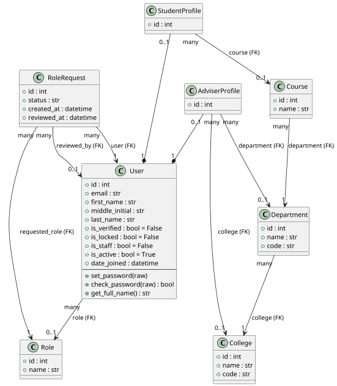

#### b. Sequence Diagrams

##### Registration

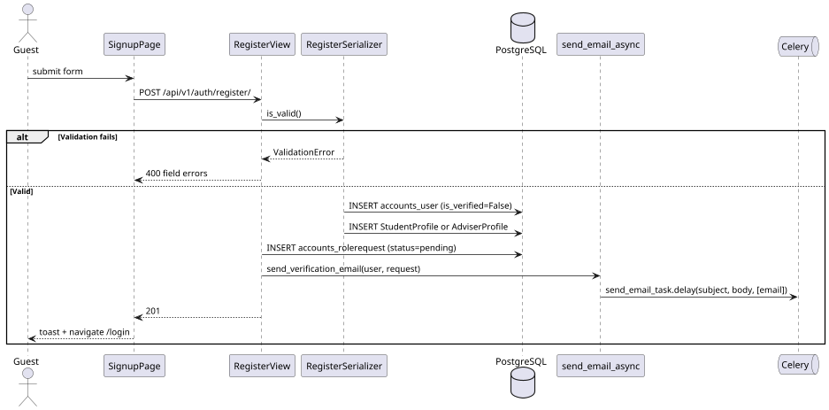

##### Email Verification

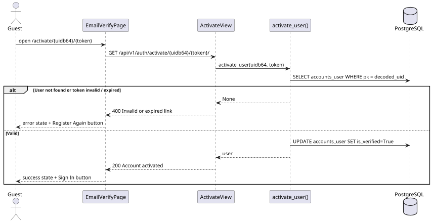

### Data Design

#### a. Schema

**`accounts_user`**

| Column | Type | Constraints |
|---|---|---|
| `id` | `integer` | PK, auto-increment |
| `email` | `varchar(254)` | UNIQUE, NOT NULL |
| `first_name` | `varchar(100)` | NOT NULL |
| `middle_initial` | `varchar(20)` | nullable |
| `last_name` | `varchar(100)` | NOT NULL |
| `role_id` | `integer` | FK → `accounts_role.id`, SET NULL |
| `password` | `varchar(128)` | NOT NULL (PBKDF2-SHA256 hash) |
| `is_verified` | `boolean` | DEFAULT FALSE |
| `is_locked` | `boolean` | DEFAULT FALSE |
| `is_staff` | `boolean` | DEFAULT FALSE |
| `is_active` | `boolean` | DEFAULT TRUE |
| `is_superuser` | `boolean` | DEFAULT FALSE |
| `last_login` | `timestamptz` | nullable |
| `date_joined` | `timestamptz` | auto_now_add |

**`accounts_role`**

| Column | Type | Constraints |
|---|---|---|
| `id` | `integer` | PK, auto-increment |
| `name` | `varchar(50)` | UNIQUE, NOT NULL |

> Seeded values: `Student`, `Adviser`, `KTTO`, `RDCO`, `ITSO`, `IERC`

**`accounts_rolerequest`**

| Column | Type | Constraints |
|---|---|---|
| `id` | `integer` | PK, auto-increment |
| `user_id` | `integer` | FK → `accounts_user.id`, CASCADE |
| `requested_role_id` | `integer` | FK → `accounts_role.id`, CASCADE |
| `status` | `varchar(10)` | DEFAULT `'pending'`; choices: `pending`, `approved`, `declined` |
| `reviewed_by_id` | `integer` | FK → `accounts_user.id`, SET NULL, nullable |
| `created_at` | `timestamptz` | auto_now_add |
| `reviewed_at` | `timestamptz` | nullable |

**`accounts_studentprofile`**

| Column | Type | Constraints |
|---|---|---|
| `id` | `integer` | PK, auto-increment |
| `user_id` | `integer` | FK → `accounts_user.id`, CASCADE, UNIQUE (OneToOne) |
| `course_id` | `integer` | FK → `accounts_course.id`, SET NULL, nullable |

**`accounts_adviserprofile`**

| Column | Type | Constraints |
|---|---|---|
| `id` | `integer` | PK, auto-increment |
| `user_id` | `integer` | FK → `accounts_user.id`, CASCADE, UNIQUE (OneToOne) |
| `department_id` | `integer` | FK → `accounts_department.id`, SET NULL, nullable |
| `college_id` | `integer` | FK → `accounts_college.id`, SET NULL, nullable |

**`accounts_college`** / **`accounts_department`** / **`accounts_course`**

| Column | Type | Constraints |
|---|---|---|
| `id` | `integer` | PK, auto-increment |
| `name` | `varchar(200)` | NOT NULL |
| `code` | `varchar(20)` | UNIQUE (college, department only) |
| `college_id` | `integer` | FK → `accounts_college.id` (department only) |
| `department_id` | `integer` | FK → `accounts_department.id` (course only) |

---

### User Login and Role Approval Gate

### User Interface Design

#### Front-end Components

**a. `LoginPage`**
`frontend/src/features/auth/LoginPage.tsx`

- **a.1** Email + password form using `react-hook-form` with Zod validation. Calls `authApi.login()`. On success, calls `useAuth().login(user, access, refresh)` which persists both tokens to `localStorage` and Zustand. Navigates to `/` and lets `AppShell` determine whether to show the app or the pending approval screen.
- **a.2** React page component (default export) — route `/login`

---

**b. `useAuth` hook**
`frontend/src/hooks/useAuth.ts`

- **b.1** Thin selector over `useAuthStore`. Exposes `user`, `isAuthenticated`, `login()`, `logout()`, and `updateUser()` without requiring components to import the store directly.
- **b.2** React custom hook

---

**c. `useAuthStore`**
`frontend/src/store/auth.store.ts`

- **c.1** Zustand store with `persist` middleware. Holds `user`, `accessToken`, `refreshToken`, and `isAuthenticated`. `login()` writes both tokens to `localStorage` and updates state. `logout()` clears both. Persisted to `localStorage` under key `iris-auth`.
- **c.2** Zustand store with `persist` middleware

---

**d. `AppShell`**
`frontend/src/components/layout/AppShell.tsx`

- **d.1** Wraps all authenticated routes. After a successful login, evaluates `isPending = user && !user.role && !user.is_staff && !user.is_superuser`. If true, renders `<PendingApprovalPage />` in place of all page content — the URL does not change. This gate is re-evaluated on every render, so the moment an admin approves the role and the user refreshes, the full app appears.
- **d.2** React layout component — rendered inside `<PrivateRoute>`

---

**e. `PrivateRoute`**
`frontend/src/router/PrivateRoute.tsx`

- **e.1** Reads `isAuthenticated` from `useAuth`. Renders `<Outlet />` for authenticated users; redirects to `/login` for unauthenticated users. Does not decode the JWT — relies on the Zustand persisted boolean.
- **e.2** React router wrapper component

---

**f. `PendingApprovalPage`**
`frontend/src/features/auth/PendingApprovalPage.tsx`

- **f.1** Shown to authenticated users whose role request has not been approved. Displays the user's name and email, a "what happens next" list, and a single Sign Out button that calls `authApi.logout(refresh)` then `useAuth().logout()`.
- **f.2** React page component (named export) — rendered by `AppShell`, not a route

---

**g. `authApi`** *(login function)*
`frontend/src/api/auth.ts`

- **g.1** `login({email, password})` POSTs to `/auth/login/` and returns `{ access, refresh, user }`. Used by `LoginPage`.
- **g.2** API client function

---

**h. `authSession`**
`frontend/src/lib/authSession.ts`

- **h.1** Exports `redirectToLoginSessionExpired()` which navigates to `/login?reason=session_expired`. Also defines `sessionStorage`-based login attempt tracking functions (`getLoginAttempts`, `incrementLoginAttempts`, `isAccountLocked`, etc.) — these are currently unused by `LoginPage` but available for future frontend-side lockout UX.
- **h.2** Utility module

---

#### Back-end Components

**a. `LoginView`**
`backend/apps/accounts/views.py`

- **a.1** Handles `POST /api/v1/auth/login/`. Calls `django.contrib.auth.authenticate(request, username=email, password=password)`, which invokes `AxesStandaloneBackend` first (brute-force check) then `ModelBackend` (credential verify). On success, checks `user.is_verified` and `user.is_locked`, issues a JWT pair via `RefreshToken.for_user(user)`, and writes a `LOGIN` audit event.
- **a.2** DRF `APIView` — permission: `AllowAny`

---

**b. `AxesStandaloneBackend`** *(django-axes)*
`axes.backends.AxesStandaloneBackend`

- **b.1** First entry in `AUTHENTICATION_BACKENDS`. Checks `axes_accessattempt` for the (email + IP) combination. Raises `PermissionDenied` if `failures >= AXES_FAILURE_LIMIT` (default 3), causing `LoginView` to return `403`. On a successful authentication downstream, `AXES_RESET_ON_SUCCESS=True` deletes the attempt record. Lockout auto-expires after `AXES_COOLOFF_TIME` (default 10 minutes).
- **b.2** Django authentication backend (third-party — `django-axes`)

---

**c. `create_audit_event`**
`backend/apps/audit/services.py`

- **c.1** Persists one `AuditEvent` row. Called with `"LOGIN"` or `"LOGOUT"` from auth views. Never raises — audit failures are silently swallowed to keep the main request path intact.
- **c.2** Service function

---

**d. `RoleRequestDetailView`** *(admin approve/decline)*
`backend/apps/accounts/views.py`

- **d.1** Handles `PATCH /api/v1/users/role-requests/<pk>/` with `{ "action": "approve" | "decline" }`. Delegates to `approve_role_request()` or `decline_role_request()` in `services.py`. `approve_role_request` sets `user.role = role_request.requested_role` and sends an approval email.
- **d.2** DRF `APIView` — permission: `IsAuthenticated`, `IsAdminUser`

---

### Object-Oriented Components

#### a. Class Diagram

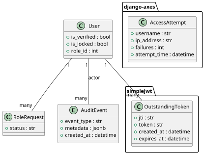

#### b. Sequence Diagram

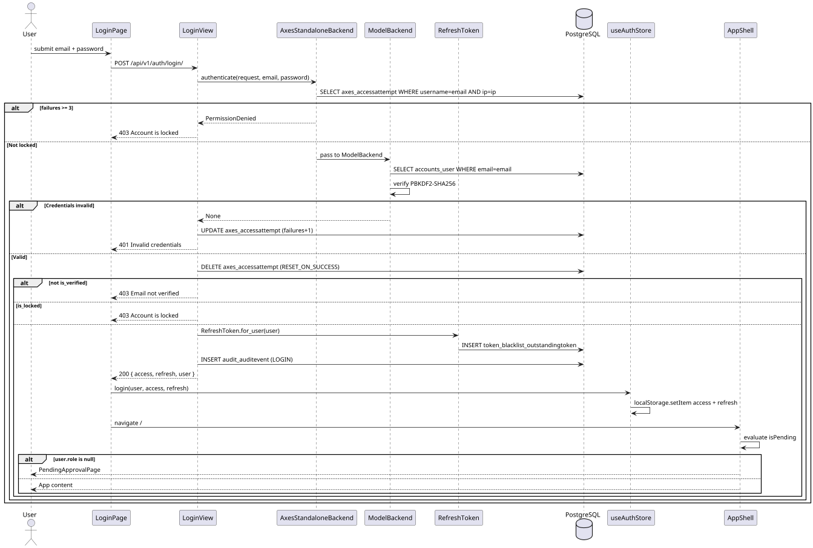

### Data Design

#### a. Schema

**`axes_accessattempt`** *(managed by django-axes)*

| Column | Type | Constraints |
|---|---|---|
| `id` | `integer` | PK |
| `username` | `varchar(255)` | indexed — stores the email |
| `ip_address` | `varchar(39)` | indexed |
| `failures` | `integer` | DEFAULT 0 |
| `attempt_time` | `timestamptz` | last attempt timestamp |

**`audit_auditevent`**

| Column | Type | Constraints |
|---|---|---|
| `id` | `integer` | PK, auto-increment |
| `event_type` | `varchar(20)` | indexed; choices: LOGIN, LOGOUT, FAILED_LOGIN, PIN_GENERATED, PIN_VERIFIED, ACCESS, UPLOAD, DOWNLOAD, DELETE, RENAME, ROLE_CHANGE, ACCOUNT_LOCKED, ACCOUNT_UNLOCKED, SESSION_REVOKE |
| `user_id` | `integer` | FK → `accounts_user.id`, SET NULL, nullable |
| `record_id` | `integer` | FK → `records_record.id`, SET NULL, nullable |
| `metadata` | `jsonb` | DEFAULT `{}` |
| `created_at` | `timestamptz` | auto_now_add, indexed |

---

### Token Refresh and Logout

### User Interface Design

#### Front-end Components

**a. `apiClient` — response interceptor**
`frontend/src/api/client.ts`

- **a.1** Axios instance used by all API calls. The **request interceptor** reads `localStorage.access_token` and attaches `Authorization: Bearer <token>` to every outgoing request. The **response interceptor** catches `401` responses: sets `_retry` to prevent infinite loops, reads the stored refresh token, POSTs to `/auth/token/refresh/`, saves **both** new tokens (`access_token` and `refresh_token`) to `localStorage`, updates the auth store, and retries the original request. On refresh failure, calls `redirectToLoginSessionExpired()`.
- **a.2** Axios instance with request + response interceptors

---

**b. `Header`** *(Sign Out button)*
`frontend/src/components/layout/Header.tsx`

- **b.1** Renders the top navigation bar. The Sign Out button calls `authApi.logout(refresh)` with the stored refresh token, then calls `useAuth().logout()` which clears the Zustand store and `localStorage`.
- **b.2** React layout component

---

**c. `authApi`** *(logout, refreshToken)*
`frontend/src/api/auth.ts`

- **c.1** `logout(refresh)` POSTs `{ refresh }` to `/auth/logout/` with the access token in the `Authorization` header. `refreshToken(refresh)` POSTs to `/auth/token/refresh/` — used directly by the Axios response interceptor (not through `apiClient` to avoid intercept loops).
- **c.2** API client functions

---

#### Back-end Components

**a. `TokenRefreshView`** *(simplejwt built-in)*
`rest_framework_simplejwt.views.TokenRefreshView`

- **a.1** Handles `POST /api/v1/auth/token/refresh/`. Validates the submitted refresh token's signature and expiry, checks it is not in `BlacklistedToken`, issues a new access token (30 min) and a new refresh token (7 days), and blacklists the old refresh token (`BLACKLIST_AFTER_ROTATION=True`, `ROTATE_REFRESH_TOKENS=True`).
- **a.2** simplejwt built-in view — no custom code in IRIS

---

**b. `LogoutView`**
`backend/apps/accounts/views.py`

- **b.1** Handles `POST /api/v1/auth/logout/`. Calls `RefreshToken(refresh_str).blacklist()` to insert the token into `token_blacklist_blacklistedtoken`. Writes a `LOGOUT` audit event. Errors from an already-invalid or blacklisted token are silently swallowed — the endpoint always returns `200` to prevent information leakage.
- **b.2** DRF `APIView` — permission: `IsAuthenticated`

---

### Object-Oriented Components

#### a. Class Diagram

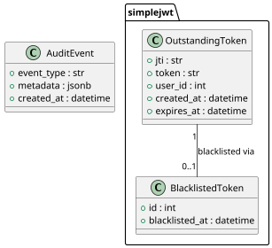

#### b. Sequence Diagrams

##### Silent Token Refresh

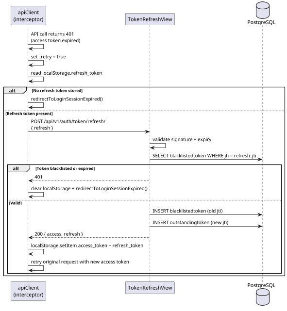

##### Logout

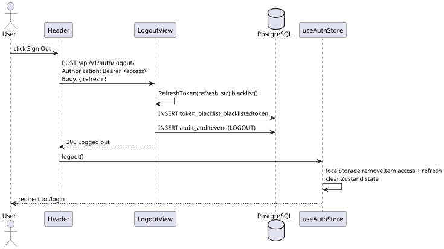

### Data Design

#### a. Schema

**`token_blacklist_outstandingtoken`** *(managed by simplejwt)*

| Column | Type | Constraints |
|---|---|---|
| `id` | `bigint` | PK |
| `jti` | `varchar(255)` | UNIQUE, indexed |
| `token` | `text` | the raw JWT string |
| `user_id` | `integer` | FK → `accounts_user.id`, CASCADE |
| `created_at` | `timestamptz` | |
| `expires_at` | `timestamptz` | indexed |

**`token_blacklist_blacklistedtoken`** *(managed by simplejwt)*

| Column | Type | Constraints |
|---|---|---|
| `id` | `bigint` | PK |
| `token_id` | `bigint` | FK → `token_blacklist_outstandingtoken.id`, UNIQUE, CASCADE |
| `blacklisted_at` | `timestamptz` | auto_now_add |

---

### Admin Session Management

### User Interface Design

#### Front-end Components

**a. `ActiveSessionsPage`** *(admin)*
`frontend/src/features/accounts/` *(routed under `/admin/sessions`)*

- **a.1** Fetches all active (non-expired, non-blacklisted) sessions via `accountsApi.sessions()`. Renders a table of JTI, user email, created/expires timestamps. Each row has a "Revoke" button that calls `accountsApi.revokeSession(jti)` and refreshes the list.
- **a.2** React page component — route `/admin/sessions`

---

**b. `accountsApi`** *(sessions, revokeSession)*
`frontend/src/api/accounts.ts`

- **b.1** `sessions()` GETs `/users/sessions/`; `revokeSession(jti)` DELETEs `/users/sessions/{jti}/`.
- **b.2** API client functions

---

#### Back-end Components

**a. `ActiveSessionsView`**
`backend/apps/accounts/views.py`

- **a.1** Handles `GET /users/sessions/`. Queries `OutstandingToken` for rows where `expires_at > now()` and no corresponding `BlacklistedToken` row exists. Returns a list of `{ jti, user_id, user_email, user_name, created_at, expires_at }`.
- **a.2** DRF `APIView` — permission: `IsAuthenticated`, `IsAdmin`

---

**b. `RevokeSessionView`**
`backend/apps/accounts/views.py`

- **b.1** Handles `DELETE /users/sessions/<jti>/`. Looks up the `OutstandingToken` by JTI; calls `BlacklistedToken.objects.get_or_create(token=token)` to force-blacklist it. Writes an `admin_revoke` audit event. The target user's next API request will be rejected with `401`.
- **b.2** DRF `APIView` — permission: `IsAuthenticated`, `IsAdmin`

---

### Object-Oriented Components

#### a. Class Diagram

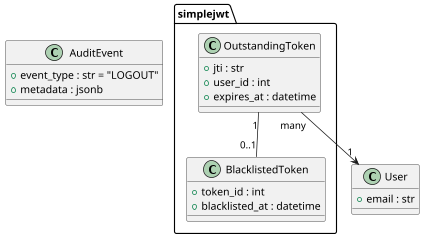

#### b. Sequence Diagram

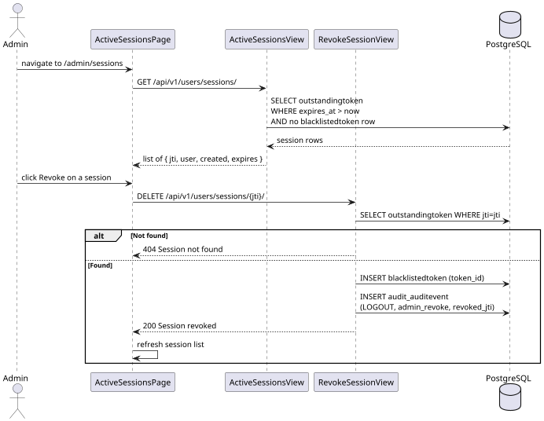

### Data Design

> Schemas for `token_blacklist_outstandingtoken` and `token_blacklist_blacklistedtoken` are defined in Transaction 1.3. The `audit_auditevent` schema is defined in Transaction 1.2.

---

## 3.2.1.2 — API Request Throttling and Rate Limiting

### User Interface Design

#### Front-end Components

**a. `apiClient`** *(error handling)*
`frontend/src/api/client.ts`

- **a.1** When a `429 Too Many Requests` response is received, the existing error path propagates the Axios error to the calling component. No special interceptor logic for `429` — the component is responsible for displaying the rate-limit message.
- **a.2** Axios instance

---

#### Back-end Components

**a. `AnonRateThrottle`** / **`UserRateThrottle`** *(DRF built-in)*

- **a.1** Applied globally via `DEFAULT_THROTTLE_CLASSES`. `AnonRateThrottle` limits unauthenticated clients to 100 requests/day keyed by IP, stored in Redis. `UserRateThrottle` limits authenticated users to 1 000 requests/day keyed by `user.pk`, stored in Redis. Exceeded requests return `429 Too Many Requests` with a `Retry-After` header.
- **a.2** DRF throttle classes — configured in `REST_FRAMEWORK` settings

---

**b. `AxesStandaloneBackend`** *(login-specific brute-force)*

- **b.1** Separate from DRF throttling. Tracks login failures per `(email + IP)` in `axes_accessattempt` (PostgreSQL). Locks after 3 failures; auto-unlocks after `AXES_COOLOFF_TIME` (10 min, configurable via env).
- **b.2** Django authentication backend — see Transaction 1.2 for full detail

---

### Object-Oriented Components

#### a. Class Diagram

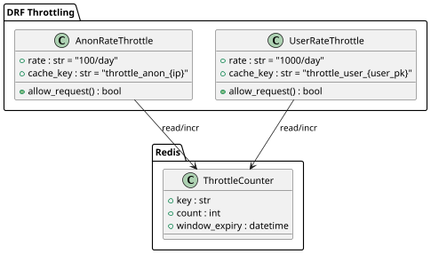

#### b. Sequence Diagram

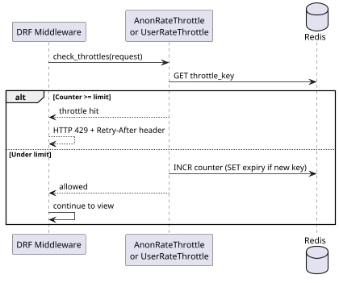

### Data Design

> DRF throttle counters are stored entirely in Redis — no database tables. The key format is `throttle_anon_{ip}` or `throttle_user_{user_pk}`. TTL is set to the remaining time in the 24-hour window. See Transaction 1.2 for `axes_accessattempt` schema.

---

## 3.2.1.3 — Mobile-Responsive Interface Redesign

### User Interface Design

#### Front-end Components

**a. `AppShell`**
`frontend/src/components/layout/AppShell.tsx`

- **a.1** Root layout for all authenticated routes. Renders `<Sidebar>`, a backdrop overlay (mobile only), and the main content area. Applies `md:ml-[60px] xl:ml-[230px]` to offset the content from the persistent sidebar at tablet and desktop sizes. The backdrop `<button>` is `md:hidden` so it only renders on mobile.
- **a.2** React layout component

---

**b. `Sidebar`**
`frontend/src/components/layout/Sidebar.tsx`

- **b.1** Fixed-position navigation rail. Width switches between three tiers via Tailwind: `w-[230px] md:w-[60px] xl:w-[230px]`. At the tablet tier (`md`) nav labels, section headings, badges, and the user info footer are hidden (`hidden xl:*`), leaving only centred icons. At mobile, the sidebar is off-screen by default (`-translate-x-full`) and slides in via `translate-x-0` when `sidebarOpen` is true. At `md`+, always visible via `md:translate-x-0`.
- **b.2** React component (named export)

---

**c. `Header`**
`frontend/src/components/layout/Header.tsx`

- **c.1** Fixed top bar. Adjusts its `left` offset to match the sidebar: `md:left-[60px] xl:left-[230px]`. The hamburger `☰` button is `md:hidden` — it only appears on mobile where the sidebar is a drawer.
- **c.2** React component (named export)

---

**d. `useUIStore`**
`frontend/src/store/ui.store.ts`

- **d.1** Zustand store (no persistence). Holds `sidebarOpen: boolean` and toast queue. `toggleSidebar()` and `closeSidebar()` are called by the Header hamburger and every `NavLink` `onClick` respectively.
- **d.2** Zustand store

---

#### Back-end Components

> No back-end components. FR-M1-03 is implemented entirely in the frontend via Tailwind CSS and Zustand state.

---

### Object-Oriented Components

#### a. Class Diagram

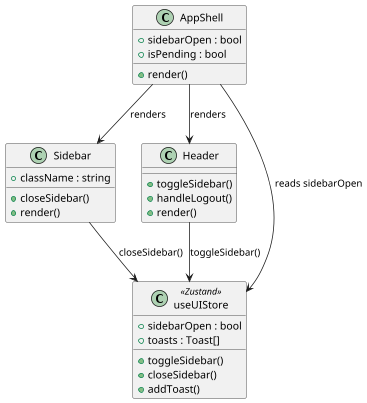

#### b. Sequence Diagram

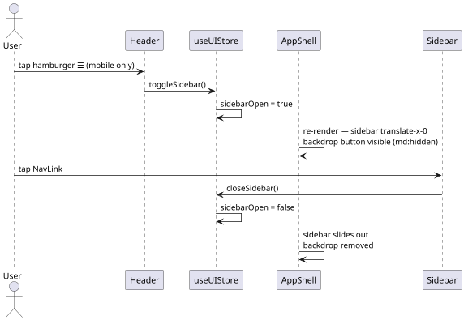

### Data Design

> No database tables. Sidebar state (`sidebarOpen`) is in-memory Zustand (not persisted). Breakpoint behaviour is compile-time Tailwind CSS — no runtime data involved.
