# Module 2 — Software Design Document: Document Lifecycle & CRUD Operations

---

## 3.2.2.1 — IP Disclosure Submission Portal

### User Interface Design

#### Front-end Components

**a. `AddRecordPage`**
`frontend/src/features/records/AddRecordPage.tsx`

- **a.1** Four-step multi-page wizard that orchestrates the entire record creation flow. Manages the wizard step state and the `RecordWritePayload` form object across steps. On final step completion, calls `recordsApi.create()` to persist the draft and navigates to My Records on success.
- **a.2** React page component (default export) — route `/records/add`

---

**b. `RecordDetailsStep`**
`frontend/src/features/records/steps/RecordDetailsStep.tsx`

- **b.1** Renders Step 2 of the wizard: Record Type dropdown and Adviser selector. Loads record types from `recordsApi.getRecordTypes()` and adviser list from `accountsApi.advisers()` on mount. Enforces the Proposal/Adviser constraint at the field level before the user can advance.
- **b.2** React wizard-step component

---

**c. `UploadsStep`**
`frontend/src/features/records/steps/UploadsStep.tsx`

- **c.1** Renders Step 4 of the wizard: displays the required document slot list for the selected record type and allows the user to upload a PDF for each slot via `documentsApi.submitDocument()`. Tracks upload status per slot and surfaces extraction progress.
- **c.2** React wizard-step component

---

**d. `recordFormSchema`**
`frontend/src/features/records/recordFormSchema.ts`

- **d.1** Zod schema definitions for the multi-step wizard form. Defines per-step validation rules (title required, Adviser required for Proposals, etc.) used by the AddRecordPage and EditRecordPage.
- **d.2** Zod schema module

---

**e. `MyRecordsPage`**
`frontend/src/features/records/MyRecordsPage.tsx`

- **e.1** Lists all records owned by the current user via `recordsApi.mine()`. Displays `pipeline_status` for each record using `StatusBadge`. Provides a "Submit for Review" button for records in `draft` or `declined` status, which calls `recordsApi.submit(id)`.
- **e.2** React page component (default export) — route `/records/mine`

---

**f. `recordsApi`** *(create and submit)*
`frontend/src/api/records.ts`

- **f.1** `create(payload)` POSTs to `/records/` to persist a new draft. `submit(id)` POSTs to `/records/<id>/submit/` to advance the record into the review pipeline. `mine()` GETs `/records/mine/` for the owner's record list.
- **f.2** API client module — plain object of typed Axios functions

---

#### Back-end Components

**a. `RecordViewSet.perform_create`**
`backend/apps/records/views.py`

- **a.1** Handles `POST /api/v1/records/`. Delegates field validation to `RecordWriteSerializer`. Saves the new record with `pipeline_status = "draft"` and `added_by = request.user`. Creates a `RecordOwner` row with `is_primary = True` for the submitting user. No notification is sent at draft creation — notifications fire only on the subsequent submit action.
- **a.2** DRF `ModelViewSet` — permission: `IsAuthenticated`

---

**b. `RecordWriteSerializer`**
`backend/apps/records/serializers.py`

- **b.1** Used for create and update operations. Accepts `authors` as a flat list of name strings; in `create()` it pops the list, creates the record via `super().create()`, then calls `_sync_authors()` to bulk-insert `Author` rows. In `update()`, authors are only replaced when the field is explicitly included in the request.
- **b.2** DRF `ModelSerializer` subclass

---

**c. `RecordViewSet.submit`**
`backend/apps/records/views.py`

- **c.1** Handles `POST /api/v1/records/<id>/submit/`. Validates that the record is in `draft` or `declined` status, has a Record Type set, and (for Proposals) has an Adviser assigned. Routes: **Proposal** → `pipeline_status = "adviser_review"`, **Thesis/Research or Project** → `pipeline_status = "rdco_intake"`. Calls `notify_new_record()` to dispatch email and in-app notifications to the appropriate reviewer. Also handles resubmission after revision — when `pipeline_status = "declined"`, the owner may resubmit with changes; `rejected` is the terminal state (cannot resubmit).
- **c.2** DRF `@action` — method: POST, permission: `IsAuthenticated` + `IsOwnerOrStaff`

---

**d. `notify_new_record`**
`backend/apps/notifications/services.py`

- **d.1** For Proposals: creates a direct `Notification` row for the assigned Adviser and sends an email via `send_email_async()`. For Thesis/Research and Projects: creates a broadcast `Notification` to the RDCO role and emails all active RDCO users.
- **d.2** Service function — called inside `RecordViewSet.submit`

---

### Object-Oriented Components

#### a. Class Diagram

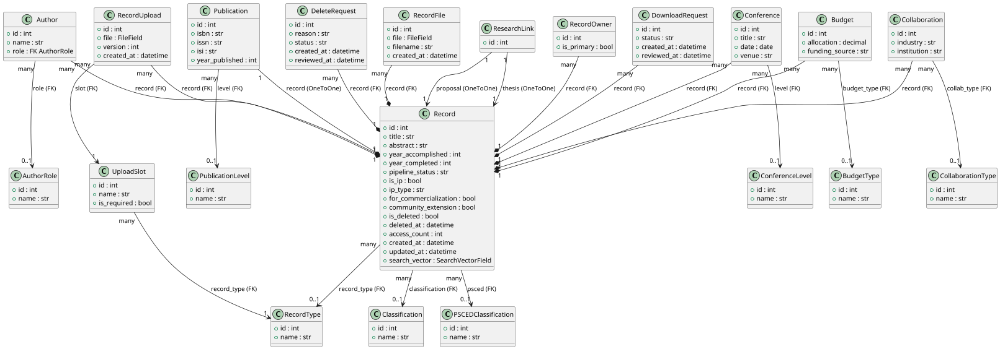

#### b. Sequence Diagrams

##### Create IP Disclosure Draft

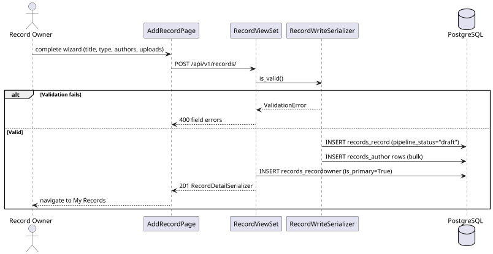

##### Submit Record for Review

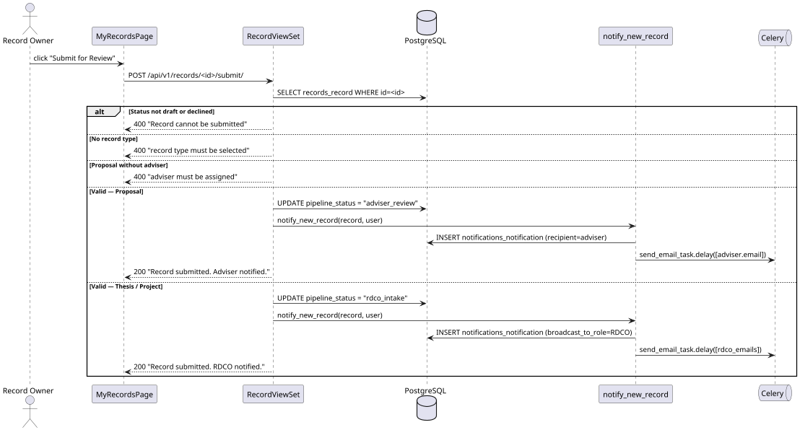

### Data Design

#### a. Schema

**`records_record`**

| Column | Type | Constraints |
|---|---|---|
| `id` | `integer` | PK, auto-increment |
| `title` | `varchar(500)` | NOT NULL |
| `abstract` | `text` | DEFAULT `''` |
| `abstract_file` | `varchar(200)` | nullable (file path) |
| `year_accomplished` | `integer` | nullable |
| `year_completed` | `integer` | nullable |
| `record_type_id` | `integer` | FK → `records_recordtype.id`, SET NULL |
| `classification_id` | `integer` | FK → `records_classification.id`, SET NULL |
| `psced_id` | `integer` | FK → `records_psced.id`, SET NULL |
| `adviser_id` | `integer` | FK → `accounts_user.id`, SET NULL |
| `added_by_id` | `integer` | FK → `accounts_user.id`, SET NULL |
| `pipeline_status` | `varchar(20)` | DEFAULT `'draft'`; choices: `draft`, `adviser_review`, `rdco_intake`, `itso_review`, `parallel_review`, `rdco_review`, `published`, `declined`, `rejected`, `pending_delete` |
| `is_ip` | `boolean` | DEFAULT FALSE |
| `ip_type` | `varchar(20)` | DEFAULT `''`; choices: `patent`, `copyright`, `trade_secret`, `utility_model` |
| `for_commercialization` | `boolean` | DEFAULT FALSE |
| `community_extension` | `boolean` | DEFAULT FALSE |
| `is_deleted` | `boolean` | DEFAULT FALSE, INDEX |
| `deleted_at` | `timestamptz` | nullable |
| `deleted_by_id` | `integer` | FK → `accounts_user.id`, SET NULL |
| `access_count` | `integer` | DEFAULT 0 |
| `search_vector` | `tsvector` | nullable; GIN index — updated by `update_search_vector()` |
| `created_at` | `timestamptz` | auto_now_add |
| `updated_at` | `timestamptz` | auto_now |

**`records_recordtype`**

| Column | Type | Constraints |
|---|---|---|
| `id` | `integer` | PK, auto-increment |
| `name` | `varchar(100)` | UNIQUE, NOT NULL |

> Seeded values: `Proposal`, `Thesis/Research`, `Project`

**`records_recordowner`**

| Column | Type | Constraints |
|---|---|---|
| `id` | `integer` | PK, auto-increment |
| `record_id` | `integer` | FK → `records_record.id`, CASCADE |
| `user_id` | `integer` | FK → `accounts_user.id`, CASCADE |
| `is_primary` | `boolean` | DEFAULT FALSE |

> UNIQUE constraint on `(record_id, user_id)`

**`records_author`**

| Column | Type | Constraints |
|---|---|---|
| `id` | `integer` | PK, auto-increment |
| `record_id` | `integer` | FK → `records_record.id`, CASCADE |
| `name` | `varchar(200)` | NOT NULL |
| `role_id` | `integer` | FK → `records_authorrole.id`, SET NULL, nullable |

**`records_authorrole`**

| Column | Type | Constraints |
|---|---|---|
| `id` | `integer` | PK, auto-increment |
| `name` | `varchar(100)` | UNIQUE, NOT NULL |

**`records_researchlink`**

| Column | Type | Constraints |
|---|---|---|
| `id` | `integer` | PK, auto-increment |
| `proposal_id` | `integer` | FK → `records_record.id`, CASCADE, UNIQUE |
| `thesis_id` | `integer` | FK → `records_record.id`, CASCADE, UNIQUE |

**`records_publicationlevel`**

| Column | Type | Constraints |
|---|---|---|
| `id` | `integer` | PK, auto-increment |
| `name` | `varchar(100)` | UNIQUE, NOT NULL |

**`records_publication`**

| Column | Type | Constraints |
|---|---|---|
| `id` | `integer` | PK, auto-increment |
| `record_id` | `integer` | FK → `records_record.id`, CASCADE, UNIQUE |
| `isbn` | `varchar(50)` | DEFAULT `''` |
| `issn` | `varchar(50)` | DEFAULT `''` |
| `isi` | `varchar(50)` | DEFAULT `''` |
| `year_published` | `integer` | nullable |
| `level_id` | `integer` | FK → `records_publicationlevel.id`, SET NULL, nullable |

**`records_conferencelevel`**

| Column | Type | Constraints |
|---|---|---|
| `id` | `integer` | PK, auto-increment |
| `name` | `varchar(100)` | UNIQUE, NOT NULL |

**`records_conference`**

| Column | Type | Constraints |
|---|---|---|
| `id` | `integer` | PK, auto-increment |
| `record_id` | `integer` | FK → `records_record.id`, CASCADE |
| `title` | `varchar(300)` | NOT NULL |
| `date` | `date` | nullable |
| `venue` | `varchar(300)` | DEFAULT `''` |
| `level_id` | `integer` | FK → `records_conferencelevel.id`, SET NULL, nullable |

**`records_budgettype`**

| Column | Type | Constraints |
|---|---|---|
| `id` | `integer` | PK, auto-increment |
| `name` | `varchar(100)` | UNIQUE, NOT NULL |

**`records_budget`**

| Column | Type | Constraints |
|---|---|---|
| `id` | `integer` | PK, auto-increment |
| `record_id` | `integer` | FK → `records_record.id`, CASCADE |
| `allocation` | `decimal(14,2)` | nullable |
| `funding_source` | `varchar(300)` | DEFAULT `''` |
| `budget_type_id` | `integer` | FK → `records_budgettype.id`, SET NULL, nullable |

**`records_collaborationtype`**

| Column | Type | Constraints |
|---|---|---|
| `id` | `integer` | PK, auto-increment |
| `name` | `varchar(100)` | UNIQUE, NOT NULL |

**`records_collaboration`**

| Column | Type | Constraints |
|---|---|---|
| `id` | `integer` | PK, auto-increment |
| `record_id` | `integer` | FK → `records_record.id`, CASCADE |
| `industry` | `varchar(300)` | DEFAULT `''` |
| `institution` | `varchar(300)` | DEFAULT `''` |
| `collab_type_id` | `integer` | FK → `records_collaborationtype.id`, SET NULL, nullable |

---

## 3.2.2.2 — Document Download Request Flow

### User Interface Design

#### Front-end Components

**a. `RecordDetailPage`** *(download section)*
`frontend/src/features/records/RecordDetailPage.tsx`

- **a.1** Renders the document slots and their uploaded versions for a record. For each `RecordUpload` row, record co-owners and staff see View and Download buttons that delegate to `DocumentsPage` APIs. For uploads the user does not own (non-owner, non-staff), a "Request Download Access" button calls `recordsApi.createDownloadRequest(recordId)`.
- **a.2** React page component (default export) — route `/records/:id`

---

**b. `documentsApi`** *(download and view)*
`frontend/src/api/documents.ts`

- **b.1** `downloadUpload(uploadId)` GETs `/documents/uploads/<id>/download/` as a `Blob` response and triggers a browser file save. `viewUpload(uploadId)` GETs `/documents/uploads/<id>/download/?inline=true` as a `Blob` and opens the result in a fullscreen PDF viewer modal. `downloadFile(fileId)` and `viewFile(fileId)` are the equivalent pair for supplementary `RecordFile` attachments, targeting `/documents/files/<id>/download/` and `/documents/files/<id>/download/?inline=true` respectively. `slotsForRecord(recordId)` GETs `/documents/records/<id>/slots/` to load all upload slots with embedded upload history. All download/view methods use `responseType: "blob"` on the Axios client so the authenticated session cookie is included on every file request.
- **b.2** API client module — plain object of typed Axios functions

---

**c. `DocumentsPage`**
`frontend/src/features/documents/DocumentsPage.tsx`

- **c.1** Dedicated page for document management for a given record. Loads all `UploadSlots` with embedded upload history via `documentsApi.slotsForRecord(recordId)`. For each slot, shows all uploaded versions (newest first) with **View** and **Download** action buttons. Record owners whose record is in `declined` pipeline status may also upload a new version per slot and delete individual slot uploads via a per-row delete button. An amber resubmit banner appears at the bottom of the page when `canUpload && pipeline_status === "declined"`; clicking it calls `reviewsApi.resubmit(recordId)`. The supplementary files section renders `RecordFile` attachments with View (PDF only) and Download buttons. A **"Back to Record"** button in the page header navigates to `/records/:id`. The embedded **`PdfViewer`** modal renders a fullscreen `<iframe>` with a blob URL for in-browser PDF display; the viewer header shows the filename and provides a download link.
- **c.2** React page component — route `/records/:id/documents`

---

**c. `recordsApi`** *(download requests)*
`frontend/src/api/records.ts`

- **c.1** `createDownloadRequest(recordId)` POSTs `{ record: recordId }` to `/records/download-requests/`. `approveDownloadRequest(id)` and `declineDownloadRequest(id)` POST to the respective staff action endpoints.
- **c.2** API client module — plain object of typed Axios functions

---

#### Back-end Components

**a. `RecordUploadDownloadView`**
`backend/apps/documents/views.py`

- **a.1** Handles `GET /api/v1/documents/uploads/<id>/download/`. Retrieves the `RecordUpload` by PK. Checks permission: any record co-owner (`upload.record.owners.filter(user=request.user)`) or a staff member (changed from uploader-only). Supports `?inline=true`: when present, returns `Content-Disposition: inline; filename="..."` with `content_type="application/pdf"` for in-browser PDF rendering; otherwise returns `Content-Disposition: attachment` for file download. Logs a DOWNLOAD audit event.
- **a.2** DRF `APIView` — permission: `IsAuthenticated`

---

**b. `DownloadRequestViewSet`**
`backend/apps/records/views.py`

- **b.1** Handles the full download request lifecycle. `create` (`POST /records/download-requests/`) saves the request with `requested_by = request.user` and calls `notify_download_request()`. The `approve` action sets `status = "approved"`, records the reviewer, and calls `notify_download_reviewed(approved=True)` which sends an email to the requester. The `decline` action sets `status = "declined"` and calls `notify_download_reviewed(approved=False)` which sends an in-app notification.
- **b.2** DRF `ModelViewSet` — list/retrieve: `IsAuthenticated` + `IsStaff`; create: `IsAuthenticated`; approve/decline: `IsAuthenticated` + `IsStaff`

---

**c. `notify_download_request`**
`backend/apps/notifications/services.py`

- **c.1** Broadcasts an in-app `Notification` to both the KTTO and RDCO roles informing them of a new download request. Does not send email — staff are expected to check the in-app queue.
- **c.2** Service function — called inside `DownloadRequestViewSet.perform_create`

---

**d. `notify_download_reviewed`**
`backend/apps/notifications/services.py`

- **d.1** Notifies the original requester of the decision. On approval: creates an in-app `Notification` and sends an email via `send_email_async()`. On decline: creates an in-app `Notification` only.
- **d.2** Service function — called inside `DownloadRequestViewSet.approve` and `.decline`

---

**e. `RecordUploadDeleteView`**
`backend/apps/documents/views.py`

- **e.1** Handles `DELETE /api/v1/documents/uploads/<id>/`. Retrieves the `RecordUpload` by PK. Checks permission: the requester must be a record owner or a staff member. Enforces the version constraint: record owners may only delete versions > 1 (version 1 is protected from owner deletion); staff can force-delete any version. Deletes the physical file from storage via `delete_upload()`, then the DB row. Logs a DELETE audit event.
- **e.2** DRF `APIView` — permission: `IsAuthenticated`

---

**f. `RecordFileDownloadView`**
`backend/apps/documents/views.py`

- **f.1** Handles `GET /api/v1/documents/files/<id>/download/`. Retrieves the `RecordFile` by PK. Checks permission: any record co-owner or a staff member. Detects the file content type from the filename extension: `.pdf` → `application/pdf`; all others → `application/octet-stream`. Supports `?inline=true` for PDF files to enable in-browser viewing (`Content-Disposition: inline`). Logs a DOWNLOAD audit event.
- **f.2** DRF `APIView` — permission: `IsAuthenticated`

---

### Object-Oriented Components

#### a. Sequence Diagrams

##### Direct Document Download

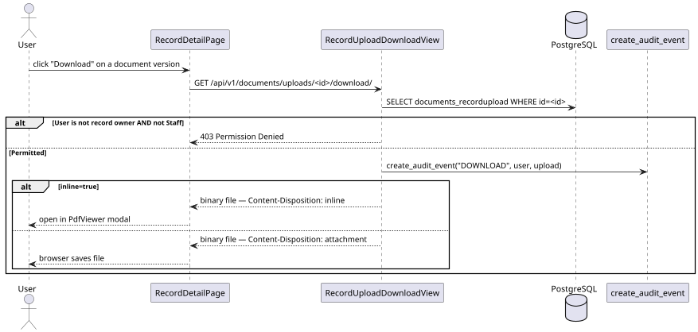

##### Download Request / Approval

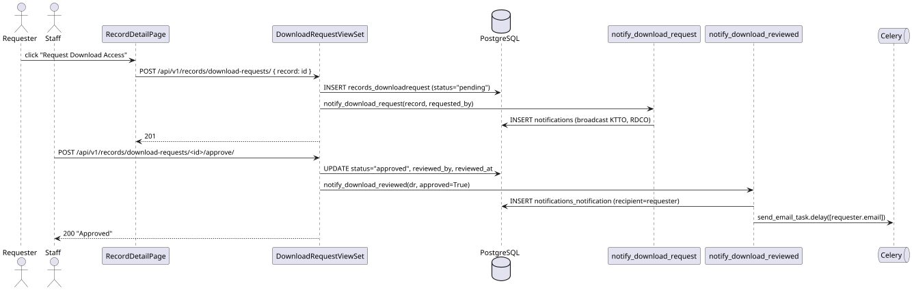

##### Delete Document Version

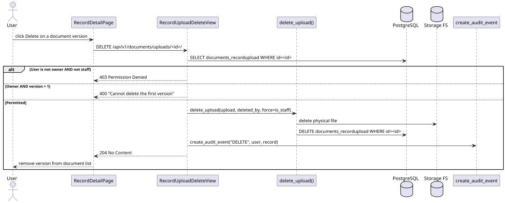

### Implementation Notes

| Issue | Fix |
|---|---|
| `SlotWithUploadsSerializer` serialized `file` as a relative path (`/media/documents/...`) instead of an absolute URL | Added `request` context to the nested `RecordUploadSerializer` call: `RecordUploadSerializer(uploads, many=True, context={"request": request})`. DRF's `FileField` requires the request object to construct absolute URLs; without it the field returns the raw file path. |
| Direct `<a href={upload.file}>` download links bypassed authentication and resolved to the Vite dev-server port (5173) instead of Django (8000) | Replaced with authenticated blob API calls using `responseType: "blob"` on the Axios client; files are rendered via `URL.createObjectURL()`. Every file request now carries the session cookie. |
| `RecordUploadDownloadView` only allowed the uploader or staff to download | Permission check updated to `upload.record.owners.filter(user=request.user).exists()` — any record co-owner may download/view any upload for their record, not just the original uploader. |

### Data Design

#### a. Schema

**`records_downloadrequest`**

| Column | Type | Constraints |
|---|---|---|
| `id` | `integer` | PK, auto-increment |
| `record_id` | `integer` | FK → `records_record.id`, CASCADE |
| `requested_by_id` | `integer` | FK → `accounts_user.id`, CASCADE |
| `status` | `varchar(10)` | DEFAULT `'pending'`; choices: `pending`, `approved`, `declined` |
| `reviewed_by_id` | `integer` | FK → `accounts_user.id`, SET NULL, nullable |
| `created_at` | `timestamptz` | auto_now_add |
| `reviewed_at` | `timestamptz` | nullable |

**`documents_uploadslot`**

| Column | Type | Constraints |
|---|---|---|
| `id` | `integer` | PK, auto-increment |
| `name` | `varchar(200)` | NOT NULL |
| `record_type_id` | `integer` | FK → `records_recordtype.id`, CASCADE |
| `is_required` | `boolean` | DEFAULT TRUE |

**`documents_recordupload`**

| Column | Type | Constraints |
|---|---|---|
| `id` | `integer` | PK, auto-increment |
| `record_id` | `integer` | FK → `records_record.id`, CASCADE |
| `slot_id` | `integer` | FK → `documents_uploadslot.id`, CASCADE |
| `file` | `varchar(200)` | NOT NULL (file path under `documents/`) |
| `version` | `integer` | DEFAULT 1; auto-incremented by `documents.services` |
| `status_id` | `integer` | FK → `documents_uploadstatus.id`, SET NULL |
| `uploaded_by_id` | `integer` | FK → `accounts_user.id`, SET NULL |
| `created_at` | `timestamptz` | auto_now_add |

> UNIQUE constraint on `(record_id, slot_id, version)`

---

## 3.2.2.3 — Document Soft-Deletion Flow

### User Interface Design

#### Front-end Components

**a. `RecordDetailPage`** *(delete action)*
`frontend/src/features/records/RecordDetailPage.tsx`

- **a.1** Renders a "Request Deletion" button for the record owner. On confirmation, calls `recordsApi.deleteRecord(id)` with an optional reason in the request body. For published records the UI updates the status to "Pending Deletion"; for non-published records the record is removed from the owner's list immediately.
- **a.2** React page component (default export) — route `/records/:id`

---

**b. `recordsApi`** *(delete request)*
`frontend/src/api/records.ts`

- **b.1** `deleteRecord(id)` sends `DELETE /records/<id>/`. `approveDeleteRequest(id)` POSTs to `/records/delete-requests/<id>/approve/`. `declineDeleteRequest(id)` POSTs to `/records/delete-requests/<id>/decline/`.
- **b.2** API client module — plain object of typed Axios functions

---

#### Back-end Components

**a. `RecordViewSet.perform_destroy`**
`backend/apps/records/views.py`

- **a.1** Handles `DELETE /api/v1/records/<id>/`. If `pipeline_status = "published"`, creates a `DeleteRequest` with `status = "pending"` and sets `pipeline_status = "pending_delete"` (no immediate deletion). For all other statuses, calls `soft_delete_record()` immediately.
- **a.2** DRF `ModelViewSet` override — permission: `IsAuthenticated` + `IsOwnerOrStaff`

---

**b. `DeleteRequestViewSet`**
`backend/apps/records/views.py`

- **b.1** Staff-facing ViewSet for managing delete requests. The `approve` action (RDCO only) sets `status = "approved"`, calls `soft_delete_record()` on the associated record, and calls `notify_delete_approved()`. The `decline` action (RDCO only) sets `status = "declined"`, restores `record.pipeline_status = "published"`, and calls `notify_delete_declined()`.
- **b.2** DRF `ModelViewSet` — list/retrieve: `IsAuthenticated` + `IsStaff`; approve/decline: `IsAuthenticated` + `IsRDCO`

---

**c. `soft_delete_record`**
`backend/apps/records/services.py`

- **c.1** Sets `record.is_deleted = True`, `deleted_at = timezone.now()`, `deleted_by = deleted_by`, and `pipeline_status = "pending_delete"`. Saves only the changed fields via `update_fields` for efficiency. The default `RecordManager` queryset automatically excludes soft-deleted records from all standard queries.
- **c.2** Service function

---

**d. `notify_delete_approved` / `notify_delete_declined`**
`backend/apps/notifications/services.py`

- **d.1** `notify_delete_approved`: creates an in-app `Notification` for the requester confirming the deletion. `notify_delete_declined`: creates an in-app `Notification` informing the requester the deletion was declined and the record remains published.
- **d.2** Service functions — called inside `DeleteRequestViewSet.approve` and `.decline`

---

### Object-Oriented Components

#### a. Sequence Diagram

##### Delete Request — Approve and Decline

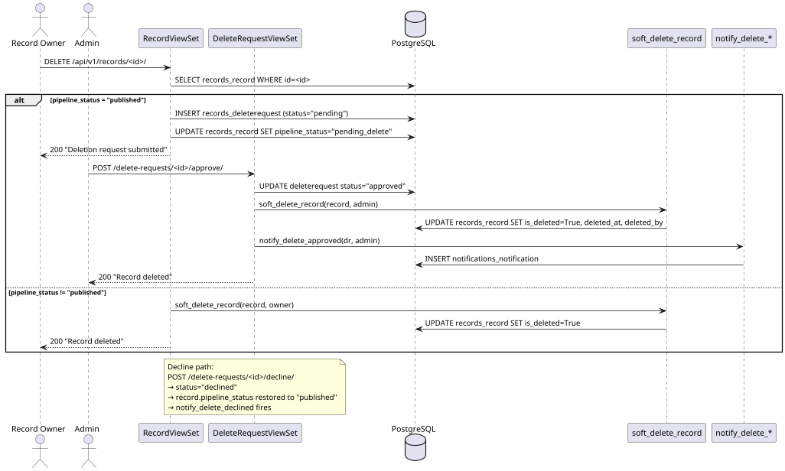

### Data Design

#### a. Schema

**`records_deleterequest`**

| Column | Type | Constraints |
|---|---|---|
| `id` | `integer` | PK, auto-increment |
| `record_id` | `integer` | FK → `records_record.id`, CASCADE |
| `requested_by_id` | `integer` | FK → `accounts_user.id`, CASCADE |
| `reason` | `text` | DEFAULT `''` |
| `status` | `varchar(10)` | DEFAULT `'pending'`; choices: `pending`, `approved`, `declined` |
| `reviewed_by_id` | `integer` | FK → `accounts_user.id`, SET NULL, nullable |
| `created_at` | `timestamptz` | auto_now_add |
| `reviewed_at` | `timestamptz` | nullable |

---

## 3.2.2.4 — Bulk Record Import via Excel

### User Interface Design

#### Front-end Components

**a. `ImportRecordsPage`**
`frontend/src/features/records/ImportRecordsPage.tsx`

- **a.1** Staff-only page for bulk legacy record import. Provides a "Download Template" button that triggers `recordsApi.downloadTemplate()`. Accepts a `.xls` or `.xlsx` file via a file input and calls `recordsApi.importExcel(file)` on submit. Renders the structured import log returned by the API in a results table showing per-row status, message, and final counts.
- **a.2** React page component (default export) — route `/records/import`

---

**b. `recordsApi`** *(import and template)*
`frontend/src/api/records.ts`

- **b.1** `downloadTemplate()` GETs `/records/download_template/` and saves the response as `iris_import_template.xlsx`. `importExcel(file)` POSTs a `multipart/form-data` payload with key `file` to `/records/import_excel/` and returns `{ log, created, skipped }`.
- **b.2** API client module — plain object of typed Axios functions

---

#### Back-end Components

**a. `RecordViewSet.import_excel`**
`backend/apps/records/views.py`

- **a.1** Handles `POST /api/v1/records/import_excel/`. Staff-only. Reads the uploaded file, calls `parse_excel_import(file)` to get `(rows, parse_errors)`. For each valid row, resolves RecordType, Classification, and PSCEDClassification by name (case-insensitive), creates a `Record` with `pipeline_status = "published"`, creates an associated `RecordOwner` (staff as primary), and bulk-creates `Author` rows. Returns a JSON log with per-row outcome, total created, and total skipped.
- **a.2** DRF `@action` — method: POST, permission: `IsAuthenticated` + `IsStaff`

---

**b. `parse_excel_import`**
`backend/apps/records/services.py`

- **b.1** Detects the file type from the extension (`.xls` or `.xlsx`) and parses it using `pyexcel.get_array(file_stream=file, file_type=file_type)` via pyexcel-xls / pyexcel-xlsx. Reads the header row to build a case-insensitive column index map. Iterates rows, stopping at "END OF RECORDS" or end of file. Skips blank rows silently. Returns rows with missing Title as errors. Returns `(rows: list[dict], errors: list[str])`.
- **b.2** Service function

---

**c. `RecordViewSet.download_template`**
`backend/apps/records/views.py`

- **c.1** Handles `GET /api/v1/records/download_template/`. Staff-only. Generates a styled `.xlsx` workbook using `openpyxl` with a bold, colour-coded header row (IRIS maroon), an example data row, a notes row in amber, and an "END OF RECORDS" sentinel in dark grey. Freezes the header row for easy scrolling. Returns the workbook as a binary `HttpResponse` with `Content-Disposition: attachment; filename="iris_import_template.xlsx"`.
- **c.2** DRF `@action` — method: GET, permission: `IsAuthenticated` + `IsStaff`

---

### Object-Oriented Components

#### a. Sequence Diagram

##### Bulk Excel Import

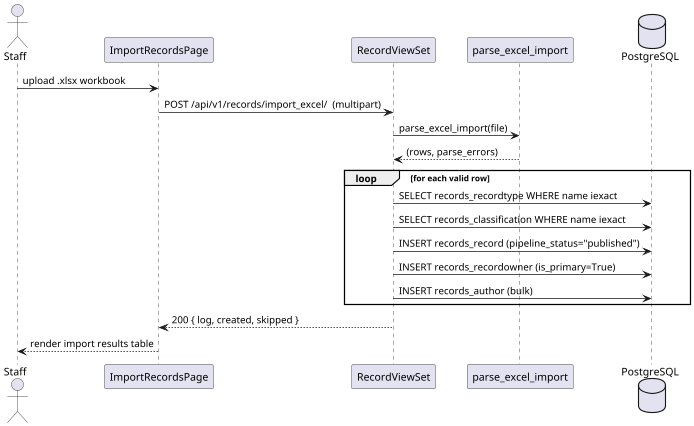

---

## 3.2.2.5 — Published Records Browse and Full-Text Search

### User Interface Design

#### Front-end Components

**a. `PublishedRecordsPage`**
`frontend/src/features/records/PublishedRecordsPage.tsx`

- **a.1** Displays a paginated, searchable, filterable list of all published research records. On mount and on filter/search change, calls `recordsApi.list({ search, record_type, year_accomplished, page })`. Renders each record as a card with title, type, year, and authors. Preserves active filters in URL query parameters for shareability.
- **a.2** React page component (default export) — route `/records`

---

**b. `recordsApi`** *(list)*
`frontend/src/api/records.ts`

- **b.1** `list(params)` GETs `/records/` with query parameters: `search` (keyword), `record_type`, `year_accomplished`, `ordering`, and `page`. Returns a paginated `{ count, next, previous, results }` envelope.
- **b.2** API client module — plain object of typed Axios functions

---

#### Back-end Components

**a. `RecordViewSet.list`**
`backend/apps/records/views.py`

- **a.1** Handles `GET /api/v1/records/`. Returns only `pipeline_status = "published"` records from the `list` action queryset. Applies `DjangoFilterBackend` (via `RecordFilter`), `SearchFilter` (keyword match on `title`, `abstract`, `authors__name`), and `OrderingFilter`. When M03's FTS infrastructure (`search_vector` + GIN index) is active, the `SearchFilter` is replaced with a `SearchVectorField` query for relevance-ranked results.
- **a.2** DRF `ModelViewSet` — permission: `IsAuthenticated`

---

**b. `RecordFilter`**
`backend/apps/records/filters.py`

- **b.1** `django-filter` filterset for the records list endpoint. Exposes: `year_from`, `year_to` (integer range on `year_accomplished`), `classification`, `psced`, `record_type`, `is_ip`, `ip_type`, `pipeline_status`, `department` (integer — filters by `owners__user__student_profile__course__department_id`; only applies when the primary owner has a `StudentProfile` with a course assigned). Used by the browse page for sidebar filtering and the staff report export.
- **b.2** `django-filter` `FilterSet` subclass

---

**c. `RecordListSerializer`**
`backend/apps/records/serializers.py`

- **c.1** Lightweight serializer for the list view and any DataTable. Exposes: `id`, `title`, `abstract`, `year_accomplished`, `classification_name`, `record_type_name`, `pipeline_status`, `is_ip`, `ip_type`, `for_commercialization`, `community_extension`, `access_count`, `created_at`, and nested `authors`.
- **c.2** DRF `ModelSerializer` subclass

---

**d. `RecordViewSet.export_report`**
`backend/apps/records/views.py`

- **d.1** Handles `GET /api/v1/records/export/`. Staff-only. Accepts the same optional filter parameters as `RecordFilter` (`year_from`, `year_to`, `classification`, `psced`, `record_type`, `is_ip`, `pipeline_status`). Applies the filters to the records queryset, then builds a three-sheet `.xlsx` workbook using `pyexcel-xlsx`: **Sheet 1 — Summary** (aggregate counts by `pipeline_status` and `record_type`); **Sheet 2 — Trend** (record counts grouped by `year_accomplished`); **Sheet 3 — Record Listing** (one row per matching record with title, type, year, classification, IP flags, authors). Streams the workbook as a binary `HttpResponse` with `Content-Disposition: attachment; filename="iris_report.xlsx"`.
- **d.2** DRF `@action` — method: GET, permission: `IsAuthenticated` + `IsStaff`

---

### Object-Oriented Components

#### a. Sequence Diagram

##### Browse and Search Published Records

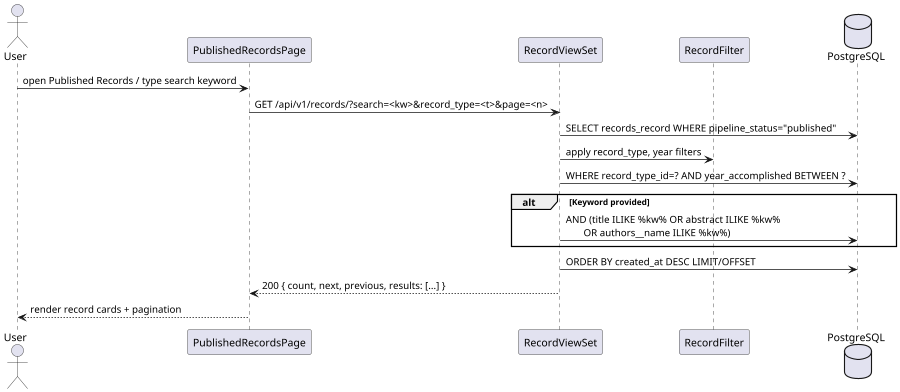

---

## 3.2.2.6 — Institutional File Storage Management

### User Interface Design

#### Front-end Components

**a. `RecordDetailPage`** *(supplementary files section)*
`frontend/src/features/records/RecordDetailPage.tsx`

- **a.1** Renders the supplementary files section for a record. For staff users, shows an "Attach File" button that calls `documentsApi.uploadRecordFile(recordId, file)`. For all users with access, renders a file list with filename, uploader, and date. Staff and the original uploader see a delete icon per row. A "Download All as ZIP" button calls `documentsApi.downloadAllFiles(recordId)`.
- **a.2** React page component (default export) — route `/records/:id`

---

**b. `documentsApi`** *(file storage)*
`frontend/src/api/documents.ts`

- **b.1** `uploadRecordFile(recordId, file)` POSTs `multipart/form-data` to `/documents/files/upload/`. `downloadAllFiles(recordId)` GETs `/documents/files/download-all/?record=<id>` and triggers a browser ZIP download. `deleteRecordFile(fileId)` sends `DELETE /documents/files/<id>/`.
- **b.2** API client module — plain object of typed Axios functions

---

#### Back-end Components

**a. `RecordFileUploadView`**
`backend/apps/documents/views.py`

- **a.1** Handles `POST /api/v1/documents/files/upload/`. Staff-only. Accepts a `multipart/form-data` request with `file` and `record_id`. Saves the physical file to `record_files/` on the on-premise file system (keyed by record ID). Creates a `RecordFile` row with `uploaded_by = request.user`. Returns the serialized `RecordFile`.
- **a.2** DRF `APIView` — permission: `IsAuthenticated` + `IsStaff`

---

**b. `RecordFileDownloadAllView`**
`backend/apps/documents/views.py`

- **b.1** Handles `GET /api/v1/documents/files/download-all/?record=<id>`. Retrieves all `RecordFile` rows for the record, builds a ZIP archive in memory using Python's `zipfile` module, and streams it as a binary `HttpResponse` with `Content-Disposition: attachment; filename="record_<id>_files.zip"`. Logs a DOWNLOAD audit event.
- **b.2** DRF `APIView` — permission: `IsAuthenticated`

---

### Object-Oriented Components

#### a. Sequence Diagram

##### Attach and Download Supplementary Files

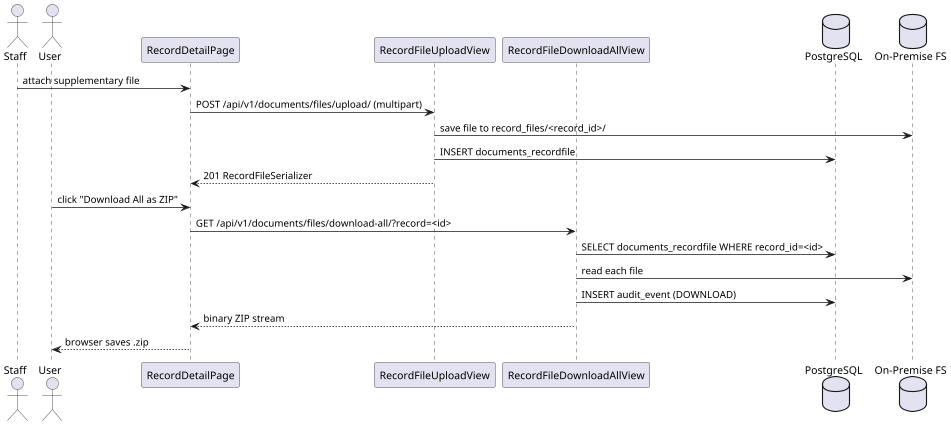

### Data Design

#### a. Schema

**`documents_recordfile`**

| Column | Type | Constraints |
|---|---|---|
| `id` | `integer` | PK, auto-increment |
| `record_id` | `integer` | FK → `records_record.id`, CASCADE |
| `file` | `varchar(200)` | NOT NULL (file path under `record_files/`) |
| `filename` | `varchar(300)` | NOT NULL |
| `uploaded_by_id` | `integer` | FK → `accounts_user.id`, SET NULL |
| `created_at` | `timestamptz` | auto_now_add |

---

## 3.2.2.7 — Personal File Storage

### User Interface Design

#### Front-end Components

**a. `FolderBrowserPage`**
`frontend/src/features/storage/FolderBrowserPage.tsx`

- **a.1** Renders the file storage browser. On mount and when `folderId` route param changes, calls `storageApi.list(parentId)` to load the current folder's contents and breadcrumb. Renders a table of subfolders and files. "New Folder" opens a modal that calls `storageApi.createFolder({ name, parent })`. Each folder row navigates to `/storage/<id>` on click. File rows render a direct `href` link to `file_url` (opens in new tab) and a download anchor. The delete icon on folder rows calls `storageApi.deleteFolder(id)` with a browser confirm dialog. File upload and file delete are available via `storageApi` functions and are pending UI wiring.
- **a.2** React page component (default export) — routes `/storage` and `/storage/:folderId`

---

**b. `storageApi`**
`frontend/src/api/storage.ts`

- **b.1** `list(parentId?)` GETs `/storage/?parent=<id>` and returns `{ folders, files, breadcrumb }`. `createFolder(payload)` POSTs `{ name, parent }` to `/storage/folders/`. `renameFolder(id, name)` PATCHes `/storage/folders/<id>/`. `deleteFolder(id)` DELETEs `/storage/folders/<id>/`. `uploadFile(folderId, file)` POSTs `multipart/form-data` with `file`, `folder`, and `name` to `/storage/files/`. `deleteFile(id)` DELETEs `/storage/files/<id>/`. `downloadFile(id)` GETs `/storage/files/<id>/download/` as a blob.
- **b.2** API client module — part of the `storageApi` module

---

#### Back-end Components

**a. `StorageListView`**
`backend/apps/storage/views.py`

- **a.1** Handles `GET /api/v1/storage/?parent=<id>`. Returns all `StorageFolder` rows with `parent = <id>` (or `parent = null` for root) and all `StorageFile` rows with `folder = <id>`. Builds the breadcrumb trail by traversing the parent chain upward. Returns `{ folders: [...], files: [...], breadcrumb: [{ id, name }, ...] }`. Returns HTTP 404 if the `parent` folder ID does not exist.
- **a.2** DRF `APIView` — permission: `IsAuthenticated`

---

**b. `StorageFolderListView`**
`backend/apps/storage/views.py`

- **b.1** Handles `GET /api/v1/storage/folders/?parent=<id>` (list) and `POST /api/v1/storage/folders/` (create). List filters by `parent_id` query param. On create, saves `created_by = request.user`.
- **b.2** DRF `ListCreateAPIView` — permission: `IsAuthenticated`

---

**c. `StorageFolderDetailView`**
`backend/apps/storage/views.py`

- **c.1** Handles `GET`, `PATCH`, and `DELETE` on `/api/v1/storage/folders/<id>/`. PATCH supports renaming (updating `name`). DELETE cascades to all nested subfolders and files via Django's `CASCADE` on-delete.
- **c.2** DRF `RetrieveUpdateDestroyAPIView` — permission: `IsAuthenticated`

---

**d. `StorageFileListView`**
`backend/apps/storage/views.py`

- **d.1** Handles `GET /api/v1/storage/files/?folder=<id>` (list) and `POST /api/v1/storage/files/` (upload). Accepts `multipart/form-data` with `file`, `folder` (optional FK), and `name`. Sets `uploaded_by = request.user` and `size_bytes` from the file object. Files are stored under `storage/YYYY/MM/` on the on-premise file system.
- **d.2** DRF `ListCreateAPIView` — permission: `IsAuthenticated`, parsers: `MultiPartParser`, `FormParser`

---

**e. `StorageFileDetailView`**
`backend/apps/storage/views.py`

- **e.1** Handles `GET` and `DELETE` on `/api/v1/storage/files/<id>/`. DELETE removes the `StorageFile` database row; physical file cleanup is handled by Django's file field.
- **e.2** DRF `RetrieveDestroyAPIView` — permission: `IsAuthenticated`

---

**f. `StorageFileDownloadView`**
`backend/apps/storage/views.py`

- **f.1** Handles `GET /api/v1/storage/files/<id>/download/`. Opens the file in binary mode and returns a `FileResponse` with `as_attachment=True` and the original filename. Returns HTTP 404 if the file record does not exist.
- **f.2** DRF `APIView` — permission: `IsAuthenticated`

---

### Object-Oriented Components

#### a. Class Diagram

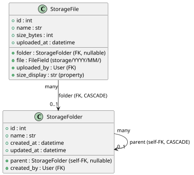

#### b. Sequence Diagram

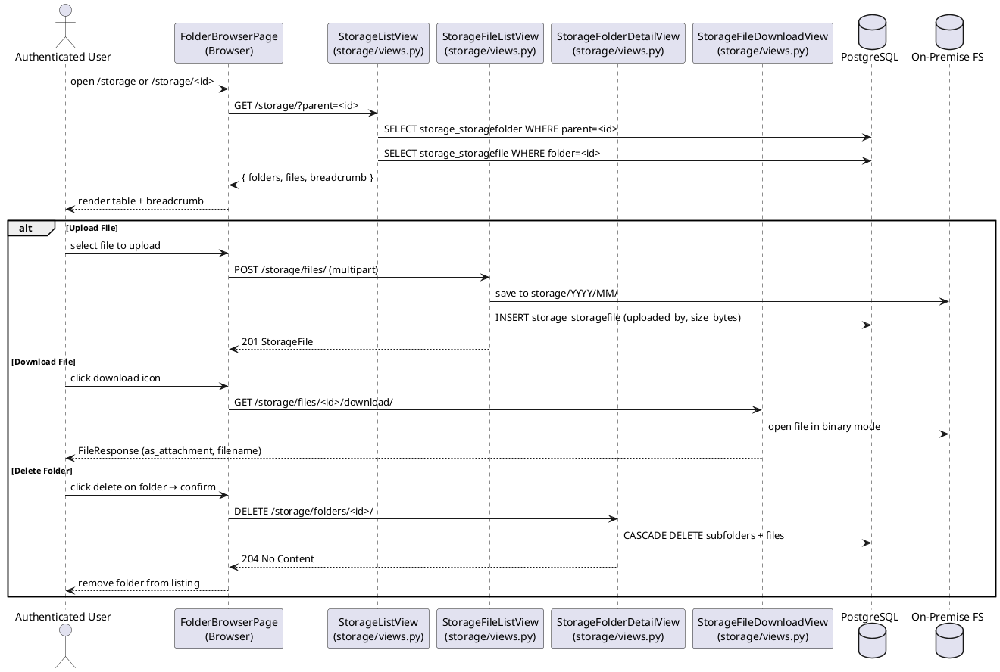

### Data Design

#### a. Schema

**`storage_storagefolder`**

| Column | Type | Constraints |
|---|---|---|
| `id` | `integer` | PK, auto-increment |
| `name` | `varchar(200)` | NOT NULL |
| `parent_id` | `integer` | FK → `storage_storagefolder.id`, CASCADE, nullable |
| `created_by_id` | `integer` | FK → `accounts_user.id`, SET NULL, nullable |
| `created_at` | `timestamptz` | auto_now_add |
| `updated_at` | `timestamptz` | auto_now |

**`storage_storagefile`**

| Column | Type | Constraints |
|---|---|---|
| `id` | `integer` | PK, auto-increment |
| `name` | `varchar(300)` | NOT NULL |
| `folder_id` | `integer` | FK → `storage_storagefolder.id`, CASCADE, nullable (root-level files allowed) |
| `file` | `varchar(200)` | NOT NULL (file path under `storage/YYYY/MM/`) |
| `size_bytes` | `bigint unsigned` | DEFAULT 0 |
| `uploaded_by_id` | `integer` | FK → `accounts_user.id`, SET NULL, nullable |
| `uploaded_at` | `timestamptz` | auto_now_add |
