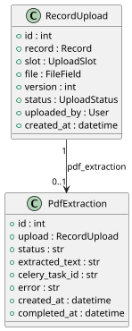
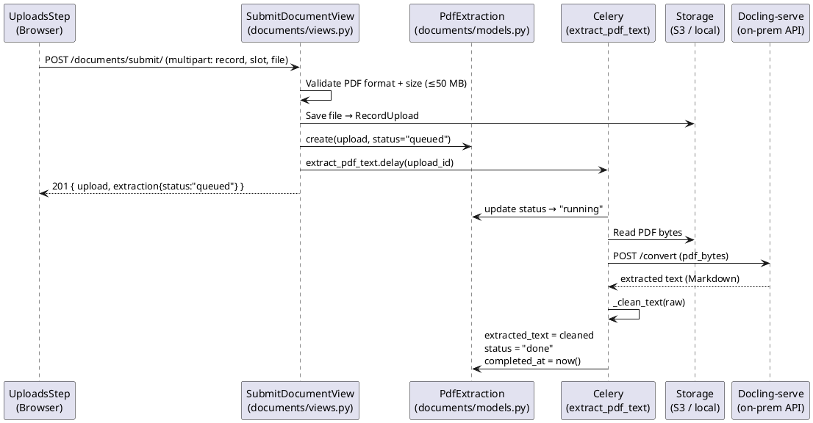
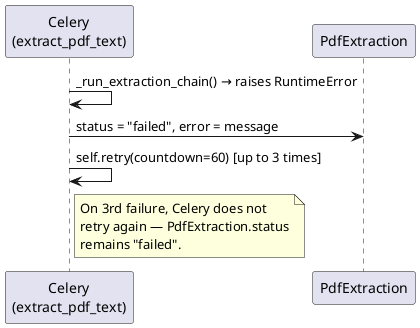
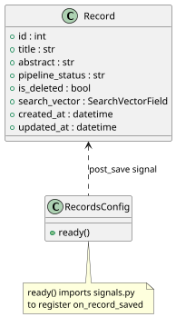
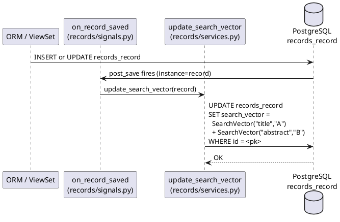
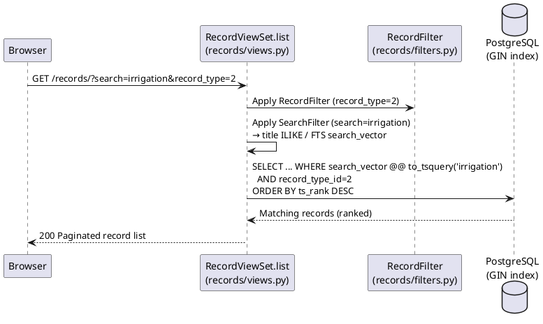
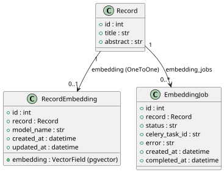
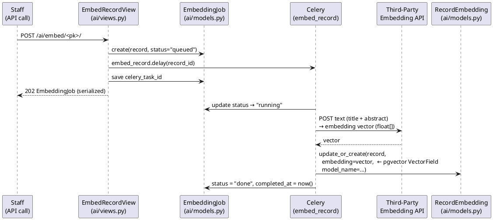
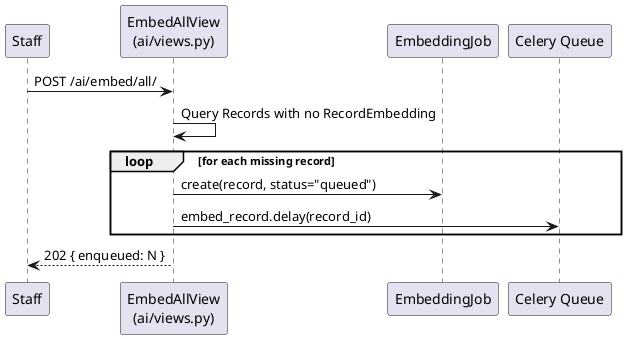

# Module 3 — Software Design Document: Semantic Indexing

---

## 3.2.3.1 — PDF Upload and Text Extraction

### User Interface Design

#### Front-end Components

**a. `UploadsStep`** *(referenced from M02 T2.1)*
`frontend/src/features/records/steps/UploadsStep.tsx`

- **a.1** Displays the required document slot list for a record type and allows PDF uploads via `documentsApi.submitDocument()`. The API response includes both the `RecordUpload` and the initial `PdfExtraction` status (`"queued"`). The component surfaces the extraction status so the owner knows whether text processing is in progress, complete, or failed.
- **a.2** React wizard-step component (step 4 of the submission wizard)

---

**b. `DocumentsPage`** *(referenced from M02 T2.2)*
`frontend/src/features/documents/DocumentsPage.tsx`

- **b.1** Shows all upload slots for a record with their upload history. Displays the latest `PdfExtraction` status alongside each upload row, giving the owner visibility into whether extraction has completed.
- **b.2** React page component — route `/records/:id/documents`

---

**c. `documentsApi.submitDocument`**
`frontend/src/api/documents.ts`

- **c.1** `submitDocument(payload)` POSTs multipart form data to `/documents/submit/`. The response body includes `{ upload: RecordUpload, extraction: PdfExtraction }`. The `extraction.status` field is used to show the initial queued state immediately after upload.
- **c.2** API client function — part of the `documentsApi` module

---

#### Back-end Components

**a. `extract_pdf_text`**
`backend/apps/documents/tasks.py`

- **a.1** Celery shared task (`max_retries=3`). Reads the uploaded PDF bytes from storage, then delegates to `_call_docling()`. On success, applies `_clean_text()` to the raw output and persists the result in `PdfExtraction.extracted_text` with `status = "done"`. On failure (Docling API error or empty result), saves `status = "failed"` and retries after a 60-second countdown. The task id is stored in `PdfExtraction.celery_task_id` for observability.
- **a.2** `@shared_task(bind=True, max_retries=3)` — triggered by `SubmitDocumentView` via `.delay(upload_id)`

---

**b. `_call_docling`**
`backend/apps/documents/tasks.py`

- **b.1** Sends the PDF bytes to the on-prem **Docling-serve** REST API (`POST <settings.DOCLING_API_URL>/convert`). Docling-serve handles all extraction internally — it supports text-layer PDFs, complex layouts (tables, multi-column), and scanned/image PDFs via its own OCR pipeline. Returns the extracted text as a Markdown string. Raises `RuntimeError` if the API returns a non-2xx response or an empty result, allowing the Celery task to retry.
- **b.2** Module-level helper — requires `requests`; `settings.DOCLING_API_URL` must be configured

---

**c. `_clean_text`**
`backend/apps/documents/tasks.py`

- **c.1** Normalizes raw extracted text before storage. Steps: (1) drop lines shorter than 3 characters; (2) drop lines that are purely digits (page-number lines); (3) strip non-printable/control characters with a regex substitution; (4) collapse all whitespace sequences to a single space. Returns the cleaned string.
- **c.2** Module-level helper — called on the Docling output before `PdfExtraction` is saved

---

**d. `PdfExtraction`**
`backend/apps/documents/models.py`

- **d.1** One-to-one with `RecordUpload`. Tracks extraction lifecycle via `status` (`queued → running → done/failed`). Stores `extracted_text`, `celery_task_id`, `error`, `created_at`, and `completed_at`. The GIN-indexed `search_vector` on the `Record` model is rebuilt from this text via the `post_save` signal after text is stored.
- **d.2** Django `Model` — table: `documents_pdfextraction`

---

**e. `PdfExtractionSerializer`**
`backend/apps/documents/serializers.py`

- **e.1** Serializes `PdfExtraction` fields (`id`, `upload`, `status`, `extracted_text`, `celery_task_id`, `error`, `created_at`, `completed_at`) for the `SubmitDocumentView` response.
- **e.2** DRF `ModelSerializer`

---

### Object-Oriented Components

#### a. Class Diagram

#### b. Sequence Diagrams

##### Sub-Flow A — PDF Upload Triggers Extraction

##### Sub-Flow B — All Extractors Fail → Retry

---

### Data Schema

#### `documents_pdfextraction`

| Column | Type | Notes |
|---|---|---|
| `id` | integer PK | Auto |
| `upload_id` | integer FK | → `documents_recordupload.id` ON DELETE CASCADE |
| `status` | varchar(10) | `queued` / `running` / `done` / `failed`; db_index |
| `extracted_text` | text | Cleaned output from the successful extractor; empty until extraction completes |
| `celery_task_id` | varchar(200) | Celery task UUID for observability; blank until task starts |
| `error` | text | Last error message; blank on success |
| `created_at` | timestamptz | Auto |
| `completed_at` | timestamptz | Null until done/failed |

---

## 3.2.3.2 — Full-Text Search (FTS) Indexing

### User Interface Design

#### Front-end Components

**a. `PublishedRecordsPage`**
`frontend/src/features/records/PublishedRecordsPage.tsx`

- **a.1** Provides a keyword search bar that appends a `?search=<query>` parameter to the records API request. Results are rendered as a paginated list with title, record type, year, and authors. Filtering controls (Record Type, Classification, Year) are applied alongside the search query.
- **a.2** React page component — route `/records`

---

**b. `recordsApi.list`**
`frontend/src/api/records.ts`

- **b.1** `list(params)` GETs `/records/` with arbitrary query parameters. Passes `search`, `record_type`, `classification`, `year_from`, `year_to`, and `pipeline_status` params to the backend for combined filter + search queries.
- **b.2** API client function

---

#### Back-end Components

**a. `on_record_saved` signal**
`backend/apps/records/signals.py`

- **a.1** `post_save` handler registered on the `Record` model in `RecordsConfig.ready()`. Fires on every save (create or update). Calls `update_search_vector(instance)` to rebuild the FTS column for the saved record.
- **a.2** Django signal handler — `@receiver(post_save, sender=Record)`

---

**b. `update_search_vector`**
`backend/apps/records/services.py`

- **b.1** Executes a single `QuerySet.update()` call that sets `search_vector` to `SearchVector("title", weight="A") + SearchVector("abstract", weight="B")` for the given record. Uses `QuerySet.update` (not `instance.save`) to avoid recursively triggering `post_save`.
- **b.2** Service function — called from the `on_record_saved` signal handler

---

**c. `RecordViewSet.list`**
`backend/apps/records/views.py`

- **c.1** Handles `GET /api/v1/records/`. Applies `RecordFilter` (year, type, classification) and DRF `SearchFilter` (queries `title`, `abstract`, `authors__name`) simultaneously. `OrderingFilter` supports ordering by `created_at`, `year_accomplished`, `title`, and `access_count`. The `search_vector` GIN index makes FTS queries sub-second across the full record corpus.
- **c.2** DRF `ModelViewSet` — permission: `IsAuthenticated`

---

**d. `RecordFilter`**
`backend/apps/records/filters.py`

- **d.1** `django-filter` `FilterSet` for structured parameter filtering: `year_from`, `year_to`, `classification`, `psced`, `record_type`, `is_ip`, `ip_type`, `pipeline_status`. Applied in conjunction with DRF `SearchFilter` to support combined queries.
- **d.2** `django_filters.FilterSet` subclass

---

### Object-Oriented Components

#### a. Class Diagram

#### b. Sequence Diagrams

##### Sub-Flow A — FTS Index Rebuild on Record Save

##### Sub-Flow B — Keyword Search

---

## 3.2.3.3 — Vector Embedding Storage

### User Interface Design

#### Front-end Components

**a. `EmbeddingJobsPage`**
`frontend/src/features/admin/EmbeddingJobsPage.tsx`

- **a.1** Staff-only admin page for managing and monitoring vector embedding jobs. On mount, calls `aiApi.embeddingJobs()` (GET `/ai/embed/jobs/`) and renders the 50 most recent `EmbeddingJob` rows in a table with columns: Record Title, Status (colour-coded badge: `queued` → grey, `running` → blue, `done` → green, `failed` → red), Started At, Completed At, and Error (truncated, expandable on hover). An **"Embed All"** button calls `aiApi.embedAll()` (POST `/ai/embed/all/`) and shows a toast with the number of jobs enqueued. A **"Re-embed All Failed"** button below the table calls `aiApi.embedRecord(id)` (POST `/ai/embed/<pk>/`) sequentially for each row currently showing `status = "failed"` in the loaded list, then re-fetches the list. A **"Refresh"** button re-fetches the jobs list.
- **a.2** React page component (default export) — route `/admin/embeddings`; guarded by Staff role check

---

**b. `aiApi`** *(embedding functions)*
`frontend/src/api/ai.ts`

- **b.1** `embeddingJobs()` GETs `/ai/embed/jobs/` and returns the list of `EmbeddingJob` objects. `embedRecord(recordId)` POSTs to `/ai/embed/<pk>/` to enqueue a single-record embedding job and returns the created `EmbeddingJob`. `embedAll()` POSTs to `/ai/embed/all/` and returns `{ enqueued: N }`.
- **b.2** API client functions — part of the `aiApi` module

---

#### Back-end Components

**a. `EmbedRecordView`**
`backend/apps/ai/views.py`

- **a.1** Handles `POST /api/v1/ai/embed/<pk>/`. Creates an `EmbeddingJob` row with `status = "queued"`, enqueues `embed_record.delay(record_id)`, saves the returned Celery task id to `EmbeddingJob.celery_task_id`, and returns the full serialized `EmbeddingJob` as HTTP 202 Accepted.
- **a.2** DRF `APIView` — permission: `IsAuthenticated` + `IsStaff`

---

**b. `EmbedAllView`**
`backend/apps/ai/views.py`

- **b.1** Handles `POST /api/v1/ai/embed/all/`. Queries all `Record` rows that have no associated `RecordEmbedding` (`exclude(pk__in=RecordEmbedding…)`). For each missing record, creates an `EmbeddingJob` with `status = "queued"`, enqueues `embed_record.delay(record_id)`, and saves the Celery task id back to the job. Returns `{"enqueued": N}` as HTTP 202.
- **b.2** DRF `APIView` — permission: `IsAuthenticated` + `IsStaff`

---

**c. `EmbeddingJobListView`**
`backend/apps/ai/views.py`

- **c.1** Handles `GET /api/v1/ai/embed/jobs/`. Returns the **50 most recent** `EmbeddingJob` rows ordered by `created_at` descending, serialized with `EmbeddingJobSerializer`. Allows staff to monitor progress and identify failed jobs.
- **c.2** DRF `APIView` — permission: `IsAuthenticated` + `IsStaff`

---

**d. `embed_record`**
`backend/apps/ai/tasks.py`

- **d.1** Celery shared task (`max_retries=3`). Loads the record, builds input text as `f"{record.title}. {record.abstract}"`, sends it to the configured **third-party embedding API** (provider TBD: e.g. `openai.embeddings.create(model=settings.AI_EMBEDDING_MODEL, input=text)` or equivalent), and stores the returned float vector via `RecordEmbedding.objects.update_or_create(record=record, defaults={"embedding": vector})` using a pgvector `VectorField`. Updates `EmbeddingJob.status` to `"running"` on start, `"done"` on success, `"failed"` on final failure. Retries up to 3 times with a 60-second countdown.
- **d.2** `@shared_task(bind=True, max_retries=3)`

---

**e. `embed_all_records`**
`backend/apps/ai/tasks.py`

- **e.1** Celery beat scheduled task for automated batch embedding. Queries records without a `RecordEmbedding`, creates an `EmbeddingJob` for each, and calls `embed_record.delay(record_id)` for each. Complements `EmbedAllView` (on-demand) by enabling recurring scheduled runs — e.g. nightly after bulk imports (FR-M2-04).
- **e.2** `@shared_task` — triggered by Celery beat schedule

---

**f. `RecordEmbedding`**
`backend/apps/ai/models.py`

- **f.1** One-to-one with `Record`. Stores the embedding vector in a pgvector `VectorField` (dimensions set to match the third-party embedding API output, e.g. 1536 for OpenAI `text-embedding-3-small`). `model_name` records which embedding model/provider produced the vector, enabling invalidation when the provider changes. Used by `SemanticSearchView` (FR-M4) for pgvector similarity queries (`ORDER BY embedding <=> query_vec`).
- **f.2** Django `Model` — table: `ai_recordembedding`

---

**g. `EmbeddingJob`**
`backend/apps/ai/models.py`

- **g.1** Tracks the Celery embedding task lifecycle per record. `status` values: `queued → running → done / failed`. Stores `celery_task_id` and `error` for observability. Foreign key to `Record` (allows multiple jobs per record for history). Ordered by `created_at` descending.
- **g.2** Django `Model` — table: `ai_embeddingjob`

---

**h. `EmbeddingJobSerializer`**
`backend/apps/ai/serializers.py`

- **h.1** Serializes `EmbeddingJob` fields (`id`, `record`, `record_title`, `status`, `celery_task_id`, `error`, `created_at`, `completed_at`). `record_title` is a read-only computed field from `record.title`.
- **h.2** DRF `ModelSerializer`

---

### Object-Oriented Components

#### a. Class Diagram

#### b. Sequence Diagrams

##### Sub-Flow A — Single Record Embedding

##### Sub-Flow B — Batch Embedding

---

### Data Schema

#### `ai_recordembedding`

| Column | Type | Notes |
|---|---|---|
| `id` | integer PK | Auto |
| `record_id` | integer FK | → `records_record.id` ON DELETE CASCADE; UNIQUE |
| `embedding` | vector(N) | pgvector `VectorField`; dimensions match the embedding provider (e.g. 1536 for OpenAI `text-embedding-3-small`); HNSW index for ANN search |
| `model_name` | varchar(100) | Embedding model/provider identifier (e.g. `text-embedding-3-small`); used to invalidate stale embeddings when provider changes |
| `created_at` | timestamptz | Auto |
| `updated_at` | timestamptz | Auto on update |

#### `ai_embeddingjob`

| Column | Type | Notes |
|---|---|---|
| `id` | integer PK | Auto |
| `record_id` | integer FK | → `records_record.id` ON DELETE CASCADE |
| `status` | varchar(10) | `queued` / `running` / `done` / `failed`; db_index |
| `celery_task_id` | varchar(200) | Blank until task starts |
| `error` | text | Error message on failure; blank otherwise |
| `created_at` | timestamptz | Auto; default ordering descending |
| `completed_at` | timestamptz | Null until done/failed |
