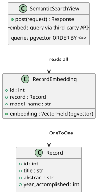
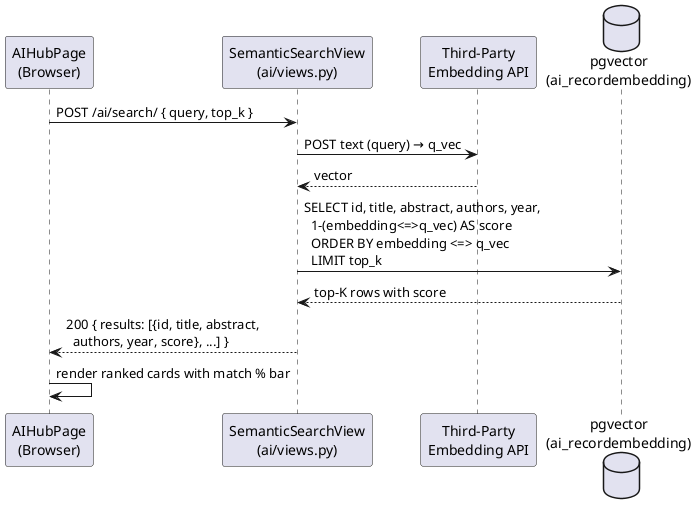
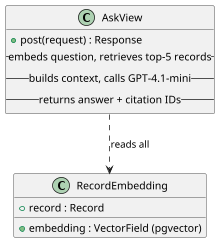
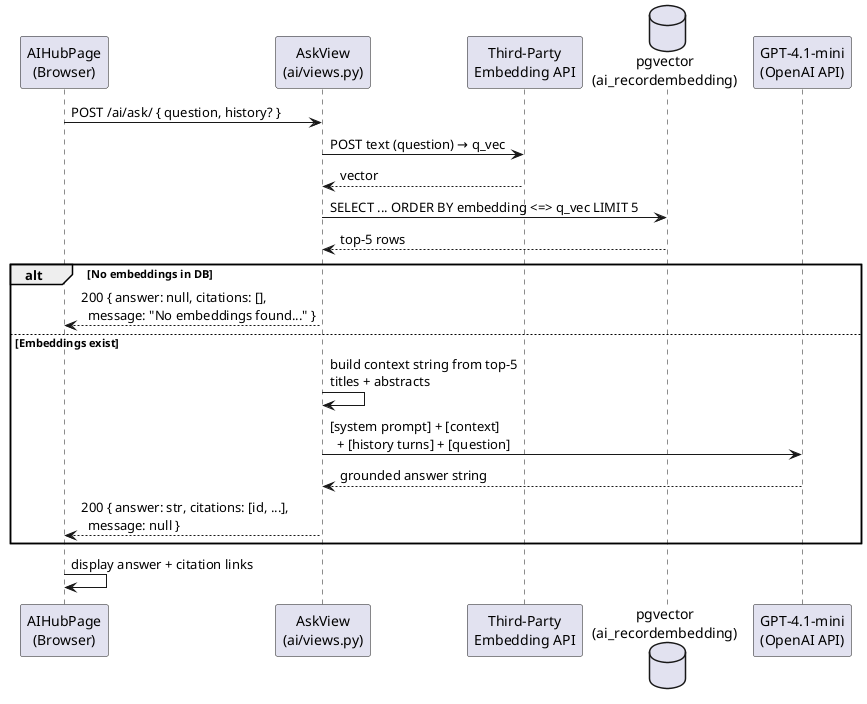
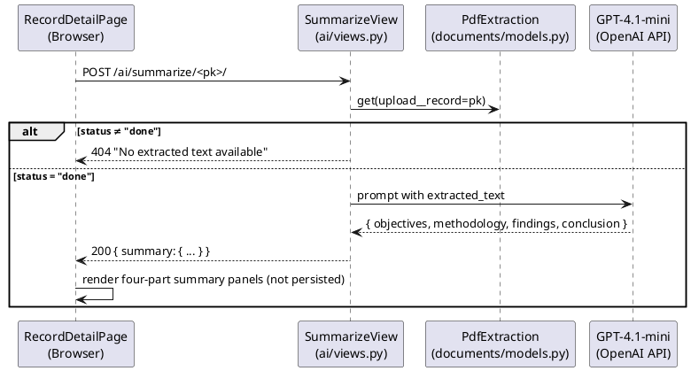

# Module 4 — Software Design Document: RAG AI Services

---

## 3.2.4.1 — RAG Chatbot Query Processing and Conversation Management

### Semantic Search

### User Interface Design

#### Front-end Components

**a. `AIHubPage`** *(search mode)*
`frontend/src/features/ai/AIHubPage.tsx`

- **a.1** Renders the AI Research Hub page. In **Semantic Search** mode, the user types a natural-language query and submits. Calls `aiApi.semanticSearch(query)` and stores the response in `results` state. Renders each result as a card showing title, abstract snippet, authors, year, and a match-percentage bar derived from `result.score`. Empty-result and loading states are handled inline.
- **a.2** React page component (default export) — route `/ai`

---

**b. `aiApi.semanticSearch`**
`frontend/src/api/ai.ts`

- **b.1** `semanticSearch(query, topK = 10)` POSTs `{ query, top_k }` to `/ai/search/`. Expects response `{ results: SemanticSearchResult[] }` where each item has `{ id, title, abstract, authors, year, score }`.
- **b.2** API client function — part of the `aiApi` module

---

#### Back-end Components

**a. `SemanticSearchView`**
`backend/apps/ai/views.py`

- **a.1** Handles `POST /api/v1/ai/search/`. Sends the query string to the configured **third-party embedding API** (`settings.AI_EMBEDDING_MODEL`) to obtain a query vector. Queries pgvector: `SELECT ... FROM ai_recordembedding ORDER BY embedding <=> query_vec LIMIT top_k` (cosine distance via `<=>` operator). Returns the top-K records (default 10, configurable via `top_k` in request body) ordered by ascending distance (descending similarity). Each result includes `id`, `title`, `abstract`, `authors` (comma-separated), `year_accomplished`, and `score` (1 − distance, rounded to 4 decimal places). No LLM call is made.
- **a.2** DRF `APIView` — permission: `IsAuthenticated`

---

### Object-Oriented Components

#### a. Class Diagram

#### b. Sequence Diagram

---

### AI Q&A with Conversational RAG

### User Interface Design

#### Front-end Components

**a. `AIHubPage`** *(ask mode)*
`frontend/src/features/ai/AIHubPage.tsx`

- **a.1** In **Ask a Question** mode, the user types a natural-language question and submits. Calls `aiApi.ask(question, history?)`. Stores `data.answer` in `answer` state and `data.citations` in `citations` state. Renders the LLM-generated answer text below the input. Below the answer, renders a "Related Records" section with clickable `Link` components to each cited record's detail page. Supports multi-turn conversation: prior question/answer pairs are accumulated in component state and passed as `history` on subsequent calls so the LLM can maintain context across turns.
- **a.2** React page component (default export) — route `/ai`

---

**b. `aiApi.ask`**
`frontend/src/api/ai.ts`

- **b.1** `ask(question, history?)` POSTs `{ question, history? }` to `/ai/ask/`. `history` is an optional array of `{ role: "user" | "assistant", content: string }` objects from prior turns. Expects response `{ answer: string, citations: number[], message: string | null }`. `message` is a human-readable string when the knowledge base is empty, otherwise `null`.
- **b.2** API client function

---

#### Back-end Components

**a. `AskView`**
`backend/apps/ai/views.py`

- **a.1** Handles `POST /api/v1/ai/ask/`. Sends the question to the **third-party embedding API** to obtain a query vector. If no `RecordEmbedding` rows exist, returns `{ answer: null, citations: [], message: "No embeddings found. Run /ai/embed/all/ to index records first." }`. Otherwise, queries pgvector for the top-5 most relevant records (`ORDER BY embedding <=> q_vec LIMIT 5`) and builds a context string from their titles and abstracts. Constructs the prompt as `[system prompt] + [context block] + [optional history turns] + [current question]` and calls GPT-4.1-mini via the OpenAI API. Returns `{ answer: str, citations: [id, ...], message: null }` where `citations` are the IDs of the top-5 records used as context. Multi-turn conversation is supported via an optional `history` field in the request body (array of `{ role, content }` objects), which is prepended to the prompt before the current question.
- **a.2** DRF `APIView` — permission: `IsAuthenticated`

---

### Object-Oriented Components

#### a. Class Diagram

#### b. Sequence Diagram

---

## 3.2.4.2 — Full-Text AI Document Summarization

### User Interface Design

#### Front-end Components

**a. `RecordDetailPage`** *(Summarize button)*
`frontend/src/features/records/RecordDetailPage.tsx`

- **a.1** Renders a "Summarize" button in the record detail action bar. The button is visible when `PdfExtraction.status = "done"` for at least one upload. On click, calls `aiApi.summarize(recordId)` and displays a spinner while the request is in flight. On success, displays the four-part structured summary (`objectives`, `methodology`, `findings`, `conclusion`) in expandable panels below the record metadata. On error (e.g., extraction not ready), surfaces the server's error message as a toast.
- **a.2** React page component — route `/records/:id`

---

**b. `aiApi.summarize`**
`frontend/src/api/ai.ts`

- **b.1** `summarize(recordId)` POSTs to `/ai/summarize/<id>/`. Expects response `{ summary: { objectives: string, methodology: string, findings: string, conclusion: string } }`. Returns a 404 error if no completed `PdfExtraction` exists for the record.
- **b.2** API client function — part of the `aiApi` module

---

#### Back-end Components

**a. `SummarizeView`**
`backend/apps/ai/views.py`

- **a.1** Handles `POST /api/v1/ai/summarize/<record_pk>/`. Looks up `PdfExtraction` for the record's most recent upload; if `status ≠ "done"`, returns HTTP 404 "No extracted text available." Builds the prompt: *"Provide a four-part summary with clearly labelled sections — Objectives, Methodology, Findings, Conclusion. Text: <extracted_text>"* and sends it to GPT-4.1-mini via the OpenAI API (`openai.ChatCompletion.create` or equivalent). Parses the model's response into the four sections and returns `{ summary: { objectives, methodology, findings, conclusion } }`. The summary is never persisted — it is generated on demand and returned in the response only.
- **a.2** DRF `APIView` — permission: `IsAuthenticated`

---

### Object-Oriented Components

#### a. Sequence Diagram

---

## Data Schema

Module 4 introduces no new database tables. All AI services operate on data from:

| Table | Module | Purpose |
|---|---|---|
| `ai_recordembedding` | FR-M3-03 | Source of pre-computed record vectors for cosine similarity |
| `documents_pdfextraction` | FR-M3-01 | Source of extracted text for document summarization |
| `records_record` | FR-M2-01 | Metadata returned in search results and citation links |
