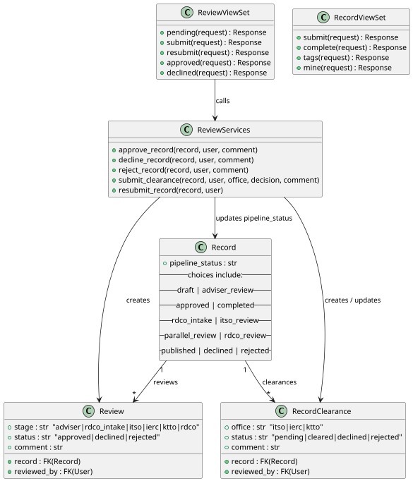
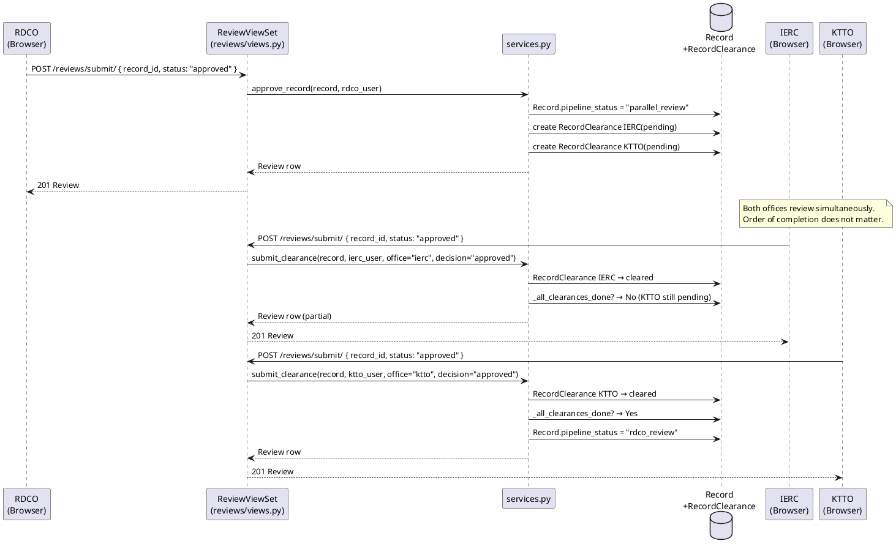
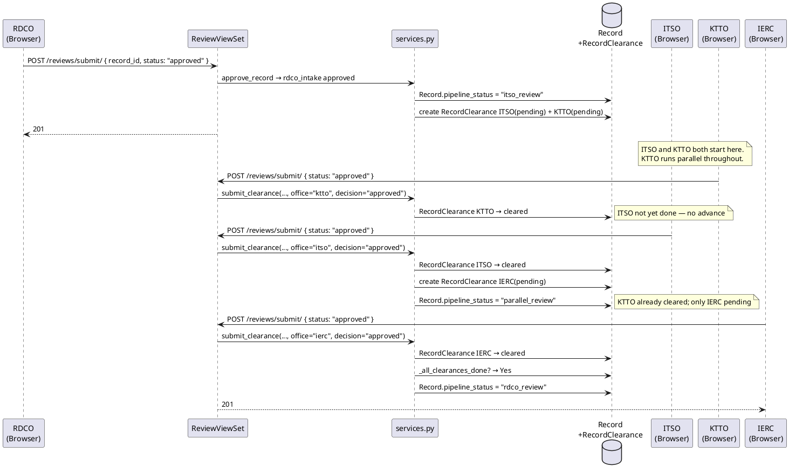
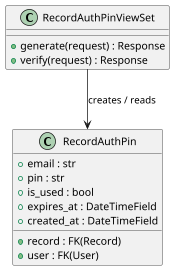
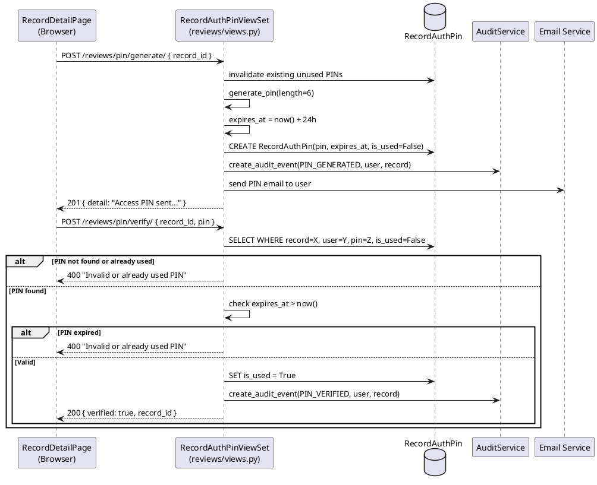
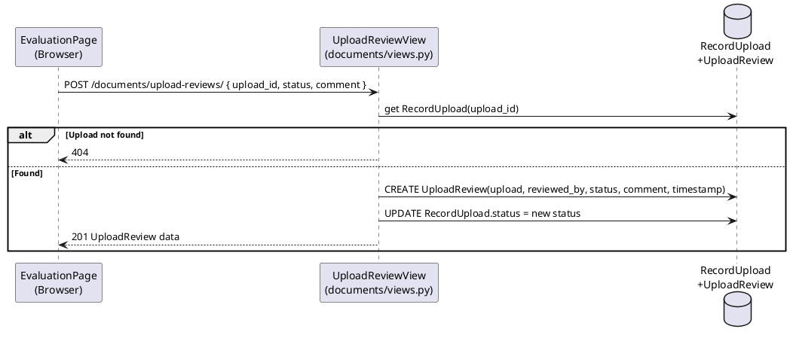
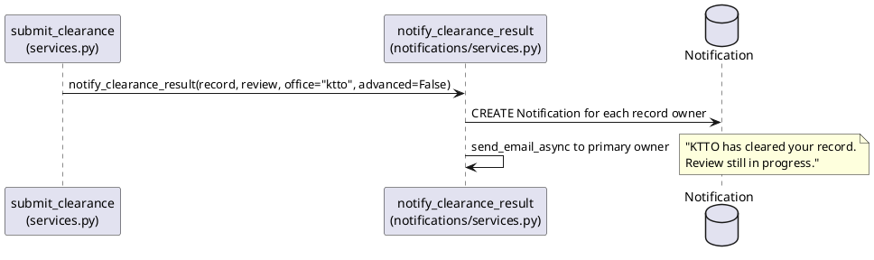
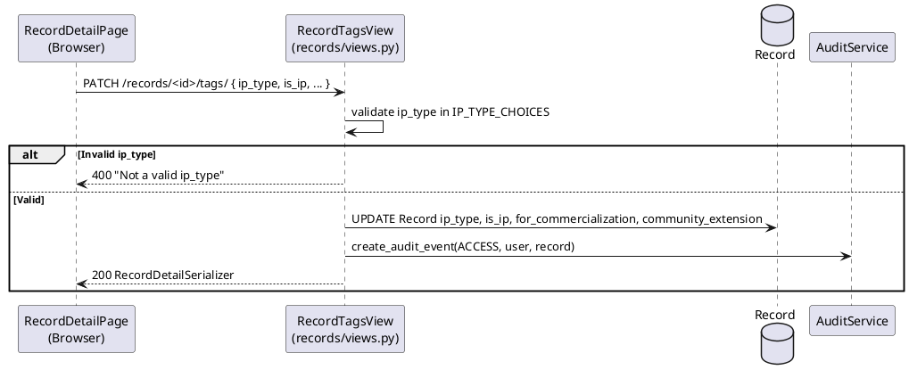

# Module 5 — Software Design Document: Hierarchical Submission Workflow

---

## 3.2.5.1 — Document Routing and IP Evaluation Workflow

### User Interface Design

#### Front-end Components

**a. `EvaluationPage`** *(review submission)*
`frontend/src/features/review/EvaluationPage.tsx`

- **a.1** Staff reviewer opens a record's detail from their pending queue. The page displays the record's title, type, current pipeline stage, uploaded documents (from `RecordUpload`), and the full review form. The reviewer selects a decision (Approve / Decline / Reject), enters an optional comment, and submits. The form calls `reviewsApi.submit({ record_id, status, comment })`. On success the record is removed from the reviewer's queue. For parallel clearance stages (`itso_review`, `parallel_review`), the page also shows clearance status badges for each office. The record info card exposes two direct navigation shortcuts: a **"View & Attach Documents"** button (links to `/records/<id>/documents`) so staff can view uploaded PDFs and attach supplementary files without leaving the review flow, and a **"Record Detail"** button (links to `/records/<id>`) for the full record view.
- **a.2** React page component — route `/review/:recordId`

---

**b. `PendingRecordsPage`**
`frontend/src/features/review/PendingRecordsPage.tsx`

- **b.1** Displays the list of records awaiting action from the current reviewer. Calls `GET /reviews/pending/`. Results are filtered server-side: Adviser sees only assigned Proposals; RDCO sees `rdco_intake` + `rdco_review`; ITSO, IERC, KTTO see records with their office's clearance still pending. Each row links to `EvaluationPage`.
- **b.2** React page component — route `/review/pending`

---

**c. `ApprovedProposalsPage`** *(RDCO proposal completion queue)*
`frontend/src/features/review/ApprovedProposalsPage.tsx`

- **c.1** Accessible from the Review Queue sidebar section (visible to RDCO and Django admin only). Calls `GET /records/?pipeline_status=approved&ordering=-created_at` — because only Proposals can reach `approved` status, this returns the full list of ongoing approved proposals without additional type filtering. Displays a table with columns: Title (link to detail), Authors, Date Approved, and an action column. For RDCO users the action column renders a "Mark as Completed" button per row. On click the button calls `POST /records/<id>/complete/`, disables itself with a loading label during the request, and removes the row from the list on success. Per-row inline error messages are shown on failure. Non-RDCO reviewer-role users see the list read-only (action column hidden). The sidebar nav item is conditionally rendered — only users with `role_name === "RDCO"` (or `is_staff / is_superuser`) see the "Approved Proposals" link in the Review Queue section.
- **c.2** React page component — route `/review/approved-proposals`, gated by `RoleRoute` for `REVIEWER_ROLES`

---

#### Back-end Components

**a. `ReviewViewSet.submit`**
`backend/apps/reviews/views.py`

- **a.1** `POST /reviews/submit/` — body: `{ record_id, status, comment }`. Checks `record.pipeline_status`:
  - Sequential stages (`adviser_review`, `rdco_intake`, `rdco_review`): calls `approve_record`, `decline_record`, or `reject_record` from `reviews.services`.
  - Clearance stages (`itso_review`, `parallel_review`): infers the office from the reviewer's role via `ROLE_TO_OFFICE` mapping, then calls `submit_clearance`.
  Returns the created `Review` row (201). Returns 400 on `InvalidPipelineTransition`.
- **a.2** DRF `GenericViewSet` action — permission: `[IsAuthenticated, IsReviewer]`

---

**b. `ReviewViewSet.pending`**
`backend/apps/reviews/views.py`

- **b.1** `GET /reviews/pending/` — returns records awaiting review. Role-to-status mapping:

  | Role | Pipeline statuses | Extra filter |
  |---|---|---|
  | Adviser | `adviser_review` | `record.adviser = request.user` |
  | RDCO | `rdco_intake`, `rdco_review` | — |
  | ITSO | `itso_review` | pending ITSO clearance exists |
  | IERC | `parallel_review` | pending IERC clearance exists |
  | KTTO | `itso_review`, `parallel_review` | pending KTTO clearance exists |

- **b.2** DRF `GenericViewSet` action — permission: `[IsAuthenticated, IsReviewer]`

---

**c. `approve_record` / `decline_record` / `reject_record`**
`backend/apps/reviews/services.py`

- **c.1** Handle sequential stages. `approve_record` outcome depends on the current `pipeline_status`:
  - `adviser_review` → `pipeline_status = "approved"` (Proposal approved by Adviser — becomes visible as an ongoing proposal; not yet `published`)
  - `rdco_review` → `pipeline_status = "published"` (RDCO final approval for Thesis/Research/Project)
  - `rdco_intake` → creates `RecordClearance` rows and advances to the clearance stage:
    - **Project**: ITSO(pending) + KTTO(pending) → `pipeline_status = itso_review`
    - **Thesis/Research**: IERC(pending) + KTTO(pending) → `pipeline_status = parallel_review`
  `decline_record` sets `pipeline_status = "declined"`. `reject_record` sets `pipeline_status = "rejected"`. Before executing, all three functions call `_can_review(user, record)` which enforces that an Adviser may only review a record where `record.adviser == request.user`. All three create a `Review` row and call `notify_record_reviewed`.
- **c.2** Service functions — called from `ReviewViewSet.submit`

---

**d. `submit_clearance`**
`backend/apps/reviews/services.py`

- **d.1** Handles parallel clearance stages. Creates a `Review` row and updates the `RecordClearance` row for the submitting office. Decision mapping:
  - `approved` → clearance `cleared`. If all clearances done → `rdco_review`. If ITSO cleared at `itso_review` (Project) → creates IERC clearance, advances to `parallel_review`.
  - `declined` → `pipeline_status = declined`.
  - `rejected` → `pipeline_status = rejected`.
  Calls `notify_clearance_result` in all branches.
- **d.2** Service function — called from `ReviewViewSet.submit`

---

**e. `ReviewViewSet.resubmit`**
`backend/apps/reviews/views.py`

- **e.1** `POST /reviews/resubmit/` — body: `{ record_id }`. Looks up `Record` by `record_id`. Performs an additional access check: only the record owner or a staff member may proceed (HTTP 403 `"Only the record owner may resubmit."` otherwise). Calls `resubmit_record(record, submitted_by=request.user)` from `reviews.services`.
  **Validation:** `resubmit_record` queries for at least one `RecordUpload` with `created_at > last_decline.created_at`. If none exists, raises `InvalidPipelineTransition("Please upload at least one updated document before resubmitting.")` → HTTP 400.
  **Smart clearance routing:** `resubmit_record` inspects the `stage` field of the most recent declined `Review`. If the stage is a clearance office (`itso`, `ierc`, or `ktto`), only that office's `RecordClearance` row is reset to `pending` (`reviewed_by` and `comment` cleared); all other offices' cleared status is preserved. Routing: ITSO decline → `pipeline_status = "itso_review"`; IERC decline → `pipeline_status = "parallel_review"`; KTTO decline → `"itso_review"` if ITSO clearance is still pending, else `"parallel_review"`. For any other decline stage (e.g. `rdco_intake`, `rdco_review`, `adviser`), all `RecordClearance` rows are deleted and the record is routed to the type-appropriate first stage. Returns `{ detail: "Record resubmitted successfully." }` on success; 400 on `InvalidPipelineTransition`.

  > **Permission note:** `ReviewViewSet.get_permissions()` overrides the class-level permission for the `resubmit` action, returning `[IsAuthenticated]` instead of `[IsAuthenticated, IsReviewer]`. This allows Student owners to call this endpoint directly. The internal owner check (`record.owners.filter(user=request.user)`) still enforces that only the record's owners (or staff) may proceed. DRF 3.17.1 silently ignores `permission_classes=` on `@action` decorators; the `get_permissions()` override is the only reliable mechanism.
- **e.2** DRF `GenericViewSet` action — permission: `[IsAuthenticated]` (via `get_permissions()` override)

---

**f. `AdviserListView`**
`backend/apps/accounts/views.py`

- **f.1** `GET /users/advisers/` — returns all active users whose role is `"Adviser"`, ordered by `last_name`, `first_name`. Used by the record creation and edit forms so students can populate the adviser dropdown before assigning an adviser to a Proposal. Returns all advisers in a single page (no pagination cutoff). No write operations are exposed.
- **f.2** DRF `ListAPIView` — permission: `[IsAuthenticated]`

---

**g. `ReviewViewSet.approved`**
`backend/apps/reviews/views.py`

- **g.1** `GET /reviews/approved/` — returns the list of records that the currently authenticated reviewer has personally approved. Queries `Review.objects.filter(reviewed_by=request.user, status="approved")` and returns the corresponding `Record` objects via `RecordListSerializer`. Each reviewer sees only their own approval history; no cross-user data is exposed.
- **g.2** DRF `GenericViewSet` action — permission: `[IsAuthenticated, IsReviewer]`

---

**h. `ReviewViewSet.declined`**
`backend/apps/reviews/views.py`

- **h.1** `GET /reviews/declined/` — returns the list of records that the currently authenticated reviewer has personally declined or rejected. Queries `Review.objects.filter(reviewed_by=request.user, status__in=["declined", "rejected"])` and returns the corresponding `Record` objects via `RecordListSerializer`. Covers both `declined` (revision requested) and `rejected` (terminal rejection) statuses in a single list.
- **h.2** DRF `GenericViewSet` action — permission: `[IsAuthenticated, IsReviewer]`

---

**i. `RecordViewSet.complete`**
`backend/apps/records/views.py`

- **i.1** `POST /records/<id>/complete/` — RDCO manually marks an approved Proposal as completed. Validates: record must be in `approved` status and `record_type.name == "Proposal"`. Sets `pipeline_status = "completed"`, saves with `update_fields=["pipeline_status", "updated_at"]`. Calls `notify_proposal_completed(record, marked_by=request.user)` to notify all record owners. Returns `{ detail: "Proposal marked as completed." }` (HTTP 200). Returns 400 if the record is not an approved Proposal. The record remains publicly visible after this transition.
- **i.2** DRF `ModelViewSet` action — permission: `[IsAuthenticated, IsRDCO]` (via `get_permissions()` override)

---

**j. `RecordViewSet.submit`**
`backend/apps/records/views.py`

- **j.1** `POST /records/<id>/submit/` — transitions a `Record` from `"draft"` (or `"declined"` for resubmissions) into the review pipeline. When the status is `"declined"`, the record re-enters the pipeline from the beginning for its record type; existing `RecordClearance` rows are **not** deleted by this action — clearance management is handled by the dedicated `/reviews/resubmit/` endpoint which applies smart routing. Routing is then determined by `record.record_type.name`:
  - **Proposal** → `pipeline_status = "adviser_review"`. Requires `record.adviser` to be assigned; returns 400 `"An adviser must be assigned before a Proposal can be submitted."` otherwise.
  - **Thesis / Research / Project** → `pipeline_status = "rdco_intake"`.
  Validates that `record_type` is set (400 if not). Saves with `update_fields=["pipeline_status", "updated_at"]`. Calls `notify_new_record(record, submitted_by=request.user)` to notify the receiving party (Adviser for Proposals, RDCO broadcast otherwise). Returns `{ detail: "Record submitted successfully. The <stage_label> has been notified." }` (HTTP 200). Returns 400 if the record is not in `draft` or `declined` status.

  > **Note:** Student owners use this endpoint for both initial submission (`draft`) and resubmission after decline (`declined`). The `resubmit` action on `ReviewViewSet` (see T5.1-e) is also accessible to Students via the `get_permissions()` override and is the endpoint the `Resubmit for Review` button on the record detail page calls.
- **j.2** DRF `ModelViewSet` action — permission: `[IsAuthenticated, IsOwnerOrStaff]`

---

### Object-Oriented Components

#### a. Class Diagram

#### b. Sequence Diagram — Thesis/Research Parallel Review

#### c. Sequence Diagram — Project Sequential + Parallel Review

---

## 3.2.5.2 — Auth PIN for Gated Record Access

### User Interface Design

#### Front-end Components

**a. `RecordDetailPage`** *(PIN gate)*
`frontend/src/features/records/RecordDetailPage.tsx`

- **a.1** When a record is gated (requires PIN), the detail page shows a "Request Access PIN" button. On click, calls `reviewsApi.generatePin(recordId)`. On success, shows a 6-digit PIN input form. On submission calls `reviewsApi.verifyPin({ record_id, pin })`. If verified, the gated content (documents, abstract) becomes visible. Error messages are shown for invalid or expired PINs. The UI does not distinguish between "expired" and "used" — both show the same error per the security policy.
- **a.2** React page component — route `/records/:id`

---

#### Back-end Components

**a. `RecordAuthPinViewSet.generate`**
`backend/apps/reviews/views.py`

- **a.1** `POST /reviews/pin/generate/` — body: `{ record_id }`. Invalidates existing unused PINs for this user+record. Creates a new `RecordAuthPin` with `is_used=False` and `expires_at = now() + 24h`. Calls `create_audit_event("PIN_GENERATED", user, record)` to record the PIN generation in the immutable audit trail. Sends the PIN by email. Returns `{ detail: "Access PIN sent..." }` (201).
- **a.2** DRF `GenericViewSet` action — permission: `[IsAuthenticated]`

---

**b. `RecordAuthPinViewSet.verify`**
`backend/apps/reviews/views.py`

- **b.1** `POST /reviews/pin/verify/` — body: `{ record_id, pin }`. Looks up `RecordAuthPin WHERE record=X AND user=Y AND pin=Z AND is_used=false`. If not found, returns 400 `"Invalid or already used PIN"`. If `expires_at ≤ now()`, returns the same 400 error. Otherwise marks `is_used=True`, calls `create_audit_event("PIN_VERIFIED", user, record)` to log the successful verification in the audit trail, and returns `{ verified: true, record_id }`.
- **b.2** DRF `GenericViewSet` action — permission: `[IsAuthenticated]`

---

### Object-Oriented Components

#### a. Class Diagram

#### b. Sequence Diagram

---

## 3.2.5.3 — Document-Level Review and Status Transitions

### User Interface Design

#### Front-end Components

**a. `EvaluationPage`** *(document review panel)*
`frontend/src/features/review/EvaluationPage.tsx`

- **a.1** Within the evaluation page, each uploaded document is shown with its current status. Reviewers can set a new status (For Application / Reviewed / Filed / Approved / Disapproved) and optionally add a comment. On submit, calls `POST /documents/upload-reviews/`. The review history (past status changes) is shown below each document.
- **a.2** React page component — route `/review/:recordId`

---

#### Back-end Components

**a. `UploadReviewView`**
`backend/apps/documents/views.py`

- **a.1** `POST /documents/upload-reviews/` — body: `{ upload_id, status, comment }`. Creates an `UploadReview` with timestamp and `reviewed_by`. Mirrors the new status onto `RecordUpload.status`. Returns the created `UploadReview` (201). Returns 404 if the upload or status is not found.
- **a.2** DRF `APIView` — permission: `[IsAuthenticated, IsStaff]`

---

### Object-Oriented Components

#### a. Sequence Diagram

---

## 3.2.5.4 — Pipeline Event Notifications

### User Interface Design

#### Front-end Components

**a. `NotificationsPage`**
`frontend/src/features/notifications/NotificationsPage.tsx`

- **a.1** Displays all in-app notifications for the authenticated user. Calls `GET /notifications/`. Shows notification type, message, timestamp, and a link to the related record (if applicable). Unread notifications are highlighted; read all on page visit.
- **a.2** React page component — route `/notifications`

---

#### Back-end Components

**a. Notification service functions**
`backend/apps/notifications/services.py`

- **a.1** `notify_new_record(record, submitted_by)` — notifies the receiving party when a student first submits (or resubmits via `RecordViewSet.submit`) a record. Routes based on `record.record_type.name`: Proposal → direct notification + email to the assigned Adviser; Thesis / Research / Project → broadcast notification to all users with the RDCO role. Always wrapped in `try/except` and never raises.
  `notify_record_reviewed(record, review)` — dispatches notifications after sequential review actions. At `rdco_intake` approval, notifies the routing offices (IERC+KTTO for Thesis/Research; ITSO+KTTO for Project) and the record owners.
  `notify_clearance_result(record, review, *, office, advanced, all_done)` — dispatches notifications after office clearances: partial clearance → owners; all offices cleared → RDCO + owners; ITSO cleared → IERC notified; decline/reject → owners.
  `notify_resubmit(record, submitted_by, new_status)` — notifies the relevant reviewing party when an owner resubmits a declined record. Routes the notification based on `new_status`: `adviser_review` → assigned Adviser notified; `rdco_intake` → RDCO notified; `parallel_review` or `itso_review` → all clearance offices that have a `RecordClearance` row in `pending` status are notified individually (IERC, KTTO, and/or ITSO as applicable). Passes `new_status` so the recipient knows where in the pipeline the record has re-entered.
  All functions are wrapped in `try/except` and never raise.
- **a.2** Service functions — called from `reviews.services`

---

### Object-Oriented Components

#### a. Sequence Diagram — Partial Clearance Notification

---

## 3.2.5.5 — Record IP Classification and Tagging

### User Interface Design

#### Front-end Components

**a. `RecordDetailPage`** *(IP tagging + proposal completion)*
`frontend/src/features/records/RecordDetailPage.tsx`

- **a.1** Reviewer-role users (Adviser, KTTO, RDCO, ITSO, IERC) see an "IP Classification" section on the record detail page. The section renders a dropdown for `ip_type` and checkboxes for `is_ip`, `for_commercialization`, `community_extension`. On save, calls `PATCH /records/<id>/tags/`. Validation errors are shown inline.
- **a.2** RDCO users additionally see a **"Mark as Completed"** button when the record has `pipeline_status === "approved"` and `record_type === "Proposal"`. On click calls `POST /records/<id>/complete/`. On success, the record detail re-fetches and the status badge changes to "Completed". An error message is shown inline on failure. The button is hidden once the record is already `completed`.
- **a.3** React page component — route `/records/:id`

---

#### Back-end Components

**a. `RecordTagsView`**
`backend/apps/records/views.py`

- **a.1** `PATCH /records/<id>/tags/` — accepts `ip_type`, `is_ip`, `for_commercialization`, `community_extension`. Validates `ip_type` against the allowed choices. Saves to `Record`. Logs an `ACCESS` audit event. Returns the updated `RecordDetailSerializer`.
- **a.2** DRF `APIView` — permission: `[IsAuthenticated, IsReviewer]`

---

### Object-Oriented Components

#### a. Sequence Diagram

---

## Data Schema

| Table | Notes |
|---|---|
| `records_record` | `pipeline_status` choices: `draft`, `adviser_review`, `approved` (Proposal ongoing), `completed` (Proposal finished — RDCO manual), `rdco_intake`, `itso_review`, `parallel_review`, `rdco_review`, `published`, `declined`, `rejected`, `pending_delete`. `lookup_value_regex = r'\d+'` on `RecordViewSet` prevents router from consuming sub-paths (e.g. `record-types/`) as record PKs. |
| `records_deleterequest` | `previous_pipeline_status` field added (CharField, blank). Populated when creating a delete request so that declining the request can accurately restore the record to its exact pre-deletion status (e.g. `approved` vs `completed` for Proposals). |
| `reviews_review` | `stage` now includes `ierc` in addition to adviser, rdco_intake, itso, ktto, rdco |
| `reviews_recordclearance` | **New.** Tracks per-office clearance status. `unique_together (record, office)`. Offices: `itso`, `ierc`, `ktto`. Statuses: `pending`, `cleared`, `declined`, `rejected` |
| `reviews_recordauthpin` | `expires_at` field added (DateTimeField, 24 h from generation). Verify rejects if `expires_at ≤ now()` |

## Implementation Notes

| Issue | Fix |
|---|---|
| DRF router conflict: `record-types/` matched by `RecordViewSet` PK route | Added `lookup_value_regex = r'\d+'` to `RecordViewSet` — restricts PK matching to integers only |
| DRF 3.17.1 silently ignores `@action(permission_classes=...)` | Overrode `get_permissions()` on `RecordViewSet` and `ReviewViewSet` with `if self.action == "..."` branches; decorator parameter is ignored at this DRF version |
| `RecordDetailSerializer` missing review history | Changed `fields = "__all__"` to explicit list including `reviews = SerializerMethodField()` — `__all__` does not include extra declared fields |
| `RecordOwnerSerializer.id` vs user ID | `id` is the `RecordOwner` row PK, not the user FK. Frontend `isOwner()` checks `o.user === userId`, not `o.id === userId` |
| `RecordSlotListView` returning all 41 slots | Fixed to filter `UploadSlot.objects.filter(record_type=record.record_type)` — was previously `UploadSlot.objects.all()` |
| Resubmit always routed to `rdco_intake` regardless of which office declined | Smart resubmit: `resubmit_record` checks `Review.stage` of the last decline; clearance-office declines reset only that office's `RecordClearance` row and route back to `itso_review` or `parallel_review`, preserving other offices' cleared status |
| No resubmit validation — student could resubmit without uploading new documents | `resubmit_record` now requires at least one `RecordUpload.created_at > last_decline.created_at`; raises `InvalidPipelineTransition` if none exists |
