# Module 6 — Software Design Document: Security and Authentication

---

## 3.2.6.1 — JWT Token Enforcement and Session Lifecycle

### User Interface Design

#### Front-end Components

**a. `LoginPage`**
`frontend/src/features/auth/LoginPage.tsx`

- **a.1** Email-and-password sign-in form validated with Zod + React Hook Form. On submit calls `authApi.login({ email, password })`. A successful response writes `access_token` and `refresh_token` to `localStorage` via `useAuth.login()` and navigates to `/`. Error responses surface the server's `detail` message as a toast (e.g., `"Invalid credentials."`, `"Email not verified."`, `"Account is locked."`).
- **a.2** React page component — public route `/login`

---

**b. `PendingApprovalPage`**
`frontend/src/features/auth/PendingApprovalPage.tsx`

- **b.1** Full-screen holding page shown to any authenticated user whose `RoleRequest.status` is still `"pending"`. Displays the user's name and email from the `useAuth` store, a summary of next steps, and a sign-out button that calls `authApi.logout(refresh_token)` then clears local auth state. No sidebar or navigation is rendered — the app shell is replaced entirely.
- **b.2** React page component (named export) — rendered by `AppShell` whenever `isPending` is true (`user && !user.role && !user.is_staff && !user.is_superuser`); URL does not change — the pending screen replaces all page content at whatever route the user navigated to; not a route

---

#### Back-end Components

**a. `LoginView`**
`backend/apps/accounts/views.py`

- **a.1** `POST /auth/login/` — body: `{ email, password }`. Calls `django.contrib.auth.authenticate` using `email` as the `username`. Blocks if `user.is_verified = False` (HTTP 403 "Email not verified") or `user.is_locked = True` (HTTP 403 "Account is locked"). On success issues a `RefreshToken` via simplejwt, logs a `LOGIN` `AuditEvent`, and returns `{ access, refresh, user }`.
- **a.2** DRF `APIView` — permission: `[AllowAny]`

---

**b. `LogoutView`**
`backend/apps/accounts/views.py`

- **b.1** `POST /auth/logout/` — body: `{ refresh }`. Calls `RefreshToken(refresh).blacklist()` which writes to simplejwt's `BlacklistedToken` table. Logs a `LOGOUT` `AuditEvent`. Returns `{ detail: "Logged out." }`. Any exception (malformed token, already blacklisted) is silently swallowed — logout always succeeds from the caller's perspective.
- **b.2** DRF `APIView` — permission: `[IsAuthenticated]`

---

**c. `ActivateView`**
`backend/apps/accounts/views.py`

- **c.1** `GET /auth/activate/<uidb64>/<token>/` — clicked from the verification email. Calls `activate_user(uidb64, token)` which decodes the UID, loads the `User` object, and checks `default_token_generator.check_token(user, token)`. If valid, sets `user.is_verified = True`. Returns 200 on success; 400 "Invalid or expired link." on failure.
- **c.2** DRF `APIView` — permission: `[AllowAny]`

---

**d. `TokenRefreshView`** *(simplejwt library)*
`django_urls: POST /token/refresh/`

- **d.1** Standard simplejwt view. Validates that the refresh token is not expired and not present in `BlacklistedToken`. Issues a new 30-minute access token. Returns HTTP 401 if the token is invalid or blacklisted.
- **d.2** `TokenRefreshView` from `rest_framework_simplejwt.views` — permission: `[AllowAny]`

---

**e. `send_verification_email`**
`backend/apps/accounts/services.py`

- **e.1** Builds an activation URL as `{FRONTEND_URL}/activate/{uid}/{token}` using `urlsafe_base64_encode` and `default_token_generator.make_token(user)`. Dispatches email delivery to the `send_email_task` Celery task via `send_email_async` so registration never blocks on SMTP.
- **e.2** Service function — called from `RegisterView.perform_create`

---

### Object-Oriented Components

#### a. Class Diagram

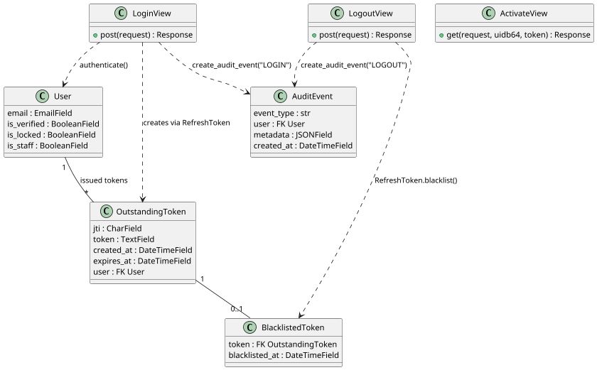

#### b. Sequence Diagram — Login

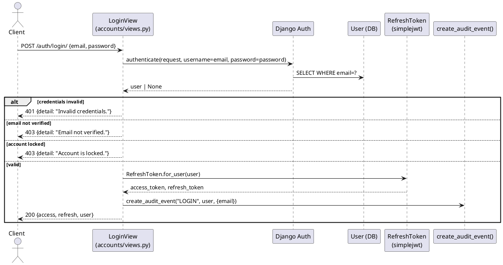

#### c. Sequence Diagram — Token Refresh and Logout

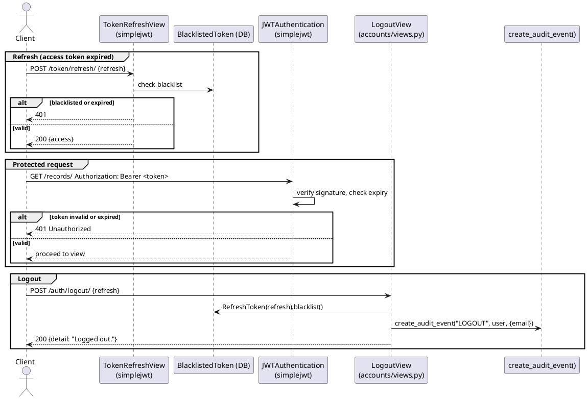

#### d. API Endpoints

| Method | Endpoint | Permission | Description |
|---|---|---|---|
| POST | `/auth/login/` | AllowAny | Authenticate; return JWT pair + user data |
| POST | `/auth/logout/` | IsAuthenticated | Blacklist refresh token |
| POST | `/token/refresh/` | AllowAny | Exchange refresh token for new access token |
| GET | `/auth/activate/<uidb64>/<token>/` | AllowAny | Email verification |

#### e. Business Rules

- Access token TTL: **30 minutes** (`SIMPLE_JWT["ACCESS_TOKEN_LIFETIME"]`)
- Refresh token TTL: **7 days**; stored in `OutstandingToken`
- Login is blocked if `is_verified = False` → HTTP 403 "Email not verified"
- Login is blocked if `is_locked = True` → HTTP 403 "Account is locked"
- Blacklisted tokens are checked by simplejwt on every `/token/refresh/` request
- `create_audit_event` is wrapped in `try/except Exception: pass` — audit failure never propagates

---

## 3.2.6.2 — Role-Based Access Control Enforcement

### User Interface Design

#### Front-end Components

**a. `Sidebar`**
`frontend/src/components/layout/Sidebar.tsx`

- **a.1** Navigation sidebar that reads the current user's role from the `useAuth` store and renders only the menu items permitted for that role. Staff-only items (Sessions, Role Requests, User Management) are hidden for Student and Adviser users. The Audit Log menu item is restricted to Django Admin accounts only (requires `is_staff = True` Django flag — IT administration) and is hidden for all IRIS role users including RDCO and KTTO. This is a UI convenience — the server enforces permissions independently.
- **a.2** React layout component — rendered inside `AppLayout` for all authenticated routes

---

**b. `ForbiddenPage`**
`frontend/src/features/errors/ForbiddenPage.tsx`

- **b.1** Full-page 403 error screen displayed when the React router guards detect that a user navigated to a route their role cannot access (e.g., a Student attempting to navigate directly to `/admin/sessions`). Provides a back-to-home button.
- **b.2** React page component — route `/403`

---

#### Back-end Components

**a. Permission classes**
`backend/core/permissions.py`

- **a.1** All DRF permission classes for IRIS are defined in a single module. Each class calls `get_role_name(user)` (returns `user.role.name` or `""`) and/or `is_django_staff(user)` (returns `True` for `is_superuser` or `is_staff`). Staff permission classes (`IsKTTO`, `IsRDCO`, `IsITSO`, `IsIERC`, `IsReviewer`, `IsStaff`, `IsAdmin`) grant access to any Django staff account regardless of role, so superusers bypass all role checks.

  | Permission Class | Grants access to |
  |---|---|
  | `IsStudent` | role == "Student" |
  | `IsAdviser` | role == "Adviser" |
  | `IsKTTO` | role == "KTTO" OR is_django_staff |
  | `IsRDCO` | role == "RDCO" OR is_django_staff |
  | `IsITSO` | role == "ITSO" OR is_django_staff |
  | `IsIERC` | role == "IERC" OR is_django_staff |
  | `IsReviewer` | REVIEWER_ROLES or is_django_staff |
  | `IsStaff` | STAFF_ROLES or is_django_staff |
  | `IsAdmin` | ADMIN_ROLES (KTTO, RDCO) or is_django_staff |
  | `IsOwnerOrStaff` | Object-level: `record.owners.filter(user=request.user).exists()` OR is_django_staff/in STAFF_ROLES |

- **a.2** Module — imported by all view files via `from core.permissions import ...`

---

### Object-Oriented Components

#### a. Class Diagram

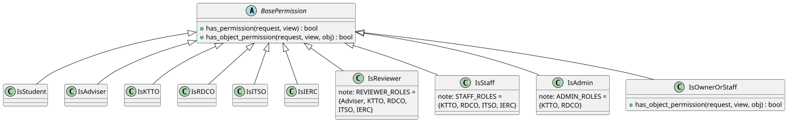

#### b. Sequence Diagram — Permission Check Flow

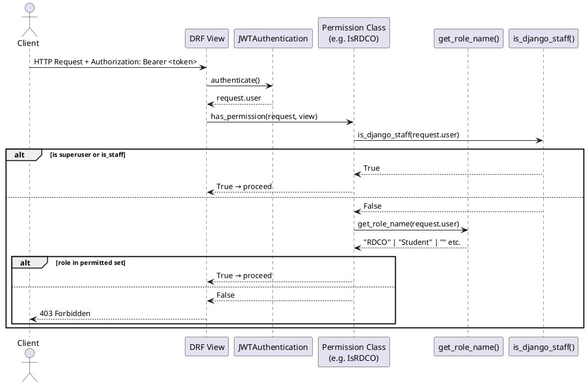

#### c. Endpoint Permission Matrix

| Endpoint | Required Permission |
|---|---|
| `GET /records/` | `IsAuthenticated` |
| `GET /records/mine/` | `IsAuthenticated` |
| `GET /records/mine/<id>/` | `IsAuthenticated` |
| `POST /records/<id>/submit/` | `IsAuthenticated`, `IsOwnerOrStaff` |
| `POST /records/<id>/increment_access/` | `IsAuthenticated` |
| `PATCH /records/<id>/tags/` | `IsAuthenticated`, `IsReviewer` |
| `POST /records/import_excel/` | `IsAuthenticated`, `IsStaff` |
| `POST /reviews/submit/` | `IsAuthenticated`, `IsReviewer` |
| `GET /reviews/pending/` | `IsAuthenticated`, `IsReviewer` |
| `POST /reviews/resubmit/` | `IsAuthenticated` |
| `GET /reviews/approved/` | `IsAuthenticated`, `IsReviewer` |
| `GET /reviews/declined/` | `IsAuthenticated`, `IsReviewer` |
| `GET /users/` | `IsAuthenticated`, `IsAdmin` |
| `GET /users/<id>/` | `IsAuthenticated`, `IsAdmin` |
| `PATCH /users/<id>/` | `IsAuthenticated`, `IsAdmin` |
| `GET /users/me/` | `IsAuthenticated` |
| `PATCH /users/me/` | `IsAuthenticated` |
| `POST /auth/password/change/` | `IsAuthenticated` |
| `PATCH /users/<id>/lock/` | `IsAuthenticated`, `IsAdmin` |
| `POST /users/<id>/unlock/` | `IsAuthenticated`, `IsAdmin` |
| `PATCH /users/<id>/role/` | `IsAuthenticated`, `IsAdmin` |
| `GET /users/role-requests/` | `IsAuthenticated`, `IsAdminUser` |
| `GET /users/advisers/` | `IsAuthenticated` |
| `GET /settings/<key>/` | `IsAuthenticated` |
| `PATCH /settings/<key>/` | `IsAuthenticated`, `IsAdmin` |
| `GET /users/sessions/` | `IsAuthenticated`, `IsAdmin` |
| `DELETE /users/sessions/<jti>/` | `IsAuthenticated`, `IsAdmin` |
| `GET /audit/` | `IsAuthenticated`, `IsAdminUser` |
| `GET /audit/export/` | `IsAuthenticated`, `IsAdminUser` |
| `GET /dashboard/stats/` | `IsAuthenticated` |
| `GET /dashboard/charts/classifications/` | `IsAuthenticated` |
| `GET /dashboard/charts/psced/` | `IsAuthenticated` |
| `GET /dashboard/pipeline/<record_pk>/` | `IsAuthenticated` |
| `POST /records/` | `IsAuthenticated` |
| `GET /records/<id>/` | `IsAuthenticated` |
| `PATCH /records/<id>/` | `IsAuthenticated`, `IsOwnerOrStaff` |
| `DELETE /records/<id>/` | `IsAuthenticated`, `IsOwnerOrStaff` |
| `GET /records/export/` | `IsAuthenticated`, `IsStaff` |
| `GET /records/download_template/` | `IsAuthenticated`, `IsStaff` |
| `POST /records/download-requests/` | `IsAuthenticated` |
| `POST /records/download-requests/<id>/approve/` | `IsAuthenticated`, `IsStaff` |
| `POST /records/download-requests/<id>/decline/` | `IsAuthenticated`, `IsStaff` |
| `POST /records/delete-requests/<id>/approve/` | `IsAuthenticated`, `IsRDCO` |
| `POST /records/delete-requests/<id>/decline/` | `IsAuthenticated`, `IsRDCO` |
| `POST /documents/submit/` | `IsAuthenticated` |
| `GET /documents/uploads/<id>/download/` | `IsAuthenticated` |
| `DELETE /documents/uploads/<id>/` | `IsAuthenticated` |
| `POST /documents/files/upload/` | `IsAuthenticated`, `IsStaff` |
| `GET /documents/files/download-all/` | `IsAuthenticated` |
| `DELETE /documents/files/<id>/` | `IsAuthenticated` |
| `POST /reviews/pin/generate/` | `IsAuthenticated` |
| `POST /reviews/pin/verify/` | `IsAuthenticated` |
| `GET /reviews/analytics/` | `IsAuthenticated`, `IsStaff` |
| `POST /ai/search/` | `IsAuthenticated` |
| `POST /ai/ask/` | `IsAuthenticated` |
| `POST /ai/embed/<pk>/` | `IsAuthenticated`, `IsStaff` |
| `POST /ai/embed/all/` | `IsAuthenticated`, `IsStaff` |
| `GET /ai/embed/jobs/` | `IsAuthenticated`, `IsStaff` |
| `POST /ai/summarize/<pk>/` | `IsAuthenticated` |

#### d. Business Rules

- All permission checks are server-side; frontend role filtering is a UI convenience only
- `IsAdmin` covers RDCO, KTTO, and any Django staff/superuser — used for account management endpoints
- `IsAdminUser` (DRF built-in) is used exclusively for the audit log endpoint; it checks `user.is_staff = True` (Django flag) and restricts access to IT administration accounts — IRIS role users including RDCO and KTTO cannot access the audit log
- `is_django_staff` bypasses role checks for all staff permission classes; superusers have unrestricted access
- `IsOwnerOrStaff` is applied at object level via `check_object_permissions(request, obj)` on `get_object()` calls — `obj.owners` is a queryset of `RecordOwner` rows

---

## 3.2.6.3 — Role Request and Approval Flow

### User Interface Design

#### Front-end Components

**a. `SignupPage`**
`frontend/src/features/auth/SignupPage.tsx`

- **a.1** Multi-step registration form. Step 1 asks the user to pick a role (`Student` or `Adviser`). Subsequent steps collect name, email, password, college, and role-specific fields (course for Student; department for Adviser). The final step shows the Data Privacy Notice with a mandatory checkbox (`consent_given`). On submit calls `authApi.register(payload)`. On success navigates to a "Check your email" confirmation screen.
- **a.2** React page component — public route `/signup`

---

**b. `PendingApprovalPage`** *(see T6.1-b)*
`frontend/src/features/auth/PendingApprovalPage.tsx`

- **b.1** Shown immediately after email verification if the user's `RoleRequest` is still pending. The page explains that an RDCO staff member will review the request within 1–2 business days.
- **b.2** React page component (named export) — rendered by `AppShell`, not a route; URL does not change

---

**c. `RoleRequestsPage`**
`frontend/src/features/accounts/RoleRequestsPage.tsx`

- **c.1** Visible only to Django Admin (`is_staff = True`). Loads pending `RoleRequest` rows via `accountsApi.roleRequests()` (GET `/users/role-requests/`). Each row shows user name, requested role, submission date, and Approve / Decline action buttons. Clicking Approve or Decline opens a `ConfirmDialog`, then calls `accountsApi.decideRequest(id, action)` (PATCH `/users/role-requests/<id>/` `{ action: "approve"|"decline" }`). On success a toast is shown and the list reloads.
- **c.2** React page component — route `/admin/role-requests`; guarded by `is_staff` check

---

#### Back-end Components

**a. `RegisterView`**
`backend/apps/accounts/views.py`

- **a.1** `POST /auth/register/` — runs `serializer.save()` inside a `transaction.atomic()` block. If `serializer._role_name` is set (the user selected Student or Adviser), creates a `RoleRequest(user, requested_role)`. Then calls `send_verification_email(user, request)`. If any step fails, the entire transaction rolls back.
- **a.2** DRF `CreateAPIView` — permission: `[AllowAny]`

---

**b. `RoleRequestListView`**
`backend/apps/accounts/views.py`

- **b.1** `GET /users/role-requests/` — returns all `RoleRequest` rows with `status = "pending"`, serialized with `RoleRequestSerializer`. Guarded by `IsAdminUser` (DRF built-in): only Django admin accounts (`is_staff = True`) can access; all IRIS role users including RDCO receive HTTP 403.
- **b.2** DRF `ListAPIView` — permission: `[IsAuthenticated, IsAdminUser]`

---

**c. `RoleRequestDetailView`**
`backend/apps/accounts/views.py`

- **c.1** `PATCH /users/role-requests/<pk>/` — body: `{ action: "approve" | "decline" }`. Dispatches to `approve_role_request(role_request, reviewed_by=request.user)` or `decline_role_request(role_request, reviewed_by=request.user)`.
- **c.2** DRF `APIView` — permission: `[IsAuthenticated, IsAdminUser]`

---

**d. `approve_role_request` / `decline_role_request`**
`backend/apps/accounts/services.py`

- **d.1** `approve_role_request`: sets `user.role = role_request.requested_role` (saved with `update_fields=["role"]`); sets `role_request.status = "approved"`; dispatches approval email via `send_email_async` (Celery). `decline_role_request`: sets `role_request.status = "declined"`; dispatches decline email.
- **d.2** Service functions — called from `RoleRequestDetailView.patch`

---

### Object-Oriented Components

#### a. Class Diagram

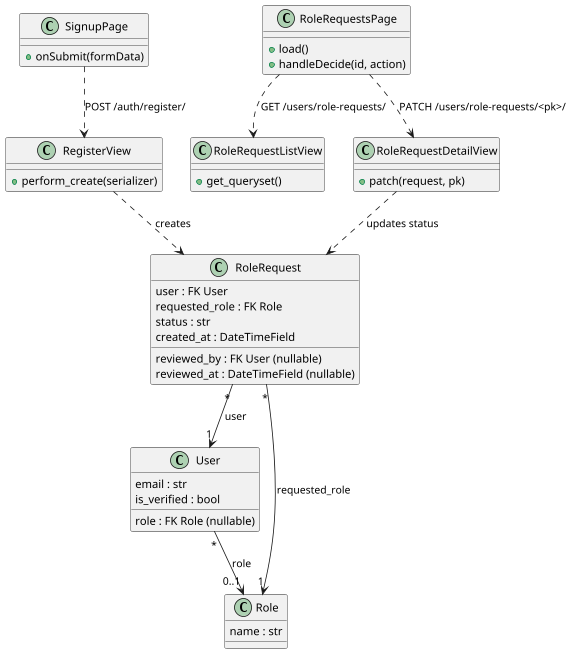

#### b. Sequence Diagram — Registration and Approval

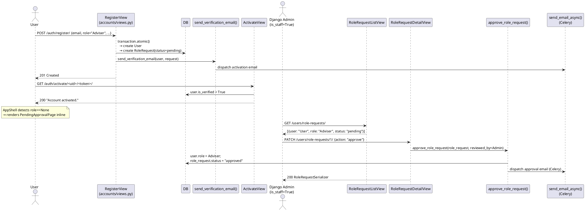

#### c. API Endpoints

| Method | Endpoint | Permission | Description |
|---|---|---|---|
| POST | `/auth/register/` | AllowAny | Register user; create RoleRequest |
| GET | `/auth/activate/<uidb64>/<token>/` | AllowAny | Email verification |
| GET | `/users/role-requests/` | IsAuthenticated, IsAdminUser | List pending role requests (Django Admin only) |
| PATCH | `/users/role-requests/<pk>/` | IsAuthenticated, IsAdminUser | Approve or decline (Django Admin only) |

#### d. Business Rules

- `RoleRequest` is created only when `serializer._role_name` is set (Student or Adviser)
- Staff accounts (RDCO, KTTO, ITSO, IERC) are provisioned directly by the Django superuser via the admin panel — no `RoleRequest` flow
- `IsAdminUser` on the role-request endpoints restricts access to Django admin accounts (`is_staff = True`) only; all IRIS role users including RDCO receive HTTP 403
- `approve_role_request` uses `update_fields=["role"]` to avoid overwriting unrelated user fields
- Declined requests do not block re-registration; the user can create a new account

---

## 3.2.6.4 — Account Management (Lock, Unlock, Role Change)

### User Interface Design

#### Front-end Components

**a. `UserListPage`**
`frontend/src/features/accounts/UserListPage.tsx`

- **a.1** Admin/staff-only table of all system users. Each row exposes role-change dropdown and lock/unlock toggle. Role change calls `accountsApi.setRole(id, roleName)` (PATCH `/users/<id>/role/`). Lock calls `accountsApi.setLocked(id, true)` (PATCH `/users/<id>/lock/`). Unlock calls `accountsApi.unlockUser(id)` (POST `/users/<id>/unlock/`). All actions show success/error toasts. The page also shows a "Locked Users" sub-section via `accountsApi.lockedUsers()`.
- **a.2** React page component — route `/admin/users`; guarded by Admin role check

---

#### Back-end Components

**a. `LockUserView`**
`backend/apps/accounts/views.py`

- **a.1** `PATCH /users/<pk>/lock/` — body: `{ is_locked: true | false }`. Sets `user.is_locked` and saves with `update_fields=["is_locked"]`. Logs an `ACCOUNT_LOCKED` `AuditEvent` (when `is_locked=True`) or `ACCOUNT_UNLOCKED` (when `is_locked=False`) with `metadata = { target_user: email }`. Returns `{ detail, is_locked }`.
- **a.2** DRF `APIView` — permission: `[IsAuthenticated, IsAdmin]`

---

**b. `UnlockUserView`**
`backend/apps/accounts/views.py`

- **b.1** `POST /users/<pk>/unlock/` — sets `user.is_locked = False`. Deletes `AccessAttempt` records via `AccessAttempt.objects.filter(username=user.email).delete()` to clear any django-axes brute-force locks. Logs an `ACCOUNT_UNLOCKED` `AuditEvent` with `metadata = { target_user: email }`.
- **b.2** DRF `APIView` — permission: `[IsAuthenticated, IsAdmin]`

---

**c. `LockedUsersView`**
`backend/apps/accounts/views.py`

- **c.1** `GET /users/locked/` — returns users where `is_locked = True` OR email is in `AccessAttempt.username` values, combined with a Django `Q` union. Handles `ImportError` gracefully if django-axes is not installed.
- **c.2** DRF `ListAPIView` — permission: `[IsAuthenticated, IsAdmin]`

---

**d. `ChangeUserRoleView`**
`backend/apps/accounts/views.py`

- **d.1** `PATCH /users/<pk>/role/` — body: `{ role_name: str }` or `{ role: int }`. Looks up the `Role` by name or ID. Sets `user.role = role` and saves. Logs a `ROLE_CHANGE` `AuditEvent` with `metadata = { target_user, new_role }`. Dispatches a role-change notification email to the user via `send_email_async` (Celery). Returns the updated `UserSerializer` data.
- **d.2** DRF `APIView` — permission: `[IsAuthenticated, IsAdmin]`

---

**e. `UserListView`**
`backend/apps/accounts/views.py`

- **e.1** `GET /users/` — returns all users in the system ordered by `date_joined` descending, with `role` select-related. Intended for admin-level user management pages (e.g., `UserListPage`) that need to browse the full user roster. No body parameters; supports standard DRF pagination.
- **e.2** DRF `ListAPIView` — permission: `[IsAuthenticated, IsAdmin]`

---

**f. `UserDetailView`**
`backend/apps/accounts/views.py`

- **f.1** `GET /users/<id>/` — returns the full `UserSerializer` representation for the specified user. `PATCH /users/<id>/` — updates the user's profile fields via `UserSerializer` (partial update). Both operations are Admin-only; intended for admin editing of individual user profiles outside the dedicated role/lock/unlock endpoints.
- **f.2** DRF `RetrieveUpdateAPIView` — permission: `[IsAuthenticated, IsAdmin]`

---

**g. `MeView`**
`backend/apps/accounts/views.py`

- **g.1** `GET /users/me/` — returns the `UserSerializer` representation of the currently authenticated user (reads from `request.user`). `PATCH /users/me/` — allows the authenticated user to update their own profile fields (e.g., name, middle initial). Any authenticated user can access their own profile; no elevated role is required.
- **g.2** DRF `RetrieveUpdateAPIView` — permission: `[IsAuthenticated]`

---

**h. `ChangePasswordView`**
`backend/apps/accounts/views.py`

- **h.1** `POST /auth/password/change/` — body: `{ old_password, new_password, new_password_confirm }` (validated by `ChangePasswordSerializer`). Verifies the current password, enforces the new password confirmation match, then calls `user.set_password(new_password)` and saves. Returns `{ detail: "Password changed." }` on success; 400 with field errors on validation failure.
- **h.2** DRF `APIView` — permission: `[IsAuthenticated]`

---

**i. `SystemSettingView`**
`backend/apps/accounts/views.py`

- **i.1** `GET /settings/<key>/` — retrieves a single `SystemSetting` row by `key`. Returns `{ key, value, updated_by, updated_at }` via `SystemSettingSerializer`; 404 if the key does not exist. `PATCH /settings/<key>/` — upserts the setting: creates the row if it does not exist, otherwise updates `value` and records `updated_by = request.user`. Returns the updated `SystemSetting` serializer. GET is available to any authenticated user; PATCH is Admin-only.
- **i.2** DRF `APIView` — GET permission: `[IsAuthenticated]`; PATCH permission: `[IsAuthenticated, IsAdmin]`

---

### Object-Oriented Components

#### a. Sequence Diagram — Lock and Unlock

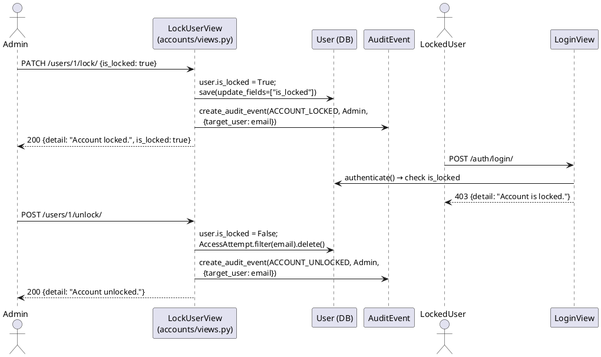

#### b. Sequence Diagram — Role Change

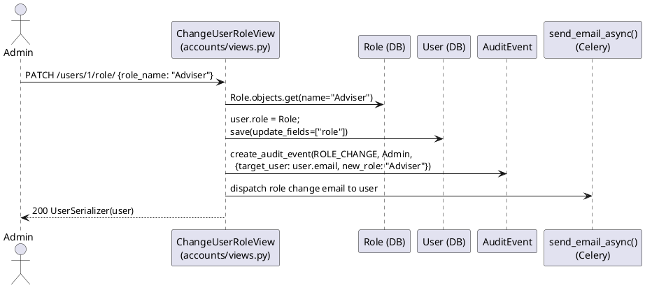

#### c. API Endpoints

| Method | Endpoint | Permission | Description |
|---|---|---|---|
| GET | `/users/` | IsAuthenticated, IsAdmin | List all users ordered by `date_joined` |
| GET | `/users/<pk>/` | IsAuthenticated, IsAdmin | Retrieve individual user profile |
| PATCH | `/users/<pk>/` | IsAuthenticated, IsAdmin | Update individual user profile fields |
| GET | `/users/me/` | IsAuthenticated | Retrieve own profile |
| PATCH | `/users/me/` | IsAuthenticated | Update own profile fields |
| POST | `/auth/password/change/` | IsAuthenticated | Change own password |
| PATCH | `/users/<pk>/lock/` | IsAuthenticated, IsAdmin | Set `is_locked` true or false |
| POST | `/users/<pk>/unlock/` | IsAuthenticated, IsAdmin | Unlock + clear django-axes records |
| GET | `/users/locked/` | IsAuthenticated, IsAdmin | List manually locked + axes-flagged users |
| PATCH | `/users/<pk>/role/` | IsAuthenticated, IsAdmin | Change user role by name or ID |
| GET | `/users/advisers/` | IsAuthenticated | List active Adviser-role users |
| GET | `/settings/<key>/` | IsAuthenticated | Read a system setting by key |
| PATCH | `/settings/<key>/` | IsAuthenticated, IsAdmin | Upsert a system setting by key |

#### d. Business Rules

- `UnlockUserView` deletes `AccessAttempt` rows for the user's email — handles both manual locks (`is_locked=True`) and automated brute-force locks applied by django-axes
- `LockedUsersView` uses `Q(is_locked=True) | Q(email__in=axes_emails)` — covers both lock sources in one query
- Role change accepts `role_name` (string) OR `role` (integer ID); `role_name` takes priority when both are provided
- `LockUserView` logs `ACCOUNT_LOCKED` or `ACCOUNT_UNLOCKED`; `ChangeUserRoleView` logs `ROLE_CHANGE` — all with `target_user` in metadata; these dedicated event types enable filtered audit queries without inspecting sub-keys

---

## 3.2.6.5 — Active Session Monitoring and Revocation

### User Interface Design

#### Front-end Components

**a. `SessionsPage`**
`frontend/src/features/admin/SessionsPage.tsx`

- **a.1** Admin-only page listing all currently active JWT sessions. Calls `accountsApi.sessions()` (GET `/users/sessions/`) on mount. Each row shows user name, email, issue date, and expiry date. A "Revoke" button calls `accountsApi.revokeSession(jti)` (DELETE `/users/sessions/<jti>/`) after a native `confirm()` dialog. On success the row is removed from state immediately (optimistic removal). A "Refresh" button re-fetches the list.
- **a.2** React page component — route `/admin/sessions`; guarded by Admin role check

---

#### Back-end Components

**a. `ActiveSessionsView`**
`backend/apps/accounts/views.py`

- **a.1** `GET /users/sessions/` — queries `OutstandingToken` WHERE `expires_at > now()` AND `blacklistedtoken__isnull = True` with `select_related("user")`. Returns a list of `{ jti, user_id, user_email, user_name, created_at, expires_at }`. No pagination — the list is expected to be short.
- **a.2** DRF `APIView` — permission: `[IsAuthenticated, IsAdmin]`

---

**b. `RevokeSessionView`**
`backend/apps/accounts/views.py`

- **b.1** `DELETE /users/sessions/<jti>/` — looks up `OutstandingToken` by JTI. Returns HTTP 404 "Session not found." if the JTI does not exist. Otherwise creates `BlacklistedToken.objects.get_or_create(token=token)`. Logs a `SESSION_REVOKE` `AuditEvent` with `metadata = { revoked_jti: jti }`. Returns `{ detail: "Session revoked." }`.
- **b.2** DRF `APIView` — permission: `[IsAuthenticated, IsAdmin]`

---

### Object-Oriented Components

#### a. Sequence Diagram — Session Revocation

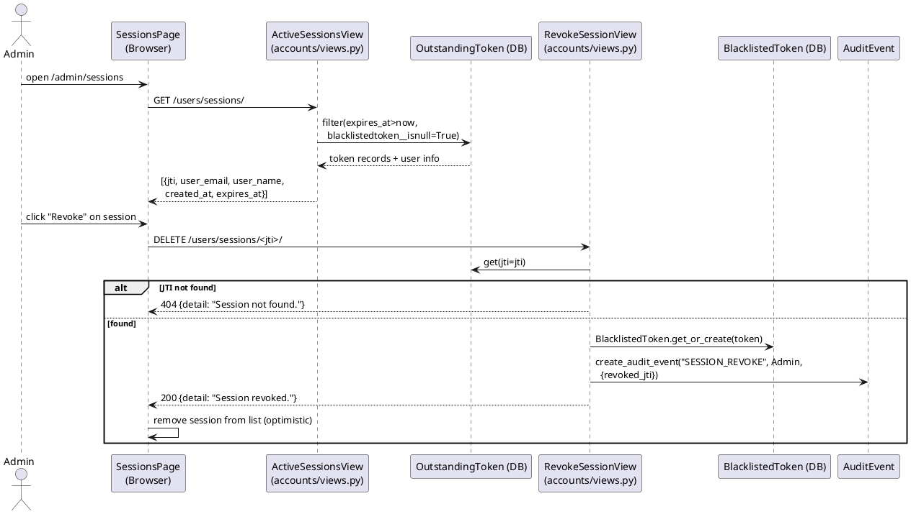

#### b. API Endpoints

| Method | Endpoint | Permission | Description |
|---|---|---|---|
| GET | `/users/sessions/` | IsAuthenticated, IsAdmin | List active (non-expired, non-blacklisted) sessions |
| DELETE | `/users/sessions/<jti>/` | IsAuthenticated, IsAdmin | Revoke session by JTI |

#### c. Business Rules

- Query filter combines `expires_at__gt = timezone.now()` AND `blacklistedtoken__isnull = True` — only sessions that are both valid and not yet revoked are returned
- `get_or_create` prevents a unique-constraint error if the endpoint is called twice for the same JTI
- Audit event uses `"SESSION_REVOKE"` as the `event_type` with `revoked_jti` in `metadata`; this dedicated type distinguishes admin revocation from user-initiated `LOGOUT` events in filtered audit queries
- After revocation, the affected user's access token remains valid until its 30-minute TTL expires; subsequent refresh attempts return HTTP 401

---

## 3.2.6.6 — Data Privacy Consent and Audit Logging

### User Interface Design

#### Front-end Components

**a. `SignupPage`** *(final step — consent)*
`frontend/src/features/auth/SignupPage.tsx`

- **a.1** The last step of the registration form renders the Data Privacy Notice (RA 10173 compliance text). A required checkbox `"I have read and agree to the Data Privacy Notice"` must be checked; the form submit button is disabled until it is. The `consent_given: true` flag is included in the registration payload sent to `authApi.register()`.
- **a.2** React page component — public route `/signup`

---

**b. `AuditLogPage`**
`frontend/src/features/audit/AuditLogPage.tsx`

- **b.1** Django Admin-only page (requires `is_staff = True` Django flag — IT administration accounts; not accessible to IRIS role users including RDCO and KTTO). Loads paginated `AuditEvent` rows from `auditApi.list({ page, event_type })` (GET `/audit/`). Renders a `DataTable` with columns: Time, Event type (colour-coded `Badge`), User, Record title, Details (metadata JSON). Supports server-side filtering by `event_type` (dropdown) and free-text search. Pagination controlled via `onPageChange` prop. Page size is 20 rows.
- **b.2** React page component — route `/admin/audit`; guarded by Django Admin (`is_staff`) check

---

#### Back-end Components

**a. `AuditEvent` model**
`backend/apps/audit/models.py`

- **a.1** Unified audit log table. Fields: `event_type` (indexed `CharField` with choices), `user` (FK to `accounts.User`, nullable), `record` (FK to `records.Record`, nullable), `metadata` (JSONField, default `{}`), `created_at` (auto-indexed `DateTimeField`). The `metadata` column stores event-specific details without requiring schema changes (e.g., `{ "revoked_jti": "abc123" }` for session revocation, or `{ "target_user": "user@example.com", "new_role": "Adviser" }` for role changes). Full `event_type` choices: `LOGIN` · `LOGOUT` · `FAILED_LOGIN` · `PIN_GENERATED` · `PIN_VERIFIED` · `ACCESS` · `UPLOAD` · `DOWNLOAD` · `DELETE` · `RENAME` · `ROLE_CHANGE` · `ACCOUNT_LOCKED` · `ACCOUNT_UNLOCKED` · `SESSION_REVOKE`.
- **a.2** Django model — table `audit_auditevent`

---

**b. `create_audit_event`**
`backend/apps/audit/services.py`

- **b.1** Thin wrapper around `AuditEvent.objects.create()`. Accepts `event_type`, `user`, optional `record`, and optional `metadata` dict. Always wrapped in `try/except Exception: pass` — audit failures must **never** propagate to the caller. `AuditEvent` is imported locally inside the function to break circular-import chains during Django startup.
- **b.2** Service function — called from all views that perform security-relevant operations

---

**c. `AuditEventListView`**
`backend/apps/audit/views.py`

- **c.1** `GET /audit/` — returns a paginated, reverse-chronological `AuditEvent` list with `select_related("user", "record")`. Supports four query parameters: `event_type`, `record`, `user`, `from` (inclusive date), `to` (inclusive date). All parameters are optional and combinable. Read-only; no create, update, or delete endpoint is exposed.
- **c.2** DRF `ListAPIView` — permission: `[IsAuthenticated, IsAdminUser]` (DRF built-in; checks `user.is_staff = True` — restricted to IT administration accounts)

---

**d. `AuditEventExportView`**
`backend/apps/audit/views.py`

- **d.1** `GET /audit/export/` — accepts the same optional query parameters as `GET /audit/` (`event_type`, `record`, `user`, `from`, `to`). Applies the same filter logic to produce a queryset, then serializes the matching rows into a `pyexcel-xlsx` workbook with a single sheet: `"Audit Log"`. Columns: Time, Event Type, User Email, Record ID, Metadata (JSON string). The workbook is streamed as `Content-Disposition: attachment; filename="iris_audit_log.xlsx"`. No pagination — the entire filtered result is exported. Intended for compliance and incident investigation use only.
- **d.2** DRF `APIView` — permission: `[IsAuthenticated, IsAdminUser]` (same restriction as the list endpoint; IT administration only)

---

### Object-Oriented Components

#### a. Class Diagram

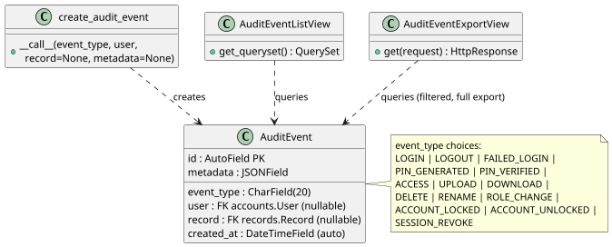

#### b. Sequence Diagram — Audit Logging and Log Access

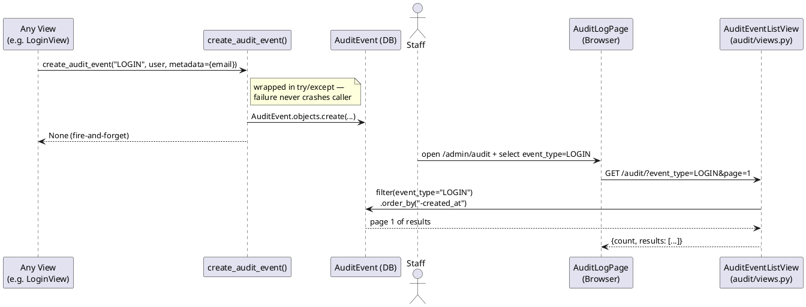

#### c. API Endpoints

| Method | Endpoint | Permission | Description |
|---|---|---|---|
| GET | `/audit/` | IsAuthenticated, IsAdminUser | Paginated audit log with optional filters |
| GET | `/audit/export/` | IsAuthenticated, IsAdminUser | Export filtered audit log as .xlsx |

**Query parameters (all optional):**

| Parameter | Description |
|---|---|
| `event_type` | Filter by event type: `LOGIN` `LOGOUT` `FAILED_LOGIN` `PIN_GENERATED` `PIN_VERIFIED` `ACCESS` `UPLOAD` `DOWNLOAD` `DELETE` `RENAME` `ROLE_CHANGE` `ACCOUNT_LOCKED` `ACCOUNT_UNLOCKED` `SESSION_REVOKE` |
| `record` | Filter by record ID |
| `user` | Filter by user ID |
| `from` | Start date (YYYY-MM-DD, inclusive) |
| `to` | End date (YYYY-MM-DD, inclusive) |

#### d. Business Rules

- `create_audit_event` is **never** awaited and **never** raises — it uses a local import + try/except to be safe during all request phases
- The audit log is immutable: no DELETE, PATCH, or POST endpoint is exposed for `AuditEvent`
- `GET /audit/export/` applies the same filter parameters as `GET /audit/` and streams a `pyexcel-xlsx` workbook containing the entire filtered result (no pagination); access is restricted to the same `IsAdminUser` permission
- `GET /audit/` uses DRF's `IsAdminUser` (checks `user.is_staff = True`) — access is restricted to IT administration Django admin accounts; IRIS role users including RDCO and KTTO cannot read the audit log
- `metadata` is a freeform JSONField; dedicated event types (`ACCOUNT_LOCKED`, `ACCOUNT_UNLOCKED`, `ROLE_CHANGE`, `SESSION_REVOKE`) carry context directly in named metadata fields (`target_user`, `new_role`, `revoked_jti`) rather than using a generic `action` sub-key; the `action` key is reserved for sub-variants of the generic `ACCESS` event only
- `consent_given = True` is enforced by `RegisterSerializer` at the field level; requests with `consent_given = False` are rejected with a validation error before the user is created

---

## Data Schema

### Table: `accounts_user`

| Column | Type | Constraints |
|---|---|---|
| `id` | AutoField | PK |
| `email` | EmailField | UNIQUE |
| `first_name` | CharField(100) | |
| `middle_initial` | CharField(20) | blank |
| `last_name` | CharField(100) | |
| `role_id` | FK → `accounts_role` | NULL if not yet assigned |
| `is_verified` | BooleanField | default False |
| `is_locked` | BooleanField | default False |
| `is_staff` | BooleanField | default False |
| `is_active` | BooleanField | default True |
| `date_joined` | DateTimeField | auto_now_add |

### Table: `accounts_role`

| Column | Type | Constraints |
|---|---|---|
| `id` | AutoField | PK |
| `name` | CharField(50) | UNIQUE |

**Seeded values:** Student, Adviser, KTTO, RDCO, ITSO, IERC

### Table: `accounts_rolerequest`

| Column | Type | Constraints |
|---|---|---|
| `id` | AutoField | PK |
| `user_id` | FK → `accounts_user` | CASCADE |
| `requested_role_id` | FK → `accounts_role` | CASCADE |
| `status` | CharField(10) | pending / approved / declined |
| `reviewed_by_id` | FK → `accounts_user` | NULL, SET NULL |
| `created_at` | DateTimeField | auto_now_add |
| `reviewed_at` | DateTimeField | NULL |

### Table: `token_blacklist_outstandingtoken` *(simplejwt)*

| Column | Type | Notes |
|---|---|---|
| `id` | AutoField | PK |
| `jti` | CharField | UNIQUE — JWT ID |
| `token` | TextField | Raw JWT string |
| `created_at` | DateTimeField | |
| `expires_at` | DateTimeField | |
| `user_id` | FK → `accounts_user` | NULL |

### Table: `token_blacklist_blacklistedtoken` *(simplejwt)*

| Column | Type | Notes |
|---|---|---|
| `id` | AutoField | PK |
| `token_id` | FK → `outstandingtoken` | UNIQUE |
| `blacklisted_at` | DateTimeField | auto_now_add |

### Table: `audit_auditevent`

| Column | Type | Constraints |
|---|---|---|
| `id` | AutoField | PK |
| `event_type` | CharField(20) | db_index; choices: LOGIN / LOGOUT / FAILED_LOGIN / PIN_GENERATED / PIN_VERIFIED / ACCESS / UPLOAD / DOWNLOAD / DELETE / RENAME / ROLE_CHANGE / ACCOUNT_LOCKED / ACCOUNT_UNLOCKED / SESSION_REVOKE |
| `user_id` | FK → `accounts_user` | NULL, SET NULL |
| `record_id` | FK → `records_record` | NULL, blank |
| `metadata` | JSONField | default `{}` |
| `created_at` | DateTimeField | auto_now_add; db_index |
