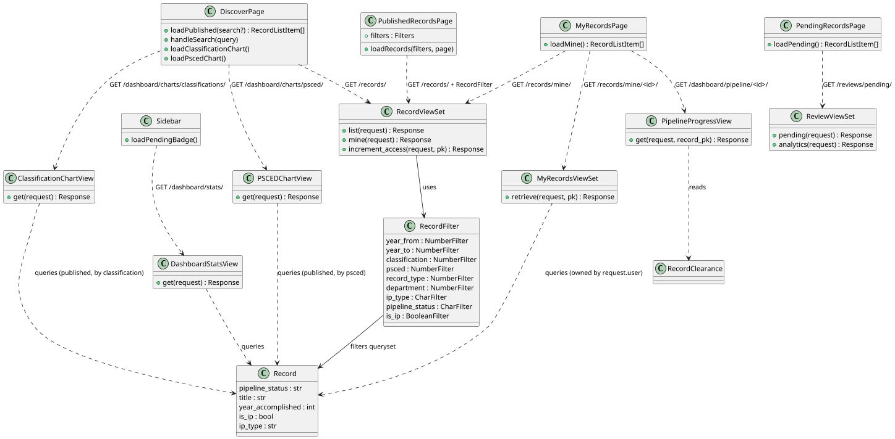
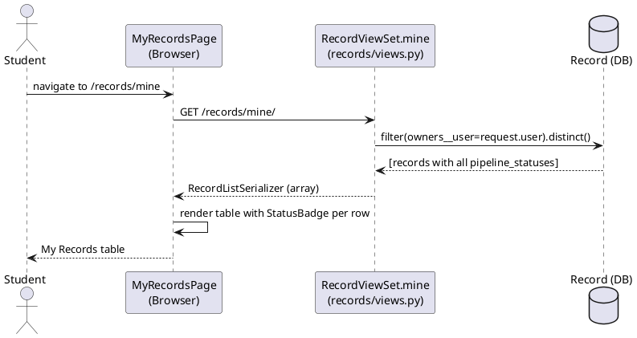
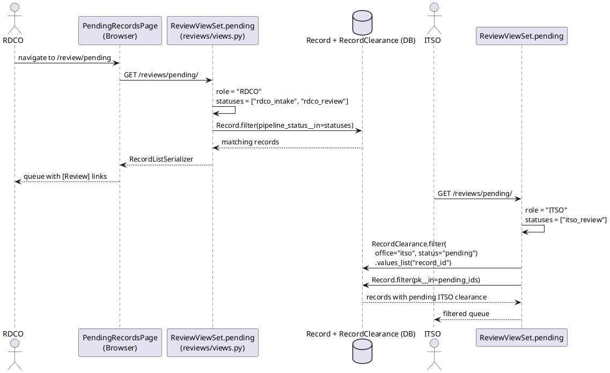
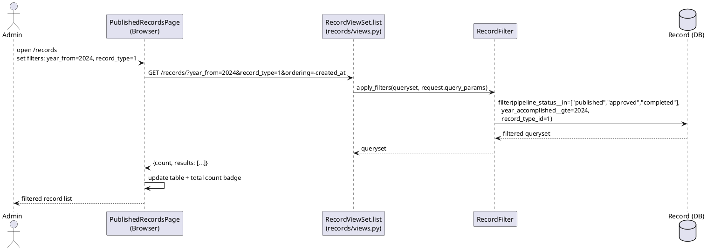
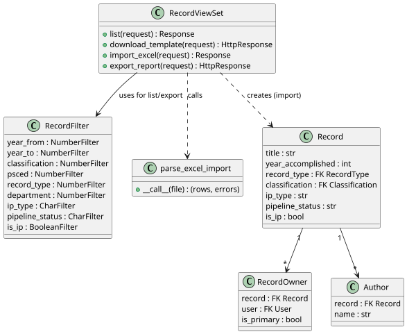
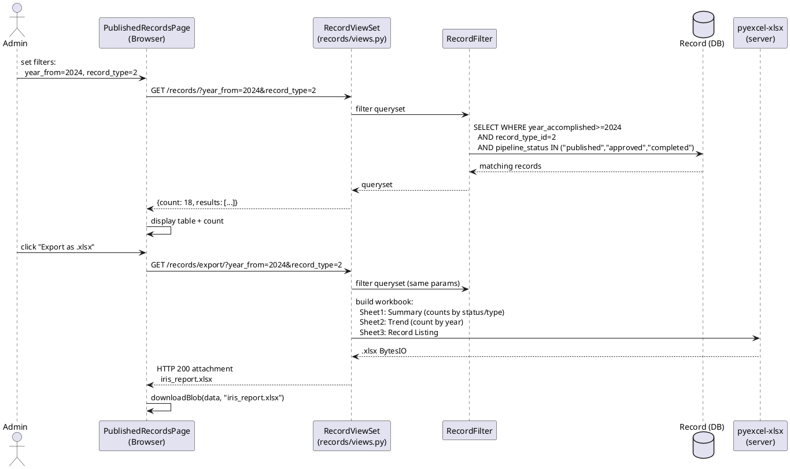
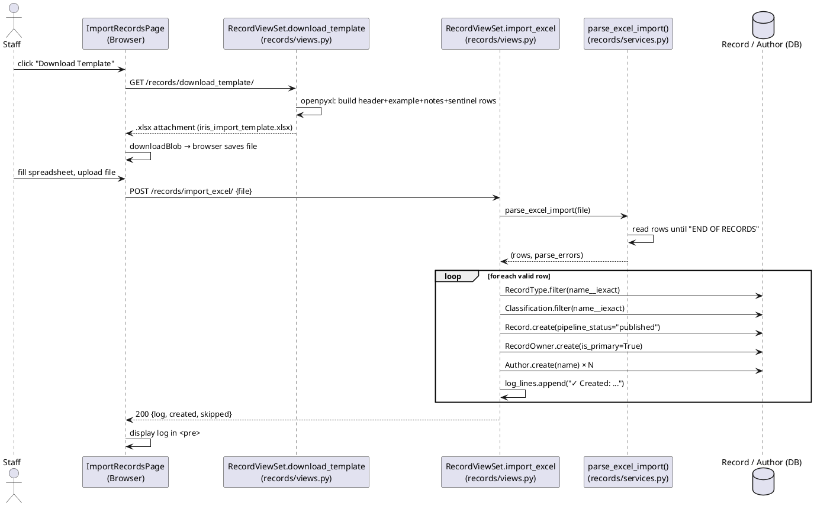

# Module 7 — Software Design Document: KPI Dashboard & Analytics

---

## 3.2.7.1 — Role-Differentiated Pipeline Monitoring Dashboard

### User Interface Design

#### Front-end Components

**a. `DiscoverPage`** *(main authenticated home)*
`frontend/src/features/discover/DiscoverPage.tsx`

- **a.1** The landing page for all authenticated users after login. Loads all published records via `recordsApi.list({ ordering: "-created_at", page_size: 24 })` (GET `/records/`) and presents three sub-sections: **Spotlight Research** (first two results), **Recently Indexed** (remaining results), and a **Trending Topics / Classification Breakdown** section that calls `GET /dashboard/charts/classifications/` and `GET /dashboard/charts/psced/` to display published-record counts grouped by academic classification and PSCED discipline. A full-text search box triggers `recordsApi.list({ search: query })` and replaces the layout with a `SearchResultCard` grid. Quick-chip buttons map to pre-configured search terms. All data is fetched on mount and re-fetched on search.
- **a.2** React page component — route `/` (default authenticated home); exported as `DashboardPage` alias

---

**b. `MyRecordsPage`** *(Student / owner pipeline view)*
`frontend/src/features/records/MyRecordsPage.tsx`

- **b.1** Displays the current user's own records (all pipeline statuses) in a tabular list. Calls `recordsApi.mine()` (GET `/records/mine/`). Each row shows: Title (link to detail), Record Type, `pipeline_status` (rendered as `StatusBadge`), and Date Added. An "Add Record" button links to `/records/add`. This page gives students a personal pipeline overview — they see Draft, Under Review, Published, and Declined records in one place.
- **b.2** React page component — route `/records/mine`

---

**c. `PendingRecordsPage`** *(Staff review queue)*
`frontend/src/features/review/PendingRecordsPage.tsx`

- **c.1** Staff-only queue page. Calls `reviewsApi.pending()` (GET `/reviews/pending/`) on mount. The response is server-filtered by the caller's role — each reviewer sees only the records in their pipeline stage with their office's clearance still pending (see T5.1 for the filtering logic). Each row shows Title, Record Type, Date Submitted, and a "Review" button linking to `/review/<id>/evaluate`. A manual "Refresh" button re-fetches the list from the server. An empty state is shown when the queue is clear.
- **c.2** React page component — route `/review/pending`

---

**d. `PublishedRecordsPage`** *(Staff/Admin filtered record browser)*
`frontend/src/features/records/PublishedRecordsPage.tsx`

- **d.1** Full-featured published record browser used by staff and Admin for report-style queries. Maintains a `Filters` state: `{ search, year_from, year_to, record_type, classification, ip_type, is_ip }`. On filter change or page change, calls `recordsApi.list(filtersToParams(filters, page))` and updates the table. Reference data (classifications, record types) is loaded once on mount via `recordsApi.classifications()` and `recordsApi.recordTypes()`. Shows a total record count and active filter count badge. A manual "Refresh" button re-fetches the current filtered result from the server. Paginated via a `DataTable` component.
- **d.2** React page component — route `/records`

---

**e. `Sidebar`**
`frontend/src/components/layout/Sidebar.tsx`

- **e.1** Persistent navigation sidebar rendered inside `AppLayout` for all authenticated routes. On mount, calls `GET /dashboard/stats/` and reads the `pending_mine` field to display a badge count on the "My Records" / workspace navigation item, giving users a live count of records currently awaiting review. Role-based menu items are shown or hidden based on `user.role` from the `useAuth` store (see M06 SDD T6.2-a for the full role-to-menu-item mapping).
- **e.2** React layout component — rendered for all authenticated routes; badge refreshes on mount

---

#### Back-end Components

**a. `RecordViewSet.list` / `RecordViewSet.mine` / `MyRecordsViewSet`**
`backend/apps/records/views.py`

- **a.1** `GET /records/` — returns publicly visible records (`pipeline_status__in = ("published", "approved", "completed")`) with `select_related` and `prefetch_related`. `"approved"` includes ongoing Proposals; `"completed"` includes finished Proposals — both remain visible in Browse Collections. Supports `DjangoFilterBackend` (`RecordFilter`), `SearchFilter` (title, abstract, authors), and `OrderingFilter` (created_at, year_accomplished, title, access_count). `GET /records/mine/` (action: `mine`) — returns all records owned by the current user regardless of `pipeline_status`, via `Record.objects.filter(owners__user=request.user).distinct()`. Used by students and owners for their personal pipeline view. `GET /records/mine/<id>/` (`MyRecordsViewSet` — `RetrieveModelMixin`) — returns the full `RecordDetailSerializer` for a single owned record, filtered to only records where the current user is an owner; returns 404 if the user does not own the record.
- **a.2** DRF `ModelViewSet` — `list` permission: `[IsAuthenticated]`; `mine` and `mine/<id>/` permission: `[IsAuthenticated]`

---

**b. `RecordFilter`**
`backend/apps/records/filters.py`

- **b.1** Django-filter `FilterSet` attached to `RecordViewSet`. Supports the following filter parameters:

  | Parameter | Filter | Description |
  |---|---|---|
  | `year_from` | `year_accomplished__gte` | Records from this year onward |
  | `year_to` | `year_accomplished__lte` | Records up to this year |
  | `classification` | `classification_id` | Exact match by Classification ID |
  | `psced` | `psced_id` | Exact match by PSCED classification ID |
  | `record_type` | `record_type_id` | Exact match by RecordType ID |
  | `department` | `owners__user__student_profile__course__department_id` | Filter by department (via the submitting student's course → department join) |
  | `is_ip` | BooleanFilter | Filter by IP flag |
  | `ip_type` | CharFilter | patent / copyright / trade_secret / utility_model |
  | `pipeline_status` | CharFilter | published / draft / rdco_intake / etc. |

- **b.2** Django-filter class — applied as `filterset_class` on `RecordViewSet`

---

**c. `ReviewViewSet.pending`**
`backend/apps/reviews/views.py`

- **c.1** `GET /reviews/pending/` — returns records awaiting the current reviewer's action. Uses a role-to-statuses mapping, then applies an additional clearance filter for office-based roles (ITSO, IERC, KTTO):

  | Role | Pipeline statuses shown | Clearance filter |
  |---|---|---|
  | Adviser | `adviser_review` | `record.adviser = request.user` |
  | RDCO | `rdco_intake`, `rdco_review` | — |
  | ITSO | `itso_review` | pending ITSO clearance exists |
  | IERC | `parallel_review` | pending IERC clearance exists |
  | KTTO | `itso_review`, `parallel_review` | pending KTTO clearance exists |

- **c.2** DRF `GenericViewSet` action — permission: `[IsAuthenticated, IsReviewer]`

---

**d. `ReviewViewSet.analytics`**
`backend/apps/reviews/views.py`

- **d.1** `GET /reviews/analytics/` — computes per-stage average processing time. For each record, the duration at a given stage is the elapsed days between the `Review.created_at` timestamp when the record entered that stage and the `Review.created_at` of the next sequential review on the same record (ordered by `created_at`). Results are grouped by `stage`, averaged across all records that have exited each stage, and returned as `{ stage_averages: [{ stage: str, avg_days: float, record_count: int }] }`. Stages with only one review entry (record still in progress) are excluded from the average. The stage name values correspond to `Review.stage` choices: `adviser`, `rdco_intake`, `itso`, `ierc`, `ktto`, `rdco`.
- **d.2** DRF `GenericViewSet` action — permission: `[IsAuthenticated, IsStaff]`

---

**e. `RecordViewSet.increment_access`**
`backend/apps/records/views.py`

- **e.1** `POST /records/<id>/increment_access/` — increments the `access_count` field on the specified record by 1 using an `UPDATE` query (no race condition). Calls `create_audit_event("ACCESS", request.user, record=record)` to log the access in the audit trail. Returns `{ access_count: <new_value> }`. Any authenticated user who can view a record can call this endpoint; it is called client-side when a user opens the full record detail page. The `access_count` field feeds the `OrderingFilter` on `GET /records/`, allowing records to be sorted by popularity.
- **e.2** DRF `ModelViewSet` action — permission: `[IsAuthenticated]`

---

**f. `DashboardStatsView`**
`backend/apps/records/views_dashboard.py`

- **f.1** `GET /dashboard/stats/` — returns the KPI counter cards for the current user's dashboard. Computes four owner-scoped counts (using `Record.objects.filter(owners__user=request.user)`) and one institution-wide count:

  | Field | Value |
  |---|---|
  | `total_mine` | Total records owned by the current user |
  | `pending_mine` | Owned records currently in any review stage |
  | `approved_mine` | Owned records with `pipeline_status = "published"` |
  | `declined_mine` | Owned records with `pipeline_status = "declined"` |
  | `total_published` | All published records institution-wide (returns 0 if user has no role assigned) |

  These map directly to the dashboard counter widgets in the FR-M7-01 wireframes.
- **f.2** DRF `APIView` — permission: `[IsAuthenticated]`

---

**g. `ClassificationChartView`**
`backend/apps/records/views_dashboard.py`

- **g.1** `GET /dashboard/charts/classifications/` — returns published records grouped by `classification__name` with a `count` per group, ordered by count descending. Used to render the classification breakdown chart (pie or bar) on the dashboard. Response format: `[{ "classification__name": str, "count": int }, ...]`.
- **g.2** DRF `APIView` — permission: `[IsAuthenticated]`

---

**h. `PSCEDChartView`**
`backend/apps/records/views_dashboard.py`

- **h.1** `GET /dashboard/charts/psced/` — returns published records grouped by `psced__name` with a `count` per group, ordered by count descending. Used to render the PSCED discipline breakdown chart on the dashboard. Response format: `[{ "psced__name": str, "count": int }, ...]`.
- **h.2** DRF `APIView` — permission: `[IsAuthenticated]`

---

**i. `PipelineProgressView`**
`backend/apps/records/views_dashboard.py`

- **i.1** `GET /dashboard/pipeline/<record_pk>/` — returns the per-office clearance breakdown for a specific record. The requesting user must be an owner of the record or `is_staff`; otherwise returns HTTP 403. Response format: `{ pipeline_status: str, clearances: [{ office: str, status: "pending" | "cleared" | "declined" }, ...] }`. The `clearances` list is built from all `RecordClearance` rows associated with the record (offices: `ITSO`, `IERC`, `KTTO`). Offices with no `RecordClearance` row yet are omitted. RDCO does not have a `RecordClearance` row — its review is reflected directly in `pipeline_status`. Used by `MyRecordsPage` to render per-office status badges on each record row, giving students visibility into which offices have cleared their submission.
- **i.2** DRF `APIView` — permission: `[IsAuthenticated]`

---

### Object-Oriented Components

#### a. Class Diagram

#### b. Sequence Diagram — Student Dashboard (My Records)

#### c. Sequence Diagram — Staff Pipeline Queue

#### d. Sequence Diagram — Admin Record Browse with Filters

#### e. API Endpoints

| Method | Endpoint | Permission | Description |
|---|---|---|---|
| GET | `/records/` | IsAuthenticated | Published records; filterable via `RecordFilter` |
| GET | `/records/mine/` | IsAuthenticated | Owner's own records (all pipeline statuses) |
| GET | `/records/mine/<id>/` | IsAuthenticated | Owner's single record detail with full review history |
| POST | `/records/<id>/increment_access/` | IsAuthenticated | Increment access count; log ACCESS audit event |
| GET | `/reviews/pending/` | IsAuthenticated, IsReviewer | Role-filtered staff review queue |
| GET | `/reviews/analytics/` | IsAuthenticated, IsStaff | Per-stage average processing time (days) |
| GET | `/dashboard/stats/` | IsAuthenticated | Dashboard KPI counter cards (mine + institution totals) |
| GET | `/dashboard/charts/classifications/` | IsAuthenticated | Published records count grouped by classification |
| GET | `/dashboard/charts/psced/` | IsAuthenticated | Published records count grouped by PSCED discipline |
| GET | `/dashboard/pipeline/<record_pk>/` | IsAuthenticated | Per-office clearance status for a specific record (owner or staff only) |

#### f. Business Rules

- `GET /records/` filters to `pipeline_status__in = ("published", "approved", "completed")` — draft and in-pipeline records are not visible via the public list endpoint; `"approved"` and `"completed"` expose ongoing and finished Proposals in Browse Collections
- `GET /records/mine/` has **no** pipeline_status filter — owners see their records regardless of status; used to build the student's pipeline overview
- `ReviewViewSet.pending` applies both a `pipeline_status__in` filter **and** a per-office clearance filter for ITSO, IERC, KTTO — a staff member only sees records where their specific clearance row is still `pending`
- Client-side aggregation: `MyRecordsPage` counts records by `pipeline_status` from the flat array returned by `/records/mine/`; no server-side aggregate endpoint is needed because the student's record set is small
- `RecordFilter.department` joins through `owners__user__student_profile__course__department_id` — only applies when the primary owner has a `StudentProfile` with a course assigned; records without a linked department silently fall outside the filter result
- `ReviewViewSet.analytics` uses `Review.created_at` timestamps ordered per record to compute stage durations; records still in a stage (no subsequent review) are excluded from that stage's average so in-flight records do not skew the result
- `RecordViewSet.increment_access` uses a direct `UPDATE` query (`Record.objects.filter(pk=...).update(...)`) to increment `access_count` atomically, avoiding race conditions on concurrent views; the resulting `access_count` supports the popularity ordering on `GET /records/`
- `GET /records/mine/<id>/` (`MyRecordsViewSet`) applies the same ownership filter as `GET /records/mine/`; calling it with a record the user does not own returns HTTP 404 — the detail view does not distinguish between "not found" and "not owned" to avoid information leakage
- `GET /dashboard/stats/` returns `total_published = 0` for users with no role assigned (`user.role is None`) to avoid exposing institution counts to unverified/pending accounts; all other fields are always computed
- `ClassificationChartView` and `PSCEDChartView` operate only on `pipeline_status = "published"` records — draft and in-pipeline records are excluded from chart data
- `PipelineProgressView` returns HTTP 403 if the requesting user is neither an owner of the record nor `is_staff`; it does not distinguish "not found" from "forbidden" to avoid information leakage
- `PipelineProgressView` omits offices that have no `RecordClearance` row yet — only offices that have been assigned a clearance (at pipeline entry to their stage) appear in the response

---

## 3.2.7.2 — Report Generation and Export

### User Interface Design

#### Front-end Components

**a. `PublishedRecordsPage`** *(report view — see T7.1-d)*
`frontend/src/features/records/PublishedRecordsPage.tsx`

- **a.1** Doubles as the report interface for staff and Admin. The filter panel (`year_from`/`year_to`, `record_type`, `classification`, `ip_type`, `is_ip`) maps directly to `RecordFilter` query parameters. Each filter change re-queries the server; the returned `count` field provides the aggregate total for the current filter combination. The table renders matching records with key metadata (title, type, year, IP classification). An "Export" button calls a dedicated export endpoint to stream a `pyexcel-xlsx` `.xlsx` workbook to the browser via `downloadBlob`.
- **a.2** React page component — route `/records`

---

**b. `ImportRecordsPage`** *(legacy data migration)*
`frontend/src/features/records/ImportRecordsPage.tsx`

- **b.1** Staff-only page for bulk-importing pre-existing research records from a spreadsheet. Provides a "Download Template" button that calls `recordsApi.downloadTemplate()` (GET `/records/download_template/`) and saves the file via `downloadBlob`. A drag-and-drop / click file picker accepts `.xls` and `.xlsx` files. Clicking "Generate" calls `recordsApi.importExcel(file)` (POST `/records/import_excel/` multipart). The import log (lines prefixed `✓` for success, `✗` for error, `⚠` for warnings) is displayed in a styled `<pre>` block. Shows a summary line `"Done — N record(s) created, M skipped."`.
- **b.2** React page component — route `/records/import`; guarded by Staff role check

---

#### Back-end Components

**a. `RecordViewSet.download_template`**
`backend/apps/records/views.py`

- **a.1** `GET /records/download_template/` — builds a styled `.xlsx` workbook using `openpyxl` (which supports per-cell font, fill, alignment, and border styling required by the template format). Sheet `"Records"` contains: a styled header row (IRIS maroon `#6B0F12` fill, bold white text, centered alignment, thin borders), an example data row, a yellow notes row explaining each column, and a dark-fill `"END OF RECORDS"` sentinel row. Column widths are set explicitly via `ws.column_dimensions`. The header row is frozen at `A2`. The workbook is serialized to a `BytesIO` buffer and streamed as `Content-Disposition: attachment; filename="iris_import_template.xlsx"`.
- **a.2** DRF `GenericViewSet` action — permission: `[IsAuthenticated, IsStaff]`

---

**b. `RecordViewSet.import_excel`**
`backend/apps/records/views.py`

- **b.1** `POST /records/import_excel/` — accepts `multipart/form-data` with key `"file"`. Calls `parse_excel_import(file)` which returns `(rows, parse_errors)`. For each valid row: looks up `RecordType`, `Classification`, and `PSCEDClassification` by name (case-insensitive); creates a `Record` with `pipeline_status = "published"`; creates a `RecordOwner`; creates `Author` rows. Accumulates a log of `✓ Created`, `✗ Failed`, and `⚠ Warning` lines. Returns `{ log, created, skipped }`. Legacy imports bypass the review pipeline — staff is the implicit publisher.
- **b.2** DRF `GenericViewSet` action — permission: `[IsAuthenticated, IsStaff]`

---

**c. `parse_excel_import`**
`backend/apps/records/services.py`

- **c.1** Accepts a Django `UploadedFile` object (`.xls` or `.xlsx`). Uses `pyexcel-xls` / `pyexcel-xlsx` to read the sheet. Iterates rows until the `"END OF RECORDS"` sentinel is encountered. For each data row: extracts and validates required fields (`title`, `year_accomplished`); maps string values to the expected types; normalises boolean strings (`"TRUE"` / `"FALSE"` → `True` / `False`); splits `authors` string on commas. Returns `(rows: list[dict], parse_errors: list[str])`.
- **c.2** Service function — called from `RecordViewSet.import_excel`

---

**d. Report Export via `RecordViewSet.list` + pyexcel-xlsx**
`backend/apps/records/views.py`

- **d.1** The report export endpoint applies the same `RecordFilter` query parameters as the dashboard browse (year, department, record type, IP classification, pipeline status) to the `RecordViewSet.list` queryset. The result set is fed into a `pyexcel-xlsx` workbook with three sheets:
  - **Sheet 1 — Summary**: aggregate counts by `pipeline_status` and `record_type`
  - **Sheet 2 — Trend**: records grouped and counted by `year_accomplished`
  - **Sheet 3 — Record Listing**: one row per matching record with title, type, year, classification, IP flags, authors
  The workbook is serialized and streamed as an `.xlsx` attachment via `Content-Disposition`.
- **d.2** DRF `GenericViewSet` action — permission: `[IsAuthenticated, IsStaff]`

---

### Object-Oriented Components

#### a. Class Diagram

#### b. Sequence Diagram — Report Query and Export

#### c. Sequence Diagram — Legacy Excel Import

#### d. API Endpoints

| Method | Endpoint | Permission | Description |
|---|---|---|---|
| GET | `/records/` | IsAuthenticated | Published records; filterable via `RecordFilter` (report query) |
| GET | `/records/export/` | IsAuthenticated, IsStaff | Export filtered records as .xlsx (3-sheet workbook) |
| GET | `/records/download_template/` | IsAuthenticated, IsStaff | Download styled .xlsx import template |
| POST | `/records/import_excel/` | IsAuthenticated, IsStaff | Bulk import from .xlsx; returns import log |

#### e. Business Rules

- `parse_excel_import` stops reading at the first cell containing `"END OF RECORDS"` — this sentinel prevents blank rows at the bottom of the spreadsheet from generating errors
- `RecordType`, `Classification`, and `PSCEDClassification` are looked up case-insensitively (`name__iexact`) — unmatched values default to `None` (the field is left blank on the record)
- Boolean columns (`is_ip`, `for_commercialization`, `community_extension`) normalise the strings `"TRUE"` / `"FALSE"` (any case) to Python booleans; any other value logs a parse warning
- Imported records are created with `pipeline_status = "published"` and bypass the review pipeline — this is the legacy migration path for records that were already approved externally
- Import log lines use `✓` (success), `✗` (failed), `⚠` (warning) prefixes — the frontend renders them verbatim in a `<pre>` block
- Report export uses the same `RecordFilter` query parameters as the list endpoint; filter params are forwarded from the frontend without any server-side caching

---

## Data Schema

All tables used by Module 7 are defined in Module 5 (`records_record`, `records_recordowner`, `records_author`) and Module 2 (`records_classification`, `records_pscedclassification`, `records_recordtype`). No new tables are introduced in Module 7.

### Key Fields for Dashboard Aggregation

| Table | Column | Used for |
|---|---|---|
| `records_record` | `pipeline_status` | Student pipeline overview; staff queue filter; admin status breakdown |
| `records_record` | `year_accomplished` | Year-based trend aggregation (report Sheet 2) |
| `records_record` | `record_type_id` | Record type breakdown (report Sheet 1 / filter) |
| `records_record` | `classification_id` | Classification filter |
| `records_record` | `ip_type` | IP classification filter |
| `records_record` | `is_ip` | IP flag filter |
| `reviews_review` | `created_at`, `stage`, `record_id` | Per-stage average processing time (analytics endpoint) |
| `reviews_recordclearance` | `office`, `status` | Staff queue clearance filter (pending only) |

### `RecordFilter` Parameter → DB Column Mapping

| Query param | Django filter expression | DB column |
|---|---|---|
| `year_from` | `year_accomplished__gte` | `records_record.year_accomplished` |
| `year_to` | `year_accomplished__lte` | `records_record.year_accomplished` |
| `classification` | `classification_id` | `records_record.classification_id` |
| `psced` | `psced_id` | `records_record.psced_id` |
| `record_type` | `record_type_id` | `records_record.record_type_id` |
| `department` | `owners__user__student_profile__course__department_id` | `accounts_studentprofile.course_id` → `records_course.department_id` |
| `is_ip` | BooleanFilter | `records_record.is_ip` |
| `ip_type` | exact match | `records_record.ip_type` |
| `pipeline_status` | exact match | `records_record.pipeline_status` |
