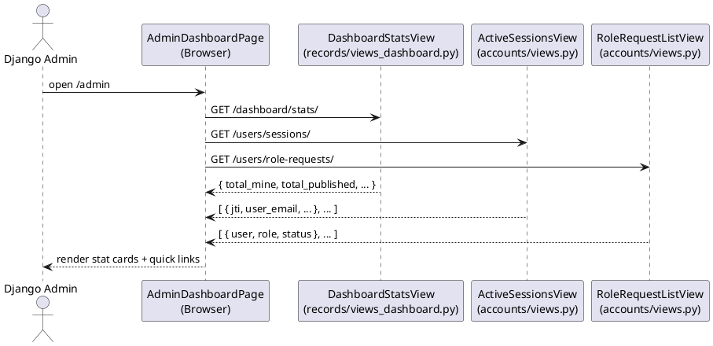
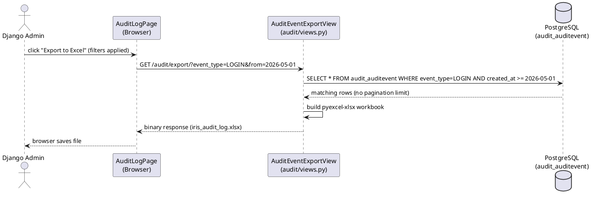
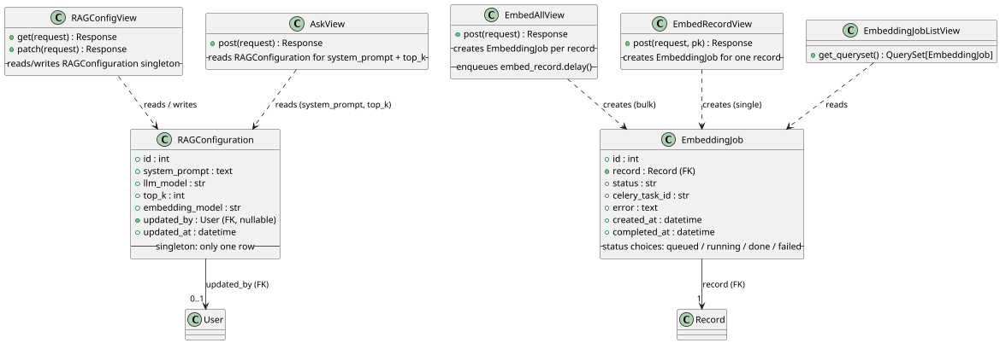
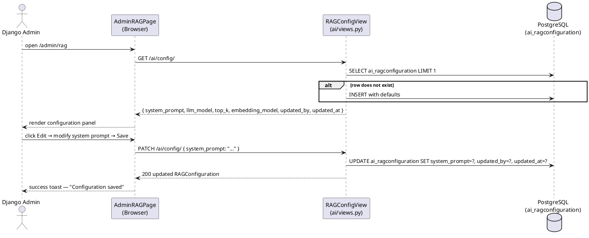
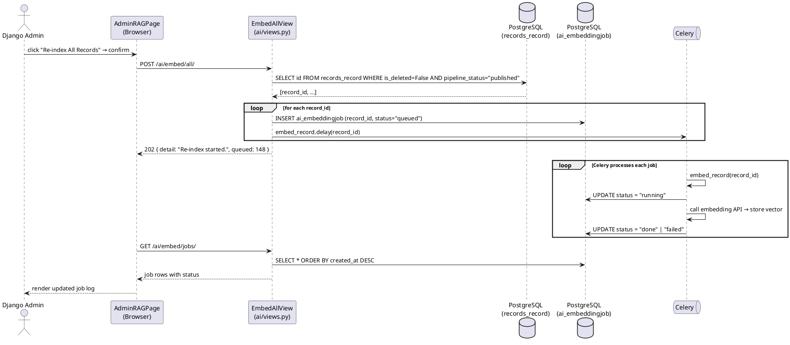

# Module 8 — Software Design Document: Admin Portal

---

## 3.2.8.1 — Admin Portal Overview and User Administration

### User Interface Design

#### Front-end Components

**a. `AdminDashboardPage`**
`frontend/src/features/admin/AdminDashboardPage.tsx`

- **a.1** Admin-only landing page at route `/admin`. On mount, fetches summary stats in parallel: total users, locked users, pending role requests, and active sessions count. Renders four stat cards linking to their respective admin sub-pages. A fifth card links to the RAG management page. Access is gated by `is_staff = True`; non-admin users are redirected to `/403`.
- **a.2** React page component (default export) — route `/admin`; guarded by `is_staff` check

---

**b. `UserListPage`** *(see also M06 §3.2.6.4)*
`frontend/src/features/accounts/UserListPage.tsx`

- **b.1** Admin-only table of all system users accessible from the Admin Portal. Each row exposes role-change dropdown and lock/unlock toggle. See M06 §3.2.6.4 for full component specification. Accessible from `/admin/users`.
- **b.2** React page component — route `/admin/users`

---

**c. `RoleRequestsPage`** *(see also M06 §3.2.6.3)*
`frontend/src/features/accounts/RoleRequestsPage.tsx`

- **c.1** Admin/RDCO-visible page listing pending role requests. See M06 §3.2.6.3 for full specification. Accessible from `/admin/role-requests`.
- **c.2** React page component — route `/admin/role-requests`

---

**d. `SessionsPage`** *(see also M06 §3.2.6.5)*
`frontend/src/features/admin/SessionsPage.tsx`

- **d.1** Admin-only active session list with revoke capability. See M06 §3.2.6.5 for full specification. Accessible from `/admin/sessions`.
- **d.2** React page component — route `/admin/sessions`

---

#### Back-end Components

All back-end components for user administration (lock/unlock, role change, role requests, session management) are documented in M06 §3.2.6.3 through §3.2.6.5. The Admin Portal provides the unified front-end entry point; no new back-end views are introduced in this section.

---

### Object-Oriented Components

#### a. Sequence Diagram — Admin Dashboard Load

---

## 3.2.8.2 — Audit Log Management

### User Interface Design

#### Front-end Components

**a. `AuditLogPage`** *(see also M06 §3.2.6.6)*
`frontend/src/features/audit/AuditLogPage.tsx`

- **a.1** Django Admin-only page rendering a paginated audit event table with filtering by `event_type`, user, record, and date range. An "Export to Excel" button calls `auditApi.export(filters)` (GET `/audit/export/`) and triggers a browser download of `iris_audit_log.xlsx`. See M06 §3.2.6.6 for full component specification. Accessible from the Admin Portal at `/admin/audit`.
- **a.2** React page component — route `/admin/audit`; guarded by `is_staff` check

---

**b. `auditApi`**
`frontend/src/api/audit.ts`

- **b.1** `list(params)` GETs `/audit/` with optional query params (`event_type`, `user`, `record`, `from`, `to`, `page`). Returns paginated `{ count, results: AuditEvent[] }`. `export(params)` GETs `/audit/export/` with the same optional params and a `responseType: "blob"` header; triggers a browser file save with filename `iris_audit_log.xlsx`.
- **b.2** API client module

---

#### Back-end Components

**a. `AuditEventListView`** *(see also M06 §3.2.6.6)*
`backend/apps/audit/views.py`

- **a.1** `GET /api/v1/audit/` — paginated, filterable audit event list. Full specification in M06 §3.2.6.6. Permission: `[IsAuthenticated, IsAdminUser]`.
- **a.2** DRF `ListAPIView` — permission: `[IsAuthenticated, IsAdminUser]`

---

**b. `AuditEventExportView`**
`backend/apps/audit/views.py`

- **b.1** `GET /api/v1/audit/export/` — accepts the same optional query parameters as `GET /audit/`. Applies the same filters and serializes all matching `AuditEvent` rows (no pagination) into a single-sheet `pyexcel-xlsx` workbook with columns: Time, Event Type, User Email, Record ID, Metadata (JSON string). Streams the workbook as `Content-Disposition: attachment; filename="iris_audit_log.xlsx"`. Full specification in M06 §3.2.6.6.
- **b.2** DRF `APIView` — permission: `[IsAuthenticated, IsAdminUser]`

---

### Object-Oriented Components

#### a. Sequence Diagram — Export Audit Log

---

## 3.2.8.3 — RAG and AI Index Administration

### User Interface Design

#### Front-end Components

**a. `AdminRAGPage`**
`frontend/src/features/admin/AdminRAGPage.tsx`

- **a.1** Admin-only page at `/admin/rag`. On mount, fetches the current `RAGConfiguration` via `aiApi.getRagConfig()` (GET `/ai/config/`) and the recent embedding job log via `aiApi.embeddingJobs()` (GET `/ai/embed/jobs/`). Renders two panels: (1) **Configuration Panel** — displays current system prompt, LLM model, top-K, and embedding model. An "Edit Configuration" button opens an inline form. On save, calls `aiApi.updateRagConfig(patch)` (PATCH `/ai/config/`) and shows a success toast. (2) **Embedding Index Panel** — shows total records vs. indexed count, the last-run timestamp, a "Re-index All Records" button (POST `/ai/embed/all/`), and a single-record embed input (POST `/ai/embed/<pk>/`). The Embedding Job Log renders job rows with record title, status badge, model name, and timestamp.
- **a.2** React page component (default export) — route `/admin/rag`; guarded by `is_staff` check

---

**b. `EmbeddingJobsPage`** *(referenced from M03 §3.2.3.3)*
`frontend/src/features/admin/EmbeddingJobsPage.tsx`

- **b.1** Standalone page showing the full `EmbeddingJob` log with filter by status and record. Can be navigated to directly from the Admin Portal or from `AdminRAGPage`. Calls `aiApi.embeddingJobs()` on mount and supports manual refresh. Part of the Admin Portal's AI administration tools.
- **b.2** React page component — route `/admin/embeddings`

---

**c. `aiApi`** *(extended for admin)*
`frontend/src/api/ai.ts`

- **c.1** Extended with admin-specific calls: `getRagConfig()` GETs `/ai/config/` and returns the current `RAGConfiguration` object. `updateRagConfig(patch)` PATCHes `/ai/config/` with the partial update payload. `triggerEmbedAll()` POSTs to `/ai/embed/all/` to queue a full re-index. `embedRecord(recordId)` POSTs to `/ai/embed/<pk>/` to queue embedding for a single record. `embeddingJobs(params?)` GETs `/ai/embed/jobs/` with optional `status` and `record` filter params.
- **c.2** API client module — part of the `aiApi` module

---

#### Back-end Components

**a. `RAGConfigView`**
`backend/apps/ai/views.py`

- **a.1** Handles `GET /api/v1/ai/config/` and `PATCH /api/v1/ai/config/`. GET retrieves (or creates with defaults) the `RAGConfiguration` singleton row. PATCH accepts a partial update payload of `{ system_prompt?, llm_model?, top_k?, embedding_model? }`, validates, updates the singleton, and sets `updated_by = request.user` and `updated_at = now()`. Returns the full serialized configuration. `AskView` and `SummarizeView` must read the `system_prompt` and `top_k` from this singleton on each request instead of using hardcoded values.
- **a.2** DRF `APIView` — GET permission: `[IsAuthenticated, IsStaff]`; PATCH permission: `[IsAuthenticated, IsAdminUser]`

---

**b. `EmbedAllView`**
`backend/apps/ai/views.py`

- **b.1** Handles `POST /api/v1/ai/embed/all/`. Staff-only. Queries all `Record` rows that have no associated `RecordEmbedding`. For each such record, creates an `EmbeddingJob` row with `status = "queued"` and enqueues `embed_record.delay(record_id)`. Returns HTTP 202 `{ enqueued: <count> }`. Records that already have a `RecordEmbedding` row are skipped.
- **b.2** DRF `APIView` — permission: `[IsAuthenticated, IsStaff]`

---

**c. `EmbedRecordView`** *(single record)*
`backend/apps/ai/views.py`

- **c.1** Handles `POST /api/v1/ai/embed/<pk>/`. Staff-only. Creates an `EmbeddingJob` row with `status = "queued"` for the specified record and enqueues `embed_record.delay(record_id)`. Returns HTTP 202 with the full serialized `EmbeddingJob`.
- **c.2** DRF `APIView` — permission: `[IsAuthenticated, IsStaff]`

---

**d. `EmbeddingJobListView`**
`backend/apps/ai/views.py`

- **d.1** Handles `GET /api/v1/ai/embed/jobs/`. Returns the 50 most recent `EmbeddingJob` rows ordered by `created_at` descending, with `select_related("record")`. Supports optional query params: `status` (filter by `queued`, `running`, `done`, `failed`), `record` (filter by record ID). Returns `{ id, record_id, record_title, status, celery_task_id, error, created_at, completed_at }` per job.
- **d.2** DRF `ListAPIView` — permission: `[IsAuthenticated, IsStaff]`

---

### Object-Oriented Components

#### a. Class Diagram

#### b. Sequence Diagram — Update RAG Configuration

#### c. Sequence Diagram — Trigger Full Re-index

### Data Design

#### a. Schema

**`ai_ragconfiguration`**

| Column | Type | Constraints |
|---|---|---|
| `id` | `integer` | PK, auto-increment |
| `system_prompt` | `text` | NOT NULL |
| `llm_model` | `varchar(100)` | NOT NULL, DEFAULT `'gpt-4.1-mini'` |
| `top_k` | `integer` | NOT NULL, DEFAULT `5` |
| `embedding_model` | `varchar(100)` | NOT NULL, DEFAULT `'text-embedding-3-small'` |
| `updated_by_id` | `integer` | FK → `accounts_user.id`, SET NULL, nullable |
| `updated_at` | `timestamptz` | auto_now |

> Single-row table — only one `RAGConfiguration` row is created per deployment. `RAGConfigView` uses `get_or_create` with defaults on every request to ensure the row always exists.

**`ai_embeddingjob`**

| Column | Type | Constraints |
|---|---|---|
| `id` | `integer` | PK, auto-increment |
| `record_id` | `integer` | FK → `records_record.id`, CASCADE |
| `status` | `varchar(10)` | NOT NULL, DEFAULT `'queued'`; choices: `queued`, `running`, `done`, `failed`; db_index |
| `celery_task_id` | `varchar(200)` | Blank until task starts |
| `error` | `text` | Error message on failure; blank otherwise |
| `created_at` | `timestamptz` | auto_now_add; default ordering descending |
| `completed_at` | `timestamptz` | Null until done/failed |
