# Module 1: Backend Optimization & Responsive UI

---

## FR-M1-01 — User Login and Session Management

### Use Case Diagram

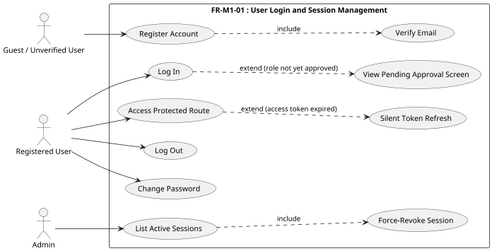

### Use Case Descriptions

**Table M1-1: Register Account**

| Use Case | Register Account |
|---|---|
| Actors | Guest (Unregistered User) |
| Description | A new user creates an IRIS account by providing their institutional email, personal details, affiliated department or course, and data privacy consent. The system creates an unverified account with a pending role request and dispatches an activation email. |
| Preconditions | The user has a valid institutional email address and has not previously registered with IRIS. |
| Main Flow | 1. The user navigates to the registration page and fills in their email, full name, password, and selects a role (Student or Adviser). 2. The user selects their affiliated department or course and acknowledges the data privacy consent. 3. The system validates all fields, creates an unverified user account, and generates a pending role request. 4. The system sends a time-limited email verification link to the provided address. 5. The system displays a confirmation prompting the user to check their email. |
| Alternative Flow | **Validation Failure:** At Step 3, if the email is already registered, the password is too weak, consent is not acknowledged, or a required field is missing, the system returns inline field errors and the account is not created. |
| Postconditions | An unverified user account and a pending role request exist in the system. A verification email has been dispatched. |

**Table M1-2: Verify Email Address**

| Use Case | Verify Email Address |
|---|---|
| Actors | Registered (Unverified) User |
| Description | After registering, the user confirms ownership of their institutional email by clicking a time-limited activation link. Email verification is required before the user can log in. |
| Preconditions | The user has completed registration and received a verification email. |
| Main Flow | 1. The user opens the verification email and clicks the activation link. 2. The system validates the link's authenticity and checks that it has not expired (3-day window). 3. The system marks the account as email-verified. 4. The system displays an "Email verified — awaiting administrator role approval" confirmation. |
| Alternative Flow | **Expired or Invalid Link:** At Step 2, if the link has expired or has been tampered with, the system displays an error and the account remains unverified. |
| Postconditions | The user account is marked as verified. The user may log in once an administrator approves their role request. |

**Table M1-3: User Login and Session Management**

| Use Case | User Login and Session Management |
|---|---|
| Actors | Any System User |
| Description | The user accesses the IRIS platform to establish an authenticated session. The system validates credentials, issues a secure JSON Web Token (JWT), and routes the user to their role-specific dashboard using a responsive layout. |
| Preconditions | The IRIS system is online, and the user has a registered and email-verified institutional account. |
| Main Flow | 1. The user navigates to the IRIS login page via a web browser (mobile or desktop). 2. The user enters their institutional email and password. 3. The system validates the credentials and issues a JWT access token (30-minute validity) and a refresh token (7-day validity). 4. The system records a login event in the audit log. 5. The system redirects the user to their role-specific dashboard. |
| Alternative Flow | **Invalid Credentials and Account Lockout:** At Step 3, if the credentials do not match, the system increments the failed login counter and displays a generic "Invalid email or password" error. After 3 consecutive failures from the same account and IP address, the system locks the account for 10 minutes, displays an "Account Locked" notification, and logs a security event in the audit trail. The lockout lifts automatically after 10 minutes. **Unverified Account:** At Step 3, if the account has not completed email verification, the system returns an "Email not verified" error and does not issue tokens. **Admin-Locked Account:** At Step 3, if an administrator has manually locked the account, the system returns an "Account is locked" error. |
| Postconditions | A secure, authenticated session is started for the user. JWT tokens are stored in the browser. |

**Table M1-4: Role Approval Gate**

| Use Case | Role Approval Gate |
|---|---|
| Actors | Registered User (pending role approval) |
| Description | After a successful login, a user whose role request has not yet been approved is shown a holding screen. The system blocks access to all application features until an administrator approves the role. |
| Preconditions | The user has logged in successfully but has no assigned role (role request is still pending). |
| Main Flow | 1. Login completes and JWT tokens are issued normally. 2. The application detects that the user has no assigned role and is not a staff member. 3. The system renders the Pending Approval page in place of all other content without changing the URL. 4. The user sees an "awaiting approval" notice on every route until their role is approved. |
| Alternative Flow | None — all routes display the Pending Approval page for an unapproved user regardless of the URL navigated to. |
| Postconditions | Once an administrator approves the role request, the user can log in and access the full application. |

**Table M1-5: Silent Token Refresh**

| Use Case | Silent Token Refresh |
|---|---|
| Actors | Authenticated User |
| Description | When the user's short-lived access token expires, the system transparently issues a new token pair using the stored refresh token, without interrupting the session or requiring a new login. |
| Preconditions | The user is logged in with a valid, non-expired refresh token stored in the browser. |
| Main Flow | 1. An API request receives an HTTP 401 response indicating the access token has expired. 2. The system reads the stored refresh token from the browser. 3. The system requests a new token pair from the server. 4. The server validates the refresh token, issues a new access and refresh token, and permanently invalidates the old refresh token. 5. The system saves both new tokens and transparently retries the original failed request. |
| Alternative Flow | **Missing or Invalid Refresh Token:** At Steps 2–3, if no refresh token is found or the token is expired, invalid, or already invalidated, the system clears all session data from the browser and redirects the user to the login page. |
| Postconditions | A new token pair is active. The old refresh token is permanently invalidated. The original request completes without user intervention. |

**Table M1-6: Log Out**

| Use Case | Log Out |
|---|---|
| Actors | Authenticated User |
| Description | The user ends their IRIS session. The system invalidates the refresh token server-side to prevent reuse and clears all local session data from the browser. |
| Preconditions | The user is authenticated with an active session. |
| Main Flow | 1. The user clicks the "Sign Out" button. 2. The system sends the current refresh token to the server for invalidation. 3. The server blacklists the refresh token and records a logout event in the audit log. 4. The system removes all tokens from the browser and redirects the user to the login page. |
| Alternative Flow | **Already-Invalidated Token:** If the refresh token has already expired or been blacklisted, the server discards the error and still returns success. The local session is cleared regardless. |
| Postconditions | The refresh token is permanently blacklisted. All local session data is cleared. A logout event is recorded in the audit log. |

**Table M1-7: Admin Session Revocation**

| Use Case | Admin Session Revocation |
|---|---|
| Actors | Admin |
| Description | An administrator force-terminates any active user session by revoking the associated JWT. The affected user is logged out on their next request. |
| Preconditions | The administrator is authenticated with staff privileges. At least one active session exists in the system. |
| Main Flow | 1. The administrator navigates to the Active Sessions management screen. 2. The administrator selects a session and confirms the revocation. 3. The system force-blacklists the JWT by its unique token identifier. 4. The system records the administrative action in the audit log. 5. The targeted user is redirected to the login page upon their next request. |
| Alternative Flow | **Session Not Found:** If the selected session token no longer exists or has already expired, the system returns a not-found error and no further action is taken. |
| Postconditions | The targeted user's JWT is permanently blacklisted. The user is effectively logged out upon their next API interaction. |

**Table M1-8: Change Password**

| Use Case | Change Password |
|---|---|
| Actors | Authenticated User |
| Description | An authenticated user updates their account password from within the application. The system verifies the current password before accepting the new one. |
| Preconditions | The user is logged in with an active session. |
| Main Flow | 1. The user navigates to their account settings and selects "Change Password." 2. The user enters their current password and a new password with confirmation. 3. The system verifies that the current password is correct and that the new password meets the minimum strength requirement. 4. The system updates the password and displays a confirmation. |
| Alternative Flow | **Incorrect Current Password:** At Step 3, if the current password does not match the stored credential, the system returns a validation error and the password is not changed. **Password Too Weak:** At Step 3, if the new password does not meet the minimum length requirement, the system returns a field-level error. |
| Postconditions | The user's password has been updated. Existing sessions remain active. |

### Activity Diagrams

#### Sub-Flow A — Registration

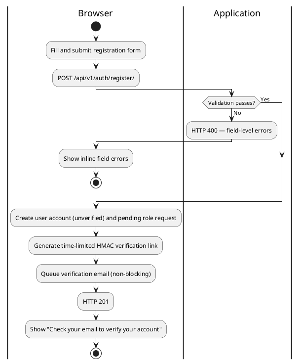

#### Sub-Flow B — Email Verification

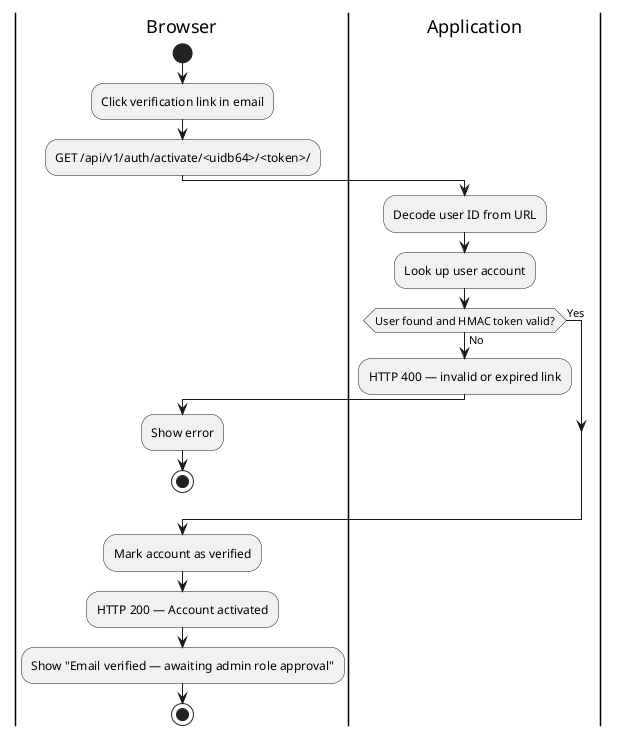

#### Sub-Flow C — Login

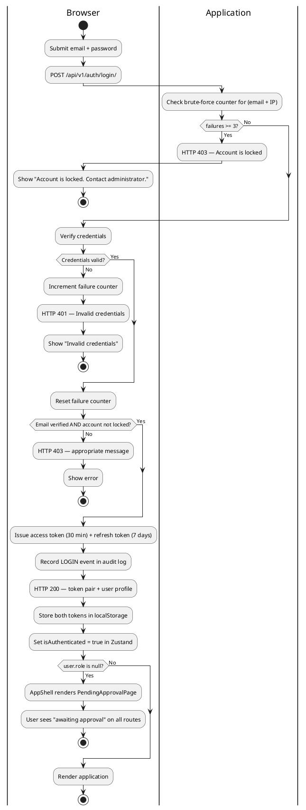

#### Sub-Flow D — Pending Role Approval

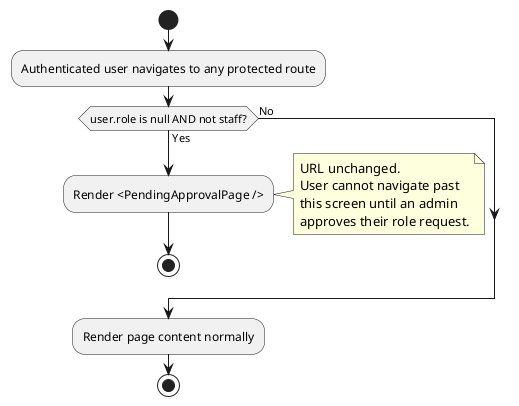

#### Sub-Flow E — Silent Token Refresh

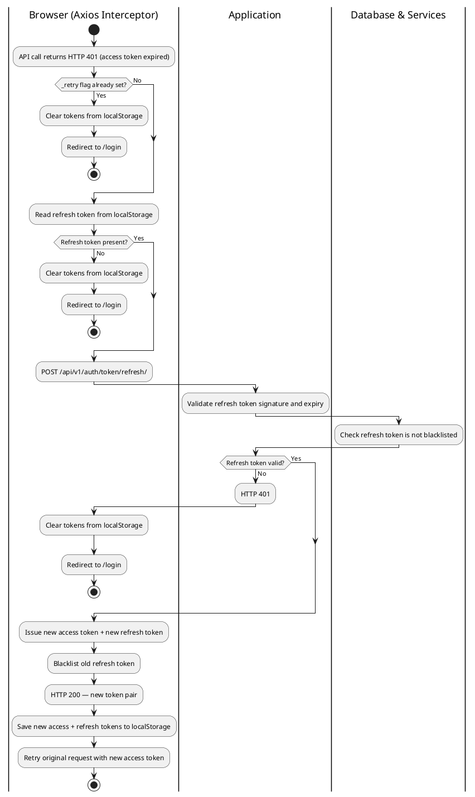

#### Sub-Flow F — Logout

```plantuml
@startuml
|Browser|
start
:User clicks Sign Out;
:POST /api/v1/auth/logout/
  Authorization: Bearer <access_token>
  Body: { "refresh": "..." };

|Application|
:Validate access token;
:Blacklist refresh token;
:Record LOGOUT event in audit log;
:HTTP 200 — Logged out;

|Browser|
:Remove tokens from localStorage;
:Redirect to /login;
stop
@enduml
```

#### Sub-Flow G — Protected Route Guard

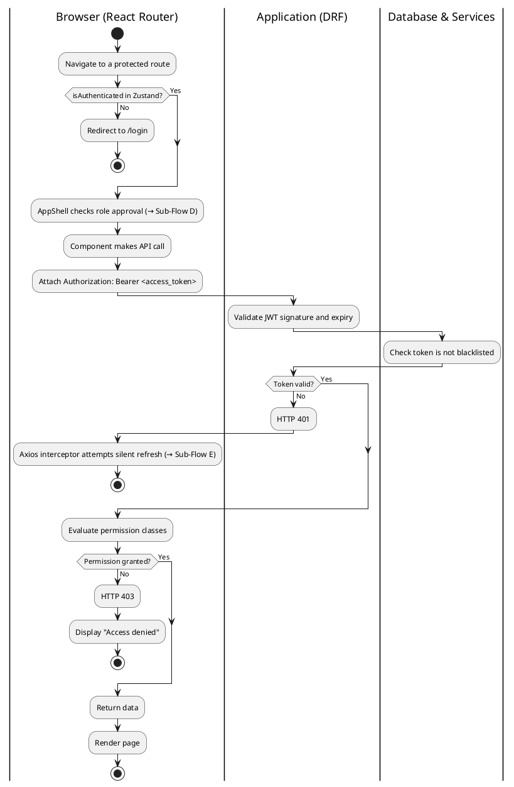

### Wireframes

#### Login Page
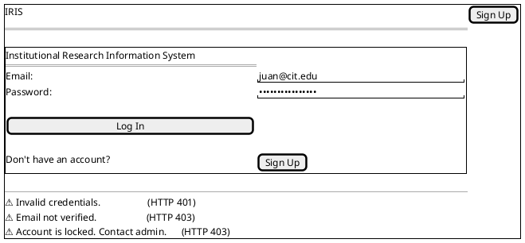

#### Pending Approval Page (AppShell gate — no sidebar, URL unchanged)
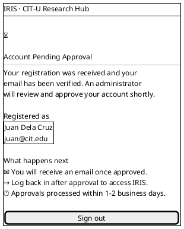

#### Admin — Active Sessions
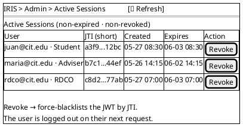

---

## FR-M1-02 — API Request Throttling and Rate Limiting

### Use Case Diagram

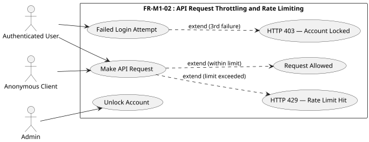

### Use Case Description

**Table M1-9: API Request Throttling and Rate Limiting**

| Use Case | API Request Throttling and Rate Limiting |
|---|---|
| Actors | Authenticated User, Anonymous Client, Admin |
| Description | The system enforces rate limits on all API requests to prevent abuse and ensure service availability. Anonymous requests are limited by IP address, authenticated requests by user identity, and repeated login failures trigger a temporary account lockout. |
| Preconditions | The IRIS API is running and available to clients. |
| Main Flow | 1. A client sends a request to any IRIS API endpoint. 2. The system evaluates the client's request count against the applicable daily limit — 100 requests per day for anonymous clients, or 1,000 requests per day for authenticated users. 3. If the limit has not been reached, the request counter is incremented and the request proceeds normally. 4. The system returns the requested resource. |
| Alternative Flow | **Rate Limit Exceeded:** At Step 2, if the client has reached their daily limit, the system rejects the request with an HTTP 429 Too Many Requests response and includes a Retry-After header indicating when the client may resume. **Brute-Force Lockout:** If a user fails to authenticate 3 consecutive times from the same email and IP combination, the system locks the account for 10 minutes and returns an HTTP 403 Forbidden response. An administrator may manually unlock the account before the window expires. |
| Postconditions | Valid requests within the limit are served. Clients that exceed the limit are informed of the retry window. Accounts subjected to brute-force attempts are temporarily locked. |

### Activity Diagrams

#### Sub-Flow A — DRF Rate Throttle Check

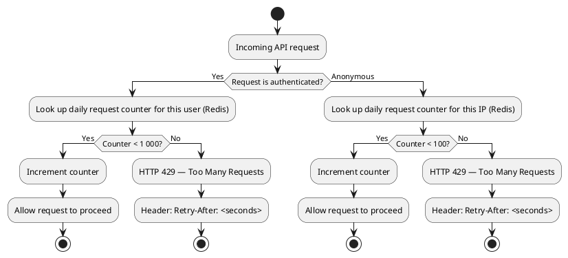

#### Sub-Flow B — django-axes Login Brute-Force Protection

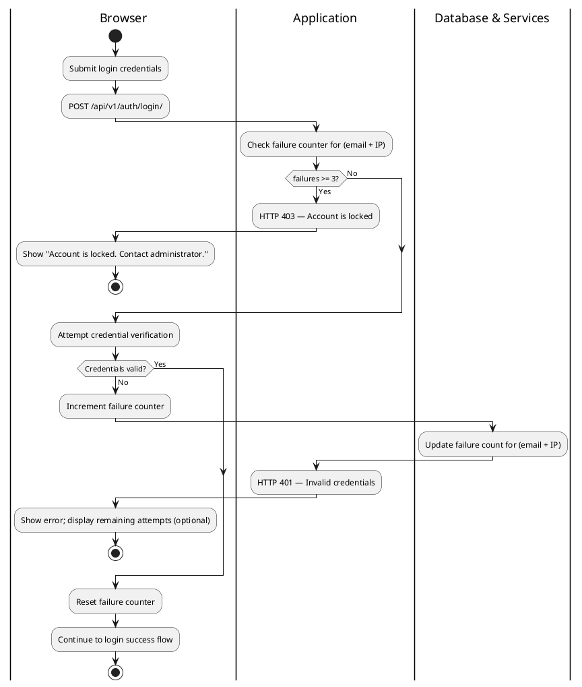

### Wireframe

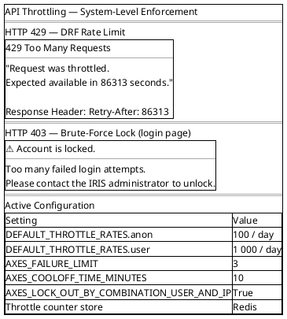

---

## FR-M1-03 — Mobile-Responsive Interface

### Use Case Diagram

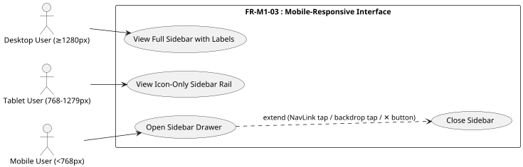

### Use Case Description

**Table M1-10: Mobile-Responsive Interface**

| Use Case | Mobile-Responsive Interface |
|---|---|
| Actors | Desktop User (≥1280px), Tablet User (768–1279px), Mobile User (<768px) |
| Description | The IRIS interface adapts its navigation layout to the user's viewport size without horizontal scrolling or content overflow. Desktop users see a full labeled sidebar, tablet users see a compact icon-only rail, and mobile users access navigation through a collapsible drawer. |
| Preconditions | The user is accessing IRIS through a supported web browser at any viewport width. |
| Main Flow | 1. The user opens IRIS in their web browser. 2. The application detects the viewport width and applies the appropriate layout automatically. 3a. On desktop (≥1280px): the full sidebar with labels and section headings is always visible alongside the content area. 3b. On tablet (768–1279px): a compact icon-only navigation rail is permanently visible; labels, section headings, and notification badges are hidden. 3c. On mobile (<768px): the sidebar is hidden off-screen, the content occupies the full width, and a hamburger button is visible in the header. |
| Alternative Flow | **Mobile Drawer Interaction:** On mobile, tapping the hamburger button slides the sidebar drawer into view with a backdrop overlay. The drawer closes when the user taps a navigation link, taps the backdrop, or taps the close button. |
| Postconditions | The user can navigate to all application destinations at any supported viewport width. No horizontal scrollbar appears at any supported screen size. |

### Activity Diagram

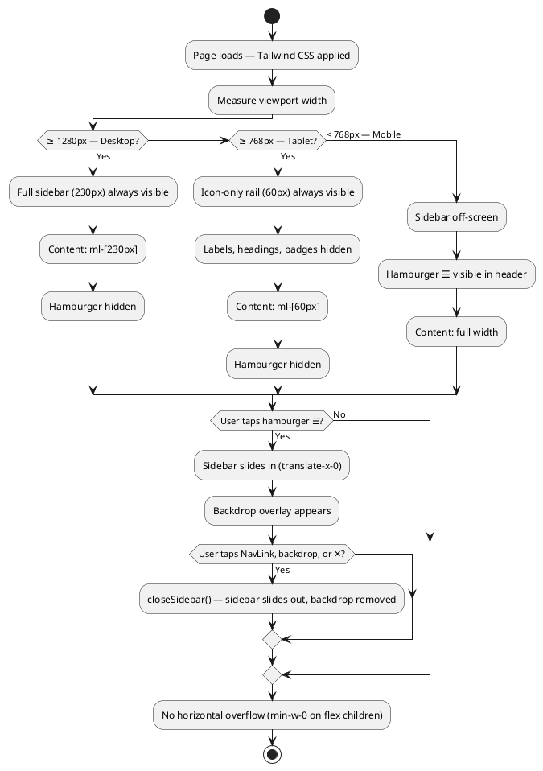

### Wireframes

#### Desktop — Full Sidebar (≥1280px)
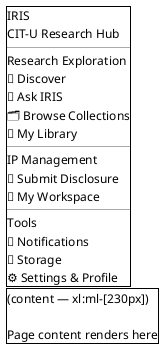

#### Tablet — Icon-Only Rail (768–1279px)
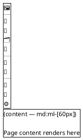

#### Mobile — Sidebar Closed (<768px)
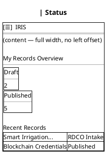

#### Mobile — Sidebar Open (drawer + backdrop)
```plantuml
@startsalt
{
  {+
    IRIS
    CIT-U Research Hub  [✕]
    --
    🧭 Discover
    🧠 Ask IRIS
    🗂 Browse Collections
    🔖 My Library
    --
    📝 Submit Disclosure
    💼 My Workspace
    --
    🔔 Notifications
    📁 Storage
    ⚙ Settings & Profile
  }
  |
  {
    .
    fixed inset-0 bg-black/40
    (backdrop — tap to close)
    .
  }
}
@endsalt
```
