# Module 2: Document Lifecycle & CRUD Operations

---

## FR-M2-01 — Record Submission

### Use Case Diagram

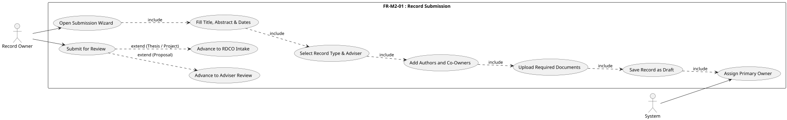

### Use Case Descriptions

**Table M2-1: Create IP Disclosure Draft**

| Use Case | Create IP Disclosure Draft |
|---|---|
| Actors | Record Owner (Student or Adviser) |
| Description | The record owner initiates a new IP disclosure by completing a multi-step submission wizard. The wizard collects record metadata, authors, co-owners, and document uploads. On completion, the system saves the record as a draft and assigns the submitting user as the primary owner. |
| Preconditions | The user is authenticated with a Student or Adviser role. |
| Main Flow | 1. The owner navigates to "Add Record" and opens the submission wizard. 2. **Step 1 — Details:** The owner enters Title, Abstract, Year Accomplished, and Year Completed. 3. **Step 2 — Type & Adviser:** The owner selects a Record Type; if the type is Proposal, an Adviser must also be selected. 4. **Step 3 — Authors:** The owner adds author names as free-text chips and searches for co-owners by name or email. 5. **Step 4 — Uploads:** The owner uploads required documents for the selected record type. 6. The owner completes the wizard; the system creates the record with `pipeline_status = "draft"` and records the owner as the primary RecordOwner. |
| Alternative Flow | **Validation Error:** At any step, missing required fields or invalid values produce inline errors; the owner cannot advance until they are resolved. **Proposal without Adviser:** At Step 3, if Record Type is Proposal and no Adviser is selected, the system prevents advancing and shows "Adviser is required for Proposals." |
| Postconditions | A draft record exists in the system. The submitting user is the primary owner. The record appears on the owner's My Records page with status **Draft**. |

**Table M2-2: Submit Record for Review**

| Use Case | Submit Record for Review |
|---|---|
| Actors | Record Owner (Student or Adviser) |
| Description | The record owner explicitly submits a saved draft (or a revised declined record) into the institutional review pipeline. The system routes the record to the appropriate first-stage reviewer based on the record type and notifies them. |
| Preconditions | The owner is authenticated; the record has `pipeline_status = "draft"` or `"declined"` (revision requested); the record has a Record Type assigned; Proposal records have an Adviser assigned. |
| Main Flow | 1. The owner opens a draft (or declined) record from the My Records page and clicks "Submit for Review." 2. The system validates that a Record Type is set and, for Proposals, that an Adviser is assigned. 3. The system advances the pipeline status: **Proposal** → `adviser_review` — the assigned Adviser is notified by email and in-app; **Thesis/Research or Project** → `rdco_intake` — the RDCO role is notified by email and in-app. 4. The owner is shown a confirmation: "Record submitted. The [Adviser / RDCO] has been notified." |
| Alternative Flow | **Already in Pipeline:** If `pipeline_status` is not `draft` or `declined`, the system returns an error: "Record is in '…' status and cannot be submitted." **No Record Type:** The system returns "A record type must be selected before the record can be submitted." **Proposal without Adviser:** The system returns "An adviser must be assigned before a Proposal can be submitted." **Resubmission after Decline:** If `pipeline_status = "declined"`, the owner may click "Resubmit" — the system clears all previous clearance records and re-enters the pipeline at the first stage for the record type. |
| Postconditions | The record pipeline status is updated to the first review stage. The assigned reviewer receives a notification. |

### Activity Diagrams

#### Sub-Flow A — Create IP Disclosure Draft

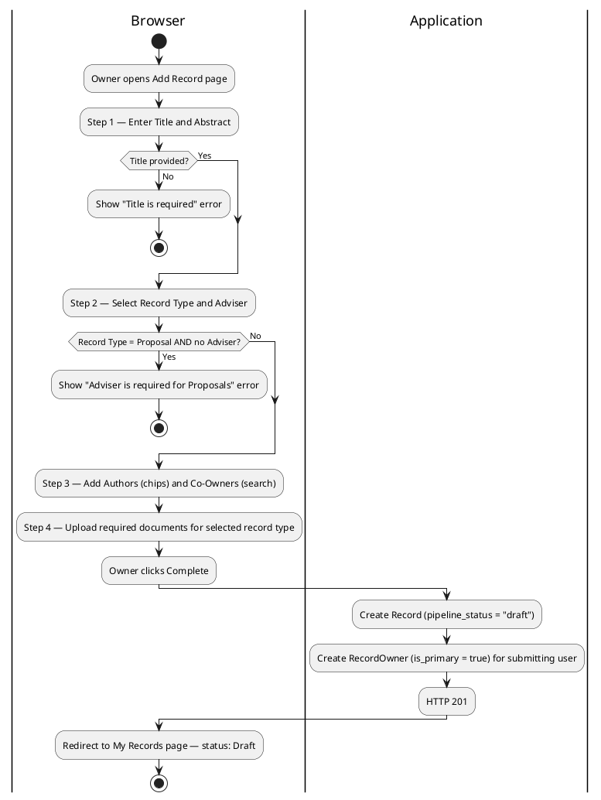

#### Sub-Flow B — Submit Record for Review

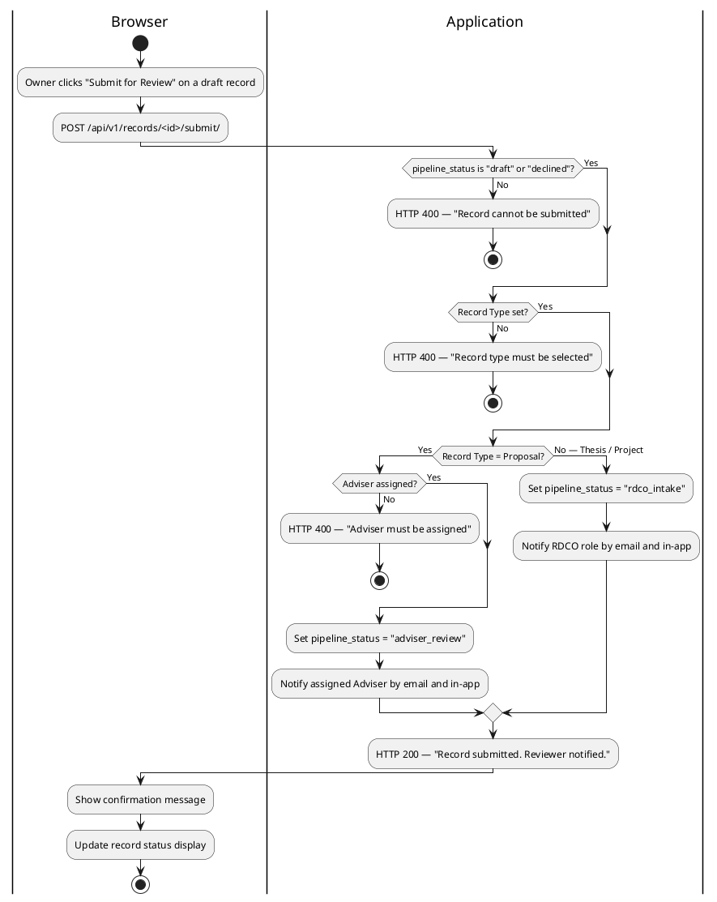

### Wireframe

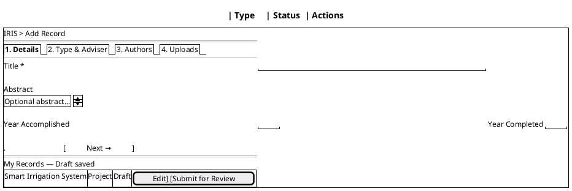

---

## FR-M2-02 — Document Download and Version Management

### Use Case Diagram

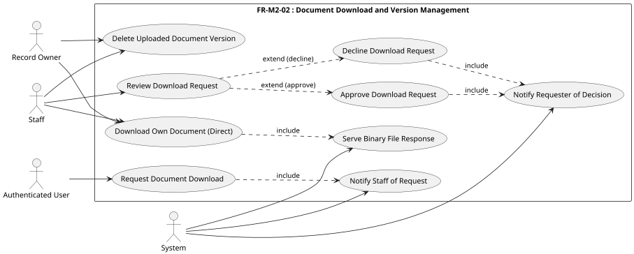

### Use Case Descriptions

**Table M2-3: Download or View Own Document**

| Use Case | Download or View Own Document |
|---|---|
| Actors | Record Owner, Staff |
| Description | A record owner (any co-owner) or staff member may view a document version in-browser or download it directly, without going through an approval process. The DocumentsPage (`/records/:id/documents`) provides both actions via authenticated blob API calls. |
| Preconditions | The user is authenticated; the target document upload exists in the system; the user is a record co-owner or staff. |
| Main Flow | 1. The user opens the DocumentsPage for a record. 2. The system checks permission: any record co-owner or staff role. 3a. **View:** The user clicks "View" — the system serves the file with `Content-Disposition: inline` and the browser renders the PDF inside a fullscreen `PdfViewer` modal (iframe + blob URL). 3b. **Download:** The user clicks "Download" — the system serves the file with `Content-Disposition: attachment; filename="<original name>"` and the browser saves the file. 4. All requests are authenticated blob calls (`responseType: "blob"`) so the session is validated on every file access. |
| Alternative Flow | **Insufficient Permission:** At Step 2, if the user is not a record co-owner and is not a staff member, the system returns HTTP 403 Permission Denied. |
| Postconditions | The file is viewed in-browser or downloaded to the user's device. A DOWNLOAD audit event is recorded. |

**Table M2-4: Document Download Request**

| Use Case | Document Download Request |
|---|---|
| Actors | Authenticated User (requester), Staff (KTTO / RDCO) |
| Description | An authenticated user who does not own a record requests access to download its files. Staff review the request and either approve (granting the user access, notified by email) or decline (notified in-app). |
| Preconditions | The requester is authenticated; the target record exists with `pipeline_status = "published"`. |
| Main Flow | 1. The requester opens a published record and clicks "Request Download Access." 2. The system creates a DownloadRequest with `status = "pending"` and broadcasts an in-app notification to KTTO and RDCO staff. 3. A staff member reviews the request and clicks "Approve." 4. The system sets `status = "approved"`, records the reviewer, and sends an email notification to the requester. 5. The requester can now download the record's documents directly. |
| Alternative Flow | **Staff Declines:** At Step 3, the staff member clicks "Decline." The system sets `status = "declined"`, records the reviewer, and sends an in-app notification to the requester. The requester cannot download the documents. **Duplicate Request:** If the requester already has a pending or approved request for the same record, the system returns HTTP 400. |
| Postconditions | The DownloadRequest is updated to `approved` or `declined`. The requester is notified of the decision. |

### Activity Diagrams

#### Sub-Flow A — Direct Download or In-Browser View

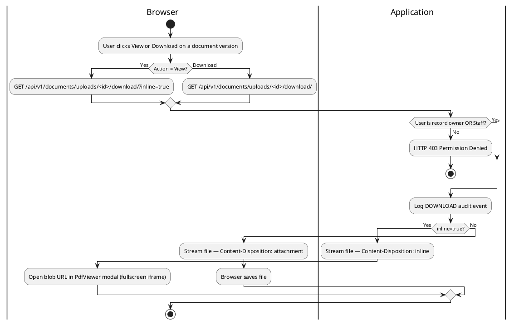

#### Sub-Flow B — Download Request / Approval

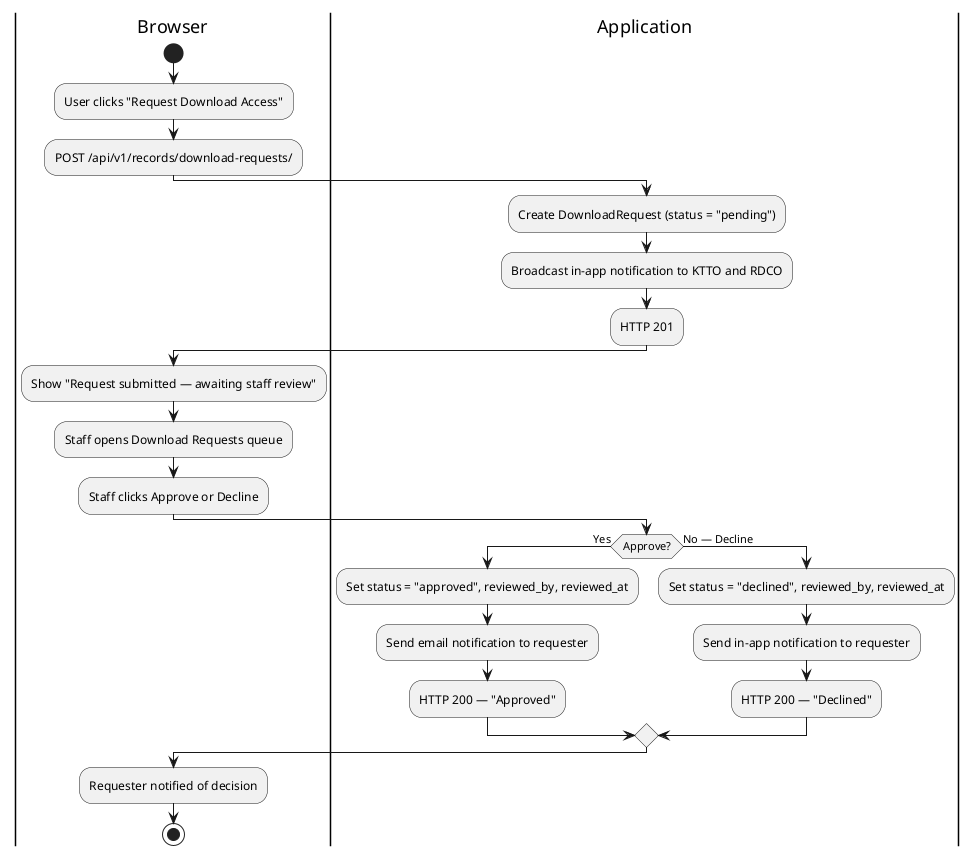

**Table M2-5: Delete Uploaded Document Version**

| Use Case | Delete Uploaded Document Version |
|---|---|
| Actors | Record Owner, Staff |
| Description | A record owner deletes an uploaded document version they submitted (version 2 and above only; version 1 is protected). Staff can force-delete any version including version 1. The physical file is removed from storage and the database row is deleted. |
| Preconditions | The user is authenticated; the `RecordUpload` entry exists. |
| Main Flow | 1. The user clicks "Delete" on a document version in the record's document section. 2. The system checks permission: the user must be the record owner or a staff member. 3. The system checks the version constraint: owners may only delete versions > 1; staff may delete any version. 4. The system deletes the physical file from storage and removes the `RecordUpload` database row. 5. A DELETE audit event is logged. |
| Alternative Flow | **Insufficient Permission:** At Step 2, if the user is neither the record owner nor a staff member, the system returns HTTP 403. **Owner Attempts to Delete Version 1:** At Step 3, if the requester is an owner (not staff) and the version is 1, the system returns HTTP 400 "Cannot delete the first version." |
| Postconditions | The document version and its physical file are permanently removed. The DELETE event is recorded in the audit log. |

#### Sub-Flow C — Delete Document Version

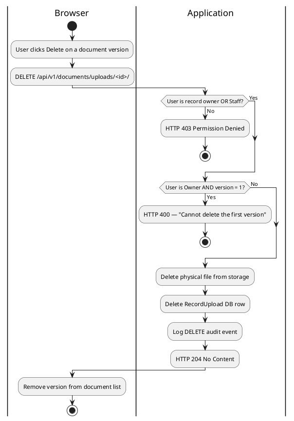

### Wireframe

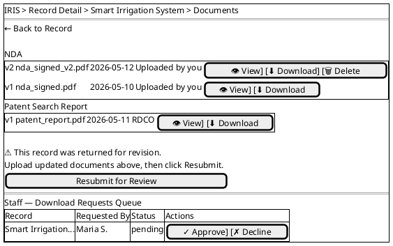

---

## FR-M2-03 — Record Soft-Deletion

### Use Case Diagram

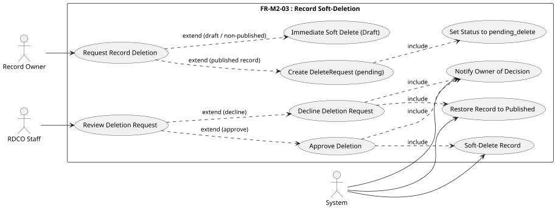

### Use Case Descriptions

**Table M2-6: Record Soft-Deletion**

| Use Case | Record Soft-Deletion |
|---|---|
| Actors | Record Owner (primary), RDCO Staff |
| Description | A record owner requests deletion of one of their records. Published records require RDCO approval before deletion; drafts and non-published records are deleted immediately. Soft deletion marks the record as deleted in the database without physically removing it, preserving the audit trail. |
| Preconditions | The record exists; the owner is authenticated and is the primary owner or a staff member. |
| Main Flow | 1. The owner opens their record and clicks "Request Deletion," providing a reason. 2. If the record is published: the system creates a DeleteRequest with `status = "pending"` and sets `pipeline_status = "pending_delete"`. 3. RDCO reviews the deletion request in the staff queue. 4. **Approve:** RDCO clicks Approve → the system sets `is_deleted = true`, `deleted_at = now()`, `deleted_by = RDCO` (soft delete), and notifies the owner. 5. **Decline:** RDCO clicks Decline → the system sets `DeleteRequest.status = "declined"`, restores `pipeline_status = "published"`, and notifies the owner. |
| Alternative Flow | **Non-Published Record:** If the record is a draft or in any non-published pipeline stage, the system performs an immediate soft delete without creating a DeleteRequest or requiring RDCO approval. |
| Postconditions | The record is either soft-deleted (`is_deleted = true`, excluded from all queries) or restored to published. The owner is notified. The audit trail is preserved. |

### Activity Diagram

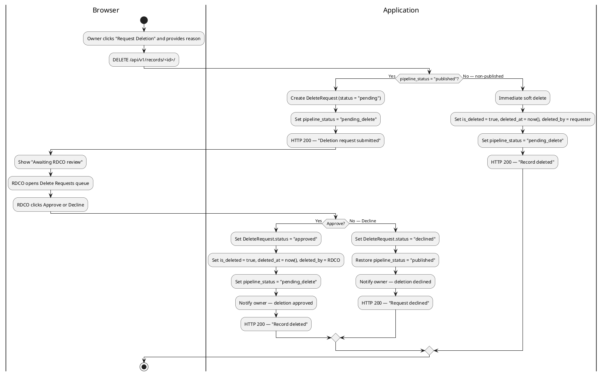

### Wireframe

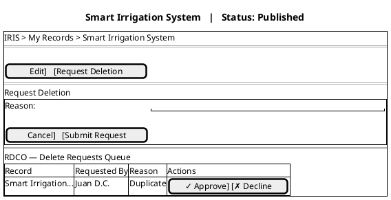

---

## FR-M2-04 — Bulk Record Import via Excel

### Use Case Diagram

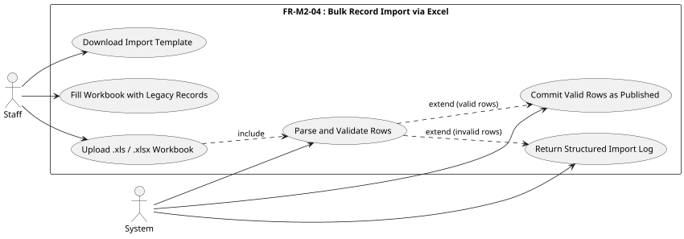

### Use Case Descriptions

**Table M2-7: Bulk Record Import via Excel**

| Use Case | Bulk Record Import via Excel |
|---|---|
| Actors | Staff (primary), System |
| Description | Staff bulk-import legacy research records from a formatted Excel workbook. The system parses each row using pyexcel, validates required fields, and commits valid rows directly as published records (bypassing the review pipeline, as staff are the implicit reviewers for legacy data). Rows with errors are skipped and reported. |
| Preconditions | The user is authenticated as Staff; the file is a valid `.xls` or `.xlsx` workbook formatted according to the IRIS import template. |
| Main Flow | 1. Staff downloads the formatted import template via GET `/records/download_template/`. 2. Staff fills in legacy record rows following the column rules. 3. Staff uploads the workbook via POST `/records/import_excel/`. 4. The system detects the file type (`.xls` or `.xlsx`) and parses it using pyexcel-xls / pyexcel-xlsx. 5. Each row is validated: Title is required; Record Type defaults to "Project" if blank; Boolean columns accept TRUE / FALSE / YES / NO / 1 / 0. 6. Processing stops when the first cell of a row contains "END OF RECORDS." 7. Valid rows are committed as published records (`pipeline_status = "published"`). 8. The system returns a structured import log: rows created, rows skipped, and per-row error messages. |
| Alternative Flow | **Invalid File:** The workbook cannot be opened → "Could not open file" error returned immediately; no rows are processed. **Missing Title:** Row has no Title value → row skipped; "Row N: Title is required" added to error log. **All Rows Invalid:** 0 records created; full error log returned. |
| Postconditions | Valid rows exist as published records visible in the Published Records list. Staff receive a creation count and error log for audit. |

### Activity Diagram

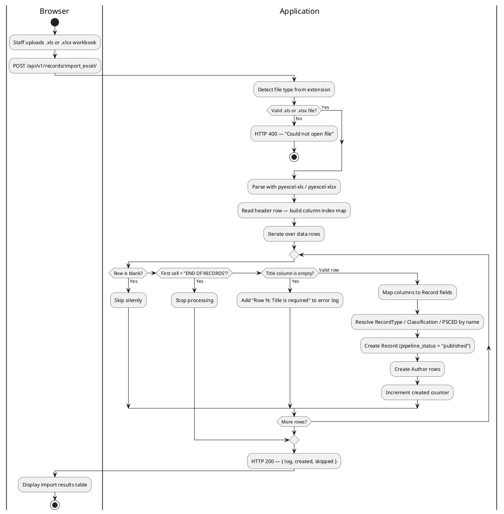

### Wireframe

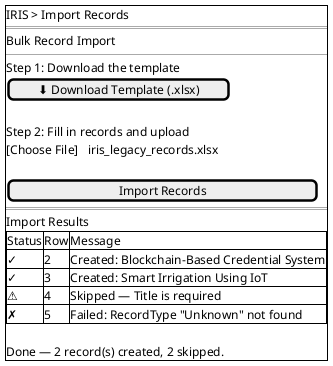

---

## FR-M2-05 — Published Records Browse and Keyword Search

### Use Case Diagram

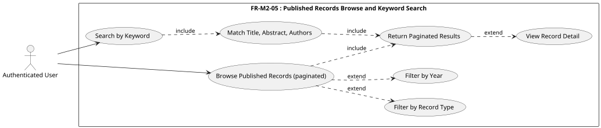

### Use Case Descriptions

**Table M2-8: Published Records Browse and Keyword Search**

| Use Case | Published Records Browse and Keyword Search |
|---|---|
| Actors | Authenticated User (primary) |
| Description | Any authenticated user can browse all published research records in a paginated list and narrow results by keyword, record type, or year. Keyword search matches against record title, abstract, and author names. The FTS infrastructure provided by Module 3 (FR-M3-02) backs the search index for improved performance and relevance at scale. |
| Preconditions | The user is authenticated; at least one published record exists. |
| Main Flow | 1. The user navigates to the Published Records page. 2. The system returns a paginated list of all records with `pipeline_status = "published"`, ordered by most recent. 3. The user optionally enters a keyword in the search box. 4. The system matches the keyword against record title, abstract, and author names and returns the filtered results. 5. The user optionally applies filters: Record Type, Year Accomplished. 6. Active filters and the search query are preserved as URL query parameters. 7. The user clicks a record card to open its detail page. |
| Alternative Flow | **No Results:** If the search or filter combination returns no records, the system displays an empty state: "No records match your search." **Invalid Filter Value:** Unrecognised filter values are ignored; the system returns unfiltered results. |
| Postconditions | Paginated results are displayed; applied filters and keyword remain in the URL for shareability and browser back navigation. |

### Activity Diagram

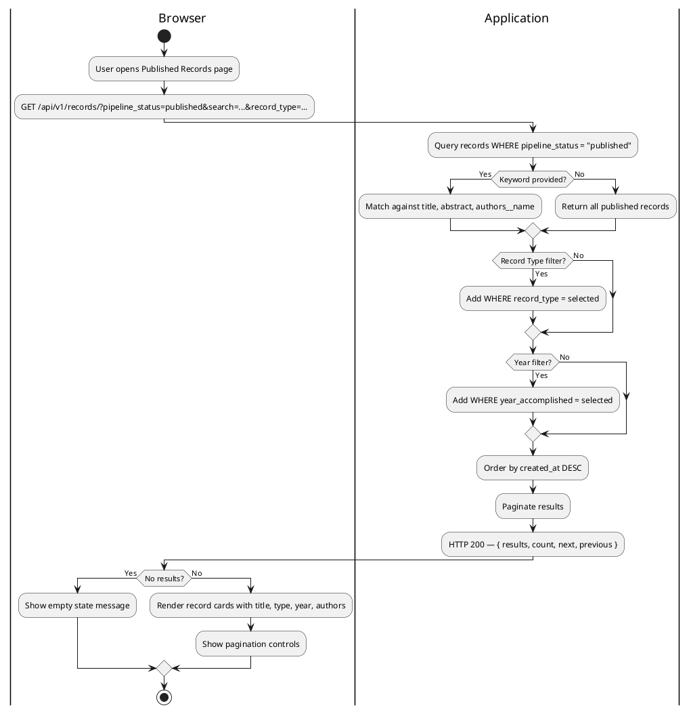

### Wireframe

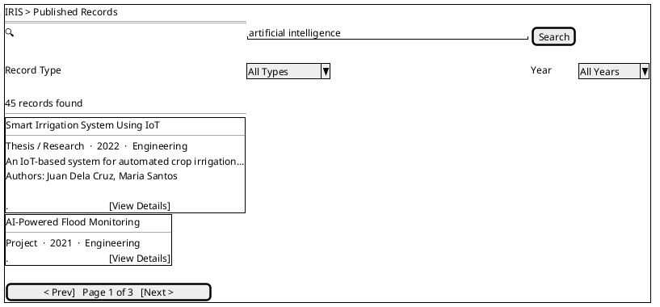

---

## FR-M2-06 — Institutional File Storage Management

### Use Case Diagram

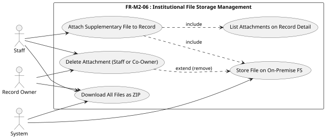

### Use Case Descriptions

**Table M2-9: Institutional File Storage Management**

| Use Case | Institutional File Storage Management |
|---|---|
| Actors | Staff (primary), Record Owner, System |
| Description | Staff attach supplementary files of any type to a record for institutional storage. Record owners and staff can download all attachments as a single ZIP archive. Any co-owner of the record or any staff member may delete any supplementary file. All files are stored on the institutional on-premise file system under a path keyed by record ID. |
| Preconditions | The user is authenticated; the target record exists. |
| Main Flow — Attach | 1. Staff opens a record's DocumentsPage (`/records/:id/documents`) directly or via the **"View & Attach Documents"** button on the EvaluationPage review form. 2. Staff selects a file (any type) and submits via POST `/documents/files/upload/`. 3. The system stores the file on the on-premise file system under a structured path keyed by the record ID. 4. The system creates a `RecordFile` entry. 5. The file appears in the record's attachment list. |
| Main Flow — Download ZIP | 1. Staff or record owner clicks "Download All Files." 2. The system collects all `RecordFile` entries for the record, builds a ZIP archive in memory, and streams it to the browser as a `.zip` download. |
| Main Flow — Delete | 1. Staff or record co-owner clicks "Delete" on an attachment. 2. The system checks permission: any co-owner of the record or any staff member is permitted. 3. The system removes the physical file from storage and deletes the `RecordFile` database row. 4. A DELETE audit event is logged. |
| Alternative Flow | **Non-Staff Attempts Upload:** At Attach Step 2, if the user is not Staff, the system returns HTTP 403. **No Permission to Delete:** At Delete Step 2, if the user is neither a co-owner of the record nor a staff member, the system returns HTTP 403. |
| Postconditions | Files are stored on-premise and listed on the record's detail page. Deletions are permanent and logged. |

### Activity Diagram

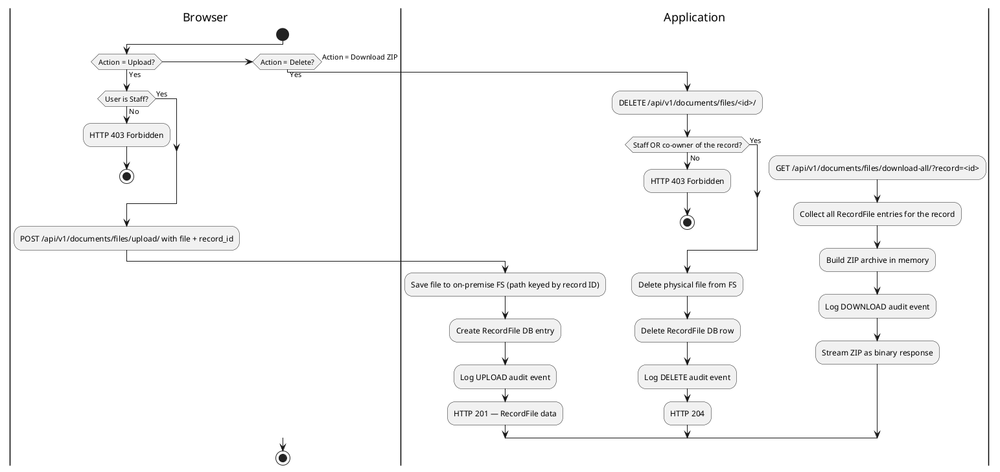

### Wireframe

```plantuml
@startsalt
{+
  IRIS > Record Detail > Smart Irrigation System
  ==
  Supplementary Files                      [+ Attach File]
  --
  {#
  Filename                   | Uploaded By | Date       | Action
  presentation_slides.pptx   | RDCO Staff  | 2026-05-10 | [🗑]
  ethics_clearance_scan.pdf  | Juan D.C.   | 2026-05-11 | [🗑]
  }
  .
  [⬇ Download All as ZIP]
}
@endsalt
```

---

## FR-M2-07 — Personal File Storage

### Use Case Diagram

```plantuml
@startuml
scale 0.75
left to right direction

actor "Authenticated User" as User
actor System

rectangle "FR-M2-07 : Personal File Storage" {
  usecase "Browse Folder Tree"          as UC1
  usecase "Navigate Breadcrumb"         as UC2
  usecase "Create Folder"               as UC3
  usecase "Upload File to Folder"       as UC4
  usecase "Download File"               as UC5
  usecase "Delete File"                 as UC6
  usecase "Delete Folder (cascade)"     as UC7
}

User --> UC1
User --> UC3
User --> UC4
User --> UC5
User --> UC6
User --> UC7
UC1  ..> UC2 : extend
UC7  ..> UC6 : include (cascade)
System --> UC4
@enduml
```

### Use Case Descriptions

**Table M2-10: Personal File Storage**

| Use Case | Personal File Storage |
|---|---|
| Actors | Authenticated User (any role) |
| Description | Any authenticated user can access a shared institutional file storage area to organize files into nested folders, upload arbitrary files, download files, and delete files or folders. The storage area is accessible from the "Storage" link in the sidebar under "Tools" and is shared across all authenticated users. Items are attributed to the user who created or uploaded them. |
| Preconditions | The user is authenticated. |
| Main Flow — Browse | 1. User navigates to `/storage`. 2. The system returns all root-level folders and files. 3. User clicks a folder row to enter it; the breadcrumb trail updates. 4. User clicks a breadcrumb item to navigate back up the tree. |
| Main Flow — Create Folder | 1. User clicks "New Folder." 2. User enters a folder name and confirms. 3. The system creates the folder attributed to the creating user. |
| Main Flow — Upload File | 1. User navigates to the target folder (or root). 2. User selects a file to upload. 3. The system saves the file on the on-premise file system under `storage/YYYY/MM/` and creates a `StorageFile` row attributed to the uploading user. |
| Main Flow — Download File | 1. User clicks the download icon on any file row. 2. The system serves the file as a binary attachment with the original filename. |
| Main Flow — Delete File | 1. User clicks the delete icon on a file row and confirms. 2. The system removes the `StorageFile` row and the physical file from storage. |
| Main Flow — Delete Folder | 1. User clicks the delete icon on a folder row and confirms. 2. The system deletes the folder and cascades the deletion to all nested subfolders and files. |
| Alternative Flow | **Empty folder:** If a folder contains no subfolders or files, an empty-state message is shown. **Folder not found:** If the requested folder ID does not exist, the system returns HTTP 404. |
| Postconditions | Folders and files are created, organized, downloaded, or deleted as requested. All items retain attribution to the acting user. |

### Activity Diagram

```plantuml
@startuml
|Browser|
start
:User opens /storage or /storage/<id>;
:GET /api/v1/storage/?parent=<id>;

|Application|
:Fetch folders WHERE parent = <id>;
:Fetch files WHERE folder = <id>;
:Build breadcrumb trail by traversing parent chain;
:HTTP 200 — { folders, files, breadcrumb };

|Browser|
:Render folder/file table with breadcrumb;
:User selects an action;

if (Create Folder?) then (Yes)
  :POST /api/v1/storage/folders/ { name, parent };
  |Application|
  :INSERT storage_storagefolder (created_by = user);
  :HTTP 201;
else if (Upload File?) then (Yes)
  :POST /api/v1/storage/files/ (multipart: file, folder, name);
  |Application|
  :Save file to on-premise FS (storage/YYYY/MM/);
  :INSERT storage_storagefile (uploaded_by = user, size_bytes);
  :HTTP 201;
else if (Download File?) then (Yes)
  :GET /api/v1/storage/files/<id>/download/;
  |Application|
  :Stream file as binary attachment (original filename);
else if (Delete File?) then (Yes)
  :DELETE /api/v1/storage/files/<id>/;
  |Application|
  :Delete StorageFile row and physical file;
  :HTTP 204;
else (Delete Folder)
  :DELETE /api/v1/storage/folders/<id>/;
  |Application|
  :CASCADE delete all nested folders and files;
  :HTTP 204;
endif

|Browser|
:Refresh listing;
stop
@enduml
```

### Wireframe

```plantuml
@startsalt
{+
  IRIS > Storage
  ==
  File Storage                                 [+ New Folder]
  --
  Breadcrumb: Storage > Research 2026
  --
  {#
  Name                      | Modified     | Size    |
  📁 Thesis Drafts           | 2026-05-20   | --      | [🗑]
  📁 Conference Papers       | 2026-05-18   | --      | [🗑]
  📄 guidelines.pdf          | 2026-05-22   | 1.2 MB  | [⬇] [🗑]
  📄 submission_form.docx    | 2026-05-21   | 45 KB   | [⬇] [🗑]
  }
  .
  [+ Upload File]
}
@endsalt
```
