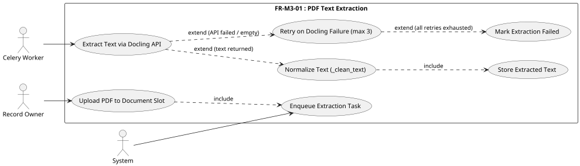
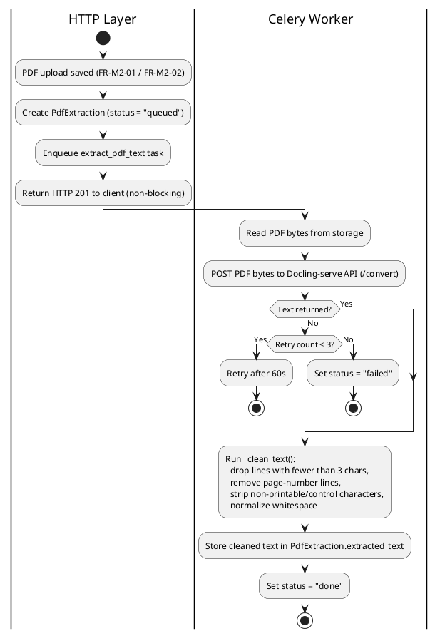
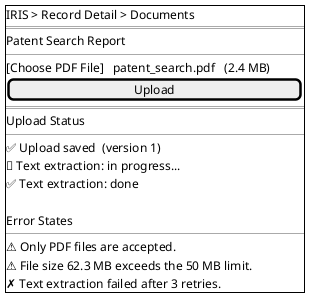
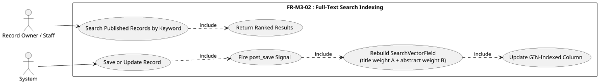
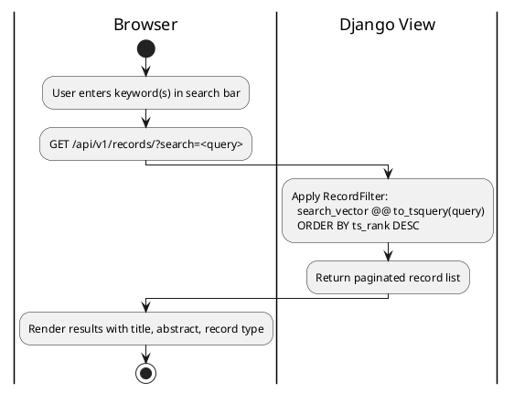
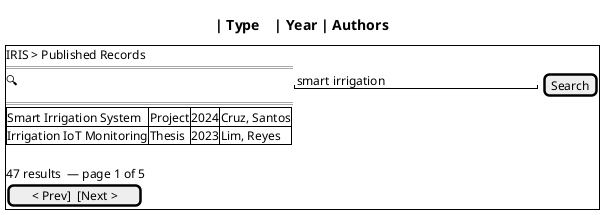
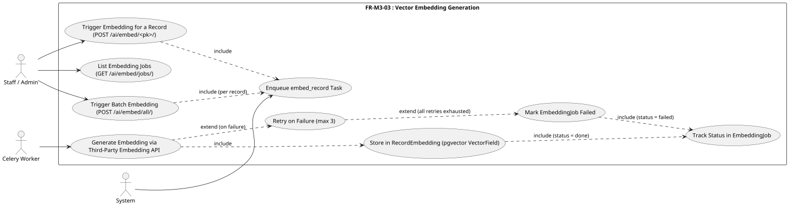
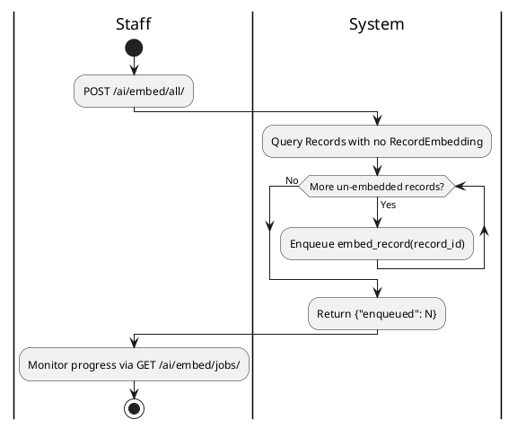
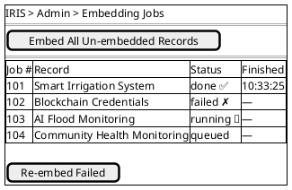

# Module 3: Semantic Indexing

---

## FR-M3-01 — PDF Text Extraction

### Use Case Diagram



### Use Case Descriptions

**Table M3-1: Extract Text from Uploaded PDF**

| Use Case | Extract Text from Uploaded PDF |
|---|---|
| Actors | Record Owner (trigger), Celery Worker (primary), System |
| Description | After a PDF is uploaded to a document slot, the system queues a background Celery task that sends the PDF to the on-prem **Docling-serve** API for text extraction. Extracted text is cleaned before storage. The HTTP response is not blocked. |
| Preconditions | A PDF upload has been saved via FR-M2-01 or FR-M2-02; a `PdfExtraction` row exists with `status = "queued"`; Celery worker is running; Docling-serve is reachable. |
| Main Flow | 1. PDF upload completes; system creates a `PdfExtraction` record (`status = "queued"`) and enqueues `extract_pdf_text(upload_id)` without blocking the HTTP response. 2. Celery worker picks up the task and reads the PDF bytes from storage. 3. Worker sends the PDF bytes to the **Docling-serve API** (`POST /convert`) and receives structured extracted text (Markdown format). 4. Worker runs `_clean_text()` on the response: drops lines shorter than 3 characters, removes pure page-number lines, and normalizes whitespace. 5. Cleaned text is stored in `PdfExtraction.extracted_text`; `status → "done"`. |
| Alternative Flow | **A — Docling API fails or returns empty text:** The Celery task retries up to 3 times with a 60-second countdown. **B — All retries exhausted:** After 3 failed attempts, `PdfExtraction.status = "failed"`. |
| Postconditions | `PdfExtraction.status` is `"done"` or `"failed"`. On success, cleaned extracted text is available for FTS indexing (FR-M3-02) and semantic search (FR-M3-03). |

### Activity Diagram

#### Sub-Flow A — Text Extraction Pipeline



### Wireframe



---

## FR-M3-02 — Full-Text Search (FTS) Indexing

### Use Case Diagram



### Use Case Descriptions

**Table M3-2: Automatic FTS Index Update**

| Use Case | Automatic FTS Index Update |
|---|---|
| Actors | System |
| Description | Whenever a Record is created or its title or abstract is updated, a Django `post_save` signal automatically rebuilds the PostgreSQL full-text search vector for that record. The title is weighted higher (A) than the abstract (B) to improve keyword search relevance. |
| Preconditions | PostgreSQL is running with a GIN index on `records_record.search_vector`; the Records app is loaded (signal registered in `AppConfig.ready()`). |
| Main Flow | 1. A Record is created or its title/abstract is changed and saved. 2. The `post_save` signal fires on the `Record` model. 3. The signal handler calls `update_search_vector(record)`. 4. System executes: `UPDATE records_record SET search_vector = (SearchVector("title", weight="A") + SearchVector("abstract", weight="B")) WHERE id = <pk>`. 5. PostgreSQL GIN index is automatically updated to cover the new vector. |
| Alternative Flow | **Signal silent failure:** If `update_search_vector` raises an unhandled exception, the save still completes but the search vector is stale until the next save of that record. |
| Postconditions | `records_record.search_vector` reflects the current title and abstract; GIN index enables sub-second FTS queries across all records. |

**Table M3-3: Keyword Search on Published Records**

| Use Case | Keyword Search on Published Records |
|---|---|
| Actors | Record Owner, Staff |
| Description | Authenticated users search the published records corpus using one or more keywords. The system queries the GIN-indexed `search_vector` column and returns ranked results. |
| Preconditions | The user is authenticated; at least one published record exists with an indexed search vector. |
| Main Flow | 1. The user enters one or more keywords in the search bar on the Published Records page. 2. The system constructs a `to_tsquery` expression from the input. 3. A database query filters `records_record` where `search_vector @@ to_tsquery(keyword)`, ordered by `ts_rank` descending. 4. The matching records are returned and displayed. |
| Alternative Flow | **No results:** If no records match, an empty list is returned with a "No records found" message. **Invalid query syntax:** If the keyword cannot be parsed by `to_tsquery`, the system returns an empty result set. |
| Postconditions | Matching published records are displayed, ranked by relevance. |

### Activity Diagrams

#### Sub-Flow A — Index Rebuild on Record Save

```plantuml
@startuml
|Django ORM|
start
:Record saved (create or update);
:post_save signal fires on Record model;

|records.services|
:update_search_vector(record);
:Build SearchVector:
  title (weight A) + abstract (weight B);
:UPDATE records_record
  SET search_vector = <vector>
  WHERE id = <pk>;
:PostgreSQL GIN index updated;
stop
@enduml
```

#### Sub-Flow B — Keyword Search



### Wireframe



---

## FR-M3-03 — Vector Embedding Generation

### Use Case Diagram



### Use Case Descriptions

**Table M3-4: Trigger Embedding for a Single Record**

| Use Case | Trigger Embedding for a Single Record |
|---|---|
| Actors | Staff / Admin (trigger), Celery Worker (primary), System |
| Description | A staff member or the system manually triggers the generation of a vector embedding for a specific record. The background Celery task sends the record's title and abstract to a third-party embedding API (TBD: e.g. OpenAI `text-embedding-3-small`, Voyage AI, or Cohere), receives a fixed-dimension vector, and stores it in pgvector for later semantic search queries. |
| Preconditions | The user is authenticated with a Staff or Admin role; the target record exists; the third-party embedding API is reachable. |
| Main Flow | 1. Staff sends `POST /api/v1/ai/embed/<record_pk>/`. 2. System creates an `EmbeddingJob` row (`status = "queued"`) and enqueues `embed_record(record_id)`. 3. Celery worker picks up the task and sets `EmbeddingJob.status = "running"`. 4. Worker builds input text as `f"{record.title}. {record.abstract}"` and sends it to the third-party embedding API. 5. Worker receives the embedding vector (float array). 6. System creates or updates a `RecordEmbedding` row (`VectorField` via pgvector) for the record. 7. `EmbeddingJob.status` is set to `"done"`. |
| Alternative Flow | **Embedding failure:** If the task fails (e.g. API error), it retries up to 3 times; on final failure `EmbeddingJob.status = "failed"`. **Record already embedded:** The task uses `update_or_create` — an existing `RecordEmbedding` is replaced with the new vector. |
| Postconditions | `RecordEmbedding` holds the latest vector; `EmbeddingJob` reflects `"done"` or `"failed"`. The embedding is available for pgvector similarity queries in FR-M4. |

**Table M3-5: Batch Embed All Un-embedded Records**

| Use Case | Batch Embed All Un-embedded Records |
|---|---|
| Actors | Staff / Admin (trigger), Celery Worker, System |
| Description | Staff triggers a single API call that enqueues individual `embed_record` tasks for every record that does not yet have a `RecordEmbedding`. Useful for initial population after the AI module is deployed, or after bulk imports (FR-M2-04). |
| Preconditions | The user is authenticated with a Staff or Admin role. |
| Main Flow | 1. Staff sends `POST /api/v1/ai/embed/all/`. 2. System queries all Records with no associated `RecordEmbedding`. 3. For each such record, System creates an `EmbeddingJob` (`status = "queued"`) and enqueues `embed_record(record_id)`. 4. Response returns `{"enqueued": N}` as HTTP 202. |
| Alternative Flow | **No un-embedded records:** Response returns `{"enqueued": 0}`. |
| Postconditions | An `embed_record` task is queued for each previously un-embedded record; `EmbeddingJob` rows are created for each. |

**Table M3-6: View Embedding Job Status**

| Use Case | View Embedding Job Status |
|---|---|
| Actors | Staff / Admin |
| Description | Staff views the list of all embedding jobs to monitor progress and identify failures. |
| Preconditions | The user is authenticated with a Staff or Admin role. |
| Main Flow | 1. Staff sends `GET /api/v1/ai/embed/jobs/`. 2. System returns the 50 most recent `EmbeddingJob` records ordered by creation time descending, with record ID, status, and timestamps. |
| Alternative Flow | None. |
| Postconditions | Staff can identify which records need re-embedding (status `"failed"`). |

### Activity Diagrams

#### Sub-Flow A — Single Record Embedding

```plantuml
@startuml
|Staff|
start
:POST /ai/embed/<pk>/;

|System|
:Create EmbeddingJob (status = "queued");
:Enqueue embed_record(record_id);
:Return 202 Accepted;

|Celery Worker|
:Build text = title + ". " + abstract;
:POST text to Third-Party Embedding API;
if (Vector returned?) then (Yes)
  :RecordEmbedding.objects.update_or_create(
    record=record,
    defaults={"embedding": vector}
  )  ← pgvector VectorField;
  :EmbeddingJob.status = "done";
else (No)
  if (Retry count < 3?) then (Yes)
    :Retry task;
    stop
  else (No)
    :EmbeddingJob.status = "failed";
  endif
endif
stop
@enduml
```

#### Sub-Flow B — Batch Embedding Trigger



### Wireframe


