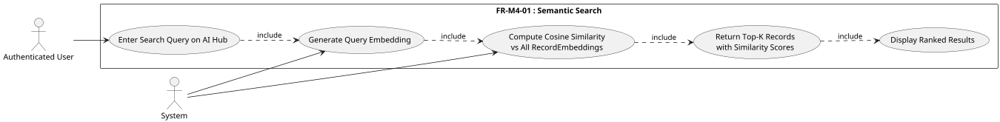
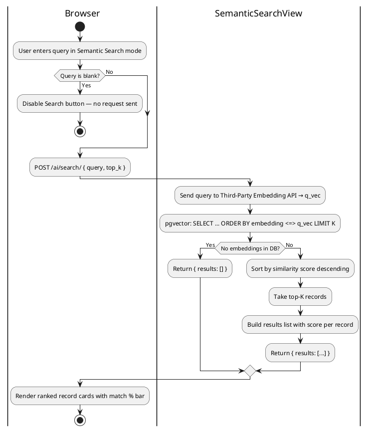
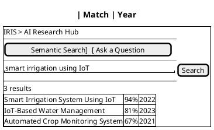
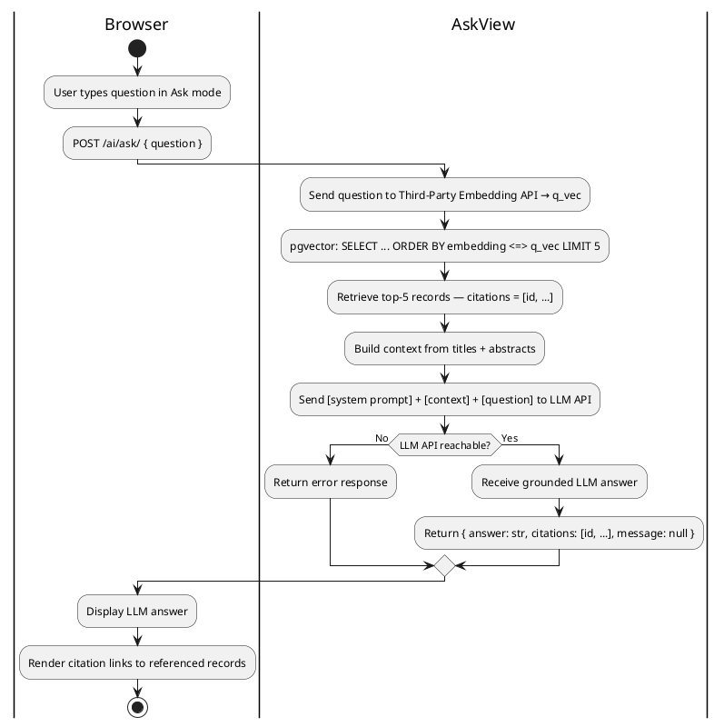
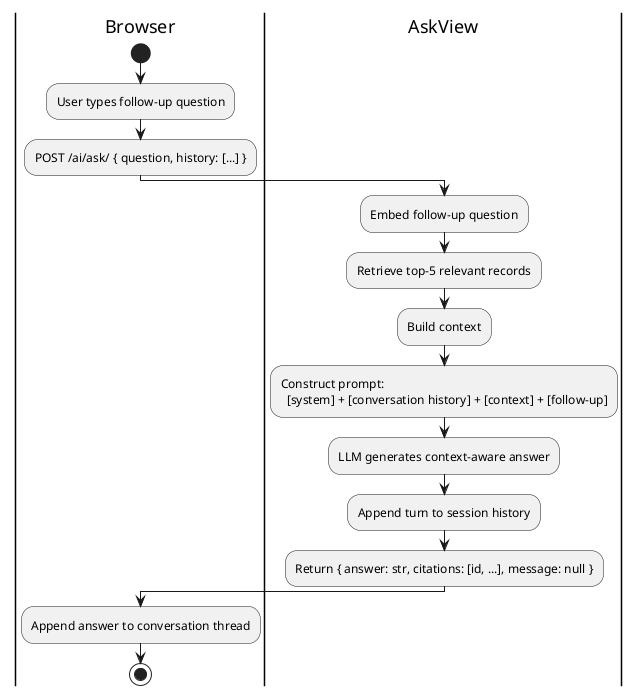
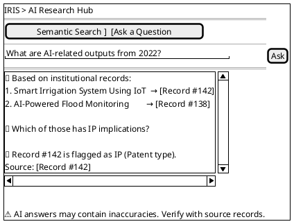
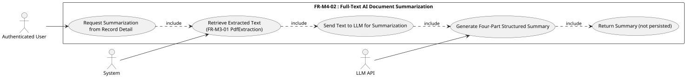
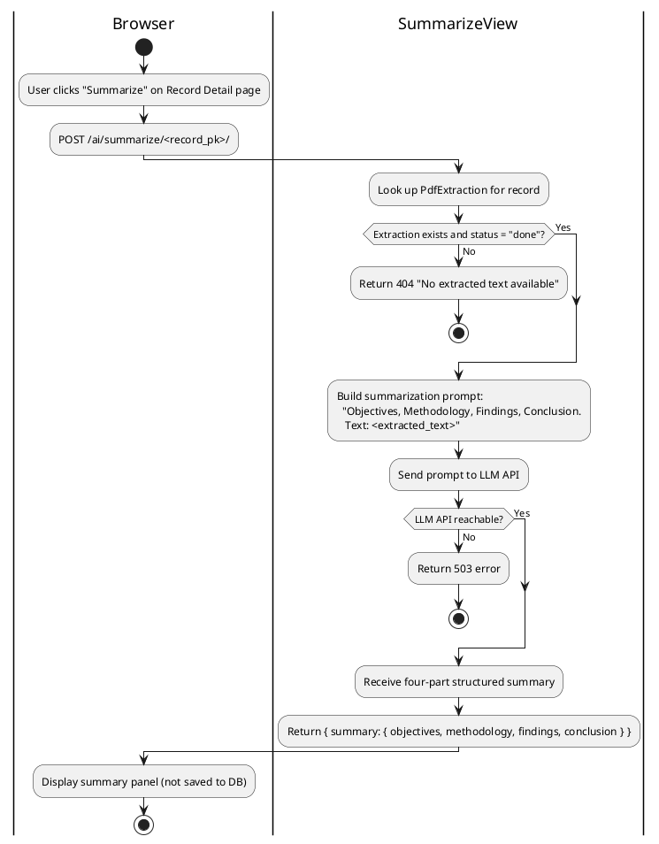
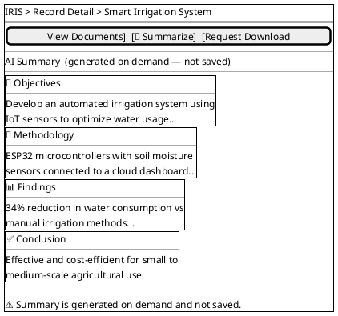

```plantuml
@startuml
scale 0.75
left to right direction

actor "Authenticated User" as User
actor "LLM API" as LLM
actor System

rectangle "FR-M4-01 : AI Q&A with Conversational RAG" {
  usecase "Ask a Question on AI Hub" as UC1
  usecase "Generate Query Embedding" as UC2
  usecase "Retrieve Top-K Similar Records" as UC3
  usecase "Build Context from Ranked Records" as UC4
  usecase "Send Context + Question to LLM API" as UC5
  usecase "Return Grounded Answer + Citations" as UC6
  usecase "Maintain Conversation History\nper Session" as UC7
  usecase "Answer Follow-Up in Context" as UC8
}

User   --> UC1
UC1    ..> UC2 : include
UC2    ..> UC3 : include
UC3    ..> UC4 : include
UC4    ..> UC5 : include
UC5    ..> UC6 : include
UC6    ..> UC7 : include
UC7    ..> UC8 : extend
LLM    --> UC5
System --> UC2
System --> UC3
@enduml
```

# Module 4: RAG AI Services

---

## FR-M4-01 — RAG Chatbot Query Processing and Conversation Management

This FR covers two modes of the AI Research Hub: **Semantic Search** (natural-language ranked retrieval) and **AI Q&A** (conversational RAG with GPT-4.1-mini). Both modes share the same page and the same embedding-based retrieval foundation.

---

### Sub-Feature 4.1.1 — Semantic Search

#### Use Case Diagram

#### Use Case Descriptions

**Table M4-1: Semantic Search over Research Records**

| Use Case | Semantic Search over Research Records |
|---|---|
| Actors | Authenticated User (primary), System |
| Description | An authenticated user enters a natural-language query on the AI Hub page. The system embeds the query using the same third-party embedding API used to index records (FR-M3-03), queries pgvector for the top-K nearest neighbours, and returns the most relevant records ordered by similarity score. |
| Preconditions | The user is authenticated; at least one `RecordEmbedding` exists in the database (FR-M3-03); the third-party embedding API is reachable. |
| Main Flow | 1. The user selects "Semantic Search" mode on the AI Hub page and enters a natural-language query. 2. The user submits the query (Enter key or Search button). 3. System sends the query to the third-party embedding API and receives a query vector. 4. System queries pgvector: `SELECT ... ORDER BY embedding <=> query_vec LIMIT K`. 5. System returns the top-K records (default K=10) ordered by ascending vector distance (descending similarity). 6. The frontend renders each result with title, abstract snippet, authors, year, and a match-percentage bar derived from the score. |
| Alternative Flow | **No embeddings:** If no `RecordEmbedding` rows exist, the system returns an empty list and the page shows "No matching records found." **Empty query:** If the query is blank, the request is not sent. |
| Postconditions | A ranked list of up to K records is displayed with their similarity scores. The user can click any result to navigate to the record detail page. |

#### Activity Diagram

#### Wireframe

---

### Sub-Feature 4.1.2 — AI Q&A with Conversational RAG

#### Use Case Diagram

#### Use Case Descriptions

**Table M4-2: Ask a Question (Single-Turn RAG)**

| Use Case | Ask a Question |
|---|---|
| Actors | Authenticated User (primary), LLM API, System |
| Description | The user asks a free-form natural-language question on the AI Hub. The system embeds the question via the third-party embedding API, retrieves the top-5 most relevant records from pgvector, constructs a context from their titles and abstracts, sends the context and question to the LLM API, and returns a grounded answer with citations to the source records. |
| Preconditions | The user is authenticated; `RecordEmbedding` rows exist; the third-party embedding API and LLM API are reachable. |
| Main Flow | 1. The user selects "Ask a Question" mode on the AI Hub page and types a question. 2. System sends the question to the third-party embedding API → receives query vector. 3. System queries pgvector for the top-5 most relevant records (`ORDER BY embedding <=> q_vec LIMIT 5`). 4. System builds a context string from the records' titles and abstracts. 5. System sends `[system prompt] + [context] + [question]` to the LLM API. 6. LLM generates a grounded answer that cites the retrieved records. 7. System returns `{answer: str, citations: [record_id, ...], message: null}`. 8. Frontend displays the answer and renders citation links to the referenced records. |
| Alternative Flow | **No embeddings:** Returns `{answer: null, citations: [], message: "No embeddings found. Run /ai/embed/all/ to index records first."}`. **LLM API unreachable:** System returns an error message; no answer is displayed. |
| Postconditions | A grounded LLM answer is shown to the user, with clickable citation links to the referenced records. |

**Table M4-3: Follow-Up Question in Conversation**

| Use Case | Follow-Up Question in Conversation |
|---|---|
| Actors | Authenticated User (primary), LLM API, System |
| Description | After receiving an answer, the user asks a follow-up question. The system includes the prior conversation turns in the LLM prompt so the model can resolve pronouns and references from earlier in the session. |
| Preconditions | At least one prior Q&A turn exists in the current session's conversation history. |
| Main Flow | 1. User types a follow-up question (e.g. "Which of those has IP implications?"). 2. System retrieves the session's conversation history (prior question/answer pairs). 3. System embeds the follow-up and retrieves relevant records as in Table M4-2. 4. System constructs the prompt: `[system] + [conversation history] + [retrieved context] + [follow-up]`. 5. LLM generates an answer aware of prior context. 6. The new turn is appended to the session history. |
| Alternative Flow | **Session expired:** If no session history is found, the question is treated as a fresh single-turn query. |
| Postconditions | Follow-up answer displayed; session history updated with the new turn. |

#### Activity Diagrams

##### Sub-Flow A — Single-Turn Q&A

##### Sub-Flow B — Multi-Turn Conversation

#### Wireframe

---

## FR-M4-02 — Full-Text AI Document Summarization

### Use Case Diagram

### Use Case Descriptions

**Table M4-4: Summarize a Record Document**

| Use Case | Summarize a Record Document |
|---|---|
| Actors | Authenticated User (primary), LLM API, System |
| Description | The user clicks "Summarize" on a record detail page. The system retrieves the full extracted text from `PdfExtraction` (FR-M3-01), sends it to the LLM with a structured summarization prompt, and returns a four-part summary on demand. The summary is never persisted — it is generated fresh on each request. |
| Preconditions | The user is authenticated; the record has a `PdfExtraction` with `status = "done"`; the LLM API is reachable. |
| Main Flow | 1. User opens a record detail page and clicks "Summarize." 2. System looks up `PdfExtraction` for the record and reads `extracted_text`. 3. System sends the text to the LLM with the prompt: *"Provide a four-part summary: Objectives, Methodology, Findings, Conclusion."* 4. LLM generates the structured summary. 5. System returns the four-part summary to the frontend. 6. Summary is displayed in an expandable panel on the record detail page. It is **not saved** to the database. |
| Alternative Flow | **No extracted text:** If `PdfExtraction` does not exist or `status ≠ "done"`, the system returns "No extracted text available for this document." **LLM API unreachable:** System returns an error message. |
| Postconditions | The four-part summary is displayed to the user. Nothing is written to the database. |

### Activity Diagram

### Wireframe

