# Module 5: Hierarchical Submission Workflow

---

## FR-M5-01 — Document Routing and IP Evaluation Workflow

### Use Case Diagram
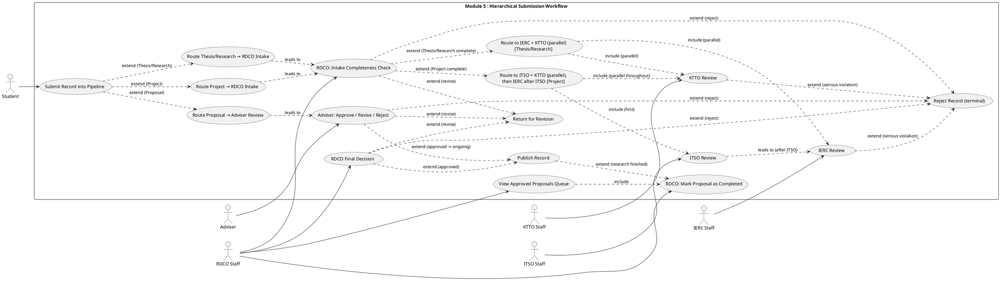

### Use Case Description

| Field | Details |
|---|---|
| **FR ID** | FR-M5-01 |
| **Name** | Document Routing and IP Evaluation Workflow |
| **Actors** | Student, Adviser, RDCO, ITSO, IERC, KTTO |
| **Preconditions** | Record is in `draft` status; record type is set; required documents uploaded |
| **Main Flow — Proposal** | 1. Student submits → `adviser_review` 2. Adviser checks document completeness 3. Adviser approves → `approved` (visible as ongoing) OR declines → back to student for revision (loop) OR rejects → terminal 4. When research is done, RDCO manually marks → `completed` (remains visible) |
| **Main Flow — Thesis/Research** | 1. Student submits → `rdco_intake` 2. RDCO checks completeness 3. If complete → `parallel_review`: IERC reviews Ethics Clearance + Release Form in parallel with KTTO reviewing Patent Search/Draft + IP Status + Pub/Conf + Commercialization Assessment 4. All offices clear → `rdco_review` → RDCO consolidates and approves → `published` |
| **Main Flow — Project** | 1. Student submits → `rdco_intake` 2. RDCO checks completeness 3. If complete → `itso_review`: ITSO reviews NDA + Assessment File; KTTO begins IP & Commercialization review in parallel from this stage 4. ITSO clears → IERC starts Ethics Clearance review; KTTO continues in parallel 5. All three offices clear → `rdco_review` → RDCO consolidates → `published` |
| **Alternative Flow A** | RDCO returns submission for revision (incomplete) → `declined`; student uploads revised documents and resubmits. System validates that at least one new document version exists (uploaded after the most recent declined Review timestamp) before accepting the resubmission. All `RecordClearance` rows are deleted; record re-enters at `rdco_intake`. |
| **Alternative Flow B** | RDCO rejects at intake (out of scope, ineligible) → `rejected` terminal |
| **Alternative Flow C** | Any office (ITSO / IERC / KTTO) declines → `declined`; student uploads revised documents and resubmits. **Smart clearance routing:** the system inspects the `stage` field of the most recent declined `Review`. Only the declining office's `RecordClearance` row is reset to `pending`; all other offices' cleared status is preserved. The record re-enters at the correct stage: ITSO decline → `itso_review`; IERC decline → `parallel_review`; KTTO decline → `itso_review` if ITSO is still pending, otherwise `parallel_review`. The same new-document validation applies. |
| **Alternative Flow D** | Any office (ITSO / IERC / KTTO) rejects (serious violation) → `rejected` terminal |
| **Alternative Flow E** | RDCO final issues revision → `declined`; student uploads revised documents and resubmits. All clearances are deleted; record re-enters at the first stage for its record type. |
| **Alternative Flow F** | RDCO final rejects → `rejected` terminal |
| **Main Flow — Proposal Completion** | 1. RDCO opens the **Approved Proposals** queue (`/review/approved-proposals`) 2. RDCO sees all records with `pipeline_status = "approved"` (only Proposals can reach this status) 3. RDCO clicks "Mark as Completed" on the target row 4. System calls `POST /records/<id>/complete/`, transitions record to `completed` 5. Row is removed from the queue; record owners are notified 6. Record remains publicly visible with "Completed" badge |
| **Postconditions** | Record status reflects current pipeline stage; transitions enforced server-side via RecordClearance rows for parallel stages; completed Proposals remain visible in Browse Collections |

### Activity Diagram
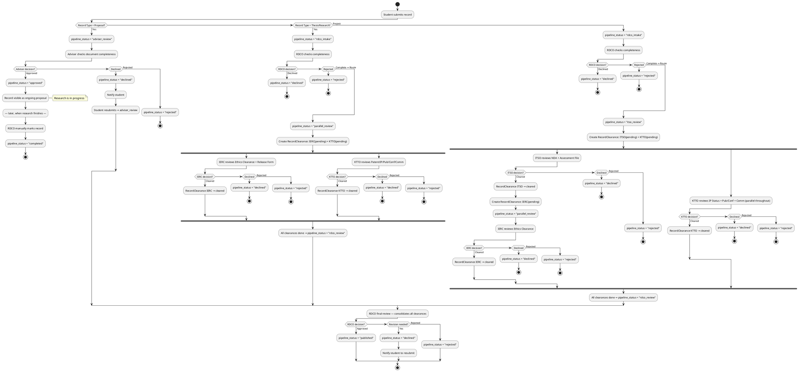

### Wireframe
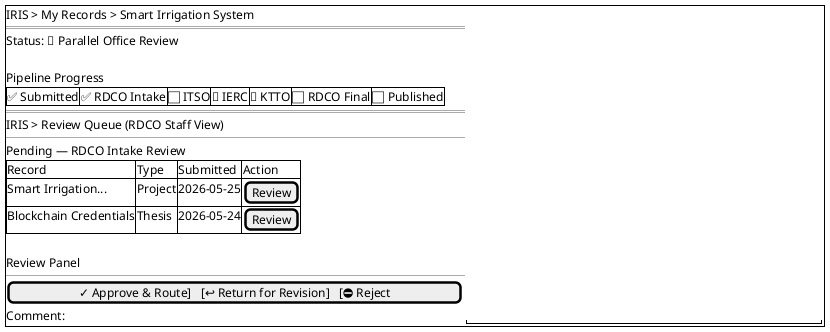

### Wireframe — Approved Proposals Queue (RDCO View)
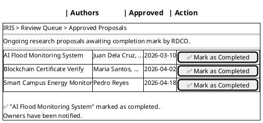

---

## FR-M5-02 — Auth PIN for Gated Record Access

### Use Case Diagram
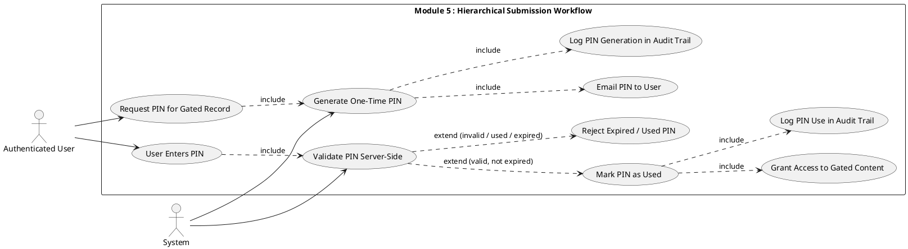

### Use Case Description

| Field | Details |
|---|---|
| **FR ID** | FR-M5-02 |
| **Name** | Auth PIN for Gated Record Access |
| **Actors** | Authenticated User (primary), System |
| **Preconditions** | User is authenticated; record requires PIN-based access authorization |
| **Main Flow** | 1. User requests access to a gated record 2. System invalidates any previous unused PINs for this user+record 3. System generates a one-time 6-digit PIN with a 24-hour expiry 4. System emails the PIN to the user 5. System logs a PIN generation event in the audit trail 6. User enters the PIN in the verification form 7. System validates: PIN matches, `is_used = false`, `expires_at > now()` 8. System marks PIN as used (`is_used = true`) 9. System grants access to the gated content 10. PIN use event logged in the audit trail |
| **Alternative Flow A** | PIN already used → "Invalid or already used PIN" error |
| **Alternative Flow B** | PIN expired (`expires_at ≤ now()`) → same "Invalid or already used PIN" error (no detail disclosed for security) |
| **Alternative Flow C** | Wrong PIN → same error |
| **Postconditions** | PIN marked as used; access granted; both events logged |

### Activity Diagram
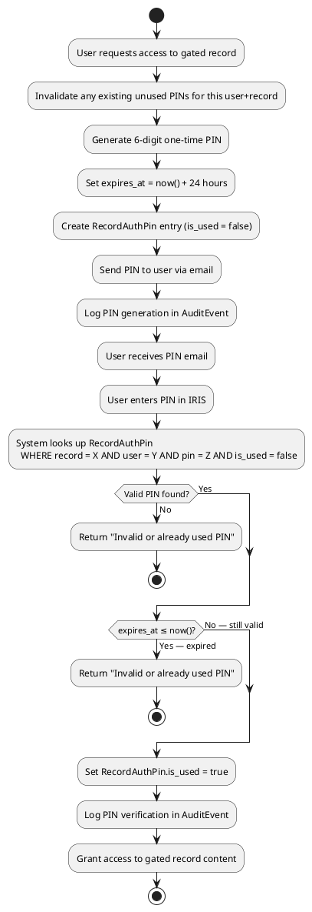

### Wireframe
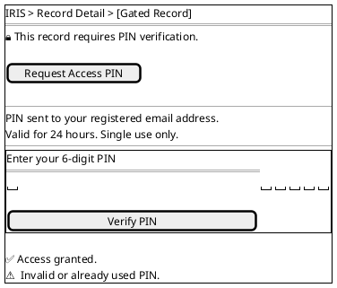

---

## FR-M5-03 — Document-Level Review and Status Transitions

### Use Case Diagram
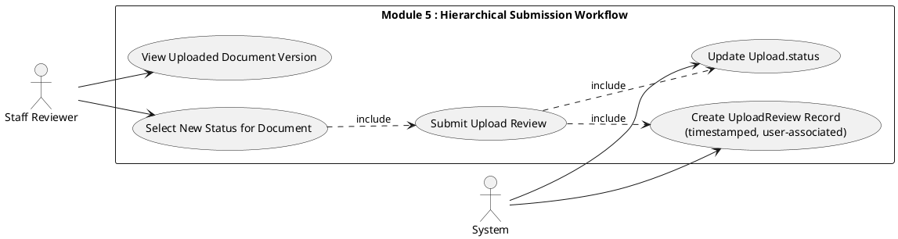

### Use Case Description

| Field | Details |
|---|---|
| **FR ID** | FR-M5-03 |
| **Name** | Document-Level Review and Status Transitions |
| **Actors** | Staff Reviewer (primary), System |
| **Preconditions** | Staff is authenticated with a reviewer role; a document upload exists for the record |
| **Main Flow** | 1. Staff opens a record's document view 2. Staff selects a document version to review 3. Staff chooses a new status (e.g., For Application, Reviewed, Filed, Approved, Disapproved) 4. Staff optionally adds a comment 5. Staff submits the review via POST `/documents/upload-reviews/` 6. System creates an `UploadReview` record with timestamp and acting user 7. System mirrors the new status onto `RecordUpload.status` |
| **Alternative Flow A** | Upload or status not found → HTTP 404 |
| **Postconditions** | `UploadReview` created; `RecordUpload.status` updated; timestamp and reviewer identity recorded |

### Activity Diagram
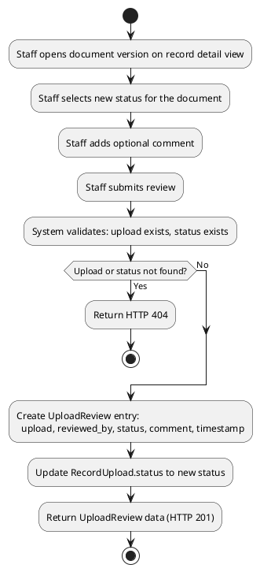

### Wireframe
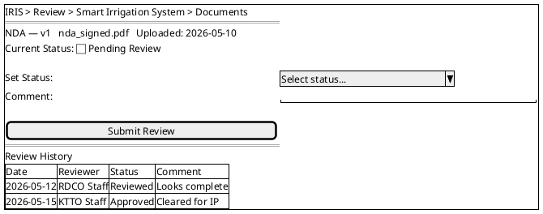

---

## FR-M5-04 — Pipeline Event Notifications

### Use Case Diagram
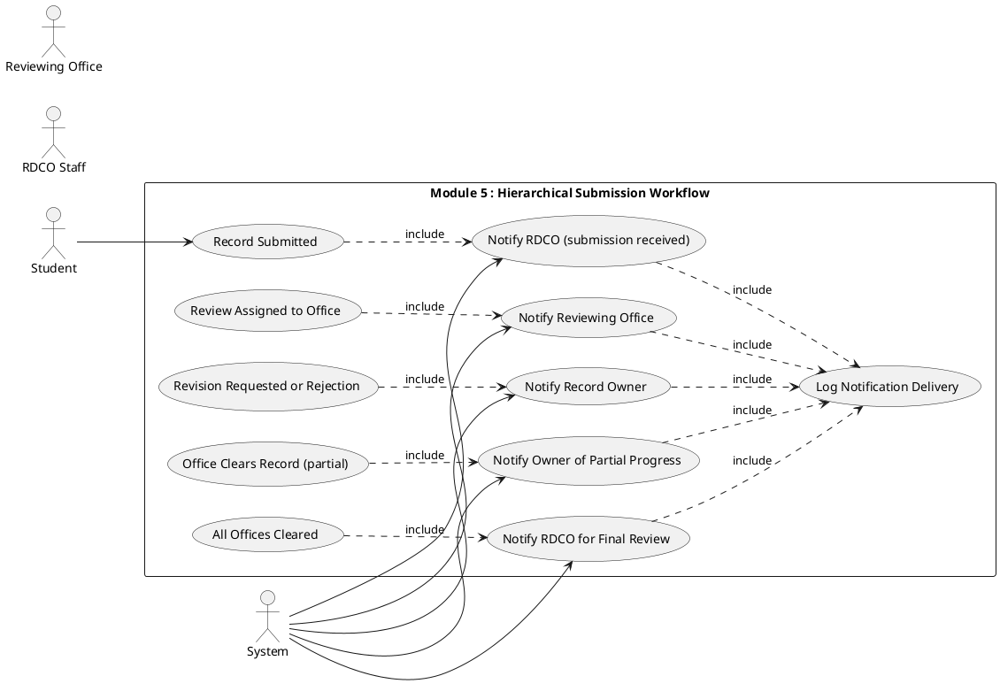

### Use Case Description

| Field | Details |
|---|---|
| **FR ID** | FR-M5-04 |
| **Name** | Pipeline Event Notifications |
| **Actors** | Student/Owner, RDCO, Reviewing Office, System |
| **Preconditions** | A pipeline status transition has occurred |
| **Main Flow** | 1. A workflow transition occurs 2. System determines recipients by event type: · Submission → RDCO (or Adviser for Proposals) · Routed to offices → each reviewing office · Resubmission after clearance decline → only the offices with pending `RecordClearance` rows (IERC, KTTO, and/or ITSO as applicable) · Resubmission after non-clearance decline → RDCO or Adviser (same as initial submission) · Partial clearance → record owner · All offices cleared → RDCO (final review) + owner · Decline/rejection → record owner 3. System dispatches in-app notification to each recipient 4. Delivery status is logged |
| **Alternative Flow A** | Notification delivery fails → Failure is logged |
| **Postconditions** | In-app notifications sent to all relevant parties; delivery logged |

### Activity Diagram
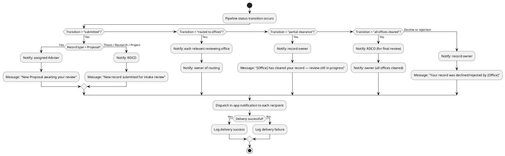

### Wireframe
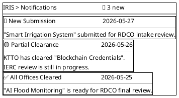

---

## FR-M5-05 — Record IP Classification and Tagging

### Use Case Diagram
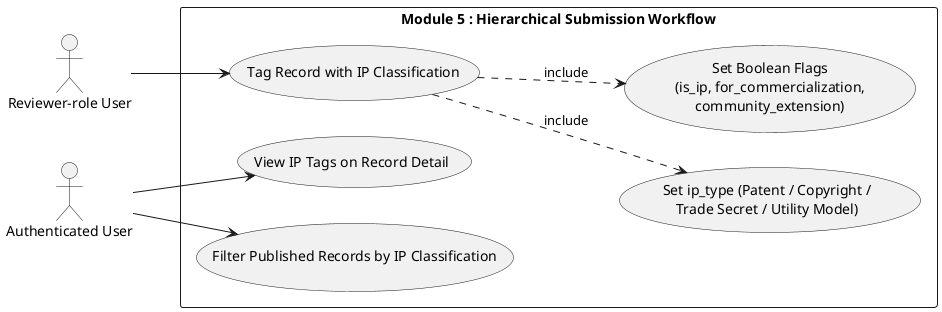

### Use Case Description

| Field | Details |
|---|---|
| **FR ID** | FR-M5-05 |
| **Name** | Record IP Classification and Tagging |
| **Actors** | Reviewer-role User (Adviser, KTTO, RDCO, ITSO, IERC) (primary), Authenticated User |
| **Preconditions** | User is authenticated with a reviewer role (Adviser, KTTO, RDCO, ITSO, or IERC); record exists |
| **Main Flow** | 1. Reviewer-role user opens a record after RDCO final review 2. Reviewer-role user sets the structured `ip_type` label: Patent, Copyright, Trade Secret, or Utility Model (or clears it with "") 3. Reviewer-role user sets boolean flags: `is_ip`, `for_commercialization`, `community_extension` 4. Reviewer-role user submits via PATCH `/records/<id>/tags/` 5. System validates and saves 6. IP tags visible on record detail and filterable in browse interface |
| **Alternative Flow A** | Invalid `ip_type` value → "Not a valid ip_type" error |
| **Alternative Flow B** | Boolean field sent as non-boolean → Error |
| **Alternative Flow C** | `ip_type = ""` clears the IP classification label |
| **Postconditions** | IP tags saved; visible on record detail; filterable; ACCESS audit event logged |

### Activity Diagram
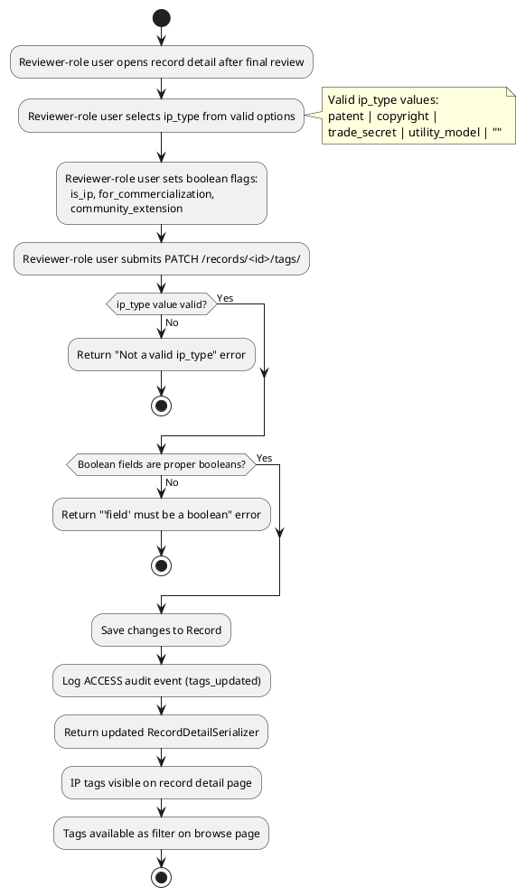

### Wireframe
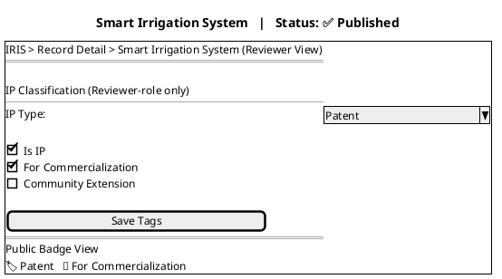
