# Module 6: Security and Authentication

---

## FR-M6-01 — JWT Token Enforcement and Session Lifecycle

### Use Case Diagram
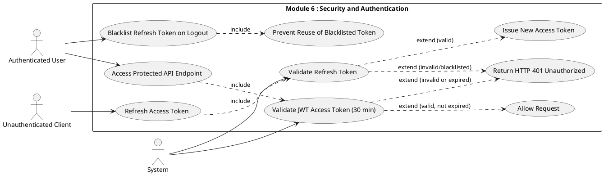

### Use Case Description

| Field | Details |
|---|---|
| **FR ID** | FR-M6-01 |
| **Name** | JWT Token Enforcement and Session Lifecycle |
| **Actors** | Authenticated User (primary), Unauthenticated Client, System |
| **Preconditions** | JWT tokens issued at login via djangorestframework-simplejwt |
| **Main Flow** | 1. Client includes JWT access token in `Authorization: Bearer <token>` header 2. DRF validates the token (signature, expiry — 30 minutes) 3. If valid, request proceeds 4. When access token expires, client sends refresh token to the refresh endpoint 5. System validates the refresh token (not blacklisted, not expired) 6. System issues a new access token 7. On logout, client sends refresh token to blacklist endpoint 8. System blacklists the token via simplejwt's token blacklist |
| **Alternative Flow A** | Access token expired/invalid → HTTP 401; client should refresh |
| **Alternative Flow B** | Refresh token is blacklisted → HTTP 401; user must log in again |
| **Postconditions** | Only valid, non-blacklisted tokens grant access; logout is permanent for that refresh token |

### Activity Diagram
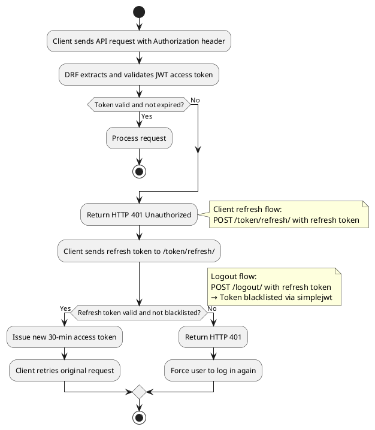

### Wireframe
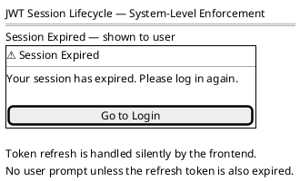

---

## FR-M6-02 — Role-Based Access Control Enforcement

### Use Case Diagram
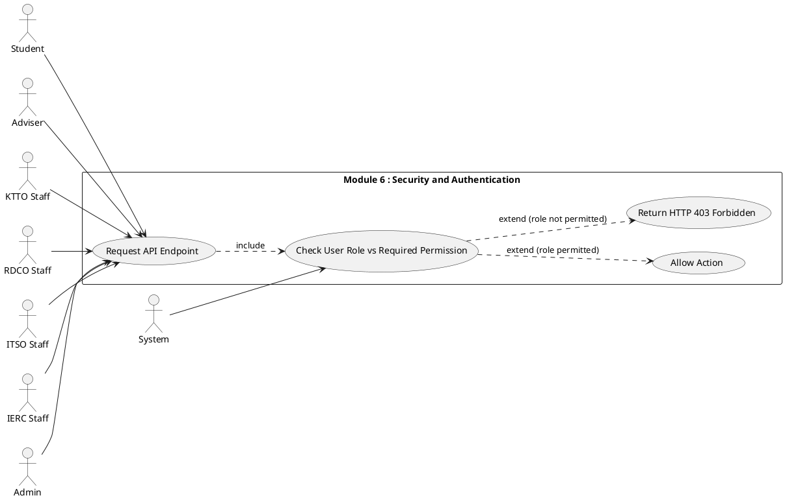

### Use Case Description

| Field | Details |
|---|---|
| **FR ID** | FR-M6-02 |
| **Name** | Role-Based Access Control Enforcement |
| **Actors** | All roles (primary), System |
| **Preconditions** | User is authenticated; role is assigned to the user account |
| **Main Flow** | 1. Authenticated user sends a request to any API endpoint 2. DRF permission class checks the user's assigned role against the endpoint's required permission 3. If the role is permitted, the request proceeds 4. Role checks are enforced server-side regardless of what the frontend renders |
| **Role Mapping** | Student: submit/view own records · Adviser: review Proposals · KTTO: review IP/commercialization · RDCO: intake + final review, manage users · ITSO: review Projects · IERC: ethics review · Admin: all operations |
| **Alternative Flow A** | User's role does not meet the required permission → HTTP 403 Forbidden |
| **Alternative Flow B** | User has no role assigned → Treated as lowest-privilege; most actions blocked |
| **Postconditions** | Only permitted actions succeed; all permission checks are server-side |

### Activity Diagram
```plantuml
@startuml
start
:Authenticated user sends API request;
:DRF extracts user role from JWT / DB;
:Check endpoint permission class
  (IsAdmin / IsStaff / IsReviewer /
   IsOwnerOrStaff / IsAuthenticated);
if (Role satisfies permission?) then (Yes)
  :Process request;
else (No)
  :Return HTTP 403 Forbidden;
endif
stop
@enduml
```

### Wireframe
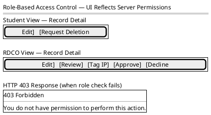

---

## FR-M6-03 — Role Request and Approval Flow

### Use Case Diagram
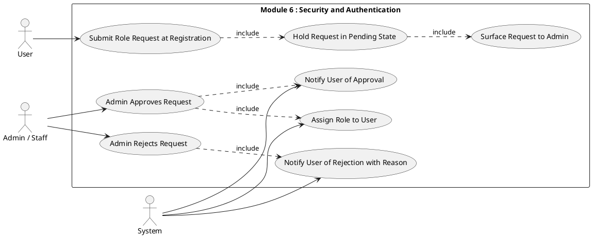

### Use Case Description

| Field | Details |
|---|---|
| **FR ID** | FR-M6-03 |
| **Name** | Role Request and Approval Flow |
| **Actors** | User (primary), Django Admin (`is_staff = True`), System |
| **Preconditions** | User has registered and verified their email |
| **Main Flow** | 1. During registration, user selects Student or Adviser role (roles that require admin approval) 2. System creates a RoleRequest with `status = "pending"` 3. The request is surfaced on the Admin Portal Role Requests page (Django Admin only) 4. Admin approves → role assigned + user notified |
| **Approver by role** | Student and Adviser requests → approved by Django Admin (`is_staff = True`) only · Staff accounts (RDCO, KTTO, ITSO, IERC) → managed directly by Admin (superuser) |
| **Alternative Flow A** | Admin rejects → `RoleRequest.status = "declined"`; user notified with reason |
| **Alternative Flow B** | User logs in while request is pending → Redirected to Pending Approval screen |
| **Postconditions** | User's role updated (if approved); user notified of outcome |

### Activity Diagram
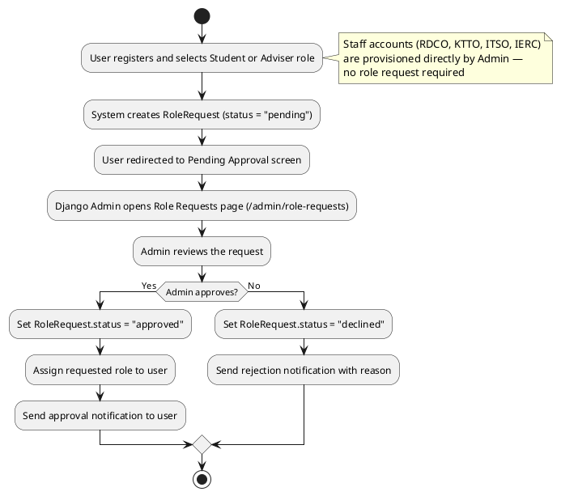

### Wireframe
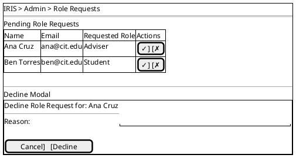

---

## FR-M6-04 — Account Management (Lock, Unlock, Role Change)

### Use Case Diagram
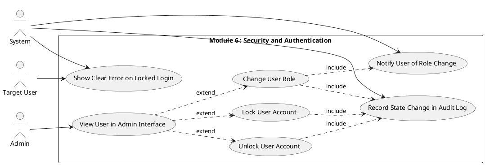

### Use Case Description

| Field | Details |
|---|---|
| **FR ID** | FR-M6-04 |
| **Name** | Account Management (Lock, Unlock, Role Change) |
| **Actors** | Admin (primary), Target User, System |
| **Preconditions** | Admin is authenticated; target user account exists |
| **Main Flow — Lock** | 1. Admin navigates to user detail 2. Admin clicks "Lock Account" 3. System sets `is_locked = true` 4. State change recorded in audit log 5. Locked user attempting to login receives "Account is locked" error |
| **Main Flow — Unlock** | 1. Admin clicks "Unlock Account" 2. System sets `is_locked = false` 3. System clears django-axes AccessAttempt records for the email 4. State change recorded in audit log |
| **Main Flow — Role Change** | 1. Admin selects a new role 2. System updates `user.role` 3. System sends role change notification email 4. State change recorded in audit log |
| **Postconditions** | Account state reflects the change; all changes recorded in audit log |

### Activity Diagram
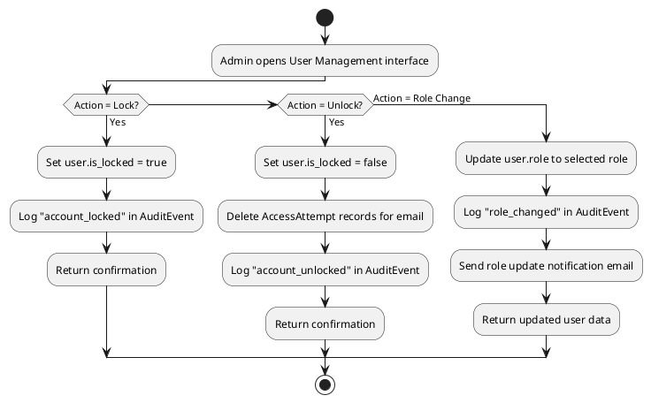

### Wireframe
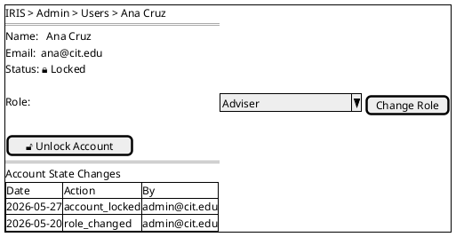

---

## FR-M6-05 — Active Session Monitoring and Revocation

### Use Case Diagram
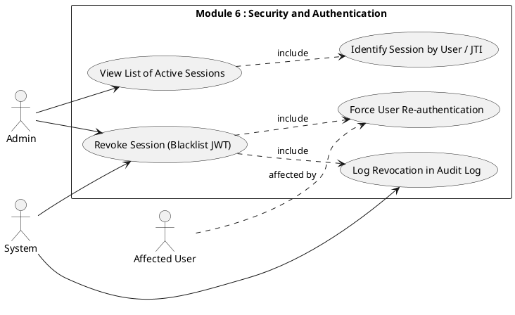

### Use Case Description

| Field | Details |
|---|---|
| **FR ID** | FR-M6-05 |
| **Name** | Active Session Monitoring and Revocation |
| **Actors** | Admin (primary), Affected User, System |
| **Preconditions** | Admin is authenticated; JWT refresh tokens exist in OutstandingToken |
| **Main Flow** | 1. Admin navigates to Active Sessions page 2. System returns all non-expired, non-blacklisted JWT refresh tokens with associated user info 3. Admin identifies a session to revoke 4. Admin clicks "Revoke" 5. System creates a `BlacklistedToken` entry 6. System logs a LOGOUT audit event with `action = "admin_revoke"` 7. Affected user's next request returns HTTP 401 |
| **Alternative Flow A** | JTI not found → HTTP 404 "Session not found" |
| **Postconditions** | Token blacklisted; user forced to re-authenticate; revocation in audit log |

### Activity Diagram
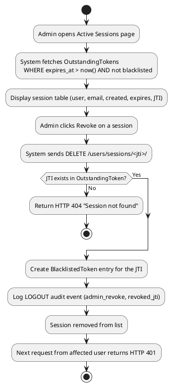

### Wireframe
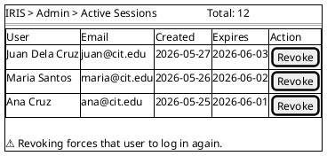

---

## FR-M6-06 — Data Privacy Consent and Audit Logging

### Use Case Diagram
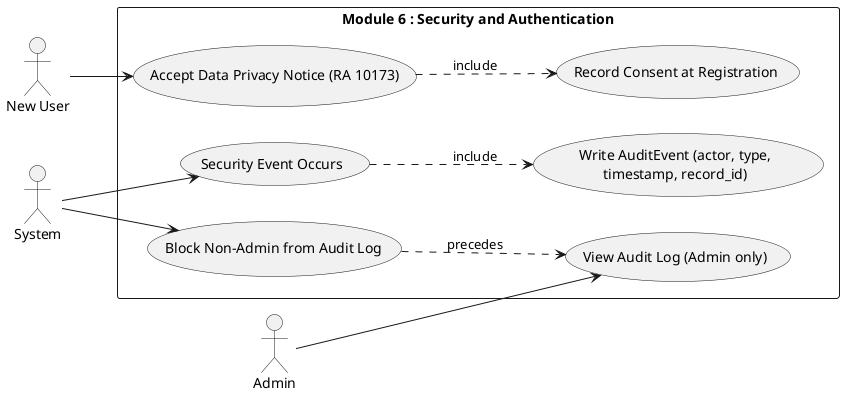

### Use Case Description

| Field | Details |
|---|---|
| **FR ID** | FR-M6-06 |
| **Name** | Data Privacy Consent and Audit Logging |
| **Actors** | New User (primary), System, Admin |
| **Preconditions** | RA 10173 (Data Privacy Act) compliance required |
| **Main Flow — Consent** | 1. During registration, user is shown the Data Privacy Notice 2. User checks "I agree" before submitting 3. System records consent in the user account |
| **Main Flow — Audit Logging** | 1. A security-relevant event occurs 2. System writes an `AuditEvent` with: actor identity, event type, timestamp, associated record ID (if applicable) 3. Audit log is read-only to all roles except Admin |
| **Tracked Events** | LOGIN · LOGOUT · FAILED_LOGIN · PIN_GENERATED · PIN_VERIFIED · UPLOAD · DOWNLOAD · DELETE · RENAME · ACCESS · ROLE_CHANGE · ACCOUNT_LOCKED · ACCOUNT_UNLOCKED · SESSION_REVOKE |
| **Postconditions** | Consent recorded; all security events in the immutable audit trail; only Django Admin (IT administration, `is_staff = True`) can read the log — IRIS role users including RDCO and KTTO cannot access it |

### Activity Diagram
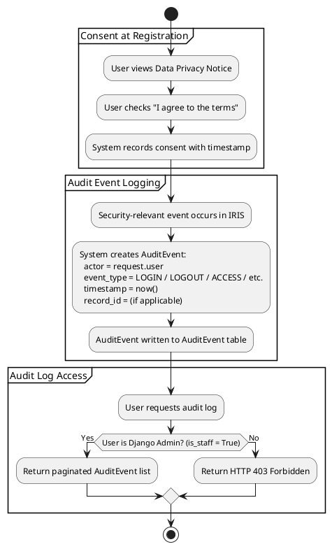

### Wireframe
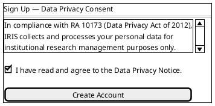

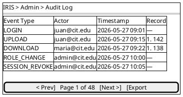
