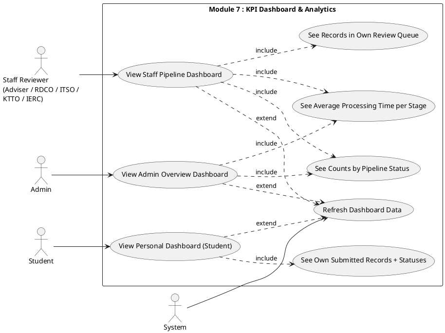
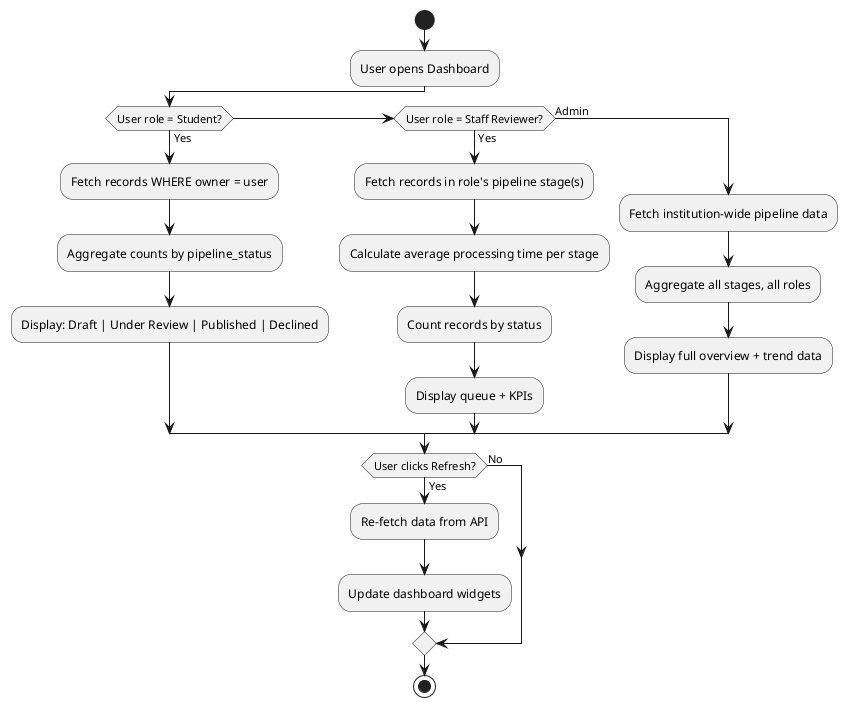
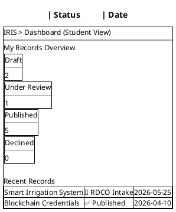
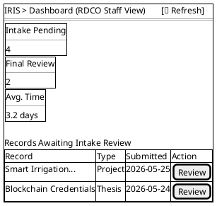
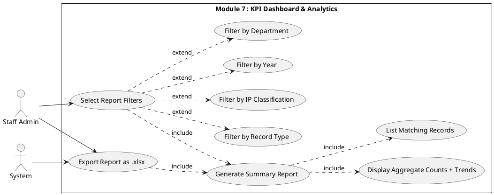
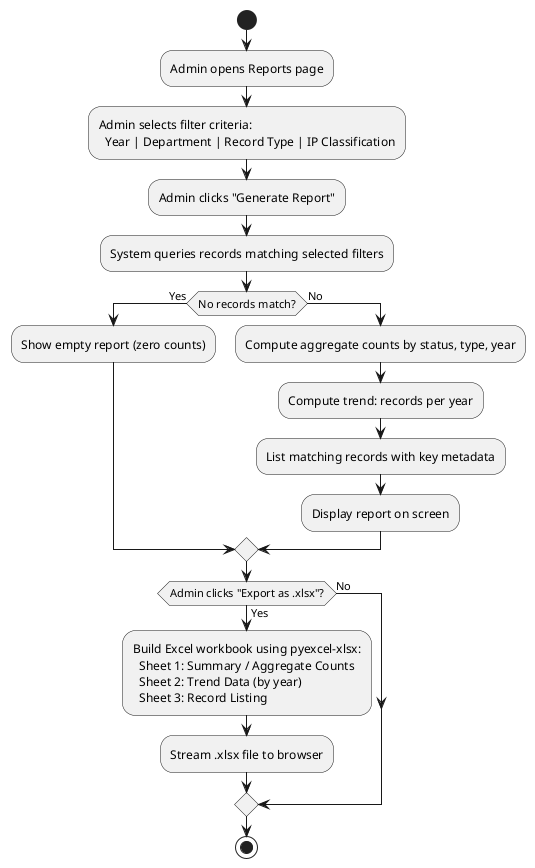
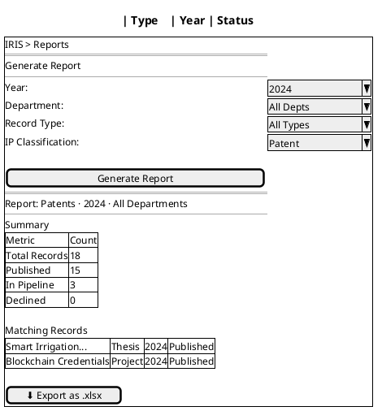

# Module 7: KPI Dashboard & Analytics

---

## FR-M7-01 — Role-Differentiated Pipeline Monitoring Dashboard

### Use Case Diagram

### Use Case Description

| Field | Details |
|---|---|
| **FR ID** | FR-M7-01 |
| **Name** | Role-Differentiated Pipeline Monitoring Dashboard |
| **Actors** | Student (primary), Staff Reviewer, Admin, System |
| **Preconditions** | User is authenticated |
| **Main Flow — Student** | 1. Student navigates to Dashboard 2. System displays the student's own submitted records with their current `pipeline_status` 3. Student sees Draft, Under Review, Published, Declined counts |
| **Main Flow — Staff Reviewer** | 1. Staff navigates to Dashboard 2. System displays records in the staff member's pipeline queue (role-filtered) 3. Dashboard shows: count of pending reviews, average processing time per stage, status breakdown |
| **Main Flow — Admin** | 1. Admin views an overview dashboard with all pipeline stages, all roles, institution-wide counts and processing times |
| **Refresh** | Dashboard data refreshes on page load; manual refresh button available |
| **Postconditions** | Dashboard reflects the current state of the pipeline for the user's role |

> **Planned endpoint — not yet implemented:** `GET /reviews/analytics/` — returns per-stage average processing time (average days a record spends at each review stage, computed from `Review` timestamps, excluding in-flight records). Planned for a future sprint; stub returns HTTP 501.

### Activity Diagram

### Wireframe

---

## FR-M7-02 — Report Generation and Export

### Use Case Diagram

### Use Case Description

| Field | Details |
|---|---|
| **FR ID** | FR-M7-02 |
| **Name** | Report Generation and Export |
| **Actors** | Staff Admin (primary), System |
| **Preconditions** | Admin is authenticated; records exist in the database |
| **Main Flow** | 1. Admin navigates to the Reports section 2. Admin selects filter criteria: Year, Department, Record Type, IP Classification 3. Admin clicks "Generate Report" 4. System queries records matching the filter criteria 5. Report displays: aggregate counts, trend data (records per year), listing of matching records 6. Admin clicks "Export as .xlsx" 7. System generates the Excel file using pyexcel-xlsx 8. Browser downloads the report file |
| **Alternative Flow A** | No records match the filters → Report shows zero counts and empty listing |
| **Alternative Flow B** | Export with no filter applied → Full institution-wide report generated |
| **Postconditions** | Report displayed on-screen; .xlsx file downloadable with aggregate counts, trends, and record listing |

### Activity Diagram

### Wireframe

