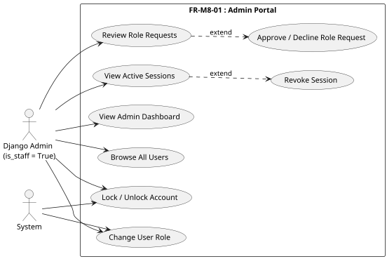
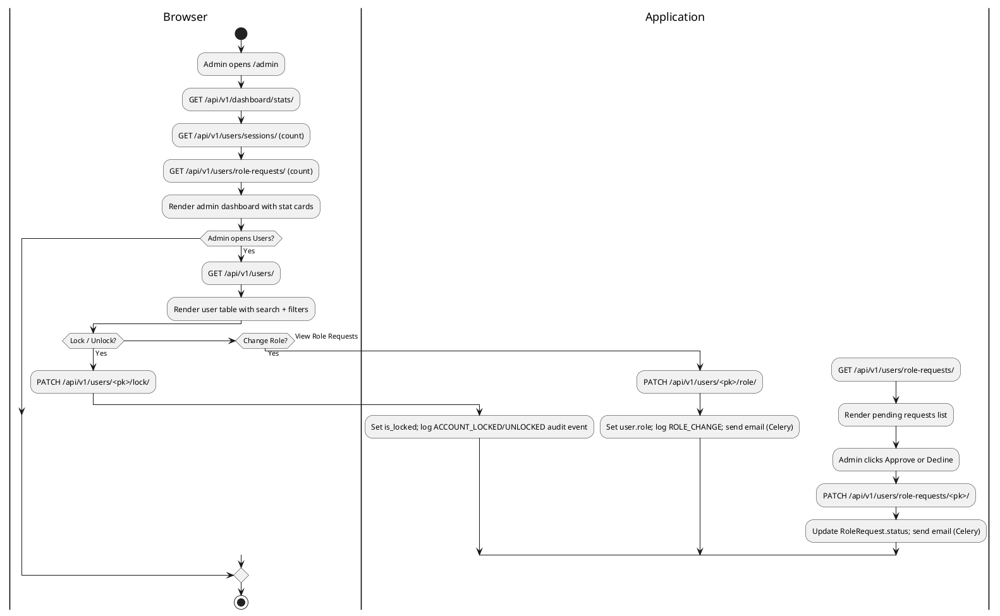
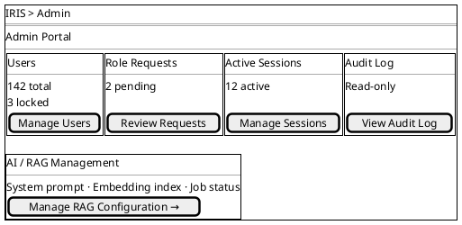
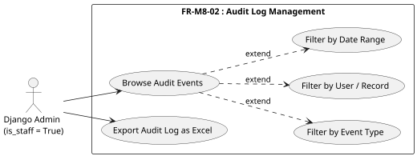
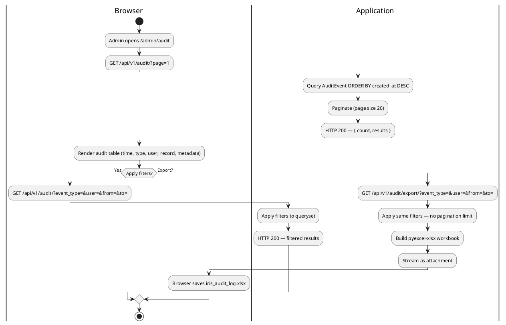
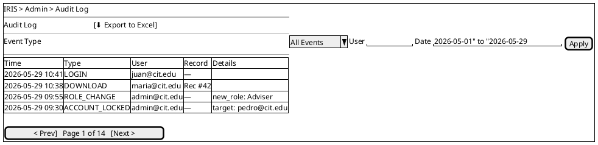
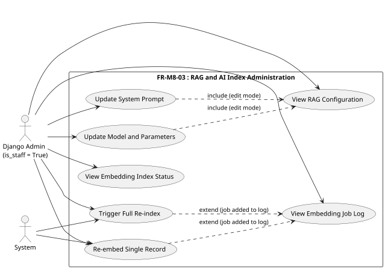
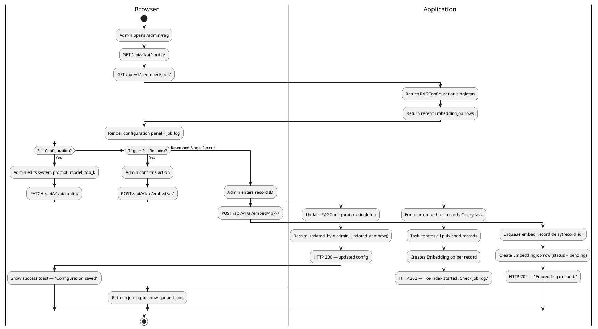
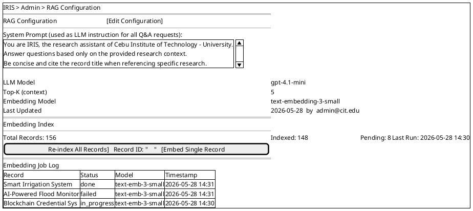

# Module 8: Admin Portal

---

## FR-M8-01 — Admin Portal Overview and User Administration

### Use Case Diagram

### Use Case Descriptions

**Table M8-1: Admin Portal Overview**

| Use Case | Admin Portal Overview |
|---|---|
| Actors | Django Admin (is_staff = True) |
| Description | The Admin Portal is a restricted section of IRIS accessible only to Django admin accounts (`is_staff = True`). It provides a unified landing page with summary statistics and quick-access links to all administration tools: user management, role requests, active sessions, audit log, and RAG/AI configuration. |
| Preconditions | The user is authenticated and `is_staff = True` (Django admin account). |
| Main Flow | 1. Admin navigates to `/admin`. 2. The system renders the admin landing page with quick-stat cards: total users, active sessions count, pending role requests count, locked accounts count. 3. Admin clicks a card or sidebar link to navigate to any administration subsection. |
| Alternative Flow | **Non-admin access attempt:** Any user without `is_staff = True` who navigates to `/admin` is redirected to the 403 Forbidden page. |
| Postconditions | Admin accesses the desired administration subsection. |

**Table M8-2: User Administration**

| Use Case | User Administration |
|---|---|
| Actors | Django Admin |
| Description | Admin views the full user roster, locks or unlocks accounts, changes user roles, and processes pending role requests. These actions are identical to those documented in FR-M6-04 (Account Management) and FR-M6-03 (Role Request Approval); the Admin Portal provides a consolidated UI for all of them. |
| Preconditions | Admin is authenticated with `is_staff = True`. |
| Main Flow — Browse Users | 1. Admin opens the Users page. 2. System returns all users ordered by `date_joined` descending. Admin can search by name/email and filter by role. |
| Main Flow — Lock / Unlock | 1. Admin clicks the lock toggle on a user row. 2. System sets `user.is_locked = True` (or False), logs `ACCOUNT_LOCKED` / `ACCOUNT_UNLOCKED` audit event. |
| Main Flow — Change Role | 1. Admin selects a new role from a dropdown on a user row. 2. System updates `user.role`, logs `ROLE_CHANGE` audit event, sends role-change email. |
| Main Flow — Role Requests | 1. Admin opens the Role Requests page. 2. System lists pending `RoleRequest` rows. 3. Admin approves or declines each request. 4. System updates the request status and notifies the user by email. |
| Alternative Flow | **No pending requests:** Role Requests page shows an empty state. |
| Postconditions | User accounts are updated. Relevant audit events are recorded. |

### Activity Diagram

### Wireframe

---

## FR-M8-02 — Audit Log Management

### Use Case Diagram

### Use Case Descriptions

**Table M8-3: Audit Log Management**

| Use Case | Audit Log Management |
|---|---|
| Actors | Django Admin (is_staff = True) |
| Description | Admin views a reverse-chronological, paginated list of all system audit events. Events can be filtered by type, user, record, and date range. Admin can export the filtered result as an Excel workbook for compliance or incident investigation purposes. The audit log is read-only — no event can be created, edited, or deleted through this interface. |
| Preconditions | Admin is authenticated with `is_staff = True`. |
| Main Flow — Browse | 1. Admin navigates to the Audit Log page. 2. System returns the most recent 20 audit events ordered by `created_at` descending. 3. Admin applies optional filters: event type (dropdown), user (search), record ID, date range. 4. The system re-fetches with the filters applied and renders results. |
| Main Flow — Export | 1. Admin applies optional filters, then clicks "Export to Excel." 2. The system generates an Excel workbook containing all matching events (no pagination cap) and triggers a browser download. Columns: Time, Event Type, User Email, Record ID, Metadata. |
| Alternative Flow | **No matching events:** System renders an empty-state message "No audit events match the selected filters." |
| Postconditions | Admin views or downloads the audit record. The audit log itself is not modified. |

### Activity Diagram

### Wireframe

---

## FR-M8-03 — RAG and AI Index Administration

### Use Case Diagram

### Use Case Descriptions

**Table M8-4: View and Update RAG Configuration**

| Use Case | View and Update RAG Configuration |
|---|---|
| Actors | Django Admin |
| Description | Admin views the current RAG (Retrieval-Augmented Generation) configuration used by the AI Q&A and summarization features. The configuration includes: the system prompt (the instruction given to the LLM before context and question), the LLM model name, the number of context records retrieved per query (top-K), and the embedding model name. Admin can update any of these fields; changes take effect immediately on the next AI request. |
| Preconditions | Admin is authenticated with `is_staff = True`. |
| Main Flow — View | 1. Admin navigates to `/admin/rag`. 2. System returns the current `RAGConfiguration` singleton. 3. Admin sees the current system prompt, model names, and top-K value. |
| Main Flow — Update | 1. Admin clicks "Edit Configuration." 2. A form loads pre-filled with current values. 3. Admin edits the system prompt and/or model parameters. 4. Admin clicks Save. 5. System updates the `RAGConfiguration` singleton, records `updated_by = request.user` and `updated_at = now()`. 6. The updated configuration is immediately used by `AskView` on the next `/ai/ask/` request. |
| Alternative Flow | **Validation failure:** If required fields (system prompt) are blank, the system returns HTTP 400 with field errors. |
| Postconditions | The RAG configuration is updated. All subsequent AI Q&A requests use the new system prompt and parameters. |

**Table M8-5: Embedding Index Management**

| Use Case | Embedding Index Management |
|---|---|
| Actors | Django Admin |
| Description | Admin views the current state of the vector embedding index (how many records have embeddings, how many are pending, the last run timestamp). Admin can trigger a full re-index of all records (re-embed every record using the current embedding model), or trigger a targeted re-embed for a single record. All embedding operations run asynchronously via Celery and are tracked as `EmbeddingJob` rows. |
| Preconditions | Admin is authenticated with `is_staff = True`. |
| Main Flow — View Status | 1. Admin opens the Embedding Index section. 2. System returns: total published records, number with a current `RecordEmbedding`, number pending (no embedding or last embedded before current model), and the timestamp of the most recent job. |
| Main Flow — Full Re-index | 1. Admin clicks "Re-index All Records." 2. System confirms the action. 3. System calls `POST /ai/embed/all/` which enqueues an `embed_all_records` Celery task. 4. The task iterates all published records and calls `embed_record.delay(record_id)` for each. Job progress is visible in the Embedding Job Log. |
| Main Flow — Re-embed Single Record | 1. Admin enters a record ID and clicks "Embed Record." 2. System calls `POST /ai/embed/<pk>/` which enqueues `embed_record.delay(record_id)` for that record. |
| Main Flow — View Job Log | 1. Admin sees the Embedding Job Log below the index status. Each row shows: record title, embedding status (pending / in_progress / done / failed), model name, and timestamp. Admin can filter by status. |
| Alternative Flow | **No published records:** System shows "No records to index." **Job already running:** If a full re-index is already in progress, the system returns a message "Re-index already running. Check the job log for progress." |
| Postconditions | Embedding jobs are queued and will be processed by Celery workers. The job log updates as each job completes. |

### Activity Diagram

### Wireframe

